# Image registry - borth-coastal-defence-reef

Source of truth: `images.json` in this folder (convention: `_agent_briefs/image_registry.md`; overview: `03_images/reefs/README.md`). This file is generated from it.

30 images registered, 30 with a file, 22 used for the model (any use other than context/not_used).

## borth-coastal-defence-reef-img-01 - A bigger splash, Borth sea defences (rock-armour barge, April 2011)

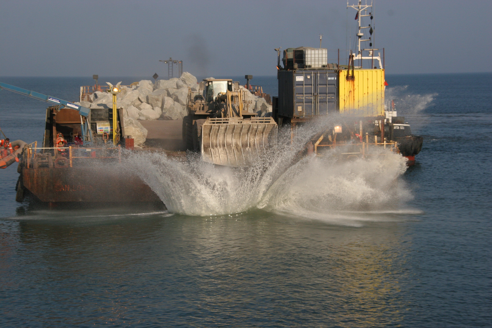

- **file**: `03_images/reefs/borth-coastal-defence-reef/borth-coastal-defence-reef_bigger-splash-barge_2011-04.jpg`
- **kind**: photo
- **shows**: A barge ('CAN LORO', tug 'AFON GOCH') loaded with white rock armour and a wheeled loader throws up a bow-wave off Borth; the rock for the reef is on deck, the reef itself is not yet built or visible.
- **structure visible**: False
- **state shown**: pre-construction (works in progress, 2011-04-19)
- **image date**: 2011-04-19
- **citation**: Denny, Chris (2011-04-19). A bigger splash, Borth sea defences. Geograph Britain and Ireland photo 2366565 (https://www.geograph.org.uk/photo/2366565), via Wikimedia Commons, File:A bigger splash, Borth sea defences - geograph.org.uk - 2366565.jpg. https://commons.wikimedia.org/wiki/File:A_bigger_splash,_Borth_sea_defences_-_geograph.org.uk_-_2366565.jpg. Accessed 2026-10-06.
- **image URL**: https://upload.wikimedia.org/wikipedia/commons/0/06/A_bigger_splash%2C_Borth_sea_defences_-_geograph.org.uk_-_2366565.jpg
- **source page**: https://commons.wikimedia.org/wiki/File:A_bigger_splash,_Borth_sea_defences_-_geograph.org.uk_-_2366565.jpg
- **page / figure**: whole photo
- **credit**: Chris Denny / Geograph Britain and Ireland (geograph.org.uk), via Wikimedia Commons
- **licence**: CC BY-SA 2.0 (https://creativecommons.org/licenses/by-sa/2.0) - attribution required, share-alike
- **retrieved**: 2026-10-06
- **used for**: context
- **How used for the model**: Page illustration only: shows the rock-armour supply for the 2011 coastal-defence/reef works. Nothing was measured from it; the reef outline comes from the Esri satellite imagery (shape.json sat2024, sat2022, sat2012).
- **3D check pending**: no - Verified 2026-10-06 (shape verification). Construction-period photo or video frame: shows rock placement and the causeway, cannot confirm a level or a plan value (2011 works, before the final survey). Nothing pending.
- **linked records**: 05_qa/reef/borth-coastal-defence-reef_media_recheck.json (images[0]); 02_research/reefs/borth-coastal-defence-reef.json images[0]
- **size**: 3.41 MB, 3504x2336 px
- **sha256**: 4144a3737bb6d61bd82f5923e3bb1a1a180a5d567c8a75d51dc54075125e2569
- **rights**: Private research copy; reuse rights to be checked before any public release.
- **display in HTML**: True
- **added by**: image-registry backfill, 2026-10-06

## borth-coastal-defence-reef-img-02 - Coastal protection works at Borth (beach closed, July 2011)

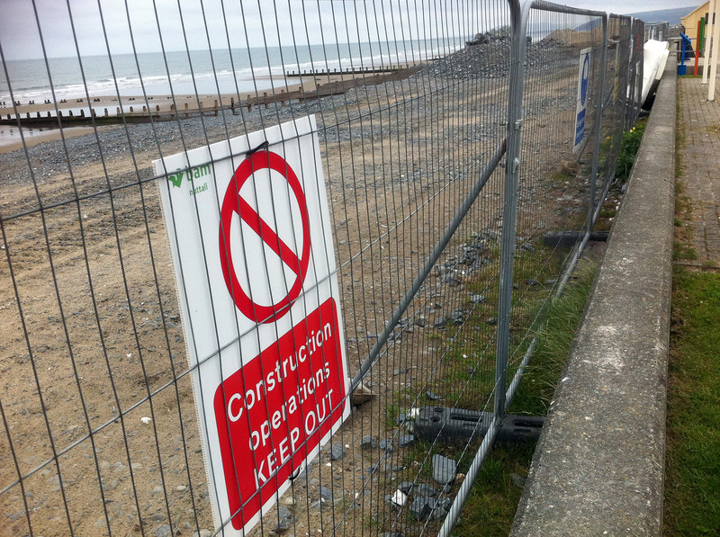

- **file**: `03_images/reefs/borth-coastal-defence-reef/borth-coastal-defence-reef_construction-fence_2011-07.jpg`
- **kind**: photo
- **shows**: Chain-link fence with a red/white 'Construction Operations KEEP OUT' sign on Borth beach, seafront houses behind; no reef or rock structure visible offshore.
- **structure visible**: False
- **state shown**: pre-construction (beach closed for the 2011 works)
- **image date**: 2011-07-10
- **citation**: Champion, Phil (2011-07-10). Coastal protection works at Borth. Geograph Britain and Ireland photo 2554717 (https://www.geograph.org.uk/photo/2554717), via Wikimedia Commons, File:Coastal protection works at Borth - geograph.org.uk - 2554717.jpg. https://commons.wikimedia.org/wiki/File:Coastal_protection_works_at_Borth_-_geograph.org.uk_-_2554717.jpg. Accessed 2026-10-06.
- **image URL**: https://upload.wikimedia.org/wikipedia/commons/d/d2/Coastal_protection_works_at_Borth_-_geograph.org.uk_-_2554717.jpg
- **source page**: https://commons.wikimedia.org/wiki/File:Coastal_protection_works_at_Borth_-_geograph.org.uk_-_2554717.jpg
- **page / figure**: whole photo
- **credit**: Phil Champion / Geograph Britain and Ireland (geograph.org.uk), via Wikimedia Commons
- **licence**: CC BY-SA 2.0 (https://creativecommons.org/licenses/by-sa/2.0) - attribution required, share-alike
- **retrieved**: 2026-10-06
- **used for**: context
- **How used for the model**: Page illustration only (site context: the beach was closed during construction in summer 2011). Not used for any measurement.
- **3D check pending**: no - Verified 2026-10-06 (shape verification). Construction-period photo or video frame: shows rock placement and the causeway, cannot confirm a level or a plan value (2011 works, before the final survey). Nothing pending.
- **linked records**: 05_qa/reef/borth-coastal-defence-reef_media_recheck.json (images[1]); 02_research/reefs/borth-coastal-defence-reef.json images[1]
- **size**: 0.21 MB, 800x597 px
- **sha256**: 5516ab7cfa50b54f61c3fd307d7a3c3bb5c81996b919f556fb97af07843c86ea
- **rights**: Private research copy; reuse rights to be checked before any public release.
- **display in HTML**: True
- **added by**: image-registry backfill, 2026-10-06
- **notes**: Original card URL (Geograph, 800 px) was https://s0.geograph.org.uk/geophotos/02/55/47/2554717_ca5fc76b.jpg; the geograph.org.uk photo page itself returns a Cloudflare challenge (HTTP 403) so title/author/date/licence were taken from the Wikimedia Commons copy of the same photo.

## borth-coastal-defence-reef-img-03 - Building the reef, Borth sea defences (August 2011)

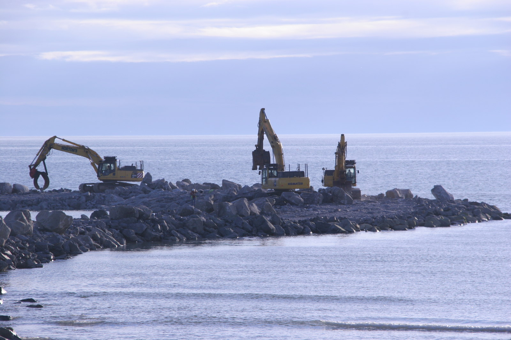

- **file**: `03_images/reefs/borth-coastal-defence-reef/borth-coastal-defence-reef_building-the-reef_2011-08.jpg`
- **kind**: photo
- **shows**: Three excavators work along an offshore rock causeway that is building the multi-purpose reef at Borth's southern end, calm sea, evening low tide.
- **structure visible**: True
- **state shown**: under construction (rock causeway / reef core, 2011-08-03)
- **image date**: 2011-08-03
- **citation**: Denny, Chris (2011-08-03). Building the reef: Borth sea defences. Geograph Britain and Ireland photo 2575564 (https://www.geograph.org.uk/photo/2575564), via Wikimedia Commons, File:Building the reef, Borth sea defences - geograph.org.uk - 2575564.jpg. https://commons.wikimedia.org/wiki/File:Building_the_reef,_Borth_sea_defences_-_geograph.org.uk_-_2575564.jpg. Accessed 2026-10-06.
- **image URL**: https://upload.wikimedia.org/wikipedia/commons/2/24/Building_the_reef%2C_Borth_sea_defences_-_geograph.org.uk_-_2575564.jpg
- **source page**: https://commons.wikimedia.org/wiki/File:Building_the_reef,_Borth_sea_defences_-_geograph.org.uk_-_2575564.jpg
- **page / figure**: whole photo
- **credit**: Chris Denny / Geograph Britain and Ireland (geograph.org.uk), via Wikimedia Commons
- **licence**: CC BY-SA 2.0 (https://creativecommons.org/licenses/by-sa/2.0) - attribution required, share-alike
- **retrieved**: 2026-10-06
- **used for**: context; cross_check
- **How used for the model**: Qualitative check only: confirms the reef is a rock mound built from a causeway, as the Esri 2012-2024 imagery shows. No dimensions were read off it; the plan trace uses the satellite images (sat2024, sat2022, sat2012).
- **3D check pending**: no - Verified 2026-10-06 (shape verification). Construction-period photo or video frame: shows rock placement and the causeway, cannot confirm a level or a plan value (2011 works, before the final survey). Nothing pending.
- **linked records**: 05_qa/reef/borth-coastal-defence-reef_media_recheck.json (images[2]); 02_research/reefs/borth-coastal-defence-reef.json images[2]; dossier ref R9
- **size**: 0.28 MB, 1600x1067 px
- **sha256**: 777fbbf7bab42982c07a337ce5b8916c853eea4d877f57b5ab2bb14362c57904
- **rights**: Private research copy; reuse rights to be checked before any public release.
- **display in HTML**: True
- **added by**: image-registry backfill, 2026-10-06
- **notes**: Original card URL (Geograph, smaller copy) was https://s0.geograph.org.uk/geophotos/02/57/55/2575564_e576dfb2.jpg; the Commons original (1600 px) was saved instead. The geograph.org.uk page returns HTTP 403 (Cloudflare).

## borth-coastal-defence-reef-img-04 - Borth coastal defence progress picture, 18 Aug 2011 (20110818-100400)

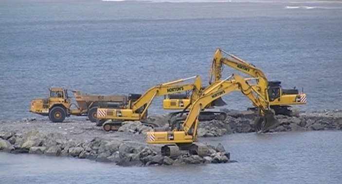

- **file**: `03_images/reefs/borth-coastal-defence-reef/borth-coastal-defence-reef_progress-photo-1_2011-08.jpg`
- **kind**: photo
- **shows**: Three Norton's-branded excavators and a dump truck on a rock causeway/reef extending into calm water. The rock mound/causeway is seen end-on from the shore.
- **structure visible**: True
- **state shown**: under construction (August 2011)
- **image date**: 2011-08-18 (from the file name; page title says August 2011)
- **citation**: Borth Community Information Website (2011). Coastal Defence Progress Pictures August 2011 [web page; page author 'Administrator'; photos credited on the page to a visitor family, Anna Scott; image folder named 'BamNuttall']. Borth Community website, https://borthcommunity.info/index.php/progress-pictures/326-coastal-defence-progress-pictures-august-2011. Image file https://borthcommunity.info/images/stories/BamNuttall/20110818-100400.jpg. Accessed 2026-10-06.
- **image URL**: https://borthcommunity.info/images/stories/BamNuttall/20110818-100400.jpg
- **source page**: https://borthcommunity.info/index.php/progress-pictures/326-coastal-defence-progress-pictures-august-2011
- **page / figure**: progress-pictures page, photo 20110818-100400 (file name = camera timestamp 2011-08-18 100400)
- **credit**: Borth Community Information Website; photographer/ownership not clearly stated (folder 'BamNuttall' suggests contractor BAM Nuttall; page text credits a visitor, Anna Scott)
- **licence**: not stated (no licence statement on the page)
- **retrieved**: 2026-10-06
- **used for**: context
- **How used for the model**: Page illustration of the construction state (Aug 2011). No dimensions read; not used for the trace.
- **3D check pending**: no - Verified 2026-10-06 (shape verification). Construction-period photo or video frame: shows rock placement and the causeway, cannot confirm a level or a plan value (2011 works, before the final survey). Nothing pending.
- **linked records**: 05_qa/reef/borth-coastal-defence-reef_media_recheck.json (images); 02_research/reefs/borth-coastal-defence-reef.json images
- **size**: 0.08 MB, 703x379 px
- **sha256**: f8f9458494b1609577db393aecdddc14f12f0d1e67ae08b7333e39d222674fcc
- **rights**: Private research copy; reuse rights to be checked before any public release.
- **display in HTML**: True
- **added by**: image-registry backfill, 2026-10-06

## borth-coastal-defence-reef-img-05 - Borth coastal defence progress picture, 18 Aug 2011 (20110818-101454)

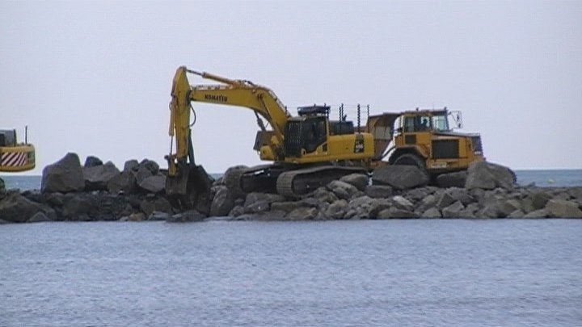

- **file**: `03_images/reefs/borth-coastal-defence-reef/borth-coastal-defence-reef_progress-photo-2_2011-08.jpg`
- **kind**: photo
- **shows**: A Komatsu excavator loading a dump truck on the same rock causeway/reef extending into the sea. The rock mound/causeway is seen end-on from the shore.
- **structure visible**: True
- **state shown**: under construction (August 2011)
- **image date**: 2011-08-18 (from the file name; page title says August 2011)
- **citation**: Borth Community Information Website (2011). Coastal Defence Progress Pictures August 2011 [web page; page author 'Administrator'; photos credited on the page to a visitor family, Anna Scott; image folder named 'BamNuttall']. Borth Community website, https://borthcommunity.info/index.php/progress-pictures/326-coastal-defence-progress-pictures-august-2011. Image file https://borthcommunity.info/images/stories/BamNuttall/20110818-101454.jpg. Accessed 2026-10-06.
- **image URL**: https://borthcommunity.info/images/stories/BamNuttall/20110818-101454.jpg
- **source page**: https://borthcommunity.info/index.php/progress-pictures/326-coastal-defence-progress-pictures-august-2011
- **page / figure**: progress-pictures page, photo 20110818-101454 (file name = camera timestamp 2011-08-18 101454)
- **credit**: Borth Community Information Website; photographer/ownership not clearly stated (folder 'BamNuttall' suggests contractor BAM Nuttall; page text credits a visitor, Anna Scott)
- **licence**: not stated (no licence statement on the page)
- **retrieved**: 2026-10-06
- **used for**: context
- **How used for the model**: Page illustration of the construction state (Aug 2011). No dimensions read; not used for the trace.
- **3D check pending**: no - Verified 2026-10-06 (shape verification). Construction-period photo or video frame: shows rock placement and the causeway, cannot confirm a level or a plan value (2011 works, before the final survey). Nothing pending.
- **linked records**: 05_qa/reef/borth-coastal-defence-reef_media_recheck.json (images); 02_research/reefs/borth-coastal-defence-reef.json images
- **size**: 0.04 MB, 720x405 px
- **sha256**: 90446ee3741820e717fb3a01609793941559bba9973829d3e766e27445eecf2f
- **rights**: Private research copy; reuse rights to be checked before any public release.
- **display in HTML**: True
- **added by**: image-registry backfill, 2026-10-06

## borth-coastal-defence-reef-img-06 - Video frame: two excavators building the offshore rock reef at Borth (binsurf66, 2011-09)

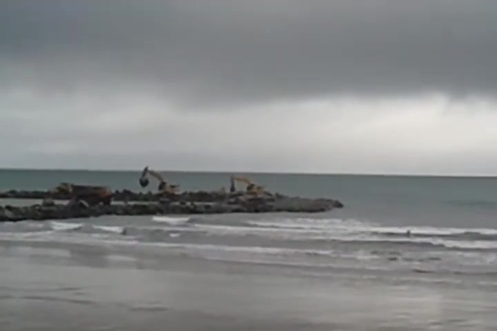

- **file**: `03_images/video_frames/borth-coastal-defence-reef/AJXnUqQObJM_0015.jpg`
- **kind**: video_frame
- **shows**: Two excavators working on the offshore rock reef at Borth's southern end, filmed from the beach; waves breaking on the sand in the foreground, overcast.
- **structure visible**: True
- **state shown**: under construction (September 2011)
- **image date**: 2011-09 (video upload date 2011-09-13)
- **citation**: binsurf66 (2011-09-13). "Borth sea defences and reef" [video]. YouTube, frame at 00:15. https://www.youtube.com/watch?v=AJXnUqQObJM. Accessed 2026-09-25.
- **source page**: https://www.youtube.com/watch?v=AJXnUqQObJM
- **page / figure**: video frame at 00:15 (video length 54 s)
- **credit**: binsurf66 (YouTube channel)
- **licence**: YouTube standard licence (not an open licence); single frame kept as a private research copy
- **retrieved**: 2026-09-24
- **used for**: context
- **How used for the model**: Page illustration (frame shown in the reef's video block). Not measured; no scale in the frame.
- **3D check pending**: no - Verified 2026-10-06 (shape verification). Construction-period photo or video frame: shows rock placement and the causeway, cannot confirm a level or a plan value (2011 works, before the final survey). Nothing pending.
- **linked records**: 02_research/videos/borth-coastal-defence-reef/videos.json (AJXnUqQObJM); 05_qa/reef/borth-coastal-defence-reef_media_recheck.json (frames[0])
- **size**: 0.02 MB, 720x480 px
- **sha256**: ead12ed6aae16edd15abb20ceb500381df7b01ab60e49ce0eae65212138a39bc
- **rights**: Private research copy; reuse rights to be checked before any public release.
- **display in HTML**: True
- **added by**: image-registry backfill, 2026-10-06

## borth-coastal-defence-reef-img-07 - Video frame: Borth seafront with plant and rock stockpile (Stephen Willcox, Aug 2011 footage)

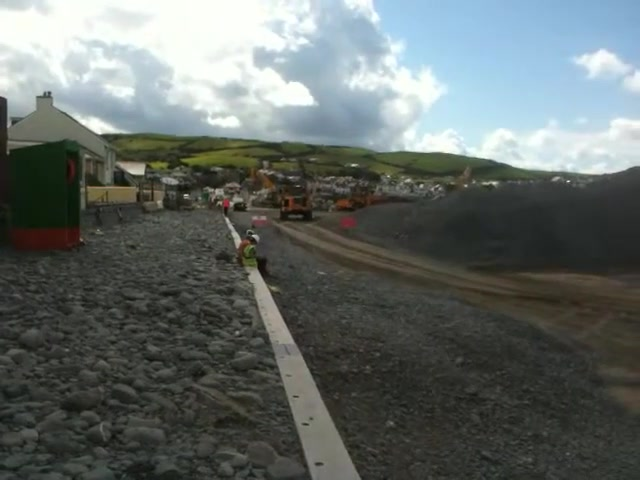

- **file**: `03_images/video_frames/borth-coastal-defence-reef/QUB6s_F9dZc_0007.jpg`
- **kind**: video_frame
- **shows**: Seafront houses beside a shingle beach; excavators, dump trucks and a large stockpile of quarried rock/shingle in the foreground. The offshore reef is not visible (site context only).
- **structure visible**: False
- **state shown**: under construction (August 2011, onshore stockpile)
- **image date**: 2011-08 (footage); uploaded 2015-06-12
- **citation**: Stephen Willcox (uploaded 2015-06-12; footage captioned August 2011). "Borth Beach Sea Defence Works August 2011" [video]. YouTube, frame at 00:07. https://www.youtube.com/watch?v=QUB6s_F9dZc. Accessed 2026-09-25.
- **source page**: https://www.youtube.com/watch?v=QUB6s_F9dZc
- **page / figure**: video frame at 00:07 (video length 77 s)
- **credit**: Stephen Willcox (YouTube channel)
- **licence**: YouTube standard licence (not an open licence); single frame kept as a private research copy
- **retrieved**: 2026-09-24
- **used for**: context
- **How used for the model**: Page illustration (site context). Not used for the trace.
- **3D check pending**: no - Verified 2026-10-06 (shape verification). Construction-period photo or video frame: shows rock placement and the causeway, cannot confirm a level or a plan value (2011 works, before the final survey). Nothing pending.
- **linked records**: 02_research/videos/borth-coastal-defence-reef/videos.json (QUB6s_F9dZc); 05_qa/reef/borth-coastal-defence-reef_media_recheck.json (frames[1])
- **size**: 0.04 MB, 640x480 px
- **sha256**: bb32fdcc1ceeb17e3403af42c88066c39803eb9e42b22a7f20e9b985e5550797
- **rights**: Private research copy; reuse rights to be checked before any public release.
- **display in HTML**: True
- **added by**: image-registry backfill, 2026-10-06

## borth-coastal-defence-reef-img-08 - Esri World Imagery, Borth multi-purpose reef, 2024-09-17 (low tide, rock bare)

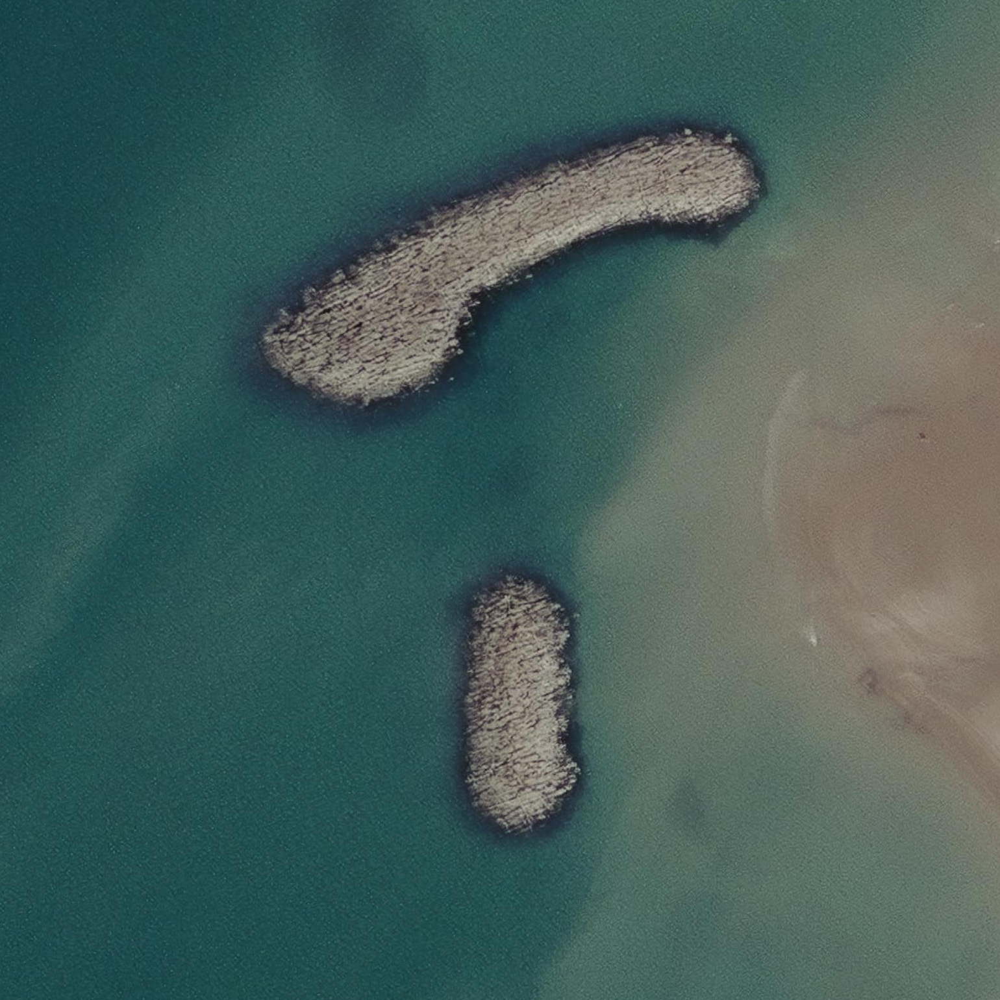

- **file**: `07_scale/shapes/borth-coastal-defence-reef/src/borth_esri_2024-09-17_z19.png`
- **kind**: satellite
- **shows**: Both rock mounds (northern curved 'boot/hook' mound and southern oval mound) fully exposed as bare light-grey rock at low tide; sand beach edge to the east.
- **structure visible**: True
- **state shown**: as-built, current (rock bare at low tide; same footprint as 2012)
- **image date**: 2024-09-17
- **citation**: Esri, Maxar, Earthstar Geographics, and the GIS User Community (2024). World Imagery (current layer), image captured 2024-09-17. Esri World Imagery tile service, https://server.arcgisonline.com/ArcGIS/rest/services/World_Imagery/MapServer. Accessed 2026-10-04.
- **image URL**: https://server.arcgisonline.com/ArcGIS/rest/services/World_Imagery/MapServer/tile/{z}/{y}/{x}
- **source page**: Esri World Imagery (identify DATE field)
- **page / figure**: centre 52.4832,-4.0562, radius 140 m, zoom 19, 1540x1540 px, 0.18183 m/px; georeference sidecar borth_esri_2024-09-17_z19.png.geo.json
- **credit**: Esri, Maxar, Earthstar Geographics, and the GIS User Community
- **licence**: Esri/Maxar imagery terms (not an open licence); private research copy only
- **retrieved**: 2026-10-04
- **used for**: plan_trace; scale
- **How used for the model**: PRIMARY image: the outer edge of the bare rock was traced as 42 + 37 vertices (pixel polygons in shape.json source sat2024, polys_v1.json); scale 0.18183 m/px from the Web-Mercator bounds; gives N mound 3,944 m2, S mound 1,798 m2, total 5,743 m2 (METHOD.md steps 2a, 3a).
- **3D check pending**: no - Verified 2026-10-06 (shape verification). Primary trace re-rendered (good); same footprint as the georeferenced Royal Haskoning plan (IoU 0.79 N / 0.86 S, centroids within 4 m) and the 2022 LiDAR; drawn area 5743 m2 is the visible rock edge (design armour foot 6989 m2, LiDAR exposed 8675 m2). Canonical frame corrected to +x south. Nothing pending for the planform.
- **annotated / overlay files**: `07_scale/shapes/borth-coastal-defence-reef/overlays/verify_trace_sat2024.png`; `07_scale/shapes/borth-coastal-defence-reef/overlays/verify_design_lidar_vs_trace_sat2024.png`
- **linked records**: 07_scale/shapes/borth-coastal-defence-reef/sources.md sat2024; 07_scale/shapes/borth-coastal-defence-reef/shape.json sources[sat2024]; 07_scale/shapes/borth-coastal-defence-reef/METHOD.md steps 2a, 3a
- **size**: 1.94 MB, 1540x1540 px
- **sha256**: c345118312c996d654162d21dd571f07ea92b8a153f97a4895dcf8c8fd92dd5b
- **rights**: Private research copy; reuse rights to be checked before any public release.
- **display in HTML**: True
- **added by**: image-registry backfill, 2026-10-06

## borth-coastal-defence-reef-img-09 - Esri World Imagery Wayback release 34007, Borth multi-purpose reef, 2022-08-25 (low tide, swell wash)

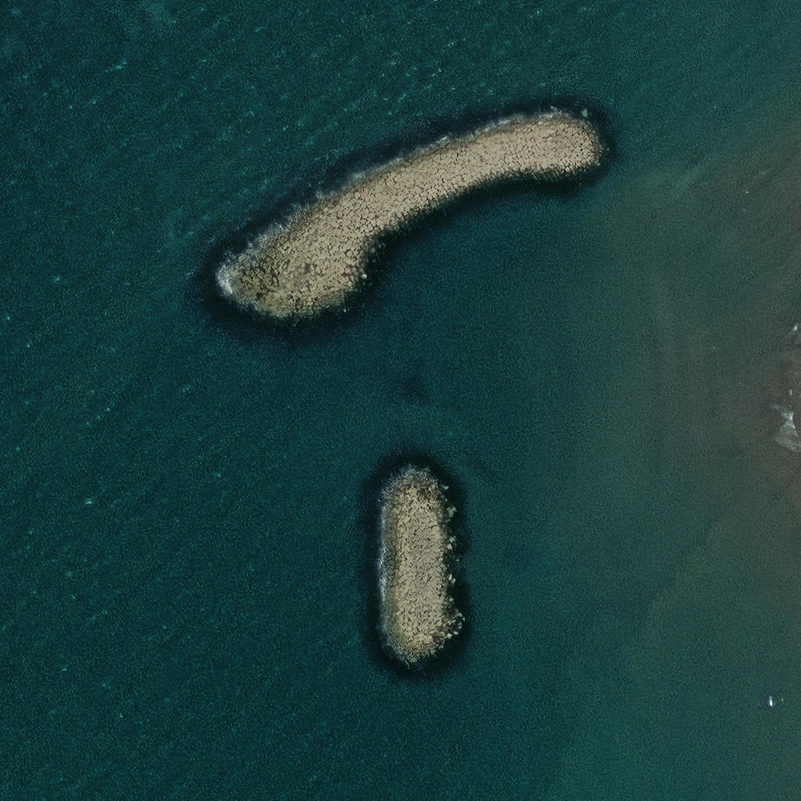

- **file**: `07_scale/shapes/borth-coastal-defence-reef/src/borth_esri_2022-08-25_z19.png`
- **kind**: satellite
- **shows**: Both mounds with bare rock at low tide; a breaking-foam fringe on the west side (swell running).
- **structure visible**: True
- **state shown**: as-built, 2022 (rock bare at low tide)
- **image date**: 2022-08-25
- **citation**: Esri, Maxar, Earthstar Geographics, and the GIS User Community (2022). World Imagery (Wayback release 34007), image captured 2022-08-25. Esri World Imagery tile service, https://server.arcgisonline.com/ArcGIS/rest/services/World_Imagery/MapServer. Accessed 2026-10-04.
- **image URL**: https://wayback.maptiles.arcgis.com/arcgis/rest/services/World_Imagery/WMTS/1.0.0/default028mm/MapServer/tile/34007/{z}/{y}/{x}
- **source page**: Esri Wayback (release 34007)
- **page / figure**: same frame as sat2024 (centre 52.4832,-4.0562, r=140 m, z19, 1540x1540 px)
- **credit**: Esri, Maxar, Earthstar Geographics, and the GIS User Community
- **licence**: Esri/Maxar imagery terms (not an open licence); private research copy only
- **retrieved**: 2026-10-04
- **used for**: cross_check
- **How used for the model**: Independent second trace (polys_2022_v1.json, 42 + 37 vertices): area 4,848 m2 (-15.6% vs sat2024, tighter trace + wave wash); mound centroids agree with sat2024 within 0.8 m E / 0.6 m N, so no rock movement 2012-2024 (METHOD.md step 2b, 3a; shape.json source sat2022).
- **3D check pending**: no - Verified 2026-10-06 (shape verification). Cross-check trace re-rendered (good); IoU with the 2024 trace 0.84, tighter edge rule (-15.6 % area). Nothing pending.
- **annotated / overlay files**: `07_scale/shapes/borth-coastal-defence-reef/overlays/verify_trace_sat2022.png`
- **linked records**: 07_scale/shapes/borth-coastal-defence-reef/sources.md sat2022; 07_scale/shapes/borth-coastal-defence-reef/shape.json sources[sat2022]; 07_scale/shapes/borth-coastal-defence-reef/METHOD.md steps 2b, 3a
- **size**: 3.27 MB, 1540x1540 px
- **sha256**: b905d3d5f726434675a1cf9be53eca7715d3453dab9453a40dc0c73cfc6b049e
- **rights**: Private research copy; reuse rights to be checked before any public release.
- **display in HTML**: True
- **added by**: image-registry backfill, 2026-10-06

## borth-coastal-defence-reef-img-10 - Esri World Imagery Wayback release 18358, Borth multi-purpose reef, 2012-10-27 (awash, algae covered)

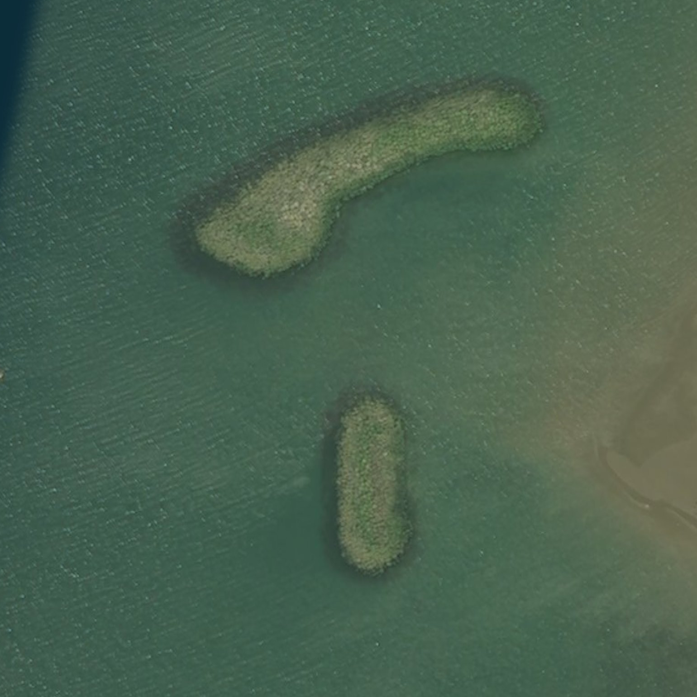

- **file**: `07_scale/shapes/borth-coastal-defence-reef/src/borth_esri_2012-10-27_z19.png`
- **kind**: satellite
- **shows**: Both mounds awash and covered in green algae; soft outline; the whole image is shifted ~5-6 m east of sat2024 (imagery registration, not reef movement).
- **structure visible**: True
- **state shown**: as-built (7 months after completion; reef awash)
- **image date**: 2012-10-27 (about 7 months after completion in March 2012)
- **citation**: Esri, Maxar, Earthstar Geographics, and the GIS User Community (2012). World Imagery (Wayback release 18358), image captured 2012-10-27. Esri World Imagery tile service, https://server.arcgisonline.com/ArcGIS/rest/services/World_Imagery/MapServer. Accessed 2026-10-04.
- **image URL**: https://wayback.maptiles.arcgis.com/arcgis/rest/services/World_Imagery/WMTS/1.0.0/default028mm/MapServer/tile/18358/{z}/{y}/{x}
- **source page**: Esri Wayback (release 18358)
- **page / figure**: same frame as sat2024 (centre 52.4832,-4.0562, r=140 m, z19, 1540x1540 px)
- **credit**: Esri, Maxar, Earthstar Geographics, and the GIS User Community
- **licence**: Esri/Maxar imagery terms (not an open licence); private research copy only
- **retrieved**: 2026-10-04
- **used for**: cross_check
- **How used for the model**: Independent third trace (polys_2012_v1.json, 42 + 29 vertices): area 5,535 m2 (-3.6% vs sat2024); shows the as-built footprint already equals the 2024 one (METHOD.md step 2b, 3a; shape.json source sat2012).
- **3D check pending**: no - Verified 2026-10-06 (shape verification). Cross-check trace re-rendered (approximate, soft algal edge); the whole frame sits 5 m east of the 2024 frame (imagery registration), the mounds are unchanged. Nothing pending.
- **annotated / overlay files**: `07_scale/shapes/borth-coastal-defence-reef/overlays/verify_trace_sat2012.png`
- **linked records**: 07_scale/shapes/borth-coastal-defence-reef/sources.md sat2012; 07_scale/shapes/borth-coastal-defence-reef/shape.json sources[sat2012]; 07_scale/shapes/borth-coastal-defence-reef/METHOD.md steps 2b, 3a
- **size**: 1.18 MB, 1540x1540 px
- **sha256**: 83392c4ed13a9fc354e018fc5c354cd30a3192094a80bf8df2d93af5ae5e9fef
- **rights**: Private research copy; reuse rights to be checked before any public release.
- **display in HTML**: True
- **added by**: image-registry backfill, 2026-10-06

## borth-coastal-defence-reef-img-11 - Esri World Imagery Wayback release 11351, Borth multi-purpose reef, 2013-06-04

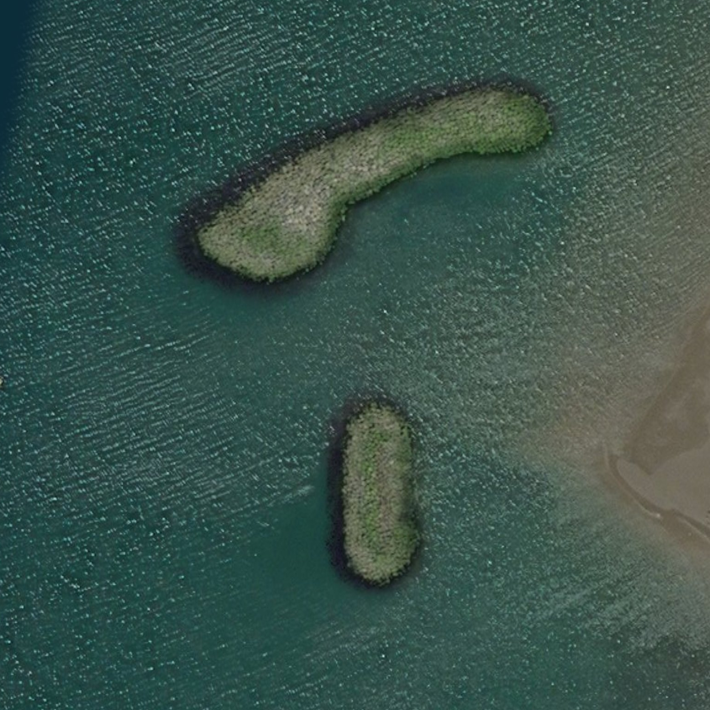

- **file**: `07_scale/shapes/borth-coastal-defence-reef/src/borth_esri_2013-06-04_z19.png`
- **kind**: satellite
- **shows**: Both rock mounds, submerged/awash and algae covered.
- **structure visible**: True
- **state shown**: as-built, 2013
- **image date**: 2013-06-04
- **citation**: Esri, Maxar, Earthstar Geographics, and the GIS User Community (2013). World Imagery (Wayback release 11351), image captured 2013-06-04. Esri World Imagery tile service, https://server.arcgisonline.com/ArcGIS/rest/services/World_Imagery/MapServer. Accessed 2026-10-04.
- **image URL**: https://wayback.maptiles.arcgis.com/arcgis/rest/services/World_Imagery/WMTS/1.0.0/default028mm/MapServer/tile/11351/{z}/{y}/{x}
- **source page**: Esri Wayback (release 11351)
- **page / figure**: same frame as sat2024 (centre 52.4832,-4.0562, r=140 m, z19, 1540x1540 px)
- **credit**: Esri, Maxar, Earthstar Geographics, and the GIS User Community
- **licence**: Esri/Maxar imagery terms (not an open licence); private research copy only
- **retrieved**: 2026-10-04
- **used for**: context
- **How used for the model**: Context only: listed in shape.json as source sat2013 (role context); not traced.
- **3D check pending**: no - Verified 2026-10-06 (shape verification). Context only (no trace). Nothing pending.
- **linked records**: 07_scale/shapes/borth-coastal-defence-reef/sources.md sat2013; 07_scale/shapes/borth-coastal-defence-reef/shape.json sources[sat2013]
- **size**: 2.14 MB, 1540x1540 px
- **sha256**: ff6791539fcb9d9344d7edafc0da710a758b5d7a5785bf11baf43089d530bf66
- **rights**: Private research copy; reuse rights to be checked before any public release.
- **display in HTML**: True
- **added by**: image-registry backfill, 2026-10-06

## borth-coastal-defence-reef-img-12 - Esri World Imagery, Borth village frontage and reef, 2024-09-17 (z19, r=350 m)

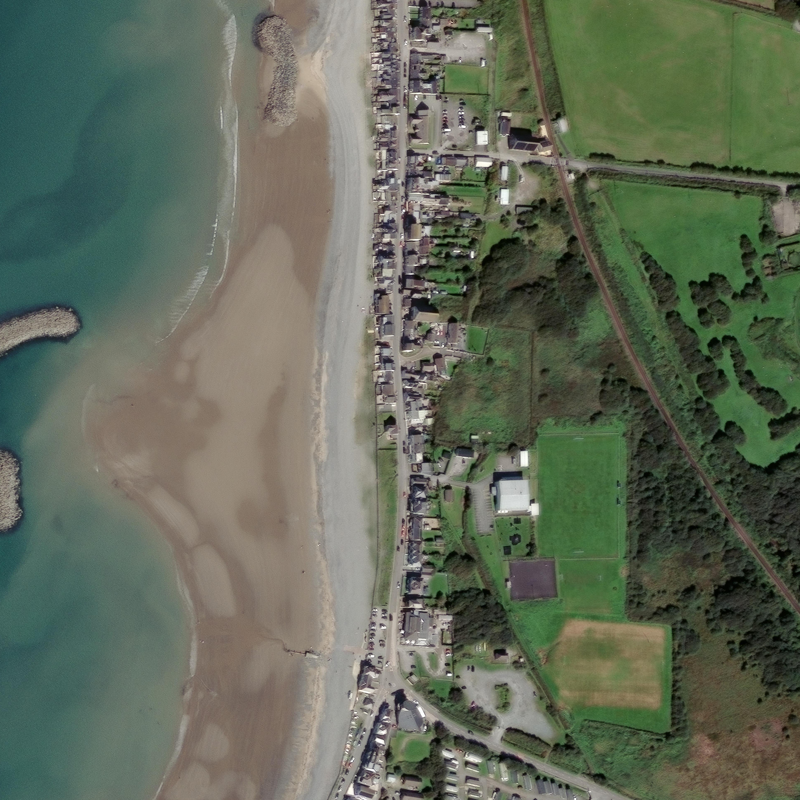

- **file**: `07_scale/shapes/borth-coastal-defence-reef/src/borth_shoreline_z19.png`
- **kind**: satellite
- **shows**: Village frontage: shingle ridge and sea wall along the houses, sand flats exposed at low tide, and the detached reef mounds at the west edge 300+ m offshore.
- **structure visible**: True
- **state shown**: as-built, current
- **image date**: 2024-09-17
- **citation**: Esri, Maxar, Earthstar Geographics, and the GIS User Community (2024). World Imagery (current layer), image captured 2024-09-17. Esri World Imagery tile service, https://server.arcgisonline.com/ArcGIS/rest/services/World_Imagery/MapServer. Accessed 2026-10-04.
- **image URL**: https://server.arcgisonline.com/ArcGIS/rest/services/World_Imagery/MapServer/tile/{z}/{y}/{x}
- **source page**: Esri World Imagery (identify DATE field)
- **page / figure**: centre 52.4834,-4.051, radius 350 m, zoom 19, 3850x3849 px
- **credit**: Esri, Maxar, Earthstar Geographics, and the GIS User Community
- **licence**: Esri/Maxar imagery terms (not an open licence); private research copy only
- **retrieved**: 2026-10-04
- **used for**: plan_trace; context
- **How used for the model**: Shoreline reference: the 'defence line' (back of the shingle beach / toe of the village frontage) was read at px (1795,1100),(1800,1500),(1803,2000),(1805,2500),(1808,2600); line fit bearing 359.57 deg defines the canonical alongshore frame and the reef's 257-397 m offshore distance (METHOD.md step 3a; shape.json source satshore).
- **3D check pending**: no - Verified 2026-10-06 (shape verification). Context only (no trace). Nothing pending.
- **annotated / overlay files**: `07_scale/shapes/borth-coastal-defence-reef/overlays/zoom7_shoreline.png`; `07_scale/shapes/borth-coastal-defence-reef/overlays/zoom8_prom.png`; `07_scale/shapes/borth-coastal-defence-reef/overlays/zoom9_prom2.png`; `07_scale/shapes/borth-coastal-defence-reef/overlays/zoom10_edge.png`
- **linked records**: 07_scale/shapes/borth-coastal-defence-reef/sources.md satshore; 07_scale/shapes/borth-coastal-defence-reef/shape.json sources[satshore]; 07_scale/shapes/borth-coastal-defence-reef/METHOD.md step 3a
- **size**: 13.18 MB, 3850x3849 px
- **sha256**: e894644a5084e957d045c2d7ac58a8ea521d1721f9f59fb82456fdb1c62cd183
- **rights**: Private research copy; reuse rights to be checked before any public release.
- **display in HTML**: True
- **added by**: image-registry backfill, 2026-10-06

## borth-coastal-defence-reef-img-13 - Esri World Imagery, wider frame around the Borth reef, 2024-09-17 (z19, r=250 m)

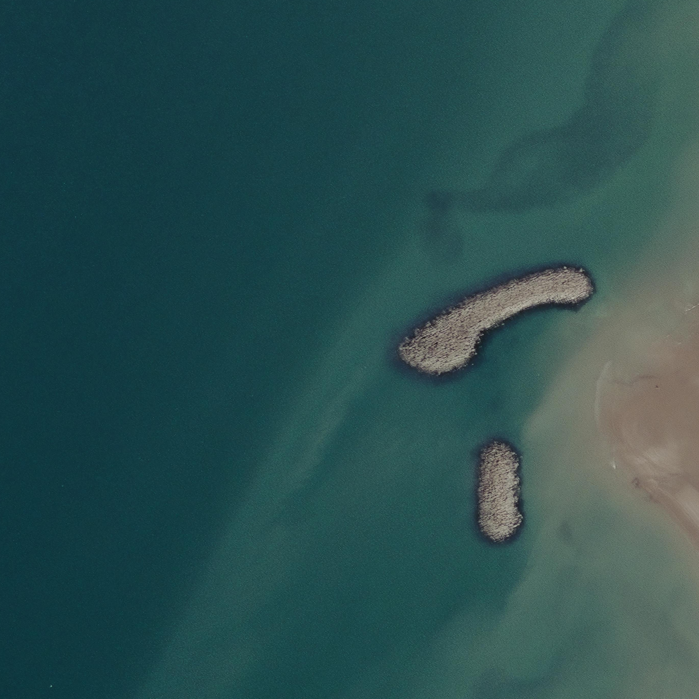

- **file**: `07_scale/shapes/borth-coastal-defence-reef/src/borth_blobs_z19.png`
- **kind**: satellite
- **shows**: Both reef mounds with surrounding sand and water (same date as sat2024, wider frame).
- **structure visible**: True
- **state shown**: as-built, current
- **image date**: 2024-09-17
- **citation**: Esri, Maxar, Earthstar Geographics, and the GIS User Community (2024). World Imagery (current layer), image captured 2024-09-17. Esri World Imagery tile service, https://server.arcgisonline.com/ArcGIS/rest/services/World_Imagery/MapServer. Accessed 2026-10-04.
- **image URL**: https://server.arcgisonline.com/ArcGIS/rest/services/World_Imagery/MapServer/tile/{z}/{y}/{x}
- **source page**: Esri World Imagery (identify DATE field)
- **page / figure**: wider frame around the reef, zoom 19, r=250 m, 2750x2750 px
- **credit**: Esri, Maxar, Earthstar Geographics, and the GIS User Community
- **licence**: Esri/Maxar imagery terms (not an open licence); private research copy only
- **retrieved**: 2026-10-04
- **used for**: context
- **How used for the model**: Context (duplicate date of sat2024); its grid zoom crops overlays/zoom1-6 were made while first inspecting the mounds. Not used for the final trace.
- **3D check pending**: no - Verified 2026-10-06 (shape verification). Context only (no trace). Nothing pending.
- **annotated / overlay files**: `07_scale/shapes/borth-coastal-defence-reef/overlays/zoom1_grid.png`; `07_scale/shapes/borth-coastal-defence-reef/overlays/zoom2_grid_full.png`; `07_scale/shapes/borth-coastal-defence-reef/overlays/zoom3_lobeA.png`; `07_scale/shapes/borth-coastal-defence-reef/overlays/zoom4_lobeA_full.png`; `07_scale/shapes/borth-coastal-defence-reef/overlays/zoom5_lobeB.png`; `07_scale/shapes/borth-coastal-defence-reef/overlays/zoom6_lobeB_bottom.png`
- **linked records**: 07_scale/shapes/borth-coastal-defence-reef/sources.md satblobs
- **size**: 5.20 MB, 2750x2750 px
- **sha256**: d7a63fba5776d1c198d36ec7bf0f9c57e318651eed5a8be3ec73183ac497a59b
- **rights**: Private research copy; reuse rights to be checked before any public release.
- **display in HTML**: True
- **added by**: image-registry backfill, 2026-10-06

## borth-coastal-defence-reef-img-14 - EMODnet Map Viewer at Borth: DTM 2024 mean depth over Esri imagery, with DTM cell grid, both reef mounds, points and shore-normal profile

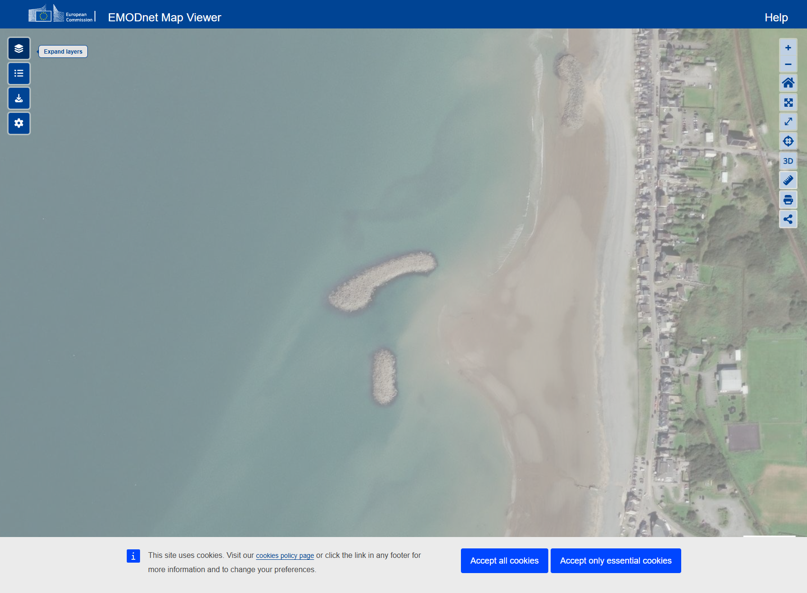

- **file**: `07_scale/bathymetry/emodnet/viewer/borth-coastal-defence-reef_viewer_dtm_raw.png`
- **kind**: chart_screenshot
- **shows**: The two rock mounds (northern hook and southern oval, yellow outline) lie within 3-4 DTM cells whose values are -0.1 to -0.4 m rel. LAT; cells landward of the mounds (+2.7, +5.4) and the reef cells are marked 'i' = interpolated (GEBCO fill).
- **structure visible**: True
- **state shown**: as-built (current Esri imagery; rock bare at low tide)
- **image date**: DTM 2024 (published 2024-12-31); screenshot 2026-10-06; Esri basemap date not stated by the viewer
- **citation**: EMODnet Bathymetry Consortium (2024). EMODnet Digital Bathymetry (DTM 2024) [Mean depth / Source references layers], displayed in the EMODnet Map Viewer, https://emodnet.ec.europa.eu/geoviewer/ (layer ids 14159 / 13012), DOI https://doi.org/10.12770/cf51df64-56f9-4a99-b1aa-36b8d7b743a1. Accessed 2026-10-06. Licence CC BY 4.0 (EMODnet Terms of Use). Basemap: Esri World Imagery (Esri, Maxar, Earthstar Geographics). Annotations (cell grid, outline, points, profile, scale bar) added by this project.
- **image URL**: https://emodnet.ec.europa.eu/geoviewer/
- **source page**: https://emodnet.ec.europa.eu/geoviewer/
- **page / figure**: layer 14159 'Mean depth natural colour (with land)', centre 52.4835 N 4.0562 W, 1040 x 660 m, 50 % opacity
- **credit**: EMODnet Bathymetry Consortium (data); Esri, Maxar, Earthstar Geographics (basemap); annotations by this project
- **licence**: EMODnet data: CC BY 4.0 (https://emodnet.ec.europa.eu/en/terms-use-emodnet-online-services-data-and-data-products, accessed 2026-10-06); 'not for navigation' (Sextant record). Esri World Imagery basemap: Esri terms, reuse not cleared. Annotations/plots: project products.
- **retrieved**: 2026-10-06
- **used for**: cross_check; 3d_seabed; 3d_tides
- **How used for the model**: Read the EMODnet cell values at the reef centre (-0.18 m rel. LAT, interpolated, reference GEBCO2024), the mound toes (-0.13 .. -0.40) and seabed points (-0.12 .. -1.10; +0.97 shoreward) from the 16 points in data/borth-coastal-defence-reef_points_emodnet.csv. Not used for model values; offshore gradient and 'reef at about LAT' are the only items proposed in REPORT.md.
- **3D check pending**: no - RESULT (shape verifier, 2026-10-06): MSL-LAT at Borth = 2.75 m (LAT = chart datum = -2.44 mODN; MSL about +0.31 mODN; MHWS +2.56, MLWS -1.74 mODN; sources SMP2 Area C p.4C.3 and NTSLF, see VERIFY.md 3D inputs), so z_MSL = e_LAT - 2.75 m (the -2.25 m web value is not supported). The design seabed at the reefs is about -4.0 mODN (north arm) and -3.6..-4.2 mAOD (oval), i.e. z_MSL about -4.3 m; the EMODnet reef cells (-0.34..-0.13 m rel. LAT = -2.78..-2.57 mODN) are 1.0-1.4 m shallower than the design seabed, which confirms they are GEBCO interpolation: use them only as an offshore trend, prefer the design seabed. ORIGINAL NOTE: EMODnet DTM 2024 at the Borth reef: the reef cells are GEBCO 2024 interpolation (-0.34..-0.13 m rel. LAT, flag 1), the real source cells (CDI 115084, age > 30 y, 1 sounding/cell) start at y = 335 m from the defence line and give a seaward gradient of about -1.1 % (-0.40 m at 367 m to -3.36 m at 652 m). 3D agent: use only as offshore trend / weak 'reef near LAT' check; verify MSL-LAT at Borth to convert to the model's MSL zero.
- **annotated / overlay files**: `07_scale/bathymetry/emodnet/viewer/borth-coastal-defence-reef_viewer_dtm_annotated.png`
- **linked records**: 07_scale/bathymetry/emodnet/REPORT.md; 07_scale/bathymetry/emodnet/data/borth-coastal-defence-reef_points_emodnet.csv; 07_scale/shapes/borth-coastal-defence-reef/shape.json (geo.polygons_latlon, canonical frame)
- **size**: 1.16 MB, 1700x1250 px
- **sha256**: 84682dbe84c0b6882edb206b27afa0bcb0398552cec3129472ea8b4a0cd58106
- **rights**: Private research copy; reuse rights to be checked before any public release.
- **display in HTML**: True
- **added by**: EMODnet bathymetry test, 2026-10-06
- **3D check result (2026-10-07)**: MSL - LAT = 2.75 m (z_MSL = e_LAT - 2.75). The reef-zone EMODnet cells (-2.78..-2.57 mODN) are 1.0-1.4 m shallower than the design bed (-4.0): GEBCO interpolation, not used. Only the offshore gradient -1.1 % (survey cells from y 335 m) is used; the seabed seaward of y 335 m is NOT validated by it (model 1.5 m deeper than the cells at y 368-513, see METHODS_3D 4.4).
- **How used (update 2026-10-07)**: Result of the 3D check 2026-10-07: MSL - LAT = 2.75 m (z_MSL = e_LAT - 2.75).

## borth-coastal-defence-reef-img-15 - EMODnet Map Viewer at Borth: 'Source references' layer over Esri imagery with cell grid, reef outlines and profile

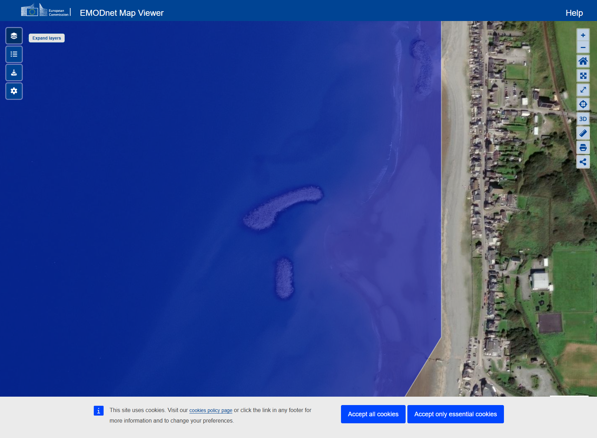

- **file**: `07_scale/bathymetry/emodnet/viewer/borth-coastal-defence-reef_viewer_sources_raw.png`
- **kind**: chart_screenshot
- **shows**: One survey patch (CDI 115084, EDMO 2607 OceanWise Limited; the CDI polygon service lists a 'CARDIGAN BAY' polygon of OceanWise here) covers the sea west of the beach; the cells nearest the beach, including the reef cells, are interpolated (GEBCO 2024 fill).
- **structure visible**: True
- **state shown**: as-built (current Esri imagery; rock bare at low tide)
- **image date**: V2024 source references (record revised 2025-03-01); screenshot 2026-10-06
- **citation**: EMODnet Bathymetry Consortium (2024). EMODnet Digital Bathymetry (DTM 2024) [Mean depth / Source references layers], displayed in the EMODnet Map Viewer, https://emodnet.ec.europa.eu/geoviewer/ (layer ids 14159 / 13012), DOI https://doi.org/10.12770/cf51df64-56f9-4a99-b1aa-36b8d7b743a1. Accessed 2026-10-06. Licence CC BY 4.0 (EMODnet Terms of Use). Basemap: Esri World Imagery (Esri, Maxar, Earthstar Geographics). Annotations (cell grid, outline, points, profile, scale bar) added by this project.
- **image URL**: https://emodnet.ec.europa.eu/geoviewer/
- **source page**: https://emodnet.ec.europa.eu/geoviewer/
- **page / figure**: layer 13012 'Source Reference of the DTM' (V2024), same view as the mean-depth screenshot, 55 % opacity
- **credit**: EMODnet Bathymetry Consortium (data); Esri, Maxar, Earthstar Geographics (basemap); annotations by this project
- **licence**: EMODnet data: CC BY 4.0 (https://emodnet.ec.europa.eu/en/terms-use-emodnet-online-services-data-and-data-products, accessed 2026-10-06); 'not for navigation' (Sextant record). Esri World Imagery basemap: Esri terms, reuse not cleared. Annotations/plots: project products.
- **retrieved**: 2026-10-06
- **used for**: cross_check; 3d_seabed
- **How used for the model**: Used to identify the source of the DTM cells at the reef (CDI 115084 + GEBCO 2024 fill) and its quality index (horizontal 0, vertical 3, age 0 = older than 30 y, purpose 3). Documented in REPORT.md; no model value taken.
- **3D check pending**: no - RESULT (shape verifier, 2026-10-06): MSL-LAT at Borth = 2.75 m (LAT = chart datum = -2.44 mODN; MSL about +0.31 mODN; MHWS +2.56, MLWS -1.74 mODN; sources SMP2 Area C p.4C.3 and NTSLF, see VERIFY.md 3D inputs), so z_MSL = e_LAT - 2.75 m (the -2.25 m web value is not supported). The design seabed at the reefs is about -4.0 mODN (north arm) and -3.6..-4.2 mAOD (oval), i.e. z_MSL about -4.3 m; the EMODnet reef cells (-0.34..-0.13 m rel. LAT = -2.78..-2.57 mODN) are 1.0-1.4 m shallower than the design seabed, which confirms they are GEBCO interpolation: use them only as an offshore trend, prefer the design seabed. ORIGINAL NOTE: EMODnet DTM 2024 at the Borth reef: the reef cells are GEBCO 2024 interpolation (-0.34..-0.13 m rel. LAT, flag 1), the real source cells (CDI 115084, age > 30 y, 1 sounding/cell) start at y = 335 m from the defence line and give a seaward gradient of about -1.1 % (-0.40 m at 367 m to -3.36 m at 652 m). 3D agent: use only as offshore trend / weak 'reef near LAT' check; verify MSL-LAT at Borth to convert to the model's MSL zero.
- **annotated / overlay files**: `07_scale/bathymetry/emodnet/viewer/borth-coastal-defence-reef_viewer_sources_annotated.png`
- **linked records**: 07_scale/bathymetry/emodnet/REPORT.md; 07_scale/bathymetry/emodnet/data/borth-coastal-defence-reef_results.json
- **size**: 1.31 MB, 1700x1250 px
- **sha256**: a0605daec8f8cb80fa3063e781cfc0897a9eec268fa95c5071187dcbf754b1ff
- **rights**: Private research copy; reuse rights to be checked before any public release.
- **display in HTML**: True
- **added by**: EMODnet bathymetry test, 2026-10-06
- **3D check result (2026-10-07)**: One survey patch (CDI 115084, OceanWise) supplies the gradient -1.1 % for y 368-652 m (one sounding per cell, age > 30 y): used as a gradient only, anchored on the design bed level at y = 335 m. Kept as context; the Navionics datum test (METHODS_3D 3.6) puts the chart 0.6 m shallower than these cells.
- **How used (update 2026-10-07)**: Result of the 3D check 2026-10-07: One survey patch (CDI 115084, OceanWise) supplies the gradient -1.1 % for y 368-652 m (one sounding per cell, age > 30 y): used as a gradient only, anchored on the design bed level at y = 335 m.

## borth-coastal-defence-reef-img-16 - Shore-normal depth profile through the Borth reef mounds from the EMODnet DTM 2024 cells (reef centre, northern hook, southern oval) and the REST depth_profile

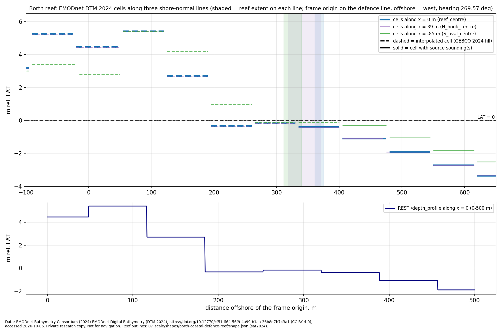

- **file**: `07_scale/bathymetry/emodnet/figures/borth-coastal-defence-reef_profile_emodnet.png`
- **kind**: diagram
- **shows**: Steps of the DTM along the shore normal: land / beach cells +5.4, +2.7 (interpolated), reef cells -0.34..-0.13 (interpolated, GEBCO), then surveyed cells -0.40, -1.10, -1.91, -2.73, -3.36 m rel. LAT out to 650 m; the reef mounds are invisible at this resolution.
- **structure visible**: False
- **state shown**: analysis diagram
- **image date**: plot 2026-10-06; EMODnet DTM 2024
- **citation**: This project (2026-10-06), plot made from EMODnet Bathymetry Consortium (2024). EMODnet Digital Bathymetry (DTM 2024), ERDDAP dataset bathymetry_dtm_2024 (https://erddap.emodnet.eu/erddap/griddap/bathymetry_dtm_2024), REST https://rest.emodnet-bathymetry.eu/depth_profile, DOI https://doi.org/10.12770/cf51df64-56f9-4a99-b1aa-36b8d7b743a1. Accessed 2026-10-06. Licence CC BY 4.0.
- **image URL**: https://rest.emodnet-bathymetry.eu/depth_profile
- **source page**: https://rest.emodnet-bathymetry.eu/depth_profile
- **page / figure**: plot made with scripts/make_plots.py; lines x = 0, +38.9 and -85.3 m, y = -100..650 m, bearing 269.57 deg (west)
- **credit**: Plot by this project; EMODnet Bathymetry Consortium (data); reef outlines from the project's shape.json
- **licence**: EMODnet data: CC BY 4.0 (EMODnet Terms of Use, accessed 2026-10-06); plot is a project product; model curves from the project's own model.js (read only).
- **retrieved**: 2026-10-06
- **used for**: cross_check; 3d_seabed; 3d_tides
- **How used for the model**: Offshore gradient from the surveyed cells (y 335-650 m): -1.1 % (about 1:90); reef-cell values -0.34..-0.13 m rel. LAT are GEBCO fill and only indicate 'reef near LAT'. Proposed in REPORT.md for the future Borth 3D model; nothing is in a model yet.
- **3D check pending**: no - RESULT (shape verifier, 2026-10-06): MSL-LAT at Borth = 2.75 m (LAT = chart datum = -2.44 mODN; MSL about +0.31 mODN; MHWS +2.56, MLWS -1.74 mODN; sources SMP2 Area C p.4C.3 and NTSLF, see VERIFY.md 3D inputs), so z_MSL = e_LAT - 2.75 m (the -2.25 m web value is not supported). The design seabed at the reefs is about -4.0 mODN (north arm) and -3.6..-4.2 mAOD (oval), i.e. z_MSL about -4.3 m; the EMODnet reef cells (-0.34..-0.13 m rel. LAT = -2.78..-2.57 mODN) are 1.0-1.4 m shallower than the design seabed, which confirms they are GEBCO interpolation: use them only as an offshore trend, prefer the design seabed. ORIGINAL NOTE: EMODnet DTM 2024 at the Borth reef: the reef cells are GEBCO 2024 interpolation (-0.34..-0.13 m rel. LAT, flag 1), the real source cells (CDI 115084, age > 30 y, 1 sounding/cell) start at y = 335 m from the defence line and give a seaward gradient of about -1.1 % (-0.40 m at 367 m to -3.36 m at 652 m). 3D agent: use only as offshore trend / weak 'reef near LAT' check; verify MSL-LAT at Borth to convert to the model's MSL zero.
- **linked records**: 07_scale/bathymetry/emodnet/REPORT.md; 07_scale/bathymetry/emodnet/data/borth-coastal-defence-reef_profile_through_reef_centre.csv; 07_scale/bathymetry/emodnet/data/borth-coastal-defence-reef_profile_REST_depth_profile_y0_500.csv
- **size**: 0.11 MB, 1875x1230 px
- **sha256**: 69e8461fa39b39dccaf5be059d91301ead51dd490518ec7eca7020ae23baf31d
- **rights**: Private research copy; reuse rights to be checked before any public release.
- **display in HTML**: True
- **added by**: EMODnet bathymetry test, 2026-10-06
- **3D check result (2026-10-07)**: The DTM steps along the shore normal confirm the trend (-1.1 %); the absolute reef-zone values are interpolated and are not used. Model vs EMODnet at x -30: 1.5-1.6 m deeper at y 368-513 (METHODS_3D 4.4).
- **How used (update 2026-10-07)**: Result of the 3D check 2026-10-07: The DTM steps along the shore normal confirm the trend (-1.1 %); the absolute reef-zone values are interpolated and are not used.

## borth-coastal-defence-reef-img-17 - HRPP576 Fig. 2: general layout of Phase 1 with mODN seabed contours (A north reef, B south reef, C shore-parallel breakwater)

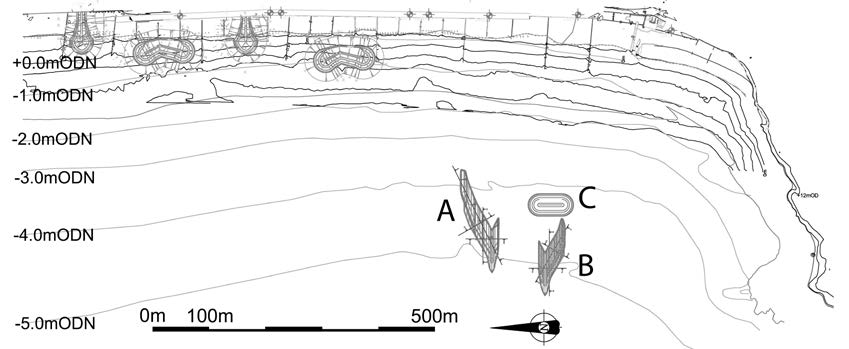

- **file**: `03_images/reefs/borth-coastal-defence-reef/borth-coastal-defence-reef_hrpp576-fig2-layout-contours_2013.png`
- **kind**: plan_figure
- **shows**: Shoreline frontage with contours +0.0 to -5.0 mODN and the design reefs A, B (original) and C (the oval breakwater that replaced B); scale bar 0-500 m; north arrow.
- **structure visible**: True
- **state shown**: design (pre-construction layout; reef B later dropped)
- **image date**: pre-construction design, about 2009-10
- **citation**: Rigden, T., Stewart, T., Allsop, W., Johnson, A. (2013). Surf reefs - physical modelling results, not pipe dreams. HR Wallingford report HRPP576, presented at the ICE Coasts, Marine Structures and Breakwaters conference, Edinburgh, Sept 2013, page 4, Figure 2. https://eprints.hrwallingford.com/931/1/HRPP576_SurfReefs.pdf. Accessed 2026-10-06.
- **image URL**: https://eprints.hrwallingford.com/931/1/HRPP576_SurfReefs.pdf
- **source page**: HR Wallingford eprints
- **page / figure**: page 4, Figure 2 (native image of the PDF, 849 x 349 px)
- **credit**: HR Wallingford / Royal Haskoning DHV
- **licence**: not stated (open eprint)
- **retrieved**: 2026-10-06
- **used for**: 3d_seabed; cross_check; context
- **How used for the model**: Shows that the final layout replaced reef B by the shore-parallel breakwater C (oval = our south mound) and that the seabed contours at the reefs lie between -3 and -5 mODN (C about -3.5, A and B about -4 to -5). Contour reading is by eye only (+-0.5 m). shape.json source hrpp576f2; VERIFY.md check 2 and 3D inputs.
- **3D check pending**: no - seabed -3 to -5 mODN around the reefs (design contours, by eye) vs the model seabed; EMODnet cells there are -2.6..-2.8 mODN (too shallow)
- **linked records**: 07_scale/shapes/borth-coastal-defence-reef/shape.json source hrpp576f2; 07_scale/shapes/borth-coastal-defence-reef/VERIFY.md
- **size**: 0.09 MB, 849x349 px
- **sha256**: 0a7e5703ddb3eb37a7aac6d974747c8de3d6bb1219242490f39b3501db759253
- **rights**: Private research copy; reuse rights to be checked before any public release.
- **display in HTML**: True
- **added by**: Borth shape verification + 3D-input preparation, 2026-10-06
- **3D check result (2026-10-07)**: Fig 2 traced and georeferenced (A1): -3.0 contour used as seabed control outside the reef zone (model minus contour -0.01 m, n 24); -2.0 contour -0.14 m (n 24, not a control); -4.0 contour: the model is 0.89 m DEEPER (sd 0.14, n 13), because only the -3.0 contour and the -4.0 anchor at y = 335 m plus the EMODnet gradient were used. Open issue (METHODS_3D 4.4, 7).
- **annotated versions (added 2026-10-07)**: 07_scale/shapes/borth-coastal-defence-reef/3d/annotated/A1_fig2_contours_read.png, 07_scale/shapes/borth-coastal-defence-reef/3d/annotated/A7_lidar_beach_vs_fig2.png

## borth-coastal-defence-reef-img-18 - HRPP576 Fig. 3: initial plan view and side profile of the Northern reef (geotube truncated delta, 180 m x 65 m, 4.0 m high)

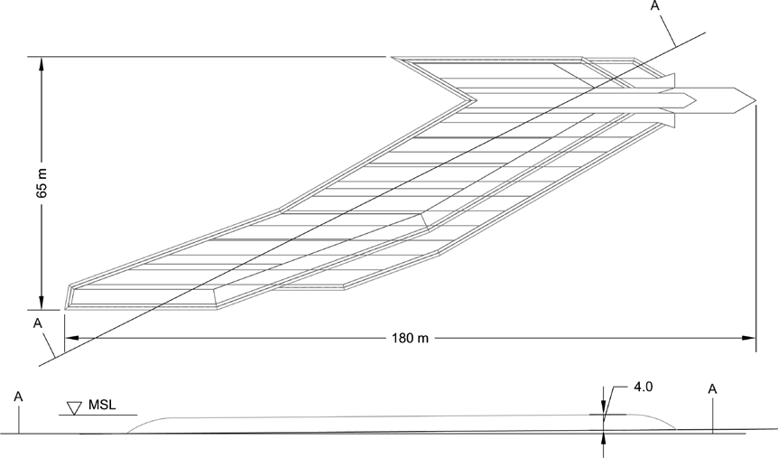

- **file**: `03_images/reefs/borth-coastal-defence-reef/borth-coastal-defence-reef_hrpp576-fig3-initial-north-reef_2013.png`
- **kind**: plan_figure
- **shows**: Plan of the INITIAL northern reef (truncated delta, 65 m x 180 m) with a side profile showing 4.0 m height above the seabed and the crest at about MSL.
- **structure visible**: True
- **state shown**: superseded design (the built reef is the extended, slimmer rock version)
- **image date**: pre-construction design, about 2009-10 (superseded)
- **citation**: Rigden, T., Stewart, T., Allsop, W., Johnson, A. (2013). Surf reefs - physical modelling results, not pipe dreams. HR Wallingford report HRPP576, presented at the ICE Coasts, Marine Structures and Breakwaters conference, Edinburgh, Sept 2013, page 4, Figure 3. https://eprints.hrwallingford.com/931/1/HRPP576_SurfReefs.pdf. Accessed 2026-10-06.
- **image URL**: https://eprints.hrwallingford.com/931/1/HRPP576_SurfReefs.pdf
- **source page**: HR Wallingford eprints
- **page / figure**: page 4, Figure 3 (native image of the PDF, 862 x 507 px)
- **credit**: HR Wallingford / Royal Haskoning DHV
- **licence**: not stated (open eprint)
- **retrieved**: 2026-10-06
- **used for**: cross_check; context
- **How used for the model**: Not used for geometry: it is the superseded initial design and is probably the origin of Gemini's 180 m x 65 m. Used to document the design evolution and as a rough cross-check of the 4.0 m reef height (built arm: about 4.5 m). shape.json source hrpp576f3.
- **3D check pending**: no - none: superseded design; height 4.0 m vs 4.5 m from the final sections noted
- **linked records**: 07_scale/shapes/borth-coastal-defence-reef/shape.json source hrpp576f3; 07_scale/shapes/borth-coastal-defence-reef/VERIFY.md check 2 and 6
- **size**: 0.06 MB, 862x507 px
- **sha256**: 330df5d52f39c9455d23d3fa30602d6cab6c63a965bcf53abed0699c4b6b361e
- **rights**: Private research copy; reuse rights to be checked before any public release.
- **display in HTML**: True
- **added by**: Borth shape verification + 3D-input preparation, 2026-10-06

## borth-coastal-defence-reef-img-19 - Royal Haskoning DRG 9V5090/1001 'General Arrangement', Phase 1, 1:2000

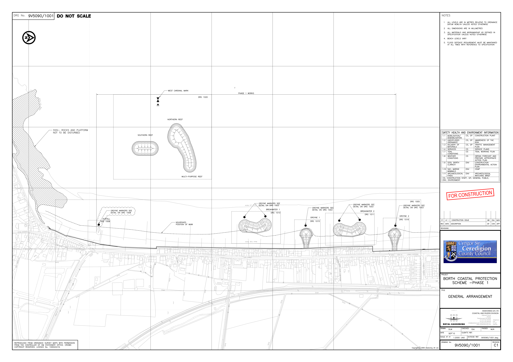

- **file**: `07_scale/shapes/borth-coastal-defence-reef/src/borth_rh-drg-9V5090-1001_general-arrangement_2010.png`
- **kind**: design_drawing
- **shows**: General arrangement of Phase 1: the Northern Reef (boot shape) and Southern Reef (oval) off the south end of Borth, west cardinal mark, SSSI rock platform, nourishment line, two breakwaters and two groynes.
- **structure visible**: True
- **state shown**: design (For Construction, rev C1 Jan 2011) = the layout that was built
- **image date**: 2010-09 (rev C1 2011-01)
- **citation**: Haskoning UK Ltd (Royal Haskoning) for Ceredigion County Council (2010; revision C1 Jan 2011). Borth Coastal Protection Scheme - Phase 1, Drawing 9V5090/1001 rev C1, 'General Arrangement' (1:2000), 'For Construction'. Published on the Borth Community website, Planning Drawings Phase 1, http://www.borthcommunity.info/index.php/planning-drawings/65-planning-drawings. Accessed 2026-10-06.
- **image URL**: http://www.borthcommunity.info/images/default_images/CoastalDefences/PlanningDrawings/9v5090%201001_rev%20c1.pdf
- **source page**: http://www.borthcommunity.info/index.php/planning-drawings/65-planning-drawings
- **page / figure**: whole A1 sheet (PDF page 1), rendered at 110 dpi; the original PDF is saved beside it as 07_scale/shapes/borth-coastal-defence-reef/src/borth_rh-drg-9V5090-1001_general-arrangement_2010.pdf
- **credit**: Royal Haskoning (Haskoning UK Ltd) / Ceredigion County Council
- **licence**: not stated (copyright Haskoning UK Ltd 2009 on the sheet; OS base map reproduced with HMSO permission, licence 100024419)
- **retrieved**: 2026-10-06
- **used for**: plan_trace; cross_check; context
- **How used for the model**: Confirms the layout that was built (two separate mounds, northern boot + southern oval) and their position about 300+ m off the frontage; no numbers read from it (1:2000). Recorded as shape.json source drg1001.
- **3D check pending**: no - none: layout confirmed against the imagery (verification 2026-10-06)
- **linked records**: 07_scale/shapes/borth-coastal-defence-reef/shape.json source drg1001; 07_scale/shapes/borth-coastal-defence-reef/VERIFY.md (3D inputs); 07_scale/shapes/borth-coastal-defence-reef/sources.md
- **size**: 1.31 MB, 3643x2573 px
- **sha256**: c710b35ce22409f8000627dce3cbeda0989a1df4e713420217b388bc0297ad91
- **rights**: Private research copy; reuse rights to be checked before any public release.
- **display in HTML**: True
- **added by**: Borth shape verification + 3D-input preparation, 2026-10-06

## borth-coastal-defence-reef-img-20 - Royal Haskoning DRG 9V5090/1020 'Multi-Purpose Reef Plan', Phase 1, 1:500

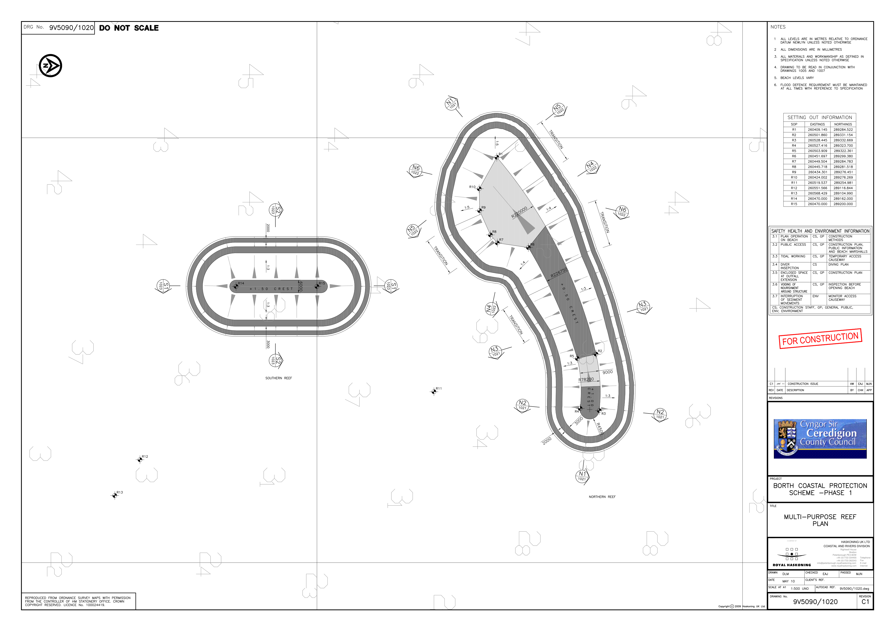

- **file**: `07_scale/shapes/borth-coastal-defence-reef/src/borth_rh-drg-9V5090-1020_multipurpose-reef-plan_2010.png`
- **kind**: design_drawing
- **shows**: Plan of both reefs with concentric toe/armour lines, crest zones (+0.50 arm, +1.00 tail, lens at the head, +1.50 oval), side slopes 1:3 / 1:4 / 1:5 and a setting-out table R1-R15 in OS National Grid.
- **structure visible**: True
- **state shown**: design (For Construction, rev C1 Jan 2011) = the layout that was built
- **image date**: 2010-05 (rev C1 2011-01)
- **citation**: Haskoning UK Ltd (Royal Haskoning) for Ceredigion County Council (2010; revision C1 Jan 2011). Borth Coastal Protection Scheme - Phase 1, Drawing 9V5090/1020 rev C1, 'Multi-Purpose Reef Plan' (1:500), 'For Construction'. Published on the Borth Community website, Planning Drawings Phase 1, http://www.borthcommunity.info/index.php/planning-drawings/65-planning-drawings. Accessed 2026-10-06.
- **image URL**: http://www.borthcommunity.info/images/default_images/CoastalDefences/PlanningDrawings/9v5090%201020_rev%20c1.pdf
- **source page**: http://www.borthcommunity.info/index.php/planning-drawings/65-planning-drawings
- **page / figure**: whole A1 sheet (PDF page 1), rendered at 110 dpi; the original PDF is saved beside it as 07_scale/shapes/borth-coastal-defence-reef/src/borth_rh-drg-9V5090-1020_multipurpose-reef-plan_2010.pdf
- **credit**: Royal Haskoning (Haskoning UK Ltd) / Ceredigion County Council
- **licence**: not stated (copyright Haskoning UK Ltd 2009 on the sheet; OS base map reproduced with HMSO permission, licence 100024419)
- **retrieved**: 2026-10-06
- **used for**: plan_trace; scale; 3d_crest; 3d_height_slopes; cross_check
- **How used for the model**: Georeferenced from its 15 printed setting-out points (residual 0.02 m, scale 1:500 exact); the five concentric vector rings of each reef were read from the PDF and compared with the satellite trace (IoU 0.79 N / 0.86 S for the armour foot). Crest zones, slopes and crest widths (9 m arm, 6 m oval) recorded as 3D inputs in VERIFY.md and HANDOFF.md; shape.json source drg1020 and canonical.alt_outlines_m.
- **3D check pending**: no - 3D agent: use the crest zones (+0.50 arm, +1.00 tail from SOP R3-R4 over a 15 m transition, +0.00 at head edge R1/R10 rising over about 40 m, +1.50 oval), slopes (1:3 arm and oval, 1:4 mid, 1:5 head), 9 m crest width of the arm, 6 m of the oval, and the armour-foot / seabed-edge rings in shape.json canonical.alt_outlines_m
- **annotated / overlay files**: `07_scale/shapes/borth-coastal-defence-reef/overlays/verify_design_lidar_vs_trace_sat2024.png`
- **linked records**: 07_scale/shapes/borth-coastal-defence-reef/shape.json source drg1020; 07_scale/shapes/borth-coastal-defence-reef/VERIFY.md (3D inputs); 07_scale/shapes/borth-coastal-defence-reef/sources.md
- **size**: 0.91 MB, 3643x2573 px
- **sha256**: 89d3b63d7df17d0c7311a5b3655f5e23d1d5085d6caa046b4541c8c337990a7f
- **rights**: Private research copy; reuse rights to be checked before any public release.
- **display in HTML**: True
- **added by**: Borth shape verification + 3D-input preparation, 2026-10-06
- **3D check result (2026-10-07)**: Rings 0-4, crest paths R1-R6 / R2-R5 and the setting-out points R1-R15 re-projected onto the drawing (A2): agree to about 1 pixel; design foot ring IoU 0.9998 against shape.json. Used for the design version, the crest zones (+0.50 / +1.00 / +0.00 ramp 40 m / +1.50) and the toe rings. Note: S1-S1 on 1023 dimensions the oval 46 m between R15 and R14, the SOP table gives 38 m (unresolved).
- **annotated versions (added 2026-10-07)**: 07_scale/shapes/borth-coastal-defence-reef/3d/annotated/A2_drg1020_rings_and_sop_read.png

## borth-coastal-defence-reef-img-21 - Royal Haskoning DRG 9V5090/1021 'Northern Reef Sections, sheet 1 of 2' (N1, N2, N3), 1:200

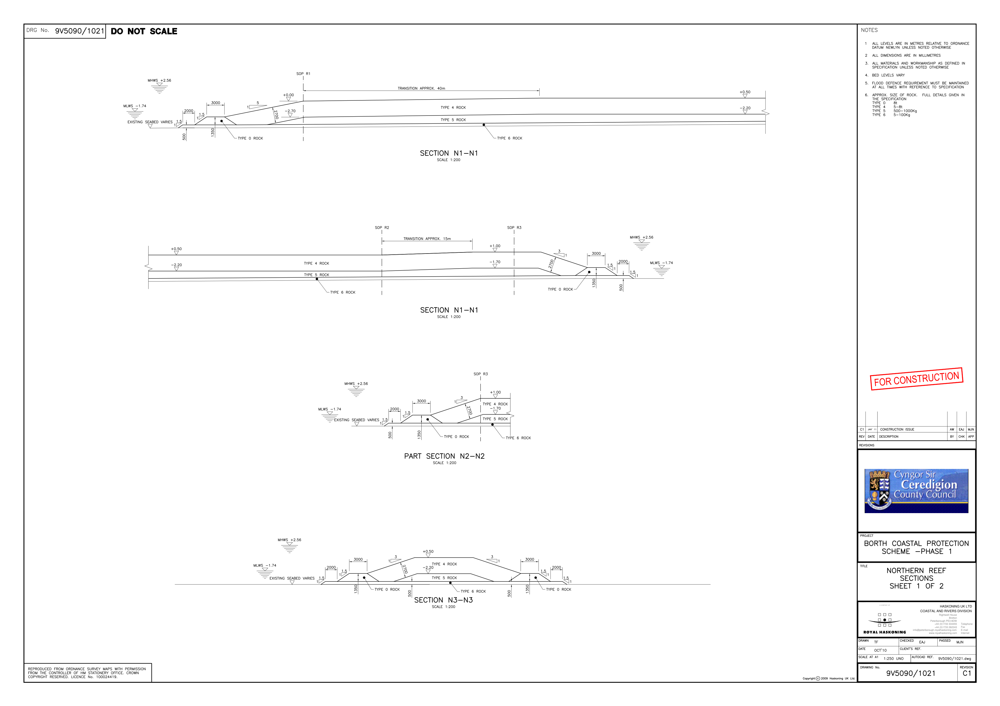

- **file**: `07_scale/shapes/borth-coastal-defence-reef/src/borth_rh-drg-9V5090-1021_northern-reef-sections-1_2010.png`
- **kind**: design_drawing
- **shows**: Sections of the northern reef along the axis (N1: +0.00 at the head edge SOP R1 rising to +0.50 over about 40 m; tail +1.00) and across the arm (N3: crest +0.50, 1:3 slopes, Type 4 / 5 / 6 layers, Type 0 toe berm) with MHWS +2.56 and MLWS -1.74 mODN.
- **structure visible**: True
- **state shown**: design (For Construction, rev C1 Jan 2011) = the layout that was built
- **image date**: 2010-10 (rev C1 2011-01)
- **citation**: Haskoning UK Ltd (Royal Haskoning) for Ceredigion County Council (2010; revision C1 Jan 2011). Borth Coastal Protection Scheme - Phase 1, Drawing 9V5090/1021 rev C1, 'Northern Reef Sections, sheet 1 of 2' (1:200), 'For Construction'. Published on the Borth Community website, Planning Drawings Phase 1, http://www.borthcommunity.info/index.php/planning-drawings/65-planning-drawings. Accessed 2026-10-06.
- **image URL**: http://www.borthcommunity.info/images/default_images/CoastalDefences/PlanningDrawings/9v5090%201021_rev%20c1.pdf
- **source page**: http://www.borthcommunity.info/index.php/planning-drawings/65-planning-drawings
- **page / figure**: whole A1 sheet (PDF page 1), rendered at 110 dpi; the original PDF is saved beside it as 07_scale/shapes/borth-coastal-defence-reef/src/borth_rh-drg-9V5090-1021_northern-reef-sections-1_2010.pdf
- **credit**: Royal Haskoning (Haskoning UK Ltd) / Ceredigion County Council
- **licence**: not stated (copyright Haskoning UK Ltd 2009 on the sheet; OS base map reproduced with HMSO permission, licence 100024419)
- **retrieved**: 2026-10-06
- **used for**: 3d_crest; 3d_height_slopes; 3d_seabed; 3d_tides
- **How used for the model**: Read: crest +0.50 / +1.00 / +0.00 mODN, slopes 1:3 and 1:5, layer levels (Type 4 top +0.50 to -2.20; Type 5 to about -3.5; Type 6 0.5 m), design tide levels, and the existing seabed line drawn at about -4.0 mODN (measured on a 300 dpi render, 1:200 scale, +-0.1 m). Recorded in VERIFY.md 3D inputs; shape.json source drg1021.
- **3D check pending**: no - model crest z (+0.50 mODN arm = +0.19 m MSL; +1.00 tail), seabed about -4.0 mODN (-4.3 m MSL), 1:3 slopes, toe berm; MHWS +2.56 / MLWS -1.74 mODN
- **linked records**: 07_scale/shapes/borth-coastal-defence-reef/shape.json source drg1021; 07_scale/shapes/borth-coastal-defence-reef/VERIFY.md (3D inputs); 07_scale/shapes/borth-coastal-defence-reef/sources.md
- **size**: 0.48 MB, 3643x2573 px
- **sha256**: b14dd55b5aceae004c95c6d20c1e72907c697b25d830ac2748c6a99ac7c62f23
- **rights**: Private research copy; reuse rights to be checked before any public release.
- **display in HTML**: True
- **added by**: Borth shape verification + 3D-input preparation, 2026-10-06
- **3D check result (2026-10-07)**: Readings confirmed (A3): arm crest +0.50, Type 4 underside -2.20, head +0.00 / -2.70, tail +1.00 / -1.70, transitions 40 m and 15 m, toe berm 1350 / 3000 / 2000 / 500 mm, MHWS +2.56 / MLWS -1.74 printed; the bed -4.0 mODN is derived (2.70 + 1.31 + 0.50 below +0.50), the ground line is schematic.
- **annotated versions (added 2026-10-07)**: 07_scale/shapes/borth-coastal-defence-reef/3d/annotated/A3_drg1021_sections_read.png

## borth-coastal-defence-reef-img-22 - Royal Haskoning DRG 9V5090/1022 'Northern Reef Sections, sheet 2 of 2' (N4, N5, N6), 1:200

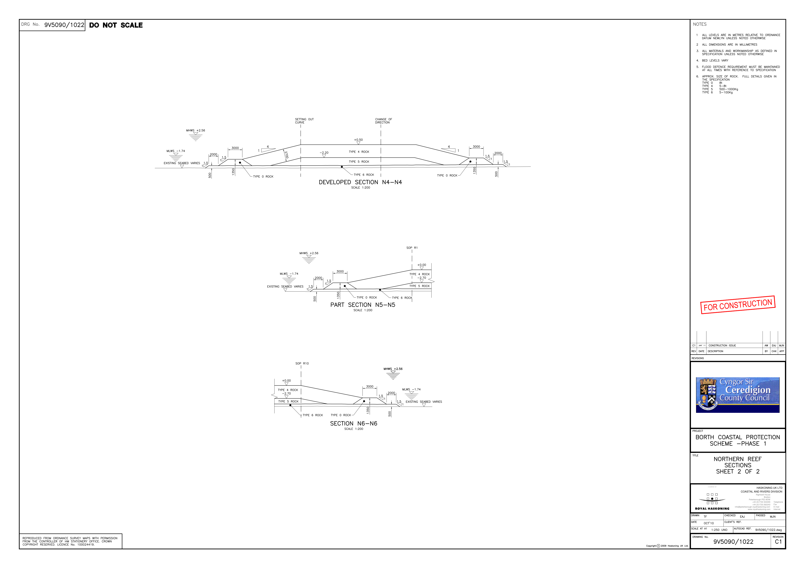

- **file**: `07_scale/shapes/borth-coastal-defence-reef/src/borth_rh-drg-9V5090-1022_northern-reef-sections-2_2010.png`
- **kind**: design_drawing
- **shows**: Developed section N4 (crest +0.50, 1:4 slopes) and head sections N5, N6 (crest +0.00 at SOP R1 / R10, 1:5 head slope).
- **structure visible**: True
- **state shown**: design (For Construction, rev C1 Jan 2011) = the layout that was built
- **image date**: 2010-10 (rev C1 2011-01)
- **citation**: Haskoning UK Ltd (Royal Haskoning) for Ceredigion County Council (2010; revision C1 Jan 2011). Borth Coastal Protection Scheme - Phase 1, Drawing 9V5090/1022 rev C1, 'Northern Reef Sections, sheet 2 of 2' (1:200), 'For Construction'. Published on the Borth Community website, Planning Drawings Phase 1, http://www.borthcommunity.info/index.php/planning-drawings/65-planning-drawings. Accessed 2026-10-06.
- **image URL**: http://www.borthcommunity.info/images/default_images/CoastalDefences/PlanningDrawings/9v5090%201022_rev%20c1.pdf
- **source page**: http://www.borthcommunity.info/index.php/planning-drawings/65-planning-drawings
- **page / figure**: whole A1 sheet (PDF page 1), rendered at 110 dpi; the original PDF is saved beside it as 07_scale/shapes/borth-coastal-defence-reef/src/borth_rh-drg-9V5090-1022_northern-reef-sections-2_2010.pdf
- **credit**: Royal Haskoning (Haskoning UK Ltd) / Ceredigion County Council
- **licence**: not stated (copyright Haskoning UK Ltd 2009 on the sheet; OS base map reproduced with HMSO permission, licence 100024419)
- **retrieved**: 2026-10-06
- **used for**: 3d_crest; 3d_height_slopes
- **How used for the model**: Read: 1:4 slopes in the mid-reef, 1:5 at the head, +0.00 head edge; recorded in VERIFY.md 3D inputs; shape.json source drg1022.
- **3D check pending**: no - head slope 1:5 and +0.00 mODN crest at the head edge, 1:4 mid-reef slope
- **linked records**: 07_scale/shapes/borth-coastal-defence-reef/shape.json source drg1022; 07_scale/shapes/borth-coastal-defence-reef/VERIFY.md (3D inputs); 07_scale/shapes/borth-coastal-defence-reef/sources.md
- **size**: 0.44 MB, 3643x2573 px
- **sha256**: 7b765cc5029188224a968eb8a5b92e1715c2afd367fc2bbea811f7c61fc9515d
- **rights**: Private research copy; reuse rights to be checked before any public release.
- **display in HTML**: True
- **added by**: Borth shape verification + 3D-input preparation, 2026-10-06
- **3D check result (2026-10-07)**: Readings confirmed (A4): N4 crest +0.50 with 1:4 flanks, layer 2.70 m; N5 / N6 head sections +0.00 / -2.70 at SOP R1 / R10; same toe berm as 1021.
- **annotated versions (added 2026-10-07)**: 07_scale/shapes/borth-coastal-defence-reef/3d/annotated/A4_drg1022_sections_read.png

## borth-coastal-defence-reef-img-23 - Royal Haskoning DRG 9V5090/1023 'Southern Reef Sections' (S1, S2), 1:200

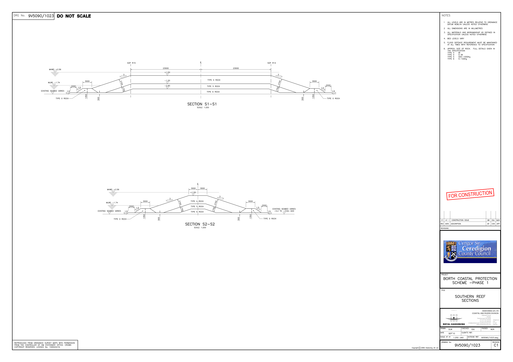

- **file**: `07_scale/shapes/borth-coastal-defence-reef/src/borth_rh-drg-9V5090-1023_southern-reef-sections_2010.png`
- **kind**: design_drawing
- **shows**: Longitudinal section S1 and cross-section S2 of the oval: crest +1.50 mODN (flat), 1:3 slopes, layers (Type 4 to -1.20, Type 5 to -2.90, Type 6), toe berm, note 'existing seabed varies -4.2 to -3.6 m AOD'.
- **structure visible**: True
- **state shown**: design (For Construction, rev C1 Jan 2011) = the layout that was built
- **image date**: 2010-09 (rev C1 2011-01)
- **citation**: Haskoning UK Ltd (Royal Haskoning) for Ceredigion County Council (2010; revision C1 Jan 2011). Borth Coastal Protection Scheme - Phase 1, Drawing 9V5090/1023 rev C1, 'Southern Reef Sections' (1:200), 'For Construction'. Published on the Borth Community website, Planning Drawings Phase 1, http://www.borthcommunity.info/index.php/planning-drawings/65-planning-drawings. Accessed 2026-10-06.
- **image URL**: http://www.borthcommunity.info/images/default_images/CoastalDefences/PlanningDrawings/9v5090%201023_rev%20c1.pdf
- **source page**: http://www.borthcommunity.info/index.php/planning-drawings/65-planning-drawings
- **page / figure**: whole A1 sheet (PDF page 1), rendered at 110 dpi; the original PDF is saved beside it as 07_scale/shapes/borth-coastal-defence-reef/src/borth_rh-drg-9V5090-1023_southern-reef-sections_2010.pdf
- **credit**: Royal Haskoning (Haskoning UK Ltd) / Ceredigion County Council
- **licence**: not stated (copyright Haskoning UK Ltd 2009 on the sheet; OS base map reproduced with HMSO permission, licence 100024419)
- **retrieved**: 2026-10-06
- **used for**: 3d_crest; 3d_height_slopes; 3d_seabed
- **How used for the model**: Read: crest +1.50 mODN, 1:3 slopes, layer levels, seabed -4.2 to -3.6 mAOD; recorded in VERIFY.md 3D inputs; shape.json source drg1023.
- **3D check pending**: no - oval crest +1.50 mODN (+1.19 m MSL), seabed -4.2..-3.6 mAOD, 1:3 slopes
- **linked records**: 07_scale/shapes/borth-coastal-defence-reef/shape.json source drg1023; 07_scale/shapes/borth-coastal-defence-reef/VERIFY.md (3D inputs); 07_scale/shapes/borth-coastal-defence-reef/sources.md
- **size**: 0.42 MB, 3643x2573 px
- **sha256**: b763e3d0f209bf65a76be3aac28a5ce3ca2271314d9724cbb35cf64228663223
- **rights**: Private research copy; reuse rights to be checked before any public release.
- **display in HTML**: True
- **added by**: Borth shape verification + 3D-input preparation, 2026-10-06
- **3D check result (2026-10-07)**: Readings confirmed (A5): oval crest +1.50, flat top 3000 + 3000 = 6 m, flanks 1:3, Type 4 underside -1.20, Type 5 underside -2.90 (bed derived -3.4, 0.2 m above the printed range), printed bed note '-4.2 TO -3.6m AOD' used for the oval nodes (-3.6 shoreward, -4.2 seaward).
- **annotated versions (added 2026-10-07)**: 07_scale/shapes/borth-coastal-defence-reef/3d/annotated/A5_drg1023_sections_read.png

## borth-coastal-defence-reef-img-24 - Welsh Government LiDAR DSM (2022-03-19) of the two Borth mounds with two cross-sections against the design levels

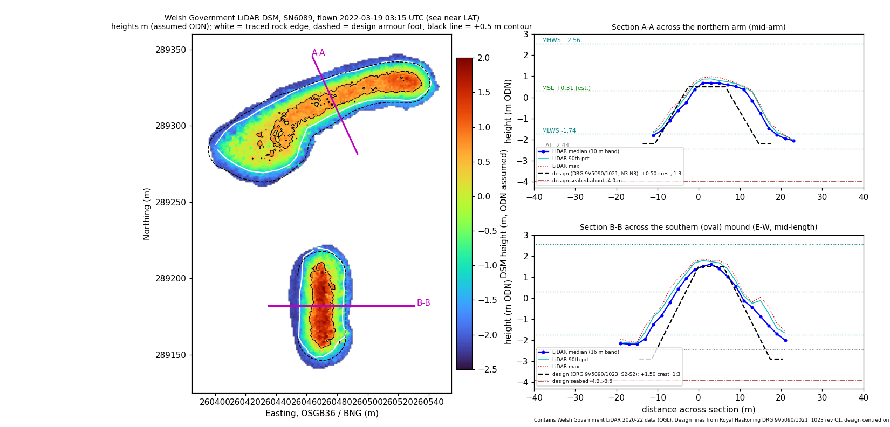

- **file**: `07_scale/shapes/borth-coastal-defence-reef/overlays/verify_lidar_dsm_2022-03-19_sections.png`
- **kind**: survey_plot
- **shows**: Colour map of the exposed rock heights (sea near LAT) of both mounds with the traced outline, the design armour foot, a +0.5 m contour, and two cross-sections (A-A across the northern arm, B-B across the oval) against the design crest, slopes and tide levels.
- **structure visible**: True
- **state shown**: as-built (rock exposed at about LAT, 2022-03-19)
- **image date**: 2022-03-19 (LiDAR); figure 2026-10-06
- **citation**: Contains Welsh Government LiDAR data (2022). LiDAR 1 m DSM tile SN6089, flown 2022-03-19 03:15-03:20 UTC, DataMapWales; analysis and figure by this project (2026-10-06). Open Government Licence v3. Data URL https://dmwproductionblob.blob.core.windows.net/lidar-zips/2020-22/dsm/wg_del_29_260289_20220319dsm.tif. Accessed 2026-10-06.
- **image URL**: https://dmwproductionblob.blob.core.windows.net/lidar-zips/2020-22/dsm/wg_del_29_260289_20220319dsm.tif
- **source page**: DataMapWales LiDAR tile catalogue (https://datamap.gov.wales/layers/geonode:welsh_government_lidar_tile_catalogue_2020_2023)
- **page / figure**: tile SN6089; figure = our derivative
- **credit**: Welsh Government (data); this project (figure)
- **licence**: Open Government Licence v3 (data); figure private research copy
- **retrieved**: 2026-10-06
- **used for**: 3d_crest; 3d_height_slopes; 3d_seabed; 3d_tides; cross_check; plan_trace
- **How used for the model**: Measured (values only; the tile is not kept in the project): exposed footprint N 5861 m2 and S 2814 m2; DSM crest p90 +0.72 mODN on the northern arm, +1.0..+1.15 near the tail, +1.5 on the oval (design +0.50 / +1.00 / +1.50); mean flank slope 1:4.4 (-1.5..-0.5 mODN) and 1:5.3 (-0.5..+0.2), flatter than the design 1:3; width at -2.3 mODN 34-37 m (arm), 50 m (head), 38-41 m (oval). The sea surface at acquisition (lowest returns -2.2..-2.4 mODN) matches LAT -2.44 mODN. Heights assumed ODN (not stated in the file).
- **3D check pending**: no - model crest and flank shape vs the LiDAR DSM (heights assumed ODN, +-0.15 m); exposed footprint at -2.3 mODN
- **linked records**: 07_scale/shapes/borth-coastal-defence-reef/shape.json source lidar2022; canonical.alt_outlines_m.lidar_exposed_2022-03-19; 07_scale/shapes/borth-coastal-defence-reef/VERIFY.md 3D inputs
- **size**: 0.34 MB, 1650x792 px
- **sha256**: b32751864cc3ef0103a12b0744581ddf99f658a12df2599ce85bf937e3469675
- **rights**: Private research copy; reuse rights to be checked before any public release.
- **display in HTML**: True
- **added by**: Borth shape verification + 3D-input preparation, 2026-10-06
- **3D check result (2026-10-07)**: LiDAR DSM inside the design crest strips (A6): N arm median +0.58 / p90 +0.91 against design +0.50; oval median +1.55 / p90 +1.75 against +1.50; default surface minus design surface above -2.0 mODN: mean +0.14 m, sd 0.28 m; as-built flanks flatter (1:4-1:5) and 8-10 m wider than the 1:3 design. Beach DTM vs Fig 2: salient behind the mounds (A7).
- **annotated versions (added 2026-10-07)**: 07_scale/shapes/borth-coastal-defence-reef/3d/annotated/A6_lidar_crest_check.png

## borth-coastal-defence-reef-img-25 - Esri 2024-09-17 image with the traced rock edge, the design armour foot and seabed edge (Royal Haskoning plan) and the LiDAR exposed outline

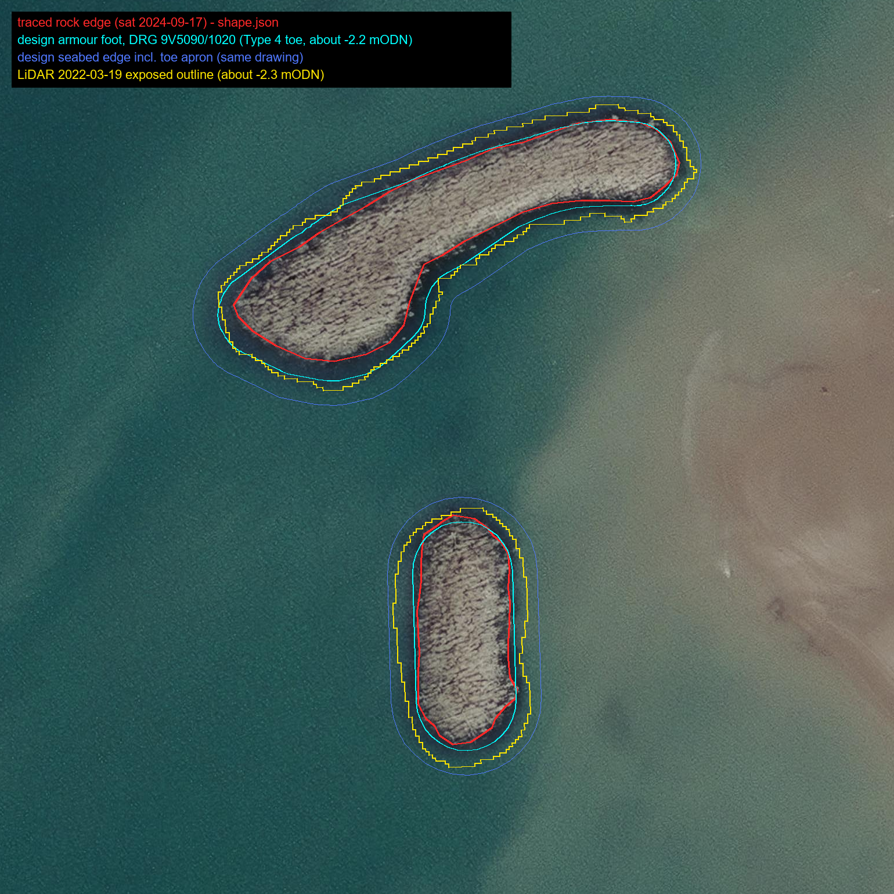

- **file**: `07_scale/shapes/borth-coastal-defence-reef/overlays/verify_design_lidar_vs_trace_sat2024.png`
- **kind**: diagram
- **shows**: Both mounds with four outlines: our traced visible-rock edge (red), the design armour foot (cyan), the design seabed edge (blue) and the LiDAR exposed outline (yellow); the boot-shaped northern reef and the oval match the design plan.
- **structure visible**: True
- **state shown**: as-built, current, compared with the design
- **image date**: image 2024-09-17; overlay 2026-10-06
- **citation**: Our overlay (2026-10-06) on Esri, Maxar, Earthstar Geographics and the GIS User Community (2024) World Imagery (image 2024-09-17), with design lines from Haskoning UK Ltd drawing 9V5090/1020 rev C1 and the Welsh Government LiDAR 2022 (OGL v3).
- **image URL**: https://server.arcgisonline.com/ArcGIS/rest/services/World_Imagery/MapServer/tile/{z}/{y}/{x}
- **source page**: Esri World Imagery; overlay made by this project
- **page / figure**: whole 1540 px frame
- **credit**: Esri/Maxar (image); Royal Haskoning (design lines); Welsh Government (LiDAR); this project (overlay)
- **licence**: Esri/Maxar terms; private research copy only
- **retrieved**: 2026-10-06
- **used for**: plan_trace; cross_check; scale
- **How used for the model**: Shows that the design plan (georeferenced by its OS-grid setting-out points) and the LiDAR outline sit on the imagery within 1-4 m and that the drawn rock edge is the innermost of the three footprint definitions. Basis of the dimensions_check rows in shape.json.
- **3D check pending**: no - none: planform check done (IoU 0.79 N / 0.86 S); the 3D agent chooses the footprint level (visible rock / design foot / LiDAR)
- **linked records**: 07_scale/shapes/borth-coastal-defence-reef/shape.json canonical.alt_outlines_m; verification check 1; 07_scale/shapes/borth-coastal-defence-reef/VERIFY.md
- **size**: 2.01 MB, 1540x1540 px
- **sha256**: d6c164e1d448490a692a77709c1225dd2f6330838794a6673b62de4fb42cad55
- **rights**: Private research copy; reuse rights to be checked before any public release.
- **display in HTML**: True
- **added by**: Borth shape verification + 3D-input preparation, 2026-10-06

## borth-coastal-defence-reef-img-26 - Garmin Navionics SonarChart Maps, zoom 17, Borth reef: shallow-shading series 0-10 m (11 files)

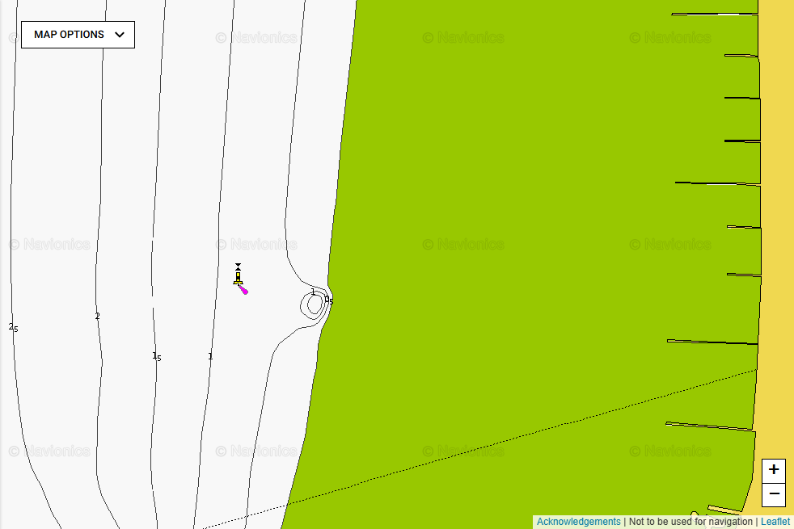

- **file**: `07_scale/shapes/borth-coastal-defence-reef/3d/src/navionics/sonar_z17_shade00.0.png`
- **kind**: chart_screenshot
- **shows**: The chart around the Borth reef at each shallow-shading value: a uniform green drying area from the beach to y 385-430 m with no raised feature at the rock mounds, contours 0.5-2.5 m seaward of it, one charted shoal 35 m off the north mound head.
- **structure visible**: False
- **state shown**: seabed (chart, data date unknown); the structure is not shown
- **image date**: chart data dates not shown by the viewer; screenshots 2026-10-07
- **citation**: Garmin Ltd / Navionics (2026). Marine Maps viewer, SonarChart Maps, depths in metres, zoom 17; series of 11 screenshots with 'Shallow shading' 0, 1, ... 10 m (centre 52.483453 N, 4.056205 W; page title 'Garmin | Marine Maps', 'Not to be used for navigation'). https://maps.garmin.com/en-US/marine?maps=another-brand&overlay=false&key=gcm4edq678dp (webapp.navionics.com redirects here). Captured 2026-10-07 by capture_navionics.py (own headless Chrome). Accessed 2026-10-07.
- **image URL**: https://maps.garmin.com/en-US/marine?maps=another-brand&overlay=false&key=gcm4edq678dp
- **source page**: https://maps.garmin.com/en-US/marine?maps=another-brand&overlay=false&key=gcm4edq678dp
- **page / figure**: SonarChart Maps zoom 17 (0.730 m/px); files sonar_z17_shade00.0 .. shade10.0 (the blue area is water shallower than the setting, so its edge is the chart contour of that depth)
- **credit**: Garmin Navionics charts and SonarChart (c) Navionics / Garmin Ltd; screenshots by this project (own headless Chrome)
- **licence**: Garmin/Navionics terms ('Not to be used for navigation'); no open licence; private research copy, reuse NOT cleared
- **retrieved**: 2026-10-07
- **used for**: 3d_seabed, cross_check
- **How used for the model**: Navionics cross-check (not a model input): contour lines read along 8 pixel rows (0 m = edge of the drying area at y 385-430 m, then 0.5, 1, 1.5, 2, 2.5 m); datum test by RMS: LAT best (RMS 1.15 m vs HRPP576 Fig 2 -4.0, 0.64 vs EMODnet, 2.30 vs the model) but the chart is 0.6-1.1 m shallower than the references offshore; the rock mounds are inside the uniform drying area and are not charted (no crest or height reading possible). SOURCES_3D.md STEP 2; METHODS_3D.md 3.6; model.js navionics.
- **3D check pending**: no - none: seabed and datum cross-check done (METHODS_3D.md 3.6)
- **linked records**: 07_scale/shapes/borth-coastal-defence-reef/3d/SOURCES_3D.md (STEP 2, Navionics); 07_scale/shapes/borth-coastal-defence-reef/3d/src/navionics/capture_log.json; 07_scale/shapes/borth-coastal-defence-reef/3d/nav_read.py; 07_scale/shapes/borth-coastal-defence-reef/3d/METHODS_3D.md section 3.6
- **size**: 25889 bytes, 982x655 px
- **sha256**: 8f2cfef6fa4cd26999e668112986b97db728be7ec94c2eb72ee87815a852baa1
- **rights**: Private research copy; reuse rights to be checked before any public release.
- **display in HTML**: True
- **added by**: Borth 3D model, finish run, 2026-10-07
- **annotated versions**: 07_scale/shapes/borth-coastal-defence-reef/3d/annotated/A9_navionics_sonarchart_z17_annotated.png
- **group files** (11): 07_scale/shapes/borth-coastal-defence-reef/3d/src/navionics/sonar_z17_shade00.0.png ... 07_scale/shapes/borth-coastal-defence-reef/3d/src/navionics/sonar_z17_shade10.0.png

## borth-coastal-defence-reef-img-27 - Garmin Navionics SonarChart Maps, zoom 18, Borth reef: shallow-shading series 0-10 m (11 files)

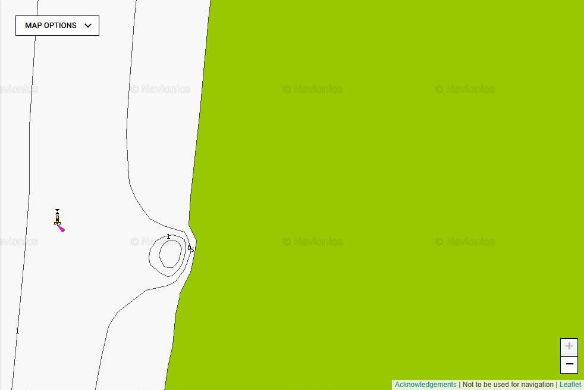

- **file**: `07_scale/shapes/borth-coastal-defence-reef/3d/src/navionics/sonar_z18_shade00.0.png`
- **kind**: chart_screenshot
- **shows**: The chart around the Borth reef at each shallow-shading value: a uniform green drying area from the beach to y 385-430 m with no raised feature at the rock mounds, contours 0.5-2.5 m seaward of it, one charted shoal 35 m off the north mound head.
- **structure visible**: False
- **state shown**: seabed (chart, data date unknown); the structure is not shown
- **image date**: chart data dates not shown by the viewer; screenshots 2026-10-07
- **citation**: Garmin Ltd / Navionics (2026). Marine Maps viewer, SonarChart Maps, depths in metres, zoom 18; series of 11 screenshots with 'Shallow shading' 0, 1, ... 10 m (centre 52.483453 N, 4.056205 W; page title 'Garmin | Marine Maps', 'Not to be used for navigation'). https://maps.garmin.com/en-US/marine?maps=another-brand&overlay=false&key=gcm4edq678dp (webapp.navionics.com redirects here). Captured 2026-10-07 by capture_navionics.py (own headless Chrome). Accessed 2026-10-07.
- **image URL**: https://maps.garmin.com/en-US/marine?maps=another-brand&overlay=false&key=gcm4edq678dp
- **source page**: https://maps.garmin.com/en-US/marine?maps=another-brand&overlay=false&key=gcm4edq678dp
- **page / figure**: SonarChart Maps zoom 18 (0.365 m/px); files sonar_z18_shade00.0 .. shade10.0 (the blue area is water shallower than the setting, so its edge is the chart contour of that depth)
- **credit**: Garmin Navionics charts and SonarChart (c) Navionics / Garmin Ltd; screenshots by this project (own headless Chrome)
- **licence**: Garmin/Navionics terms ('Not to be used for navigation'); no open licence; private research copy, reuse NOT cleared
- **retrieved**: 2026-10-07
- **used for**: 3d_seabed, cross_check
- **How used for the model**: Navionics cross-check (not a model input): contour lines read along 8 pixel rows (0 m = edge of the drying area at y 385-430 m, then 0.5, 1, 1.5, 2, 2.5 m); datum test by RMS: LAT best (RMS 1.15 m vs HRPP576 Fig 2 -4.0, 0.64 vs EMODnet, 2.30 vs the model) but the chart is 0.6-1.1 m shallower than the references offshore; the rock mounds are inside the uniform drying area and are not charted (no crest or height reading possible). SOURCES_3D.md STEP 2; METHODS_3D.md 3.6; model.js navionics.
- **3D check pending**: no - none: seabed and datum cross-check done (METHODS_3D.md 3.6)
- **linked records**: 07_scale/shapes/borth-coastal-defence-reef/3d/SOURCES_3D.md (STEP 2, Navionics); 07_scale/shapes/borth-coastal-defence-reef/3d/src/navionics/capture_log.json; 07_scale/shapes/borth-coastal-defence-reef/3d/nav_read.py; 07_scale/shapes/borth-coastal-defence-reef/3d/METHODS_3D.md section 3.6
- **size**: 19615 bytes, 982x655 px
- **sha256**: 2b513f09e755c4254aa223f17af94b96f6b5e3bf747613f949b53501bdf7a3b6
- **rights**: Private research copy; reuse rights to be checked before any public release.
- **display in HTML**: True
- **added by**: Borth 3D model, finish run, 2026-10-07
- **group files** (11): 07_scale/shapes/borth-coastal-defence-reef/3d/src/navionics/sonar_z18_shade00.0.png ... 07_scale/shapes/borth-coastal-defence-reef/3d/src/navionics/sonar_z18_shade10.0.png

## borth-coastal-defence-reef-img-28 - Garmin Navionics Nautical Charts, zoom 17, Borth reef: shallow-shading series 0-10 m (11 files)

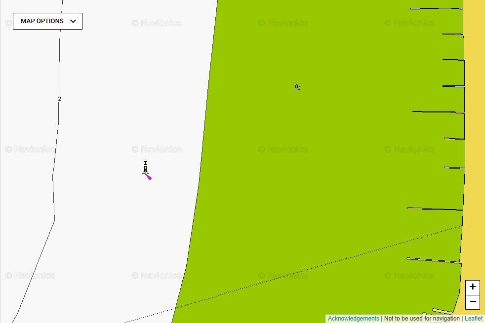

- **file**: `07_scale/shapes/borth-coastal-defence-reef/3d/src/navionics/naut_z17_shade00.0.png`
- **kind**: chart_screenshot
- **shows**: The chart around the Borth reef at each shallow-shading value: a uniform green drying area from the beach to y 385-430 m with no raised feature at the rock mounds, contours 0.5-2.5 m seaward of it, one charted shoal 35 m off the north mound head.
- **structure visible**: False
- **state shown**: seabed (chart, data date unknown); the structure is not shown
- **image date**: chart data dates not shown by the viewer; screenshots 2026-10-07
- **citation**: Garmin Ltd / Navionics (2026). Marine Maps viewer, Nautical Charts, depths in metres, zoom 17; series of 11 screenshots with 'Shallow shading' 0, 1, ... 10 m (centre 52.483453 N, 4.056205 W; page title 'Garmin | Marine Maps', 'Not to be used for navigation'). https://maps.garmin.com/en-US/marine?maps=another-brand&overlay=false&key=gcm4edq678dp (webapp.navionics.com redirects here). Captured 2026-10-07 by capture_navionics.py (own headless Chrome). Accessed 2026-10-07.
- **image URL**: https://maps.garmin.com/en-US/marine?maps=another-brand&overlay=false&key=gcm4edq678dp
- **source page**: https://maps.garmin.com/en-US/marine?maps=another-brand&overlay=false&key=gcm4edq678dp
- **page / figure**: Nautical Charts zoom 17 (0.730 m/px); files naut_z17_shade00.0 .. shade10.0 (the blue area is water shallower than the setting, so its edge is the chart contour of that depth)
- **credit**: Garmin Navionics charts and SonarChart (c) Navionics / Garmin Ltd; screenshots by this project (own headless Chrome)
- **licence**: Garmin/Navionics terms ('Not to be used for navigation'); no open licence; private research copy, reuse NOT cleared
- **retrieved**: 2026-10-07
- **used for**: 3d_seabed, cross_check
- **How used for the model**: Navionics cross-check (not a model input): contour lines read along 8 pixel rows (0 m = edge of the drying area at y 385-430 m, then 0.5, 1, 1.5, 2, 2.5 m); datum test by RMS: LAT best (RMS 1.15 m vs HRPP576 Fig 2 -4.0, 0.64 vs EMODnet, 2.30 vs the model) but the chart is 0.6-1.1 m shallower than the references offshore; the rock mounds are inside the uniform drying area and are not charted (no crest or height reading possible). SOURCES_3D.md STEP 2; METHODS_3D.md 3.6; model.js navionics.
- **3D check pending**: no - none: seabed and datum cross-check done (METHODS_3D.md 3.6)
- **linked records**: 07_scale/shapes/borth-coastal-defence-reef/3d/SOURCES_3D.md (STEP 2, Navionics); 07_scale/shapes/borth-coastal-defence-reef/3d/src/navionics/capture_log.json; 07_scale/shapes/borth-coastal-defence-reef/3d/nav_read.py; 07_scale/shapes/borth-coastal-defence-reef/3d/METHODS_3D.md section 3.6
- **size**: 24149 bytes, 982x655 px
- **sha256**: 07ee36de48906c4f848da753c89a9e91df06f28d57cfb46f47d5b2091af1b203
- **rights**: Private research copy; reuse rights to be checked before any public release.
- **display in HTML**: True
- **added by**: Borth 3D model, finish run, 2026-10-07
- **group files** (11): 07_scale/shapes/borth-coastal-defence-reef/3d/src/navionics/naut_z17_shade00.0.png ... 07_scale/shapes/borth-coastal-defence-reef/3d/src/navionics/naut_z17_shade10.0.png

## borth-coastal-defence-reef-img-29 - Garmin Navionics Nautical Charts, zoom 18, Borth reef: shallow-shading series 0-10 m (11 files)

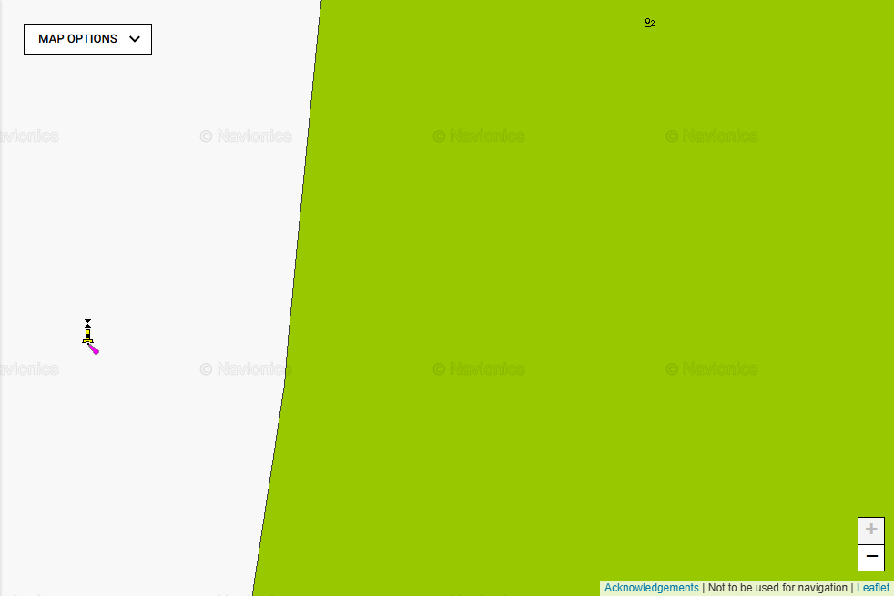

- **file**: `07_scale/shapes/borth-coastal-defence-reef/3d/src/navionics/naut_z18_shade00.0.png`
- **kind**: chart_screenshot
- **shows**: The chart around the Borth reef at each shallow-shading value: a uniform green drying area from the beach to y 385-430 m with no raised feature at the rock mounds, contours 0.5-2.5 m seaward of it, one charted shoal 35 m off the north mound head.
- **structure visible**: False
- **state shown**: seabed (chart, data date unknown); the structure is not shown
- **image date**: chart data dates not shown by the viewer; screenshots 2026-10-07
- **citation**: Garmin Ltd / Navionics (2026). Marine Maps viewer, Nautical Charts, depths in metres, zoom 18; series of 11 screenshots with 'Shallow shading' 0, 1, ... 10 m (centre 52.483453 N, 4.056205 W; page title 'Garmin | Marine Maps', 'Not to be used for navigation'). https://maps.garmin.com/en-US/marine?maps=another-brand&overlay=false&key=gcm4edq678dp (webapp.navionics.com redirects here). Captured 2026-10-07 by capture_navionics.py (own headless Chrome). Accessed 2026-10-07.
- **image URL**: https://maps.garmin.com/en-US/marine?maps=another-brand&overlay=false&key=gcm4edq678dp
- **source page**: https://maps.garmin.com/en-US/marine?maps=another-brand&overlay=false&key=gcm4edq678dp
- **page / figure**: Nautical Charts zoom 18 (0.365 m/px); files naut_z18_shade00.0 .. shade10.0 (the blue area is water shallower than the setting, so its edge is the chart contour of that depth)
- **credit**: Garmin Navionics charts and SonarChart (c) Navionics / Garmin Ltd; screenshots by this project (own headless Chrome)
- **licence**: Garmin/Navionics terms ('Not to be used for navigation'); no open licence; private research copy, reuse NOT cleared
- **retrieved**: 2026-10-07
- **used for**: 3d_seabed, cross_check
- **How used for the model**: Navionics cross-check (not a model input): contour lines read along 8 pixel rows (0 m = edge of the drying area at y 385-430 m, then 0.5, 1, 1.5, 2, 2.5 m); datum test by RMS: LAT best (RMS 1.15 m vs HRPP576 Fig 2 -4.0, 0.64 vs EMODnet, 2.30 vs the model) but the chart is 0.6-1.1 m shallower than the references offshore; the rock mounds are inside the uniform drying area and are not charted (no crest or height reading possible). SOURCES_3D.md STEP 2; METHODS_3D.md 3.6; model.js navionics.
- **3D check pending**: no - none: seabed and datum cross-check done (METHODS_3D.md 3.6)
- **linked records**: 07_scale/shapes/borth-coastal-defence-reef/3d/SOURCES_3D.md (STEP 2, Navionics); 07_scale/shapes/borth-coastal-defence-reef/3d/src/navionics/capture_log.json; 07_scale/shapes/borth-coastal-defence-reef/3d/nav_read.py; 07_scale/shapes/borth-coastal-defence-reef/3d/METHODS_3D.md section 3.6
- **size**: 17184 bytes, 982x655 px
- **sha256**: 2dc429de9a20189fc752870b3f8bb499fc482a18e07397f02cbadb10567138f7
- **rights**: Private research copy; reuse rights to be checked before any public release.
- **display in HTML**: True
- **added by**: Borth 3D model, finish run, 2026-10-07
- **annotated versions**: 07_scale/shapes/borth-coastal-defence-reef/3d/annotated/A10_navionics_nautical_z18_reef_outline.png
- **group files** (11): 07_scale/shapes/borth-coastal-defence-reef/3d/src/navionics/naut_z18_shade00.0.png ... 07_scale/shapes/borth-coastal-defence-reef/3d/src/navionics/naut_z18_shade10.0.png

## borth-coastal-defence-reef-img-30 - Borth model seabed: control nodes by source and modelled contours (figure by this project)

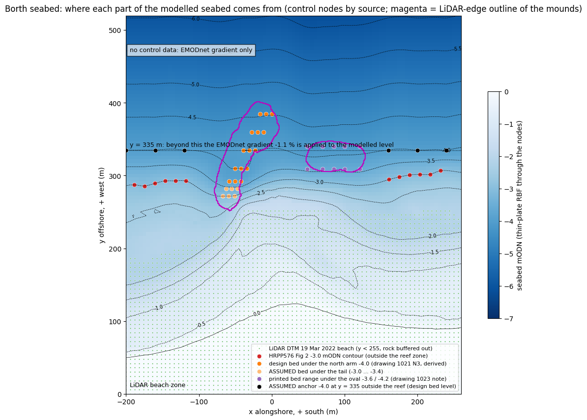

- **file**: `07_scale/shapes/borth-coastal-defence-reef/3d/annotated/A8_seabed_source_zones.png`
- **kind**: diagram
- **shows**: Plan map (x alongshore, y offshore) of the thin-plate seabed fit with the control nodes coloured by source (LiDAR beach, Fig 2 -3.0 contour, design bed under the arm and oval, assumed tail bed, assumed anchor -4.0 at y = 335 m) and the modelled contours.
- **structure visible**: True
- **state shown**: model seabed (derived)
- **image date**: 2026-10-07
- **citation**: This project (2026-10-07). Seabed source-zone map of the Borth 3D model; data: Welsh Government LiDAR 2022 DTM (OGL v3), HRPP576 Fig 2 (Rigden et al. 2013), Royal Haskoning drawings 9V5090/1021-1023, EMODnet DTM 2024 (CC BY 4.0). make_annotations.py.
- **image URL**: n/a (own figure)
- **source page**: 07_scale/shapes/borth-coastal-defence-reef/3d/make_annotations.py
- **page / figure**: annotated A8
- **credit**: this project (figure); data owners as cited
- **licence**: figure: private research copy; data licences as cited
- **retrieved**: 2026-10-07
- **used for**: 3d_seabed, cross_check
- **How used for the model**: Documents where every part of the modelled seabed comes from; shows the weak zones (tail bed assumed, anchor assumed, nothing between y 335 and 520 m but the EMODnet gradient). METHODS_3D.md 3.3 and 4.4.
- **3D check pending**: no - none: documentation figure
- **linked records**: 07_scale/shapes/borth-coastal-defence-reef/3d/METHODS_3D.md section 3.3; 07_scale/shapes/borth-coastal-defence-reef/3d/SOURCES_3D.md
- **size**: 223945 bytes, 1194x855 px
- **sha256**: 8ca5689a131732d91137aed0e1656bf2fee3b6793602a973df6f86df11d678b8
- **rights**: Private research copy; reuse rights to be checked before any public release.
- **display in HTML**: True
- **added by**: Borth 3D model, finish run, 2026-10-07
