# Image registry - boscombe-surf-reef

Source of truth: `images.json` in this folder (convention: `_agent_briefs/image_registry.md`; overview: `03_images/reefs/README.md`). This file is generated from it.

32 images registered, 32 with a file, 25 used for the model (any use other than context/not_used).

## boscombe-surf-reef-img-01 - Dry sand heap behind a beach safety fence with the 'Surf reef' safety sign (Flickr 'Bournemouth', Karen, 2009)

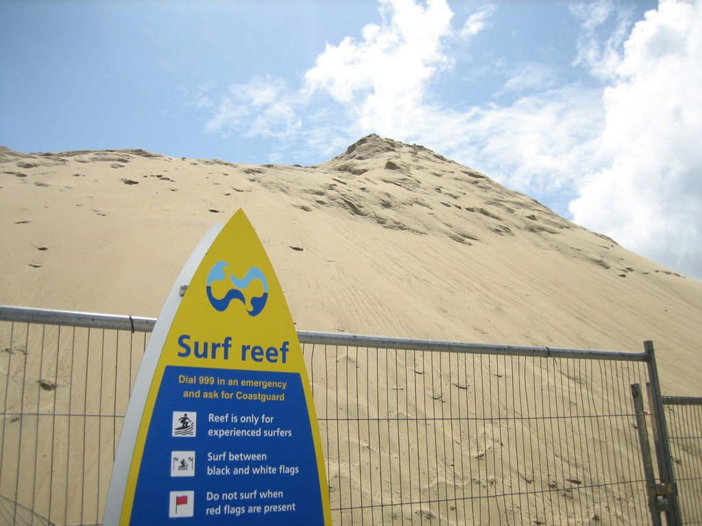

- **file**: `03_images/reefs/boscombe-surf-reef/boscombe-surf-reef_exposed-mound-flickr_2009-07.jpg`
- **kind**: photo
- **shows**: A large heap of dry, wind-rippled sand with footprints behind a temporary beach fence, with the permanent yellow/blue 'Surf reef' safety sign in front. No sea, waterline or reef structure is in view (the earlier reading 'exposed reef mound at extreme low tide' is not supported by the picture; it looks like a land-side sand stockpile or heap).
- **structure visible**: False
- **state shown**: not the reef itself: land-side sand heap beside the reef's safety sign (photo 2009-07-28, during construction, before the 19 Nov 2009 opening)
- **image date**: 2009-07-28 (Flickr 'Taken on', 13:06; posted 2010-07-02)
- **citation**: Karen ('cornerhouse') (2009-07-28). Bournemouth [photo]. Flickr, https://www.flickr.com/photos/cornerhouse/4756033698/ (CC BY 2.0); as republished in: Wavelength Surf Magazine (2016-11-08). Last bid to rescue Bournemouth's reef sinks. https://wavelengthmag.com/last-bid-rescue-bournemouths-reef-sinks/. Image file https://wavelengthmag.com/wp-content/uploads/2016/11/bournemouth-surf-reef.jpg. Accessed 2026-10-06.
- **image URL**: https://wavelengthmag.com/wp-content/uploads/2016/11/bournemouth-surf-reef.jpg
- **source page**: https://wavelengthmag.com/last-bid-rescue-bournemouths-reef-sinks/
- **page / figure**: article lead photo
- **credit**: Flickr user 'cornerhouse' (Karen); republished by Wavelength Surf Magazine
- **licence**: Flickr original is CC BY 2.0 (https://creativecommons.org/licenses/by/2.0/); Wavelength's republication not separately licensed (the Wavelength page itself returned HTTP 403 on 2026-10-06, so the article details come from the earlier card)
- **retrieved**: 2026-10-06
- **used for**: context
- **How used for the model**: Page illustration only (context). Corrected 2026-10-07: NOT evidence of crest exposure, tide height or reef geometry; no value taken from it.
- **3D check pending**: no - Crest exposure: the mound is out of the water at low tide on 2009-07-28 ~13:06; compare with the model crest (+0.5 m ACD design, +0.45..+0.65 m Oct 2009 DGPS) once the tide height at that moment is known (Bournemouth gauge) RESULT (2026-10-07, 3D re-check agent (seabed extension run)): Viewed 2026-10-07 (1024x768): dry sand heap, fence and safety sign only; no water, no waterline, no reef bags. It cannot test the crest against the tide. For context only: 2009-07-28 was about one day before first quarter (neap tides; moon-phase estimate, not a gauge value), when low water stays near MLWN -0.23 m MSL, above the design crest +0.5 m ACD = -0.9 m MSL, so the finished crest would not be exposed on that date. No change to the model.
- **linked records**: 02_research/reefs/boscombe-surf-reef.json images[0]; 05_qa/reef/boscombe-surf-reef_media_recheck.json images[0]
- **size**: 0.16 MB, 1024x768 px
- **sha256**: b877ade5cc9d898e415f198f6ed278c9ed8b7494b5a9f9e2ea694c016feb21c6
- **rights**: Private research copy; reuse rights to be checked before any public release.
- **display in HTML**: True
- **added by**: image-registry backfill, 2026-10-06

## boscombe-surf-reef-img-02 - Boscombe reef aerial from the pier side ('Boscombe Arial', Bournemouth Echo)

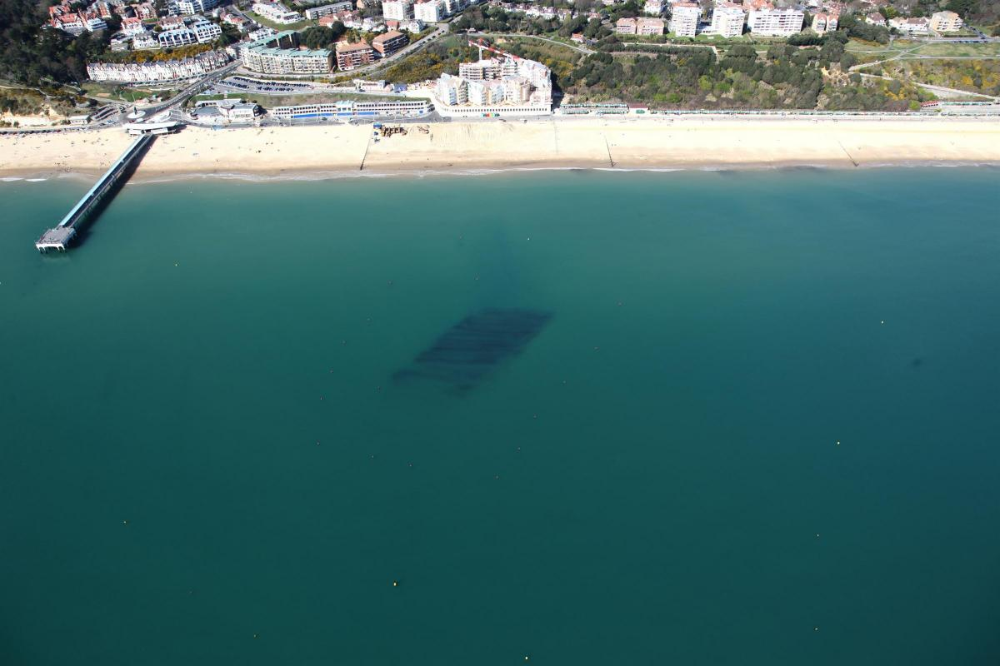

- **file**: `03_images/reefs/boscombe-surf-reef/boscombe-surf-reef_aerial-from-pier_unknown-date.jpg`
- **kind**: aerial
- **shows**: Aerial view of Boscombe pier and seafront with a dark rectangular submerged shape offshore in turquoise water: the geotextile bag field seen through shallow water.
- **structure visible**: True
- **state shown**: as-built (date unknown, after 2009 construction)
- **image date**: unknown (published on Raised Water Research 2019-11 or earlier; Bournemouth Echo photo)
- **citation**: Bournemouth Echo (n.d.; photo date not stated), captioned 'Boscombe Arial'. In: Raised Water Research (2019). Boscombe Surf Reef [web page, spot/artificial-reef/europe/united-kingdom]. https://raisedwaterresearch.com/spot/artificial-reef/europe/united-kingdom/boscombe-surf-reef/. Image file https://raisedwaterresearch.com/wp-content/uploads/2019/11/Boscombe-Arial.jpg. Accessed 2026-10-06.
- **image URL**: https://raisedwaterresearch.com/wp-content/uploads/2019/11/Boscombe-Arial.jpg
- **source page**: https://raisedwaterresearch.com/spot/artificial-reef/europe/united-kingdom/boscombe-surf-reef/
- **page / figure**: page gallery, caption 'Boscombe Arial'
- **credit**: Bournemouth Echo (via Raised Water Research)
- **licence**: not stated (no licence on the page; credited to Bournemouth Echo)
- **retrieved**: 2026-10-06
- **used for**: cross_check; context
- **How used for the model**: Page illustration. 2026-10-07 geometry check (oblique, uncalibrated photo): orientation, aspect and position east of the pier agree with shape.json (see 3D check result); no dimensions were read from it.
- **3D check pending**: no - Planform and position: does the dark rectangle's orientation, aspect and distance from the pier/seawall match shape.json (121 x 45 m, west edge 242 m E of the pier head, shore-normal 173 deg)? RESULT (2026-10-07, 3D re-check agent (seabed extension run)): Viewed 2026-10-07 (1200x800). Pier at the left; the reef is a dark parallelogram with parallel stripes (bag rows) in shallow water offshore, east of the pier. Its long axis rises towards the shore at the east end (about 23 deg in the image; the model toe polygon runs from offshore-west (-38, 275) to shore-east (50, 188) = 45 deg from the shore-normal, and a pitch of about 25 deg foreshortens the depth axis by about 0.4: consistent). Position/size: pier head to reef west edge 410 px vs reef alongshore width 190 px (ratio 2.2); the model gives 242 m / 88 m = 2.75, and the pier head is farther from the camera than the reef (scale ratio 1.3 implies a camera depression of about 25 deg and f about 1.1 image widths, plausible). The shoreline is a straight beach/water line parallel to the image x axis, as in the model (y = 0). Conclusion: no contradiction with shape.json (planform, position, orientation); not a calibrated measurement (+-20 % on distances). No change to the model.
- **linked records**: 02_research/reefs/boscombe-surf-reef.json images; 05_qa/reef/boscombe-surf-reef_media_recheck.json images
- **size**: 0.08 MB, 1200x800 px
- **sha256**: 71b676a993ed9934892e9df8651354a36f0357c9c81a0b3c84d45653401b3a5b
- **rights**: Private research copy; reuse rights to be checked before any public release.
- **display in HTML**: True
- **added by**: image-registry backfill, 2026-10-06

## boscombe-surf-reef-img-03 - Boscombe reef bag rows breaking the surface ('Boscombe Exposed', Bournemouth Echo)

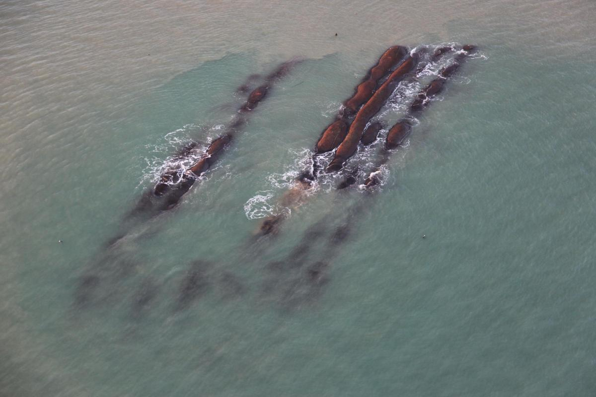

- **file**: `03_images/reefs/boscombe-surf-reef/boscombe-surf-reef_bags-exposed_unknown-date.jpg`
- **kind**: photo
- **shows**: Close aerial/drone shot over the water: two parallel rows of dark rounded sausage-like bag tops break the surface with whitewater around them.
- **structure visible**: True
- **state shown**: as-built (date unknown)
- **image date**: unknown (published on Raised Water Research 2019-11 or earlier; Bournemouth Echo photo)
- **citation**: Bournemouth Echo (n.d.; photo date not stated), captioned 'Boscombe Exposed'. In: Raised Water Research (2019). Boscombe Surf Reef [web page, spot/artificial-reef/europe/united-kingdom]. https://raisedwaterresearch.com/spot/artificial-reef/europe/united-kingdom/boscombe-surf-reef/. Image file https://raisedwaterresearch.com/wp-content/uploads/2019/11/Boscombe-Exposed.jpg. Accessed 2026-10-06.
- **image URL**: https://raisedwaterresearch.com/wp-content/uploads/2019/11/Boscombe-Exposed.jpg
- **source page**: https://raisedwaterresearch.com/spot/artificial-reef/europe/united-kingdom/boscombe-surf-reef/
- **page / figure**: page gallery, caption 'Boscombe Exposed'
- **credit**: Bournemouth Echo (via Raised Water Research)
- **licence**: not stated (no licence on the page; credited to Bournemouth Echo)
- **retrieved**: 2026-10-06
- **used for**: cross_check; context
- **How used for the model**: Page illustration. 2026-10-07 qualitative check: bag-row layout and highest bags at the shoreward end agree with the model's survey-based crest zones; tide, date and scale unknown, so no value was measured.
- **3D check pending**: no - Crest exposure and bag-row layout: two parallel rows of bags exposed at an unknown tide; compare with the model's idealised two-layer loft and the +0.5 m ACD crest RESULT (2026-10-07, 3D re-check agent (seabed extension run)): Viewed 2026-10-07 (1200x800). Two groups of long parallel bag rows (3-4 rows each), both tilted about 45 deg like the model's reef axis; only the upper-right ends of the rows break the surface with whitewater, the lower-left ends are submerged and dark. If the photo is shore-up, this matches the April 2011 DGPS surface in the model, whose highest part (>= 0 m ACD, 296 m2) lies at the shoreward-east end (x 28..34, y 187..198) and falls towards the offshore-west end; the idealised as-built loft (flat crest +0.5 m ACD over the core) is simpler than this. Date and tide unknown (exposure needs a tide near or below MLWS +0.45 m ACD), so no crest value can be derived. No change to the model.
- **linked records**: 02_research/reefs/boscombe-surf-reef.json images; 05_qa/reef/boscombe-surf-reef_media_recheck.json images
- **size**: 0.09 MB, 1200x800 px
- **sha256**: 9f1ae5112f97c8d0cc9efee0a196325300ee9fbaf8b71cf4d5908cc408dceca1
- **rights**: Private research copy; reuse rights to be checked before any public release.
- **display in HTML**: True
- **added by**: image-registry backfill, 2026-10-06

## boscombe-surf-reef-img-04 - Torn geotextile container fabric ('Boscombe Propeller Damage', Bournemouth Echo)

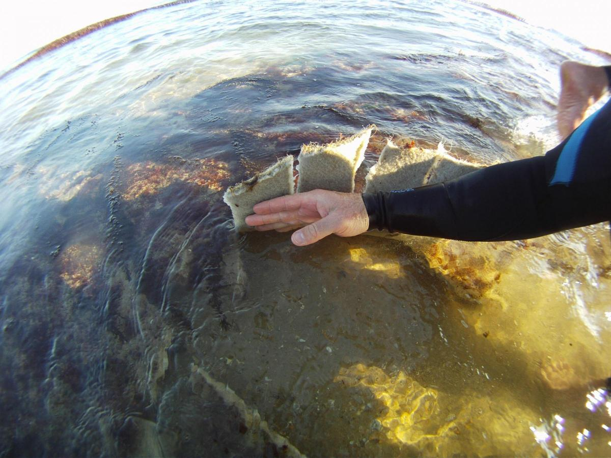

- **file**: `03_images/reefs/boscombe-surf-reef/boscombe-surf-reef_propeller-damage_unknown-date.jpg`
- **kind**: photo
- **shows**: Close-up fisheye shot of a gloved hand touching a torn, frayed edge of tan geotextile fabric above shallow water, with an algae-covered bag below.
- **structure visible**: True
- **state shown**: damaged (2011 propeller strike / torn container)
- **image date**: unknown (published on Raised Water Research 2019-11 or earlier; Bournemouth Echo photo)
- **citation**: Bournemouth Echo (n.d.; photo date not stated), captioned 'Boscombe Propeller Damage'. In: Raised Water Research (2019). Boscombe Surf Reef [web page, spot/artificial-reef/europe/united-kingdom]. https://raisedwaterresearch.com/spot/artificial-reef/europe/united-kingdom/boscombe-surf-reef/. Image file https://raisedwaterresearch.com/wp-content/uploads/2019/11/Boscombe-Propeller-Damage.jpg. Accessed 2026-10-06.
- **image URL**: https://raisedwaterresearch.com/wp-content/uploads/2019/11/Boscombe-Propeller-Damage.jpg
- **source page**: https://raisedwaterresearch.com/spot/artificial-reef/europe/united-kingdom/boscombe-surf-reef/
- **page / figure**: page gallery, caption 'Boscombe Propeller Damage'
- **credit**: Bournemouth Echo (via Raised Water Research)
- **licence**: not stated (no licence on the page; credited to Bournemouth Echo)
- **retrieved**: 2026-10-06
- **used for**: context
- **How used for the model**: Page illustration of the 2011 damage; not used for any model value (the model draws the as-built 2009 state).
- **3D check pending**: no - none: close-up of fabric damage, no geometry
- **linked records**: 02_research/reefs/boscombe-surf-reef.json images; 05_qa/reef/boscombe-surf-reef_media_recheck.json images
- **size**: 0.15 MB, 1200x900 px
- **sha256**: 9e7a23634d77e52921c84fd282c462964a33d5084f228a18a46266a4c1cecbd5
- **rights**: Private research copy; reuse rights to be checked before any public release.
- **display in HTML**: True
- **added by**: image-registry backfill, 2026-10-06

## boscombe-surf-reef-img-05 - Sketch of Boscombe Surf Reef construction (stacked-bag ramp cross-section)

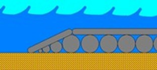

- **file**: `03_images/reefs/boscombe-surf-reef/boscombe-surf-reef_construction-sketch-whiston_2010-04.jpg`
- **kind**: diagram
- **shows**: Flat-colour cross-section sketch of grey cylindrical bags stacked into an angled ramp on the seabed with wave symbols breaking over it (not a photograph, no scale).
- **structure visible**: True
- **state shown**: design (schematic)
- **image date**: 2010-04-02
- **citation**: Whiston, Phil (2010-04-02). Boscombe Surf Reef [sketch of Boscombe Surf reef construction]. Wikimedia Commons, File:Boscombe_Surf_Reef.jpg. https://commons.wikimedia.org/wiki/File:Boscombe_Surf_Reef.jpg. Accessed 2026-10-06.
- **image URL**: https://upload.wikimedia.org/wikipedia/commons/5/57/Boscombe_Surf_Reef.jpg
- **source page**: https://commons.wikimedia.org/wiki/File:Boscombe_Surf_Reef.jpg
- **page / figure**: whole image (312 x 139 px)
- **credit**: Phil Whiston (own work), via Wikimedia Commons
- **licence**: CC BY-SA 3.0 (https://creativecommons.org/licenses/by-sa/3.0) per the Commons API; the card also records a GFDL 1.2+ dual licence
- **retrieved**: 2026-10-06
- **used for**: context
- **How used for the model**: Page illustration of the design concept (angled ramp of stacked containers). No numbers read: unscaled.
- **3D check pending**: no - none: unscaled schematic
- **linked records**: 02_research/reefs/boscombe-surf-reef.json images[4]
- **size**: 0.02 MB, 312x139 px
- **sha256**: 5ef967bcdf8e15aa3a742161b4f048fff1be6997e59c248aa63b03787d38f6a0
- **rights**: Private research copy; reuse rights to be checked before any public release.
- **display in HTML**: True
- **added by**: image-registry backfill, 2026-10-06

## boscombe-surf-reef-img-06 - Video frame: surfer by the pier pilings, on-screen 'Before' label (BoscombeReef, 'Boscombe Surf Reef - The Story')

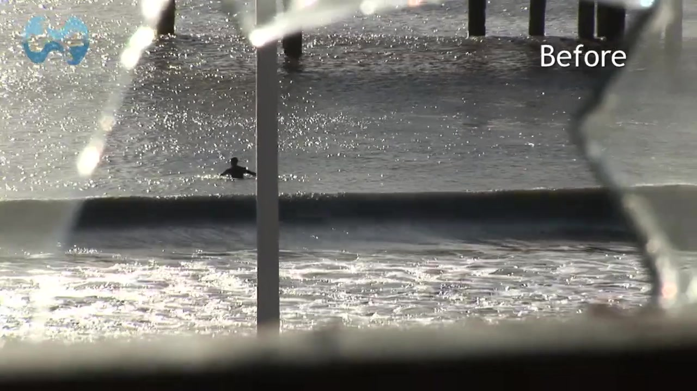

- **file**: `03_images/video_frames/boscombe-surf-reef/F0PslWKkbf4_0045.jpg`
- **kind**: video_frame
- **shows**: A grainy 'Before' title-card shot near the pier pilings: one surfer in calm water with a small wave - the pre-reef baseline, so the reef is not in the picture.
- **structure visible**: False
- **state shown**: pre-construction (baseline)
- **image date**: before 2009 (pre-reef baseline shown in a film published 2010-02-25)
- **citation**: BoscombeReef (2010-02-25). "Boscombe Surf Reef - The Story" [video]. YouTube, frame at 00:45. https://www.youtube.com/watch?v=F0PslWKkbf4. Accessed 2026-09-25.
- **image URL**: https://www.youtube.com/watch?v=F0PslWKkbf4
- **source page**: https://www.youtube.com/watch?v=F0PslWKkbf4
- **page / figure**: frame at 00:45 (video length 315 s)
- **credit**: BoscombeReef (YouTube channel)
- **licence**: YouTube standard licence (not an open licence); single frame kept as a private research copy
- **retrieved**: 2026-09-24
- **used for**: context
- **How used for the model**: Page illustration only (pre-reef baseline of the documentary's before/after sequence). Not used for any model value.
- **3D check pending**: no - none: image already used as a model source or is context only
- **linked records**: 02_research/videos/boscombe-surf-reef/videos.json (F0PslWKkbf4); 05_qa/reef/boscombe-surf-reef_media_recheck.json frames[0]
- **size**: 0.15 MB, 1280x720 px
- **sha256**: 6008ea68a5326c4cb86b8ecb1b53a9625641fcb987323a71a6448b7d9466392f
- **rights**: Private research copy; reuse rights to be checked before any public release.
- **display in HTML**: True
- **added by**: image-registry backfill, 2026-10-06

## boscombe-surf-reef-img-07 - Video frame: wave breaking over the reef with bodyboarder and marker buoys (Sean Gardiner, Nov 2009)

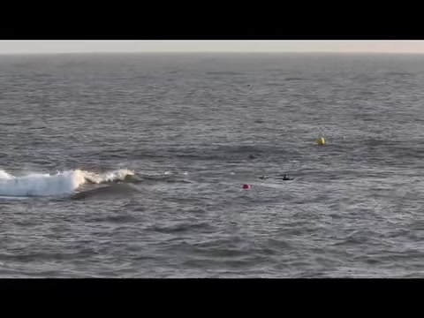

- **file**: `03_images/video_frames/boscombe-surf-reef/eceOTU06Dts_0018.jpg`
- **kind**: video_frame
- **shows**: A wave breaking left-to-right with two figures in the water near pink and yellow marker buoys, roughly where the reef's marker buoys sit (identified by the video description).
- **structure visible**: False
- **state shown**: as-built (Nov 2009, structure submerged; surf visible)
- **image date**: 2009-11 (one day after the official press launch; uploaded 2009-11-06)
- **citation**: Sean Gardiner (2009-11-06). "Boscombe Surf Reef in action November 2009, Bournemouth UK" [video]. YouTube, frame at 00:18. https://www.youtube.com/watch?v=eceOTU06Dts. Accessed 2026-09-25.
- **image URL**: https://www.youtube.com/watch?v=eceOTU06Dts
- **source page**: https://www.youtube.com/watch?v=eceOTU06Dts
- **page / figure**: frame at 00:18 (video length 63 s)
- **credit**: Sean Gardiner (YouTube channel)
- **licence**: YouTube standard licence (not an open licence); single frame kept as a private research copy
- **retrieved**: 2026-09-24
- **used for**: context
- **How used for the model**: Page illustration of the reef in use. Reef not visible under water; no measurement possible.
- **3D check pending**: no - Buoy positions and break line relative to the reef outline: the marker buoys (pink/yellow) mark the reef corners in this frame; compare with the shape.json outline and model position if a georeferenced view can be built RESULT (2026-10-07, 3D re-check agent (seabed extension run)): Viewed 2026-10-07 (480x360, letterboxed). A wave breaks at the left; a yellow buoy (upper right) and a pink/red buoy with a bodyboarder (centre) in open water to the horizon; no pier, beach or building in view. It cannot be georeferenced and no distance can be converted to metres, so planform and position cannot be tested. No change to the model.
- **linked records**: 02_research/videos/boscombe-surf-reef/videos.json (eceOTU06Dts); 05_qa/reef/boscombe-surf-reef_media_recheck.json frames[1]
- **size**: 0.03 MB, 480x360 px
- **sha256**: 4035095b5c592f861130e9b4db89608b5466cd1b9479a46bd4862c912bf7d6d8
- **rights**: Private research copy; reuse rights to be checked before any public release.
- **display in HTML**: True
- **added by**: image-registry backfill, 2026-10-06

## boscombe-surf-reef-img-08 - Esri World Imagery Wayback release 10, Boscombe wide crop incl. pier, groynes and reef (2011-09-28)

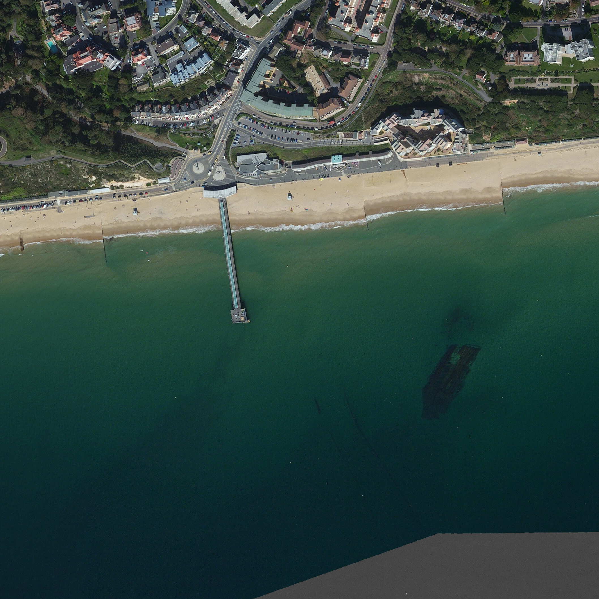

- **file**: `07_scale/shapes/boscombe-surf-reef/src/esri_wayback10_2011-09-28_z18_wide.png`
- **kind**: satellite
- **shows**: The bag field is visible as a dark, tile-textured patch off the east side of Boscombe pier, with the individual bag rows resolvable; pier and groynes give scale.
- **structure visible**: True
- **state shown**: as-built, damaged (2011-09-28, after the April 2011 container failure, before the Aug 2011 repairs)
- **image date**: 2011-09-28 (SRC_DATE2 of the release-10 metadata layer at the crop centre)
- **citation**: Esri, Maxar, Earthstar Geographics, and the GIS User Community (2011). World Imagery Wayback release 10, image captured 2011-09-28. Esri World Imagery tile service, https://server.arcgisonline.com/ArcGIS/rest/services/World_Imagery/MapServer, via Esri Wayback https://livingatlas.arcgis.com/wayback/. Accessed 2026-10-04.
- **image URL**: https://wayback.maptiles.arcgis.com/arcgis/rest/services/World_Imagery/WMTS/1.0.0/default028mm/MapServer/tile/10/{z}/{y}/{x}
- **source page**: https://livingatlas.arcgis.com/wayback/ (Esri Wayback)
- **page / figure**: z18 tiles stitched with 07_scale/tools/satellite.py; 800 m box centred 50.7185 N 1.8417 W, 2116x2116 px
- **credit**: Esri, Maxar, Earthstar Geographics, and the GIS User Community
- **licence**: Esri/Maxar imagery terms (not an open licence); private research copy only
- **retrieved**: 2026-10-04
- **used for**: plan_trace; scale
- **How used for the model**: PRIMARY image: the outer edge of the dark bag field was traced as the 25-vertex shape.json outline (4,042 m2, 121 x 45 m); georeference and 168-180 m pier-length check give the scale; the same outline defines the canonical frame in the 3D model (model.js S1/S7, provenance 'Reef toe outline', 'Shoreline').
- **3D check pending**: no - none: image already used as a model source or is context only
- **annotated / overlay files**: `07_scale/shapes/boscombe-surf-reef/3d/annotated/sat2011_model_frame.png`; `07_scale/shapes/boscombe-surf-reef/overlays/img1_trace_context.png`; `07_scale/shapes/boscombe-surf-reef/overlays/img1_trace_closeup.png`; `07_scale/shapes/boscombe-surf-reef/overlays/img1_verify_closeup.png`; `07_scale/shapes/boscombe-surf-reef/overlays/canonical_comparison.png`
- **linked records**: 07_scale/shapes/boscombe-surf-reef/sources.md img1; 07_scale/shapes/boscombe-surf-reef/shape.json sources[img1]; 07_scale/shapes/boscombe-surf-reef/3d/SOURCES_3D.md (Step 1a, a); 07_scale/shapes/boscombe-surf-reef/3d/model.js sources S1, S7
- **size**: 5.51 MB, 2116x2116 px
- **sha256**: 71f42922d0e5338de0da9078520a09de676fea8a7e84ca476edcf60fde400c70
- **rights**: Private research copy; reuse rights to be checked before any public release.
- **display in HTML**: True
- **added by**: image-registry backfill, 2026-10-06

## boscombe-surf-reef-img-09 - Rendle & Davidson (2012) Fig. 9, whole figure as embedded (April 2011 bathymetry map + profile panels, native 998x580 px)

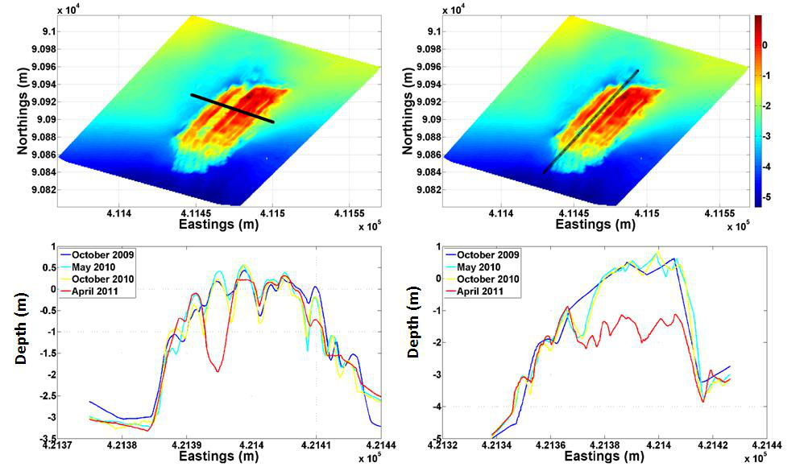

- **file**: `07_scale/shapes/boscombe-surf-reef/src/rendle_davidson_2012_fig9_bathymetry_apr2011_native.png`
- **kind**: survey_plot
- **shows**: Colour-coded DGPS bathymetry map of the reef (OSGB36 grid) with four cross/along-reef profile panels from Oct 2009 to Apr 2011; the bag field, the damaged 70 m container trough and the surrounding seabed are visible.
- **structure visible**: True
- **state shown**: as-built (Oct 2009 profiles) and damaged (April 2011 map)
- **image date**: surveys Oct 2009 - Apr 2011 (published 2012-09-28)
- **citation**: Rendle, E.J. & Davidson, M. (2012). An evaluation of the physical impact and structural integrity of a geotextile surf reef. Coastal Engineering Proceedings 33 (ICCE 2012, Coastal Structures), structures.21, doi:10.9753/icce.v33.structures.21, p.7, Figure 9 (April 2011 DGPS bathymetry and profile sections). https://icce-ojs-tamu.tdl.org/icce/article/view/6794. Survey data: Channel Coastal Observatory / Bournemouth Borough Council. Accessed 2026-10-05.
- **image URL**: https://icce-ojs-tamu.tdl.org/icce/article/download/6794/pdf_441/27535
- **source page**: https://icce-ojs-tamu.tdl.org/icce/article/view/6794
- **page / figure**: PDF p.7, Figure 9 (embedded image 998x580)
- **credit**: Rendle & Davidson, University of Plymouth; survey data Channel Coastal Observatory / Bournemouth BC
- **licence**: CC BY 4.0 per the article page ('licensed under a Creative Commons Attribution License'); earlier note in sources.md said 'authors' copyright' - the page statement is the more specific one
- **retrieved**: 2026-10-05
- **used for**: 3d_crest; 3d_height_slopes; 3d_seabed
- **How used for the model**: Lower profile panels read for crest heights (Oct 2009 crest +0.45 m across / +0.65 m along the axis; April 2011 dip -1.95 m), flank slope (SW flank 1:3..1:4, model idealised slope 1:3.0) and ambient seabed levels (model.js provenance 'Surveyed crest', 'Side slope', S2).
- **3D check pending**: no - none: image already used as a model source or is context only
- **annotated / overlay files**: `07_scale/shapes/boscombe-surf-reef/3d/annotated/fig9_profiles_read.png`; `07_scale/shapes/boscombe-surf-reef/3d/annotated/fig9_depth_read_map.png`
- **linked records**: 07_scale/shapes/boscombe-surf-reef/sources.md img2; 07_scale/shapes/boscombe-surf-reef/3d/SOURCES_3D.md (Step 2 caption 2); 07_scale/shapes/boscombe-surf-reef/3d/model.js source S2
- **size**: 0.44 MB, 998x580 px
- **sha256**: d28099299f6b3eed71e7bb2aae858a59796d6f22167f262d2a2b5e01de066f4d
- **rights**: Private research copy; reuse rights to be checked before any public release.
- **display in HTML**: True
- **added by**: image-registry backfill, 2026-10-06

## boscombe-surf-reef-img-10 - Rendle & Davidson (2012) Fig. 9 left panel: April 2011 bathymetry of the Boscombe reef (cropped, equal axis scales)

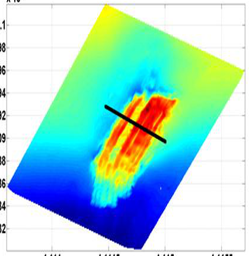

- **file**: `07_scale/shapes/boscombe-surf-reef/src/rendle_davidson_2012_fig9_left_isotropic.png`
- **kind**: survey_plot
- **shows**: OSGB-gridded colour map of the April 2011 DGPS depths over the reef (colour bar +0.93 to -5.30 m): reef relief, damaged part and seabed gradient.
- **structure visible**: True
- **state shown**: damaged (April 2011 survey, after the container failure)
- **image date**: survey April 2011 (published 2012-09-28)
- **citation**: Rendle, E.J. & Davidson, M. (2012). An evaluation of the physical impact and structural integrity of a geotextile surf reef. Coastal Engineering Proceedings 33 (ICCE 2012, Coastal Structures), structures.21, doi:10.9753/icce.v33.structures.21, p.7, Figure 9 (left panel; cropped and y-stretched x1.749 to equal axis scales). https://icce-ojs-tamu.tdl.org/icce/article/view/6794. Accessed 2026-10-05.
- **image URL**: https://icce-ojs-tamu.tdl.org/icce/article/download/6794/pdf_441/27535
- **source page**: https://icce-ojs-tamu.tdl.org/icce/article/view/6794
- **page / figure**: PDF p.7, Figure 9 left panel; calibration in the .geo.json sidecar
- **credit**: Rendle & Davidson, University of Plymouth; survey data Channel Coastal Observatory / Bournemouth BC
- **licence**: CC BY 4.0 per the article page
- **retrieved**: 2026-10-05
- **used for**: plan_trace; cross_check; 3d_seabed; 3d_crest; 3d_height_slopes
- **How used for the model**: Traced independently as a cross-check (3,372 m2 at the -2/-3 m colour edge, IoU 0.77 with the satellite outline); then the colour of every pixel was read into a depth grid (colour bar -> m ACD) that supplies the 3D seabed (model grid 2 m, reef 1 m, thin-plate-spline ambient seabed) and the survey surface of the April 2011 evidence layer (model.js provenance 'Seabed and reef surface heights', S2).
- **3D check pending**: no - none: image already used as a model source or is context only
- **annotated / overlay files**: `07_scale/shapes/boscombe-surf-reef/3d/annotated/fig9_depth_read_map.png`; `07_scale/shapes/boscombe-surf-reef/overlays/img2_trace.png`; `07_scale/shapes/boscombe-surf-reef/overlays/img1_outline_on_img2_survey.png`
- **linked records**: 07_scale/shapes/boscombe-surf-reef/sources.md img2; 07_scale/shapes/boscombe-surf-reef/shape.json sources[img2]; 07_scale/shapes/boscombe-surf-reef/3d/SOURCES_3D.md (Steps 1-2; Datum of the Fig 9 survey); 07_scale/shapes/boscombe-surf-reef/3d/model.js source S2
- **size**: 0.16 MB, 420x432 px
- **sha256**: ed7c8bb838675cf22ae28fdf031af600a3d3fe96bc9afce90d69f954528f7147
- **rights**: Private research copy; reuse rights to be checked before any public release.
- **display in HTML**: True
- **added by**: image-registry backfill, 2026-10-06

## boscombe-surf-reef-img-11 - Mead et al. (2010) Fig. 3(a): numerical design shape of the Boscombe reef (depth plan with 0.05 km scale bar)

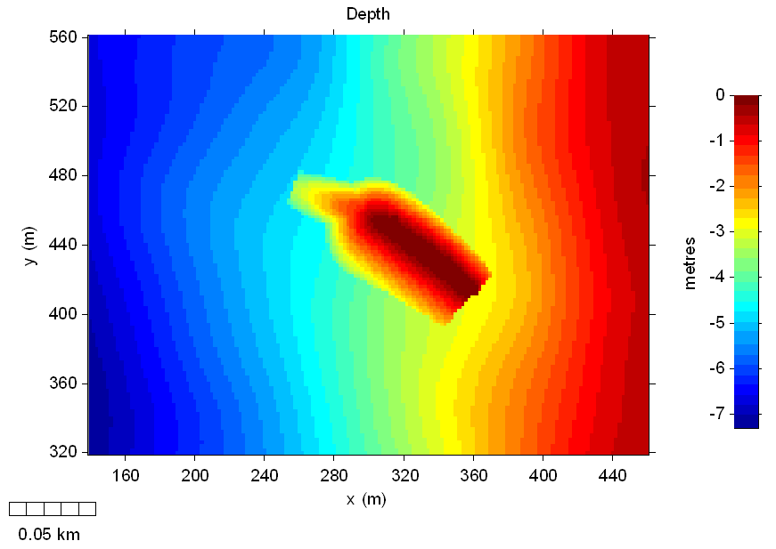

- **file**: `07_scale/shapes/boscombe-surf-reef/src/mead_et_al_2010_fig3a_design_bathymetry.png`
- **kind**: design_drawing
- **shows**: Colour depth plan of the DESIGN shape of the reef (metric axes, scale bar, 'focus' and 'wedge' sections) used for the designers' numerical wave model.
- **structure visible**: True
- **state shown**: design (pre-construction)
- **image date**: design stage (designed 2006-2008, published 2010)
- **citation**: Mead, S., Blenkinsopp, C., Moores, A. & Borrero, J. (2010). Design and construction of the Boscombe multi-purpose reef. Coastal Engineering Proceedings 32 (ICCE 2010, Coastal Structures), structures.58, doi:10.9753/icce.v32.structures.58, p.3, Figure 3(a). https://icce-ojs-tamu.tdl.org/icce/article/view/1352. Accessed 2026-10-05.
- **image URL**: https://icce-ojs-tamu.tdl.org/icce/article/download/1352/pdf_106/
- **source page**: https://icce-ojs-tamu.tdl.org/icce/article/view/1352
- **page / figure**: PDF p.3, Figure 3(a) (embedded image 871x617); 3(b) and 3(c) not used
- **credit**: Mead, Blenkinsopp, Moores & Borrero (ASR Ltd / UNSW-WRL)
- **licence**: CC BY 4.0 per the article page ('licensed under a Creative Commons Attribution License')
- **retrieved**: 2026-10-05
- **used for**: cross_check; 3d_crest; 3d_height_slopes
- **How used for the model**: Traced as a cross-check of the planform (4,217 m2, 110 x 49 m rotated rectangle vs satellite 4,042 m2); soundings read from its colour bar give design depths (crest ~0.0 m, seabed W -5.0, E -2.0 m) -> design relief 2.6-5 m (model.js S3).
- **3D check pending**: no - none: image already used as a model source or is context only
- **annotated / overlay files**: `07_scale/shapes/boscombe-surf-reef/3d/annotated/mead_fig3a_design_read.png`; `07_scale/shapes/boscombe-surf-reef/overlays/img3_trace.png`; `07_scale/shapes/boscombe-surf-reef/overlays/img3_relief_footprint_verify.png`
- **linked records**: 07_scale/shapes/boscombe-surf-reef/sources.md img3; 07_scale/shapes/boscombe-surf-reef/shape.json sources[img3]; 07_scale/shapes/boscombe-surf-reef/3d/SOURCES_3D.md (Step 2 caption 3); 07_scale/shapes/boscombe-surf-reef/3d/model.js source S3
- **size**: 0.02 MB, 871x617 px
- **sha256**: 71e13d31623d82d67bdcde20b78e8a6513075016c7dfe7479eed31798318ee8d
- **rights**: Private research copy; reuse rights to be checked before any public release.
- **display in HTML**: True
- **added by**: image-registry backfill, 2026-10-06

## boscombe-surf-reef-img-12 - Esri World Imagery current layer, Boscombe, z19, 2025-06-15

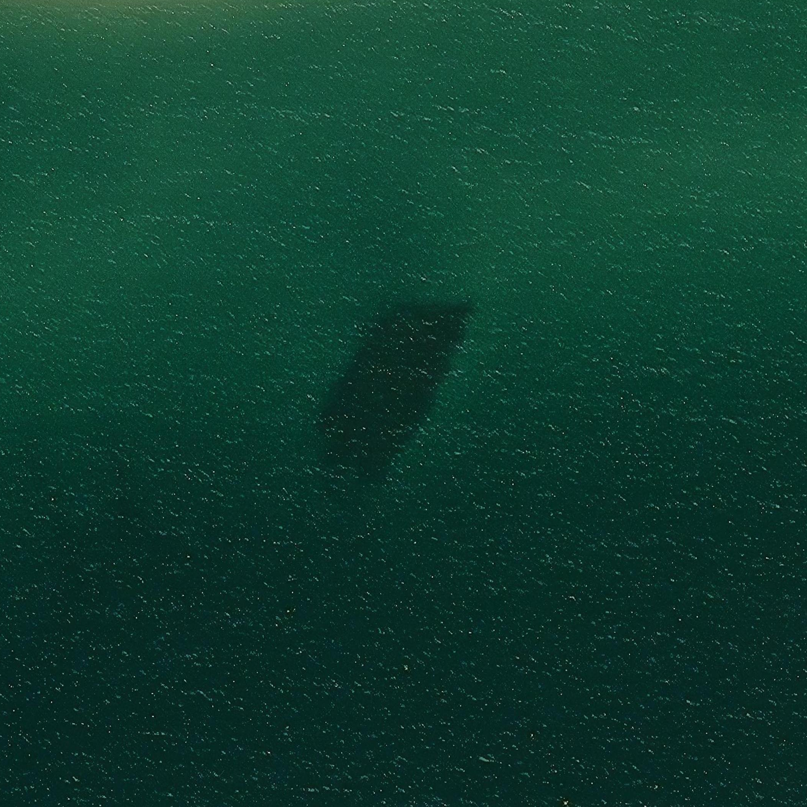

- **file**: `07_scale/shapes/boscombe-surf-reef/src/esri_current_2025-06-15_z19.png`
- **kind**: satellite
- **shows**: Recent imagery of the site: a blurred dark patch where the reef lies; the img1 outline fits it but it is not resolvable enough to trace.
- **structure visible**: True
- **state shown**: damaged/repaired, current (2025)
- **image date**: 2025-06-15
- **citation**: Esri, Maxar, Earthstar Geographics, and the GIS User Community (2025). World Imagery (current layer), image captured 2025-06-15. Esri World Imagery tile service, https://server.arcgisonline.com/ArcGIS/rest/services/World_Imagery/MapServer. Accessed 2026-10-04.
- **image URL**: https://server.arcgisonline.com/ArcGIS/rest/services/World_Imagery/MapServer/tile/{z}/{y}/{x}
- **source page**: Esri World Imagery (identify DATE field)
- **page / figure**: 400 m box centred 50.7175 N 1.8388 W, zoom 19, 2116x2116 px
- **credit**: Esri, Maxar, Earthstar Geographics, and the GIS User Community
- **licence**: Esri/Maxar imagery terms (not an open licence); private research copy only
- **retrieved**: 2026-10-04
- **used for**: context
- **How used for the model**: Context: the img1 outline projected by lat/lon sits on the dark patch (overlays/img1_outline_on_2025.png) - confirms the structure still exists. Not traced.
- **3D check pending**: no - none: image already used as a model source or is context only
- **annotated / overlay files**: `07_scale/shapes/boscombe-surf-reef/overlays/img1_outline_on_2025.png`
- **linked records**: 07_scale/shapes/boscombe-surf-reef/sources.md img4; 07_scale/shapes/boscombe-surf-reef/shape.json sources[img4]
- **size**: 4.75 MB, 2116x2116 px
- **sha256**: c938b11fd214420545f4e01c89de16b6f87c6941199419db9bb606923fc07815
- **rights**: Private research copy; reuse rights to be checked before any public release.
- **display in HTML**: True
- **added by**: image-registry backfill, 2026-10-06

## boscombe-surf-reef-img-13 - Garmin Navionics viewer - Map Options panel (settings used)

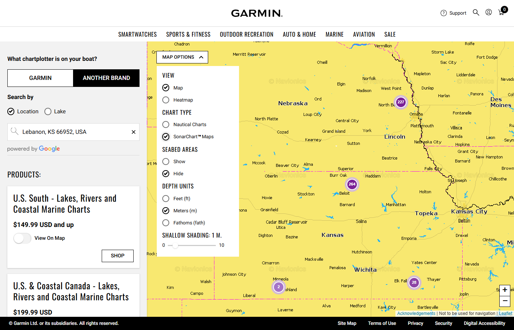

- **file**: `07_scale/shapes/boscombe-surf-reef/src/navionics_garmin_map_options_2026-10-05.png`
- **kind**: chart_screenshot
- **shows**: The Map Options panel of the viewer showing chart type, depth units (metres) and shallow shading (1 m) as set for the screenshots; no reef visible.
- **structure visible**: False
- **state shown**: post-damage shoal as charted (data date unknown)
- **image date**: chart data dates not shown by the viewer; screenshot 2026-10-05
- **citation**: Garmin Ltd / Navionics (2026). Marine Maps viewer (Nautical Chart / SonarChart layers; page title 'Garmin | Marine Maps', 'Not to be used for navigation'), Map Options panel, depths in metres, shallow shading 1 m, centred 50.71753 N 1.83891 W. https://maps.garmin.com/en-US/marine?maps=another-brand&overlay=false. Screenshot taken 2026-10-05. Accessed 2026-10-05.
- **image URL**: https://maps.garmin.com/en-US/marine?maps=another-brand&overlay=false
- **source page**: https://maps.garmin.com/en-US/marine?maps=another-brand&overlay=false
- **page / figure**: Map Options panel; screenshot 1400x900 px (map pane x 400..1400, y 113..864)
- **credit**: Garmin Navionics charts and SonarChart (c) Navionics / Garmin Ltd; screenshot by this project (own headless Chrome)
- **licence**: Garmin/Navionics terms ('Not to be used for navigation'); no open licence; private research copy, reuse NOT cleared
- **retrieved**: 2026-10-05
- **used for**: context
- **How used for the model**: Documents the viewer settings used for the Navionics reads (units metres, shallow shading 1 m); not a reef image.
- **3D check pending**: no - none: settings screenshot
- **linked records**: 07_scale/shapes/boscombe-surf-reef/src/navionics_garmin_screenshots.provenance.json; 07_scale/shapes/boscombe-surf-reef/3d/SOURCES_3D.md (Step 1/2 addendum - NAVIONICS); 07_scale/shapes/boscombe-surf-reef/3d/model.js source S9
- **size**: 0.14 MB, 1400x900 px
- **sha256**: c1e6441195177d75e43af7ad9137c6dd5d0be8474a383959e083ebd2c10ec95b
- **rights**: Private research copy; reuse rights to be checked before any public release.
- **display in HTML**: True
- **added by**: image-registry backfill, 2026-10-06

## boscombe-surf-reef-img-14 - Garmin Navionics Nautical Chart, Boscombe, zoom 16

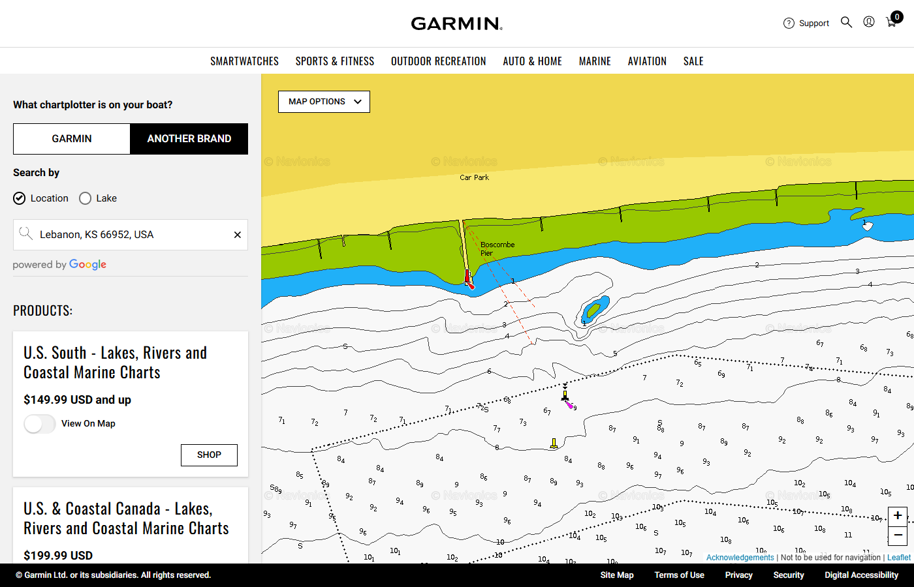

- **file**: `07_scale/shapes/boscombe-surf-reef/src/navionics_garmin_nauticalchart_z16_2026-10-05.png`
- **kind**: chart_screenshot
- **shows**: Wide view of Poole Bay at Boscombe: charted soundings and the drying shoal off the pier where the reef sits (zoom 16, 1.51 m/px).
- **structure visible**: True
- **state shown**: post-damage shoal as charted (data date unknown)
- **image date**: chart data dates not shown by the viewer; screenshot 2026-10-05
- **citation**: Garmin Ltd / Navionics (2026). Marine Maps viewer (Nautical Chart / SonarChart layers; page title 'Garmin | Marine Maps', 'Not to be used for navigation'), Nautical Chart layer, zoom 16, depths in metres, shallow shading 1 m, centred 50.71753 N 1.83891 W. https://maps.garmin.com/en-US/marine?maps=another-brand&overlay=false. Screenshot taken 2026-10-05. Accessed 2026-10-05.
- **image URL**: https://maps.garmin.com/en-US/marine?maps=another-brand&overlay=false
- **source page**: https://maps.garmin.com/en-US/marine?maps=another-brand&overlay=false
- **page / figure**: Nautical Chart layer, zoom 16; screenshot 1400x900 px (map pane x 400..1400, y 113..864)
- **credit**: Garmin Navionics charts and SonarChart (c) Navionics / Garmin Ltd; screenshot by this project (own headless Chrome)
- **licence**: Garmin/Navionics terms ('Not to be used for navigation'); no open licence; private research copy, reuse NOT cleared
- **retrieved**: 2026-10-05
- **used for**: 3d_seabed; cross_check; context
- **How used for the model**: Wide context screenshot; the soundings and shoal were read on the zoom 17/18 shots. Re-check run 2026-10-07: used for two cross-checks of the EXTENDED seabed. NEARSHORE (31 scans, x -150..150): chart colour boundaries high-water line / chart datum / 1 m below CD sit where the model is +0.96 / -1.66 / -2.53 m MSL (expected +0.81 (MHWS) / -1.40 / -2.40): differences +0.15 / -0.26 / -0.13 m. OFFSHORE (11 soundings read inside |x| <= 160 m, y 428-604 m): model minus chart depth mean -0.27, sd 1.23, rms 1.20 m, with an alongshore trend of -1.2 m per 100 m of x (see SOURCES_3D.md, METHODS_3D.md section 4 item 12). Both annotated images hang off this row.
- **3D check pending**: no - none: wide context RESULT (2026-10-07, 3D re-check agent (seabed extension run)): Done 2026-10-07: see how_used (nearshore within 0.26 m, offshore rms 1.2 m); no further check needed for the extended seabed.
- **annotated / overlay files**: `07_scale/shapes/boscombe-surf-reef/3d/annotated/navionics_nauticalchart_z16_nearshore_vs_model_annotated.png`; `07_scale/shapes/boscombe-surf-reef/3d/annotated/navionics_nauticalchart_z16_offshore_soundings_annotated.png`
- **linked records**: 07_scale/shapes/boscombe-surf-reef/src/navionics_garmin_screenshots.provenance.json; 07_scale/shapes/boscombe-surf-reef/3d/SOURCES_3D.md (Step 1/2 addendum - NAVIONICS); 07_scale/shapes/boscombe-surf-reef/3d/model.js source S9
- **size**: 0.10 MB, 1400x900 px
- **sha256**: 6fedbb4d540a23393b1222e00fcc8552af02c6d976cb601391d4e3afaaa73144
- **rights**: Private research copy; reuse rights to be checked before any public release.
- **display in HTML**: True
- **added by**: image-registry backfill, 2026-10-06

## boscombe-surf-reef-img-15 - Garmin Navionics Nautical Chart, Boscombe, zoom 17

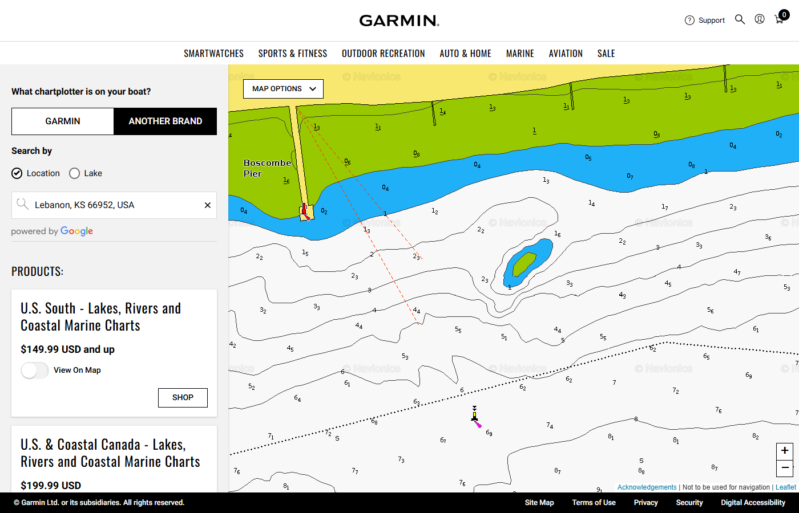

- **file**: `07_scale/shapes/boscombe-surf-reef/src/navionics_garmin_nauticalchart_z17_2026-10-05.png`
- **kind**: chart_screenshot
- **shows**: Charted spot soundings and contour labels around the reef shoal (zoom 17, 0.756 m/px).
- **structure visible**: True
- **state shown**: post-damage shoal as charted (data date unknown)
- **image date**: chart data dates not shown by the viewer; screenshot 2026-10-05
- **citation**: Garmin Ltd / Navionics (2026). Marine Maps viewer (Nautical Chart / SonarChart layers; page title 'Garmin | Marine Maps', 'Not to be used for navigation'), Nautical Chart layer, zoom 17 (0.756 m/px), depths in metres, shallow shading 1 m, centred 50.71753 N 1.83891 W. https://maps.garmin.com/en-US/marine?maps=another-brand&overlay=false. Screenshot taken 2026-10-05. Accessed 2026-10-05.
- **image URL**: https://maps.garmin.com/en-US/marine?maps=another-brand&overlay=false
- **source page**: https://maps.garmin.com/en-US/marine?maps=another-brand&overlay=false
- **page / figure**: Nautical Chart layer, zoom 17 (0.756 m/px); screenshot 1400x900 px (map pane x 400..1400, y 113..864)
- **credit**: Garmin Navionics charts and SonarChart (c) Navionics / Garmin Ltd; screenshot by this project (own headless Chrome)
- **licence**: Garmin/Navionics terms ('Not to be used for navigation'); no open licence; private research copy, reuse NOT cleared
- **retrieved**: 2026-10-05
- **used for**: 3d_seabed; cross_check
- **How used for the model**: 27 spot soundings + 6 contour labels read by eye (scripts/navionics_reads.json); 16 on seabed inside the model grid: model - Navionics mean +0.06 m, sd 0.49 m (model.js provenance 'Navionics soundings vs model seabed', S9).
- **3D check pending**: no - none: already used as a seabed cross-check
- **annotated / overlay files**: `07_scale/shapes/boscombe-surf-reef/3d/annotated/navionics_nauticalchart_z17_soundings_annotated.png`
- **linked records**: 07_scale/shapes/boscombe-surf-reef/src/navionics_garmin_screenshots.provenance.json; 07_scale/shapes/boscombe-surf-reef/3d/SOURCES_3D.md (Step 1/2 addendum - NAVIONICS); 07_scale/shapes/boscombe-surf-reef/3d/model.js source S9
- **size**: 0.10 MB, 1400x900 px
- **sha256**: 9cfc3d195dd722540c57229d10eb01f6606408933ccaa5b0c33e445caff2efb9
- **rights**: Private research copy; reuse rights to be checked before any public release.
- **display in HTML**: True
- **added by**: image-registry backfill, 2026-10-06

## boscombe-surf-reef-img-16 - Garmin Navionics Nautical Chart, Boscombe, zoom 18

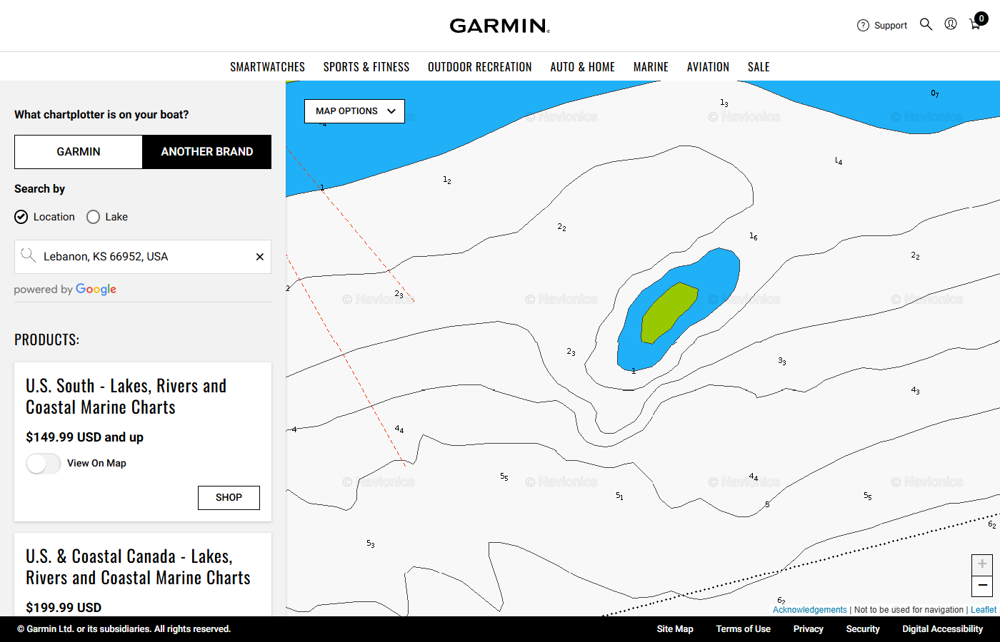

- **file**: `07_scale/shapes/boscombe-surf-reef/src/navionics_garmin_nauticalchart_z18_2026-10-05.png`
- **kind**: chart_screenshot
- **shows**: Zoom-18 chart of the reef shoal: drying patch and the < 1 m shading, six soundings.
- **structure visible**: True
- **state shown**: post-damage shoal as charted (data date unknown)
- **image date**: chart data dates not shown by the viewer; screenshot 2026-10-05
- **citation**: Garmin Ltd / Navionics (2026). Marine Maps viewer (Nautical Chart / SonarChart layers; page title 'Garmin | Marine Maps', 'Not to be used for navigation'), Nautical Chart layer, zoom 18 (0.378 m/px), depths in metres, shallow shading 1 m, centred 50.71753 N 1.83891 W. https://maps.garmin.com/en-US/marine?maps=another-brand&overlay=false. Screenshot taken 2026-10-05. Accessed 2026-10-05.
- **image URL**: https://maps.garmin.com/en-US/marine?maps=another-brand&overlay=false
- **source page**: https://maps.garmin.com/en-US/marine?maps=another-brand&overlay=false
- **page / figure**: Nautical Chart layer, zoom 18 (0.378 m/px); screenshot 1400x900 px (map pane x 400..1400, y 113..864)
- **credit**: Garmin Navionics charts and SonarChart (c) Navionics / Garmin Ltd; screenshot by this project (own headless Chrome)
- **licence**: Garmin/Navionics terms ('Not to be used for navigation'); no open licence; private research copy, reuse NOT cleared
- **retrieved**: 2026-10-05
- **used for**: 3d_crest; cross_check
- **How used for the model**: Drying patch 492 m2 and < 1 m area 2,073 m2 measured from the colour fills; six soundings read (1.2-3.3 m) and compared with the survey zones (model.js provenance 'Navionics shoal vs survey', S9).
- **3D check pending**: no - none: already used as a post-damage shoal cross-check
- **annotated / overlay files**: `07_scale/shapes/boscombe-surf-reef/3d/annotated/navionics_nauticalchart_z18_annotated.png`
- **linked records**: 07_scale/shapes/boscombe-surf-reef/src/navionics_garmin_screenshots.provenance.json; 07_scale/shapes/boscombe-surf-reef/3d/SOURCES_3D.md (Step 1/2 addendum - NAVIONICS); 07_scale/shapes/boscombe-surf-reef/3d/model.js source S9
- **size**: 0.09 MB, 1400x900 px
- **sha256**: 4d4aa20b60da43226754c5b5ace8ba44096c6d461e31404d7c5880cf7a26b70a
- **rights**: Private research copy; reuse rights to be checked before any public release.
- **display in HTML**: True
- **added by**: image-registry backfill, 2026-10-06

## boscombe-surf-reef-img-17 - Garmin Navionics SonarChart, Boscombe, zoom 17

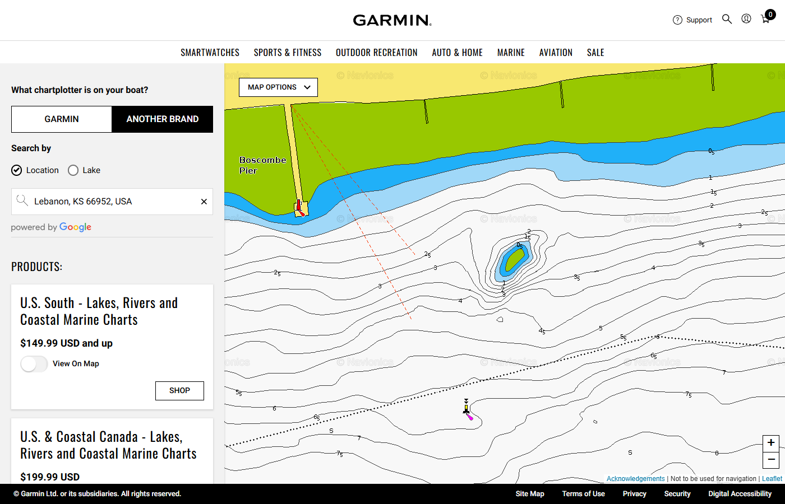

- **file**: `07_scale/shapes/boscombe-surf-reef/src/navionics_garmin_sonarchart_z17_2026-10-05.png`
- **kind**: chart_screenshot
- **shows**: SonarChart depth contours (1 m shallow shading) around the reef shoal at zoom 17.
- **structure visible**: True
- **state shown**: post-damage shoal as charted (data date unknown)
- **image date**: chart data dates not shown by the viewer; screenshot 2026-10-05
- **citation**: Garmin Ltd / Navionics (2026). Marine Maps viewer (Nautical Chart / SonarChart layers; page title 'Garmin | Marine Maps', 'Not to be used for navigation'), SonarChart layer, zoom 17 (0.756 m/px), depths in metres, shallow shading 1 m, centred 50.71753 N 1.83891 W. https://maps.garmin.com/en-US/marine?maps=another-brand&overlay=false. Screenshot taken 2026-10-05. Accessed 2026-10-05.
- **image URL**: https://maps.garmin.com/en-US/marine?maps=another-brand&overlay=false
- **source page**: https://maps.garmin.com/en-US/marine?maps=another-brand&overlay=false
- **page / figure**: SonarChart layer, zoom 17 (0.756 m/px); screenshot 1400x900 px (map pane x 400..1400, y 113..864)
- **credit**: Garmin Navionics charts and SonarChart (c) Navionics / Garmin Ltd; screenshot by this project (own headless Chrome)
- **licence**: Garmin/Navionics terms ('Not to be used for navigation'); no open licence; private research copy, reuse NOT cleared
- **retrieved**: 2026-10-05
- **used for**: context; cross_check
- **How used for the model**: Wider SonarChart view used while locating the shoal; the contours were measured on the zoom 18 shot.
- **3D check pending**: no - none: wider view of the z18 read
- **linked records**: 07_scale/shapes/boscombe-surf-reef/src/navionics_garmin_screenshots.provenance.json; 07_scale/shapes/boscombe-surf-reef/3d/SOURCES_3D.md (Step 1/2 addendum - NAVIONICS); 07_scale/shapes/boscombe-surf-reef/3d/model.js source S9
- **size**: 0.11 MB, 1400x900 px
- **sha256**: d7ca1e92800b1e705e5f2bfdc65dad81493fc119e4e282b12db41433f3ff684a
- **rights**: Private research copy; reuse rights to be checked before any public release.
- **display in HTML**: True
- **added by**: image-registry backfill, 2026-10-06

## boscombe-surf-reef-img-18 - Garmin Navionics SonarChart, Boscombe, zoom 18

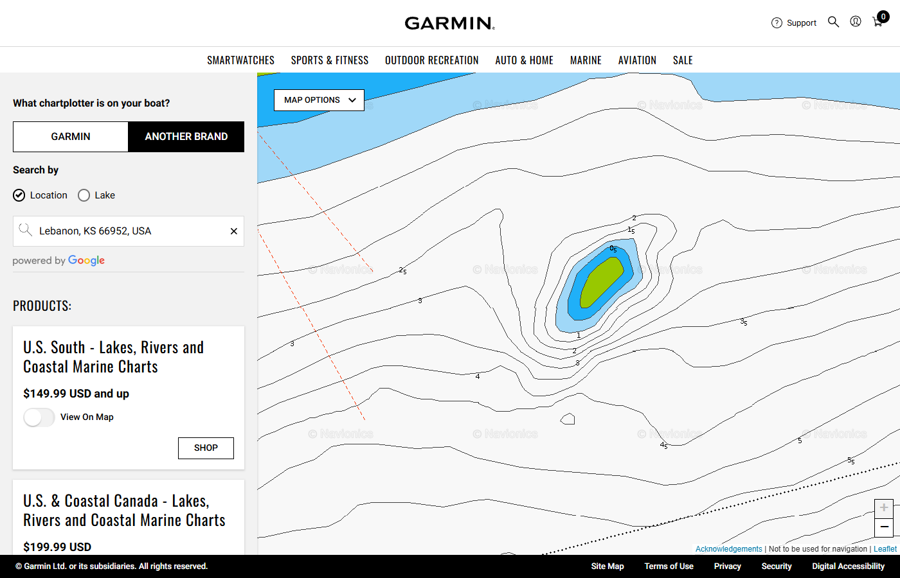

- **file**: `07_scale/shapes/boscombe-surf-reef/src/navionics_garmin_sonarchart_z18_2026-10-05.png`
- **kind**: chart_screenshot
- **shows**: SonarChart contours at zoom 18 showing the green drying patch and blue < 1 m shading over the shoreward-east half of the reef.
- **structure visible**: True
- **state shown**: post-damage shoal as charted (data date unknown)
- **image date**: chart data dates not shown by the viewer; screenshot 2026-10-05
- **citation**: Garmin Ltd / Navionics (2026). Marine Maps viewer (Nautical Chart / SonarChart layers; page title 'Garmin | Marine Maps', 'Not to be used for navigation'), SonarChart layer, zoom 18 (0.378 m/px), depths in metres, shallow shading 1 m, centred 50.71753 N 1.83891 W. https://maps.garmin.com/en-US/marine?maps=another-brand&overlay=false. Screenshot taken 2026-10-05. Accessed 2026-10-05.
- **image URL**: https://maps.garmin.com/en-US/marine?maps=another-brand&overlay=false
- **source page**: https://maps.garmin.com/en-US/marine?maps=another-brand&overlay=false
- **page / figure**: SonarChart layer, zoom 18 (0.378 m/px); screenshot 1400x900 px (map pane x 400..1400, y 113..864)
- **credit**: Garmin Navionics charts and SonarChart (c) Navionics / Garmin Ltd; screenshot by this project (own headless Chrome)
- **licence**: Garmin/Navionics terms ('Not to be used for navigation'); no open licence; private research copy, reuse NOT cleared
- **retrieved**: 2026-10-05
- **used for**: 3d_crest; 3d_seabed; cross_check
- **How used for the model**: Drying patch 378 m2, < 0.5 m area 950 m2 and < 1 m area 1,630 m2 vs survey zones 296 / 956 / 1,609 m2; contour labels 0.5-4 m read; shoal centroid offset 12.7 m (model.js provenance 'Navionics shoal vs survey', S9; METHODS_3D section 4).
- **3D check pending**: no - none: already used as a post-damage shoal cross-check
- **annotated / overlay files**: `07_scale/shapes/boscombe-surf-reef/3d/annotated/navionics_sonarchart_z18_annotated.png`
- **linked records**: 07_scale/shapes/boscombe-surf-reef/src/navionics_garmin_screenshots.provenance.json; 07_scale/shapes/boscombe-surf-reef/3d/SOURCES_3D.md (Step 1/2 addendum - NAVIONICS); 07_scale/shapes/boscombe-surf-reef/3d/model.js source S9
- **size**: 0.10 MB, 1400x900 px
- **sha256**: 2edbb3fb3ae17a32f245bd03e245b9339956fbb9024628912892e8341b56540a
- **rights**: Private research copy; reuse rights to be checked before any public release.
- **display in HTML**: True
- **added by**: image-registry backfill, 2026-10-06

## boscombe-surf-reef-img-19 - Page crop with highlighted text: Mead 2010 p.1, tide gauge and tidal range

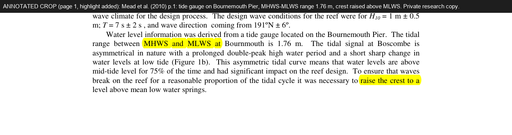

- **file**: `07_scale/shapes/boscombe-surf-reef/3d/annotated/text_mead2010_p1_tide_gauge.png`
- **kind**: diagram
- **shows**: A rendered page of the paper with the quoted sentence / table rows highlighted (text evidence; no reef image).
- **structure visible**: False
- **state shown**: not applicable (text evidence)
- **image date**: 2010
- **citation**: Mead, S., Blenkinsopp, C., Moores, A. & Borrero, J. (2010). Design and construction of the Boscombe multi-purpose reef. Coastal Engineering Proceedings 32 (ICCE 2010), doi:10.9753/icce.v32.structures.58, p.1. https://icce-ojs-tamu.tdl.org/icce/article/view/1352. Accessed 2026-10-05.
- **image URL**: https://icce-ojs-tamu.tdl.org/icce/article/download/1352/pdf_106/
- **source page**: https://icce-ojs-tamu.tdl.org/icce/article/view/1352
- **page / figure**: PDF p.1
- **credit**: Mead, Blenkinsopp, Moores & Borrero (ASR Ltd / UNSW)
- **licence**: CC BY 4.0 per the article page
- **retrieved**: 2026-10-05
- **used for**: 3d_tides; 3d_crest; 3d_seabed
- **How used for the model**: Source of 'tidal range between MHWS and MLWS at Bournemouth is 1.76 m' and the gauge location (Bournemouth Pier) used for the tide model (model.js tides, S3).
- **3D check pending**: no - none: text evidence already used
- **linked records**: 07_scale/shapes/boscombe-surf-reef/3d/SOURCES_3D.md (Step 1a text facts; Step 2 caption 6); 07_scale/shapes/boscombe-surf-reef/3d/model.js sources S3/S2
- **size**: 0.09 MB, 1347x358 px
- **sha256**: faa700603fbf15029b16f99a6c34682104edd47a610ac24dc05da30b93947fb1
- **rights**: Private research copy; reuse rights to be checked before any public release.
- **display in HTML**: True
- **added by**: image-registry backfill, 2026-10-06

## boscombe-surf-reef-img-20 - Page crop with highlighted text: Mead 2010 p.2, Table 1 water levels and design crest

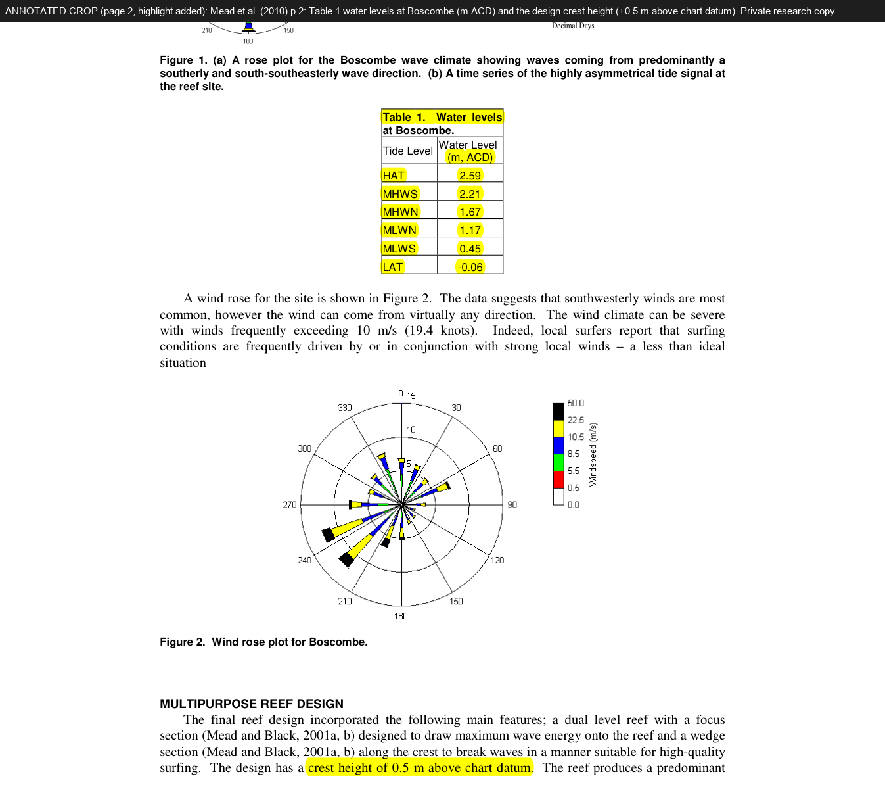

- **file**: `07_scale/shapes/boscombe-surf-reef/3d/annotated/text_mead2010_p2_table1_and_crest.png`
- **kind**: diagram
- **shows**: A rendered page of the paper with the quoted sentence / table rows highlighted (text evidence; no reef image).
- **structure visible**: False
- **state shown**: not applicable (text evidence)
- **image date**: 2010
- **citation**: Mead, S., Blenkinsopp, C., Moores, A. & Borrero, J. (2010). Design and construction of the Boscombe multi-purpose reef. Coastal Engineering Proceedings 32 (ICCE 2010), doi:10.9753/icce.v32.structures.58, p.2. https://icce-ojs-tamu.tdl.org/icce/article/view/1352. Accessed 2026-10-05.
- **image URL**: https://icce-ojs-tamu.tdl.org/icce/article/download/1352/pdf_106/
- **source page**: https://icce-ojs-tamu.tdl.org/icce/article/view/1352
- **page / figure**: PDF p.2, Table 1 + design-crest sentence
- **credit**: Mead, Blenkinsopp, Moores & Borrero (ASR Ltd / UNSW)
- **licence**: CC BY 4.0 per the article page
- **retrieved**: 2026-10-05
- **used for**: 3d_tides; 3d_crest; 3d_seabed
- **How used for the model**: Table 1 (HAT 2.59, MHWS 2.21, MHWN 1.67, MLWN 1.17, MLWS 0.45, LAT -0.06 m ACD) -> model water-level slider; 'design has a crest height of 0.5 m above chart datum' -> model crest (+0.5 m ACD = -0.90 m MSL) (model.js provenance 'Design crest height', S3).
- **3D check pending**: no - none: text evidence already used
- **linked records**: 07_scale/shapes/boscombe-surf-reef/3d/SOURCES_3D.md (Step 1a text facts; Step 2 caption 6); 07_scale/shapes/boscombe-surf-reef/3d/model.js sources S3/S2
- **size**: 0.19 MB, 1347x1235 px
- **sha256**: f5a556d0745dfef36efe860f1f3a31ee7076d9c07a6c146f6ab88412f41993d6
- **rights**: Private research copy; reuse rights to be checked before any public release.
- **display in HTML**: True
- **added by**: image-registry backfill, 2026-10-06

## boscombe-surf-reef-img-21 - Page crop with highlighted text: Mead 2010 p.3, design water depth 3-5 m CD

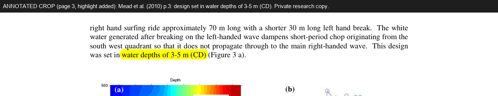

- **file**: `07_scale/shapes/boscombe-surf-reef/3d/annotated/text_mead2010_p3_design_depth.png`
- **kind**: diagram
- **shows**: A rendered page of the paper with the quoted sentence / table rows highlighted (text evidence; no reef image).
- **structure visible**: False
- **state shown**: not applicable (text evidence)
- **image date**: 2010
- **citation**: Mead, S., Blenkinsopp, C., Moores, A. & Borrero, J. (2010). Design and construction of the Boscombe multi-purpose reef. Coastal Engineering Proceedings 32 (ICCE 2010), doi:10.9753/icce.v32.structures.58, p.3. https://icce-ojs-tamu.tdl.org/icce/article/view/1352. Accessed 2026-10-05.
- **image URL**: https://icce-ojs-tamu.tdl.org/icce/article/download/1352/pdf_106/
- **source page**: https://icce-ojs-tamu.tdl.org/icce/article/view/1352
- **page / figure**: PDF p.3
- **credit**: Mead, Blenkinsopp, Moores & Borrero (ASR Ltd / UNSW)
- **licence**: CC BY 4.0 per the article page
- **retrieved**: 2026-10-05
- **used for**: 3d_tides; 3d_crest; 3d_seabed
- **How used for the model**: 'Set in water depths of 3-5 m (CD)' supports the datum choice (survey zero = chart datum) for the Fig. 9 depths (SOURCES_3D datum reasoning).
- **3D check pending**: no - none: text evidence already used
- **linked records**: 07_scale/shapes/boscombe-surf-reef/3d/SOURCES_3D.md (Step 1a text facts; Step 2 caption 6); 07_scale/shapes/boscombe-surf-reef/3d/model.js sources S3/S2
- **size**: 0.05 MB, 1347x260 px
- **sha256**: ce99c2bdb143be8d662565d5790e53641a50339314fcf3fe0f179345636b35f2
- **rights**: Private research copy; reuse rights to be checked before any public release.
- **display in HTML**: True
- **added by**: image-registry backfill, 2026-10-06

## boscombe-surf-reef-img-22 - Page crop with highlighted text: Rendle 2012 p.3, '225 m offshore in 2.7 to 5 m depth' and tidal range

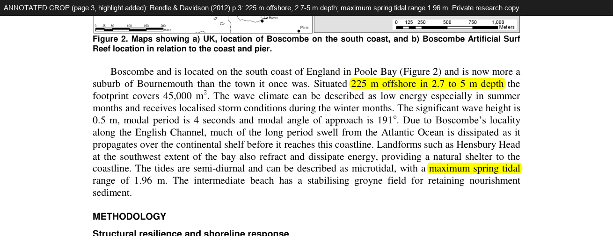

- **file**: `07_scale/shapes/boscombe-surf-reef/3d/annotated/text_rendle2012_depth_tides.png`
- **kind**: diagram
- **shows**: A rendered page of the paper with the quoted sentence / table rows highlighted (text evidence; no reef image).
- **structure visible**: False
- **state shown**: not applicable (text evidence)
- **image date**: 2012
- **citation**: Rendle, E.J. & Davidson, M. (2012). An evaluation of the physical impact and structural integrity of a geotextile surf reef. Coastal Engineering Proceedings 33 (ICCE 2012), doi:10.9753/icce.v33.structures.21, p.3. https://icce-ojs-tamu.tdl.org/icce/article/view/6794. Accessed 2026-10-05.
- **image URL**: https://icce-ojs-tamu.tdl.org/icce/article/download/6794/pdf_441/27535
- **source page**: https://icce-ojs-tamu.tdl.org/icce/article/view/6794
- **page / figure**: PDF p.3
- **credit**: Rendle & Davidson (University of Plymouth)
- **licence**: CC BY 4.0 per the article page
- **retrieved**: 2026-10-05
- **used for**: 3d_tides; 3d_crest; 3d_seabed
- **How used for the model**: '225 m offshore in 2.7 to 5 m depth' and 'maximum spring tidal range of 1.96 m' used for the seabed depth sanity check and the tide note (model.js provenance 'Tide model at the site', S2).
- **3D check pending**: no - none: text evidence already used
- **linked records**: 07_scale/shapes/boscombe-surf-reef/3d/SOURCES_3D.md (Step 1a text facts; Step 2 caption 6); 07_scale/shapes/boscombe-surf-reef/3d/model.js sources S3/S2
- **size**: 0.14 MB, 1310x505 px
- **sha256**: 299570c889fb38627c0a4f277c667d5f599eabc68946807621fc828c14e1299c
- **rights**: Private research copy; reuse rights to be checked before any public release.
- **display in HTML**: True
- **added by**: image-registry backfill, 2026-10-06

## boscombe-surf-reef-img-23 - Page crop with highlighted text: Rendle 2012 p.8, 'MSL ... Chart Datum, Newlyn' sentence

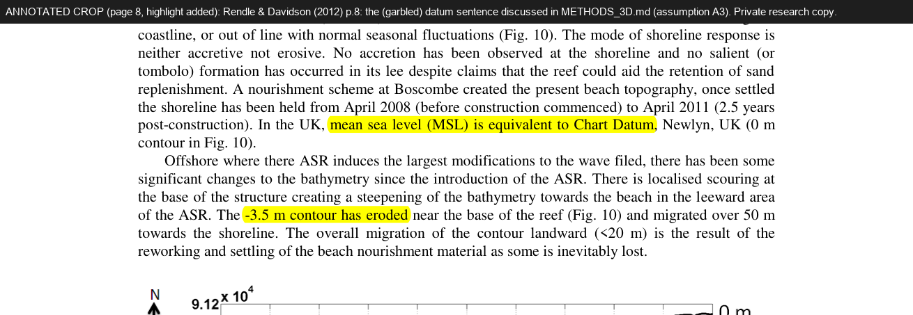

- **file**: `07_scale/shapes/boscombe-surf-reef/3d/annotated/text_rendle2012_datum_sentence.png`
- **kind**: diagram
- **shows**: A rendered page of the paper with the quoted sentence / table rows highlighted (text evidence; no reef image).
- **structure visible**: False
- **state shown**: not applicable (text evidence)
- **image date**: 2012
- **citation**: Rendle, E.J. & Davidson, M. (2012). An evaluation of the physical impact and structural integrity of a geotextile surf reef. Coastal Engineering Proceedings 33 (ICCE 2012), doi:10.9753/icce.v33.structures.21, p.8. https://icce-ojs-tamu.tdl.org/icce/article/view/6794. Accessed 2026-10-05.
- **image URL**: https://icce-ojs-tamu.tdl.org/icce/article/download/6794/pdf_441/27535
- **source page**: https://icce-ojs-tamu.tdl.org/icce/article/view/6794
- **page / figure**: PDF p.8
- **credit**: Rendle & Davidson (University of Plymouth)
- **licence**: CC BY 4.0 per the article page
- **retrieved**: 2026-10-05
- **used for**: 3d_tides; 3d_crest; 3d_seabed
- **How used for the model**: The garbled datum sentence that made the survey datum ambiguous; led to the chart-datum assumption and the viewer's alternative-datum (ODN) switch (model.js provenance 'Vertical datum of the survey plot').
- **3D check pending**: no - none: text evidence already used
- **linked records**: 07_scale/shapes/boscombe-surf-reef/3d/SOURCES_3D.md (Step 1a text facts; Step 2 caption 6); 07_scale/shapes/boscombe-surf-reef/3d/model.js sources S3/S2
- **size**: 0.13 MB, 1310x453 px
- **sha256**: 9d9c183a5595848ddb4eb47df3b3abe928aa486d6ddd9144eb6defe619087b8a
- **rights**: Private research copy; reuse rights to be checked before any public release.
- **display in HTML**: True
- **added by**: image-registry backfill, 2026-10-06

## boscombe-surf-reef-img-24 - Chart: EMODnet cell depths along x = 0 vs the Fig. 9 survey seabed read as chart datum and as ODN (datum plausibility check)

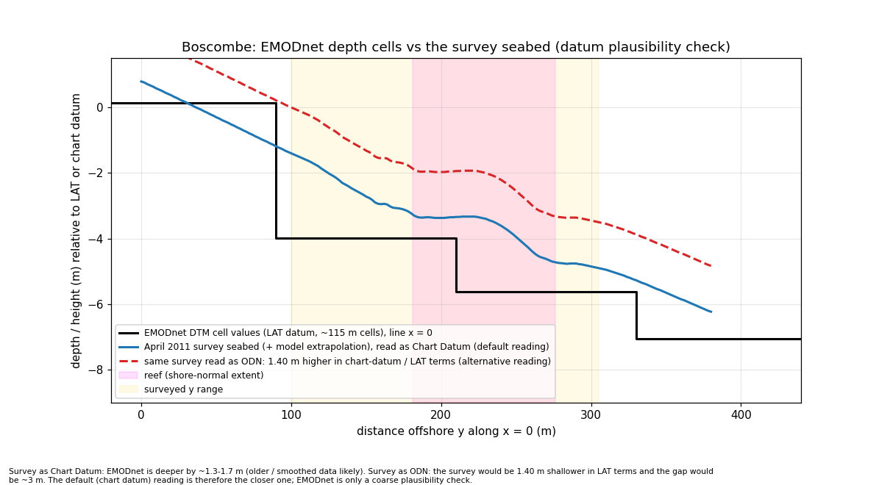

- **file**: `07_scale/shapes/boscombe-surf-reef/3d/annotated/datum_check_emodnet.png`
- **kind**: diagram
- **shows**: Line chart of EMODnet depths against the survey seabed with the two datum readings: EMODnet is 1.3-1.7 m deeper than the survey (closer to a chart-datum reading than to ODN, 3 m).
- **structure visible**: False
- **state shown**: not applicable (analysis chart)
- **image date**: 2026-10-05 (chart); EMODnet data version not stated
- **citation**: This project (2026-10-05), chart made from EMODnet Bathymetry Consortium (2026), EMODnet Digital Bathymetry (DTM), WMS GetFeatureInfo layer emodnet:mean, https://ows.emodnet-bathymetry.eu/wms (queried 2026-10-05; depths relative to LAT, ~115 m cells) and the survey seabed read from Rendle & Davidson (2012) Fig. 9. Accessed 2026-10-05.
- **image URL**: https://ows.emodnet-bathymetry.eu/wms
- **source page**: https://ows.emodnet-bathymetry.eu/wms
- **page / figure**: scripts/annotate_misc.py output
- **credit**: Chart by this project; data EMODnet Bathymetry Consortium
- **licence**: EMODnet data: open (CC BY 4.0 per EMODnet terms); chart is a project product
- **retrieved**: 2026-10-05
- **used for**: 3d_seabed; 3d_tides
- **How used for the model**: Datum plausibility check: supports reading the Fig. 9 survey zero as chart datum (not ODN); EMODnet was not used for model values (model.js S5, provenance 'Vertical datum of the survey plot').
- **3D check pending**: no - none: already used
- **linked records**: 07_scale/shapes/boscombe-surf-reef/3d/SOURCES_3D.md (EMODnet coarse check); 07_scale/shapes/boscombe-surf-reef/3d/model.js source S5
- **size**: 0.09 MB, 1210x660 px
- **sha256**: 69b59a92eff84088c26ea060213aa44484cf237cddc1f38baad450f732e21c09
- **rights**: Private research copy; reuse rights to be checked before any public release.
- **display in HTML**: True
- **added by**: image-registry backfill, 2026-10-06

## boscombe-surf-reef-img-25 - EMODnet Map Viewer at Boscombe: DTM 2024 mean depth over Esri imagery, with DTM cell grid, reef outline, points and shore-normal profile

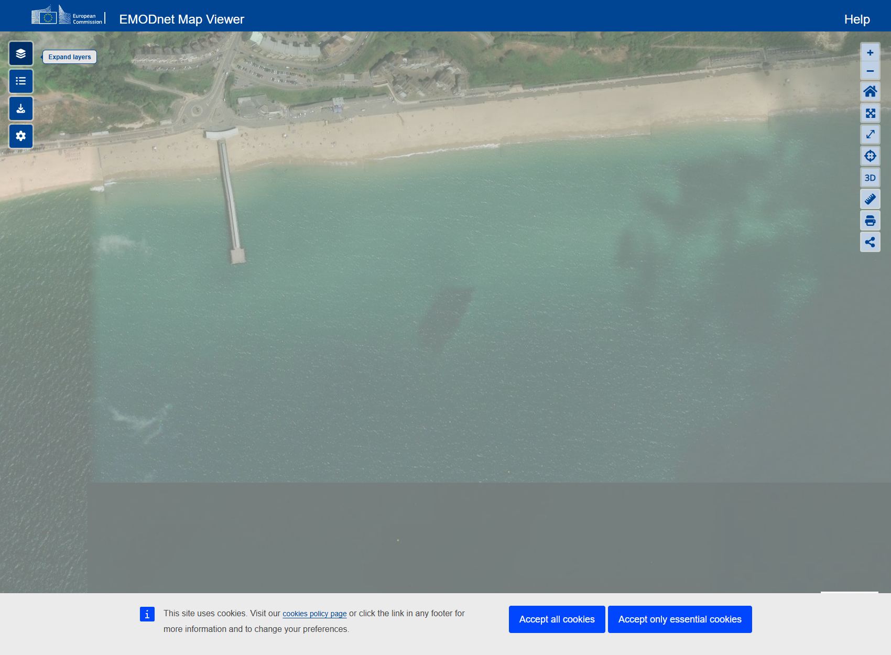

- **file**: `07_scale/bathymetry/emodnet/viewer/boscombe-surf-reef_viewer_dtm_raw.png`
- **kind**: chart_screenshot
- **shows**: The 1/16 arc-minute EMODnet DTM cells (116 x 73 m) with their depth in m below LAT (-4.0 to -9.1 over the reef area) around the Boscombe reef; the reef outline (yellow) is smaller than one cell and the DTM shows no shoal there.
- **structure visible**: True
- **state shown**: damaged / remains (current Esri imagery, faint blurred patch at the reef; date not stated)
- **image date**: DTM 2024 (published 2024-12-31); screenshot 2026-10-06; Esri basemap date not stated by the viewer
- **citation**: EMODnet Bathymetry Consortium (2024). EMODnet Digital Bathymetry (DTM 2024) [Mean depth / Source references layers], displayed in the EMODnet Map Viewer, https://emodnet.ec.europa.eu/geoviewer/ (layer ids 14159 / 13012), DOI https://doi.org/10.12770/cf51df64-56f9-4a99-b1aa-36b8d7b743a1. Accessed 2026-10-06. Licence CC BY 4.0 (EMODnet Terms of Use). Basemap: Esri World Imagery (Esri, Maxar, Earthstar Geographics). Annotations (cell grid, outline, points, profile, scale bar) added by this project.
- **image URL**: https://emodnet.ec.europa.eu/geoviewer/
- **source page**: https://emodnet.ec.europa.eu/geoviewer/
- **page / figure**: layer 14159 'Mean depth natural colour (with land)', centre 50.7175 N 1.8389 W, 1200 x 720 m, 50 % opacity
- **credit**: EMODnet Bathymetry Consortium (data); Esri, Maxar, Earthstar Geographics (basemap); annotations by this project
- **licence**: EMODnet data: CC BY 4.0 (https://emodnet.ec.europa.eu/en/terms-use-emodnet-online-services-data-and-data-products, accessed 2026-10-06); 'not for navigation' (Sextant record). Esri World Imagery basemap: Esri terms, reuse not cleared. Annotations/plots: project products.
- **retrieved**: 2026-10-06
- **used for**: cross_check; 3d_seabed; 3d_tides
- **How used for the model**: Read the EMODnet cell mean at the reef centre (-5.62 m rel. LAT = -7.08 m MSL with z_LAT = z_MSL + 1.46) and at the toe / seabed points of 3d\REQUESTS_FOR_LIOR.md (-3.99 .. -5.62 m); compared with the model in 07_scale/bathymetry/emodnet/REPORT.md (EMODnet is 1.1-3.1 m deeper than the model seabed, no reef visible). Not used for model values; integration plan = far-field seabed slope only.
- **3D check pending**: no - EMODnet DTM 2024 cell means (m rel. LAT; model z_LAT = z_MSL + 1.46) are 1.1-3.1 m deeper than the model seabed in the 7 cells fully inside the model grid (mean -1.80 m, sd 0.66; reef cell ki34288/kj32794: EMODnet -5.62 vs model seabed -4.23, as-built -3.10) and show no reef (cell max -4.87 vs crest +0.56). Decide whether to adopt the far-field slope (-1.4 %, y > 380 m) and re-check the survey-datum assumption A3 once CDI 117452 metadata is read (REQUESTS_FOR_LIOR.md in 07_scale/bathymetry/emodnet). RESULT (2026-10-07, 3D re-check agent (seabed extension run)): Resolved 2026-10-07 (seabed-extension run): the far-field slope was ADOPTED: offshore rows y 380-650 m of the model seabed are z(x,380) - 0.0141 (y - 380) (code 5, REPORT 9.1), checked against 11 Navionics z16 soundings (rms 1.2 m, stated +-1.2 m). Datum assumption A3 (Fig. 9 zero = chart datum) is supported by an independent test with the CCO beach profiles (m ODN): CCO minus the survey spline at the seaward ends of the 11 profile lines = +0.03 m (sd 0.30), -1.37 m if the zero were ODN. The CDI 117452 metadata page is still unread (open request). Reef values, toe, crest and the survey seabed were not changed by EMODnet.
- **annotated / overlay files**: `07_scale/bathymetry/emodnet/viewer/boscombe-surf-reef_viewer_dtm_annotated.png`
- **linked records**: 07_scale/bathymetry/emodnet/REPORT.md; 07_scale/bathymetry/emodnet/METHOD.md; 07_scale/bathymetry/emodnet/data/boscombe-surf-reef_points_emodnet.csv; 07_scale/shapes/boscombe-surf-reef/3d/METHODS_3D.md (S5 datum check)
- **size**: 1.45 MB, 1700x1250 px
- **sha256**: 538a56bb5d76aa28eceadf9f95d54a190502c9d286744e6ad47886b0bb04145a
- **rights**: Private research copy; reuse rights to be checked before any public release.
- **display in HTML**: True
- **added by**: EMODnet bathymetry test, 2026-10-06

## boscombe-surf-reef-img-26 - EMODnet Map Viewer at Boscombe: 'Source references' layer (survey patch of the DTM) over Esri imagery with cell grid, outline and profile

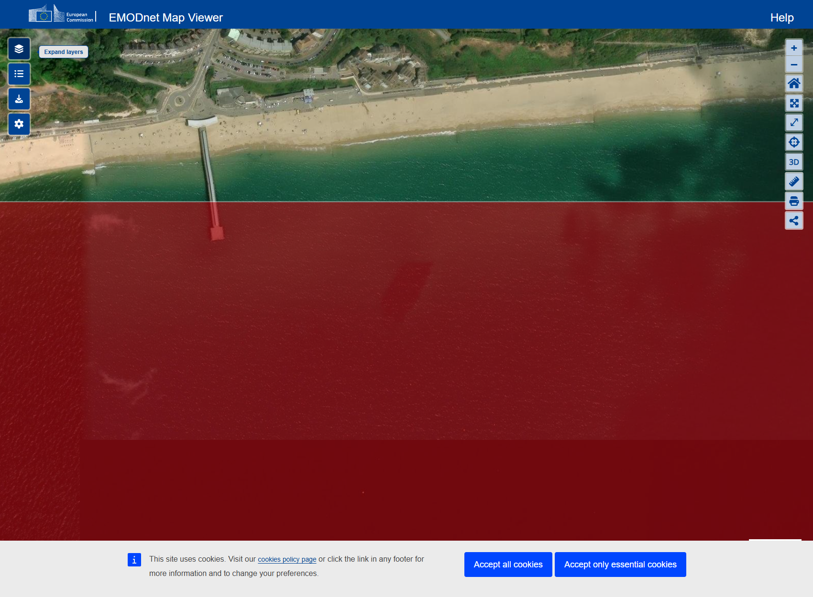

- **file**: `07_scale/bathymetry/emodnet/viewer/boscombe-surf-reef_viewer_sources_raw.png`
- **kind**: chart_screenshot
- **shows**: The coloured patch that supplies the DTM cells at the reef: one survey patch (CDI 117452, EDMO 2607 OceanWise Limited) supplies the DTM cells over the whole sea area shown, beginning about 100 m offshore of the surf line.
- **structure visible**: True
- **state shown**: damaged / remains (current Esri imagery; date not stated)
- **image date**: V2024 source references (record revised 2025-03-01); screenshot 2026-10-06
- **citation**: EMODnet Bathymetry Consortium (2024). EMODnet Digital Bathymetry (DTM 2024) [Mean depth / Source references layers], displayed in the EMODnet Map Viewer, https://emodnet.ec.europa.eu/geoviewer/ (layer ids 14159 / 13012), DOI https://doi.org/10.12770/cf51df64-56f9-4a99-b1aa-36b8d7b743a1. Accessed 2026-10-06. Licence CC BY 4.0 (EMODnet Terms of Use). Basemap: Esri World Imagery (Esri, Maxar, Earthstar Geographics). Annotations (cell grid, outline, points, profile, scale bar) added by this project.
- **image URL**: https://emodnet.ec.europa.eu/geoviewer/
- **source page**: https://emodnet.ec.europa.eu/geoviewer/
- **page / figure**: layer 13012 'Source Reference of the DTM' (V2024), same view as the mean-depth screenshot, 55 % opacity
- **credit**: EMODnet Bathymetry Consortium (data); Esri, Maxar, Earthstar Geographics (basemap); annotations by this project
- **licence**: EMODnet data: CC BY 4.0 (https://emodnet.ec.europa.eu/en/terms-use-emodnet-online-services-data-and-data-products, accessed 2026-10-06); 'not for navigation' (Sextant record). Esri World Imagery basemap: Esri terms, reuse not cleared. Annotations/plots: project products.
- **retrieved**: 2026-10-06
- **used for**: cross_check; 3d_seabed
- **How used for the model**: Used to identify the source survey of the DTM cells at the reef (CDI 117452, EDMO 2607 = OceanWise Limited, 2024 patch; WFS emodnet:source_references, REST reference). Quality index of that patch: horizontal 3, vertical 4, age 1 (10-30 y), purpose 3 (EMODnet QI record). Documented in REPORT.md; no model value taken.
- **3D check pending**: no - EMODnet DTM 2024 cell means (m rel. LAT; model z_LAT = z_MSL + 1.46) are 1.1-3.1 m deeper than the model seabed in the 7 cells fully inside the model grid (mean -1.80 m, sd 0.66; reef cell ki34288/kj32794: EMODnet -5.62 vs model seabed -4.23, as-built -3.10) and show no reef (cell max -4.87 vs crest +0.56). Decide whether to adopt the far-field slope (-1.4 %, y > 380 m) and re-check the survey-datum assumption A3 once CDI 117452 metadata is read (REQUESTS_FOR_LIOR.md in 07_scale/bathymetry/emodnet). RESULT (2026-10-07, 3D re-check agent (seabed extension run)): Resolved 2026-10-07 (seabed-extension run): the far-field slope was ADOPTED: offshore rows y 380-650 m of the model seabed are z(x,380) - 0.0141 (y - 380) (code 5, REPORT 9.1), checked against 11 Navionics z16 soundings (rms 1.2 m, stated +-1.2 m). Datum assumption A3 (Fig. 9 zero = chart datum) is supported by an independent test with the CCO beach profiles (m ODN): CCO minus the survey spline at the seaward ends of the 11 profile lines = +0.03 m (sd 0.30), -1.37 m if the zero were ODN. The CDI 117452 metadata page is still unread (open request). Reef values, toe, crest and the survey seabed were not changed by EMODnet.
- **annotated / overlay files**: `07_scale/bathymetry/emodnet/viewer/boscombe-surf-reef_viewer_sources_annotated.png`
- **linked records**: 07_scale/bathymetry/emodnet/REPORT.md; 07_scale/bathymetry/emodnet/data/boscombe-surf-reef_results.json
- **size**: 1.58 MB, 1700x1250 px
- **sha256**: 667627d12675125698f3f59e7e8a917f1d33d9c4f33fd03c98a1be67dd1391dd
- **rights**: Private research copy; reuse rights to be checked before any public release.
- **display in HTML**: True
- **added by**: EMODnet bathymetry test, 2026-10-06

## boscombe-surf-reef-img-27 - Shore-normal depth profile through the Boscombe reef: EMODnet DTM 2024 cells vs the project model (seabed, as-built reef, April 2011 survey surface)

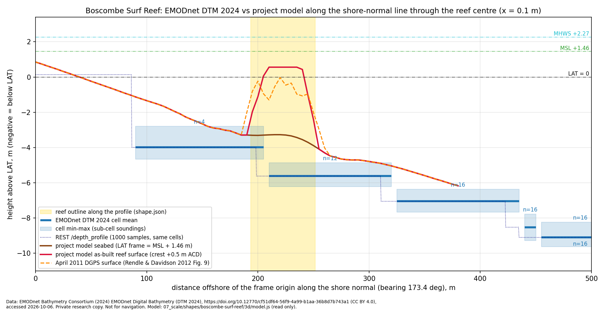

- **file**: `07_scale/bathymetry/emodnet/figures/boscombe-surf-reef_profile_emodnet_vs_model.png`
- **kind**: diagram
- **shows**: EMODnet cell means with min-max bars and the REST profile as steps (-4.0, -5.6, -7.1, -8.5/-9.1 m rel. LAT) against the model seabed and the lofted reef (crest +0.56 m rel. LAT): the reef is not in the DTM and the DTM is 1-3 m deeper than the model.
- **structure visible**: False
- **state shown**: analysis diagram (model: as-built 2009; survey surface April 2011)
- **image date**: plot 2026-10-06; EMODnet DTM 2024; model state AS-BUILT 2009 + April 2011 survey surface
- **citation**: This project (2026-10-06), plot made from EMODnet Bathymetry Consortium (2024). EMODnet Digital Bathymetry (DTM 2024), ERDDAP dataset bathymetry_dtm_2024 (https://erddap.emodnet.eu/erddap/griddap/bathymetry_dtm_2024), REST https://rest.emodnet-bathymetry.eu/depth_profile, DOI https://doi.org/10.12770/cf51df64-56f9-4a99-b1aa-36b8d7b743a1. Accessed 2026-10-06. Licence CC BY 4.0.
- **image URL**: https://rest.emodnet-bathymetry.eu/depth_profile
- **source page**: https://rest.emodnet-bathymetry.eu/depth_profile
- **page / figure**: plot made with scripts/make_plots.py; line x = 0.1 m, y = 0-500 m, bearing 173.4 deg
- **credit**: Plot by this project; EMODnet Bathymetry Consortium (data); Fig. 9 survey: Rendle & Davidson (2012) via the project model
- **licence**: EMODnet data: CC BY 4.0 (EMODnet Terms of Use, accessed 2026-10-06); plot is a project product; model curves from the project's own model.js (read only).
- **retrieved**: 2026-10-06
- **used for**: cross_check; 3d_seabed; 3d_tides
- **How used for the model**: Depths read: cell means -3.99 (y 90-205 m), -5.62 (210-320), -7.05 (325-435), -8.52 / -9.10 (440-555), -10.17 (560-650) m rel. LAT; model curves converted with z_LAT = z_MSL + 1.46. Result: Delta = EMODnet - model seabed = -1.39 m at the reef cell, -1.80 +- 0.66 m over 7 cells. Not used for model values; far-field slope proposed in REPORT.md section 'Integration plan'.
- **3D check pending**: no - EMODnet DTM 2024 cell means (m rel. LAT; model z_LAT = z_MSL + 1.46) are 1.1-3.1 m deeper than the model seabed in the 7 cells fully inside the model grid (mean -1.80 m, sd 0.66; reef cell ki34288/kj32794: EMODnet -5.62 vs model seabed -4.23, as-built -3.10) and show no reef (cell max -4.87 vs crest +0.56). Decide whether to adopt the far-field slope (-1.4 %, y > 380 m) and re-check the survey-datum assumption A3 once CDI 117452 metadata is read (REQUESTS_FOR_LIOR.md in 07_scale/bathymetry/emodnet). RESULT (2026-10-07, 3D re-check agent (seabed extension run)): Resolved 2026-10-07 (seabed-extension run): the far-field slope was ADOPTED: offshore rows y 380-650 m of the model seabed are z(x,380) - 0.0141 (y - 380) (code 5, REPORT 9.1), checked against 11 Navionics z16 soundings (rms 1.2 m, stated +-1.2 m). Datum assumption A3 (Fig. 9 zero = chart datum) is supported by an independent test with the CCO beach profiles (m ODN): CCO minus the survey spline at the seaward ends of the 11 profile lines = +0.03 m (sd 0.30), -1.37 m if the zero were ODN. The CDI 117452 metadata page is still unread (open request). Reef values, toe, crest and the survey seabed were not changed by EMODnet.
- **linked records**: 07_scale/bathymetry/emodnet/REPORT.md; 07_scale/bathymetry/emodnet/data/boscombe-surf-reef_profile_through_reef_centre_with_model.csv; 07_scale/bathymetry/emodnet/data/boscombe-surf-reef_profile_REST_depth_profile_y0_500.csv
- **size**: 0.16 MB, 1875x960 px
- **sha256**: f2a867d0e5aef690b727afe4eb5bbe526540912148b045a21281f352d12ed09e
- **rights**: Private research copy; reuse rights to be checked before any public release.
- **display in HTML**: True
- **added by**: EMODnet bathymetry test, 2026-10-06

## boscombe-surf-reef-img-28 - EMODnet DTM 2024 cell means vs the project model averaged over the same cell footprints at Boscombe (7 cells fully inside the model grid)

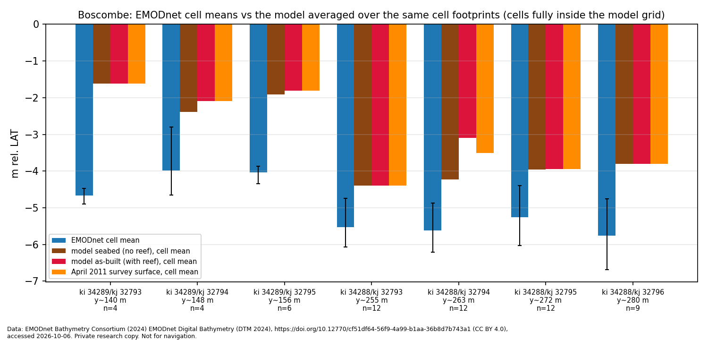

- **file**: `07_scale/bathymetry/emodnet/figures/boscombe-surf-reef_cells_emodnet_vs_model.png`
- **kind**: diagram
- **shows**: Bars per DTM cell: EMODnet mean (with min-max) against the model seabed, as-built surface and April 2011 survey surface, all m rel. LAT; the reef cell would be 1.1 m shallower on average if the DTM contained a reef like the model's.
- **structure visible**: False
- **state shown**: analysis diagram
- **image date**: plot 2026-10-06; EMODnet DTM 2024
- **citation**: This project (2026-10-06), plot made from EMODnet Bathymetry Consortium (2024). EMODnet Digital Bathymetry (DTM 2024), ERDDAP dataset bathymetry_dtm_2024 (https://erddap.emodnet.eu/erddap/griddap/bathymetry_dtm_2024), REST https://rest.emodnet-bathymetry.eu/depth_profile, DOI https://doi.org/10.12770/cf51df64-56f9-4a99-b1aa-36b8d7b743a1. Accessed 2026-10-06. Licence CC BY 4.0.
- **image URL**: https://erddap.emodnet.eu/erddap/griddap/bathymetry_dtm_2024
- **source page**: https://erddap.emodnet.eu/erddap/griddap/bathymetry_dtm_2024
- **page / figure**: plot made with scripts/make_plots.py from data/boscombe-surf-reef_cells_emodnet_vs_model.csv
- **credit**: Plot by this project; EMODnet Bathymetry Consortium (data)
- **licence**: EMODnet data: CC BY 4.0 (EMODnet Terms of Use, accessed 2026-10-06); plot is a project product; model curves from the project's own model.js (read only).
- **retrieved**: 2026-10-06
- **used for**: cross_check; 3d_seabed
- **How used for the model**: Cell-footprint averages of the model (2 m seabed grid and 1 m reef grid, z_LAT = z_MSL + 1.46) against EMODnet cell means: Delta -1.14 .. -3.05 m (mean -1.80, sd 0.66); the 3 best-sampled cells (n = 12) -1.14, -1.39, -1.30 m. Documents that the DTM cannot validate toe/crest; used only as a cross-check.
- **3D check pending**: no - EMODnet DTM 2024 cell means (m rel. LAT; model z_LAT = z_MSL + 1.46) are 1.1-3.1 m deeper than the model seabed in the 7 cells fully inside the model grid (mean -1.80 m, sd 0.66; reef cell ki34288/kj32794: EMODnet -5.62 vs model seabed -4.23, as-built -3.10) and show no reef (cell max -4.87 vs crest +0.56). Decide whether to adopt the far-field slope (-1.4 %, y > 380 m) and re-check the survey-datum assumption A3 once CDI 117452 metadata is read (REQUESTS_FOR_LIOR.md in 07_scale/bathymetry/emodnet). RESULT (2026-10-07, 3D re-check agent (seabed extension run)): Resolved 2026-10-07 (seabed-extension run): the far-field slope was ADOPTED: offshore rows y 380-650 m of the model seabed are z(x,380) - 0.0141 (y - 380) (code 5, REPORT 9.1), checked against 11 Navionics z16 soundings (rms 1.2 m, stated +-1.2 m). Datum assumption A3 (Fig. 9 zero = chart datum) is supported by an independent test with the CCO beach profiles (m ODN): CCO minus the survey spline at the seaward ends of the 11 profile lines = +0.03 m (sd 0.30), -1.37 m if the zero were ODN. The CDI 117452 metadata page is still unread (open request). Reef values, toe, crest and the survey seabed were not changed by EMODnet.
- **linked records**: 07_scale/bathymetry/emodnet/REPORT.md; 07_scale/bathymetry/emodnet/data/boscombe-surf-reef_cells_emodnet_vs_model.csv; 07_scale/bathymetry/emodnet/data/boscombe-surf-reef_comparison_summary.json
- **size**: 0.06 MB, 1500x720 px
- **sha256**: 92f68b4ee8aafaf198c71a06f5e85497e5f5746137493211da7e7548724cfcd0
- **rights**: Private research copy; reuse rights to be checked before any public release.
- **display in HTML**: True
- **added by**: EMODnet bathymetry test, 2026-10-06

## boscombe-surf-reef-img-29 - EMODnet DTM cells along the Boscombe profile in the releases 2018, 2020, 2022 and 2024

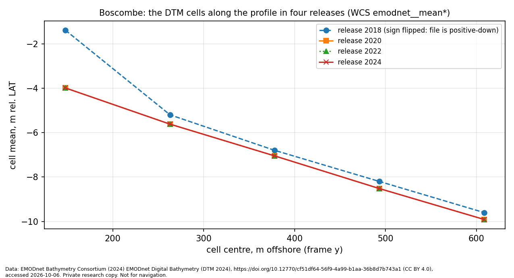

- **file**: `07_scale/bathymetry/emodnet/figures/boscombe-surf-reef_dtm_release_history.png`
- **kind**: diagram
- **shows**: Cell means along the profile: releases 2020, 2022 and 2024 are identical; release 2018 (stored positive-down, sign flipped here) is 0.4 m shallower at the reef cell and 2.6 m shallower in the shoreward cell.
- **structure visible**: False
- **state shown**: analysis diagram
- **image date**: plot 2026-10-06; DTM releases 2018, 2020, 2022, 2024
- **citation**: This project (2026-10-06), plot made from EMODnet Bathymetry Consortium (2024). EMODnet Digital Bathymetry (DTM 2024), WCS coverages emodnet__mean_2018/2020/2022/mean (https://ows.emodnet-bathymetry.eu/wcs), REST https://rest.emodnet-bathymetry.eu/depth_profile, DOI https://doi.org/10.12770/cf51df64-56f9-4a99-b1aa-36b8d7b743a1. Accessed 2026-10-06. Licence CC BY 4.0.
- **image URL**: https://ows.emodnet-bathymetry.eu/wcs
- **source page**: https://ows.emodnet-bathymetry.eu/wcs
- **page / figure**: plot made with scripts/make_plots.py from data/boscombe-surf-reef_cells_releases_wcs.csv
- **credit**: Plot by this project; EMODnet Bathymetry Consortium (data)
- **licence**: EMODnet data: CC BY 4.0 (EMODnet Terms of Use, accessed 2026-10-06); plot is a project product; model curves from the project's own model.js (read only).
- **retrieved**: 2026-10-06
- **used for**: cross_check
- **How used for the model**: Shows that the DTM at the reef did not change after release 2020 and does not contain the reef in any release; supports the survey-age inference (CDI 117452 age class 2 in 2018/2020, 1 in 2022/2024 -> survey about 2011-2012). Not used for model values.
- **3D check pending**: no - EMODnet DTM 2024 cell means (m rel. LAT; model z_LAT = z_MSL + 1.46) are 1.1-3.1 m deeper than the model seabed in the 7 cells fully inside the model grid (mean -1.80 m, sd 0.66; reef cell ki34288/kj32794: EMODnet -5.62 vs model seabed -4.23, as-built -3.10) and show no reef (cell max -4.87 vs crest +0.56). Decide whether to adopt the far-field slope (-1.4 %, y > 380 m) and re-check the survey-datum assumption A3 once CDI 117452 metadata is read (REQUESTS_FOR_LIOR.md in 07_scale/bathymetry/emodnet). RESULT (2026-10-07, 3D re-check agent (seabed extension run)): Resolved 2026-10-07 (seabed-extension run): the far-field slope was ADOPTED: offshore rows y 380-650 m of the model seabed are z(x,380) - 0.0141 (y - 380) (code 5, REPORT 9.1), checked against 11 Navionics z16 soundings (rms 1.2 m, stated +-1.2 m). Datum assumption A3 (Fig. 9 zero = chart datum) is supported by an independent test with the CCO beach profiles (m ODN): CCO minus the survey spline at the seaward ends of the 11 profile lines = +0.03 m (sd 0.30), -1.37 m if the zero were ODN. The CDI 117452 metadata page is still unread (open request). Reef values, toe, crest and the survey seabed were not changed by EMODnet.
- **linked records**: 07_scale/bathymetry/emodnet/REPORT.md; 07_scale/bathymetry/emodnet/data/boscombe-surf-reef_cells_releases_wcs.csv
- **size**: 0.09 MB, 1275x690 px
- **sha256**: 2cad3da4d1efabcf508cb027be5359ac468329d60bdbce5f8e998e00797a9ac6
- **rights**: Private research copy; reuse rights to be checked before any public release.
- **display in HTML**: True
- **added by**: EMODnet bathymetry test, 2026-10-06

## boscombe-surf-reef-img-30 - Plan of the 11 CCO beach-profile lines (survey 2010-04-20) on the extended Boscombe model seabed, with tide contours and the reef toe

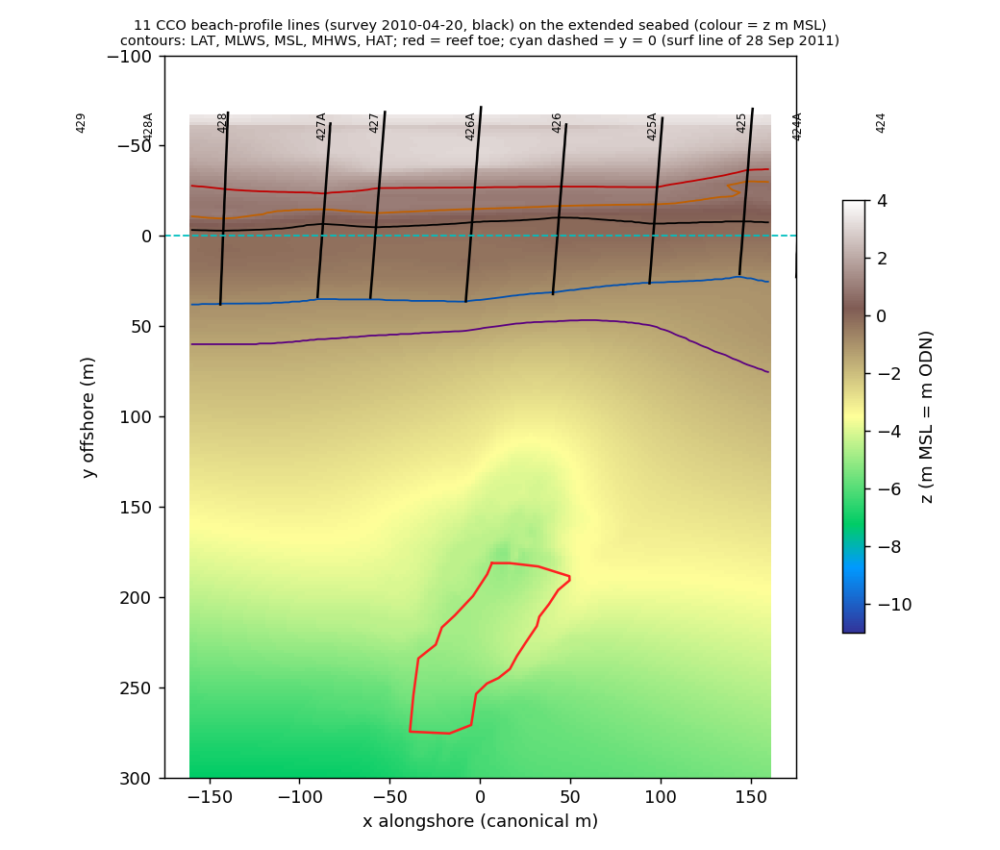

- **file**: `07_scale/shapes/boscombe-surf-reef/3d/annotated/cco_profile_lines_plan.png`
- **kind**: diagram
- **shows**: Plan view (x alongshore, y offshore, m): the 11 profile lines near the reef (7 lie inside the 320 m grid, 428A and 424A just outside, 429 and 424 about 220 m out), z colour of the extended seabed, contours LAT / MLWS / MSL / MHWS / HAT, the y = 0 surf line and the reef toe outline: the beach and nearshore seabed now reach from the back of the beach (y -66 m, +3.3 m ODN) to the reef.
- **structure visible**: True
- **state shown**: not applicable (analysis figure; beach survey 2010-04-20, model as-built 2009 + April 2011 survey surface)
- **image date**: 2026-10-07 (figure); CCO survey 2010-04-20
- **citation**: Channel Coastal Observatory / Southeast Regional Coastal Monitoring Programme (2026). Beach profile surveys, lines 5f00424-5f00429 (11 lines near Boscombe, survey 2010-04-20) [data], https://coastalmonitoring.org/ (profile API https://coastalmonitoring.org/cco/profiles/api.php). Open Government Licence v3.0; accessed 2026-10-06. Figure made by this project from the Elevation_OD text files.
- **image URL**: https://coastalmonitoring.org/
- **source page**: https://coastalmonitoring.org/
- **page / figure**: scripts/figures_extension.py output
- **credit**: Figure by this project; data Channel Coastal Observatory (Southeast Regional Coastal Monitoring Programme)
- **licence**: CCO data: Open Government Licence v3.0 (acknowledge the source; not for navigation); figure is a project product
- **retrieved**: 2026-10-07
- **used for**: 3d_seabed; cross_check
- **How used for the model**: Shows where the CCO data enter the seabed grid (zone codes 3 and 4, y -66 m to about +80 m) and that the model shoreline (MSL contour about 8 m landward of y = 0, HAT about y -35 m) is now inside the model. Data: elevation m ODN = m MSL (A4), positions OSGB36 -> canonical (+-5 m).
- **3D check pending**: no - none: figure made from the model and the CCO data
- **linked records**: 07_scale/shapes/boscombe-surf-reef/3d/SOURCES_3D.md (re-check run 2026-10-07); 07_scale/shapes/boscombe-surf-reef/3d/METHODS_3D.md section 3.4
- **size**: 0.10 MB, 1040x884 px
- **sha256**: d77e93e530c75467f35b2ffc2062dce0f8d5c86869f1406eebe3efc078a86484
- **rights**: Private research copy; reuse rights to be checked before any public release.
- **display in HTML**: True
- **added by**: 3D re-check agent (seabed extension), 2026-10-07

## boscombe-surf-reef-img-31 - CCO beach profiles of 2010-04-20 (11 lines, m ODN) against the model seabed at x = 0 and the tide levels

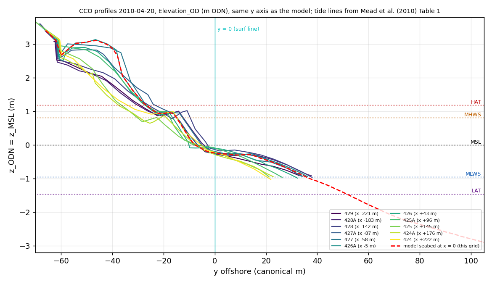

- **file**: `07_scale/shapes/boscombe-surf-reef/3d/annotated/cco_profiles_cross_sections.png`
- **kind**: diagram
- **shows**: Cross-sections z (m ODN = m MSL) vs y (m): the 11 CCO profiles from the back of the beach (about +3.3 m) to their seaward ends (y 21-38 m, about -1.0 m) with the HAT, MHWS, MSL, MLWS and LAT lines and the model seabed at x = 0 (dashed).
- **structure visible**: False
- **state shown**: not applicable (analysis figure; beach survey 2010-04-20, model as-built 2009 + April 2011 survey surface)
- **image date**: 2026-10-07 (figure); CCO survey 2010-04-20
- **citation**: Channel Coastal Observatory / Southeast Regional Coastal Monitoring Programme (2026). Beach profile surveys, lines 5f00424-5f00429 (11 lines near Boscombe, survey 2010-04-20) [data], https://coastalmonitoring.org/ (profile API https://coastalmonitoring.org/cco/profiles/api.php). Open Government Licence v3.0; accessed 2026-10-06. Figure made by this project from the Elevation_OD text files.
- **image URL**: https://coastalmonitoring.org/
- **source page**: https://coastalmonitoring.org/
- **page / figure**: scripts/figures_extension.py output
- **credit**: Figure by this project; data Channel Coastal Observatory (Southeast Regional Coastal Monitoring Programme)
- **licence**: CCO data: Open Government Licence v3.0 (acknowledge the source; not for navigation); figure is a project product
- **retrieved**: 2026-10-07
- **used for**: 3d_seabed; cross_check
- **How used for the model**: Validation of the beach part of the extended seabed: the model follows the measured profiles to within their date-to-date and line-to-line spread (2011-03-23 minus 2010-04-20 rms 0.28 m, 11 lines). Also shows the gentle intertidal slope (about 0.03-0.04) that sets the shoreline position for each water level.
- **3D check pending**: no - none: figure made from the model and the CCO data
- **linked records**: 07_scale/shapes/boscombe-surf-reef/3d/SOURCES_3D.md (re-check run 2026-10-07); 07_scale/shapes/boscombe-surf-reef/3d/METHODS_3D.md section 3.4
- **size**: 0.13 MB, 1170x676 px
- **sha256**: c2bed94cbc47cafc630e0a2a3ef3f30991722353e73198e8b66a2a32cea47846
- **rights**: Private research copy; reuse rights to be checked before any public release.
- **display in HTML**: True
- **added by**: 3D re-check agent (seabed extension), 2026-10-07

## boscombe-surf-reef-img-32 - Zone map of the extended Boscombe seabed grid (codes 0-5 by data source), y -66 to 650 m, with the reef toe and the MSL contour

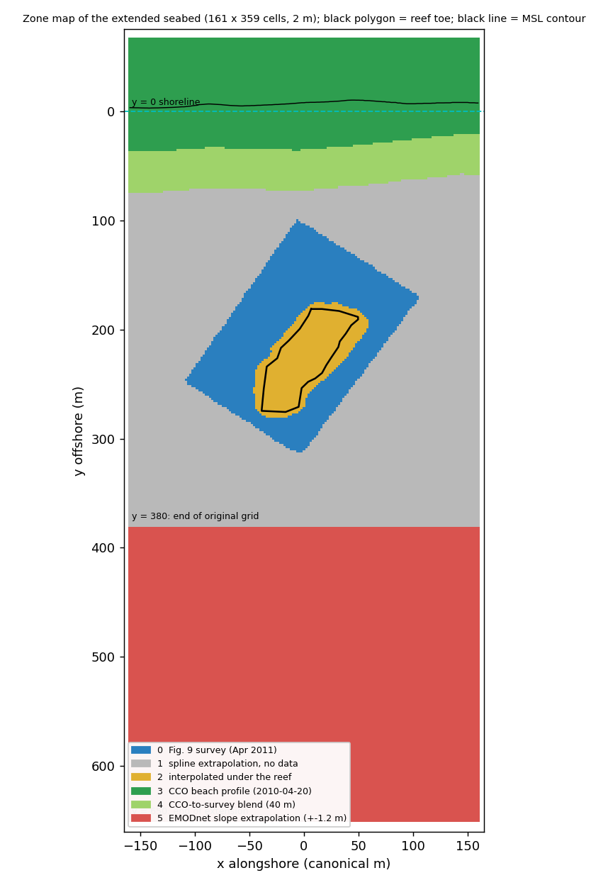

- **file**: `07_scale/shapes/boscombe-surf-reef/3d/annotated/seabed_zone_map.png`
- **kind**: diagram
- **shows**: Zone map: 0 Fig. 9 survey (April 2011), 1 spline extrapolation, 2 interpolated under the reef, 3 CCO beach profile, 4 CCO-to-survey blend, 5 EMODnet slope extrapolation (y 380-650 m); reef toe outline in black, MSL contour in black, y = 0, 380 and 650 m marked.
- **structure visible**: True
- **state shown**: not applicable (analysis figure; beach survey 2010-04-20, model as-built 2009 + April 2011 survey surface)
- **image date**: 2026-10-07 (figure); CCO survey 2010-04-20
- **citation**: Channel Coastal Observatory / Southeast Regional Coastal Monitoring Programme (2026). Beach profile surveys, lines 5f00424-5f00429 (11 lines near Boscombe, survey 2010-04-20) [data], https://coastalmonitoring.org/ (profile API https://coastalmonitoring.org/cco/profiles/api.php). Open Government Licence v3.0; accessed 2026-10-06. Figure made by this project from the Elevation_OD text files.
- **image URL**: https://coastalmonitoring.org/
- **source page**: https://coastalmonitoring.org/
- **page / figure**: scripts/figures_extension.py output
- **credit**: Figure by this project; data Channel Coastal Observatory (Southeast Regional Coastal Monitoring Programme)
- **licence**: CCO data: Open Government Licence v3.0 (acknowledge the source; not for navigation); figure is a project product
- **retrieved**: 2026-10-07
- **used for**: 3d_seabed
- **How used for the model**: Documents which part of the model seabed is measured, interpolated or extrapolated (the viewer's zone toggle shows the same codes). Uncertainty by zone: survey +-0.5 m, CCO +-0.3 m, spline 0.5-1 m, EMODnet extrapolation +-1.2 m (Navionics z16 check).
- **3D check pending**: no - none: figure made from the model and the CCO data
- **linked records**: 07_scale/shapes/boscombe-surf-reef/3d/SOURCES_3D.md (re-check run 2026-10-07); 07_scale/shapes/boscombe-surf-reef/3d/METHODS_3D.md section 3.4
- **size**: 0.06 MB, 858x1248 px
- **sha256**: 083731caec959b0a2c19dd0e66cf0eef6d894a97f84495f8e997e88c67ffdbfe
- **rights**: Private research copy; reuse rights to be checked before any public release.
- **display in HTML**: True
- **added by**: 3D re-check agent (seabed extension), 2026-10-07
