# Image registry - bunbury-airwave

Source of truth: `images.json` in this folder (convention: `_agent_briefs/image_registry.md`; overview: `03_images/reefs/README.md`). This file is generated from it.

21 images registered, 21 with a file, 9 used for the model (any use other than context/not_used).

## bunbury-airwave-img-01 - Underwater close-up of the Airwave bladder with seam fold (ABC, Dec 2019)

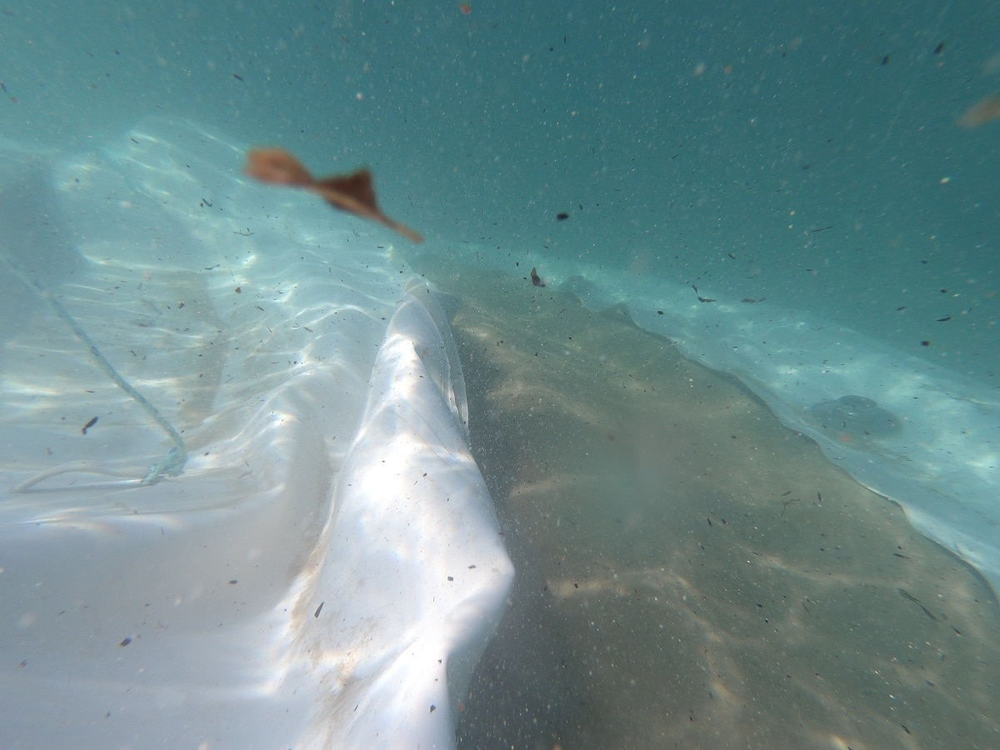

- **file**: `03_images/reefs/bunbury-airwave/bunbury-airwave_underwater-seam_2019-12.jpg`
- **kind**: photo
- **shows**: Underwater view of the pale/white inflatable bladder material with a seam/fold line through the frame, sandy seabed and a mooring line; consistent with the torn seam.
- **structure visible**: True
- **state shown**: damaged (torn seam, Dec 2019)
- **image date**: 2019-12 (installation week; article 2019-12-16)
- **citation**: ABC South West WA (2019-12-16). Photo in: Bunbury's Back Beach surfers deflated as artificial reef, Airwave, tears during installation. ABC News, https://www.abc.net.au/news/2019-12-16/word-first-surf-reef-tears-during-installation/11803228. Image file https://live-production.wcms.abc-cdn.net.au/cc84b43142e4cdd5abcbae122250f275. Accessed 2026-10-06.
- **image URL**: https://live-production.wcms.abc-cdn.net.au/cc84b43142e4cdd5abcbae122250f275
- **source page**: https://www.abc.net.au/news/2019-12-16/word-first-surf-reef-tears-during-installation/11803228
- **page / figure**: article photo (underwater, torn seam)
- **credit**: ABC South West WA (ABC News, Australian Broadcasting Corporation)
- **licence**: ABC News copyright; no reuse licence (link/research copy only)
- **retrieved**: 2026-10-06
- **used for**: context
- **How used for the model**: Page illustration of the tear. No plan information; not used for the shape (the shape is traced on the RWR drone photo).
- **3D check pending**: no - none: close-up of the tear
- **linked records**: 02_research/reefs/bunbury-airwave.json images[0]; 05_qa/reef/bunbury-airwave_media_recheck.json images[0]
- **size**: 0.18 MB, 1200x900 px
- **sha256**: dcefcd3b5c21dd5731e17a2e6789d043ba59c889ce24344daa3d44f93cff5287
- **rights**: Private research copy; reuse rights to be checked before any public release.
- **display in HTML**: True
- **added by**: image-registry backfill, 2026-10-06

## bunbury-airwave-img-02 - Airwave design/technology graphic (dome bladder with wave peeling over it), via ABC

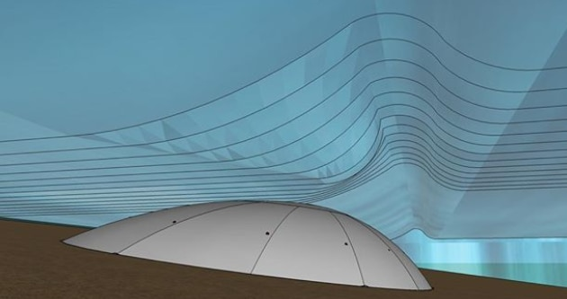

- **file**: `03_images/reefs/bunbury-airwave/bunbury-airwave_design-graphic-airwavesurfreef_2019.jpg`
- **kind**: design_drawing
- **shows**: 3D concept render of a smooth grey dome on the seabed with stylised wave contour lines rising and peeling over it (not to scale).
- **structure visible**: True
- **state shown**: design (concept render)
- **image date**: 2019 (pre-installation concept; exact date not stated)
- **citation**: Airwave Surf Reef (Instagram @airwavesurfreef) (2019). Design graphic in: Bunbury's Back Beach surfers deflated as artificial reef, Airwave, tears during installation. ABC News, https://www.abc.net.au/news/2019-12-16/word-first-surf-reef-tears-during-installation/11803228. Image file https://live-production.wcms.abc-cdn.net.au/1a68756faf1cc30ccfdfad69bc4ad197. Accessed 2026-10-06.
- **image URL**: https://live-production.wcms.abc-cdn.net.au/1a68756faf1cc30ccfdfad69bc4ad197
- **source page**: https://www.abc.net.au/news/2019-12-16/word-first-surf-reef-tears-during-installation/11803228
- **page / figure**: article graphic
- **credit**: Instagram: airwavesurfreef (via ABC News)
- **licence**: ABC News copyright; no reuse licence (link/research copy only)
- **retrieved**: 2026-10-06
- **used for**: context
- **How used for the model**: Page illustration of the design intent (circular dome, wave building on it). Unscaled, so no dimension read.
- **3D check pending**: no - none: unscaled concept render
- **linked records**: 02_research/reefs/bunbury-airwave.json images[1]; 05_qa/reef/bunbury-airwave_media_recheck.json images[1]
- **size**: 0.03 MB, 630x333 px
- **sha256**: 8b678e50c38bb742e857577d74dd27781092c01006c8b3c2e8aa6bea5823f06a
- **rights**: Private research copy; reuse rights to be checked before any public release.
- **display in HTML**: True
- **added by**: image-registry backfill, 2026-10-06

## bunbury-airwave-img-03 - Aerial of Bunbury Back Beach, intended Airwave site (ABC, June 2019)

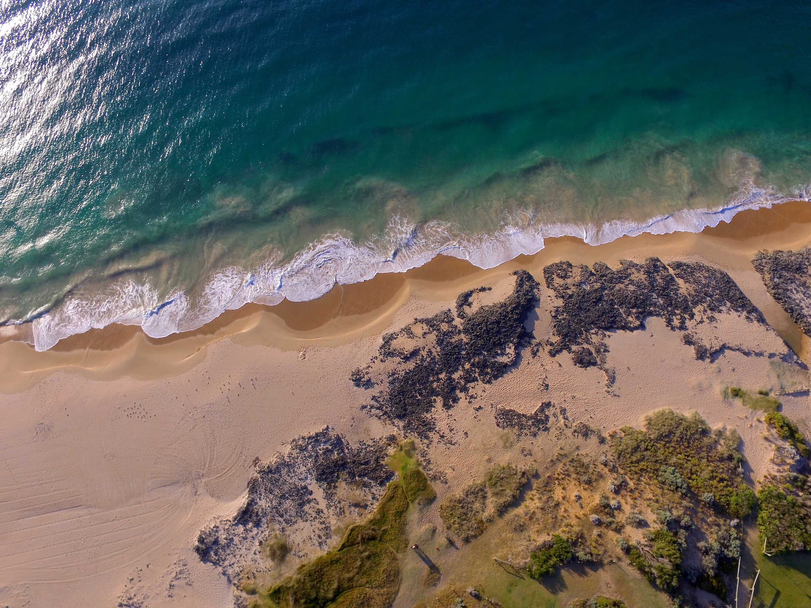

- **file**: `03_images/reefs/bunbury-airwave/bunbury-airwave_back-beach-aerial_2019-06.jpg`
- **kind**: aerial
- **shows**: Near-vertical drone view of Back Beach: waves breaking on the shore, a sandy beach with dark reef-rock patches and dune vegetation; no bladder (taken before installation).
- **structure visible**: False
- **state shown**: pre-construction (site before installation)
- **image date**: before 2019-06-13 (pre-installation)
- **citation**: De Poloni, Gian / ABC South West (2019-06-13). Photo in: 'World-first' inflatable surf reef to be installed at beach in Western Australia. ABC News, https://www.abc.net.au/news/2019-06-13/world-first-artificial-surf-reef-to-be-installed-at-bunbury/11204280. Image file https://live-production.wcms.abc-cdn.net.au/0db449946b7b75c45d5bd9c51901a510. Accessed 2026-10-06.
- **image URL**: https://live-production.wcms.abc-cdn.net.au/0db449946b7b75c45d5bd9c51901a510
- **source page**: https://www.abc.net.au/news/2019-06-13/world-first-artificial-surf-reef-to-be-installed-at-bunbury/11204280
- **page / figure**: article lead photo (3000 x 2250 px)
- **credit**: ABC South West: Gian De Poloni
- **licence**: ABC News copyright; no reuse licence (link/research copy only)
- **retrieved**: 2026-10-06
- **used for**: context
- **How used for the model**: Site-context illustration only (natural reef-rock patches on the beach). Not used for the shape or seabed.
- **3D check pending**: no - none: pre-installation site view, no scale
- **linked records**: 02_research/reefs/bunbury-airwave.json images[2]; 05_qa/reef/bunbury-airwave_media_recheck.json images[2]
- **size**: 0.74 MB, 3000x2250 px
- **sha256**: af5f0f20b29cd2ce6319c71764b6533028fb466b23fba1cd709d219893152bed
- **rights**: Private research copy; reuse rights to be checked before any public release.
- **display in HTML**: True
- **added by**: image-registry backfill, 2026-10-06

## bunbury-airwave-img-04 - Airwave-Tear.jpg: underwater view of the torn bladder (Raised Water Research)

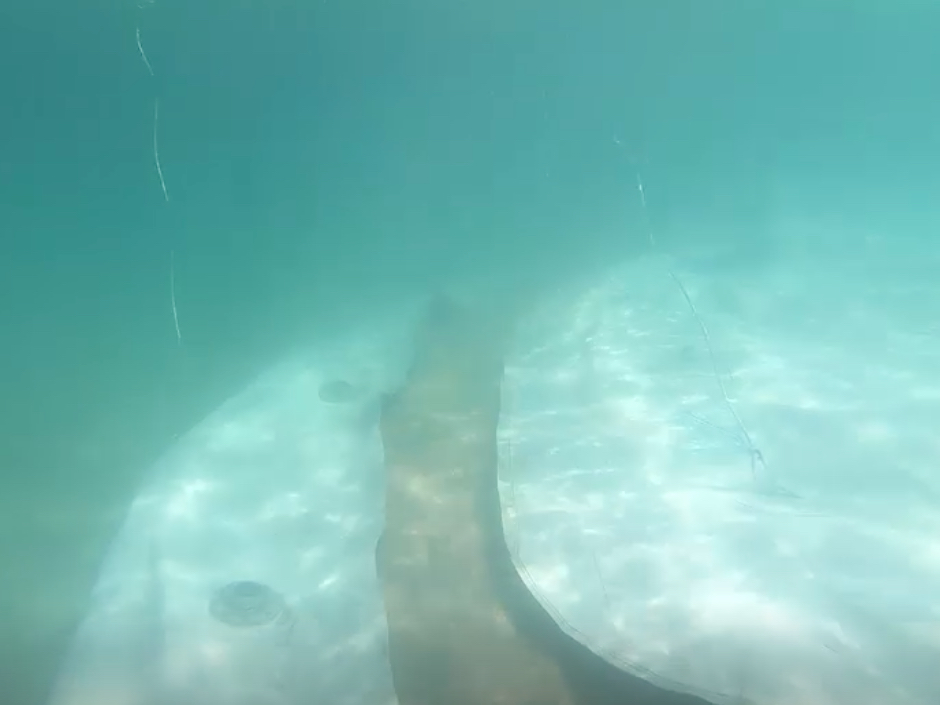

- **file**: `03_images/reefs/bunbury-airwave/bunbury-airwave_underwater-tear-rwr_2019-12.jpg`
- **kind**: photo
- **shows**: Underwater view of the pale bladder with a raised seam ridge and mooring lines; the tear itself is not sharply resolved.
- **structure visible**: True
- **state shown**: damaged (torn seam, Dec 2019)
- **image date**: 2019-12 (installation week; upload ?v=1576553654 = 2019-12-17)
- **citation**: Raised Water Research (2019-12-16). The Bunbury Airwave Artificial Surf Reef Tears During Installation [web post]. https://raisedwaterresearch.com/the-bunbury-airwave-artificial-reef-tears-during-installation/. Image file https://raisedwaterresearch.com/wp-content/uploads/2019/12/Airwave-Tear.jpg (card URL had ?v=1576553654). Accessed 2026-10-06.
- **image URL**: https://raisedwaterresearch.com/wp-content/uploads/2019/12/Airwave-Tear.jpg
- **source page**: https://raisedwaterresearch.com/the-bunbury-airwave-artificial-reef-tears-during-installation/
- **page / figure**: post image 'Airwave-Tear'
- **credit**: Raised Water Research (photographer not stated)
- **licence**: not stated; Raised Water Research / Waveco copyright assumed - NOT cleared
- **retrieved**: 2026-10-06
- **used for**: context
- **How used for the model**: Page illustration. It was removed from src/ on 2026-10-05 as it has no plan information (sources.md). Not used for the shape.
- **3D check pending**: no - none: close-up of the tear
- **linked records**: 02_research/reefs/bunbury-airwave.json images[4]; 07_scale/shapes/bunbury-airwave/sources.md (removed img3)
- **size**: 0.28 MB, 940x705 px
- **sha256**: 1c0c92a0071c8a153e886c7611666f39faf851f31cc8ac5a3cbfd10ec8456324
- **rights**: Private research copy; reuse rights to be checked before any public release.
- **display in HTML**: True
- **added by**: image-registry backfill, 2026-10-06

## bunbury-airwave-img-05 - Airwave-From-Above.jpg: oblique aerial of Bunbury Back Beach (RWR profile-page hero)

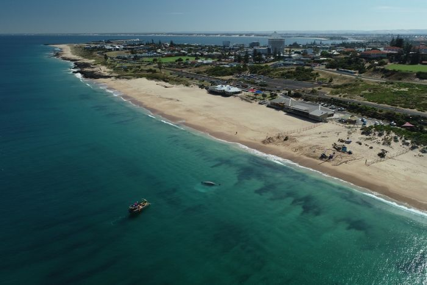

- **file**: `03_images/reefs/bunbury-airwave/bunbury-airwave_back-beach-oblique-rwr-hero_2019-09.jpg`
- **kind**: aerial
- **shows**: Oblique drone view along Back Beach with the surf club and car park, a boat offshore and dark reef patches in the water; no bladder visible.
- **structure visible**: False
- **state shown**: pre-construction (site before installation)
- **image date**: 2019-09 or earlier (upload path 2019/09; pre-installation)
- **citation**: Raised Water Research (2019). Bunbury Airwave [spot profile page, hero image]. https://raisedwaterresearch.com/spot/artificial-reef/australia/western-australia/bunbury-airwave/. Image file https://raisedwaterresearch.com/wp-content/uploads/2019/09/Airwave-From-Above.jpg. Accessed 2026-10-06.
- **image URL**: https://raisedwaterresearch.com/wp-content/uploads/2019/09/Airwave-From-Above.jpg
- **source page**: https://raisedwaterresearch.com/spot/artificial-reef/australia/western-australia/bunbury-airwave/
- **page / figure**: profile-page hero (700 x 467 px)
- **credit**: not stated for this file (the page captions its images 'Image: Waveco', 'Image: Unofficial Networks', 'Photo: Thunderbomb Surf Camp')
- **licence**: not stated; Raised Water Research / Waveco copyright assumed - NOT cleared
- **retrieved**: 2026-10-06
- **used for**: context; not_used
- **How used for the model**: Looked at during verification (sources.md) and not used for any number. Registered as a site photo.
- **3D check pending**: no - none: oblique site view
- **linked records**: 07_scale/shapes/bunbury-airwave/sources.md (Verification additions)
- **size**: 0.05 MB, 700x467 px
- **sha256**: b006e28fe8e1c3ba7212a0884240723d7fc8b5ccd2f91b290a5715586ea08b76
- **rights**: Private research copy; reuse rights to be checked before any public release.
- **display in HTML**: True
- **added by**: image-registry backfill, 2026-10-06

## bunbury-airwave-img-06 - Airwave-from-Above.jpg: near-nadir drone photo of the inflated bladder on the seabed

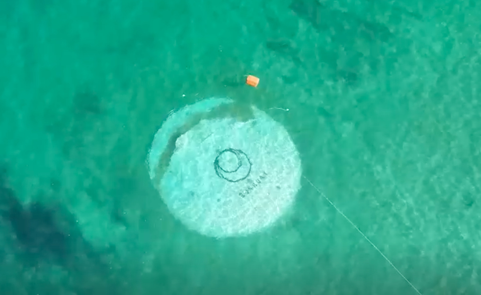

- **file**: `07_scale/shapes/bunbury-airwave/src/img1_airwave-from-above.jpg`
- **kind**: aerial
- **shows**: Pale circular submerged bladder in shallow turquoise water with an orange marker buoy and a tether line; seam ring and valve mark visible; no shoreline.
- **structure visible**: True
- **state shown**: as installed, torn (Dec 2019, about 90% complete)
- **image date**: Dec 2019 installation week (tear spotted Fri 13 Dec; post 2019-12-16; file upload ?v= = 2019-12-17 03:31 UTC); exact capture day not stated
- **citation**: Raised Water Research (2019-12-16). The Bunbury Airwave Artificial Surf Reef Tears During Installation [web post], header image 'Airwave-from-Above.jpg'. https://raisedwaterresearch.com/the-bunbury-airwave-artificial-reef-tears-during-installation/. Image file https://raisedwaterresearch.com/wp-content/uploads/2019/12/Airwave-from-Above.jpg?v=1576553483. Accessed 2026-10-04 (re-verified by md5 2026-10-05).
- **image URL**: https://raisedwaterresearch.com/wp-content/uploads/2019/12/Airwave-from-Above.jpg?v=1576553483
- **source page**: https://raisedwaterresearch.com/the-bunbury-airwave-artificial-reef-tears-during-installation/
- **page / figure**: header image of the tear post (956 x 587 px)
- **credit**: Raised Water Research (photographer not stated)
- **licence**: not stated; Raised Water Research / Waveco copyright assumed - NOT cleared
- **retrieved**: 2026-10-04
- **used for**: plan_trace; scale
- **How used for the model**: PRIMARY image for the plan shape: the outline was traced (29 vertices) and fitted by an ellipse (circle seen at ~27 deg tilt, axis ratio good to ~+-7%); the scale (25.59 px/m) is calibrated on the text-stated 12 m diameter, so the 112 vs 113 m2 agreement is by construction (shape.json source img1; METHOD.md; model plan shape).
- **3D check pending**: no - none: image already used as a model source or is context only
- **annotated / overlay files**: `07_scale/shapes/bunbury-airwave/3d/annotated/img1_trace_axes_scale.png`; `07_scale/shapes/bunbury-airwave/overlays/img1.png`
- **linked records**: 07_scale/shapes/bunbury-airwave/sources.md img1; 07_scale/shapes/bunbury-airwave/shape.json sources[img1]; 07_scale/shapes/bunbury-airwave/METHOD.md; 07_scale/shapes/bunbury-airwave/3d/model.js (reef plan shape)
- **size**: 0.41 MB, 956x587 px
- **sha256**: 2760a0ab82dbd14b4bafd7b8f90484163ed21f52299d97b18dd3dec5e41ada27
- **rights**: Private research copy; reuse rights to be checked before any public release.
- **display in HTML**: True
- **added by**: image-registry backfill, 2026-10-06

## bunbury-airwave-img-07 - AirwaveDiagram2.jpg: oblique 3D concept render of the dome bladder

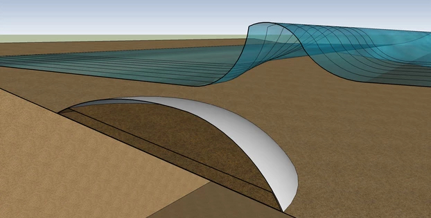

- **file**: `07_scale/shapes/bunbury-airwave/src/img2_airwave-diagram2.jpg`
- **kind**: design_drawing
- **shows**: Oblique render of a dome-shaped bladder on the seabed with a stylised wave peeling over it; labelled as a design diagram.
- **structure visible**: True
- **state shown**: design (concept render)
- **image date**: 2019-09-09 (upload timestamp 23:54 UTC; pre-install concept)
- **citation**: Waveco (2019), via Raised Water Research. AirwaveDiagram2.jpg [3D concept render] on: Bunbury Airwave [spot page]. https://raisedwaterresearch.com/spot/artificial-reef/australia/western-australia/bunbury-airwave/. Image file https://raisedwaterresearch.com/wp-content/uploads/2019/09/AirwaveDiagram2.jpg?v=1568073278. Accessed 2026-10-04.
- **image URL**: https://raisedwaterresearch.com/wp-content/uploads/2019/09/AirwaveDiagram2.jpg?v=1568073278
- **source page**: https://raisedwaterresearch.com/spot/artificial-reef/australia/western-australia/bunbury-airwave/
- **page / figure**: gallery image (standalone render, no plan view, no scale)
- **credit**: Waveco via Raised Water Research
- **licence**: not stated; Raised Water Research / Waveco copyright assumed - NOT cleared
- **retrieved**: 2026-10-04
- **used for**: context
- **How used for the model**: Context only (listed in shape.json as source img2, role context): confirms the dome concept; no scale, so nothing measured.
- **3D check pending**: no - none: image already used as a model source or is context only
- **linked records**: 07_scale/shapes/bunbury-airwave/sources.md img2; 07_scale/shapes/bunbury-airwave/shape.json sources[img2]
- **size**: 0.16 MB, 622x315 px
- **sha256**: 3a571444cd755a84177946bec819546f7e8e45f6da3fb4d52d2f9c12ce04b8c8
- **rights**: Private research copy; reuse rights to be checked before any public release.
- **display in HTML**: True
- **added by**: image-registry backfill, 2026-10-06

## bunbury-airwave-img-08 - ABC News video frame 11804314_0005: oblique drone shot of the inflated bladder ('Dream on hold for Bunbury surfers')

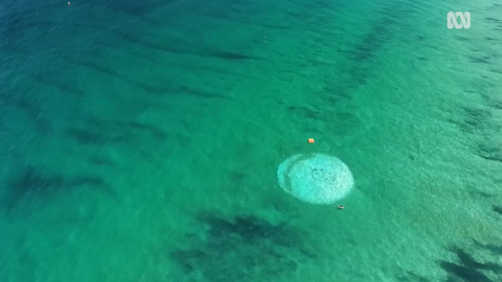

- **file**: `03_images/video_frames/bunbury-airwave/11804314_0005.jpg`
- **kind**: video_frame
- **shows**: Aerial drone shot with the ABC watermark: pale circular submerged bladder in shallow turquoise water, orange marker buoy above/right of it, faint tether line and a diver's shadow near the edge.
- **structure visible**: True
- **state shown**: as installed, torn (Dec 2019)
- **image date**: 2019-12-16 (broadcast); filmed Dec 2019 install week
- **citation**: ABC News (Australia) (2019-12-16). Dream on hold for Bunbury surfers [video, 35 s], frame at ~00:03-00:05. ABC News, https://www.abc.net.au/news/2019-12-16/11804314 (video file https://abcmedia.akamaized.net/news/video/201912/airwave_high.mp4). Accessed 2026-09-25 (frame); re-verified 2026-10-05.
- **image URL**: https://abcmedia.akamaized.net/news/video/201912/airwave_high.mp4
- **source page**: https://www.abc.net.au/news/2019-12-16/11804314
- **page / figure**: video frame at ~00:03-00:05
- **credit**: ABC News (Australia)
- **licence**: copyrighted news footage - not cleared; one frame kept as a private research copy
- **retrieved**: 2026-09-24
- **used for**: plan_trace; cross_check
- **How used for the model**: Second view of the same scene at a steeper angle (~48 deg tilt): outline fits an ellipse to 3.0% of radius, corroborating the circular plan; not independent of img1 (same buoy, tether, valve mark). Byte-identical to src/img4_abc-frame-11804314-0005.jpg (shape.json source img4).
- **3D check pending**: no - none: image already used as a model source or is context only
- **annotated / overlay files**: `07_scale/shapes/bunbury-airwave/overlays/img4.png`
- **byte-identical copies**: `07_scale/shapes/bunbury-airwave/src/img4_abc-frame-11804314-0005.jpg`
- **linked records**: 07_scale/shapes/bunbury-airwave/sources.md img4; 07_scale/shapes/bunbury-airwave/shape.json sources[img4]; 02_research/videos/bunbury-airwave/videos.json
- **size**: 0.06 MB, 1024x576 px
- **sha256**: f39d83d8868fddd43ed4e703355d4d961a31c3d36c8e7cb95958b0ad4fc4c2b2
- **rights**: Private research copy; reuse rights to be checked before any public release.
- **display in HTML**: True
- **added by**: image-registry backfill, 2026-10-06

## bunbury-airwave-img-09 - ABC News video frame 11804314_0010: beachfront interview at the Back Beach access point

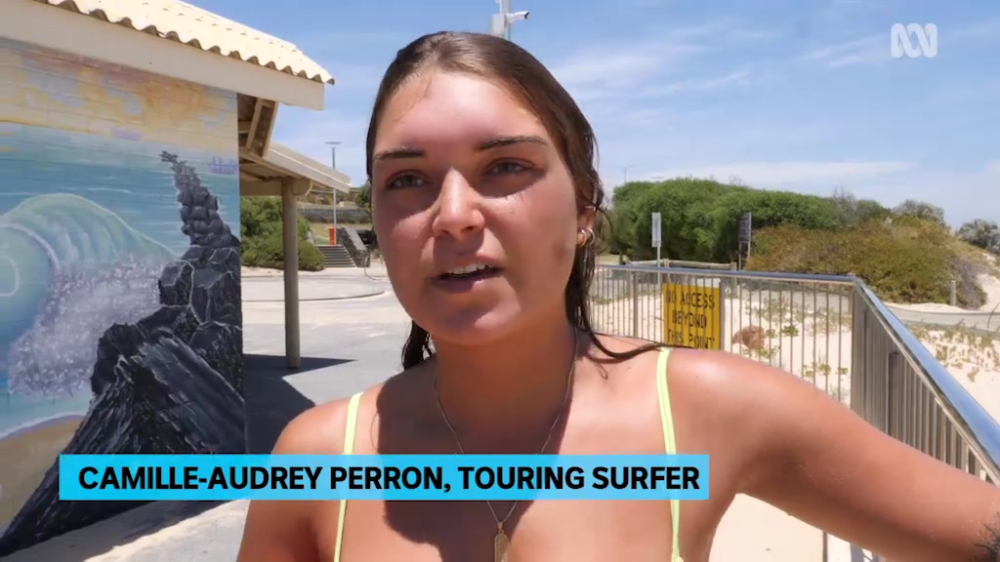

- **file**: `03_images/video_frames/bunbury-airwave/11804314_0010.jpg`
- **kind**: video_frame
- **shows**: Beachfront interview with Camille-Audrey Perron at the Back Beach access point (surf-club mural, 'NO ACCESS BEYOND THIS POINT' sign); no reef or bladder in frame.
- **structure visible**: False
- **state shown**: not applicable (site context)
- **image date**: 2019-12-16
- **citation**: ABC News (Australia) (2019-12-16). Dream on hold for Bunbury surfers [video, 35 s], frame at 00:10. https://www.abc.net.au/news/2019-12-16/11804314. Accessed 2026-09-25.
- **image URL**: https://abcmedia.akamaized.net/news/video/201912/airwave_high.mp4
- **source page**: https://www.abc.net.au/news/2019-12-16/11804314
- **page / figure**: video frame at 00:10
- **credit**: ABC News (Australia)
- **licence**: copyrighted news footage - not cleared; one frame kept as a private research copy
- **retrieved**: 2026-09-24
- **used for**: context
- **How used for the model**: Page illustration (site context only); not used for the model.
- **3D check pending**: no - none: interview frame
- **size**: 0.10 MB, 1024x576 px
- **sha256**: 94b534bdee543bed73b49351ed1eb14647b57b3ddc55f851003a7250b3d69bfa
- **rights**: Private research copy; reuse rights to be checked before any public release.
- **display in HTML**: True
- **added by**: image-registry backfill, 2026-10-06

## bunbury-airwave-img-10 - ReefTopView.png: plan-view concept graphic (circle with concentric seam rings over a stock beach aerial; arrow '30m')

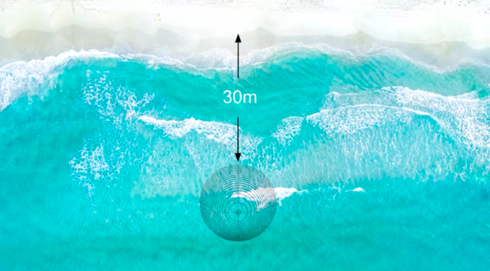

- **file**: `07_scale/shapes/bunbury-airwave/src/img5_reef-top-view.png`
- **kind**: design_drawing
- **shows**: Plan-view concept graphic: a circular bladder with concentric seam rings drawn over a stock beach aerial, an arrow labelled '30m' (not to scale).
- **structure visible**: True
- **state shown**: design (concept graphic)
- **image date**: 2019-09-10 (upload timestamp ?v=1568074661 = 00:17 UTC; pre-install concept)
- **citation**: Unofficial Networks (2019), via Raised Water Research. ReefTopView.png [plan-view concept graphic] on: Bunbury Airwave [spot page]. https://raisedwaterresearch.com/spot/artificial-reef/australia/western-australia/bunbury-airwave/ (also /progress-update-on-the-bunbury-airwave/). Image file https://raisedwaterresearch.com/wp-content/uploads/2019/09/ReefTopView.png. Accessed 2026-10-05.
- **image URL**: https://raisedwaterresearch.com/wp-content/uploads/2019/09/ReefTopView.png
- **source page**: https://raisedwaterresearch.com/spot/artificial-reef/australia/western-australia/bunbury-airwave/
- **page / figure**: gallery image (not to scale)
- **credit**: 'Image: Unofficial Networks' (RWR profile-page caption)
- **licence**: not stated; Raised Water Research / Waveco copyright assumed - NOT cleared
- **retrieved**: 2026-10-05
- **used for**: cross_check
- **How used for the model**: Cross-check of the circular planform (outline within shape tolerance, shape.json source img5); the '30m' label is not a measured distance.
- **3D check pending**: no - none: already used as planform cross-check
- **annotated / overlay files**: `07_scale/shapes/bunbury-airwave/overlays/img5.png`
- **linked records**: 07_scale/shapes/bunbury-airwave/sources.md img5; 07_scale/shapes/bunbury-airwave/shape.json sources[img5]
- **size**: 1.20 MB, 1433x794 px
- **sha256**: 6e2320a1d6e6558b75f679e1493bc9a6494a8c3bdcc71e9cde564d3c492cf02f
- **rights**: Private research copy; reuse rights to be checked before any public release.
- **display in HTML**: True
- **added by**: image-registry backfill, 2026-10-06

## bunbury-airwave-img-11 - Esri World Imagery at the reef card's stated coordinates (-33.31, 115.64), zoom 17

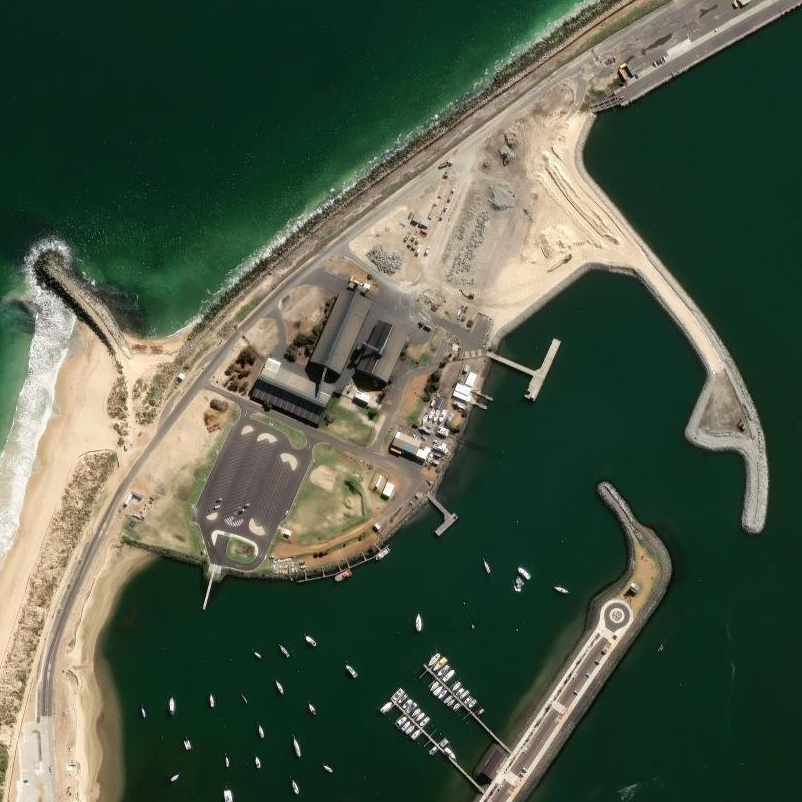

- **file**: `07_scale/shapes/bunbury-airwave/src/sat_card_coords.png`
- **kind**: satellite
- **shows**: Bunbury boat-harbour groyne / Koombana Bay, about 2.2 km NE of the real site: shows the card coordinates are wrong.
- **structure visible**: False
- **state shown**: removed (reef existed about one week in Dec 2019)
- **image date**: 2025-08-30
- **citation**: Esri, Maxar, Earthstar Geographics, and the GIS User Community (2025). World Imagery (current layer), image captured 2025-08-30. Esri World Imagery tile service, https://server.arcgisonline.com/ArcGIS/rest/services/World_Imagery/MapServer. Accessed 2026-10-04.
- **image URL**: https://server.arcgisonline.com/ArcGIS/rest/services/World_Imagery/MapServer/tile/{z}/{y}/{x}
- **source page**: Esri World Imagery (identify DATE field)
- **page / figure**: Esri World Imagery at the reef card's stated coordinates (-33.31, 115.64), zoom 17
- **credit**: Esri, Maxar, Earthstar Geographics, and the GIS User Community
- **licence**: Esri/Maxar imagery terms (not an open licence); private research copy only
- **retrieved**: 2026-10-04
- **used for**: context
- **How used for the model**: Context: proves the card lat/lon are wrong (not the reef site); not used for the model.
- **3D check pending**: no - none: image already used as a model source or is context only
- **linked records**: 07_scale/shapes/bunbury-airwave/sources.md sat1; 07_scale/shapes/bunbury-airwave/shape.json sources
- **size**: 0.67 MB, 802x802 px
- **sha256**: c22beb265b011ac693a2a768bf9fc959571e83ca9fe52270f24ba4be7103a526
- **rights**: Private research copy; reuse rights to be checked before any public release.
- **display in HTML**: True
- **added by**: image-registry backfill, 2026-10-06

## bunbury-airwave-img-12 - Esri World Imagery, Bunbury Back Beach SLSC (-33.327276, 115.629902), zoom 18, r = 400 m

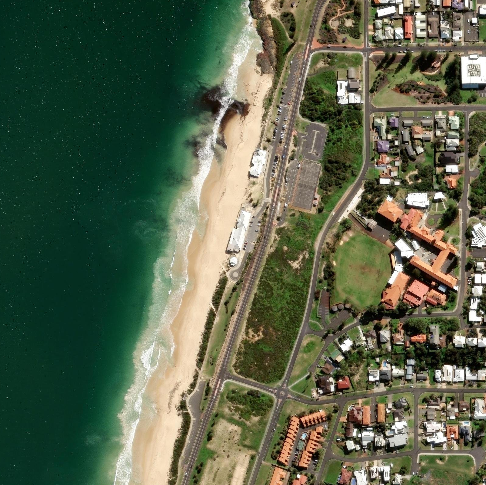

- **file**: `07_scale/shapes/bunbury-airwave/src/sat_backbeach_current.png`
- **kind**: satellite
- **shows**: Back Beach and the surf life saving club; no trace of the bladder (removed Dec 2019).
- **structure visible**: False
- **state shown**: removed (reef existed about one week in Dec 2019)
- **image date**: 2025-08-30
- **citation**: Esri, Maxar, Earthstar Geographics, and the GIS User Community (2025). World Imagery (current layer), image captured 2025-08-30. Esri World Imagery tile service, https://server.arcgisonline.com/ArcGIS/rest/services/World_Imagery/MapServer. Accessed 2026-10-04.
- **image URL**: https://server.arcgisonline.com/ArcGIS/rest/services/World_Imagery/MapServer/tile/{z}/{y}/{x}
- **source page**: Esri World Imagery (identify DATE field)
- **page / figure**: Esri World Imagery, Bunbury Back Beach SLSC (-33.327276, 115.629902), zoom 18, r = 400 m
- **credit**: Esri, Maxar, Earthstar Geographics, and the GIS User Community
- **licence**: Esri/Maxar imagery terms (not an open licence); private research copy only
- **retrieved**: 2026-10-04
- **used for**: context
- **How used for the model**: Used to estimate the approximate centre and as the backdrop of annotated/lidar_contours_on_satellite.png; frame for the 0 m AHD contour fit (model.js S_lidar / shoreline).
- **3D check pending**: no - none: image already used as a model source or is context only
- **annotated / overlay files**: `07_scale/shapes/bunbury-airwave/3d/annotated/lidar_contours_on_satellite.png`
- **linked records**: 07_scale/shapes/bunbury-airwave/sources.md sat2; 07_scale/shapes/bunbury-airwave/shape.json sources
- **size**: 3.52 MB, 1604x1603 px
- **sha256**: 0c32db3c89ea7a0afe48e8941ccedf7c018ade27ad5d92537971c749a12d6752
- **rights**: Private research copy; reuse rights to be checked before any public release.
- **display in HTML**: True
- **added by**: image-registry backfill, 2026-10-06

## bunbury-airwave-img-13 - Garmin Navionics viewer, Bunbury Back Beach: Map Options panel

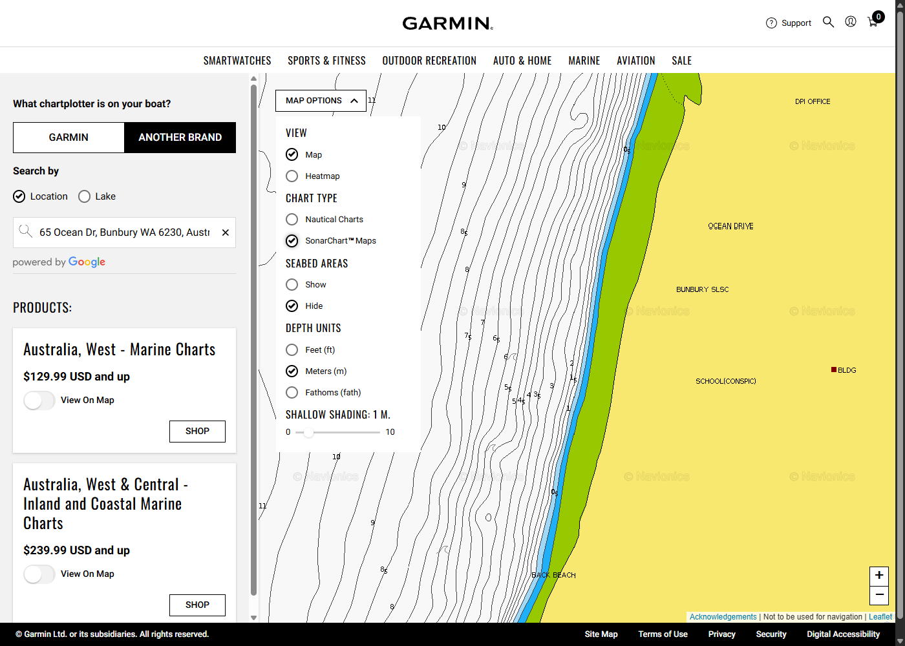

- **file**: `07_scale/shapes/bunbury-airwave/3d/src/navionics/app_options_sonarchart_meters.png`
- **kind**: chart_screenshot
- **shows**: Map Options panel: View = Map, chart type SonarChart/Nautical, Seabed areas hidden, Depth units metres, shallow shading 1 m.
- **structure visible**: False
- **state shown**: seabed only (no structure: bladder removed Dec 2019)
- **image date**: chart data dates not shown by the viewer; screenshot 2026-10-05
- **citation**: Garmin Ltd / Navionics (2026). Marine Maps viewer (Map Options panel), depths in metres, shallow shading 1 m, centred on the Back Beach site; Garmin | Marine Maps ('Not to be used for navigation'). https://maps.garmin.com/en-US/marine (webapp.navionics.com redirects here). Screenshot taken 2026-10-05 11:56 UTC. Accessed 2026-10-05.
- **image URL**: https://maps.garmin.com/en-US/marine
- **source page**: https://maps.garmin.com/en-US/marine
- **page / figure**: Map Options panel; 1400x900
- **credit**: Garmin Navionics charts and SonarChart (c) Navionics / Garmin Ltd; screenshot by this project (own headless Chrome)
- **licence**: Garmin/Navionics terms ('Not to be used for navigation'); no open licence; private research copy, reuse NOT cleared
- **retrieved**: 2026-10-05
- **used for**: context
- **How used for the model**: Records the viewer settings used for the Navionics reads (units metres, shallow shading 1 m); not a reef image.
- **3D check pending**: no - none: settings/context screenshot
- **linked records**: 07_scale/shapes/bunbury-airwave/3d/SOURCES_3D.md (Step 6a - Navionics); 07_scale/shapes/bunbury-airwave/3d/src/navionics/session_state.json; 07_scale/shapes/bunbury-airwave/3d/model.js (Navionics provenance rows)
- **size**: 0.13 MB, 1400x1000 px
- **sha256**: 0c1c82c5339bf2c80045f14584bf71fa1fa7eca77b0599b683f4ec67b6b7e244
- **rights**: Private research copy; reuse rights to be checked before any public release.
- **display in HTML**: True
- **added by**: image-registry backfill, 2026-10-06

## bunbury-airwave-img-14 - Garmin Navionics viewer, Bunbury Back Beach: SonarChart, zoom 17

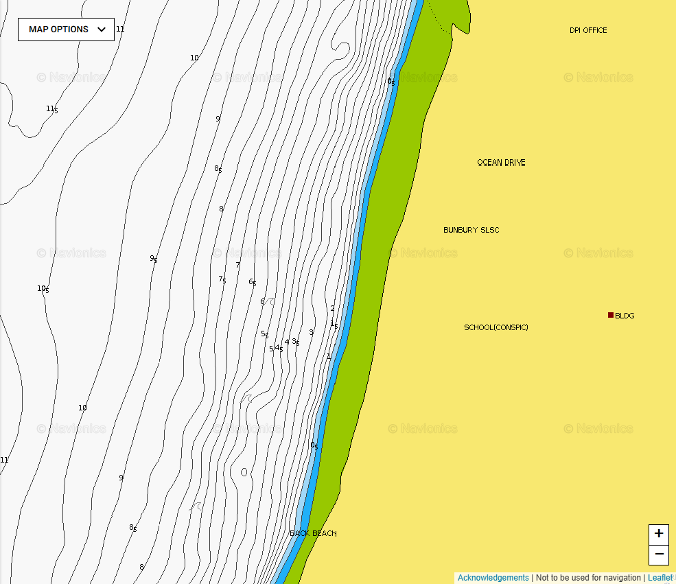

- **file**: `07_scale/shapes/bunbury-airwave/3d/src/navionics/sonar_m_z17_dpr1.png`
- **kind**: chart_screenshot
- **shows**: SonarChart depth contours at zoom 17 around the Back Beach site (metres).
- **structure visible**: False
- **state shown**: seabed only (no structure: bladder removed Dec 2019)
- **image date**: chart data dates not shown by the viewer; screenshot 2026-10-05
- **citation**: Garmin Ltd / Navionics (2026). Marine Maps viewer (SonarChart, zoom 17), depths in metres, shallow shading 1 m, centred on the Back Beach site; Garmin | Marine Maps ('Not to be used for navigation'). https://maps.garmin.com/en-US/marine (webapp.navionics.com redirects here). Screenshot taken 2026-10-05 11:56 UTC. Accessed 2026-10-05.
- **image URL**: https://maps.garmin.com/en-US/marine
- **source page**: https://maps.garmin.com/en-US/marine
- **page / figure**: SonarChart, zoom 17; dpr 1
- **credit**: Garmin Navionics charts and SonarChart (c) Navionics / Garmin Ltd; screenshot by this project (own headless Chrome)
- **licence**: Garmin/Navionics terms ('Not to be used for navigation'); no open licence; private research copy, reuse NOT cleared
- **retrieved**: 2026-10-05
- **used for**: context
- **How used for the model**: Wider SonarChart view while locating the site; the contours were measured on the zoom 18 shot.
- **3D check pending**: no - none: settings/context screenshot
- **linked records**: 07_scale/shapes/bunbury-airwave/3d/SOURCES_3D.md (Step 6a - Navionics); 07_scale/shapes/bunbury-airwave/3d/src/navionics/session_state.json; 07_scale/shapes/bunbury-airwave/3d/model.js (Navionics provenance rows)
- **size**: 0.04 MB, 985x851 px
- **sha256**: f68c265ed9b8a9aad0cf8bdafd85e8a8ab35f602449088ec703d5caacc341aa0
- **rights**: Private research copy; reuse rights to be checked before any public release.
- **display in HTML**: True
- **added by**: image-registry backfill, 2026-10-06

## bunbury-airwave-img-15 - Garmin Navionics viewer, Bunbury Back Beach: SonarChart, zoom 18

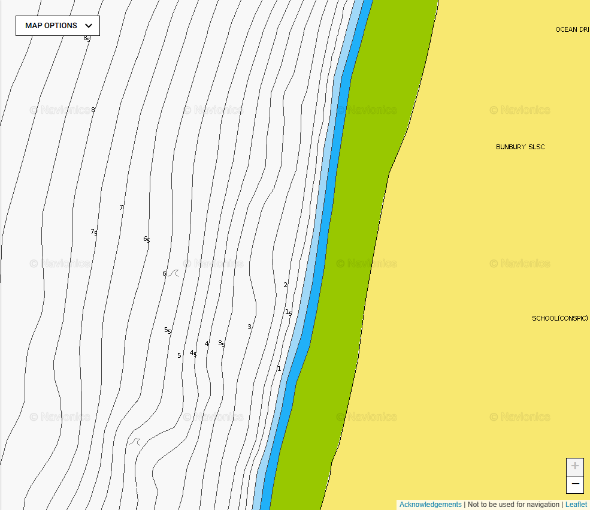

- **file**: `07_scale/shapes/bunbury-airwave/3d/src/navionics/sonar_m_z18_dpr1.png`
- **kind**: chart_screenshot
- **shows**: SonarChart contours at zoom 18 (985 x 851 px, 0.4994 m/px).
- **structure visible**: False
- **state shown**: seabed only (no structure: bladder removed Dec 2019)
- **image date**: chart data dates not shown by the viewer; screenshot 2026-10-05
- **citation**: Garmin Ltd / Navionics (2026). Marine Maps viewer (SonarChart, zoom 18), depths in metres, shallow shading 1 m, centred on the Back Beach site; Garmin | Marine Maps ('Not to be used for navigation'). https://maps.garmin.com/en-US/marine (webapp.navionics.com redirects here). Screenshot taken 2026-10-05 11:56 UTC. Accessed 2026-10-05.
- **image URL**: https://maps.garmin.com/en-US/marine
- **source page**: https://maps.garmin.com/en-US/marine
- **page / figure**: SonarChart, zoom 18; 985 x 851 px, 0.4994 m/px
- **credit**: Garmin Navionics charts and SonarChart (c) Navionics / Garmin Ltd; screenshot by this project (own headless Chrome)
- **licence**: Garmin/Navionics terms ('Not to be used for navigation'); no open licence; private research copy, reuse NOT cleared
- **retrieved**: 2026-10-05
- **used for**: context
- **How used for the model**: Lower-resolution twin of the dpr2 capture; the reads were made on sonar_m_z18_dpr2.
- **3D check pending**: no - none: settings/context screenshot
- **linked records**: 07_scale/shapes/bunbury-airwave/3d/SOURCES_3D.md (Step 6a - Navionics); 07_scale/shapes/bunbury-airwave/3d/src/navionics/session_state.json; 07_scale/shapes/bunbury-airwave/3d/model.js (Navionics provenance rows)
- **size**: 0.04 MB, 985x851 px
- **sha256**: cd4ec38c11d71ab8557b061318a2c7d1debf666a36a53cba1644ba62ab091e8e
- **rights**: Private research copy; reuse rights to be checked before any public release.
- **display in HTML**: True
- **added by**: image-registry backfill, 2026-10-06

## bunbury-airwave-img-16 - Garmin Navionics viewer, Bunbury Back Beach: SonarChart, zoom 18, device-pixel-ratio 2

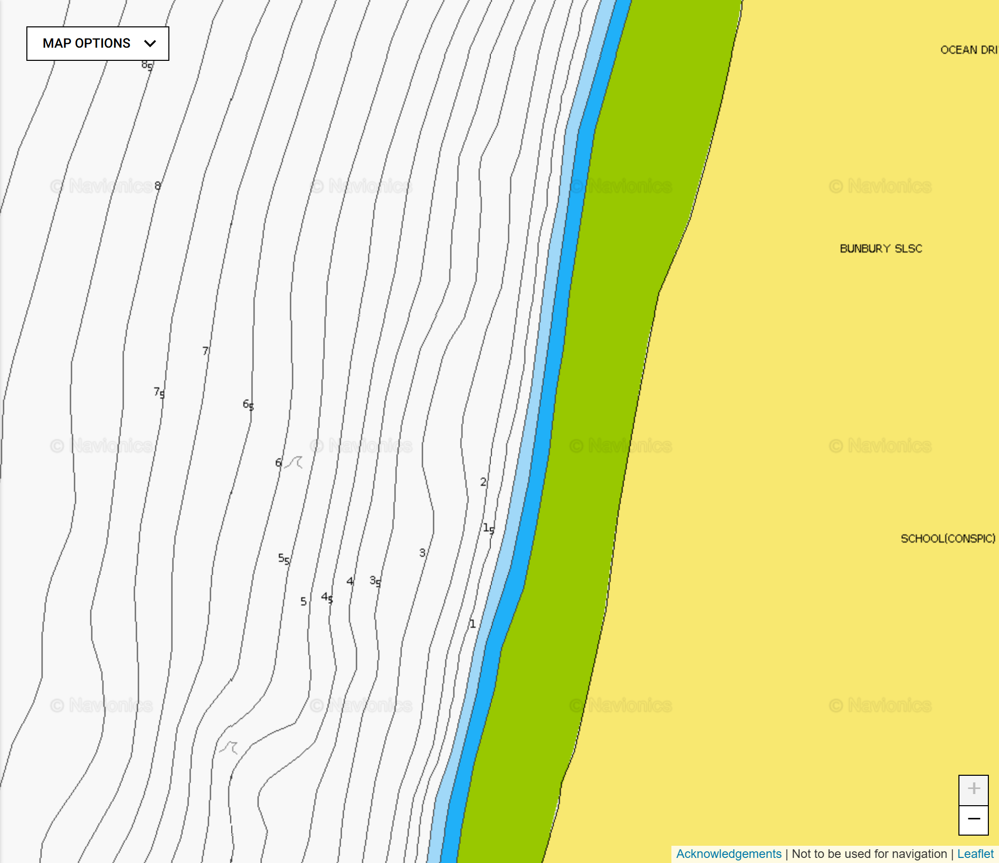

- **file**: `07_scale/shapes/bunbury-airwave/3d/src/navionics/sonar_m_z18_dpr2.png`
- **kind**: chart_screenshot
- **shows**: SonarChart contours at zoom 18 (1970 x 1702 px, 0.2497 m/px): 0 m line and 0.5 m contours running parallel to the shore; no closed ring at the reef site.
- **structure visible**: False
- **state shown**: seabed only (no structure: bladder removed Dec 2019)
- **image date**: chart data dates not shown by the viewer; screenshot 2026-10-05
- **citation**: Garmin Ltd / Navionics (2026). Marine Maps viewer (SonarChart, zoom 18, device-pixel-ratio 2), depths in metres, shallow shading 1 m, centred on the Back Beach site; Garmin | Marine Maps ('Not to be used for navigation'). https://maps.garmin.com/en-US/marine (webapp.navionics.com redirects here). Screenshot taken 2026-10-05 11:56 UTC. Accessed 2026-10-05.
- **image URL**: https://maps.garmin.com/en-US/marine
- **source page**: https://maps.garmin.com/en-US/marine
- **page / figure**: SonarChart, zoom 18, device-pixel-ratio 2; 1970 x 1702 px, 0.2497 m/px
- **credit**: Garmin Navionics charts and SonarChart (c) Navionics / Garmin Ltd; screenshot by this project (own headless Chrome)
- **licence**: Garmin/Navionics terms ('Not to be used for navigation'); no open licence; private research copy, reuse NOT cleared
- **retrieved**: 2026-10-05
- **used for**: 3d_seabed; 3d_tides; cross_check
- **How used for the model**: 9 shore-normal transects (offsets -120..+120 m) counted 17-18 contour lines each (0 m line = green/blue edge, then 0.5 m lines); crossings placed in the model frame and compared with the 2009 lidar: datum RMS test LAT 0.32 m (best), MLLW 0.67, AHD 0.87, MSL 0.97 (n=111). Used as the independent seabed check (model.js Navionics rows; METHODS_3D 3.6).
- **3D check pending**: no - none: seabed cross-check already done
- **annotated / overlay files**: `07_scale/shapes/bunbury-airwave/3d/annotated/N1_navionics_sonarchart_contours_transects.png`; `07_scale/shapes/bunbury-airwave/3d/annotated/N4_navionics_reef_site_zoom_no_structure.png`
- **linked records**: 07_scale/shapes/bunbury-airwave/3d/SOURCES_3D.md (Step 6a - Navionics); 07_scale/shapes/bunbury-airwave/3d/src/navionics/session_state.json; 07_scale/shapes/bunbury-airwave/3d/model.js (Navionics provenance rows)
- **size**: 0.15 MB, 1970x1702 px
- **sha256**: bbca2f84b674afb70a2b8fd8d61a0c4953f51b111cbdfae2143c33e7c7cde0ee
- **rights**: Private research copy; reuse rights to be checked before any public release.
- **display in HTML**: True
- **added by**: image-registry backfill, 2026-10-06

## bunbury-airwave-img-17 - Garmin Navionics viewer, Bunbury Back Beach: Nautical Chart, zoom 17

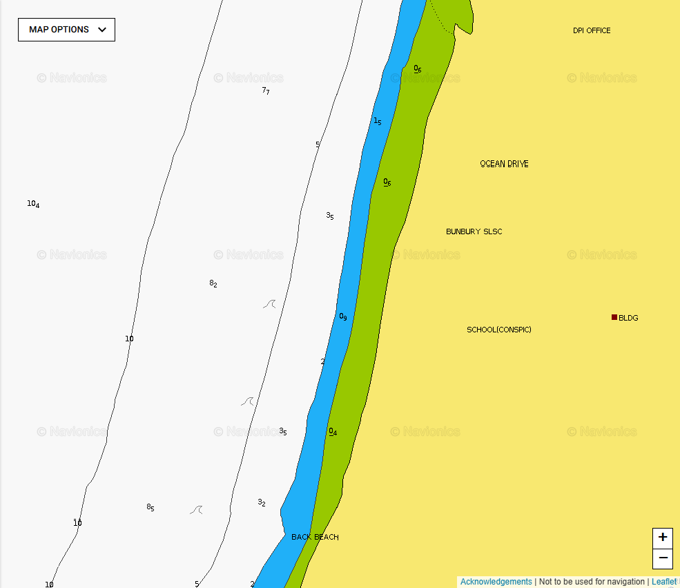

- **file**: `07_scale/shapes/bunbury-airwave/3d/src/navionics/nautical_m_z17_dpr1.png`
- **kind**: chart_screenshot
- **shows**: Nautical Chart soundings and contours at zoom 17 around Back Beach.
- **structure visible**: False
- **state shown**: seabed only (no structure: bladder removed Dec 2019)
- **image date**: chart data dates not shown by the viewer; screenshot 2026-10-05
- **citation**: Garmin Ltd / Navionics (2026). Marine Maps viewer (Nautical Chart, zoom 17), depths in metres, shallow shading 1 m, centred on the Back Beach site; Garmin | Marine Maps ('Not to be used for navigation'). https://maps.garmin.com/en-US/marine (webapp.navionics.com redirects here). Screenshot taken 2026-10-05 11:56 UTC. Accessed 2026-10-05.
- **image URL**: https://maps.garmin.com/en-US/marine
- **source page**: https://maps.garmin.com/en-US/marine
- **page / figure**: Nautical Chart, zoom 17; dpr 1
- **credit**: Garmin Navionics charts and SonarChart (c) Navionics / Garmin Ltd; screenshot by this project (own headless Chrome)
- **licence**: Garmin/Navionics terms ('Not to be used for navigation'); no open licence; private research copy, reuse NOT cleared
- **retrieved**: 2026-10-05
- **used for**: 3d_seabed; cross_check
- **How used for the model**: Soundings and 2/5 m contours read for the datum test (annotated N3).
- **3D check pending**: no - none: seabed cross-check already done
- **annotated / overlay files**: `07_scale/shapes/bunbury-airwave/3d/annotated/N3_navionics_nautical_soundings.png`
- **linked records**: 07_scale/shapes/bunbury-airwave/3d/SOURCES_3D.md (Step 6a - Navionics); 07_scale/shapes/bunbury-airwave/3d/src/navionics/session_state.json; 07_scale/shapes/bunbury-airwave/3d/model.js (Navionics provenance rows)
- **size**: 0.03 MB, 985x851 px
- **sha256**: 583c896d1ffa12bce0d0c2ecc39c907fbc630d8fc5d806804bab39af28856ee0
- **rights**: Private research copy; reuse rights to be checked before any public release.
- **display in HTML**: True
- **added by**: image-registry backfill, 2026-10-06

## bunbury-airwave-img-18 - Garmin Navionics viewer, Bunbury Back Beach: Nautical Chart, zoom 18, device-pixel-ratio 2

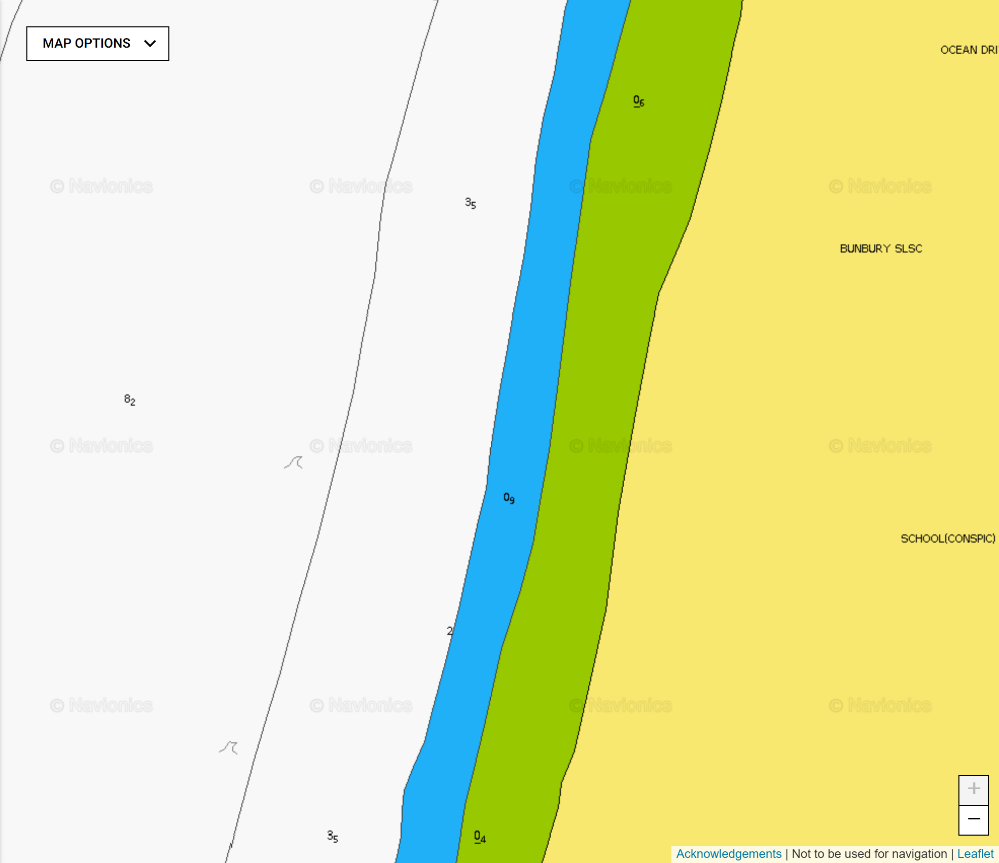

- **file**: `07_scale/shapes/bunbury-airwave/3d/src/navionics/nautical_m_z18_dpr2.png`
- **kind**: chart_screenshot
- **shows**: Nautical Chart soundings and contours at zoom 18 near the site.
- **structure visible**: False
- **state shown**: seabed only (no structure: bladder removed Dec 2019)
- **image date**: chart data dates not shown by the viewer; screenshot 2026-10-05
- **citation**: Garmin Ltd / Navionics (2026). Marine Maps viewer (Nautical Chart, zoom 18, device-pixel-ratio 2), depths in metres, shallow shading 1 m, centred on the Back Beach site; Garmin | Marine Maps ('Not to be used for navigation'). https://maps.garmin.com/en-US/marine (webapp.navionics.com redirects here). Screenshot taken 2026-10-05 11:56 UTC. Accessed 2026-10-05.
- **image URL**: https://maps.garmin.com/en-US/marine
- **source page**: https://maps.garmin.com/en-US/marine
- **page / figure**: Nautical Chart, zoom 18, device-pixel-ratio 2; dpr 2
- **credit**: Garmin Navionics charts and SonarChart (c) Navionics / Garmin Ltd; screenshot by this project (own headless Chrome)
- **licence**: Garmin/Navionics terms ('Not to be used for navigation'); no open licence; private research copy, reuse NOT cleared
- **retrieved**: 2026-10-05
- **used for**: 3d_seabed; cross_check
- **How used for the model**: Soundings and 2/5 m contours with implied datum read for the Navionics-vs-lidar check (annotated N3).
- **3D check pending**: no - none: seabed cross-check already done
- **annotated / overlay files**: `07_scale/shapes/bunbury-airwave/3d/annotated/N3_navionics_nautical_soundings.png`
- **linked records**: 07_scale/shapes/bunbury-airwave/3d/SOURCES_3D.md (Step 6a - Navionics); 07_scale/shapes/bunbury-airwave/3d/src/navionics/session_state.json; 07_scale/shapes/bunbury-airwave/3d/model.js (Navionics provenance rows)
- **size**: 0.11 MB, 1970x1702 px
- **sha256**: 0a74b75ab1e1e48ec558073a6c9493f2afe91f17a31fdbeb2eff098c84883640
- **rights**: Private research copy; reuse rights to be checked before any public release.
- **display in HTML**: True
- **added by**: image-registry backfill, 2026-10-06

## bunbury-airwave-img-19 - Individual 10 m lidar cells around the reef, rotated into the model frame (m AHD)

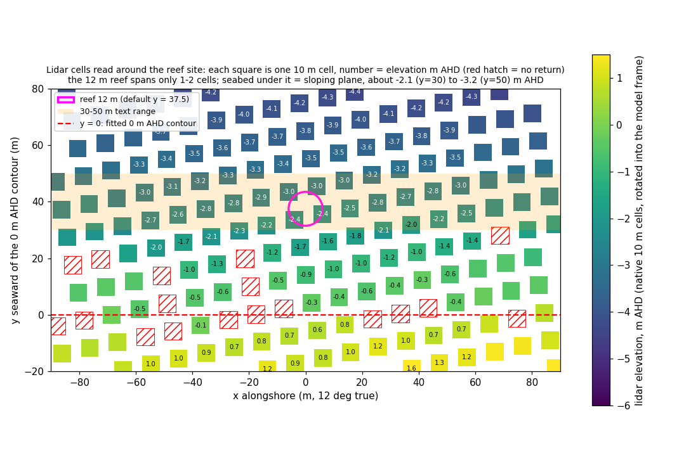

- **file**: `07_scale/shapes/bunbury-airwave/3d/annotated/lidar_cells_at_reef.png`
- **kind**: survey_plot
- **shows**: The 10 m lidar cells around the 12 m reef circle, each labelled with its elevation (m AHD); red hatch = no return (surf-zone gaps). Cells under/next to the circle are -2.4 .. -3.0 m AHD.
- **structure visible**: False
- **state shown**: seabed 2009 (no structure)
- **image date**: lidar surveyed 2009 (10 years before the install); figure 2026-10-05
- **citation**: This project (2026-10-05), figure from: Western Australia Department of Transport (2009). Two Rocks - Naturaliste Lidar 2009 (airborne lidar bathymetry, 10 m grid, AHD, GDA94 / MGA zone 50), file BU2009TRBS_Lidar.bag (67,442,256 bytes), survey index https://services6.arcgis.com/67Ks15nDmWoIbK8b/arcgis/rest/services/Survey_index_linkedbagfiles/FeatureServer/0, data https://dotazprdauegisextpubst01.blob.core.windows.net/transport-wa-public/bathymetry/rasters/BU2009TRBS_Lidar.bag. Accessed 2026-10-05.
- **image URL**: https://dotazprdauegisextpubst01.blob.core.windows.net/transport-wa-public/bathymetry/rasters/BU2009TRBS_Lidar.bag
- **source page**: https://services6.arcgis.com/67Ks15nDmWoIbK8b/arcgis/rest/services/Survey_index_linkedbagfiles/FeatureServer/0
- **page / figure**: build_3d_lidar.py output
- **credit**: Dept of Transport WA (data; 'Approved for Public Release', 'Not to be used for navigation'); figure by this project
- **licence**: DoT data marked 'Approved for Public Release' (no open licence named in the BAG metadata); figure is a project product
- **retrieved**: 2026-10-05
- **used for**: 3d_seabed
- **How used for the model**: Reads off the seabed under the reef: the model seabed is the 5 m resample of this lidar (61 x 49 nodes, 286 gap-filled); the reef spans only 1-2 cells (SOURCES_3D Step 2 caption 2; model.js seabed).
- **3D check pending**: no - none: already used
- **linked records**: 07_scale/shapes/bunbury-airwave/3d/SOURCES_3D.md (Step 2 caption 2); 07_scale/shapes/bunbury-airwave/3d/model.js (seabed, S_lidar)
- **size**: 0.09 MB, 1100x726 px
- **sha256**: 2f0c2a0991f095d5d9baa214f820938e1c0376a8415f0cfdbbc95c872a99c3f7
- **rights**: Private research copy; reuse rights to be checked before any public release.
- **display in HTML**: True
- **added by**: image-registry backfill, 2026-10-06

## bunbury-airwave-img-20 - Alongshore-median seabed profile (2009 lidar) with tide planes, text-range band and model reef cross-section

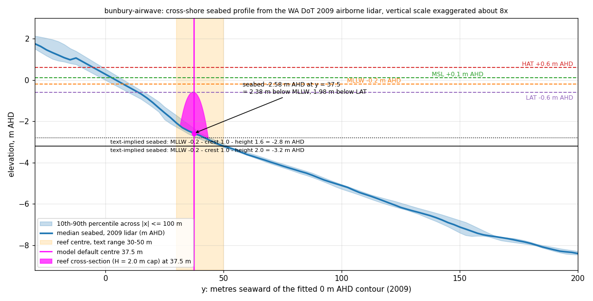

- **file**: `07_scale/shapes/bunbury-airwave/3d/annotated/seabed_profile_with_tides.png`
- **kind**: cross_section
- **shows**: Median depth profile (|x| <= 100 m, 10-90th percentile band) with HAT / MSL / MLLW / LAT lines, the 30-50 m offshore text range, the model reef cross-section (H = 2.0 m cap) and the seabed depth implied by the text (-2.8 / -3.2 m AHD).
- **structure visible**: False
- **state shown**: seabed 2009 + model section
- **image date**: lidar 2009; figure 2026-10-05
- **citation**: This project (2026-10-05), figure from: Western Australia Department of Transport (2009). Two Rocks - Naturaliste Lidar 2009 (airborne lidar bathymetry, 10 m grid, AHD, GDA94 / MGA zone 50), file BU2009TRBS_Lidar.bag (67,442,256 bytes), survey index https://services6.arcgis.com/67Ks15nDmWoIbK8b/arcgis/rest/services/Survey_index_linkedbagfiles/FeatureServer/0, data https://dotazprdauegisextpubst01.blob.core.windows.net/transport-wa-public/bathymetry/rasters/BU2009TRBS_Lidar.bag. Accessed 2026-10-05. Tide planes: GHD (2021) Tidal Inundation Monitoring and Modelling Report, App. B, Turkey Point Access Road approvals, Table 1 (https://www.epa.wa.gov.au/sites/default/files/PER_documentation2/App%20B%20-%20Tidal%20innudation%20report.pdf).
- **image URL**: https://dotazprdauegisextpubst01.blob.core.windows.net/transport-wa-public/bathymetry/rasters/BU2009TRBS_Lidar.bag
- **source page**: https://www.epa.wa.gov.au/sites/default/files/PER_documentation2/App%20B%20-%20Tidal%20innudation%20report.pdf
- **page / figure**: build_3d_lidar.py output
- **credit**: Dept of Transport WA (data; 'Approved for Public Release', 'Not to be used for navigation'); figure by this project; tide planes GHD (2021)
- **licence**: project figure; data as above
- **retrieved**: 2026-10-05
- **used for**: 3d_seabed; 3d_tides; 3d_height_slopes
- **How used for the model**: Shows where the lidar profile equals the text-implied depth (-3.2 m AHD at y = 49.9 m, 45.8 m seaward of MLLW) = the basis for the 30-50 m offshore range and the crest-below-MLLW readout (SOURCES_3D Step 2 caption 3; model.js tides/seabed).
- **3D check pending**: no - none: already used
- **linked records**: 07_scale/shapes/bunbury-airwave/3d/SOURCES_3D.md (Step 2 caption 3); 07_scale/shapes/bunbury-airwave/3d/model.js
- **size**: 0.10 MB, 1210x616 px
- **sha256**: 3654aabfc16df63bc0d4551f9fb11f8b85fd31b462b2605e24f5a0158b5c420d
- **rights**: Private research copy; reuse rights to be checked before any public release.
- **display in HTML**: True
- **added by**: image-registry backfill, 2026-10-06

## bunbury-airwave-img-21 - Navionics-vs-lidar datum RMS test (profile and RMS bars for LAT / MLLW / AHD / MSL)

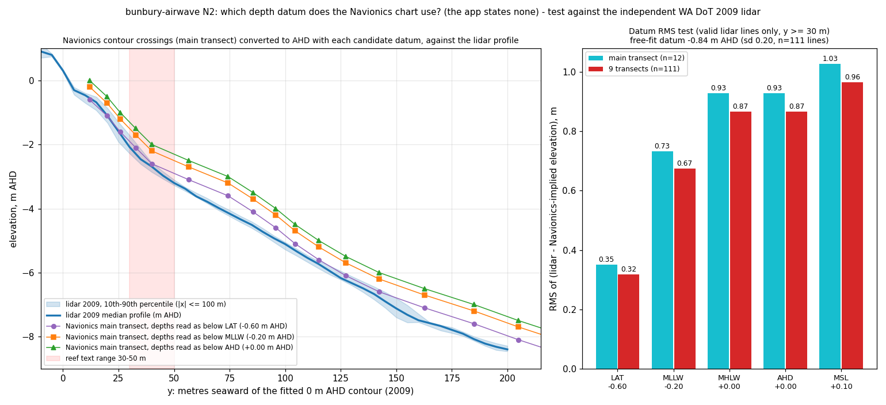

- **file**: `07_scale/shapes/bunbury-airwave/3d/annotated/N2_navionics_datum_rms_test.png`
- **kind**: diagram
- **shows**: Profile and RMS bars of lidar minus Navionics-implied elevation for four candidate datums: LAT 0.32 m, MLLW 0.67, AHD 0.87, MSL 0.97 (n=111).
- **structure visible**: False
- **state shown**: not applicable (analysis chart)
- **image date**: 2026-10-05
- **citation**: This project (2026-10-05), chart made from Navionics SonarChart screenshots (https://maps.garmin.com/en-US/marine, accessed 2026-10-05) and the WA DoT 2009 lidar (BU2009TRBS_Lidar.bag).
- **image URL**: https://maps.garmin.com/en-US/marine
- **source page**: https://maps.garmin.com/en-US/marine
- **page / figure**: nav_figures.py output
- **credit**: Chart by this project; data Garmin Navionics and WA DoT
- **licence**: project chart; underlying data as above
- **retrieved**: 2026-10-05
- **used for**: 3d_seabed; 3d_tides
- **How used for the model**: Result that the Navionics depths are referenced below LAT (chart datum), a 0.24 m residual inside the lidar vertical uncertainty; recorded in model.js Navionics rows and METHODS_3D 3.6.
- **3D check pending**: no - none: already used
- **linked records**: 07_scale/shapes/bunbury-airwave/3d/SOURCES_3D.md (Step 6a); 07_scale/shapes/bunbury-airwave/3d/model.js
- **size**: 0.16 MB, 1540x704 px
- **sha256**: 8e66f7835d882db5b08d90fba462d3031651d5cb2c12d55f57c650f9ed993fca
- **rights**: Private research copy; reuse rights to be checked before any public release.
- **display in HTML**: True
- **added by**: image-registry backfill, 2026-10-06
