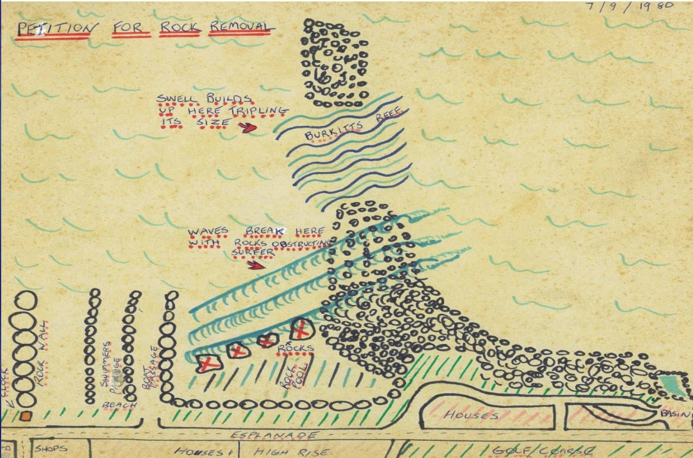
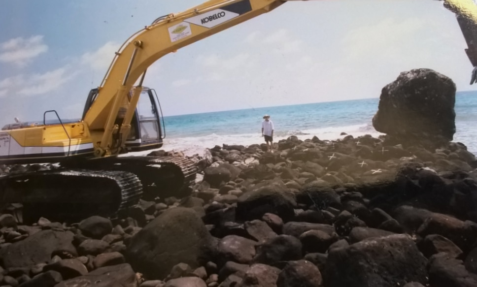
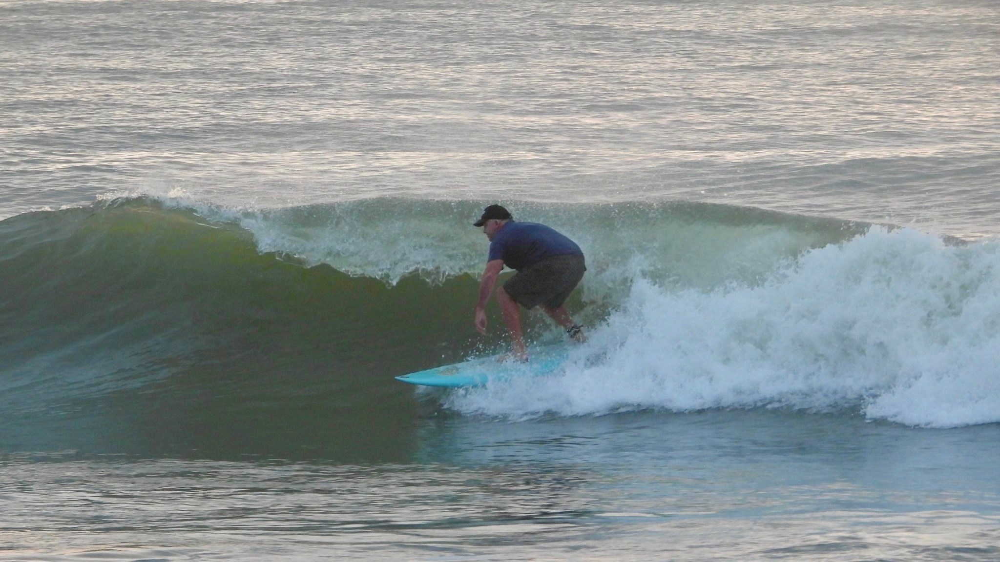
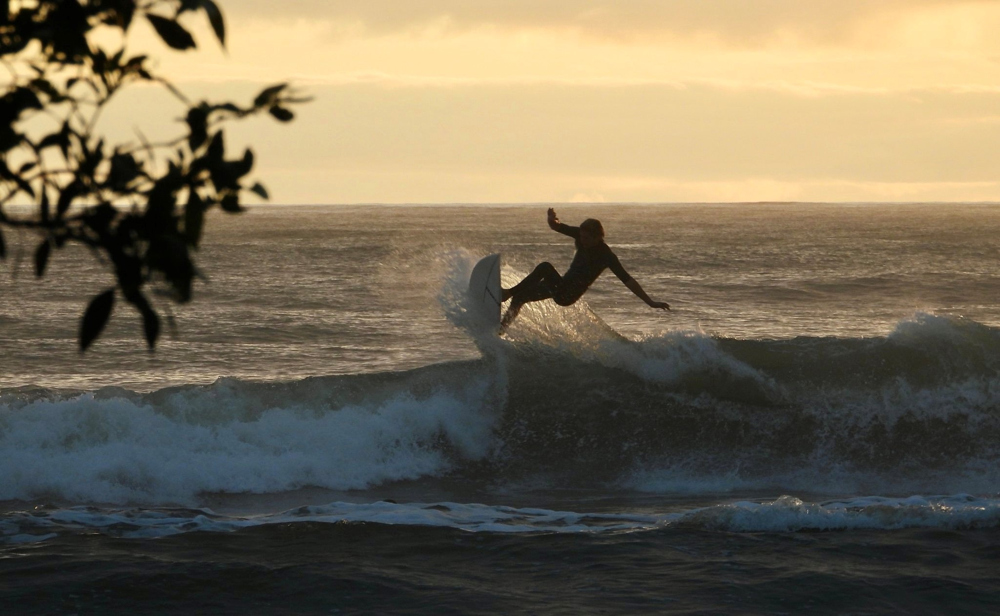
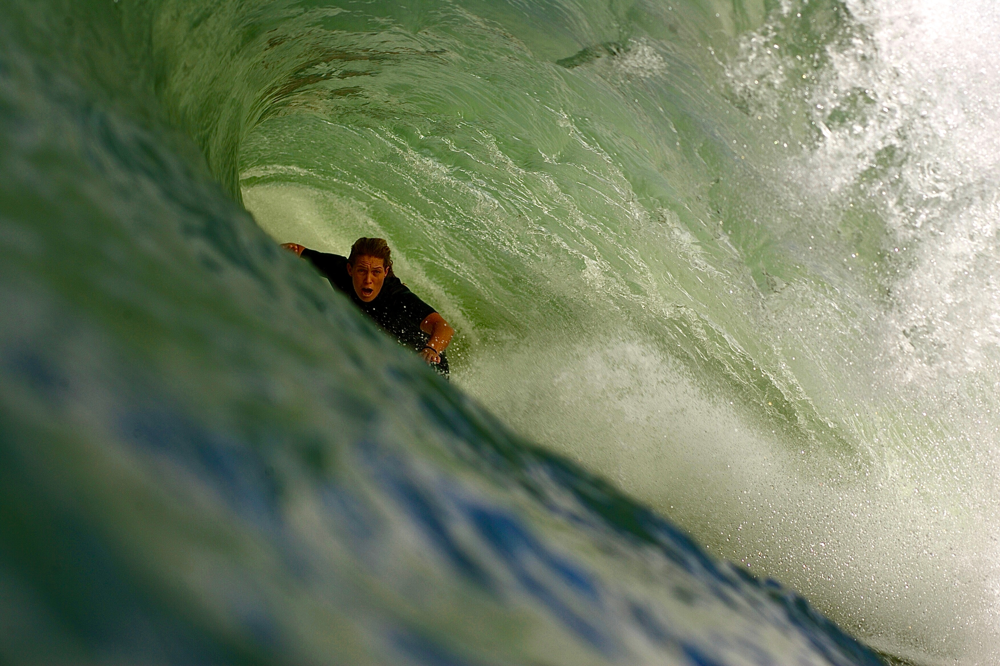
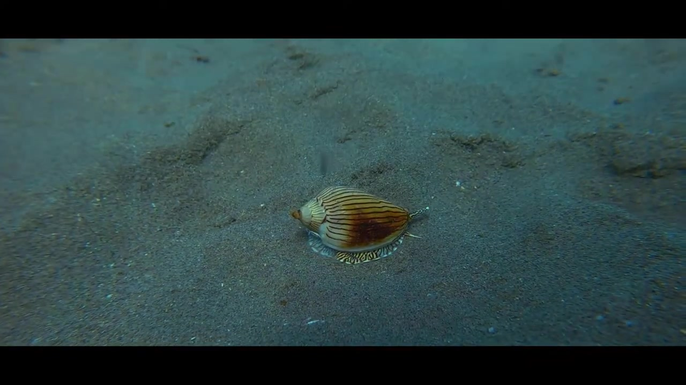
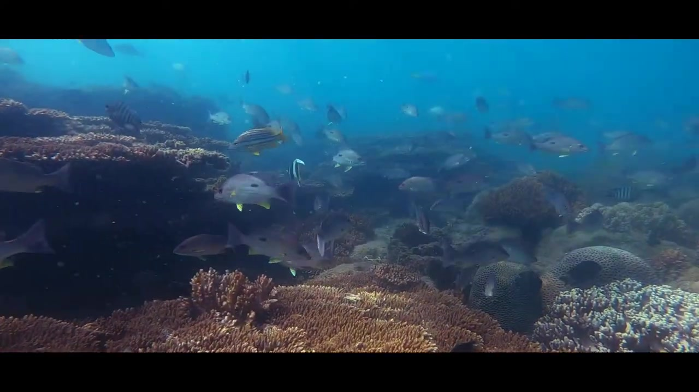
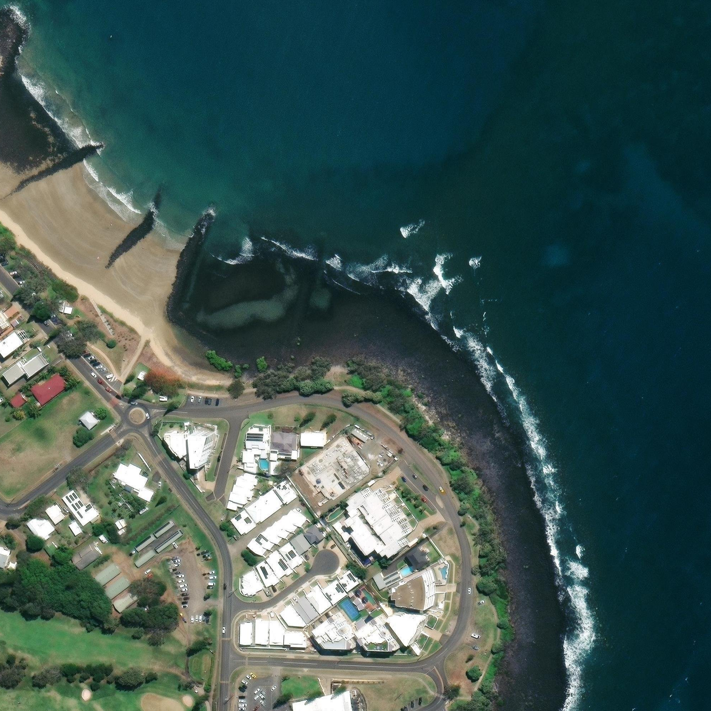

# Image registry - burkitts-reef-bargara

Source of truth: `images.json` in this folder (convention: `_agent_briefs/image_registry.md`; overview: `03_images/reefs/README.md`). This file is generated from it.

8 images registered, 8 with a file, 0 used for the model (any use other than context/not_used).

## burkitts-reef-bargara-img-01 - Greg Redgard's hand-drawn 'PETITION FOR ROCK REMOVAL' sketch, 7 Sept 1980 (via ABC)

- **file**: `03_images/reefs/burkitts-reef-bargara/burkitts-reef-bargara_petition-sketch-1980.jpg`
- **kind**: design_drawing
- **shows**: Hand-drawn coloured sketch headed 'PETITION FOR ROCK REMOVAL', plan view of the headland labelled BURKITTS REEF with notes 'swell builds up here tripling its size' and 'waves break here with rocks obstructing surfer', rocks, houses and the esplanade.
- **structure visible**: True
- **state shown**: pre-construction (1980 proposal)
- **image date**: 1980-09-07 (dated 7/9/80 on the sketch; day/month order assumed Australian)
- **citation**: Supplied: Greg Redgard, via ABC News (photo; article published 2024-01-28 by Sarah Howells). In: How a sugarcane cutter and his mates created a world-first DIY surf break at Burkitts Reef, Bargara. ABC News, https://www.abc.net.au/news/2024-01-28/diy-surf-break-built-by-mates-at-burkitts-reef-bargara/103387450 (caption 'Greg Redgard drew his first submission to council with his children's colouring pencils. (Supplied: Greg Redgard)'). Image file https://live-production.wcms.abc-cdn.net.au/a450bbac522bee4892941b966b64fea8 (full-size file; the card used a cropped/resized variant). Accessed 2026-10-06.
- **image URL**: https://live-production.wcms.abc-cdn.net.au/a450bbac522bee4892941b966b64fea8
- **source page**: https://www.abc.net.au/news/2024-01-28/diy-surf-break-built-by-mates-at-burkitts-reef-bargara/103387450
- **page / figure**: article photo 1 (caption: Greg Redgard drew his first submission to council with his children's colouring pencils. (Supplied: Greg Redgard))
- **credit**: Supplied: Greg Redgard, via ABC News
- **licence**: ABC News / 'Supplied' photo; no reuse licence found - link/research copy only, NOT cleared
- **retrieved**: 2026-10-06
- **used for**: context
- **How used for the model**: Page illustration of the original proposal (rocks to be removed to improve the wave). Hand sketch with no scale or north arrow, so not traced; it is evidence of the rock-field layout before reshaping.
- **3D check pending**: YES - Rock-field layout before the 1997 works (the black-circle boulder field, the surf line over it) vs any planform of the reshaped reef; qualitative only (values: planform)
- **linked records**: 02_research/reefs/burkitts-reef-bargara.json images[0]; 05_qa/reef/burkitts-reef-bargara_media_recheck.json images[0]
- **size**: 0.28 MB, 1171x775 px
- **sha256**: 4093fcb78a82b7c2f307db13653781e1c2ec307e10c2df2e910f40676ad608f9
- **rights**: Private research copy; reuse rights to be checked before any public release.
- **display in HTML**: True
- **added by**: image-registry backfill, 2026-10-06

## burkitts-reef-bargara-img-02 - Kobelco excavator and basalt boulders at the shoreline during the February 1997 works (via ABC)

- **file**: `03_images/reefs/burkitts-reef-bargara/burkitts-reef-bargara_excavator-boulders-1997.jpg`
- **kind**: photo
- **shows**: Yellow Kobelco hydraulic excavator on a basalt boulder shoreline, a man standing among the rocks near the waterline and white painted X marks on several boulders.
- **structure visible**: True
- **state shown**: under construction (February 1997)
- **image date**: 1997-02 (February 1997 construction)
- **citation**: Supplied: Greg Redgard, via ABC News (photo; article published 2024-01-28 by Sarah Howells). In: How a sugarcane cutter and his mates created a world-first DIY surf break at Burkitts Reef, Bargara. ABC News, https://www.abc.net.au/news/2024-01-28/diy-surf-break-built-by-mates-at-burkitts-reef-bargara/103387450 (caption 'Greg relocated tonnes of rocks using the rented excavator. (Supplied: Greg Redgard)'). Image file https://live-production.wcms.abc-cdn.net.au/a6112bacdcff48646a25f1539549b362 (full-size file; the card used a cropped/resized variant). Accessed 2026-10-06.
- **image URL**: https://live-production.wcms.abc-cdn.net.au/a6112bacdcff48646a25f1539549b362
- **source page**: https://www.abc.net.au/news/2024-01-28/diy-surf-break-built-by-mates-at-burkitts-reef-bargara/103387450
- **page / figure**: article photo 2 (caption: Greg relocated tonnes of rocks using the rented excavator. (Supplied: Greg Redgard))
- **credit**: Supplied: Greg Redgard, via ABC News
- **licence**: ABC News / 'Supplied' photo; no reuse licence found - link/research copy only, NOT cleared
- **retrieved**: 2026-10-06
- **used for**: context
- **How used for the model**: Page illustration of the construction method (boulders marked and relocated by an excavator at low tide); hero image recommended by the 2026-09-25 recheck. No dimension read.
- **3D check pending**: no - none: construction photo without scale
- **linked records**: 02_research/reefs/burkitts-reef-bargara.json images[1]; 05_qa/reef/burkitts-reef-bargara_media_recheck.json images[1]
- **size**: 0.09 MB, 968x583 px
- **sha256**: 30cddf30ae51304097dc9f893fc27526cca6cee19c1dd1c61e9192492059842a
- **rights**: Private research copy; reuse rights to be checked before any public release.
- **display in HTML**: True
- **added by**: image-registry backfill, 2026-10-06

## burkitts-reef-bargara-img-03 - Greg Redgard surfing 'Greg's Reef' (via ABC)

- **file**: `03_images/reefs/burkitts-reef-bargara/burkitts-reef-bargara_greg-surfing-gregs-reef.jpg`
- **kind**: photo
- **shows**: A surfer crouched on a board riding a clean peeling green wave; the rock reef is not visible (submerged).
- **structure visible**: False
- **state shown**: as-built, in service (date unknown)
- **image date**: unknown (before 2024-01-28)
- **citation**: Supplied: Jimmy Scaboo, via ABC News (photo; article published 2024-01-28 by Sarah Howells). In: How a sugarcane cutter and his mates created a world-first DIY surf break at Burkitts Reef, Bargara. ABC News, https://www.abc.net.au/news/2024-01-28/diy-surf-break-built-by-mates-at-burkitts-reef-bargara/103387450 (caption 'Greg surfing on "Greg's Reef" in Bargara, on the Bundaberg coast. (Supplied: Jimmy Scaboo)'). Image file https://live-production.wcms.abc-cdn.net.au/a315cc055a6a5d93d4c292c7857238d7 (full-size file; the card used a cropped/resized variant). Accessed 2026-10-06.
- **image URL**: https://live-production.wcms.abc-cdn.net.au/a315cc055a6a5d93d4c292c7857238d7
- **source page**: https://www.abc.net.au/news/2024-01-28/diy-surf-break-built-by-mates-at-burkitts-reef-bargara/103387450
- **page / figure**: article photo 3 (caption: Greg surfing on "Greg's Reef" in Bargara, on the Bundaberg coast. (Supplied: Jimmy Scaboo))
- **credit**: Supplied: Jimmy Scaboo, via ABC News
- **licence**: ABC News / 'Supplied' photo; no reuse licence found - link/research copy only, NOT cleared
- **retrieved**: 2026-10-06
- **used for**: context
- **How used for the model**: Page illustration of the surf effect. No dimension read.
- **3D check pending**: no - none: surf photo
- **linked records**: 02_research/reefs/burkitts-reef-bargara.json images[2]; 05_qa/reef/burkitts-reef-bargara_media_recheck.json images[2]
- **size**: 0.47 MB, 2048x1152 px
- **sha256**: 84e82710678fd387221c02acf2389fedc5e6abae687a0819c9d997a890ecac07
- **rights**: Private research copy; reuse rights to be checked before any public release.
- **display in HTML**: True
- **added by**: image-registry backfill, 2026-10-06

## burkitts-reef-bargara-img-04 - Surfer making a top turn at Burkitts Reef at sunset (via ABC)

- **file**: `03_images/reefs/burkitts-reef-bargara/burkitts-reef-bargara_surfer-top-turn.jpg`
- **kind**: photo
- **shows**: Backlit silhouette of a surfer performing a top turn on a breaking wave in golden evening light.
- **structure visible**: False
- **state shown**: as-built, in service (date unknown)
- **image date**: unknown (before 2024-01-28)
- **citation**: Supplied: Jimmy Scaboo, via ABC News (photo; article published 2024-01-28 by Sarah Howells). In: How a sugarcane cutter and his mates created a world-first DIY surf break at Burkitts Reef, Bargara. ABC News, https://www.abc.net.au/news/2024-01-28/diy-surf-break-built-by-mates-at-burkitts-reef-bargara/103387450 (caption 'The reef remains a popular surfing location in the Bundaberg region. (Supplied: Jimmy Scaboo)'). Image file https://live-production.wcms.abc-cdn.net.au/8e0f6ec39a17f78926cbc31b5198e6be (full-size file; the card used a cropped/resized variant). Accessed 2026-10-06.
- **image URL**: https://live-production.wcms.abc-cdn.net.au/8e0f6ec39a17f78926cbc31b5198e6be
- **source page**: https://www.abc.net.au/news/2024-01-28/diy-surf-break-built-by-mates-at-burkitts-reef-bargara/103387450
- **page / figure**: article photo 4 (caption: The reef remains a popular surfing location in the Bundaberg region. (Supplied: Jimmy Scaboo))
- **credit**: Supplied: Jimmy Scaboo, via ABC News
- **licence**: ABC News / 'Supplied' photo; no reuse licence found - link/research copy only, NOT cleared
- **retrieved**: 2026-10-06
- **used for**: context
- **How used for the model**: Page illustration of the surf effect. No dimension read.
- **3D check pending**: no - none: surf photo
- **linked records**: 02_research/reefs/burkitts-reef-bargara.json images[3]; 05_qa/reef/burkitts-reef-bargara_media_recheck.json images[3]
- **size**: 0.31 MB, 2048x1262 px
- **sha256**: 0707223416f9275367b0baf9a8f13abe9b24fd5f43645a9c9629c24fec13e298
- **rights**: Private research copy; reuse rights to be checked before any public release.
- **display in HTML**: True
- **added by**: image-registry backfill, 2026-10-06

## burkitts-reef-bargara-img-05 - Surfer in a green barrel at Burkitts Reef (via ABC, Tahlija Redgard)

- **file**: `03_images/reefs/burkitts-reef-bargara/burkitts-reef-bargara_barrel-tahlija.jpg`
- **kind**: photo
- **shows**: Surfer deep inside a large green barrel with the wave curling overhead (the caption says Tahlija Redgard surfs the pro circuit; the photo itself does not name the break).
- **structure visible**: False
- **state shown**: not stated (caption ties the surfer to growing up on the reef, not the photo to the reef)
- **image date**: unknown (before 2024-01-28)
- **citation**: Supplied: Tahlija Redgard, via ABC News (photo; article published 2024-01-28 by Sarah Howells). In: How a sugarcane cutter and his mates created a world-first DIY surf break at Burkitts Reef, Bargara. ABC News, https://www.abc.net.au/news/2024-01-28/diy-surf-break-built-by-mates-at-burkitts-reef-bargara/103387450 (caption 'After growing up surfing on Burkitts Reef, Greg's daughter Tahlija Redgard surfs the pro circuit. (Supplied: Tahlija Redgard)'). Image file https://live-production.wcms.abc-cdn.net.au/69d978b4bf6d26ef7a724e831db9ef5b (full-size file; the card used a cropped/resized variant). Accessed 2026-10-06.
- **image URL**: https://live-production.wcms.abc-cdn.net.au/69d978b4bf6d26ef7a724e831db9ef5b
- **source page**: https://www.abc.net.au/news/2024-01-28/diy-surf-break-built-by-mates-at-burkitts-reef-bargara/103387450
- **page / figure**: article photo 5 (caption: After growing up surfing on Burkitts Reef, Greg's daughter Tahlija Redgard surfs the pro circuit. (Supplied: Tahlija Redgard))
- **credit**: Supplied: Tahlija Redgard, via ABC News
- **licence**: ABC News / 'Supplied' photo; no reuse licence found - link/research copy only, NOT cleared
- **retrieved**: 2026-10-06
- **used for**: context
- **How used for the model**: Page illustration only; the photo's location is not stated, so it is surf context at best. No dimension read.
- **3D check pending**: no - none: surf photo with uncertain location
- **linked records**: 02_research/reefs/burkitts-reef-bargara.json images[4]; 05_qa/reef/burkitts-reef-bargara_media_recheck.json images[4]
- **size**: 1.62 MB, 3504x2336 px
- **sha256**: 1a88d38353eb69261ffa9dba9fc5968fcebd09e181330e5e1c0a8339b7432a68
- **rights**: Private research copy; reuse rights to be checked before any public release.
- **display in HTML**: True
- **added by**: image-registry backfill, 2026-10-06

## burkitts-reef-bargara-img-06 - REJECTED video frame at 00:25: dive video of the (natural) Burkitt's Reef Marine Park, not the surf reef

- **file**: `03_images/video_frames/burkitts-reef-bargara/rejected/wuJ__7Js-cY_0025.jpg`
- **kind**: video_frame
- **shows**: Underwater frame of a striped shell on a sandy seabed (dive video, Burkitt's Reef Marine Park). It does not show the rock-reshaped surf reef.
- **structure visible**: False
- **state shown**: not applicable (different feature: marine-park dive site)
- **image date**: 2021-03-27 (upload date)
- **citation**: Black Beard Diving (2021-03-27). "Diving Bargara, Burkitt's Reef Marine Park" [video]. YouTube, frame at 00:25. https://www.youtube.com/watch?v=wuJ__7Js-cY. Accessed 2026-09-25.
- **image URL**: https://www.youtube.com/watch?v=wuJ__7Js-cY
- **source page**: https://www.youtube.com/watch?v=wuJ__7Js-cY
- **page / figure**: frame at 00:25 (video length 286 s)
- **credit**: Black Beard Diving (YouTube channel)
- **licence**: YouTube standard licence (not an open licence); single frame kept as a private research copy
- **retrieved**: 2026-09-24
- **used for**: not_used
- **How used for the model**: Rejected 2026-09-25 (site_only): a dive video at a marine-park reef (coral and fish) that shares the name; it is not the rock-reshaped Bargara surf break. Kept for the record, not displayed.
- **3D check pending**: no - none: not the surf reef
- **linked records**: 02_research/videos/burkitts-reef-bargara/videos.json; 05_qa/reef/burkitts-reef-bargara_media_recheck.json frames; 04_build/QA/removed_assets/burkitts-reef-bargara/
- **size**: 0.11 MB, 1280x720 px
- **sha256**: c2346be83d85037dc7a756b432c3f3437a444c94d684fbb6ce76227a7ef91d60
- **rights**: Private research copy; reuse rights to be checked before any public release.
- **display in HTML**: False
- **added by**: image-registry backfill, 2026-10-06
- **notes**: display false: rejected by the media recheck / page build (wrong feature).

## burkitts-reef-bargara-img-07 - REJECTED video frame at 02:05: dive video of the (natural) Burkitt's Reef Marine Park, not the surf reef

- **file**: `03_images/video_frames/burkitts-reef-bargara/rejected/wuJ__7Js-cY_0205.jpg`
- **kind**: video_frame
- **shows**: Underwater frame of a coral reef with fish (dive video, Burkitt's Reef Marine Park). It does not show the rock-reshaped surf reef.
- **structure visible**: False
- **state shown**: not applicable (different feature: marine-park dive site)
- **image date**: 2021-03-27 (upload date)
- **citation**: Black Beard Diving (2021-03-27). "Diving Bargara, Burkitt's Reef Marine Park" [video]. YouTube, frame at 02:05. https://www.youtube.com/watch?v=wuJ__7Js-cY. Accessed 2026-09-25.
- **image URL**: https://www.youtube.com/watch?v=wuJ__7Js-cY
- **source page**: https://www.youtube.com/watch?v=wuJ__7Js-cY
- **page / figure**: frame at 02:05 (video length 286 s)
- **credit**: Black Beard Diving (YouTube channel)
- **licence**: YouTube standard licence (not an open licence); single frame kept as a private research copy
- **retrieved**: 2026-09-24
- **used for**: not_used
- **How used for the model**: Rejected 2026-09-25 (site_only): a dive video at a marine-park reef (coral and fish) that shares the name; it is not the rock-reshaped Bargara surf break. Kept for the record, not displayed.
- **3D check pending**: no - none: not the surf reef
- **linked records**: 02_research/videos/burkitts-reef-bargara/videos.json; 05_qa/reef/burkitts-reef-bargara_media_recheck.json frames; 04_build/QA/removed_assets/burkitts-reef-bargara/
- **size**: 0.10 MB, 1280x720 px
- **sha256**: 62e22d7ef5eeb518cb222ee1b24ec7bcc590d5d432bce71b5c3052a56afcc6eb
- **rights**: Private research copy; reuse rights to be checked before any public release.
- **display in HTML**: False
- **added by**: image-registry backfill, 2026-10-06
- **notes**: display false: rejected by the media recheck / page build (wrong feature).

## burkitts-reef-bargara-img-08 - Esri World Imagery current, Burkitts Reef headland, Bargara, z19, r=270 m (2025-09-05)

- **file**: `07_scale/shapes/burkitts-reef-bargara/src/burkitts_esri_2025-09-05_z19.png`
- **kind**: satellite
- **shows**: The basalt headland at the southern end of Bargara Beach with a dark rock ridge extending seaward, surf breaking along its seaward side and a calmer bay behind; Burkitt Street, esplanade and apartments inland.
- **structure visible**: True
- **state shown**: as-built, current (2025; reshaped natural rock reef)
- **image date**: 2025-09-05
- **citation**: Esri, Maxar, Earthstar Geographics, and the GIS User Community (2025). World Imagery (current layer), image captured 2025-09-05. Esri World Imagery tile service, https://server.arcgisonline.com/ArcGIS/rest/services/World_Imagery/MapServer. Accessed 2026-10-04.
- **image URL**: https://server.arcgisonline.com/ArcGIS/rest/services/World_Imagery/MapServer/tile/{z}/{y}/{x}
- **source page**: Esri World Imagery (identify DATE field)
- **page / figure**: centre -24.8153, 152.4671, r=270 m, z19, 1992 x 1992 px, 0.271 m/px; sidecar burkitts_esri_2025-09-05_z19.png.geo.json
- **credit**: Esri, Maxar, Earthstar Geographics, and the GIS User Community
- **licence**: Esri/Maxar imagery terms (not an open licence); private research copy only
- **retrieved**: 2026-10-04
- **used for**: context
- **How used for the model**: Fetched 2026-10-04 for a shape trace that was not completed (no sources.md / shape.json for Burkitts); nothing traced or measured from it yet. 
- **3D check pending**: YES - Trace the rock reef / headland planform on this frame (the reef is the reshaped boulder field at the headland; its limits are not defined in any source) before any 3D model (values: planform, position)
- **linked records**: 07_scale/shapes/burkitts-reef-bargara/src/burkitts_esri_2025-09-05_z19.png.geo.json
- **size**: 4.77 MB, 1992x1992 px
- **sha256**: ff110e6408c49123148033727bf7ad86f49e3de9e23b0f7958fb86937eb2707a
- **rights**: Private research copy; reuse rights to be checked before any public release.
- **display in HTML**: True
- **added by**: image-registry backfill, 2026-10-06
