# Image registry - cables-reef-wa

Source of truth: `images.json` in this folder (convention: `_agent_briefs/image_registry.md`; overview: `03_images/reefs/README.md`). This file is generated from it.

23 images registered, 23 with a file, 9 used for the model (any use other than context/not_used).

## cables-reef-wa-img-01 - Cables-Reef.jpg: a left-hand wave breaking with surfers in the lineup (RWR main photo)

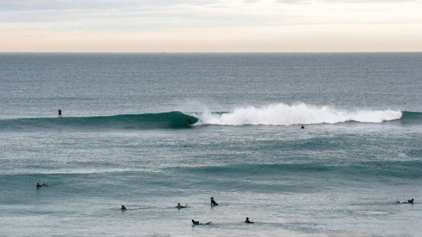

- **file**: `03_images/reefs/cables-reef-wa/cables-reef-wa_rwr-reef-surf-lineup_unknown-date.jpg`
- **kind**: photo
- **shows**: Clean peeling left-hand wave breaking with about eight surfers in the lineup, overcast light; the reef itself is submerged.
- **structure visible**: False
- **state shown**: as-built, in service (date unknown)
- **image date**: unknown (reef in service since Dec 1999; before 2019)
- **citation**: Raised Water Research (2019). Cables Reef [spot profile page]; image 'Cables Reef'. https://raisedwaterresearch.com/spot/artificial-reef/australia/western-australia/cables-reef/. Image file https://raisedwaterresearch.com/wp-content/uploads/2019/11/Cables-Reef.jpg. Accessed 2026-10-06.
- **image URL**: https://raisedwaterresearch.com/wp-content/uploads/2019/11/Cables-Reef.jpg
- **source page**: https://raisedwaterresearch.com/spot/artificial-reef/australia/western-australia/cables-reef/
- **page / figure**: page gallery image 'Cables-Reef.jpg'
- **credit**: Raised Water Research (a nearby page image is credited 'LifeOnPerth.com'; this file's own credit is not stated)
- **licence**: Unknown / all rights reserved (no licence on the page); link/research copy only - NOT cleared
- **retrieved**: 2026-10-06
- **used for**: context
- **How used for the model**: Page illustration of the surf effect (hero image recommended by the 2026-09-25 recheck). The page credits one image near the 'rideable waves ... 150 days per year' paragraph to LifeOnPerth.com without tying it to a file. No dimension read.
- **3D check pending**: no - none: surf photo without scale
- **linked records**: 02_research/reefs/cables-reef-wa.json images[0]; 05_qa/reef/cables-reef-wa_media_recheck.json images[0]
- **size**: 0.04 MB, 700x394 px
- **sha256**: d844f02f1fc33e5407ceb744d0ac0bed8472f816efc619166b811595d2b703b6
- **rights**: Private research copy; reuse rights to be checked before any public release.
- **display in HTML**: True
- **added by**: image-registry backfill, 2026-10-06

## cables-reef-wa-img-02 - cabletopturn.jpg: a surfer making a top turn at Cables (RWR)

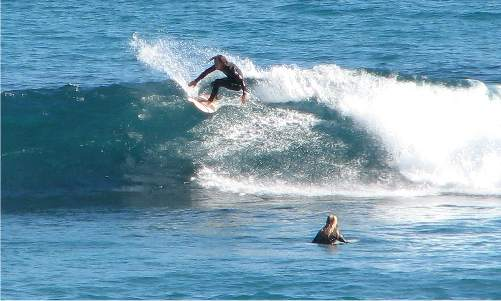

- **file**: `03_images/reefs/cables-reef-wa/cables-reef-wa_rwr-surfer-top-turn_unknown-date.jpg`
- **kind**: photo
- **shows**: A surfer performing a top turn on a clean wave face with another surfer in the water nearby.
- **structure visible**: False
- **state shown**: as-built, in service (date unknown)
- **image date**: unknown (reef in service since Dec 1999; before 2019)
- **citation**: Raised Water Research (2019). Cables Reef [spot profile page]; image 'cabletopturn'. https://raisedwaterresearch.com/spot/artificial-reef/australia/western-australia/cables-reef/. Image file https://raisedwaterresearch.com/wp-content/uploads/2019/11/cabletopturn.jpg. Accessed 2026-10-06.
- **image URL**: https://raisedwaterresearch.com/wp-content/uploads/2019/11/cabletopturn.jpg
- **source page**: https://raisedwaterresearch.com/spot/artificial-reef/australia/western-australia/cables-reef/
- **page / figure**: page gallery image 'cabletopturn.jpg'
- **credit**: Raised Water Research (photographer not stated)
- **licence**: Unknown / all rights reserved (no licence on the page); link/research copy only - NOT cleared
- **retrieved**: 2026-10-06
- **used for**: context
- **How used for the model**: Page illustration of the surf effect. No dimension read.
- **3D check pending**: no - none: surf photo
- **linked records**: 02_research/reefs/cables-reef-wa.json images[1]; 05_qa/reef/cables-reef-wa_media_recheck.json images[1]
- **size**: 0.03 MB, 501x301 px
- **sha256**: 615030aa901535ae625b092cfc4b808d9bf9de3432e9ce216ad7589e114ad9a4
- **rights**: Private research copy; reuse rights to be checked before any public release.
- **display in HTML**: True
- **added by**: image-registry backfill, 2026-10-06

## cables-reef-wa-img-03 - Cables-Reef-2.jpg: a surfer on a green wave breaking right-to-left over the reef (RWR)

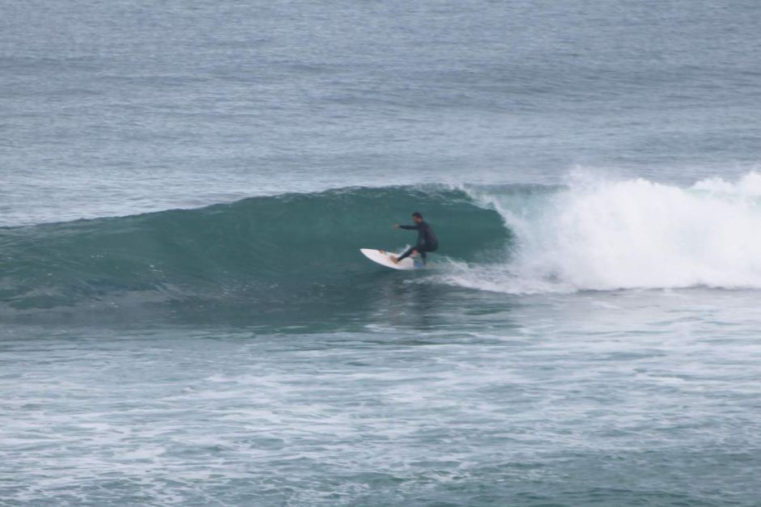

- **file**: `03_images/reefs/cables-reef-wa/cables-reef-wa_rwr-surf-wave-2_unknown-date.jpg`
- **kind**: photo
- **shows**: Surfer on a green wave face with whitewater breaking behind; the reef is not visible.
- **structure visible**: False
- **state shown**: as-built, in service (date unknown)
- **image date**: unknown (reef in service since Dec 1999; before 2019)
- **citation**: Raised Water Research (2019). Cables Reef [spot profile page]; image 'Cables Reef 2'. https://raisedwaterresearch.com/spot/artificial-reef/australia/western-australia/cables-reef/. Image file https://raisedwaterresearch.com/wp-content/uploads/2019/11/Cables-Reef-2.jpg. Accessed 2026-10-06.
- **image URL**: https://raisedwaterresearch.com/wp-content/uploads/2019/11/Cables-Reef-2.jpg
- **source page**: https://raisedwaterresearch.com/spot/artificial-reef/australia/western-australia/cables-reef/
- **page / figure**: page gallery image 'Cables-Reef-2.jpg'
- **credit**: Raised Water Research (photographer not stated)
- **licence**: Unknown / all rights reserved (no licence on the page); link/research copy only - NOT cleared
- **retrieved**: 2026-10-06
- **used for**: context
- **How used for the model**: Page illustration of the surf effect (not on the card). No dimension read.
- **3D check pending**: no - none: surf photo
- **linked records**: not on the card (found on the RWR page 2026-10-06); 05_qa/reef/cables-reef-wa_media_recheck.json
- **size**: 0.07 MB, 940x627 px
- **sha256**: ebad6b06800708dddaac06a8cb0b9a2b33599cff8fceb057e6b7c96ce6ddb5d8
- **rights**: Private research copy; reuse rights to be checked before any public release.
- **display in HTML**: True
- **added by**: image-registry backfill, 2026-10-06

## cables-reef-wa-img-04 - cablesmissed.jpg: a long, empty barrelling left-hand wave at Cables (RWR)

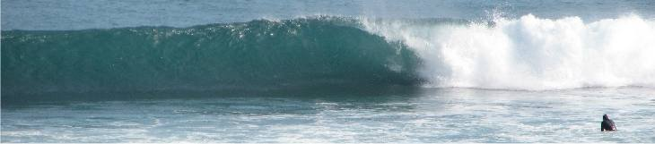

- **file**: `03_images/reefs/cables-reef-wa/cables-reef-wa_rwr-empty-wave_unknown-date.jpg`
- **kind**: photo
- **shows**: Wide crop of a clean hollow wave breaking with one surfer far right (alt text 'Cables Artificial Surfing Reef Empty').
- **structure visible**: False
- **state shown**: as-built, in service (date unknown)
- **image date**: unknown (reef in service since Dec 1999; before 2019)
- **citation**: Raised Water Research (2019). Cables Reef [spot profile page]; image 'cablesmissed'. https://raisedwaterresearch.com/spot/artificial-reef/australia/western-australia/cables-reef/. Image file https://raisedwaterresearch.com/wp-content/uploads/2019/11/cablesmissed.jpg. Accessed 2026-10-06.
- **image URL**: https://raisedwaterresearch.com/wp-content/uploads/2019/11/cablesmissed.jpg
- **source page**: https://raisedwaterresearch.com/spot/artificial-reef/australia/western-australia/cables-reef/
- **page / figure**: page gallery image 'cablesmissed.jpg'
- **credit**: Raised Water Research (photographer not stated)
- **licence**: Unknown / all rights reserved (no licence on the page); link/research copy only - NOT cleared
- **retrieved**: 2026-10-06
- **used for**: context
- **How used for the model**: Page illustration of the surf effect (not on the card). No dimension read.
- **3D check pending**: no - none: surf photo
- **linked records**: not on the card (found on the RWR page 2026-10-06); 05_qa/reef/cables-reef-wa_media_recheck.json
- **size**: 0.02 MB, 730x161 px
- **sha256**: 06bbac44c53db8800d503bc48f6d929a20a6043430a7a8b9e0eb006efa09b616
- **rights**: Private research copy; reuse rights to be checked before any public release.
- **display in HTML**: True
- **added by**: image-registry backfill, 2026-10-06

## cables-reef-wa-img-05 - Cables-Design.jpg: plan of the original reef design with depth contours (RWR; same file as Lior's Cable-reef-design.jpg)

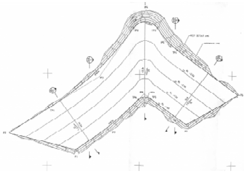

- **file**: `03_images/reefs/cables-reef-wa/cables-reef-wa_rwr-original-design-plan_1990s.jpg`
- **kind**: design_drawing
- **shows**: Plan-view contour drawing of the V/chevron reef (unequal arms, apex at the top of the sheet; the sheet orientation is not stated), with depth contours, dimension call-outs, benchmark marks and '+' grid ticks; no scale bar is legible.
- **structure visible**: True
- **state shown**: design (the original design, before the extension on the right)
- **image date**: design stage, 1990s (before Feb 1999 construction); exact date not stated
- **citation**: Raised Water Research (2019). Cables Reef [spot profile page]; image 'Cables Design (caption 'The original design.')'. https://raisedwaterresearch.com/spot/artificial-reef/australia/western-australia/cables-reef/. Image file https://raisedwaterresearch.com/wp-content/uploads/2019/11/Cables-Design.jpg. Accessed 2026-10-06. A byte-identical copy was supplied by Lior at 'Initial info from Lior/Cable-reef-design.jpg'.
- **image URL**: https://raisedwaterresearch.com/wp-content/uploads/2019/11/Cables-Design.jpg
- **source page**: https://raisedwaterresearch.com/spot/artificial-reef/australia/western-australia/cables-reef/
- **page / figure**: design section: 'After multiple studies and iterations, the Committee landed on the designs below.' - 'The original design.' (478 x 339 px)
- **credit**: Raised Water Research (drawing from the reef design reports; credit for this file not stated)
- **licence**: Unknown / all rights reserved (no licence on the page); link/research copy only - NOT cleared
- **retrieved**: 2026-10-06
- **used for**: cross_check
- **How used for the model**: Candidate plan source for the shape trace of Cables (not traced yet: no shape.json; METHOD.md stops at Step 1a). It was supplied by Lior as 'Cable-reef-design.jpg'. Needs a scale (e.g. the printed 140 m x 70 m or the dimension call-outs) before use.
- **3D check pending**: YES - Planform, V apex direction and arm lengths/angles of the original design vs the satellite-visible footprint and the text (140 m N-S x 70 m max width, 275 m offshore, 3-6 m depth); also contour values for seabed (values: planform, seabed, crest_z)
- **linked records**: Initial info from Lior/Cable-reef-design.jpg (byte-identical copy supplied by Lior); 07_scale/shapes/cables-reef-wa/METHOD.md; 02_research/reefs/cables-reef-wa.json (RWR design images)
- **size**: 0.06 MB, 478x339 px
- **sha256**: 4222f0a09b7e9c8f15f2f45b214c45517f64273bf3f24816130c95ddf77c16d2
- **rights**: Private research copy; reuse rights to be checked before any public release.
- **display in HTML**: True
- **added by**: image-registry backfill, 2026-10-06

## cables-reef-wa-img-06 - Cables-Additional-Fill-Area.jpg: plan of the extension to the right ('Additional fill area', volume 320 m3) (RWR)

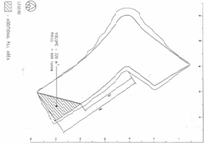

- **file**: `03_images/reefs/cables-reef-wa/cables-reef-wa_rwr-additional-fill-area-plan_1990s.jpg`
- **kind**: design_drawing
- **shows**: Plan outline of the V reef with a hatched triangular legend area 'ADDITIONAL FILL AREA' and a printed volume/mass annotation; the extension adds fill to one arm.
- **structure visible**: True
- **state shown**: design (extension of one arm)
- **image date**: design stage, 1990s
- **citation**: Raised Water Research (2019). Cables Reef [spot profile page]; image 'Cables Additional Fill Area (caption 'The extension to the right.')'. https://raisedwaterresearch.com/spot/artificial-reef/australia/western-australia/cables-reef/. Image file https://raisedwaterresearch.com/wp-content/uploads/2019/11/Cables-Additional-Fill-Area.jpg. Accessed 2026-10-06.
- **image URL**: https://raisedwaterresearch.com/wp-content/uploads/2019/11/Cables-Additional-Fill-Area.jpg
- **source page**: https://raisedwaterresearch.com/spot/artificial-reef/australia/western-australia/cables-reef/
- **page / figure**: design section: 'The extension to the right.' (417 x 296 px)
- **credit**: Raised Water Research (drawing from the reef design reports; credit for this file not stated)
- **licence**: Unknown / all rights reserved (no licence on the page); link/research copy only - NOT cleared
- **retrieved**: 2026-10-06
- **used for**: cross_check
- **How used for the model**: Evidence that the reef was extended on one arm (so the built planform differs from the original design); not traced. Text annotation 'volume 320 m3 / mass 688 tonne' is rotated and small - not verified.
- **3D check pending**: YES - Planform change from the original design: the extension arm and its fill volume vs the footprint measured on satellite or other imagery (values: planform, volume)
- **linked records**: 02_research/reefs/cables-reef-wa.json (RWR design images); Initial info from Lior/Cables-reef-more-info-and-design.png (shows this figure as 'The extension to the right')
- **size**: 0.02 MB, 417x296 px
- **sha256**: bfe40e48bcdbc5e2457e36504a82132e60052199211501cd46533020df90cae2
- **rights**: Private research copy; reuse rights to be checked before any public release.
- **display in HTML**: True
- **added by**: image-registry backfill, 2026-10-06

## cables-reef-wa-img-07 - Cables-Drawing.jpg: sketch plan 'PLAN - PROPOSED CABLES SURFING REEF' (Pitt sketch, RWR)

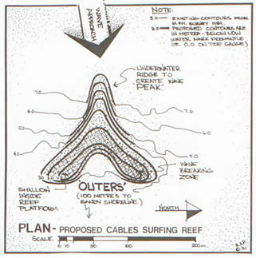

- **file**: `03_images/reefs/cables-reef-wa/cables-reef-wa_rwr-pitt-sketch-plan_1990s.jpg`
- **kind**: design_drawing
- **shows**: Hand-drawn plan of the proposed V reef ('OUTERS', 100 m to shoreline, wave approach arrow, north arrow, depth contours 3-7 m, scale bar 0-10-50-100-200 m) with notes on wave breaking zone, shallow inside reef platform and underwater ridge to create the peak.
- **structure visible**: True
- **state shown**: design (early concept)
- **image date**: 1991 (the sketches are signed/dated '91' per the drawing; best bound) - concept stage
- **citation**: Raised Water Research (2019). Cables Reef [spot profile page]; image 'Cables Drawing'. https://raisedwaterresearch.com/spot/artificial-reef/australia/western-australia/cables-reef/. Image file https://raisedwaterresearch.com/wp-content/uploads/2019/11/Cables-Drawing.jpg. Accessed 2026-10-06.
- **image URL**: https://raisedwaterresearch.com/wp-content/uploads/2019/11/Cables-Drawing.jpg
- **source page**: https://raisedwaterresearch.com/spot/artificial-reef/australia/western-australia/cables-reef/
- **page / figure**: page gallery image 'Cables-Drawing.jpg'
- **credit**: Pitt (Andrew Pitt, SurfingRamps.com.au; credit per the RWR page 'Image: Pitt' - the page does not tie it to this file)
- **licence**: Unknown / all rights reserved (no licence on the page); link/research copy only - NOT cleared
- **retrieved**: 2026-10-06
- **used for**: context; cross_check
- **How used for the model**: Early concept sketch (the page credits 'Image: Pitt' to Andrew Pitt, who supplied sketches). It carries a scale bar and depth contours (3.0-7.0 m labelled), so it could give an approximate planform and the distance-to-shore note (100 m); not traced yet.
- **3D check pending**: YES - Concept planform/contours vs the built reef (peak and wing geometry, depth contours 3-7 m) (values: planform, seabed)
- **linked records**: 02_research/reefs/cables-reef-wa.json (RWR design images)
- **size**: 0.02 MB, 321x323 px
- **sha256**: 7a4d3af15d7c172deb0079cbd80d3f9f87ddf43f5f7d5277d117ecb8a6095ea5
- **rights**: Private research copy; reuse rights to be checked before any public release.
- **display in HTML**: True
- **added by**: image-registry backfill, 2026-10-06
- **notes**: Date '91' read from the faint signature on the drawing; not verified.

## cables-reef-wa-img-08 - Cables-Drawing-2.jpg: 'FRONTAL ELEVATION - PROPOSED CABLES SURFING REEF' sketch (Pitt, RWR)

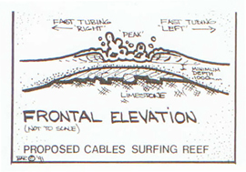

- **file**: `03_images/reefs/cables-reef-wa/cables-reef-wa_rwr-pitt-sketch-frontal_1990s.jpg`
- **kind**: cross_section
- **shows**: Hand-drawn frontal elevation: a peaked limestone/boulder reef with 'fast turning right' and 'fast turning left' arrows and a 'minimum depth' label; not to scale.
- **structure visible**: True
- **state shown**: design (early concept)
- **image date**: 1991 (the sketches are signed/dated '91' per the drawing; best bound) - concept stage
- **citation**: Raised Water Research (2019). Cables Reef [spot profile page]; image 'Cables Drawing 2'. https://raisedwaterresearch.com/spot/artificial-reef/australia/western-australia/cables-reef/. Image file https://raisedwaterresearch.com/wp-content/uploads/2019/11/Cables-Drawing-2.jpg. Accessed 2026-10-06.
- **image URL**: https://raisedwaterresearch.com/wp-content/uploads/2019/11/Cables-Drawing-2.jpg
- **source page**: https://raisedwaterresearch.com/spot/artificial-reef/australia/western-australia/cables-reef/
- **page / figure**: page gallery image 'Cables-Drawing-2.jpg'
- **credit**: Pitt (per the RWR page credit 'Image: Pitt')
- **licence**: Unknown / all rights reserved (no licence on the page); link/research copy only - NOT cleared
- **retrieved**: 2026-10-06
- **used for**: context
- **How used for the model**: Concept sketch of the reef profile (not to scale); no dimension read.
- **3D check pending**: no - none: unscaled concept sketch
- **linked records**: 02_research/reefs/cables-reef-wa.json (RWR design images)
- **size**: 0.05 MB, 270x189 px
- **sha256**: 0e03f4a7a56946e55dd196bba3d0483efdc23b8a3d0f47c5021a000d7af88a9b
- **rights**: Private research copy; reuse rights to be checked before any public release.
- **display in HTML**: True
- **added by**: image-registry backfill, 2026-10-06
- **notes**: Date '91' read from the faint signature on the drawing; not verified.

## cables-reef-wa-img-09 - Cables-Drawing-3.jpg: 'SECTIONAL ELEVATION' sketch (thick concrete capping, large boulders, limestone bedrock, re-growth of marine weed) (RWR)

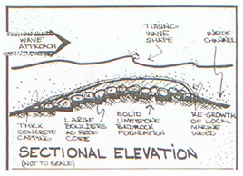

- **file**: `03_images/reefs/cables-reef-wa/cables-reef-wa_rwr-pitt-sketch-section_1990s.jpg`
- **kind**: cross_section
- **shows**: Hand-drawn section of the reef with wave approach and turning wave shape: thick concrete capping, large boulders as reef core, solid limestone bedrock foundation and re-growth of local marine weed; not to scale.
- **structure visible**: True
- **state shown**: design (early concept)
- **image date**: 1991 (the sketches are signed/dated '91' per the drawing; best bound) - concept stage
- **citation**: Raised Water Research (2019). Cables Reef [spot profile page]; image 'Cables Drawing 3'. https://raisedwaterresearch.com/spot/artificial-reef/australia/western-australia/cables-reef/. Image file https://raisedwaterresearch.com/wp-content/uploads/2019/11/Cables-Drawing-3.jpg. Accessed 2026-10-06.
- **image URL**: https://raisedwaterresearch.com/wp-content/uploads/2019/11/Cables-Drawing-3.jpg
- **source page**: https://raisedwaterresearch.com/spot/artificial-reef/australia/western-australia/cables-reef/
- **page / figure**: page gallery image 'Cables-Drawing-3.jpg'
- **credit**: Pitt (per the RWR page credit 'Image: Pitt')
- **licence**: Unknown / all rights reserved (no licence on the page); link/research copy only - NOT cleared
- **retrieved**: 2026-10-06
- **used for**: context
- **How used for the model**: Concept sketch of the reef construction layers (not to scale); no dimension read.
- **3D check pending**: no - none: unscaled concept sketch
- **linked records**: 02_research/reefs/cables-reef-wa.json (RWR design images)
- **size**: 0.06 MB, 268x194 px
- **sha256**: 6fe4d0e483ea01e17aaf56190504b8e0e66faedbedb55bff44c5b366bd25f37f
- **rights**: Private research copy; reuse rights to be checked before any public release.
- **display in HTML**: True
- **added by**: image-registry backfill, 2026-10-06
- **notes**: Date '91' read from the faint signature on the drawing; not verified.

## cables-reef-wa-img-10 - Cables-Side-View.jpg: 'Side view of Cables Reef' - existing sea bed and proposed enhancement (RWR)

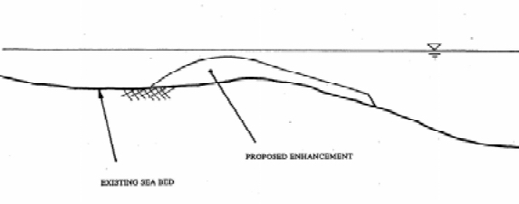

- **file**: `03_images/reefs/cables-reef-wa/cables-reef-wa_rwr-side-view-section_1990s.jpg`
- **kind**: cross_section
- **shows**: Hand-drawn cross-section labelled 'EXISTING SEA BED' and 'PROPOSED ENHANCEMENT': a rock mound raising the seabed profile, with the water surface line.
- **structure visible**: True
- **state shown**: design (typical cross-section)
- **image date**: design stage, 1990s (same as Pattiaratchi 1999 Fig. 3)
- **citation**: Raised Water Research (2019). Cables Reef [spot profile page]; image 'Cables Side View (caption 'Side view of Cables Reef.')'. https://raisedwaterresearch.com/spot/artificial-reef/australia/western-australia/cables-reef/. Image file https://raisedwaterresearch.com/wp-content/uploads/2019/11/Cables-Side-View.jpg. Accessed 2026-10-06.
- **image URL**: https://raisedwaterresearch.com/wp-content/uploads/2019/11/Cables-Side-View.jpg
- **source page**: https://raisedwaterresearch.com/spot/artificial-reef/australia/western-australia/cables-reef/
- **page / figure**: design section (573 x 226 px)
- **credit**: Raised Water Research (drawing from the reef design reports; credit for this file not stated)
- **licence**: Unknown / all rights reserved (no licence on the page); link/research copy only - NOT cleared
- **retrieved**: 2026-10-06
- **used for**: cross_check
- **How used for the model**: Qualitative cross-section (no scale): the same drawing as Fig. 3 of the Pattiaratchi 1999 paper; supports the crest/slope description (mound with a gentle shoreward and a steeper seaward face) but no number was read.
- **3D check pending**: YES - Cross-section shape (gentle back / steeper front) vs the 3D crest and slopes once a model exists; text gives crest 1-3 m below the surface and slope 1:20 in the lab design (values: height_above_seabed, crest_z)
- **linked records**: 02_research/reefs/cables-reef-wa.json images[2]; 05_qa/reef/cables-reef-wa_media_recheck.json images[2]; 07_scale/shapes/cables-reef-wa/src/S1_pattiaratchi_reefdesign.pdf (Fig. 3)
- **size**: 0.03 MB, 573x226 px
- **sha256**: d2803294efb2b34e846976f2ef3abf68acf50ea9b73e132cb1e236f00615f544
- **rights**: Private research copy; reuse rights to be checked before any public release.
- **display in HTML**: True
- **added by**: image-registry backfill, 2026-10-06

## cables-reef-wa-img-11 - Cables-Before.jpg: table of surf days / breaker height at the Cables site BEFORE the reef (RWR)

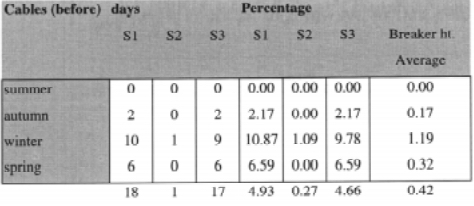

- **file**: `03_images/reefs/cables-reef-wa/cables-reef-wa_rwr-stats-before_1999.jpg`
- **kind**: diagram
- **shows**: Table (not a picture of the reef): days with surfable waves per season for S1-S3 and percentages and average breaker height at Cables before the reef (e.g. winter 10 days, 4.93% overall).
- **structure visible**: False
- **state shown**: as-built (performance data 1999)
- **image date**: monitoring through 1999
- **citation**: Raised Water Research (2019). Cables Reef [spot profile page]; image 'Cables Before'. https://raisedwaterresearch.com/spot/artificial-reef/australia/western-australia/cables-reef/. Image file https://raisedwaterresearch.com/wp-content/uploads/2019/11/Cables-Before.jpg. Accessed 2026-10-06.
- **image URL**: https://raisedwaterresearch.com/wp-content/uploads/2019/11/Cables-Before.jpg
- **source page**: https://raisedwaterresearch.com/spot/artificial-reef/australia/western-australia/cables-reef/
- **page / figure**: results section (table image)
- **credit**: Raised Water Research (tables from the 1999 monitoring study; original author per the page text: Stacey Bancroft)
- **licence**: Unknown / all rights reserved (no licence on the page); link/research copy only - NOT cleared
- **retrieved**: 2026-10-06
- **used for**: context
- **How used for the model**: Performance data for the card (pre-reef baseline); not a geometry source. Shows no reef structure.
- **3D check pending**: no - none: statistics table
- **linked records**: 02_research/reefs/cables-reef-wa.json (performance claims)
- **size**: 0.05 MB, 474x206 px
- **sha256**: b46792e65162fd75f9ed5d62ef12ccafe752a88d9fed154796cf5b44fe1e6bd9
- **rights**: Private research copy; reuse rights to be checked before any public release.
- **display in HTML**: True
- **added by**: image-registry backfill, 2026-10-06
- **notes**: Not a reef image; registered as a data figure because it is hosted as an image on the page.

## cables-reef-wa-img-12 - Cables-After.jpg: table of surf days / breaker height at Cables AFTER the reef (RWR)

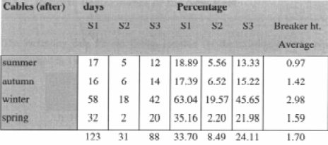

- **file**: `03_images/reefs/cables-reef-wa/cables-reef-wa_rwr-stats-after_1999.jpg`
- **kind**: diagram
- **shows**: Table (not a picture of the reef): days with surfable waves per season after the reef (e.g. winter 58 days, 33.70% overall, average breaker height 1.70 m).
- **structure visible**: False
- **state shown**: as-built (performance data 1999)
- **image date**: monitoring through 1999
- **citation**: Raised Water Research (2019). Cables Reef [spot profile page]; image 'Cables After'. https://raisedwaterresearch.com/spot/artificial-reef/australia/western-australia/cables-reef/. Image file https://raisedwaterresearch.com/wp-content/uploads/2019/11/Cables-After.jpg. Accessed 2026-10-06.
- **image URL**: https://raisedwaterresearch.com/wp-content/uploads/2019/11/Cables-After.jpg
- **source page**: https://raisedwaterresearch.com/spot/artificial-reef/australia/western-australia/cables-reef/
- **page / figure**: results section (table image)
- **credit**: Raised Water Research (tables from the 1999 monitoring study; original author per the page text: Stacey Bancroft)
- **licence**: Unknown / all rights reserved (no licence on the page); link/research copy only - NOT cleared
- **retrieved**: 2026-10-06
- **used for**: context
- **How used for the model**: Performance data for the card (post-reef); not a geometry source. Shows no reef structure.
- **3D check pending**: no - none: statistics table
- **linked records**: 02_research/reefs/cables-reef-wa.json (performance claims)
- **size**: 0.05 MB, 464x206 px
- **sha256**: ef459603f162be51aae7ad9fb21b248336c7cf6f0a06955685021d2887a7eea6
- **rights**: Private research copy; reuse rights to be checked before any public release.
- **display in HTML**: True
- **added by**: image-registry backfill, 2026-10-06
- **notes**: Not a reef image; registered as a data figure because it is hosted as an image on the page.

## cables-reef-wa-img-13 - Stacey-Observations-from-Study.jpg: observed vs predicted breaking / surfable days per month at Cables (RWR)

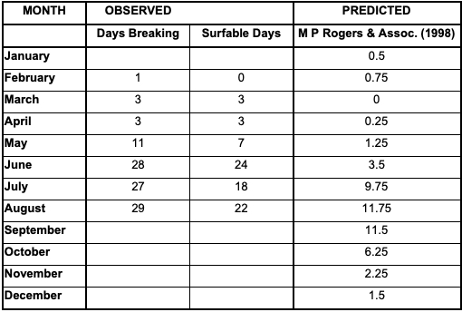

- **file**: `03_images/reefs/cables-reef-wa/cables-reef-wa_rwr-stacey-observations_1999.jpg`
- **kind**: diagram
- **shows**: Table (not a picture of the reef): observed days breaking and surfable days by month (Feb-Aug 1999) against the M P Rogers & Assoc. (1998) prediction.
- **structure visible**: False
- **state shown**: as-built (performance data 1999)
- **image date**: monitoring through 1999
- **citation**: Raised Water Research (2019). Cables Reef [spot profile page]; image 'Stacey Observations from Study'. https://raisedwaterresearch.com/spot/artificial-reef/australia/western-australia/cables-reef/. Image file https://raisedwaterresearch.com/wp-content/uploads/2019/11/Stacey-Observations-from-Study.jpg. Accessed 2026-10-06.
- **image URL**: https://raisedwaterresearch.com/wp-content/uploads/2019/11/Stacey-Observations-from-Study.jpg
- **source page**: https://raisedwaterresearch.com/spot/artificial-reef/australia/western-australia/cables-reef/
- **page / figure**: results section (table image)
- **credit**: Raised Water Research (tables from the 1999 monitoring study; original author per the page text: Stacey Bancroft)
- **licence**: Unknown / all rights reserved (no licence on the page); link/research copy only - NOT cleared
- **retrieved**: 2026-10-06
- **used for**: context
- **How used for the model**: Performance data (Stacey Bancroft's 1999 monitoring study vs the 1998 prediction); not a geometry source. Shows no reef structure.
- **3D check pending**: no - none: statistics table
- **linked records**: 02_research/reefs/cables-reef-wa.json (performance claims)
- **size**: 0.07 MB, 510x344 px
- **sha256**: 7be066b4c41da89459d212125fbbf9c2281274de88fe468f7fcaa3be6e07e3c4
- **rights**: Private research copy; reuse rights to be checked before any public release.
- **display in HTML**: True
- **added by**: image-registry backfill, 2026-10-06
- **notes**: Not a reef image; registered as a data figure because it is hosted as an image on the page.

## cables-reef-wa-img-14 - Screenshot supplied by Lior: RWR Cables page section 'The original design / The extension to the right / Side view of Cables Reef' with the size text

- **file**: `Initial info from Lior/Cables-reef-more-info-and-design.png`
- **kind**: diagram
- **shows**: Three figures (original design plan, extension plan, side view) with the page text: reef length about 140 m N-S, max width 70 m, about 275 m offshore in 3-6 m of water, crest 1-3 m below the surface on average tides.
- **structure visible**: True
- **state shown**: design
- **image date**: screenshot before 2026-10-04 (page content 2019)
- **citation**: Screenshot by Lior (before 2026-10-04) of: Raised Water Research (2019). Cables Reef [spot profile page], design section. https://raisedwaterresearch.com/spot/artificial-reef/australia/western-australia/cables-reef/. Registered from Lior's folder 'Initial info from Lior' on 2026-10-06 (not copied).
- **source page**: https://raisedwaterresearch.com/spot/artificial-reef/australia/western-australia/cables-reef/
- **page / figure**: screenshot of the design section
- **credit**: Raised Water Research (content); screenshot supplied by Lior
- **licence**: RWR content: no licence stated, all rights reserved; private copy
- **retrieved**: 2026-10-04 (supplied)
- **used for**: context
- **How used for the model**: Not used directly; its three figures are registered individually from the original files (design plan, additional fill area, side view). The text values 140 m / 70 m / 275 m / 3-6 m / crest 1-3 m are the dossier's dimension source.
- **3D check pending**: no - none: duplicate composite of registered figures
- **linked records**: Initial info from Lior/Cable-reef-design.jpg
- **size**: 0.16 MB, 664x657 px
- **sha256**: a49aa92d058a0bcefee6124150be0991470b9dad94de767e3e954cb4e8c5c046
- **rights**: Private research copy; reuse rights to be checked before any public release.
- **display in HTML**: False
- **added by**: image-registry backfill, 2026-10-06
- **notes**: display false: duplicate composite of rows registered individually; kept so Lior's supplied file is documented.

## cables-reef-wa-img-15 - Pattiaratchi (1999) Fig. 1: location map showing bathymetry and study sites (Cable Station, Fremantle / Cottesloe, Perth)

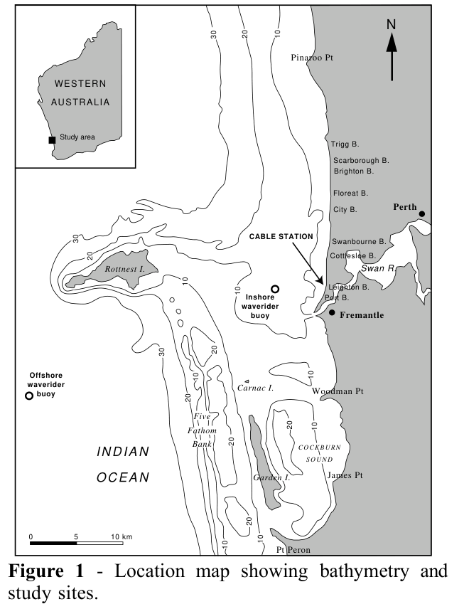

- **file**: `03_images/reefs/cables-reef-wa/cables-reef-wa_pattiaratchi1999-fig1-location-map_1999.png`
- **kind**: plan_figure
- **shows**: Regional map of the Perth coast with 10/20/30 m bathymetry, the Cable Station site (arrow) between Cottesloe and Fremantle, the inshore and offshore waverider buoys, Rottnest Island and Cockburn Sound.
- **structure visible**: False
- **state shown**: not applicable (location map)
- **image date**: 1999
- **citation**: Pattiaratchi, C. (1999). Design Studies for an Artificial Surfing Reef: Cable Station, Western Australia. Centre for Water Research, University of Western Australia, report ref. ED1483CP (5 pp.; PDF created 1999-04-13), p.2, Figure 1 'Location map showing bathymetry and study sites.' (vector figure rendered at 200 dpi and cropped). http://joas.free.fr/studies/bei/g2s/reefdesign.pdf (mirror; byte-identical re-download 2026-10-05, MD5 02a6075b1eac84a68180bbfd89226fea). Accessed 2026-10-05.
- **image URL**: http://joas.free.fr/studies/bei/g2s/reefdesign.pdf
- **source page**: http://joas.free.fr/studies/bei/g2s/reefdesign.pdf
- **page / figure**: PDF p.2, Figure 1
- **credit**: C. Pattiaratchi / Centre for Water Research, UWA
- **licence**: unknown / all rights reserved - private research copy
- **retrieved**: 2026-10-06
- **used for**: context
- **How used for the model**: Context only: confirms the site location and the offshore/inshore waverider buoy positions; no value used.
- **3D check pending**: no - none: regional location map
- **source PDF**: `07_scale/shapes/cables-reef-wa/src/S1_pattiaratchi_reefdesign.pdf`
- **linked records**: 07_scale/shapes/cables-reef-wa/sources.md S1; 07_scale/shapes/cables-reef-wa/src/S1_fig1_sitemap_full_page.png
- **size**: 0.10 MB, 653x856 px
- **sha256**: 91962d0d94c1dd37617b46f6e6ef45c7cc8bfad42fa617cdb4d096d7cede172b
- **rights**: Private research copy; reuse rights to be checked before any public release.
- **display in HTML**: True
- **added by**: image-registry backfill, 2026-10-06

## cables-reef-wa-img-16 - Pattiaratchi (1999) Fig. 3: conceptual design of the proposed enhancement (typical cross-section of existing reef and proposed enhancement)

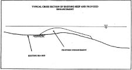

- **file**: `03_images/reefs/cables-reef-wa/cables-reef-wa_pattiaratchi1999-fig3-conceptual-cross-section_1999.png`
- **kind**: cross_section
- **shows**: Typical cross-section of the existing reef with the proposed enhancement mound and the water surface (not to scale).
- **structure visible**: True
- **state shown**: design (1999 design studies; reef built Feb-Dec 1999)
- **image date**: 1999
- **citation**: Pattiaratchi, C. (1999). Design Studies for an Artificial Surfing Reef: Cable Station, Western Australia. Centre for Water Research, University of Western Australia, report ref. ED1483CP (5 pp.; PDF created 1999-04-13), p.3, Figure 3 (embedded raster, native resolution). http://joas.free.fr/studies/bei/g2s/reefdesign.pdf (mirror; byte-identical re-download 2026-10-05, MD5 02a6075b1eac84a68180bbfd89226fea). Accessed 2026-10-05.
- **image URL**: http://joas.free.fr/studies/bei/g2s/reefdesign.pdf
- **source page**: http://joas.free.fr/studies/bei/g2s/reefdesign.pdf
- **page / figure**: PDF p.3, Figure 3 (embedded raster xref 25)
- **credit**: C. Pattiaratchi / Centre for Water Research, UWA
- **licence**: unknown / all rights reserved - private research copy
- **retrieved**: 2026-10-06
- **used for**: cross_check
- **How used for the model**: Same drawing as RWR 'Side view of Cables Reef'; qualitative (a 1:20 slope step in the lab tests is stated in the text).
- **3D check pending**: no - none: qualitative duplicate of the RWR side view
- **source PDF**: `07_scale/shapes/cables-reef-wa/src/S1_pattiaratchi_reefdesign.pdf`
- **linked records**: 07_scale/shapes/cables-reef-wa/sources.md S1; 07_scale/shapes/cables-reef-wa/METHOD.md step 1a
- **size**: 0.01 MB, 225x119 px
- **sha256**: 520c4cc7789bd614cd9a39a5f74fbe0e2e20f19b339ddd522e81cf377283b018
- **rights**: Private research copy; reuse rights to be checked before any public release.
- **display in HTML**: True
- **added by**: image-registry backfill, 2026-10-06

## cables-reef-wa-img-17 - Pattiaratchi (1999) Fig. 4: final design of the Cable Station artificial reef (3D contour sketch used in the wave-basin tests)

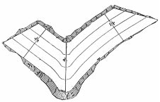

- **file**: `03_images/reefs/cables-reef-wa/cables-reef-wa_pattiaratchi1999-fig4-final-design-wave-basin_1999.png`
- **kind**: design_drawing
- **shows**: Oblique contour sketch of the final V/chevron design with unequal arms as built in the wave basin; no scale.
- **structure visible**: True
- **state shown**: design (1999 design studies; reef built Feb-Dec 1999)
- **image date**: 1999
- **citation**: Pattiaratchi, C. (1999). Design Studies for an Artificial Surfing Reef: Cable Station, Western Australia. Centre for Water Research, University of Western Australia, report ref. ED1483CP (5 pp.; PDF created 1999-04-13), p.3, Figure 4 (embedded raster, native resolution). http://joas.free.fr/studies/bei/g2s/reefdesign.pdf (mirror; byte-identical re-download 2026-10-05, MD5 02a6075b1eac84a68180bbfd89226fea). Accessed 2026-10-05.
- **image URL**: http://joas.free.fr/studies/bei/g2s/reefdesign.pdf
- **source page**: http://joas.free.fr/studies/bei/g2s/reefdesign.pdf
- **page / figure**: PDF p.3, Figure 4 (embedded raster xref 26)
- **credit**: C. Pattiaratchi / Centre for Water Research, UWA
- **licence**: unknown / all rights reserved - private research copy
- **retrieved**: 2026-10-06
- **used for**: cross_check
- **How used for the model**: Qualitative only: oblique, no scale, so not traceable in plan (METHOD.md step 1a); gives the V typology with unequal arms.
- **3D check pending**: YES - V arm lengths/angles of the final design vs the satellite-visible footprint and the text (left-hander 30-40 m, right-hander 50-80 m) (values: planform)
- **source PDF**: `07_scale/shapes/cables-reef-wa/src/S1_pattiaratchi_reefdesign.pdf`
- **linked records**: 07_scale/shapes/cables-reef-wa/sources.md S1; 07_scale/shapes/cables-reef-wa/METHOD.md step 1a
- **size**: 0.01 MB, 226x145 px
- **sha256**: 19a2834b899aeaa8802c8897b01cda14c4105f7f10fc45bd53d48c9896606a08
- **rights**: Private research copy; reuse rights to be checked before any public release.
- **display in HTML**: True
- **added by**: image-registry backfill, 2026-10-06

## cables-reef-wa-img-18 - Pattiaratchi (1999) Fig. 5: performance of the existing reef at Cable Station (peel angle vs breaker height)

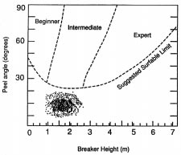

- **file**: `03_images/reefs/cables-reef-wa/cables-reef-wa_pattiaratchi1999-fig5-existing-reef-performance_1999.png`
- **kind**: chart_screenshot
- **shows**: Scatter of predicted wave conditions on the peel angle / breaker height classification (beginner, intermediate, expert, suggested surfable limit) for the existing reef: mostly below the surfable limit.
- **structure visible**: False
- **state shown**: design (1999 design studies; reef built Feb-Dec 1999)
- **image date**: 1999
- **citation**: Pattiaratchi, C. (1999). Design Studies for an Artificial Surfing Reef: Cable Station, Western Australia. Centre for Water Research, University of Western Australia, report ref. ED1483CP (5 pp.; PDF created 1999-04-13), p.4, Figure 5 (embedded raster, native resolution). http://joas.free.fr/studies/bei/g2s/reefdesign.pdf (mirror; byte-identical re-download 2026-10-05, MD5 02a6075b1eac84a68180bbfd89226fea). Accessed 2026-10-05.
- **image URL**: http://joas.free.fr/studies/bei/g2s/reefdesign.pdf
- **source page**: http://joas.free.fr/studies/bei/g2s/reefdesign.pdf
- **page / figure**: PDF p.4, Figure 5 (embedded raster xref 30)
- **credit**: C. Pattiaratchi / Centre for Water Research, UWA
- **licence**: unknown / all rights reserved - private research copy
- **retrieved**: 2026-10-06
- **used for**: context
- **How used for the model**: Context: shows why the existing reef is rarely surfable; no model value used.
- **3D check pending**: no - none: wave statistics chart
- **source PDF**: `07_scale/shapes/cables-reef-wa/src/S1_pattiaratchi_reefdesign.pdf`
- **linked records**: 07_scale/shapes/cables-reef-wa/sources.md S1; 07_scale/shapes/cables-reef-wa/METHOD.md step 1a
- **size**: 0.01 MB, 225x193 px
- **sha256**: 03e289658215ebfd663419a71b203e3d73b40f3e941c87c44bbac956a5487bea
- **rights**: Private research copy; reuse rights to be checked before any public release.
- **display in HTML**: True
- **added by**: image-registry backfill, 2026-10-06

## cables-reef-wa-img-19 - Pattiaratchi (1999) Fig. 6: performance of the proposed artificial reef (peel angle vs breaker height)

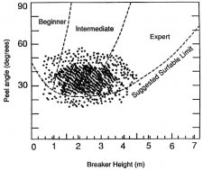

- **file**: `03_images/reefs/cables-reef-wa/cables-reef-wa_pattiaratchi1999-fig6-proposed-reef-performance_1999.png`
- **kind**: chart_screenshot
- **shows**: Scatter of predicted wave conditions for the proposed reef: clustered at peel angles about 30-45 deg and breaker heights 1-4 m, in the beginner/intermediate fields.
- **structure visible**: False
- **state shown**: design (1999 design studies; reef built Feb-Dec 1999)
- **image date**: 1999
- **citation**: Pattiaratchi, C. (1999). Design Studies for an Artificial Surfing Reef: Cable Station, Western Australia. Centre for Water Research, University of Western Australia, report ref. ED1483CP (5 pp.; PDF created 1999-04-13), p.4, Figure 6 (embedded raster, native resolution). http://joas.free.fr/studies/bei/g2s/reefdesign.pdf (mirror; byte-identical re-download 2026-10-05, MD5 02a6075b1eac84a68180bbfd89226fea). Accessed 2026-10-05.
- **image URL**: http://joas.free.fr/studies/bei/g2s/reefdesign.pdf
- **source page**: http://joas.free.fr/studies/bei/g2s/reefdesign.pdf
- **page / figure**: PDF p.4, Figure 6 (embedded raster xref 31)
- **credit**: C. Pattiaratchi / Centre for Water Research, UWA
- **licence**: unknown / all rights reserved - private research copy
- **retrieved**: 2026-10-06
- **used for**: context
- **How used for the model**: Context: design performance claim (peel angle about 45 deg); no model value used.
- **3D check pending**: no - none: wave statistics chart
- **source PDF**: `07_scale/shapes/cables-reef-wa/src/S1_pattiaratchi_reefdesign.pdf`
- **linked records**: 07_scale/shapes/cables-reef-wa/sources.md S1; 07_scale/shapes/cables-reef-wa/METHOD.md step 1a
- **size**: 0.02 MB, 225x189 px
- **sha256**: eb8bda7b0e06daa794f55a27e8542c29945e78975e159c77333420d56e8f78ea
- **rights**: Private research copy; reuse rights to be checked before any public release.
- **display in HTML**: True
- **added by**: image-registry backfill, 2026-10-06

## cables-reef-wa-img-20 - Pattiaratchi (1999) Fig. 7: the geographic location of the proposed surfing reef at Cable Station (plan map, printed rotated 90 deg, V outline over depth contours)

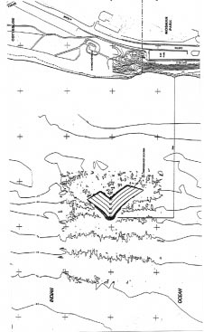

- **file**: `03_images/reefs/cables-reef-wa/cables-reef-wa_pattiaratchi1999-fig7-geographic-location_1999.png`
- **kind**: plan_figure
- **shows**: Plan map (printed rotated 90 deg, north to the left) of the Cable Station shore with Cottesloe / Mosman Park labels, roads, depth contours and the bold V outline of the reef with internal contour lines; the apex points offshore.
- **structure visible**: True
- **state shown**: design (1999 design studies; reef built Feb-Dec 1999)
- **image date**: 1999
- **citation**: Pattiaratchi, C. (1999). Design Studies for an Artificial Surfing Reef: Cable Station, Western Australia. Centre for Water Research, University of Western Australia, report ref. ED1483CP (5 pp.; PDF created 1999-04-13), p.4, Figure 7 (embedded raster, native resolution). http://joas.free.fr/studies/bei/g2s/reefdesign.pdf (mirror; byte-identical re-download 2026-10-05, MD5 02a6075b1eac84a68180bbfd89226fea). Accessed 2026-10-05.
- **image URL**: http://joas.free.fr/studies/bei/g2s/reefdesign.pdf
- **source page**: http://joas.free.fr/studies/bei/g2s/reefdesign.pdf
- **page / figure**: PDF p.4, Figure 7 (embedded raster xref 32)
- **credit**: C. Pattiaratchi / Centre for Water Research, UWA
- **licence**: unknown / all rights reserved - private research copy
- **retrieved**: 2026-10-06
- **used for**: plan_trace; cross_check
- **How used for the model**: Resolved the V apex direction (apex offshore = west) from the printed rotation (METHOD.md step 1a). Only 226 x 367 px at ~1 px per point, no scale bar read yet, so the outline has not been traced.
- **3D check pending**: YES - Apex direction (offshore) and V outline position/orientation vs the satellite and the 275 m offshore text; use the '+' grid marks as scale if their spacing is known (values: planform, position)
- **source PDF**: `07_scale/shapes/cables-reef-wa/src/S1_pattiaratchi_reefdesign.pdf`
- **linked records**: 07_scale/shapes/cables-reef-wa/sources.md S1; 07_scale/shapes/cables-reef-wa/METHOD.md step 1a
- **size**: 0.03 MB, 226x367 px
- **sha256**: 5ce314619e3bfabfd48952692ecd3533686b9cf371d85cb59c9419079df1cd44
- **rights**: Private research copy; reuse rights to be checked before any public release.
- **display in HTML**: True
- **added by**: image-registry backfill, 2026-10-06

## cables-reef-wa-img-21 - Pattiaratchi (1999) page 2 full-page render (Fig. 1 location map and Fig. 2 wave classification)

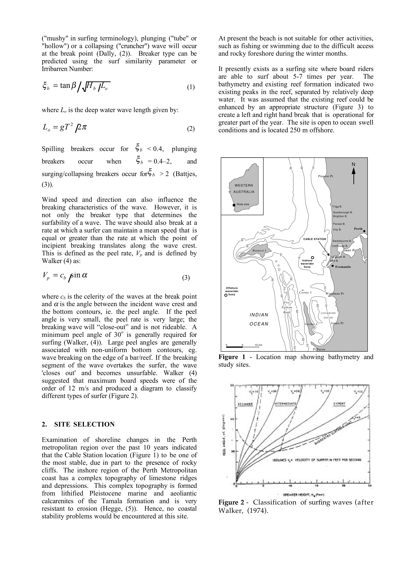

- **file**: `07_scale/shapes/cables-reef-wa/src/S1_fig1_sitemap_full_page.png`
- **kind**: diagram
- **shows**: Full page 2 of the paper: text on breaker types and surf quality, Figure 1 (location map with bathymetry) and Figure 2 (classification of surfing waves).
- **structure visible**: False
- **state shown**: not applicable (paper page)
- **image date**: 1999
- **citation**: Pattiaratchi, C. (1999). Design Studies for an Artificial Surfing Reef: Cable Station, Western Australia. Centre for Water Research, University of Western Australia, report ref. ED1483CP (5 pp.; PDF created 1999-04-13), p.2 (full-page render of the PDF page). http://joas.free.fr/studies/bei/g2s/reefdesign.pdf (mirror; byte-identical re-download 2026-10-05, MD5 02a6075b1eac84a68180bbfd89226fea). Accessed 2026-10-05.
- **image URL**: http://joas.free.fr/studies/bei/g2s/reefdesign.pdf
- **source page**: http://joas.free.fr/studies/bei/g2s/reefdesign.pdf
- **page / figure**: PDF p.2 (page render, 2480 px wide)
- **credit**: C. Pattiaratchi / Centre for Water Research, UWA
- **licence**: unknown / all rights reserved - private research copy
- **retrieved**: 2026-10-04
- **used for**: context
- **How used for the model**: Page render saved in the first run (sources.md S1); the figures are registered individually from native extracts and a vector crop (Fig. 1).
- **3D check pending**: no - none: page render
- **source PDF**: `07_scale/shapes/cables-reef-wa/src/S1_pattiaratchi_reefdesign.pdf`
- **linked records**: 07_scale/shapes/cables-reef-wa/sources.md S1
- **size**: 0.84 MB, 2480x3509 px
- **sha256**: 8630388469df4bb690c40fd183e91de8393621bafad2d18b745d4102648151a2
- **rights**: Private research copy; reuse rights to be checked before any public release.
- **display in HTML**: True
- **added by**: image-registry backfill, 2026-10-06

## cables-reef-wa-img-22 - Pattiaratchi (1999) page 3 full-page render (wave-flume and wave-basin studies, Figs 3 and 4)

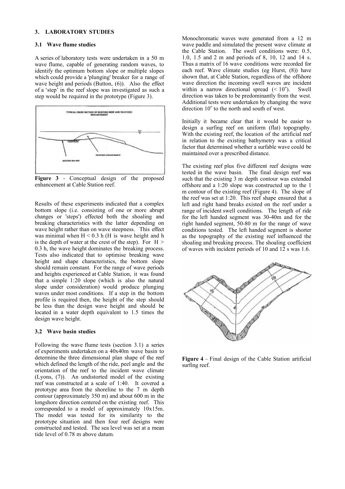

- **file**: `07_scale/shapes/cables-reef-wa/src/S1_fig4_wavebasin_full_page.png`
- **kind**: diagram
- **shows**: Full page 3: laboratory studies text with Figure 3 (conceptual cross-section) and Figure 4 (final design 3D contour sketch).
- **structure visible**: True
- **state shown**: design (1999)
- **image date**: 1999
- **citation**: Pattiaratchi, C. (1999). Design Studies for an Artificial Surfing Reef: Cable Station, Western Australia. Centre for Water Research, University of Western Australia, report ref. ED1483CP (5 pp.; PDF created 1999-04-13), p.3 (full-page render of the PDF page). http://joas.free.fr/studies/bei/g2s/reefdesign.pdf (mirror; byte-identical re-download 2026-10-05, MD5 02a6075b1eac84a68180bbfd89226fea). Accessed 2026-10-05.
- **image URL**: http://joas.free.fr/studies/bei/g2s/reefdesign.pdf
- **source page**: http://joas.free.fr/studies/bei/g2s/reefdesign.pdf
- **page / figure**: PDF p.3 (page render, 2480 x 3509 px)
- **credit**: C. Pattiaratchi / Centre for Water Research, UWA
- **licence**: unknown / all rights reserved - private research copy
- **retrieved**: 2026-10-04
- **used for**: cross_check
- **How used for the model**: Page render saved in the first run; text used for the lab design (1:20 slope reef, left-hand segment 30-40 m, right-hand segment 50-80 m, 3 m depth contour extended offshore). Figures registered individually.
- **3D check pending**: no - none: page render
- **source PDF**: `07_scale/shapes/cables-reef-wa/src/S1_pattiaratchi_reefdesign.pdf`
- **linked records**: 07_scale/shapes/cables-reef-wa/sources.md S1; 07_scale/shapes/cables-reef-wa/METHOD.md step 1a
- **size**: 0.84 MB, 2480x3509 px
- **sha256**: 6bc4e3e747017a16d55246ce539d8223f61b7e8d268818814b83830afe0a19de
- **rights**: Private research copy; reuse rights to be checked before any public release.
- **display in HTML**: True
- **added by**: image-registry backfill, 2026-10-06

## cables-reef-wa-img-23 - Pattiaratchi (1999) page 4 render: Figure 7 geographic location of the proposed reef (upscaled)

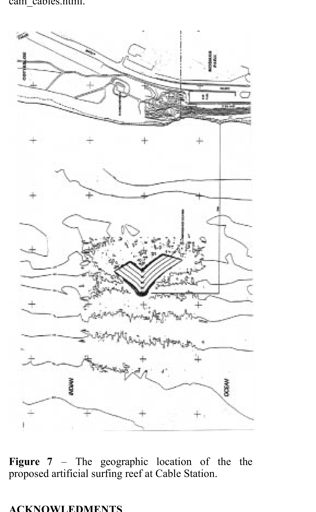

- **file**: `07_scale/shapes/cables-reef-wa/src/S1_fig7_location_map.png`
- **kind**: plan_figure
- **shows**: Page-4 render showing Figure 7: the rotated plan map with the V outline over contours; the native raster is only 226 x 367 px, so this is an upscale.
- **structure visible**: True
- **state shown**: design (1999)
- **image date**: 1999
- **citation**: Pattiaratchi, C. (1999). Design Studies for an Artificial Surfing Reef: Cable Station, Western Australia. Centre for Water Research, University of Western Australia, report ref. ED1483CP (5 pp.; PDF created 1999-04-13), p.4, Figure 7 (page render, 2409 x 3900 px). http://joas.free.fr/studies/bei/g2s/reefdesign.pdf (mirror; byte-identical re-download 2026-10-05, MD5 02a6075b1eac84a68180bbfd89226fea). Accessed 2026-10-05.
- **image URL**: http://joas.free.fr/studies/bei/g2s/reefdesign.pdf
- **source page**: http://joas.free.fr/studies/bei/g2s/reefdesign.pdf
- **page / figure**: PDF p.4, Figure 7 (page render)
- **credit**: C. Pattiaratchi / Centre for Water Research, UWA
- **licence**: unknown / all rights reserved - private research copy
- **retrieved**: 2026-10-04
- **used for**: plan_trace; cross_check
- **How used for the model**: Used to read the apex direction (offshore) in METHOD.md step 1a; not traced (low native resolution, no scale bar).
- **3D check pending**: YES - Apex direction/outline orientation vs satellite (see the native Fig. 7 row) (values: planform, position)
- **source PDF**: `07_scale/shapes/cables-reef-wa/src/S1_pattiaratchi_reefdesign.pdf`
- **linked records**: 07_scale/shapes/cables-reef-wa/METHOD.md step 1a
- **size**: 0.23 MB, 2409x3900 px
- **sha256**: 623d7ad3e0b1755b7c294e2d5e0599d46614bd93ed1ef4d24adb4c94a1df3802
- **rights**: Private research copy; reuse rights to be checked before any public release.
- **display in HTML**: True
- **added by**: image-registry backfill, 2026-10-06
