# Image registry - kovalam-reef-india

Source of truth: `images.json` in this folder (convention: `_agent_briefs/image_registry.md`; overview: `03_images/reefs/README.md`). This file is generated from it.

14 images registered, 14 with a file, 3 used for the model (any use other than context/not_used).

## kovalam-reef-india-img-01 - Kovalam-Overview-Good.jpg: aerial overview of Kovalam Lighthouse Beach (RWR)

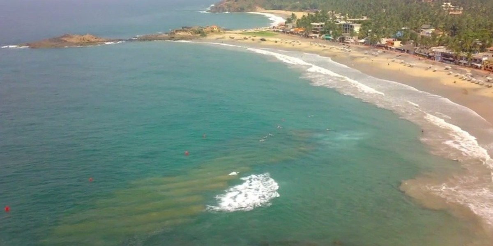

- **file**: `03_images/reefs/kovalam-reef-india/kovalam-reef-india_rwr-overview-good_unknown-date.jpg`
- **kind**: aerial
- **shows**: Aerial/drone shot of the crescent Lighthouse Beach with the rocky headland at upper left, dense hotel/resort buildings and palms along the shore, swimmers with red buoys and a patch of whitewater in open water mid-frame.
- **structure visible**: False
- **state shown**: as-built, in service (date unknown)
- **image date**: unknown (ASR beach photos Aug 2009 / Aug 2010 in the composite; others undated; before 2019)
- **citation**: Raised Water Research (2019). Kovalam [spot profile page]; image 'Kovalam Overview Good'. https://raisedwaterresearch.com/spot/artificial-reef/asia/india/kovalam/. Image file https://raisedwaterresearch.com/wp-content/uploads/2019/12/Kovalam-Overview-Good.jpg. Accessed 2026-10-06.
- **image URL**: https://raisedwaterresearch.com/wp-content/uploads/2019/12/Kovalam-Overview-Good.jpg
- **source page**: https://raisedwaterresearch.com/spot/artificial-reef/asia/india/kovalam/
- **page / figure**: page gallery image 'Kovalam-Overview-Good.jpg'
- **credit**: Raised Water Research
- **licence**: no licence stated on the page; link/research copy only - NOT cleared
- **retrieved**: 2026-10-06
- **used for**: context
- **How used for the model**: Page illustration of the site; the whitewater patch is probably the reef break but the page does not caption it, so it is treated as site context only (recheck: use as location context, not as reef evidence).
- **3D check pending**: no - none: site context (whitewater patch not captioned as the reef)
- **linked records**: 02_research/reefs/kovalam-reef-india.json images / images_rejected; 05_qa/reef/kovalam-reef-india_media_recheck.json
- **size**: 0.11 MB, 1200x600 px
- **sha256**: f6a273ab2b80a2f13dbb67729296ba57c0ac2bce73bf03ff948fd42cf5cf3b2f
- **rights**: Private research copy; reuse rights to be checked before any public release.
- **display in HTML**: True
- **added by**: image-registry backfill, 2026-10-06

## kovalam-reef-india-img-02 - Kovalam-Geomat.jpg: workers in the surf handling a geotextile mat studded with orange floats (RWR)

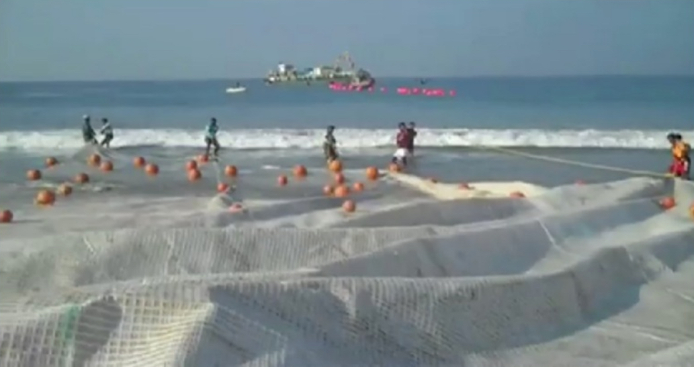

- **file**: `03_images/reefs/kovalam-reef-india/kovalam-reef-india_rwr-geomat-construction_unknown-date.jpg`
- **kind**: photo
- **shows**: Workers on the wet beach handling large white geotextile sheets/mats with orange floats; an offshore construction vessel with pink buoys on the horizon.
- **structure visible**: False
- **state shown**: under construction (2009-2010)
- **image date**: unknown (ASR beach photos Aug 2009 / Aug 2010 in the composite; others undated; before 2019)
- **citation**: Raised Water Research (2019). Kovalam [spot profile page]; image 'Kovalam Geomat'. https://raisedwaterresearch.com/spot/artificial-reef/asia/india/kovalam/. Image file https://raisedwaterresearch.com/wp-content/uploads/2019/12/Kovalam-Geomat.jpg. Accessed 2026-10-06.
- **image URL**: https://raisedwaterresearch.com/wp-content/uploads/2019/12/Kovalam-Geomat.jpg
- **source page**: https://raisedwaterresearch.com/spot/artificial-reef/asia/india/kovalam/
- **page / figure**: page gallery image 'Kovalam-Geomat.jpg'
- **credit**: Raised Water Research
- **licence**: no licence stated on the page; link/research copy only - NOT cleared
- **retrieved**: 2026-10-06
- **used for**: context
- **How used for the model**: Page illustration of the construction method (geotextile mats/bags placed from the beach and a vessel). No dimension read. The 2026-09-25 media recheck classed this image 'unrelated_or_wrong_site' with a description that does not match the file; re-viewed directly on 2026-10-06 the file matches the card description and the file name. Registered with display true - Lior/QA to confirm.
- **3D check pending**: no - none: construction method photo, no scale
- **linked records**: 02_research/reefs/kovalam-reef-india.json images / images_rejected; 05_qa/reef/kovalam-reef-india_media_recheck.json
- **size**: 0.34 MB, 1049x556 px
- **sha256**: e9bc0c16ee8d52d77b2e9cd710a7f7ed86e90ddfd49844ee4dee3449577134b1
- **rights**: Private research copy; reuse rights to be checked before any public release.
- **display in HTML**: True
- **added by**: image-registry backfill, 2026-10-06

## kovalam-reef-india-img-03 - Kovalam-Reef-Underwater1.jpg: underwater view of a low submerged mound on a sandy seabed (RWR)

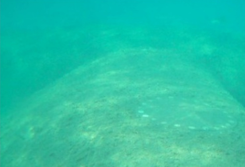

- **file**: `03_images/reefs/kovalam-reef-india/kovalam-reef-india_rwr-underwater-1_unknown-date.jpg`
- **kind**: photo
- **shows**: Turquoise underwater view of a low, sand-covered mound with a ribbed fabric surface rising from the sandy seabed: the reef structure itself.
- **structure visible**: True
- **state shown**: as-built (date unknown)
- **image date**: unknown (ASR beach photos Aug 2009 / Aug 2010 in the composite; others undated; before 2019)
- **citation**: Raised Water Research (2019). Kovalam [spot profile page]; image 'Kovalam Reef Underwater1'. https://raisedwaterresearch.com/spot/artificial-reef/asia/india/kovalam/. Image file https://raisedwaterresearch.com/wp-content/uploads/2019/12/Kovalam-Reef-Underwater1.jpg. Accessed 2026-10-06.
- **image URL**: https://raisedwaterresearch.com/wp-content/uploads/2019/12/Kovalam-Reef-Underwater1.jpg
- **source page**: https://raisedwaterresearch.com/spot/artificial-reef/asia/india/kovalam/
- **page / figure**: page gallery image 'Kovalam-Reef-Underwater1.jpg'
- **credit**: Raised Water Research
- **licence**: no licence stated on the page; link/research copy only - NOT cleared
- **retrieved**: 2026-10-06
- **used for**: context
- **How used for the model**: Page illustration of the submerged structure; not measured (no scale or depth gauge). The 2026-09-25 media recheck classed this image 'unrelated_or_wrong_site' with a description that does not match the file; re-viewed directly on 2026-10-06 the file matches the card description and the file name. Registered with display true - Lior/QA to confirm.
- **3D check pending**: YES - Reef height/crest: the mound looks low and sand-covered; compare with the crest height and slopes in the 07_scale footprint / any future 3D model of Kovalam (values: height_above_seabed, crest_z)
- **linked records**: 02_research/reefs/kovalam-reef-india.json images / images_rejected; 05_qa/reef/kovalam-reef-india_media_recheck.json
- **size**: 0.13 MB, 505x345 px
- **sha256**: 5bf85cc17ea1fd64a95d913621bea6eaab2a87997f785db9b69861acaea66ff1
- **rights**: Private research copy; reuse rights to be checked before any public release.
- **display in HTML**: True
- **added by**: image-registry backfill, 2026-10-06

## kovalam-reef-india-img-04 - Kovalam-Reef-Underwater2.jpg: second underwater view of the submerged reef mound with fish (RWR)

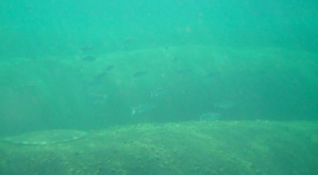

- **file**: `03_images/reefs/kovalam-reef-india/kovalam-reef-india_rwr-underwater-2_unknown-date.jpg`
- **kind**: photo
- **shows**: Underwater view along the low sandy reef mound with small fish above it.
- **structure visible**: True
- **state shown**: as-built (date unknown)
- **image date**: unknown (ASR beach photos Aug 2009 / Aug 2010 in the composite; others undated; before 2019)
- **citation**: Raised Water Research (2019). Kovalam [spot profile page]; image 'Kovalam Reef Underwater2'. https://raisedwaterresearch.com/spot/artificial-reef/asia/india/kovalam/. Image file https://raisedwaterresearch.com/wp-content/uploads/2019/12/Kovalam-Reef-Underwater2.jpg. Accessed 2026-10-06.
- **image URL**: https://raisedwaterresearch.com/wp-content/uploads/2019/12/Kovalam-Reef-Underwater2.jpg
- **source page**: https://raisedwaterresearch.com/spot/artificial-reef/asia/india/kovalam/
- **page / figure**: page gallery image 'Kovalam-Reef-Underwater2.jpg'
- **credit**: Raised Water Research
- **licence**: no licence stated on the page; link/research copy only - NOT cleared
- **retrieved**: 2026-10-06
- **used for**: context
- **How used for the model**: Page illustration of the submerged structure; not measured. The 2026-09-25 media recheck classed this image 'unrelated_or_wrong_site' with a description that does not match the file; re-viewed directly on 2026-10-06 the file matches the card description and the file name. Registered with display true - Lior/QA to confirm.
- **3D check pending**: YES - Reef height/crest: second view of the low mound; compare with any future 3D model (values: height_above_seabed, crest_z)
- **linked records**: 02_research/reefs/kovalam-reef-india.json images / images_rejected; 05_qa/reef/kovalam-reef-india_media_recheck.json
- **size**: 0.16 MB, 645x356 px
- **sha256**: 84d44922e18892dee2d861ac23e70794f0dd9c768f7c53e92926c85c60e4ceb0
- **rights**: Private research copy; reuse rights to be checked before any public release.
- **display in HTML**: True
- **added by**: image-registry backfill, 2026-10-06

## kovalam-reef-india-img-05 - ASR-beach-widening.jpg: ASR model beach-level plans (without / with reef) and Aug 2009 vs Aug 2010 photos (RWR)

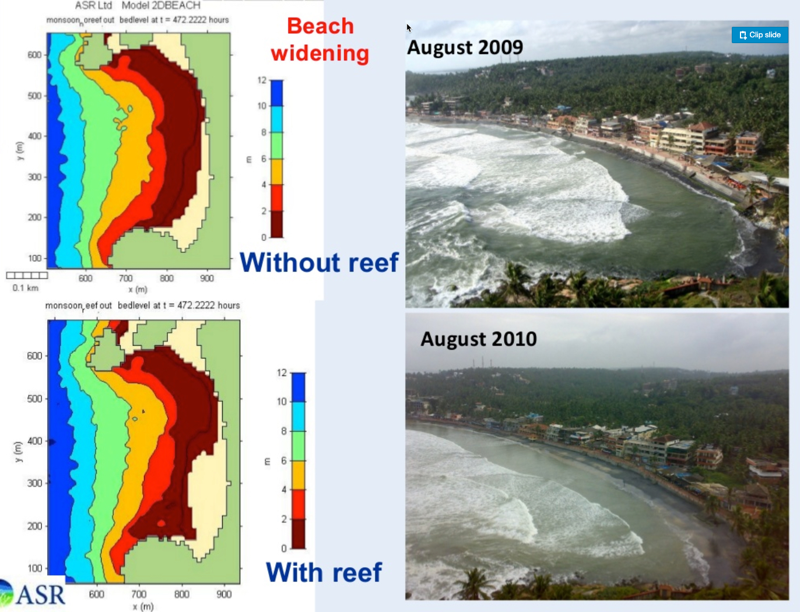

- **file**: `03_images/reefs/kovalam-reef-india/kovalam-reef-india_rwr-asr-beach-widening_unknown-date.jpg`
- **kind**: plan_figure
- **shows**: Composite slide credited to ASR: two colour-coded modelled beach-level plans ('Without reef' / 'With reef', headed 'Beach widening') beside oblique photos of the beach in August 2009 and August 2010.
- **structure visible**: False
- **state shown**: as-built (before: Aug 2009; after: Aug 2010)
- **image date**: unknown (ASR beach photos Aug 2009 / Aug 2010 in the composite; others undated; before 2019)
- **citation**: Raised Water Research (2019). Kovalam [spot profile page]; image 'ASR beach widening'. https://raisedwaterresearch.com/spot/artificial-reef/asia/india/kovalam/. Image file https://raisedwaterresearch.com/wp-content/uploads/2019/12/ASR-beach-widening.jpg. Accessed 2026-10-06.
- **image URL**: https://raisedwaterresearch.com/wp-content/uploads/2019/12/ASR-beach-widening.jpg
- **source page**: https://raisedwaterresearch.com/spot/artificial-reef/asia/india/kovalam/
- **page / figure**: page gallery image 'ASR-beach-widening.jpg'
- **credit**: Raised Water Research (credited on the page to ASR Ltd)
- **licence**: no licence stated on the page; link/research copy only - NOT cleared
- **retrieved**: 2026-10-06
- **used for**: context
- **How used for the model**: Page illustration of ASR's beach-widening claim (cited in the card's 'outcome'). No numbers extracted from the model panels (too coarse). The 2026-09-25 media recheck classed this image 'unrelated_or_wrong_site' with a description that does not match the file; re-viewed directly on 2026-10-06 the file matches the card description and the file name. Registered with display true - Lior/QA to confirm.
- **3D check pending**: no - none: whole-bay model panels, no crest or footprint values
- **linked records**: 02_research/reefs/kovalam-reef-india.json images / images_rejected; 05_qa/reef/kovalam-reef-india_media_recheck.json
- **size**: 1.06 MB, 1372x1050 px
- **sha256**: ae2898884e7c42cac00dd2ee32f41239ef4a8afd0b7feddc197e1e9851725a78
- **rights**: Private research copy; reuse rights to be checked before any public release.
- **display in HTML**: True
- **added by**: image-registry backfill, 2026-10-06

## kovalam-reef-india-img-06 - ASR brochure figure: construction-phase aerial of the reef, a surfing wave on the reef, and wave-height models 'Reef' vs 'No Reef'

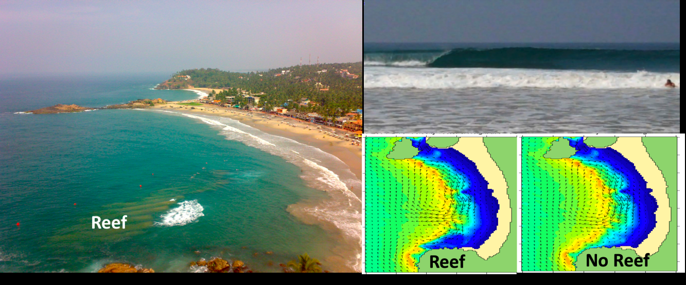

- **file**: `03_images/reefs/kovalam-reef-india/kovalam-reef-india_asr-brochure-composite_2011.png`
- **kind**: aerial
- **shows**: Composite: the aerial from the rocky point with the reef labelled 'Reef' (dark submerged patch, whitewater on its seaward edge, red marker buoys), a surfing wave, and two whole-bay wave-height model panels 'Reef' / 'No Reef'.
- **structure visible**: True
- **state shown**: as-built (just after completion, Feb 2010)
- **image date**: reef completed February 2010; brochure 2011-03-24
- **citation**: ASR Ltd (2011; PDF created 2011-03-24, author field 'Adam Iscoff - Daigian'). Multi-Purpose Reef Design and Construction, Kovalam, India [2-page project brochure], page 1, composite figure (embedded raster 1333 x 555 px; caption 'Clockwise from upper left: aerial view of the Kovalam Multi-Purpose Reef; high quality surfing wave breaking along the reef; wave height models after and before construction'). Client: Harbour Engineering Department, Government of Kerala. Internet Archive capture of http://web.archive.org/web/20111106035249/http://www.asrltd.com/media/project-pdf/kovalam-coastal-protection.pdf (page http://web.archive.org/web/20111106035249/http://www.asrltd.com/projects/kovalam-coastal-protection.php). Accessed 2026-10-05.
- **image URL**: http://web.archive.org/web/20111106035249/http://www.asrltd.com/media/project-pdf/kovalam-coastal-protection.pdf
- **source page**: http://web.archive.org/web/20111106035249/http://www.asrltd.com/projects/kovalam-coastal-protection.php
- **page / figure**: page 1, embedded raster xref 13
- **credit**: ASR Ltd
- **licence**: not stated (company brochure) - NOT cleared; Wayback copy
- **retrieved**: 2026-10-06
- **used for**: context; cross_check
- **How used for the model**: Source of img1 (the aerial crop below). The model panels were inspected for a depth legend/footprint and found too coarse for any number (07_scale/reefs/kovalam-reef-india.md S2).
- **3D check pending**: no - none: composite already examined; whole-bay model panels
- **source PDF**: `07_scale/shapes/kovalam-reef-india/src/asr_brochure_wayback.pdf`
- **linked records**: 07_scale/reefs/kovalam-reef-india.md S2; 07_scale/shapes/kovalam-reef-india/src/asr_brochure_wayback.pdf
- **size**: 1.33 MB, 1333x555 px
- **sha256**: 479ca65a76f622c50e29f2037b82035dedda480fde51af63ebd309ca512ec25b
- **rights**: Private research copy; reuse rights to be checked before any public release.
- **display in HTML**: True
- **added by**: image-registry backfill, 2026-10-06

## kovalam-reef-india-img-07 - ASR aerial of the Kovalam reef from the rocky point (crop of the brochure composite; 'Reef' label, whitewater on the seaward edge, marker buoys)

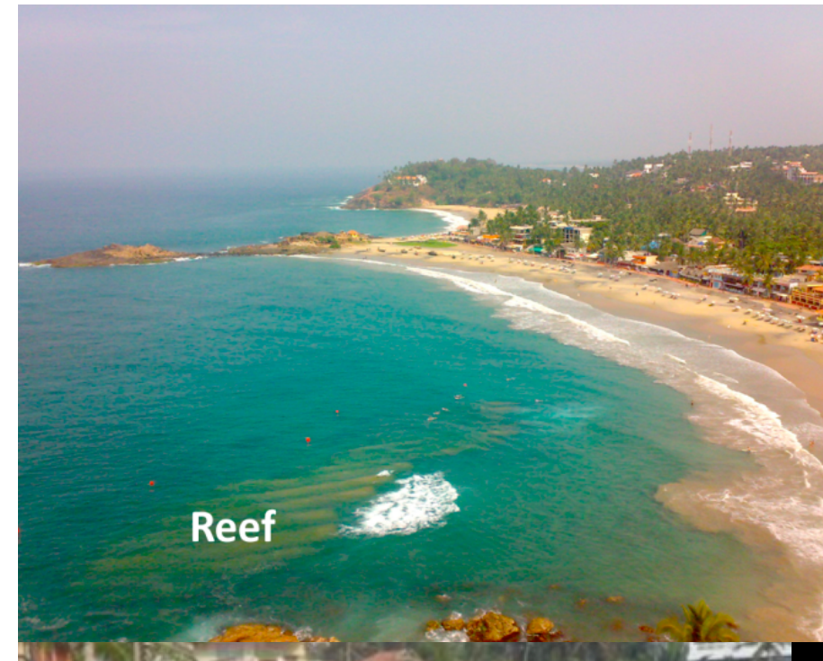

- **file**: `07_scale/shapes/kovalam-reef-india/src/img1_asr_aerial.png`
- **kind**: aerial
- **shows**: Aerial view from the rocky point looking along Lighthouse Beach: a dark submerged patch labelled 'Reef' with whitewater breaking over its seaward edge, red marker buoys near it, swimmers near the shore.
- **structure visible**: True
- **state shown**: as-built (construction-phase / just completed)
- **image date**: after completion, Feb 2010 - Mar 2011 (brochure date)
- **citation**: ASR Ltd (2011; PDF created 2011-03-24, author field 'Adam Iscoff - Daigian'). Multi-Purpose Reef Design and Construction, Kovalam, India [2-page project brochure], page 1, aerial photo (crop of the composite raster; rendered/cropped with PyMuPDF at 400 dpi in the 2026-09-25 adversarial re-check). Client: Harbour Engineering Department, Government of Kerala. Internet Archive capture of http://web.archive.org/web/20111106035249/http://www.asrltd.com/media/project-pdf/kovalam-coastal-protection.pdf (page http://web.archive.org/web/20111106035249/http://www.asrltd.com/projects/kovalam-coastal-protection.php). Accessed 2026-10-05.
- **image URL**: http://web.archive.org/web/20111106035249/http://www.asrltd.com/media/project-pdf/kovalam-coastal-protection.pdf
- **source page**: http://web.archive.org/web/20111106035249/http://www.asrltd.com/projects/kovalam-coastal-protection.php
- **page / figure**: page 1, aerial panel
- **credit**: ASR Ltd
- **licence**: not stated (company brochure) - NOT cleared
- **retrieved**: 2026-10-04
- **used for**: plan_trace; cross_check
- **How used for the model**: Source of the draft pixel polygon (pixel_polys_img1.json, 11 vertices, overlays img1_zoom1-7 and img1_overlay_check): a smooth crescent/delta wedge, ~35-76 m offshore (centroid 56 m, low confidence). No shape.json was finalised for Kovalam; the earlier text-derived footprint (07_scale/reefs/kovalam-reef-india.footprint.json) used this photo as qualitative evidence only.
- **3D check pending**: YES - Planform and offshore distance: the draft polygon (smooth crescent, ~56 m offshore) vs a stepped/zigzag typology suggested by the outline image (img2); re-trace against img2 and the satellite frames before any 3D model (values: planform, position)
- **annotated / overlay files**: `07_scale/shapes/kovalam-reef-india/overlays/img1_overlay_check.png`; `07_scale/shapes/kovalam-reef-india/overlays/img1_overlay_check2.png`; `07_scale/shapes/kovalam-reef-india/overlays/img1_zoom1.png`; `07_scale/shapes/kovalam-reef-india/overlays/img1_zoom2.png`; `07_scale/shapes/kovalam-reef-india/overlays/img1_zoom3.png`; `07_scale/shapes/kovalam-reef-india/overlays/img1_zoom4.png`; `07_scale/shapes/kovalam-reef-india/overlays/img1_zoom5.png`; `07_scale/shapes/kovalam-reef-india/overlays/img1_zoom6.png`; `07_scale/shapes/kovalam-reef-india/overlays/img1_zoom7.png`
- **source PDF**: `07_scale/shapes/kovalam-reef-india/src/asr_brochure_wayback.pdf`
- **linked records**: 07_scale/reefs/kovalam-reef-india.md S2; 07_scale/shapes/kovalam-reef-india/pixel_polys_img1.json
- **size**: 0.83 MB, 915x735 px
- **sha256**: 76280513eeb90779e4fa7e2dc1c4c69df07500ad8e02f664bd7f380ae2fc16de
- **rights**: Private research copy; reuse rights to be checked before any public release.
- **display in HTML**: True
- **added by**: image-registry backfill, 2026-10-06

## kovalam-reef-india-img-08 - Kovalam-Outline.jpg: 'Monsoon swell breaks across Kovalam Reef' with a hand-drawn break-line (RWR)

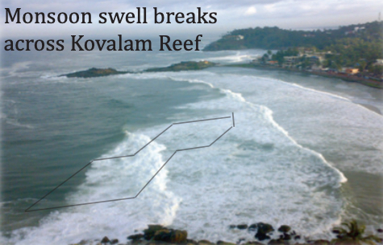

- **file**: `07_scale/shapes/kovalam-reef-india/src/img2_rwr_outline.jpg`
- **kind**: aerial
- **shows**: Oblique photo of monsoon swell breaking across the reef with a hand-drawn stepped, zigzag polyline (at least 4 straight segments, 3 sharp-angle vertices) tracing the visible break line.
- **structure visible**: True
- **state shown**: as-built (monsoon break line)
- **image date**: unknown (monsoon swell day; before 2019)
- **citation**: Raised Water Research (2019). Kovalam [spot profile page]; image 'Kovalam Outline ('Monsoon swell breaks across Kovalam Reef')'. https://raisedwaterresearch.com/spot/artificial-reef/asia/india/kovalam/. Image file https://raisedwaterresearch.com/wp-content/uploads/2019/12/Kovalam-Outline.jpg. Accessed 2026-10-06. (first downloaded 2026-09-25; re-checked by sha256 2026-10-06)
- **image URL**: https://raisedwaterresearch.com/wp-content/uploads/2019/12/Kovalam-Outline.jpg
- **source page**: https://raisedwaterresearch.com/spot/artificial-reef/asia/india/kovalam/
- **page / figure**: page gallery image (475 x 305 px)
- **credit**: Raised Water Research
- **licence**: no licence stated on the page; link/research copy only - NOT cleared
- **retrieved**: 2026-09-25
- **used for**: cross_check; plan_trace
- **How used for the model**: Strongest shape evidence for the chevron/echelon fan typology in the dossier (S3, 07_scale/reefs/kovalam-reef-india.md): the polyline could be the crest outline or just the foam line - no source says which; no scale, so qualitative only.
- **3D check pending**: YES - Typology: stepped zigzag break line (chevron/echelon fan of ~30 m units?) vs the smooth crescent in the draft polygon; settle before shape/3D (values: planform)
- **linked records**: 07_scale/reefs/kovalam-reef-india.md S3
- **size**: 0.18 MB, 475x305 px
- **sha256**: 7c69fcaf74fa7364a80955727db24d983086c0c6e5cc56f5aa7acde2e9d7a762
- **rights**: Private research copy; reuse rights to be checked before any public release.
- **display in HTML**: True
- **added by**: image-registry backfill, 2026-10-06

## kovalam-reef-india-img-09 - Esri World Imagery Wayback release 10, z17, r=300 m around 8.3885, 76.9745 (507 x 508 px, 1.18 m/px)

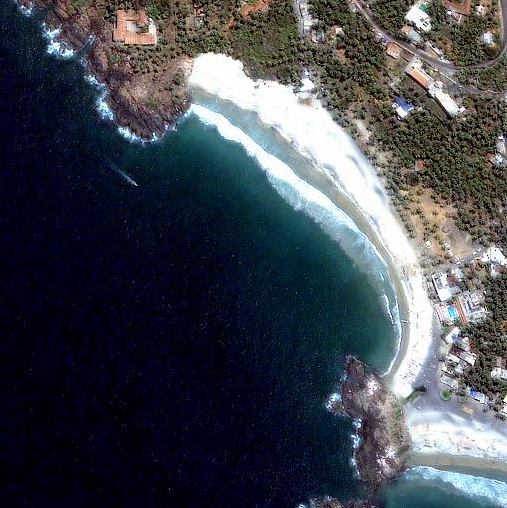

- **file**: `07_scale/shapes/kovalam-reef-india/src/satellite_2014.png`
- **kind**: satellite
- **shows**: Coastal satellite frame of Kovalam Lighthouse Beach and the rocky headland; the reef is submerged and not resolved here.
- **structure visible**: False
- **state shown**: as-built (submerged; not visible in imagery)
- **image date**: 2011-02-28
- **citation**: Esri, Maxar, Earthstar Geographics, and the GIS User Community (2011). World Imagery Wayback release 10, image captured 2011-02-28. Esri World Imagery tile service, https://server.arcgisonline.com/ArcGIS/rest/services/World_Imagery/MapServer, via Esri Wayback https://livingatlas.arcgis.com/wayback/. Accessed 2026-10-04.
- **image URL**: https://wayback.maptiles.arcgis.com/arcgis/rest/services/World_Imagery/WMTS/1.0.0/default028mm/MapServer/tile/10/{z}/{y}/{x}
- **source page**: Esri World Imagery Wayback
- **page / figure**: Esri World Imagery Wayback release 10, z17, r=300 m around 8.3885, 76.9745 (507 x 508 px, 1.18 m/px); sidecar satellite_2014.png.geo.json
- **credit**: Esri, Maxar, Earthstar Geographics, and the GIS User Community
- **licence**: Esri/Maxar imagery terms (not an open licence); private research copy only
- **retrieved**: 2026-10-04
- **used for**: context
- **How used for the model**: Fetched 2026-10-04 for the shape work; no trace made on it (no sources.md/shape.json for Kovalam). Oldest frame: reef period (after Feb 2010 completion); first locator check of the site. (File name says 2014 but the sidecar capture date is 2011-02-28.)
- **3D check pending**: no - none: reef not visible in the frame
- **linked records**: 07_scale/shapes/kovalam-reef-india/src/satellite_2014.png.geo.json
- **size**: 0.47 MB, 507x508 px
- **sha256**: 8b07818bd5e704494c38e35dddab033614073a8b2321508c88be72b4bed370c9
- **rights**: Private research copy; reuse rights to be checked before any public release.
- **display in HTML**: True
- **added by**: image-registry backfill, 2026-10-06

## kovalam-reef-india-img-10 - Esri World Imagery current layer, z19, r=350 m around 8.4004, 76.9787 (2369 x 2370 px, 0.295 m/px)

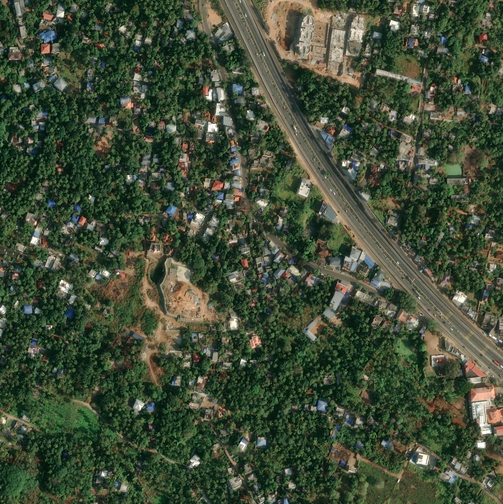

- **file**: `07_scale/shapes/kovalam-reef-india/src/satellite_current.png`
- **kind**: satellite
- **shows**: Coastal satellite frame of Kovalam Lighthouse Beach and the rocky headland; the reef is submerged and not resolved here.
- **structure visible**: False
- **state shown**: as-built (submerged; not visible in imagery)
- **image date**: 2026-01-23
- **citation**: Esri, Maxar, Earthstar Geographics, and the GIS User Community (2026). World Imagery (current layer), image captured 2026-01-23. Esri World Imagery tile service, https://server.arcgisonline.com/ArcGIS/rest/services/World_Imagery/MapServer. Accessed 2026-10-04.
- **image URL**: https://server.arcgisonline.com/ArcGIS/rest/services/World_Imagery/MapServer/tile/{z}/{y}/{x}
- **source page**: Esri World Imagery (identify DATE field)
- **page / figure**: Esri World Imagery current layer, z19, r=350 m around 8.4004, 76.9787 (2369 x 2370 px, 0.295 m/px); sidecar satellite_current.png.geo.json
- **credit**: Esri, Maxar, Earthstar Geographics, and the GIS User Community
- **licence**: Esri/Maxar imagery terms (not an open licence); private research copy only
- **retrieved**: 2026-10-04
- **used for**: context
- **How used for the model**: Fetched 2026-10-04 for the shape work; no trace made on it (no sources.md/shape.json for Kovalam). Frame at the card coordinates (Lighthouse Beach).
- **3D check pending**: no - none: reef not visible in the frame
- **linked records**: 07_scale/shapes/kovalam-reef-india/src/satellite_current.png.geo.json
- **size**: 9.86 MB, 2369x2370 px
- **sha256**: c4d596b726adf58ffc0972edaddcf2bf89399d27dbd52b11a63d465a9324221b
- **rights**: Private research copy; reuse rights to be checked before any public release.
- **display in HTML**: True
- **added by**: image-registry backfill, 2026-10-06

## kovalam-reef-india-img-11 - Esri World Imagery current layer, z19, r=350 m around 8.3948, 76.9715 (2370 x 2370 px, 0.295 m/px)

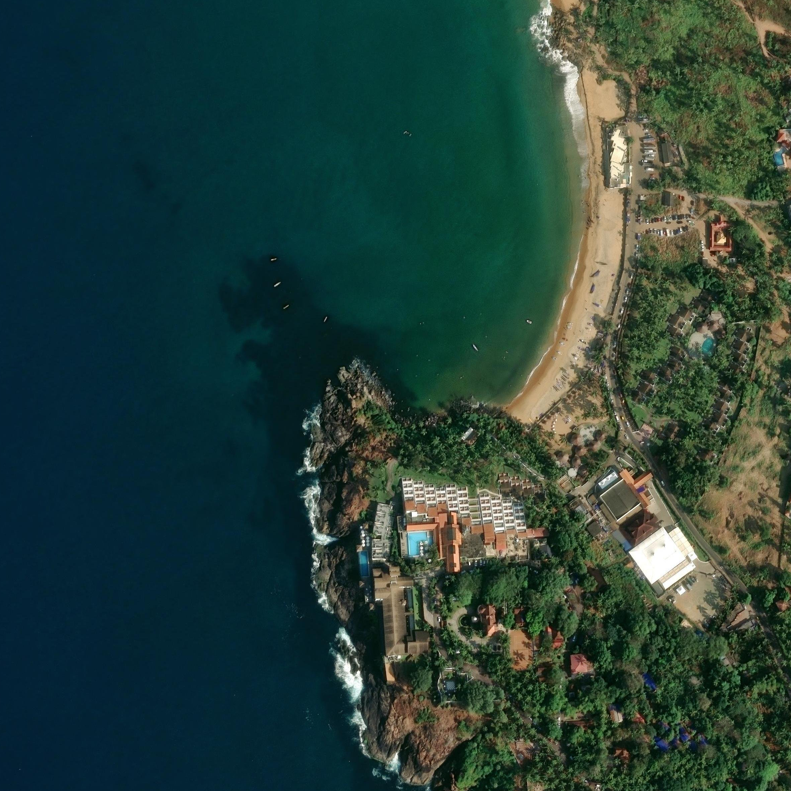

- **file**: `07_scale/shapes/kovalam-reef-india/src/satellite_point.png`
- **kind**: satellite
- **shows**: Coastal satellite frame of Kovalam Lighthouse Beach and the rocky headland; the reef is submerged and not resolved here.
- **structure visible**: False
- **state shown**: as-built (submerged; not visible in imagery)
- **image date**: 2026-01-23
- **citation**: Esri, Maxar, Earthstar Geographics, and the GIS User Community (2026). World Imagery (current layer), image captured 2026-01-23. Esri World Imagery tile service, https://server.arcgisonline.com/ArcGIS/rest/services/World_Imagery/MapServer. Accessed 2026-10-04.
- **image URL**: https://server.arcgisonline.com/ArcGIS/rest/services/World_Imagery/MapServer/tile/{z}/{y}/{x}
- **source page**: Esri World Imagery (identify DATE field)
- **page / figure**: Esri World Imagery current layer, z19, r=350 m around 8.3948, 76.9715 (2370 x 2370 px, 0.295 m/px); sidecar satellite_point.png.geo.json
- **credit**: Esri, Maxar, Earthstar Geographics, and the GIS User Community
- **licence**: Esri/Maxar imagery terms (not an open licence); private research copy only
- **retrieved**: 2026-10-04
- **used for**: context
- **How used for the model**: Fetched 2026-10-04 for the shape work; no trace made on it (no sources.md/shape.json for Kovalam). Frame around the rocky point.
- **3D check pending**: no - none: reef not visible in the frame
- **linked records**: 07_scale/shapes/kovalam-reef-india/src/satellite_point.png.geo.json
- **size**: 5.52 MB, 2370x2370 px
- **sha256**: 50acbb3733ad1a261371bb28448514392b048cbe716777a34f9a6ba7007c54d0
- **rights**: Private research copy; reuse rights to be checked before any public release.
- **display in HTML**: True
- **added by**: image-registry backfill, 2026-10-06

## kovalam-reef-india-img-12 - Esri World Imagery current layer, z17, r=600 m around 8.39, 76.971 (1016 x 1015 px, 1.18 m/px)

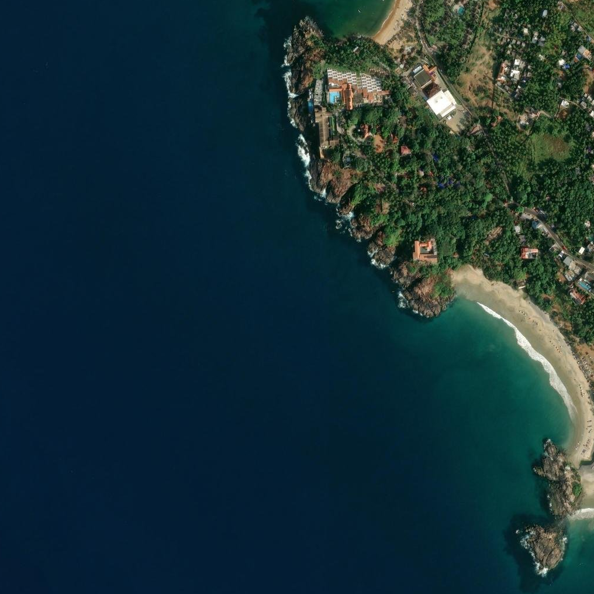

- **file**: `07_scale/shapes/kovalam-reef-india/src/satellite_south.png`
- **kind**: satellite
- **shows**: Coastal satellite frame of Kovalam Lighthouse Beach and the rocky headland; the reef is submerged and not resolved here.
- **structure visible**: False
- **state shown**: as-built (submerged; not visible in imagery)
- **image date**: 2026-01-23
- **citation**: Esri, Maxar, Earthstar Geographics, and the GIS User Community (2026). World Imagery (current layer), image captured 2026-01-23. Esri World Imagery tile service, https://server.arcgisonline.com/ArcGIS/rest/services/World_Imagery/MapServer. Accessed 2026-10-04.
- **image URL**: https://server.arcgisonline.com/ArcGIS/rest/services/World_Imagery/MapServer/tile/{z}/{y}/{x}
- **source page**: Esri World Imagery (identify DATE field)
- **page / figure**: Esri World Imagery current layer, z17, r=600 m around 8.39, 76.971 (1016 x 1015 px, 1.18 m/px); sidecar satellite_south.png.geo.json
- **credit**: Esri, Maxar, Earthstar Geographics, and the GIS User Community
- **licence**: Esri/Maxar imagery terms (not an open licence); private research copy only
- **retrieved**: 2026-10-04
- **used for**: context
- **How used for the model**: Fetched 2026-10-04 for the shape work; no trace made on it (no sources.md/shape.json for Kovalam). Southern frame (headland side).
- **3D check pending**: no - none: reef not visible in the frame
- **linked records**: 07_scale/shapes/kovalam-reef-india/src/satellite_south.png.geo.json
- **size**: 0.73 MB, 1016x1015 px
- **sha256**: 37cc1d79f8669616468d32ceb760d3807c5425d3acfb633be29165ff730d8331
- **rights**: Private research copy; reuse rights to be checked before any public release.
- **display in HTML**: True
- **added by**: image-registry backfill, 2026-10-06

## kovalam-reef-india-img-13 - Esri World Imagery current layer, z16, r=1200 m around 8.4004, 76.9787 (1015 x 1016 px, 2.36 m/px)

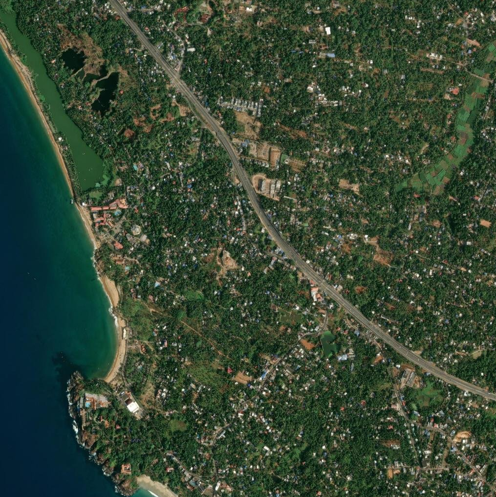

- **file**: `07_scale/shapes/kovalam-reef-india/src/satellite_wide.png`
- **kind**: satellite
- **shows**: Coastal satellite frame of Kovalam Lighthouse Beach and the rocky headland; the reef is submerged and not resolved here.
- **structure visible**: False
- **state shown**: as-built (submerged; not visible in imagery)
- **image date**: 2026-01-23
- **citation**: Esri, Maxar, Earthstar Geographics, and the GIS User Community (2026). World Imagery (current layer), image captured 2026-01-23. Esri World Imagery tile service, https://server.arcgisonline.com/ArcGIS/rest/services/World_Imagery/MapServer. Accessed 2026-10-04.
- **image URL**: https://server.arcgisonline.com/ArcGIS/rest/services/World_Imagery/MapServer/tile/{z}/{y}/{x}
- **source page**: Esri World Imagery (identify DATE field)
- **page / figure**: Esri World Imagery current layer, z16, r=1200 m around 8.4004, 76.9787 (1015 x 1016 px, 2.36 m/px); sidecar satellite_wide.png.geo.json
- **credit**: Esri, Maxar, Earthstar Geographics, and the GIS User Community
- **licence**: Esri/Maxar imagery terms (not an open licence); private research copy only
- **retrieved**: 2026-10-04
- **used for**: context
- **How used for the model**: Fetched 2026-10-04 for the shape work; no trace made on it (no sources.md/shape.json for Kovalam). Wide locator frame.
- **3D check pending**: no - none: reef not visible in the frame
- **linked records**: 07_scale/shapes/kovalam-reef-india/src/satellite_wide.png.geo.json
- **size**: 1.98 MB, 1015x1016 px
- **sha256**: 5c810de9cd54672a1ea731dbf1526627b386708c2b8c1b7617d2a11418f31b88
- **rights**: Private research copy; reuse rights to be checked before any public release.
- **display in HTML**: True
- **added by**: image-registry backfill, 2026-10-06

## kovalam-reef-india-img-14 - Esri World Imagery current layer, z19, r=350 m around 8.3864, 76.9743 (2370 x 2370 px, 0.295 m/px)

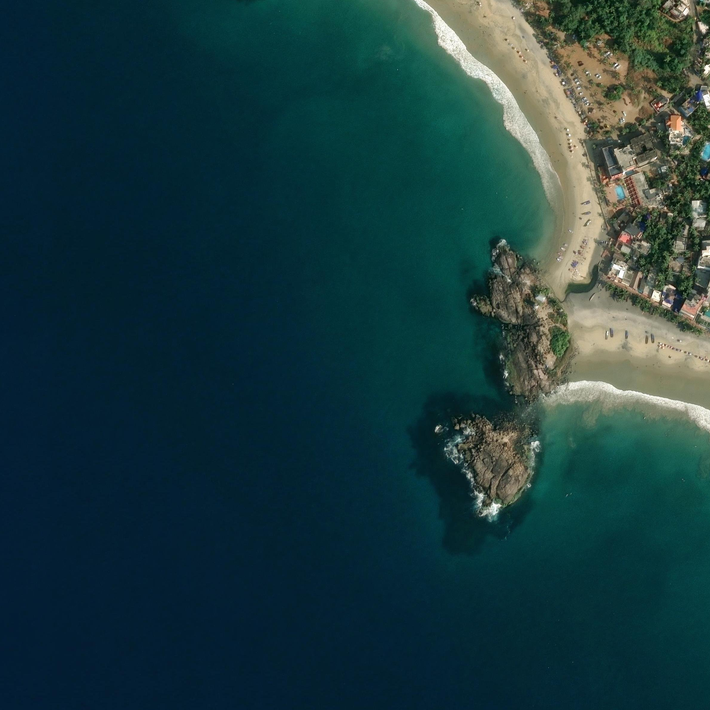

- **file**: `07_scale/shapes/kovalam-reef-india/src/satellite_zoom.png`
- **kind**: satellite
- **shows**: Coastal satellite frame of Kovalam Lighthouse Beach and the rocky headland; the reef is submerged and not resolved here.
- **structure visible**: False
- **state shown**: as-built (submerged; not visible in imagery)
- **image date**: 2026-01-23
- **citation**: Esri, Maxar, Earthstar Geographics, and the GIS User Community (2026). World Imagery (current layer), image captured 2026-01-23. Esri World Imagery tile service, https://server.arcgisonline.com/ArcGIS/rest/services/World_Imagery/MapServer. Accessed 2026-10-04.
- **image URL**: https://server.arcgisonline.com/ArcGIS/rest/services/World_Imagery/MapServer/tile/{z}/{y}/{x}
- **source page**: Esri World Imagery (identify DATE field)
- **page / figure**: Esri World Imagery current layer, z19, r=350 m around 8.3864, 76.9743 (2370 x 2370 px, 0.295 m/px); sidecar satellite_zoom.png.geo.json
- **credit**: Esri, Maxar, Earthstar Geographics, and the GIS User Community
- **licence**: Esri/Maxar imagery terms (not an open licence); private research copy only
- **retrieved**: 2026-10-04
- **used for**: context
- **How used for the model**: Fetched 2026-10-04 for the shape work; no trace made on it (no sources.md/shape.json for Kovalam). Frame over the Lighthouse Beach reef position (south of the card coordinates).
- **3D check pending**: no - none: reef not visible in the frame
- **linked records**: 07_scale/shapes/kovalam-reef-india/src/satellite_zoom.png.geo.json
- **size**: 3.39 MB, 2370x2370 px
- **sha256**: 356f7e7704a86d7922fb2b19c325c539ba6e14614e2010b94e0239815d9e6d4f
- **rights**: Private research copy; reuse rights to be checked before any public release.
- **display in HTML**: True
- **added by**: image-registry backfill, 2026-10-06
