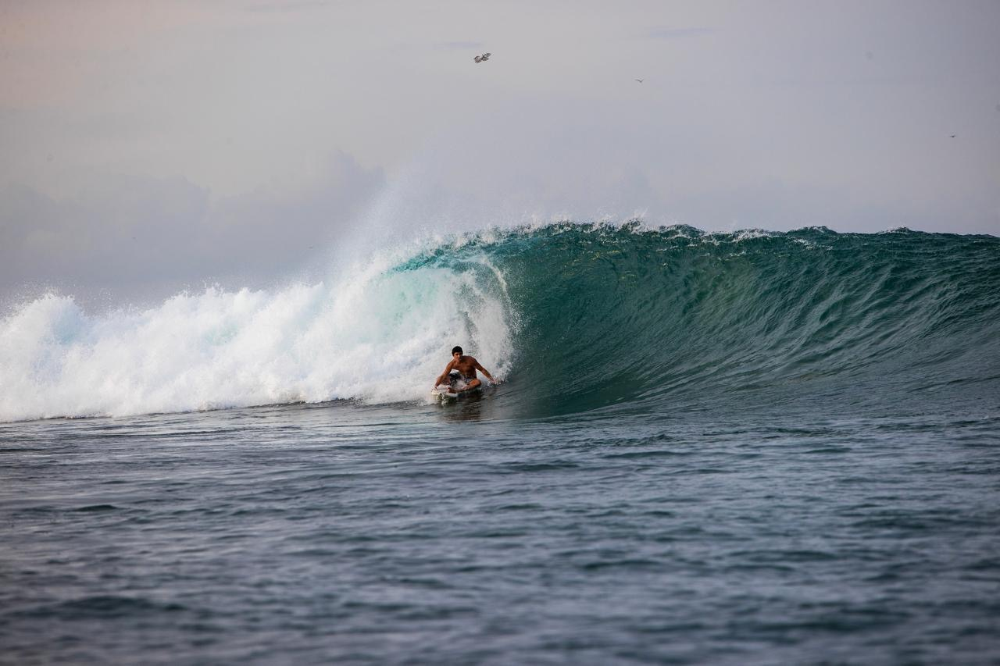
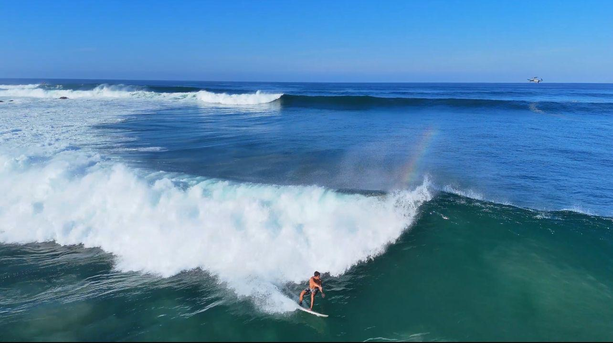

# Image registry - mexico-reef-2026-unnamed

Source of truth: `images.json` in this folder (convention: `_agent_briefs/image_registry.md`; overview: `03_images/reefs/README.md`). This file is generated from it.

2 images registered, 2 with a file, 0 used for the model (any use other than context/not_used).

## mexico-reef-2026-unnamed-img-01 - Header image of RWR's 'Unveiling the new reef in Mexico': a surfer riding inside a breaking wave (RWR, Mar 2026)

- **file**: `03_images/reefs/mexico-reef-2026-unnamed/mexico-reef-2026-unnamed_rwr-header-surfer-barrel_2026-03.jpg`
- **kind**: photo
- **shows**: A surfer riding inside a breaking wave in an open Pacific setting; no reef structure, rock feature or recognisable landmark in the frame (site context at best).
- **structure visible**: False
- **state shown**: as-built, in service (2026; location undisclosed)
- **image date**: 2026-03 (upload path 2026/03; post 2026-03-31)
- **citation**: Indelicato, Peter / Raised Water Research (2026-03-31). Unveiling the new reef in Mexico [news post, Surf Reef News; invites to the 16 April 2026 unveiling by the California Surf Club]. https://raisedwaterresearch.com/unveiling-the-new-reef-in-mexico/. Image file https://raisedwaterresearch.com/wp-content/uploads/2026/03/Reef2.jpg (card used the same file). Accessed 2026-10-06.
- **image URL**: https://raisedwaterresearch.com/wp-content/uploads/2026/03/Reef2.jpg
- **source page**: https://raisedwaterresearch.com/unveiling-the-new-reef-in-mexico/
- **page / figure**: post header image (1280 x 853 px)
- **credit**: Raised Water Research (post by Peter Indelicato; photographer not stated)
- **licence**: All rights reserved; no licence stated on the page; link/research copy only - NOT cleared
- **retrieved**: 2026-10-06
- **used for**: context
- **How used for the model**: Page illustration only; the post does not caption it as the reef break, so nothing is measured or inferred from it.
- **3D check pending**: no - none: surf photo, location not confirmed
- **linked records**: 02_research/reefs/mexico-reef-2026-unnamed.json images[0]; 05_qa/reef/mexico-reef-2026-unnamed_media_recheck.json images[0]
- **size**: 0.13 MB, 1280x853 px
- **sha256**: 53d28e84bb0ca30f5789304c01fc3a1f1fd4b92360fd7733f8dffc9bc3947d2a
- **rights**: Private research copy; reuse rights to be checked before any public release.
- **display in HTML**: True
- **added by**: image-registry backfill, 2026-10-06

## mexico-reef-2026-unnamed-img-02 - 'Mexico's first artificial surf reef at Xala': aerial of a clean peeling wave with a surfer (RWR, Apr 2026)

- **file**: `03_images/reefs/mexico-reef-2026-unnamed/mexico-reef-2026-unnamed_rwr-xala-aerial-wave_2026-04.jpg`
- **kind**: aerial
- **shows**: Aerial/drone shot of a clean peeling left-hand wave breaking in one spot with a surfer riding down the line; a helicopter/drone is visible in the frame; the rock reef itself is not visible (submerged).
- **structure visible**: False
- **state shown**: as-built, in service (2026)
- **image date**: 2026-03/04 (upload path 2026/04; post 2026-03-31)
- **citation**: Indelicato, Peter / Raised Water Research (2026-03-31). Unveiling the new reef in Mexico [news post, Surf Reef News; invites to the 16 April 2026 unveiling by the California Surf Club]. https://raisedwaterresearch.com/unveiling-the-new-reef-in-mexico/. Image file https://raisedwaterresearch.com/wp-content/uploads/2026/04/Reef1.jpg (card used the 1024 x 573 px variant Reef1-1024x573.jpg). Accessed 2026-10-06.
- **image URL**: https://raisedwaterresearch.com/wp-content/uploads/2026/04/Reef1.jpg
- **source page**: https://raisedwaterresearch.com/unveiling-the-new-reef-in-mexico/
- **page / figure**: post image captioned "Mexico's first artificial surf reef at Xala" (1284 x 719 px)
- **credit**: Raised Water Research (post by Peter Indelicato; photographer not stated)
- **licence**: All rights reserved; no licence stated on the page; link/research copy only - NOT cleared
- **retrieved**: 2026-10-06
- **used for**: context
- **How used for the model**: Page illustration of the new reef working (hero image per the 2026-09-25 recheck). No scale or landmark, so nothing measured.
- **3D check pending**: YES - Break location relative to the coastline: if the shore and a landmark become identifiable the planform/orientation of the break could be checked once any dimensions are published; no model exists for this reef yet (values: planform, position)
- **linked records**: 02_research/reefs/mexico-reef-2026-unnamed.json images[1]; 05_qa/reef/mexico-reef-2026-unnamed_media_recheck.json images[1]
- **size**: 0.12 MB, 1284x719 px
- **sha256**: d35a812c47de6cea0b01ae75aa47cad3da5db56c16acbcabd28d436bc422425b
- **rights**: Private research copy; reuse rights to be checked before any public release.
- **display in HTML**: True
- **added by**: image-registry backfill, 2026-10-06
