# Image registry - mount-maunganui-reef

Source of truth: `images.json` in this folder (convention: `_agent_briefs/image_registry.md`; overview: `03_images/reefs/README.md`). This file is generated from it.

18 images registered, 18 with a file, 4 used for the model (any use other than context/not_used).

## mount-maunganui-reef-img-01 - BoPRC report Figure 1: aerial view of Mount Reef (arrowed in the report), Mauao and Mount Maunganui Beach

- **file**: `03_images/reefs/mount-maunganui-reef/mount-maunganui-reef_boprc-fig1-aerial_2013.png`
- **kind**: aerial
- **shows**: Wide aerial of the Mauao headland, the harbour entrance and Mount Maunganui town and beach; the reef lies offshore of the beach but is too small/faint to see in the extracted raster.
- **structure visible**: False
- **state shown**: as-built (photo date not stated)
- **image date**: not stated (BoPRC photo; before Dec 2013)
- **citation**: Focus Resource Management Group (2013). Mount Maunganui Reef - Assessment of Management Options. Report prepared for Bay of Plenty Regional Council, December 2013 (PDF created 2014-01-23), PDF page 8 (printed p.7), Figure 1 'Aerial view of Mount Reef (arrowed). Photo supplied by BoPRC.' (embedded raster 2077 x 1172 px; the arrow is a vector overlay not present in this raster). https://www.boprc.govt.nz/media/558385/mount-maunganui-reef-assessment-of-management-options.pdf. Accessed 2026-10-05.
- **image URL**: https://www.boprc.govt.nz/media/558385/mount-maunganui-reef-assessment-of-management-options.pdf
- **source page**: https://www.boprc.govt.nz/media/558385/mount-maunganui-reef-assessment-of-management-options.pdf
- **page / figure**: PDF p.8, Figure 1 (embedded raster xref 18)
- **credit**: Photo supplied by BoPRC; report by Focus Resource Management Group
- **licence**: not stated (council report) - check before reuse
- **retrieved**: 2026-10-06
- **used for**: context
- **How used for the model**: Context only (location of the reef relative to Mauao and the beach). Registered 2026-10-06 from the PDF; listed in sources.md as 'not extracted'. Not measured.
- **3D check pending**: no - none: wide context aerial
- **source PDF**: `07_scale/shapes/mount-maunganui-reef/src/boprc_report.pdf`
- **linked records**: 07_scale/shapes/mount-maunganui-reef/sources.md (Not saved / looked at only); 07_scale/shapes/mount-maunganui-reef/src/boprc_report.pdf
- **size**: 3.51 MB, 2077x1172 px
- **sha256**: b7f9d2d7049e03a301d3ebe143c81799ae28a8f641426ebcd700e1b514f0f56b
- **rights**: Private research copy; reuse rights to be checked before any public release.
- **display in HTML**: True
- **added by**: image-registry backfill, 2026-10-06

## mount-maunganui-reef-img-02 - BoPRC report Figure 2 (top): predicted hydrodynamic circulation around the reef, wave height 1.0 m

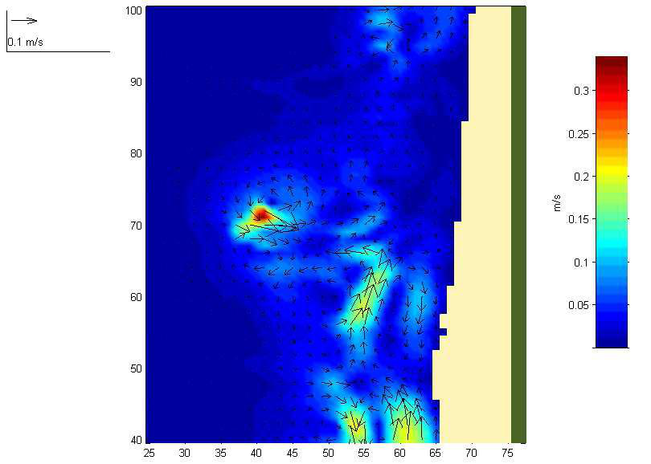

- **file**: `03_images/reefs/mount-maunganui-reef/mount-maunganui-reef_boprc-fig2a-circulation-1.0m_2013.png`
- **kind**: plan_figure
- **shows**: Plan map of modelled current vectors and speed (colour bar to 0.3 m/s) around the reef for 1.0 m waves; shore on the right, scale bar 0.1 km.
- **structure visible**: False
- **state shown**: design/as-built (modelled)
- **image date**: not stated (modelling quoted by the report; original model run date unknown)
- **citation**: Focus Resource Management Group (2013). Mount Maunganui Reef - Assessment of Management Options. Report prepared for Bay of Plenty Regional Council, December 2013 (PDF created 2014-01-23), PDF page 15 (printed p.14), Figure 2 'Predicted hydrodynamic circulations in the vicinity of the reef for wave height of 1.0 m (top) ...' (embedded raster 810 x 578 px). https://www.boprc.govt.nz/media/558385/mount-maunganui-reef-assessment-of-management-options.pdf. Accessed 2026-10-05.
- **image URL**: https://www.boprc.govt.nz/media/558385/mount-maunganui-reef-assessment-of-management-options.pdf
- **source page**: https://www.boprc.govt.nz/media/558385/mount-maunganui-reef-assessment-of-management-options.pdf
- **page / figure**: PDF p.15, Figure 2 top panel (embedded raster xref 33)
- **credit**: Focus Resource Management Group for BoPRC (model output reproduced from earlier ASR work)
- **licence**: not stated - check before reuse
- **retrieved**: 2026-10-06
- **used for**: context
- **How used for the model**: Context only: shows the modelled circulation cell at the reef. No value used for the trace or any model.
- **3D check pending**: no - none: hydrodynamic model output
- **source PDF**: `07_scale/shapes/mount-maunganui-reef/src/boprc_report.pdf`
- **linked records**: 07_scale/shapes/mount-maunganui-reef/src/boprc_report.pdf
- **size**: 0.34 MB, 810x578 px
- **sha256**: 0ec52ba1863d2febce4b7f2e22c0478a2570da50dedbdefd67c44b05c598e9e8
- **rights**: Private research copy; reuse rights to be checked before any public release.
- **display in HTML**: True
- **added by**: image-registry backfill, 2026-10-06

## mount-maunganui-reef-img-03 - BoPRC report Figure 2 (bottom): modelled velocity vectors around the reef (t = 0.5 h)

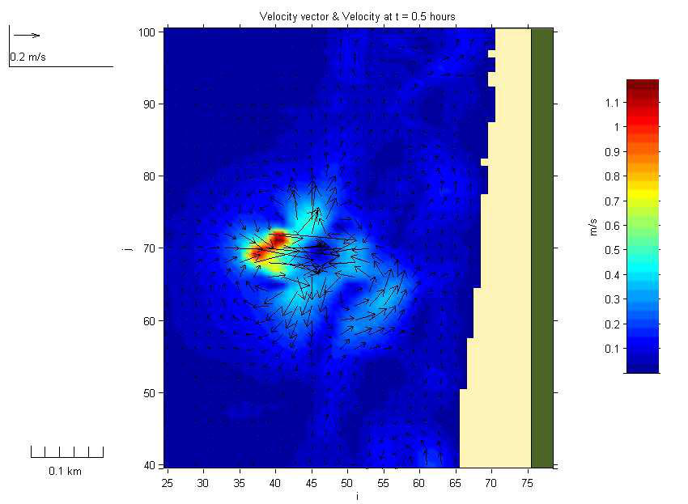

- **file**: `03_images/reefs/mount-maunganui-reef/mount-maunganui-reef_boprc-fig2b-circulation_2013.png`
- **kind**: plan_figure
- **shows**: Plan map of velocity vectors and speed (colour bar to ~1.1 m/s) at t = 0.5 h around the reef; scale bar 0.1 km.
- **structure visible**: False
- **state shown**: design/as-built (modelled)
- **image date**: not stated
- **citation**: Focus Resource Management Group (2013). Mount Maunganui Reef - Assessment of Management Options. Report prepared for Bay of Plenty Regional Council, December 2013 (PDF created 2014-01-23), PDF page 15 (printed p.14), Figure 2 lower panel (embedded raster 850 x 623 px). https://www.boprc.govt.nz/media/558385/mount-maunganui-reef-assessment-of-management-options.pdf. Accessed 2026-10-05.
- **image URL**: https://www.boprc.govt.nz/media/558385/mount-maunganui-reef-assessment-of-management-options.pdf
- **source page**: https://www.boprc.govt.nz/media/558385/mount-maunganui-reef-assessment-of-management-options.pdf
- **page / figure**: PDF p.15, Figure 2 lower panel (embedded raster xref 35)
- **credit**: Focus Resource Management Group for BoPRC
- **licence**: not stated - check before reuse
- **retrieved**: 2026-10-06
- **used for**: context
- **How used for the model**: Context only (second panel of Figure 2). No value used.
- **3D check pending**: no - none: hydrodynamic model output
- **source PDF**: `07_scale/shapes/mount-maunganui-reef/src/boprc_report.pdf`
- **linked records**: 07_scale/shapes/mount-maunganui-reef/src/boprc_report.pdf
- **size**: 0.37 MB, 850x623 px
- **sha256**: b330815b5763188cec1845f5f50ae8b84c0a664abeddb65f786d9ed655ae97c8
- **rights**: Private research copy; reuse rights to be checked before any public release.
- **display in HTML**: True
- **added by**: image-registry backfill, 2026-10-06

## mount-maunganui-reef-img-04 - BoPRC report Figure 5: July 2013 multibeam survey with colour-coded depths (apex bag deflation arrowed)

- **file**: `03_images/reefs/mount-maunganui-reef/mount-maunganui-reef_boprc-fig5-multibeam-2013_2013.png`
- **kind**: survey_plot
- **shows**: Plan-view hillshaded colour-coded DEM of the 18 Jul 2013 multibeam survey with its own NZ-grid '+' ticks (20 m) and a continuous colour bar (-0.19 to -4.90 m, at the right edge of the raster): the delta-wing '7' with the three west-arm bags, the two-bag south arm, the two NE bags and the deflated apex bags (arrowed in the report).
- **structure visible**: True
- **state shown**: as-built, 2013 (five years after completion; apex deflation)
- **image date**: survey 2013-07-18
- **citation**: Focus Resource Management Group (2013). Mount Maunganui Reef - Assessment of Management Options. Report prepared for Bay of Plenty Regional Council, December 2013 (PDF created 2014-01-23), PDF page 27 (printed p.26), Figure 5 'View of July 2013 multibeam survey with colour-coded depths. Note apparent bag deflation near apex (arrowed).' (embedded raster 1299 x 752 px). https://www.boprc.govt.nz/media/558385/mount-maunganui-reef-assessment-of-management-options.pdf. Accessed 2026-10-05.
- **image URL**: https://www.boprc.govt.nz/media/558385/mount-maunganui-reef-assessment-of-management-options.pdf
- **source page**: https://www.boprc.govt.nz/media/558385/mount-maunganui-reef-assessment-of-management-options.pdf
- **page / figure**: PDF p.27, Figure 5 (embedded raster xref 67)
- **credit**: University of Waikato & Discovery Marine Ltd survey, reproduced by Focus RMG / BoPRC
- **licence**: not stated - check before reuse
- **retrieved**: 2026-10-06
- **used for**: cross_check, 3d_crest, 3d_seabed
- **How used for the model**: Second raster of the Fig 3 survey, used by the verifier to check shape.json (source ctx9): ticks read (4.2165 px/m), hue -> colour bar -> depth (open seabed NE -3.13 m CD = Fig 3 -3.1 m). Depth < -2.0 m mask 1,074 m2 vs 1,072 m2 of the img1 outline, IoU 0.93, zero shift. Crest depths inside the outline (m CD, shallowest 5 % / median): west block -0.79 / -1.35, south arm -0.32 / -1.35, mid-top bag -1.11 / -1.58, NE lobe -1.04 / -1.49; deflated apex bags about 73 m2 at -2.0 to -2.4 m CD (median -2.26) outside the -2.0 m outline; 2013 bed plane z = -1.78 - 0.0131 X + 0.0098 Y (X east, Y south, m from the 376620 / 812980 tick), -2.4 m CD at the reef centroid. Goes to VERIFY.md (3D inputs check) and METHOD.md 'Inputs for 3D' annotations. Correction: this raster DOES contain a colour bar.
- **3D check pending**: no - RESOLVED by the 3D agent 2026-10-06. Result: 3D agent 2026-10-06: CONFIRMED the crest. Main-bag crest -0.8 to -1.0 m CD read off Fig 5 (west block shallowest 5 % -0.80, south-arm hot spot -0.33) matches the model crest -0.9 m CD (z = -2.03 m MSL). 2013 bed -2.4 (NW) to -3.3 (seaward) m CD is 0.7-1.6 m SHALLOWER than the as-built bed -4.0 m CD of the model (2008-09 vs 2013 state; Navionics 2026 reads about -2.75 CD): flagged, bed-level selector -3.0/-3.5/-4.0/-4.5 provided and the volume check shows the stated 2,800 m3 matches a bed of about -3.65 CD. Apex deflated bags (-2.0 to -2.4 CD) are a 2013 state: not modelled in the as-built state, caption note only. Fig 5 DEM also used for the -2.0 m rise profile of the bags (SOURCES_3D / METHODS_3D s3, s4).
- **annotated / overlay files**: `07_scale/shapes/mount-maunganui-reef/overlays/verify_fig5_crosscheck_2013.png`; `07_scale/shapes/mount-maunganui-reef/3d/annotated/mmr_model_checks.png`
- **source PDF**: `07_scale/shapes/mount-maunganui-reef/src/boprc_report.pdf`
- **linked records**: 07_scale/shapes/mount-maunganui-reef/src/boprc_report.pdf; 07_scale/shapes/mount-maunganui-reef/sources.md (ctx9); 07_scale/shapes/mount-maunganui-reef/shape.json (sources ctx9); 07_scale/shapes/mount-maunganui-reef/VERIFY.md
- **size**: 0.65 MB, 1299x752 px
- **sha256**: 8bb555da0b2af641beb92968b457f27de4fcfa0c892cc05924ddd73568dabe7f
- **rights**: Private research copy; reuse rights to be checked before any public release.
- **display in HTML**: True
- **added by**: image-registry backfill, 2026-10-06

## mount-maunganui-reef-img-05 - A wave breaking right on the Mount Reef at sunset (Mead / Borrero, via RWR)

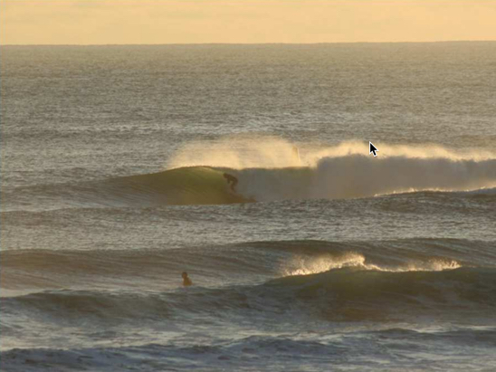

- **file**: `03_images/reefs/mount-maunganui-reef/mount-maunganui-reef_surf-wave-mead-borrero_unknown-date.jpg`
- **kind**: photo
- **shows**: Warm-toned sunset surf photo: a clean right-hand wave peeling with a surfer on the face; the reef is not visible (opaque water, low sun); the page caption attributes the wave to the reef.
- **structure visible**: False
- **state shown**: as-built (surf effect; date unknown)
- **image date**: unknown (before 2019; ASR-supplied photo)
- **citation**: Raised Water Research (2019). Mount Maunganui [spot profile page]; image 'Mount Reef Right 2 (Mead, Borrero)'. https://raisedwaterresearch.com/spot/artificial-reef/new-zealand/north-island/mount-maunganui/. Image file https://raisedwaterresearch.com/wp-content/uploads/2019/11/Mount-Reef-Right-2-Mead-Borrero.jpg. Accessed 2026-10-06.
- **image URL**: https://raisedwaterresearch.com/wp-content/uploads/2019/11/Mount-Reef-Right-2-Mead-Borrero.jpg
- **source page**: https://raisedwaterresearch.com/spot/artificial-reef/new-zealand/north-island/mount-maunganui/
- **page / figure**: page gallery, 548 x 411 px
- **credit**: Mead, Borrero (ASR Ltd) via Raised Water Research
- **licence**: all rights reserved (no licence stated on the page); link/research copy only - NOT cleared
- **retrieved**: 2026-10-06
- **used for**: context
- **How used for the model**: Page illustration of the surf effect. Nothing measured.
- **3D check pending**: no - none: surf photo
- **linked records**: 02_research/reefs/mount-maunganui-reef.json images[2]; 05_qa/reef/mount-maunganui-reef_media_recheck.json images[2]
- **size**: 0.18 MB, 548x411 px
- **sha256**: 522ac6e7a9e5a2ad7a67706e4117b4f57a5e492c1a3b7a7b9fc06b48d356dd50
- **rights**: Private research copy; reuse rights to be checked before any public release.
- **display in HTML**: True
- **added by**: image-registry backfill, 2026-10-06

## mount-maunganui-reef-img-06 - Mount-Reef-Deflated-Bag.jpg: enlarged colour-coded 2013 multibeam render of the apex with arrow (RWR; not a photograph)

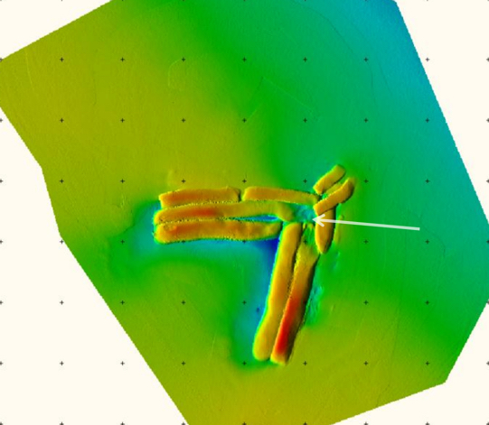

- **file**: `03_images/reefs/mount-maunganui-reef/mount-maunganui-reef_apex-deflated-render_2013.jpg`
- **kind**: survey_plot
- **shows**: Colour-coded multibeam depth render (green/yellow/orange) of the '7' reef with a white arrow pointing at the apex where a bag looks deflated; the card called it a photo, the 2026-09-25 recheck corrected this.
- **structure visible**: True
- **state shown**: as-built, 2013 (apex deflation)
- **image date**: 2013 (July 2013 survey era)
- **citation**: Raised Water Research (2019). Mount Maunganui [spot profile page]; image 'Mount Reef Deflated Bag (sourced on the page to Dahm and Gibberd 2013)'. https://raisedwaterresearch.com/spot/artificial-reef/new-zealand/north-island/mount-maunganui/. Image file https://raisedwaterresearch.com/wp-content/uploads/2019/11/Mount-Reef-Deflated-Bag.jpg. Accessed 2026-10-06.
- **image URL**: https://raisedwaterresearch.com/wp-content/uploads/2019/11/Mount-Reef-Deflated-Bag.jpg
- **source page**: https://raisedwaterresearch.com/spot/artificial-reef/new-zealand/north-island/mount-maunganui/
- **page / figure**: page gallery, 541 x 471 px
- **credit**: Raised Water Research, sourced to Dahm and Gibberd (2013)
- **licence**: all rights reserved (no licence stated on the page); link/research copy only - NOT cleared
- **retrieved**: 2026-10-06
- **used for**: context
- **How used for the model**: Context illustration only; the same survey is traced from BoPRC Fig 3 (img1). Card caption corrected by the recheck (survey render, not a photo). Verifier 2026-10-06 (07_scale/shapes/mount-maunganui-reef/VERIFY.md): the apex region read on Fig 5 (same survey): deflated apex bags at -2.0 to -2.4 m CD, i.e. 1.0-1.4 m below the main-bag crest (-1.0 m); BoPRC printed p23 confirms deflation (2008, worse in 2013).
- **3D check pending**: no - RESOLVED by the 3D agent 2026-10-06. Result: 3D agent 2026-10-06: colour render of the same 2013 survey (no scale or legend). Confirms the apex bags were deflated 1.0-1.4 m below the main crest (about -2.0 to -2.4 m CD) by 2013. The as-built apex height is not known (img-10 shows the apex bags intact but clipped above -0.84 CD), so the as-built model gives the apex the same crest as the other bags (-0.9 m CD) and records the deflation as a caption/METHODS_3D note. No model value changed.
- **linked records**: 02_research/reefs/mount-maunganui-reef.json images[4]; 05_qa/reef/mount-maunganui-reef_media_recheck.json images[4]
- **size**: 0.21 MB, 541x471 px
- **sha256**: ec2f4a6cc10def47e52bcfdaa0b512b4ca2e5e40f4448e7a3e090428df391a36
- **rights**: Private research copy; reuse rights to be checked before any public release.
- **display in HTML**: True
- **added by**: image-registry backfill, 2026-10-06

## mount-maunganui-reef-img-07 - Mount-Reef-Multibean-2013.jpg: July 2013 multibeam render with apex arrow (RWR copy of BoPRC Fig 5)

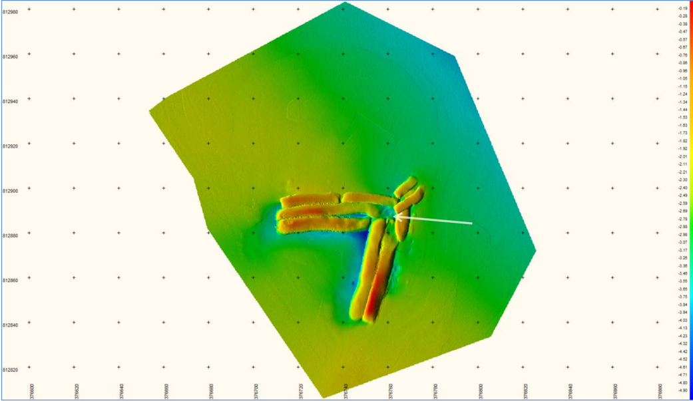

- **file**: `03_images/reefs/mount-maunganui-reef/mount-maunganui-reef_rwr-multibeam-2013_2013.jpg`
- **kind**: survey_plot
- **shows**: Colour-coded 2013 multibeam depth render of the reef with an arrow at the apex (same figure as BoPRC Figure 5, lower resolution).
- **structure visible**: True
- **state shown**: as-built, 2013
- **image date**: survey 2013-07-18
- **citation**: Raised Water Research (2019). Mount Maunganui [spot profile page]; image 'Mount Reef Multibean 2013'. https://raisedwaterresearch.com/spot/artificial-reef/new-zealand/north-island/mount-maunganui/. Image file https://raisedwaterresearch.com/wp-content/uploads/2019/11/Mount-Reef-Multibean-2013.jpg. Accessed 2026-10-06.
- **image URL**: https://raisedwaterresearch.com/wp-content/uploads/2019/11/Mount-Reef-Multibean-2013.jpg
- **source page**: https://raisedwaterresearch.com/spot/artificial-reef/new-zealand/north-island/mount-maunganui/
- **page / figure**: page gallery, 1041 x 603 px
- **credit**: Raised Water Research; survey University of Waikato & Discovery Marine Ltd via BoPRC
- **licence**: all rights reserved (no licence stated on the page); link/research copy only - NOT cleared
- **retrieved**: 2026-10-06
- **used for**: context
- **How used for the model**: Fetched during tracing but not used (sources.md); duplicate of the BoPRC Figure 5 raster registered above.
- **3D check pending**: no - none: duplicate of BoPRC Fig 5 (see that row)
- **linked records**: 07_scale/shapes/mount-maunganui-reef/sources.md (Not saved / looked at only)
- **size**: 0.32 MB, 1041x603 px
- **sha256**: 95b5808c4921c231ab7c99062aade38fa8ea11e39413b931d25cc2c6d92d0924
- **rights**: Private research copy; reuse rights to be checked before any public release.
- **display in HTML**: True
- **added by**: image-registry backfill, 2026-10-06

## mount-maunganui-reef-img-08 - BoPRC report Figure 3: most recent survey of Mount Reef, 18 July 2013 (multibeam plan, depths to Chart Datum)

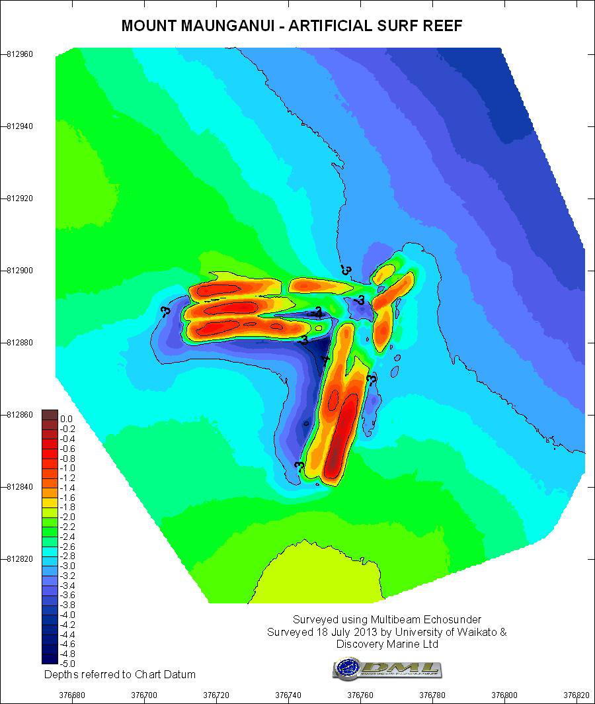

- **file**: `07_scale/shapes/mount-maunganui-reef/src/boprc_fig3_2013_survey.png`
- **kind**: survey_plot
- **shows**: Georeferenced multibeam plan (NZ-grid ticks) of the delta-wing '7' reef: two arms and the apex, colour-coded depth to Chart Datum.
- **structure visible**: True
- **state shown**: as-built, 2013 survey (5 years after completion; partly smaller than the BoPRC text, small north-arm base bags buried)
- **image date**: survey 2013-07-18
- **citation**: Focus Resource Management Group (2013). Mount Maunganui Reef - Assessment of Management Options. Report prepared for Bay of Plenty Regional Council, December 2013 (PDF created 2014-01-23), PDF page 23 (printed p.22), Figure 3 'Most recent survey of Mount Reef conducted on 18 July 2013' (embedded raster 900 x 1064 px, extracted unresampled; figure title 'MOUNT MAUNGANUI - ARTIFICIAL SURF REEF', surveyed by University of Waikato & Discovery Marine Ltd). https://www.boprc.govt.nz/media/558385/mount-maunganui-reef-assessment-of-management-options.pdf. Accessed 2026-10-05.
- **image URL**: https://www.boprc.govt.nz/media/558385/mount-maunganui-reef-assessment-of-management-options.pdf
- **source page**: https://www.boprc.govt.nz/media/558385/mount-maunganui-reef-assessment-of-management-options.pdf
- **page / figure**: PDF p.23, Figure 3 (raster xref 53)
- **credit**: University of Waikato & Discovery Marine Ltd (DML), reproduced by Focus RMG / BoPRC
- **licence**: not stated (council report) - check before reuse
- **retrieved**: 2026-10-05
- **used for**: plan_trace, scale
- **How used for the model**: PRIMARY image: outline of the as-built delta-wing traced at the -2.0 m CD contour (67.9 x 60.4 m, 1,071 m2) and the toe (73.9 x 62.5 m, 1,424 m2); scale 5.45 px/m from the NZ-grid ticks, position validated against the 2010-11 aerial to ~2 m (shape.json source img1; METHOD.md). Verifier 2026-10-06 (07_scale/shapes/mount-maunganui-reef/VERIFY.md): tick pixels re-read (109 px per 20 m, 5.45 px/m), legend swatch/label alignment re-checked, area 1,071.0 m2 and bbox 67.89 x 60.39 m re-computed, outline confirmed on Fig 5 (IoU 0.93); canonical frame has no rotation error.
- **3D check pending**: no - Verifier 2026-10-06 (07_scale/shapes/mount-maunganui-reef/VERIFY.md): RESOLVED: values used by the model were re-checked: crest 0.8-1.0 m below CD confirmed (BoPRC p6, p21; Fig 3 and Fig 5), 2013 bed -2.3 (NW) to -3.1 m (NE) CD, plan outline 67.9 x 60.4 m (-2.0 m contour; as-built toe 73.9 x 62.5 m).
- **annotated / overlay files**: `07_scale/shapes/mount-maunganui-reef/overlays/img1_boprc_fig3_2013.png`
- **source PDF**: `07_scale/shapes/mount-maunganui-reef/src/boprc_report.pdf`
- **linked records**: 07_scale/shapes/mount-maunganui-reef/sources.md img1; 07_scale/shapes/mount-maunganui-reef/shape.json sources[img1]; 07_scale/shapes/mount-maunganui-reef/METHOD.md
- **size**: 0.63 MB, 900x1064 px
- **sha256**: 61ef0e2149c3870047695af596bff85a2dc8297884879d8b24aa37f528b07139
- **rights**: Private research copy; reuse rights to be checked before any public release.
- **display in HTML**: True
- **added by**: image-registry backfill, 2026-10-06

## mount-maunganui-reef-img-09 - Bay of Plenty 0.125 m Urban Aerial Photos (2010-2011), tile BD37_1000_1314, 1100 x 1100 px crop on the reef

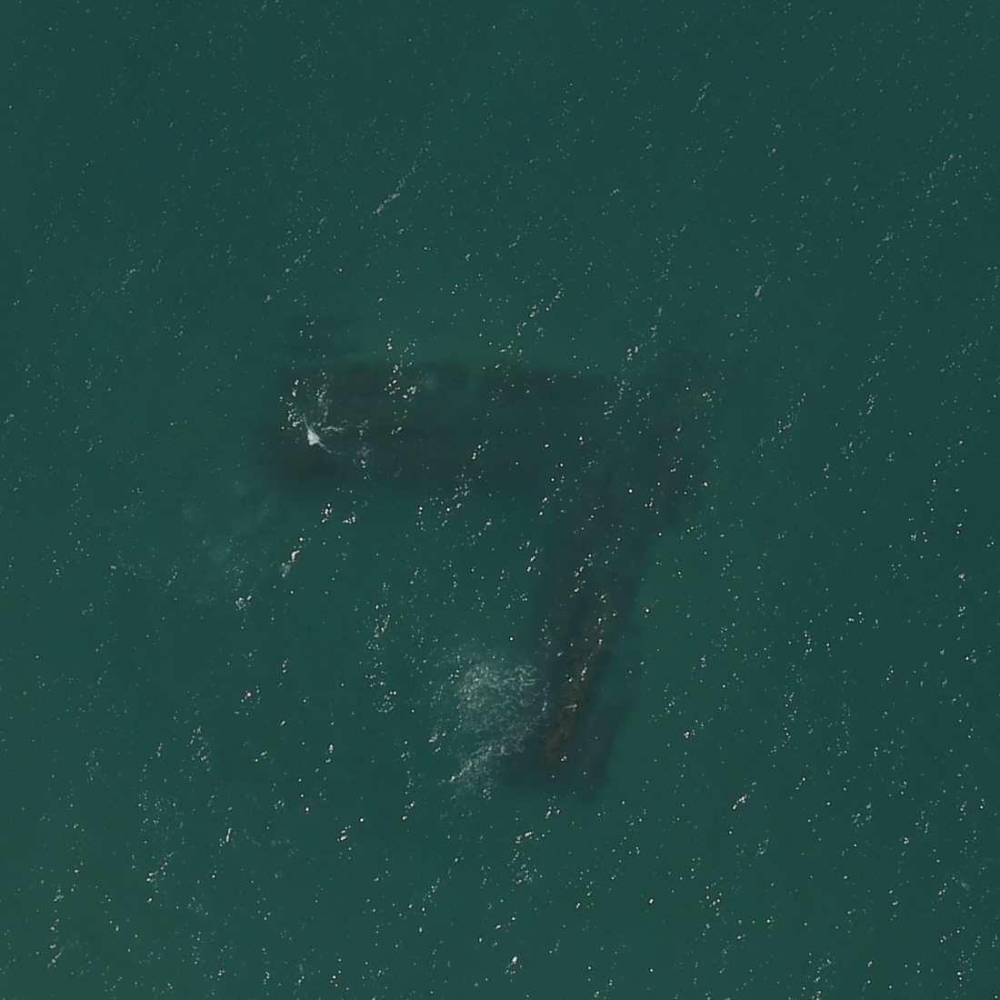

- **file**: `07_scale/shapes/mount-maunganui-reef/src/linz_aerial_2010-11_BD37_1000_1314_crop.png`
- **kind**: aerial
- **shows**: 0.125 m orthophoto of the beach and the reef: the '7' of container arms is clearly visible offshore.
- **structure visible**: True
- **state shown**: as-built (about 2 years after completion; before the 2014 partial removal)
- **image date**: flown 2010-12-28 .. 2011-03-31 (collection extent)
- **citation**: LINZ / New Zealand Aerial Mapping (2011). Bay of Plenty 0.125m Urban Aerial Photos (2010-2011), tile BD37_1000_1314 (NZTM2000 EPSG:2193, 0.125 m/px). Land Information New Zealand, NZ Imagery on AWS, https://nz-imagery.s3.ap-southeast-2.amazonaws.com/bay-of-plenty/bay-of-plenty_2010-2011_0.125m/rgb/2193/BD37_1000_1314.tiff (19.19 MB COG), catalogue https://nz-imagery.s3.ap-southeast-2.amazonaws.com/catalog.json. Licensed CC BY 4.0. Accessed 2026-10-05.
- **image URL**: https://nz-imagery.s3.ap-southeast-2.amazonaws.com/bay-of-plenty/bay-of-plenty_2010-2011_0.125m/rgb/2193/BD37_1000_1314.tiff
- **source page**: https://nz-imagery.s3.ap-southeast-2.amazonaws.com/catalog.json
- **page / figure**: tile BD37_1000_1314, crop centred on the reef (+ .geo.json sidecar)
- **credit**: LINZ (host/processor); New Zealand Aerial Mapping (producer); BOPLASS and Gisborne District Council (licensors)
- **licence**: CC BY 4.0 (collection.json) - attribution required
- **retrieved**: 2026-10-05
- **used for**: cross_check, scale
- **How used for the model**: Independent geo-referenced cross-check: the 2013-survey outline projected on it agrees to ~2 m; confirms scale and position of the traced outline (shape.json source img2; METHOD.md). Verifier 2026-10-06 (07_scale/shapes/mount-maunganui-reef/VERIFY.md): reprojection of the outline re-done (0.09 px agreement) and registration re-measured with two other feature maps: 0.5 m W, 1.75-2.0 m S.
- **3D check pending**: no - Verifier 2026-10-06 (07_scale/shapes/mount-maunganui-reef/VERIFY.md): RESOLVED: position of the plan outline confirmed to about 2 m; nothing further to check for the model.
- **annotated / overlay files**: `07_scale/shapes/mount-maunganui-reef/overlays/img2_linz_aerial_2010-11.png`
- **linked records**: 07_scale/shapes/mount-maunganui-reef/sources.md img2; 07_scale/shapes/mount-maunganui-reef/shape.json sources[img2]
- **size**: 1.26 MB, 1100x1100 px
- **sha256**: f10c516c2475bb29d74394675aff3b182ebcee7f1ddd7f7e5952c8ff9e0e4be8
- **rights**: Private research copy; reuse rights to be checked before any public release.
- **display in HTML**: True
- **added by**: image-registry backfill, 2026-10-06

## mount-maunganui-reef-img-10 - 'Mount Reef Installed': colour-coded bathymetry of the completed reef (ASR image on RWR)

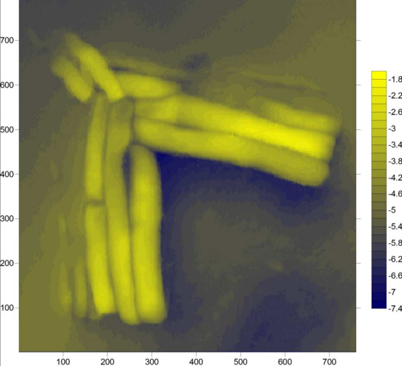

- **file**: `07_scale/shapes/mount-maunganui-reef/src/mount-reef-installed.jpg`
- **kind**: survey_plot
- **shows**: False-colour depth map of the completed reef: elongated container tubes, the apex 'focus' bags and the replaced split bag.
- **structure visible**: True
- **state shown**: as-built (after Aug 2008, before 2013 settling)
- **image date**: undated; after Aug 2008 (shows the replaced split bag and the apex 'focus' bags)
- **citation**: Raised Water Research (2019). Mount Maunganui [spot profile page]; image 'Mount Reef Installed ('The installed reef. Image: ASR')'. https://raisedwaterresearch.com/spot/artificial-reef/new-zealand/north-island/mount-maunganui/. Image file https://raisedwaterresearch.com/wp-content/uploads/2019/11/Mount-Reef-Installed.jpg. Accessed 2026-10-04.
- **image URL**: https://raisedwaterresearch.com/wp-content/uploads/2019/11/Mount-Reef-Installed.jpg
- **source page**: https://raisedwaterresearch.com/spot/artificial-reef/new-zealand/north-island/mount-maunganui/
- **page / figure**: page gallery, 570 x 519 px; colour legend -1.8 .. -7.4 m (datum not stated), axes 100-700 unlabelled
- **credit**: ASR Ltd via Raised Water Research
- **licence**: all rights reserved (no licence stated on the page); link/research copy only - NOT cleared
- **retrieved**: 2026-10-04
- **used for**: cross_check, scale
- **How used for the model**: Second as-built supplement: toe-level outline and the extra apex bags traced; scale from registration to img1; reproduces the stated 2,800 m3 volume (2,835-2,861 m3) (shape.json source img3; METHOD.md). Its depth legend (-1.8..-7.4 m, datum unstated) has not been used. Verifier 2026-10-06 (07_scale/shapes/mount-maunganui-reef/VERIFY.md): scale uncertainty widened to +-6 % (axis ticks would give 6.27 px/m vs registered 5.96); legend ends at -1.8 m so the crest is only bounded (shallower than -1.8 m MVD-53 = -0.84 m CD); ring-median bed re-derived -5.35 to -5.42 m (-4.1 to -4.7 m CD if MVD-53); datum is an inference.
- **3D check pending**: no - RESOLVED by the 3D agent 2026-10-06. Result: 3D agent 2026-10-06: crest only BOUNDED (the legend stops at -1.8 m MVD-53 = -0.84 m CD, so the crest is shallower than that), consistent with the model crest -0.9 m CD. Ring bed median -5.4 m MVD-53 = -4.46 m CD (datum assumed MVD-53) is the deep end of the evidence, consistent with the model bed -4.0 +-0.5 m CD. Its grid volume 2,835-2,861 m3 compares with the model loft (as-built toe outline) 3,276 m3 at bed -4.0 (+16 %) and 2,800 m3 at bed -3.65 CD (see METHODS_3D s4). Used as the source of the as-built toe outline (outline version 2).
- **annotated / overlay files**: `07_scale/shapes/mount-maunganui-reef/overlays/img3_asr_installed.png`
- **linked records**: 07_scale/shapes/mount-maunganui-reef/sources.md img3; 07_scale/shapes/mount-maunganui-reef/shape.json sources[img3]
- **size**: 0.19 MB, 570x519 px
- **sha256**: 5868b6b28cd5d06f101f2f3e3fa6b9317cf3c68407a15573e4ebd2b439b27419
- **rights**: Private research copy; reuse rights to be checked before any public release.
- **display in HTML**: True
- **added by**: image-registry backfill, 2026-10-06

## mount-maunganui-reef-img-11 - BoPRC report Figure 4: multibeam survey of January 2007 when the reef was 70 % complete (from Scarfe 2009)

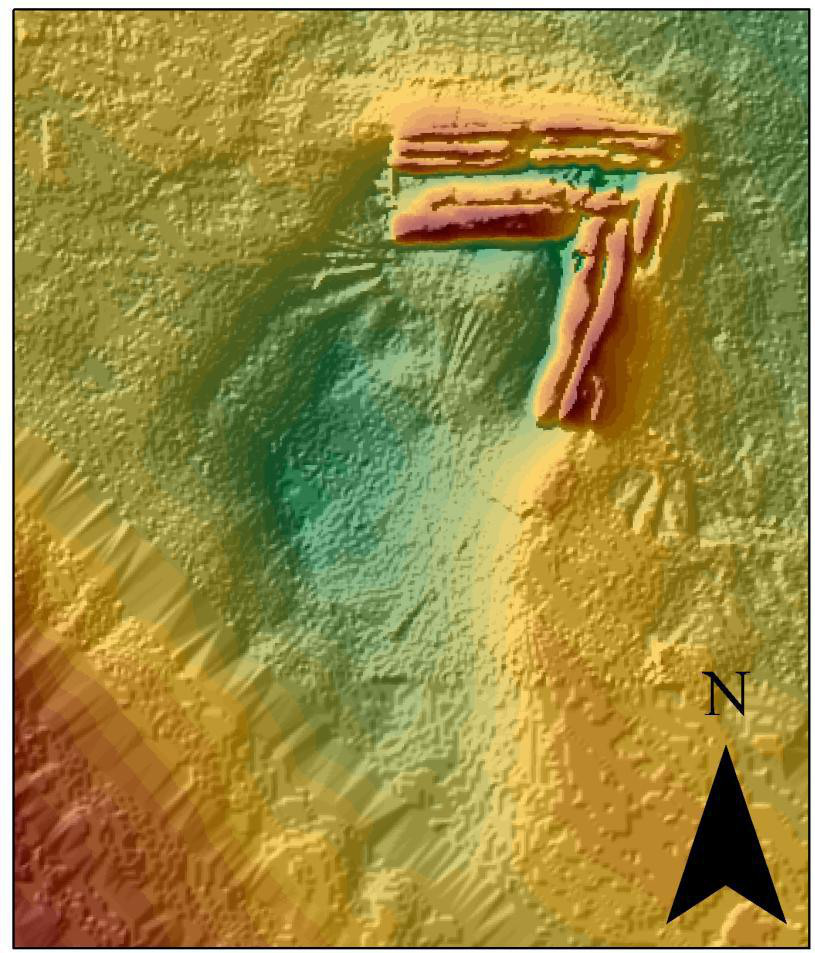

- **file**: `07_scale/shapes/mount-maunganui-reef/src/boprc_fig4_2007_multibeam.png`
- **kind**: survey_plot
- **shows**: Shaded-relief multibeam view of the reef at 70% completion with a missing bag on the northern arm; north arrow only, no scale.
- **structure visible**: True
- **state shown**: part-built (January 2007, 70% complete)
- **image date**: survey January 2007 (reef 70% complete)
- **citation**: Focus Resource Management Group (2013). Mount Maunganui Reef - Assessment of Management Options. Report prepared for Bay of Plenty Regional Council, December 2013 (PDF created 2014-01-23), PDF page 26 (printed p.25), Figure 4 'View of the Mount Reef from a multibeam survey conducted in January 2007, when the reef was 70 % complete (from Scarfe, 2009)' (raster 815 x 953 px). https://www.boprc.govt.nz/media/558385/mount-maunganui-reef-assessment-of-management-options.pdf. Accessed 2026-10-05.
- **image URL**: https://www.boprc.govt.nz/media/558385/mount-maunganui-reef-assessment-of-management-options.pdf
- **source page**: https://www.boprc.govt.nz/media/558385/mount-maunganui-reef-assessment-of-management-options.pdf
- **page / figure**: PDF p.26, Figure 4 (raster xref 60)
- **credit**: Scarfe (2009) via BoPRC / Focus RMG
- **licence**: not stated - check before reuse
- **retrieved**: 2026-10-05
- **used for**: context
- **How used for the model**: Context (layout at 70% complete, missing bag on the northern arm); not traced (shape.json source ctx1).
- **3D check pending**: no - none: image already used as a model source or is context only
- **source PDF**: `07_scale/shapes/mount-maunganui-reef/src/boprc_report.pdf`
- **linked records**: 07_scale/shapes/mount-maunganui-reef/sources.md ctx1; 07_scale/shapes/mount-maunganui-reef/shape.json sources[ctx1]
- **size**: 1.46 MB, 815x953 px
- **sha256**: c718be60455fd93587711061129710c7bb0a692f6d4852621616a21bfe602378
- **rights**: Private research copy; reuse rights to be checked before any public release.
- **display in HTML**: True
- **added by**: image-registry backfill, 2026-10-06

## mount-maunganui-reef-img-12 - 'Mount Reef Multibeam 2007' (RWR copy of BoPRC Figure 4, 'showing missing bag')

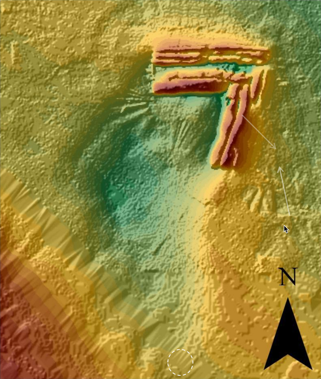

- **file**: `07_scale/shapes/mount-maunganui-reef/src/mount-reef-multibeam-2007.jpg`
- **kind**: survey_plot
- **shows**: Rainbow-coloured multibeam render of the reef with a north arrow and two grey arrows at the gap between container arms (the missing bag).
- **structure visible**: True
- **state shown**: part-built (January 2007)
- **image date**: survey January 2007
- **citation**: Raised Water Research (2019). Mount Maunganui [spot profile page]; image 'Mount Reef Multibean 2007 ('Depth reading 2007, showing missing bag. Image: Scarf 2009')'. https://raisedwaterresearch.com/spot/artificial-reef/new-zealand/north-island/mount-maunganui/. Image file https://raisedwaterresearch.com/wp-content/uploads/2019/11/Mount-Reef-Multibean-2007.jpg. Accessed 2026-10-04.
- **image URL**: https://raisedwaterresearch.com/wp-content/uploads/2019/11/Mount-Reef-Multibean-2007.jpg
- **source page**: https://raisedwaterresearch.com/spot/artificial-reef/new-zealand/north-island/mount-maunganui/
- **page / figure**: page gallery, 637 x 752 px
- **credit**: Scarfe (2009) via Raised Water Research
- **licence**: all rights reserved (no licence stated on the page); link/research copy only - NOT cleared
- **retrieved**: 2026-10-04
- **used for**: context
- **How used for the model**: Context (duplicate of BoPRC Fig 4, shape.json source ctx2); not traced. Recommended hero image in the 2026-09-25 media recheck.
- **3D check pending**: no - none: image already used as a model source or is context only
- **linked records**: 07_scale/shapes/mount-maunganui-reef/sources.md ctx2; 07_scale/shapes/mount-maunganui-reef/shape.json sources[ctx2]; 05_qa/reef/mount-maunganui-reef_media_recheck.json images[3]
- **size**: 0.46 MB, 637x752 px
- **sha256**: 4a06bd17ee7fdc19e5433167fc9bb204b99dc70a078401d4f020281084865b60
- **rights**: Private research copy; reuse rights to be checked before any public release.
- **display in HTML**: True
- **added by**: image-registry backfill, 2026-10-06

## mount-maunganui-reef-img-13 - 'Mount Reef' CAD render of the 2005 delta-wing design (RWR)

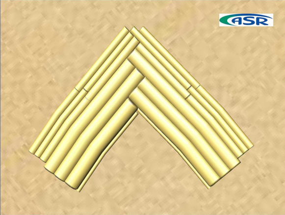

- **file**: `07_scale/shapes/mount-maunganui-reef/src/mount-reef-cad-design.jpg`
- **kind**: design_drawing
- **shows**: 3D render of the symmetric two-arm layout with interleaved apex; no scale.
- **structure visible**: True
- **state shown**: design (2005 delta-wing, superseded by the as-built)
- **image date**: design stage (2005 delta-wing)
- **citation**: Raised Water Research (2019). Mount Maunganui [spot profile page]; image 'Mount Reef (CAD render; credited to ASR)'. https://raisedwaterresearch.com/spot/artificial-reef/new-zealand/north-island/mount-maunganui/. Image file https://raisedwaterresearch.com/wp-content/uploads/2019/11/Mount-Reef.jpg. Accessed 2026-10-04.
- **image URL**: https://raisedwaterresearch.com/wp-content/uploads/2019/11/Mount-Reef.jpg
- **source page**: https://raisedwaterresearch.com/spot/artificial-reef/new-zealand/north-island/mount-maunganui/
- **page / figure**: page gallery, 581 x 438 px
- **credit**: ASR Ltd via Raised Water Research
- **licence**: all rights reserved (no licence stated on the page); link/research copy only - NOT cleared
- **retrieved**: 2026-10-04
- **used for**: context
- **How used for the model**: Context (design topology only, superseded by the as-built survey; shape.json source ctx3). Nothing measured.
- **3D check pending**: no - none: image already used as a model source or is context only
- **linked records**: 07_scale/shapes/mount-maunganui-reef/sources.md ctx3; 07_scale/shapes/mount-maunganui-reef/shape.json sources[ctx3]
- **size**: 0.23 MB, 581x438 px
- **sha256**: 93a2f1aef26953cbc24748d79606945284c667d23af00f9fc6968cfd6f620bf1
- **rights**: Private research copy; reuse rights to be checked before any public release.
- **display in HTML**: True
- **added by**: image-registry backfill, 2026-10-06

## mount-maunganui-reef-img-14 - 'Mount Reef Arial': wide aerial of Mauao and Mount Maunganui Beach with the reef arrowed (RWR)

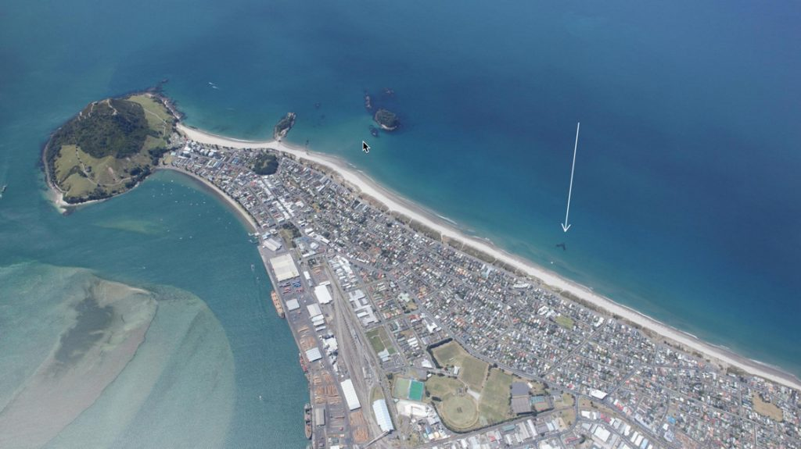

- **file**: `07_scale/shapes/mount-maunganui-reef/src/mount-reef-arial.jpg`
- **kind**: aerial
- **shows**: Aerial view of Mauao headland and the beach with a white arrow at a dark elongated patch ~250-300 m offshore, the submerged container reef.
- **structure visible**: True
- **state shown**: as-built (date unknown)
- **image date**: undated (RWR; BoPRC Fig 1 is the same kind of photo)
- **citation**: Raised Water Research (2019). Mount Maunganui [spot profile page]; image 'Mount Reef Arial'. https://raisedwaterresearch.com/spot/artificial-reef/new-zealand/north-island/mount-maunganui/. Image file https://raisedwaterresearch.com/wp-content/uploads/2019/11/Mount-Reef-Arial-1024x575.jpg?v=1573519132. Accessed 2026-10-04. (Original upload Mount-Reef-Arial.jpg is 1131 x 635 px; the 1024 x 575 px copy was used.)
- **image URL**: https://raisedwaterresearch.com/wp-content/uploads/2019/11/Mount-Reef-Arial-1024x575.jpg?v=1573519132
- **source page**: https://raisedwaterresearch.com/spot/artificial-reef/new-zealand/north-island/mount-maunganui/
- **page / figure**: page gallery, 1024 x 575 px
- **credit**: Raised Water Research / BoPRC (photographer not named)
- **licence**: all rights reserved (no licence stated on the page); link/research copy only - NOT cleared
- **retrieved**: 2026-10-04
- **used for**: context
- **How used for the model**: Context (reef arrowed, too small to measure; shape.json source ctx4). Nothing measured.
- **3D check pending**: no - none: image already used as a model source or is context only
- **linked records**: 07_scale/shapes/mount-maunganui-reef/sources.md ctx4; 07_scale/shapes/mount-maunganui-reef/shape.json sources[ctx4]; 02_research/reefs/mount-maunganui-reef.json images[0]
- **size**: 0.08 MB, 1024x575 px
- **sha256**: 3ed80dbbc5661295a76bda3f39ec22f5a81b5381ac9d83a86918ba75f1ef61a0
- **rights**: Private research copy; reuse rights to be checked before any public release.
- **display in HTML**: True
- **added by**: image-registry backfill, 2026-10-06

## mount-maunganui-reef-img-15 - Esri World Imagery Wayback release 3630, z18, 700 m radius around -37.6448, 176.2023 (2961 x 2961 px, 0.4728 m/px)

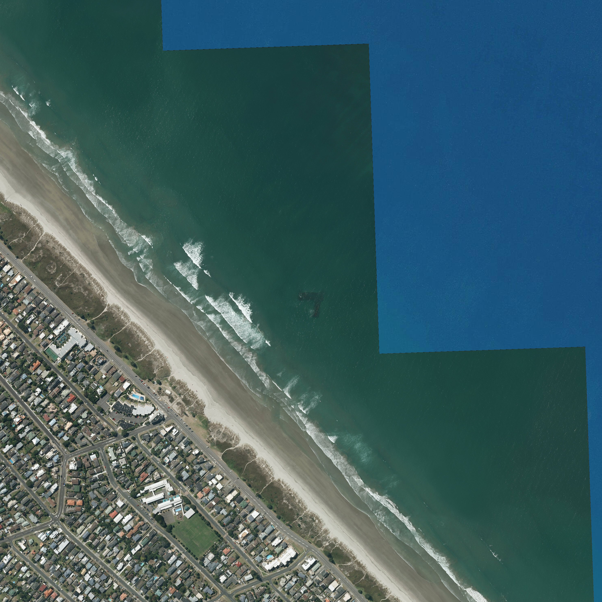

- **file**: `07_scale/shapes/mount-maunganui-reef/src/esri_wayback_2011-01-15_z18_wide.png`
- **kind**: satellite
- **shows**: Wide frame of the beach, the shoreline and the reef visible offshore.
- **structure visible**: True
- **state shown**: as-built (2010-2011)
- **image date**: 2011-01-15
- **citation**: Esri, Maxar, Earthstar Geographics, and the GIS User Community (2011). World Imagery Wayback release 3630, image captured 2011-01-15. Esri World Imagery tile service, https://server.arcgisonline.com/ArcGIS/rest/services/World_Imagery/MapServer, via Esri Wayback https://livingatlas.arcgis.com/wayback/. Accessed 2026-10-05.
- **image URL**: https://wayback.maptiles.arcgis.com/arcgis/rest/services/World_Imagery/WMTS/1.0.0/default028mm/MapServer/tile/3630/{z}/{y}/{x}
- **source page**: Esri Wayback
- **page / figure**: Esri World Imagery Wayback release 3630, z18, 700 m radius around -37.6448, 176.2023 (2961 x 2961 px, 0.4728 m/px)
- **credit**: Esri, Maxar, Earthstar Geographics, and the GIS User Community
- **licence**: Esri/Maxar imagery terms (not an open licence); private research copy only
- **retrieved**: 2026-10-05
- **used for**: context
- **How used for the model**: Context: the shoreline line (wet/dry-sand boundary) was fitted on it for the canonical frame; reef visible (shape.json source ctx5).
- **3D check pending**: no - none: image already used as a model source or is context only
- **linked records**: 07_scale/shapes/mount-maunganui-reef/sources.md ctx5; 07_scale/shapes/mount-maunganui-reef/shape.json sources[ctx5]
- **size**: 8.99 MB, 2961x2961 px
- **sha256**: fe55a9c062edc0ed905271591d159e506cd0a7ebd9e7684a48a25ed023e44e2f
- **rights**: Private research copy; reuse rights to be checked before any public release.
- **display in HTML**: True
- **added by**: image-registry backfill, 2026-10-06

## mount-maunganui-reef-img-16 - Esri Wayback release 3630, z19, 200 m radius (1692 x 1692 px, 0.2364 m/px)

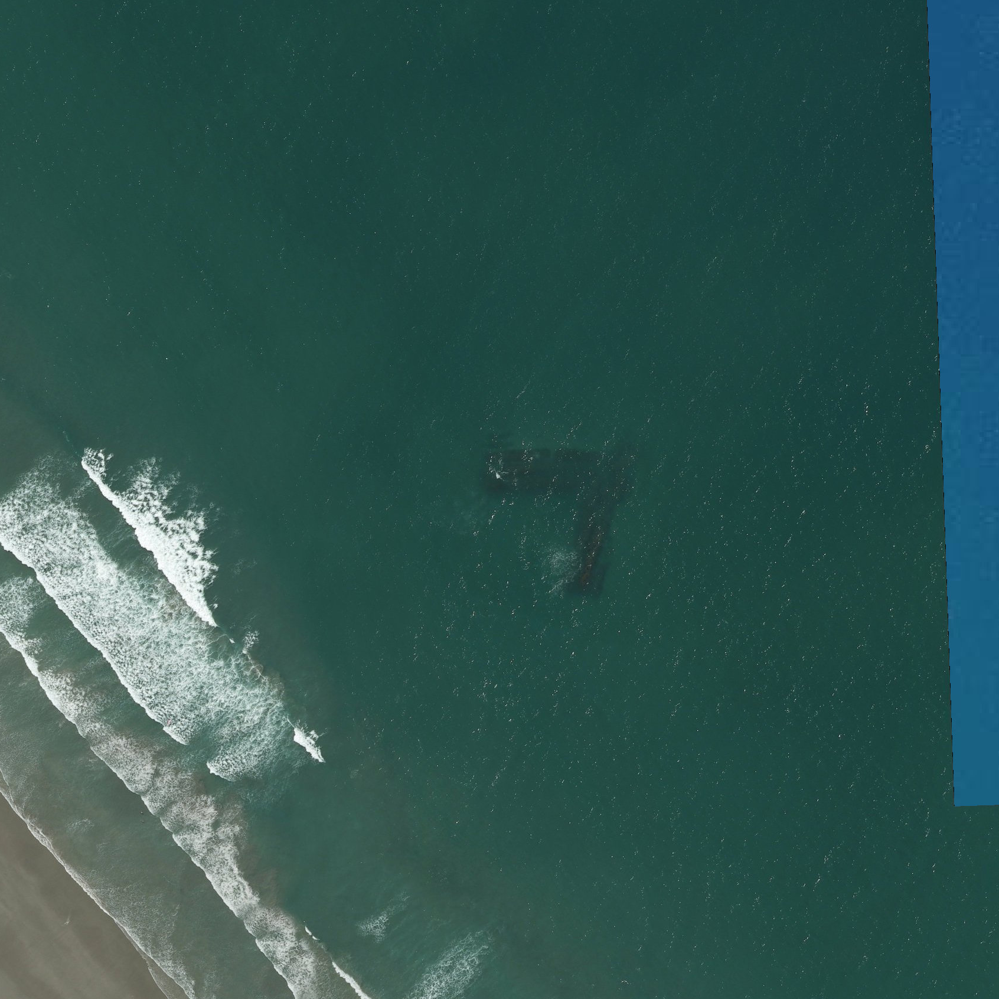

- **file**: `07_scale/shapes/mount-maunganui-reef/src/esri_wayback_2011-01-15_z19.png`
- **kind**: satellite
- **shows**: Closer frame of the reef from the same 2011-01-15 imagery.
- **structure visible**: True
- **state shown**: as-built (2010-2011)
- **image date**: 2011-01-15
- **citation**: Esri, Maxar, Earthstar Geographics, and the GIS User Community (2011). World Imagery Wayback release 3630, image captured 2011-01-15. Esri World Imagery tile service, https://server.arcgisonline.com/ArcGIS/rest/services/World_Imagery/MapServer, via Esri Wayback https://livingatlas.arcgis.com/wayback/. Accessed 2026-10-05.
- **image URL**: https://wayback.maptiles.arcgis.com/arcgis/rest/services/World_Imagery/WMTS/1.0.0/default028mm/MapServer/tile/3630/{z}/{y}/{x}
- **source page**: Esri Wayback
- **page / figure**: Esri Wayback release 3630, z19, 200 m radius (1692 x 1692 px, 0.2364 m/px)
- **credit**: Esri, Maxar, Earthstar Geographics, and the GIS User Community
- **licence**: Esri/Maxar imagery terms (not an open licence); private research copy only
- **retrieved**: 2026-10-05
- **used for**: context
- **How used for the model**: Context: first registration test, superseded by the LINZ aerial (shape.json source ctx6).
- **3D check pending**: no - none: image already used as a model source or is context only
- **linked records**: 07_scale/shapes/mount-maunganui-reef/sources.md ctx6; 07_scale/shapes/mount-maunganui-reef/shape.json sources[ctx6]
- **size**: 2.10 MB, 1692x1692 px
- **sha256**: a8d9dab86a3ecd40c572cacc5448afb94057c2582d3c39fb27ea4fc25e867de2
- **rights**: Private research copy; reuse rights to be checked before any public release.
- **display in HTML**: True
- **added by**: image-registry backfill, 2026-10-06

## mount-maunganui-reef-img-17 - Esri Wayback release 10, z17, 250 m radius (529 x 529 px, 0.9457 m/px)

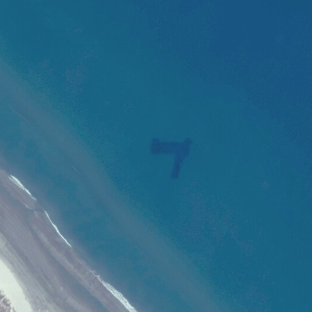

- **file**: `07_scale/shapes/mount-maunganui-reef/src/esri_wayback_2010-03-03_z17.png`
- **kind**: satellite
- **shows**: The reef visible as a dark '7' 21 months after completion; too coarse to trace.
- **structure visible**: True
- **state shown**: as-built (2010-2011)
- **image date**: 2010-03-03
- **citation**: Esri, Maxar, Earthstar Geographics, and the GIS User Community (2010). World Imagery Wayback release 10, image captured 2010-03-03. Esri World Imagery tile service, https://server.arcgisonline.com/ArcGIS/rest/services/World_Imagery/MapServer, via Esri Wayback https://livingatlas.arcgis.com/wayback/. Accessed 2026-10-05.
- **image URL**: https://wayback.maptiles.arcgis.com/arcgis/rest/services/World_Imagery/WMTS/1.0.0/default028mm/MapServer/tile/10/{z}/{y}/{x}
- **source page**: Esri Wayback
- **page / figure**: Esri Wayback release 10, z17, 250 m radius (529 x 529 px, 0.9457 m/px)
- **credit**: Esri, Maxar, Earthstar Geographics, and the GIS User Community
- **licence**: Esri/Maxar imagery terms (not an open licence); private research copy only
- **retrieved**: 2026-10-05
- **used for**: context
- **How used for the model**: Context only (shape.json source ctx7).
- **3D check pending**: no - none: image already used as a model source or is context only
- **linked records**: 07_scale/shapes/mount-maunganui-reef/sources.md ctx7; 07_scale/shapes/mount-maunganui-reef/shape.json sources[ctx7]
- **size**: 0.18 MB, 529x529 px
- **sha256**: 1407937f597eaf5c4a23fc0811d60cb416883a544622c37e24f87ae64173151a
- **rights**: Private research copy; reuse rights to be checked before any public release.
- **display in HTML**: True
- **added by**: image-registry backfill, 2026-10-06

## mount-maunganui-reef-img-18 - Video frame: small clean wave breaking with a surfer (fjsoto1, 'MOUNT REEF DREAM TURNS INTO REALITY!')

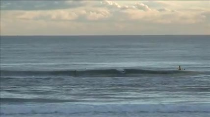

- **file**: `03_images/video_frames/mount-maunganui-reef/QsyH6FEzDx4_0125.jpg`
- **kind**: video_frame
- **shows**: Low-resolution frame of a small, clean wave breaking left-to-right with a surfer just past the peak; plain ocean horizon, no landmark.
- **structure visible**: False
- **state shown**: as-built (2006, reef surf effect; location only by the video title)
- **image date**: 2006-10-21 (upload date)
- **citation**: fjsoto1 (2006-10-21). "MOUNT REEF DREAM TURNS INTO REALITY!" [video]. YouTube, frame at 01:25. https://www.youtube.com/watch?v=QsyH6FEzDx4. Accessed 2026-09-25.
- **image URL**: https://www.youtube.com/watch?v=QsyH6FEzDx4
- **source page**: https://www.youtube.com/watch?v=QsyH6FEzDx4
- **page / figure**: frame at 01:25 (video length 346 s; source 428x240 px)
- **credit**: fjsoto1 (YouTube channel)
- **licence**: YouTube standard licence (not an open licence); single frame kept as a private research copy
- **retrieved**: 2026-09-24
- **used for**: context
- **How used for the model**: Page illustration of the surf effect; nothing measured.
- **3D check pending**: no - none: image already used as a model source or is context only
- **linked records**: 02_research/videos/mount-maunganui-reef/videos.json (QsyH6FEzDx4); 05_qa/reef/mount-maunganui-reef_media_recheck.json frames[0]
- **size**: 0.01 MB, 428x240 px
- **sha256**: f38c5612b731118f94a9557cbd5d9c3f6ae3650bbfed2d4ddbae31d65d54af42
- **rights**: Private research copy; reuse rights to be checked before any public release.
- **display in HTML**: True
- **added by**: image-registry backfill, 2026-10-06

## mount-maunganui-reef-img-19 - Garmin Navionics SonarChart Maps, zoom 17, Mount Maunganui reef site: shallow-shading series 0-10 m (11 files)

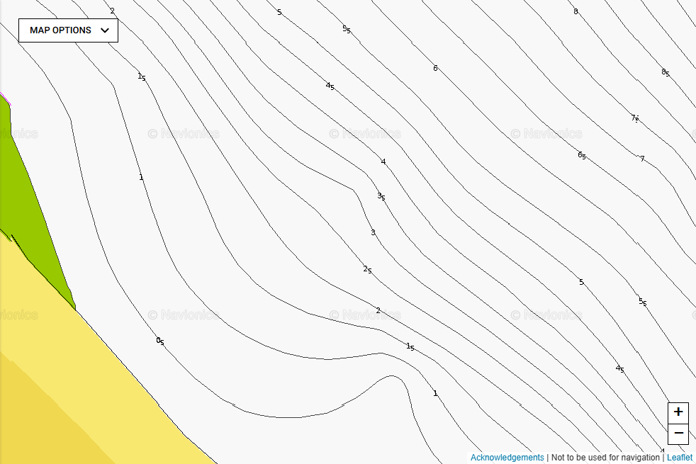

- **file**: `07_scale/shapes/mount-maunganui-reef/src/navionics/sonar_z17_shade00.0.png`
- **kind**: chart_screenshot
- **shows**: The Navionics chart around the reef site at each shallow-shading value: contour lines every 0.5 m (SonarChart) / only 2 m and 5 m (Nautical Charts) plus spot soundings; the reef (removed 2014) is not drawn.
- **structure visible**: False
- **state shown**: seabed 2026 (reef removed Sep-Nov 2014; chart data date unknown)
- **image date**: chart data dates not shown by the viewer; screenshots 2026-10-06
- **citation**: Garmin Ltd / Navionics (2026). Marine Maps viewer, SonarChart Maps, depths in metres, zoom 17; series of 11 screenshots with 'Shallow shading' 0, 1, ... 10 m (centre -37.6447833, 176.2025908; page title 'Garmin | Marine Maps', 'Not to be used for navigation'). https://maps.garmin.com/en-US/marine?maps=another-brand&overlay=false&key=rcm3cdfz1zy2 (webapp.navionics.com redirects here). Captured 2026-10-06 10:43-10:48 local by navionics_capture.py (own headless Chrome, random debug port, fresh profile). Accessed 2026-10-06.
- **image URL**: https://maps.garmin.com/en-US/marine?maps=another-brand&overlay=false&key=rcm3cdfz1zy2
- **source page**: https://maps.garmin.com/en-US/marine?maps=another-brand&overlay=false&key=rcm3cdfz1zy2
- **page / figure**: SonarChart Maps zoom 17 (0.946 m/px); files sonar_z17_shade00.0 .. shade10.0 (the blue area is water shallower than the setting, so its edge is the chart contour of that depth)
- **credit**: Garmin Navionics charts and SonarChart (c) Navionics / Garmin Ltd; screenshots by this project (own headless Chrome)
- **licence**: Garmin/Navionics terms ('Not to be used for navigation'); no open licence; private research copy, reuse NOT cleared
- **retrieved**: 2026-10-06
- **used for**: 3d_seabed; cross_check
- **How used for the model**: Primary source of the model seabed profile: contour edges extracted (nav_isolines.py) and read on 5 shore-normal transects (x = -100..100 m): 1-9 m contours at y = 111, 242, 329, 399, 463, 546, 642, 728 m (median) -> chart depth 2.76 m at the reef centroid (y 307.7). Datum not stated; CD assumed (RMS 0.30 m against the 2013 multibeam bed outside the reef zone). Annotated: nav_sonar_z17_profile.png, nav_datum_test.png. Goes into model.js seabed.profile and provenance rows N1-N3 (SOURCES_3D, METHODS_3D s3.5).
- **3D check pending**: no - RESOLVED by the 3D agent 2026-10-06. Result: Seabed profile read (contours 1-9 m, datum assumed CD, tested against the 2013 multibeam bed: RMS 0.30 m as CD vs 0.78 MVD-53 vs 0.95 MSL); chart depth at the reef centroid 2.76 m; reef not drawn as a feature (removed 2014).
- **annotated versions**: `07_scale/shapes/mount-maunganui-reef/3d/annotated/nav_sonar_z17_profile.png`; `07_scale/shapes/mount-maunganui-reef/3d/annotated/nav_datum_test.png`
- **series files (11)**: `07_scale/shapes/mount-maunganui-reef/src/navionics/sonar_z17_shade00.0.png` .. `07_scale/shapes/mount-maunganui-reef/src/navionics/sonar_z17_shade10.0.png`
- **size**: 0.03 MB, 982x655 px
- **sha256**: 4c3e1d5d40fb54a1558628c2929268f200122723505b118db4f1145dfa38edac
- **rights**: Private research copy; reuse rights to be checked before any public release.
- **display in HTML**: True
- **added by**: 3D agent mount-maunganui-reef, 2026-10-06

## mount-maunganui-reef-img-20 - Garmin Navionics SonarChart Maps, zoom 18, Mount Maunganui reef site: shallow-shading series 0-10 m (11 files)

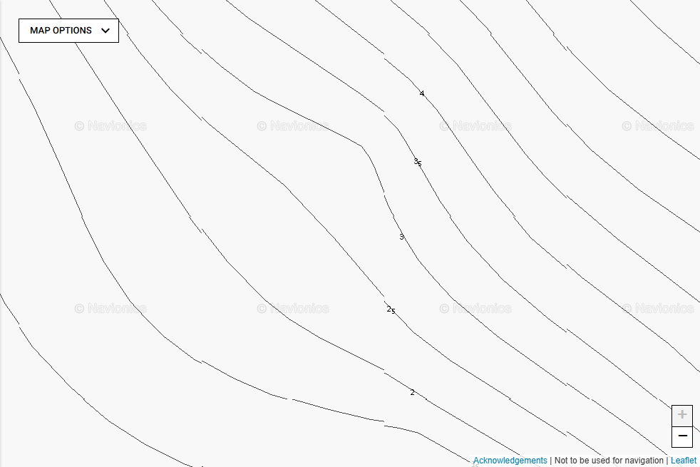

- **file**: `07_scale/shapes/mount-maunganui-reef/src/navionics/sonar_z18_shade00.0.png`
- **kind**: chart_screenshot
- **shows**: The Navionics chart around the reef site at each shallow-shading value: contour lines every 0.5 m (SonarChart) / only 2 m and 5 m (Nautical Charts) plus spot soundings; the reef (removed 2014) is not drawn.
- **structure visible**: False
- **state shown**: seabed 2026 (reef removed Sep-Nov 2014; chart data date unknown)
- **image date**: chart data dates not shown by the viewer; screenshots 2026-10-06
- **citation**: Garmin Ltd / Navionics (2026). Marine Maps viewer, SonarChart Maps, depths in metres, zoom 18; series of 11 screenshots with 'Shallow shading' 0, 1, ... 10 m (centre -37.6447833, 176.2025908; page title 'Garmin | Marine Maps', 'Not to be used for navigation'). https://maps.garmin.com/en-US/marine?maps=another-brand&overlay=false&key=rcm3cdfz1zy2 (webapp.navionics.com redirects here). Captured 2026-10-06 10:43-10:48 local by navionics_capture.py (own headless Chrome, random debug port, fresh profile). Accessed 2026-10-06.
- **image URL**: https://maps.garmin.com/en-US/marine?maps=another-brand&overlay=false&key=rcm3cdfz1zy2
- **source page**: https://maps.garmin.com/en-US/marine?maps=another-brand&overlay=false&key=rcm3cdfz1zy2
- **page / figure**: SonarChart Maps zoom 18 (0.473 m/px); files sonar_z18_shade00.0 .. shade10.0 (the blue area is water shallower than the setting, so its edge is the chart contour of that depth)
- **credit**: Garmin Navionics charts and SonarChart (c) Navionics / Garmin Ltd; screenshots by this project (own headless Chrome)
- **licence**: Garmin/Navionics terms ('Not to be used for navigation'); no open licence; private research copy, reuse NOT cleared
- **retrieved**: 2026-10-06
- **used for**: 3d_seabed; cross_check
- **How used for the model**: Check of the zoom-17 reading: contours 1-6 m cross the transects within 0-6 m of the z17 values (z18 medians 104.8/241.5/330.4/401.5/463.8/549.8 m vs z17 111.2/241.8/329.0/399.4/462.9/546.0). Not used further.
- **3D check pending**: no - RESOLVED by the 3D agent 2026-10-06. Result: Seabed profile read (contours 1-9 m, datum assumed CD, tested against the 2013 multibeam bed: RMS 0.30 m as CD vs 0.78 MVD-53 vs 0.95 MSL); chart depth at the reef centroid 2.76 m; reef not drawn as a feature (removed 2014).
- **series files (11)**: `07_scale/shapes/mount-maunganui-reef/src/navionics/sonar_z18_shade00.0.png` .. `07_scale/shapes/mount-maunganui-reef/src/navionics/sonar_z18_shade10.0.png`
- **size**: 0.03 MB, 982x655 px
- **sha256**: 8732737535d3471b310fff64c3924321ae83eb0615ea06cb25b8a8e05fcab356
- **rights**: Private research copy; reuse rights to be checked before any public release.
- **display in HTML**: True
- **added by**: 3D agent mount-maunganui-reef, 2026-10-06

## mount-maunganui-reef-img-21 - Garmin Navionics Nautical Charts, zoom 17, Mount Maunganui reef site: shallow-shading series 0-10 m (11 files)

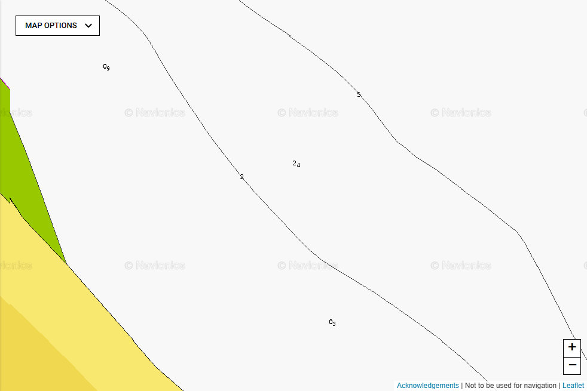

- **file**: `07_scale/shapes/mount-maunganui-reef/src/navionics/naut_z17_shade00.0.png`
- **kind**: chart_screenshot
- **shows**: The Navionics chart around the reef site at each shallow-shading value: contour lines every 0.5 m (SonarChart) / only 2 m and 5 m (Nautical Charts) plus spot soundings; the reef (removed 2014) is not drawn.
- **structure visible**: False
- **state shown**: seabed 2026 (reef removed Sep-Nov 2014; chart data date unknown)
- **image date**: chart data dates not shown by the viewer; screenshots 2026-10-06
- **citation**: Garmin Ltd / Navionics (2026). Marine Maps viewer, Nautical Charts, depths in metres, zoom 17; series of 11 screenshots with 'Shallow shading' 0, 1, ... 10 m (centre -37.6447833, 176.2025908; page title 'Garmin | Marine Maps', 'Not to be used for navigation'). https://maps.garmin.com/en-US/marine?maps=another-brand&overlay=false&key=rcm3cdfz1zy2 (webapp.navionics.com redirects here). Captured 2026-10-06 10:43-10:48 local by navionics_capture.py (own headless Chrome, random debug port, fresh profile). Accessed 2026-10-06.
- **image URL**: https://maps.garmin.com/en-US/marine?maps=another-brand&overlay=false&key=rcm3cdfz1zy2
- **source page**: https://maps.garmin.com/en-US/marine?maps=another-brand&overlay=false&key=rcm3cdfz1zy2
- **page / figure**: Nautical Charts zoom 17 (0.946 m/px); files naut_z17_shade00.0 .. shade10.0 (the blue area is water shallower than the setting, so its edge is the chart contour of that depth)
- **credit**: Garmin Navionics charts and SonarChart (c) Navionics / Garmin Ltd; screenshots by this project (own headless Chrome)
- **licence**: Garmin/Navionics terms ('Not to be used for navigation'); no open licence; private research copy, reuse NOT cleared
- **retrieved**: 2026-10-06
- **used for**: 3d_seabed; cross_check
- **How used for the model**: Cross-check only: 2 m contour at y = 266 m and 5 m at y = 489 m (coarser than SonarChart: 2 m at 242, 5 m at 463). One spot sounding 2.4 m at x 36, y 345 (NE tip of the reef footprint; SonarChart interpolation 3.22 m there) - recorded, not used for the profile.
- **3D check pending**: no - RESOLVED by the 3D agent 2026-10-06. Result: Seabed profile read (contours 1-9 m, datum assumed CD, tested against the 2013 multibeam bed: RMS 0.30 m as CD vs 0.78 MVD-53 vs 0.95 MSL); chart depth at the reef centroid 2.76 m; reef not drawn as a feature (removed 2014).
- **annotated versions**: `07_scale/shapes/mount-maunganui-reef/3d/annotated/nav_naut_z17_check.png`
- **series files (11)**: `07_scale/shapes/mount-maunganui-reef/src/navionics/naut_z17_shade00.0.png` .. `07_scale/shapes/mount-maunganui-reef/src/navionics/naut_z17_shade10.0.png`
- **size**: 0.02 MB, 982x655 px
- **sha256**: 36bb666a1d026902c242a45674922615d5ef8b35634513bfcfd0367c466153ce
- **rights**: Private research copy; reuse rights to be checked before any public release.
- **display in HTML**: True
- **added by**: 3D agent mount-maunganui-reef, 2026-10-06

## mount-maunganui-reef-img-22 - Garmin Navionics Nautical Charts, zoom 18, Mount Maunganui reef site: shallow-shading series 0-10 m (11 files)

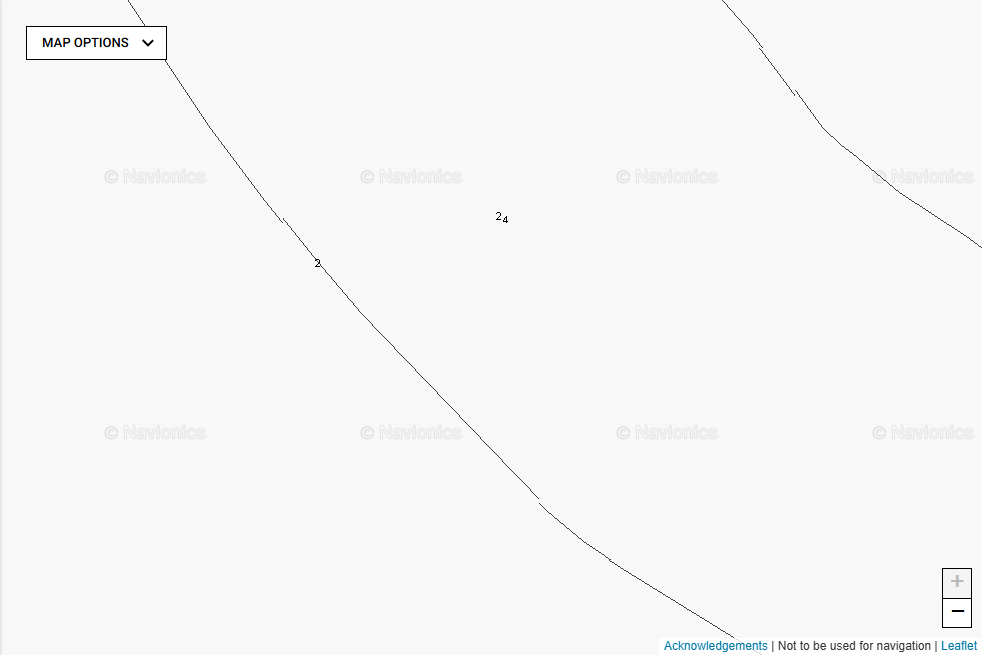

- **file**: `07_scale/shapes/mount-maunganui-reef/src/navionics/naut_z18_shade00.0.png`
- **kind**: chart_screenshot
- **shows**: The Navionics chart around the reef site at each shallow-shading value: contour lines every 0.5 m (SonarChart) / only 2 m and 5 m (Nautical Charts) plus spot soundings; the reef (removed 2014) is not drawn.
- **structure visible**: False
- **state shown**: seabed 2026 (reef removed Sep-Nov 2014; chart data date unknown)
- **image date**: chart data dates not shown by the viewer; screenshots 2026-10-06
- **citation**: Garmin Ltd / Navionics (2026). Marine Maps viewer, Nautical Charts, depths in metres, zoom 18; series of 11 screenshots with 'Shallow shading' 0, 1, ... 10 m (centre -37.6447833, 176.2025908; page title 'Garmin | Marine Maps', 'Not to be used for navigation'). https://maps.garmin.com/en-US/marine?maps=another-brand&overlay=false&key=rcm3cdfz1zy2 (webapp.navionics.com redirects here). Captured 2026-10-06 10:43-10:48 local by navionics_capture.py (own headless Chrome, random debug port, fresh profile). Accessed 2026-10-06.
- **image URL**: https://maps.garmin.com/en-US/marine?maps=another-brand&overlay=false&key=rcm3cdfz1zy2
- **source page**: https://maps.garmin.com/en-US/marine?maps=another-brand&overlay=false&key=rcm3cdfz1zy2
- **page / figure**: Nautical Charts zoom 18 (0.473 m/px); files naut_z18_shade00.0 .. shade10.0 (the blue area is water shallower than the setting, so its edge is the chart contour of that depth)
- **credit**: Garmin Navionics charts and SonarChart (c) Navionics / Garmin Ltd; screenshots by this project (own headless Chrome)
- **licence**: Garmin/Navionics terms ('Not to be used for navigation'); no open licence; private research copy, reuse NOT cleared
- **retrieved**: 2026-10-06
- **used for**: cross_check
- **How used for the model**: Check of the zoom-17 nautical reading: 2 m contour y = 268, 5 m y = 489 (z17: 266, 489). Not used further.
- **3D check pending**: no - RESOLVED by the 3D agent 2026-10-06. Result: Seabed profile read (contours 1-9 m, datum assumed CD, tested against the 2013 multibeam bed: RMS 0.30 m as CD vs 0.78 MVD-53 vs 0.95 MSL); chart depth at the reef centroid 2.76 m; reef not drawn as a feature (removed 2014).
- **series files (11)**: `07_scale/shapes/mount-maunganui-reef/src/navionics/naut_z18_shade00.0.png` .. `07_scale/shapes/mount-maunganui-reef/src/navionics/naut_z18_shade10.0.png`
- **size**: 0.02 MB, 982x655 px
- **sha256**: 877b66e0a7a75f8572e320f52b5701c70c455fc83b771d9977215b1c23737726
- **rights**: Private research copy; reuse rights to be checked before any public release.
- **display in HTML**: True
- **added by**: 3D agent mount-maunganui-reef, 2026-10-06
