# Image registry - narrowneck-gold-coast

Source of truth: `images.json` in this folder (convention: `_agent_briefs/image_registry.md`; overview: `03_images/reefs/README.md`). This file is generated from it.

44 images registered, 44 with a file, 22 used for the model (any use other than context/not_used).

## narrowneck-gold-coast-img-01 - Jackson et al. 2012 p.3 (page render): Fig 2 reef levels original vs revised design, Fig 3 container placement schedule

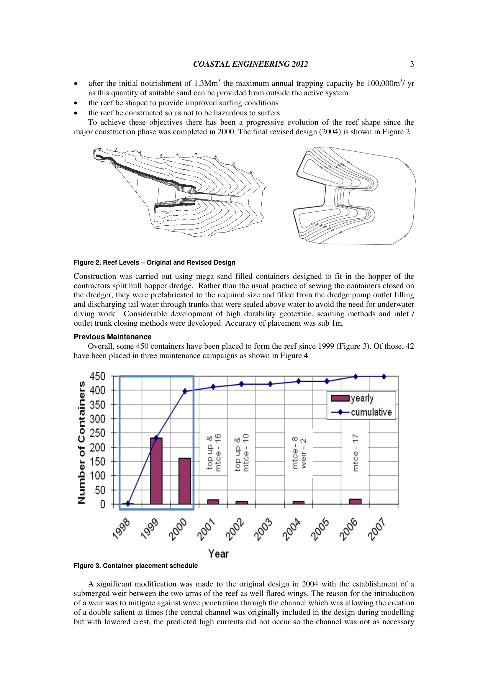

- **file**: `07_scale/shapes/narrowneck-gold-coast/src/gov/narrowneck-gold-coast_jackson2012_page3_200dpi_2012.png`
- **kind**: design_drawing
- **shows**: Plan-view design contour drawings of the two Narrowneck arms: original design (labels -2 to -10) and the 2004 revised design with flared wings and central weir (crest contour -2.50, labels to -8.00), plus the cumulative container-count chart (450 by 2007). No scale bar, no north arrow.
- **structure visible**: True
- **state shown**: design (original 1999 and revised 2004)
- **image date**: Fig 2 left: original design 1997-1999; Fig 2 right: final revised design 2004; Fig 3: 1998-2007 schedule
- **citation**: Jackson, A., Tomlinson, R., Corbett, B. and Strauss, D. (2012). Long term performance of a submerged coastal control structure: a case study of the Narrowneck multi-functional artificial reef. Coastal Engineering Proceedings 1(33), structures.54 (Proc. 33rd International Conference on Coastal Engineering, Santander), doi:10.9753/icce.v33.structures.54, page 3 (Figs 2-3). https://icce-ojs-tamu.tdl.org/icce/article/view/6956. Accessed 2026-10-06.
- **image URL**: https://icce-ojs-tamu.tdl.org/icce/article/download/6956/pdf
- **source page**: https://icce-ojs-tamu.tdl.org/icce/article/view/6956
- **page / figure**: p.3, Figs 2 and 3 (page rendered at 200 dpi from the PDF)
- **credit**: Jackson et al. (2012) / ICCE. The paper credits no individual figure; monitoring data and surveys are Gold Coast City Council, ICM and Griffith Centre for Coastal Management.
- **licence**: ICCE OJS site carries a Creative Commons Attribution 4.0 (CC BY 4.0) badge; the 2012 record has no per-article rights statement - confirm before public release.
- **retrieved**: 2026-10-06
- **used for**: plan_trace; 3d_crest; 3d_height_slopes; cross_check
- **How used for the model**: Read the contour labels of the revised 2004 design: crest-top -2.50, then -3.00 ... -5.0 every 0.5 m, -6.0, outer limit -8.00; original design labels -2 ... -10 (datum not stated in the paper; AHD from other sources). Annotated copy: 07_scale/bathymetry/gold_coast/annotated/narrowneck_jackson2012_fig2_design_depth_labels_read.png. Goes to REPORT.md section 6 (Narrowneck integration plan) for the tracer; shape.json untouched.
- **3D check pending**: YES - Tracer: compare the traced planform with the 2004 revised design (flared wings + central weir) in Fig 2 right; crest -2.50 vs adopted -2.5 AHD; confirm datum (AHD vs LAT) of the labels (values: planform, crest_z, seabed)
- **annotated / overlay files**: `07_scale/bathymetry/gold_coast/annotated/narrowneck_jackson2012_fig2_design_depth_labels_read.png`
- **linked records**: 07_scale/bathymetry/gold_coast/SOURCES.md GC-N01; 07_scale/bathymetry/gold_coast/REPORT.md
- **size**: 0.53 MB, 1654x2339 px
- **sha256**: bc40be416f2b50066453d84ee312165933be20c3acc6018b0e852a257ed94682
- **rights**: Private research copy; reuse rights to be checked before any public release.
- **display in HTML**: True
- **added by**: gold_coast_gov_reports_bathymetry, 2026-10-06
- **3D / planform check result (2026-10-06)**: Planform checked 2026-10-06: Fig 2 right = 2004 revised design: two arms + central channel + flared wings at the shoreward ends (the 2004 revised design) = the topology of our trace (shape.json, s3 Esri 2020-08-08). The -2.50 m crest wedge covers only the shoreward ~60 m of each arm, contours -3.0 ... -6.0 deepen seaward (outer -8.0); the visible 2020 container field (113 x 157 m, arms 134 m and 111 m long) corresponds to the design out to about the -6 m contour. Crest -2.50 vs RL -2.5 m AHD adopted: consistent (Jackson 2007 p.7); datum of these labels still unstated here. STILL PENDING for the 3D agent: crest/datum and seabed only.
- **How used (update 2026-10-06)**: Planform result written by the Narrowneck tracer: topology and arm length agree with shape.json (METHOD.md Steps 2d, 3, 6).

## narrowneck-gold-coast-img-02 - Jackson et al. 2012 p.4 (page render): Fig 4 maintenance placement plans 2002-2006, Fig 5 survey 9 June 2011 and isopach 2008-2011

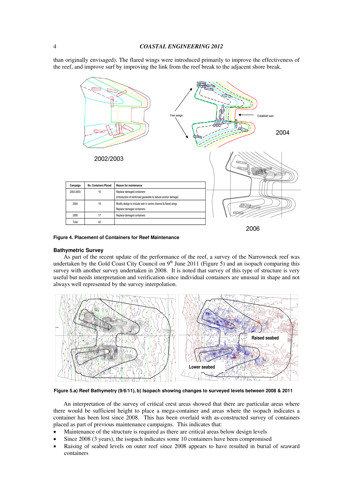

- **file**: `07_scale/shapes/narrowneck-gold-coast/src/gov/narrowneck-gold-coast_jackson2012_page4_200dpi_2012.png`
- **kind**: plan_figure
- **shows**: Plan views of the maintenance container placements on the design contours (2002/03 original planform; 2004 with flared wings and weir; 2006), and the 9 June 2011 hydrographic survey contours of the reef with the isopach 2008-2011 (raised/lowered seabed). Unlabelled colour/contour plots: no depth values, no scale bar.
- **structure visible**: True
- **state shown**: design + as-maintained (2002-2011)
- **image date**: Fig 4: plans 2002/03, 2004, 2006; Fig 5: survey 9 June 2011 (Gold Coast City Council) and comparison with 2008
- **citation**: Jackson, A., Tomlinson, R., Corbett, B. and Strauss, D. (2012). Long term performance of a submerged coastal control structure: a case study of the Narrowneck multi-functional artificial reef. Coastal Engineering Proceedings 1(33), structures.54 (Proc. 33rd International Conference on Coastal Engineering, Santander), doi:10.9753/icce.v33.structures.54, page 4 (Figs 4-5). https://icce-ojs-tamu.tdl.org/icce/article/view/6956. Accessed 2026-10-06.
- **image URL**: https://icce-ojs-tamu.tdl.org/icce/article/download/6956/pdf
- **source page**: https://icce-ojs-tamu.tdl.org/icce/article/view/6956
- **page / figure**: p.4, Figs 4 and 5 (page rendered at 200 dpi)
- **credit**: Jackson et al. (2012) / ICCE. The paper credits no individual figure; monitoring data and surveys are Gold Coast City Council, ICM and Griffith Centre for Coastal Management.
- **licence**: ICCE OJS site carries a Creative Commons Attribution 4.0 (CC BY 4.0) badge; the 2012 record has no per-article rights statement - confirm before public release.
- **retrieved**: 2026-10-06
- **used for**: plan_trace; cross_check; context
- **How used for the model**: Confirms the design topology (two arms, weir channel, flared wings) and that GCCC surveyed the reef on 9 June 2011; no depth value can be read (no contour labels). Goes to REPORT.md section 6 as evidence that a 2011 survey exists (not published as data).
- **3D check pending**: no - Tracer: planform of the traced reef vs the 2004 revised design outline in Fig 4/5 (arms, weir channel, flared wings) (values: planform)
- **linked records**: 07_scale/bathymetry/gold_coast/SOURCES.md GC-N02; 07_scale/bathymetry/gold_coast/REPORT.md
- **size**: 1.32 MB, 1654x2339 px
- **sha256**: 1491b5a9e8117f1086634b198937ea0d86dc09ecf4d067c4f5954ebec7dbfc05
- **rights**: Private research copy; reuse rights to be checked before any public release.
- **display in HTML**: True
- **added by**: gold_coast_gov_reports_bathymetry, 2026-10-06
- **3D / planform check result (2026-10-06)**: Planform checked 2026-10-06: Fig 4 (2002/03, 2004 plan with 'flair wings' and 'establish weir', 2006) shows the same two-arm layout with channel; the 2004 weir containers are drawn N-S across the channel, flared wings at the shoreward ends. Our trace (renewed 2018 state) has two arms, a 20.7 m channel gap, shoreward patches on the north wing; the weir containers are not visible in 2020 (lowered/buried, Jackson 2012 p.6). Planform check done.
- **How used (update 2026-10-06)**: Topology cross-check of the traced shape (METHOD.md Step 6).

## narrowneck-gold-coast-img-03 - Jackson et al. 2012 p.5 (page render): Fig 6 aerial photographs 2004 and 2011, Fig 7 July 2011 aerial overlaid with design contours and maintenance containers

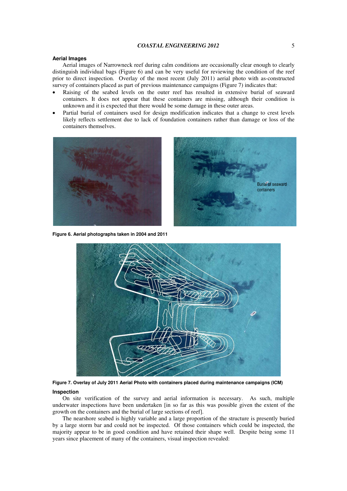

- **file**: `07_scale/shapes/narrowneck-gold-coast/src/gov/narrowneck-gold-coast_jackson2012_page5_200dpi_2012.png`
- **kind**: aerial
- **shows**: Vertical aerial photos of Narrowneck Reef in 2004 and July 2011 (two arms of dark container patches, shore left, sea right) and the 2011 photo overlaid with the revised design contours and as-constructed maintenance containers (ICM).
- **structure visible**: True
- **state shown**: as-built/maintained (2004, 2011)
- **image date**: Fig 6: 2004 and July 2011; Fig 7: July 2011
- **citation**: Jackson, A., Tomlinson, R., Corbett, B. and Strauss, D. (2012). Long term performance of a submerged coastal control structure: a case study of the Narrowneck multi-functional artificial reef. Coastal Engineering Proceedings 1(33), structures.54 (Proc. 33rd International Conference on Coastal Engineering, Santander), doi:10.9753/icce.v33.structures.54, page 5 (Figs 6-7). https://icce-ojs-tamu.tdl.org/icce/article/view/6956. Accessed 2026-10-06.
- **image URL**: https://icce-ojs-tamu.tdl.org/icce/article/download/6956/pdf
- **source page**: https://icce-ojs-tamu.tdl.org/icce/article/view/6956
- **page / figure**: p.5, Figs 6 and 7 (page rendered at 200 dpi)
- **credit**: Jackson et al. (2012) / ICCE. The paper credits no individual figure; monitoring data and surveys are Gold Coast City Council, ICM and Griffith Centre for Coastal Management.
- **licence**: ICCE OJS site carries a Creative Commons Attribution 4.0 (CC BY 4.0) badge; the 2012 record has no per-article rights statement - confirm before public release.
- **retrieved**: 2026-10-06
- **used for**: plan_trace; cross_check
- **How used for the model**: Fig 7 gives control between the 2004 revised design outline and the July 2011 aerial (no scale bar, no north arrow; georeference to Esri by matching container patches). Goes to REPORT.md section 6 as tracer input.
- **3D check pending**: no - Tracer: georeference Fig 6b/7 to Esri and compare outline vs shape.json (planform, arm lengths, weir channel) (values: planform)
- **linked records**: 07_scale/bathymetry/gold_coast/SOURCES.md GC-N03; 07_scale/bathymetry/gold_coast/REPORT.md
- **size**: 2.40 MB, 1654x2339 px
- **sha256**: 6ef32c2c1c88713c802e1f02396aeb9b735b5bee376f8160cc34e03e42363b35
- **rights**: Private research copy; reuse rights to be checked before any public release.
- **display in HTML**: True
- **added by**: gold_coast_gov_reports_bathymetry, 2026-10-06
- **3D / planform check result (2026-10-06)**: Planform checked 2026-10-06: Figs 6b/7 on this page were georeferenced to Esri on the container patches (METHOD.md Step 2d; Fig 7 = 0.21 m/px +-10 %, Fig 6b 0.3675 m/px, placement +-15 m). The 2020 trace lies inside the 2004 design envelope on both arms; offshore extents (canonical frame): north arm trace y 239.7-369.1 m vs design outer contour 217-354 m, south arm 230.3-341.7 vs 208-346 m. Differences (+15 m N tip, -4 m S tip, ~22 m at the shoreward wall) are inside the tolerance. Planform check done.
- **How used (update 2026-10-06)**: Source page of the design-prior registration (shape.json design_prior).
- **annotated versions**: 07_scale/shapes/narrowneck-gold-coast/overlays/fig7_2011_aerial_design_contours_with_2020_trace.png, 07_scale/shapes/narrowneck-gold-coast/overlays/design_prior_fig7_contours_on_s3.png

## narrowneck-gold-coast-img-04 - Jackson et al. 2012 Fig 2: Reef Levels - Original and Revised Design (crop)

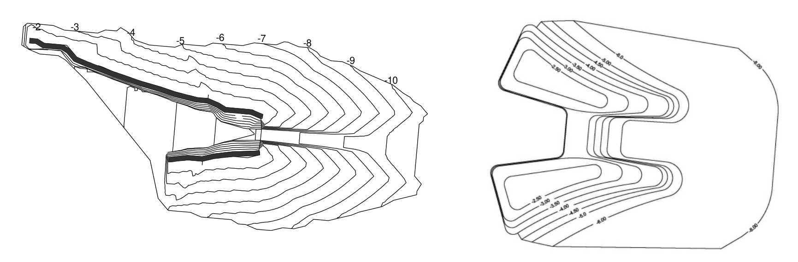

- **file**: `07_scale/shapes/narrowneck-gold-coast/src/gov/narrowneck-gold-coast_jackson2012_fig2_reef_levels_original_and_revised_design_300dpi_crop.png`
- **kind**: design_drawing
- **shows**: Two contour plans: left the original design with labelled levels -2 to -10; right the final revised design (flared wings, central weir channel) with labelled levels -2.50 (crest top), -3.00 ... -6.0 and -8.00.
- **structure visible**: True
- **state shown**: design (original 1999 / revised 2004)
- **image date**: original design 1997-1999; revised design 2004
- **citation**: Jackson, A., Tomlinson, R., Corbett, B. and Strauss, D. (2012). Long term performance of a submerged coastal control structure: a case study of the Narrowneck multi-functional artificial reef. Coastal Engineering Proceedings 1(33), structures.54 (Proc. 33rd International Conference on Coastal Engineering, Santander), doi:10.9753/icce.v33.structures.54, p.3, Fig 2 (crop of the vector figure rendered at 300 dpi). https://icce-ojs-tamu.tdl.org/icce/article/view/6956. Accessed 2026-10-06.
- **image URL**: https://icce-ojs-tamu.tdl.org/icce/article/download/6956/pdf
- **source page**: https://icce-ojs-tamu.tdl.org/icce/article/view/6956
- **page / figure**: p.3, Fig 2 (crop of the vector figure rendered at 300 dpi)
- **credit**: Jackson et al. (2012) / ICCE. The paper credits no individual figure; monitoring data and surveys are Gold Coast City Council, ICM and Griffith Centre for Coastal Management.
- **licence**: ICCE OJS site carries a Creative Commons Attribution 4.0 (CC BY 4.0) badge; the 2012 record has no per-article rights statement - confirm before public release.
- **retrieved**: 2026-10-06
- **used for**: plan_trace; 3d_crest; 3d_height_slopes; cross_check
- **How used for the model**: Depth labels read and boxed in annotated/narrowneck_jackson2012_fig2_design_depth_labels_read.png: revised crest -2.50 (both arms), side contours every 0.5 m to -5.0, then -6.0 and -8.00 outer limit; datum not stated in the paper. Goes to REPORT.md section 6.
- **3D check pending**: YES - Revised-design planform (flared wings, weir) vs the traced shape; crest -2.50 vs 'adopted -1.5 AHD' claim in a search snippet; datum of labels (values: planform, crest_z, seabed)
- **annotated / overlay files**: `07_scale/bathymetry/gold_coast/annotated/narrowneck_jackson2012_fig2_design_depth_labels_read.png`
- **linked records**: 07_scale/bathymetry/gold_coast/SOURCES.md GC-N04; 07_scale/bathymetry/gold_coast/REPORT.md
- **size**: 0.29 MB, 1731x570 px
- **sha256**: a91c1bc6d908122ff6cb5e0a9cf49005e17898767fa3fda6209a6c1b063694a6
- **rights**: Private research copy; reuse rights to be checked before any public release.
- **display in HTML**: True
- **added by**: gold_coast_gov_reports_bathymetry, 2026-10-06
- **3D / planform check result (2026-10-06)**: Planform checked 2026-10-06: revised (2004) design = flared wings + central channel + two arms, same topology as the trace; arm length to the -6 m contour about 121 m (Fig 13 bar) vs 134 m traced (north arm). Labels read -2.50 crest, -3.00, -3.50, -4.00, -4.50, -5.0, -6.0, outer -8.00 (datum not printed in the paper). The 'adopted -1.5 AHD' snippet concerns 1999 (Jackson 2007 p.4), not these labels. STILL PENDING for the 3D agent: crest depth along the arm and datum of the labels (METHOD.md INPUTS FOR 3D).
- **How used (update 2026-10-06)**: Levels and topology used for INPUTS FOR 3D (crest variation along the arms).

## narrowneck-gold-coast-img-05 - Jackson et al. 2012 Fig 4: placement of containers for reef maintenance (2002/03, 2004, 2006)

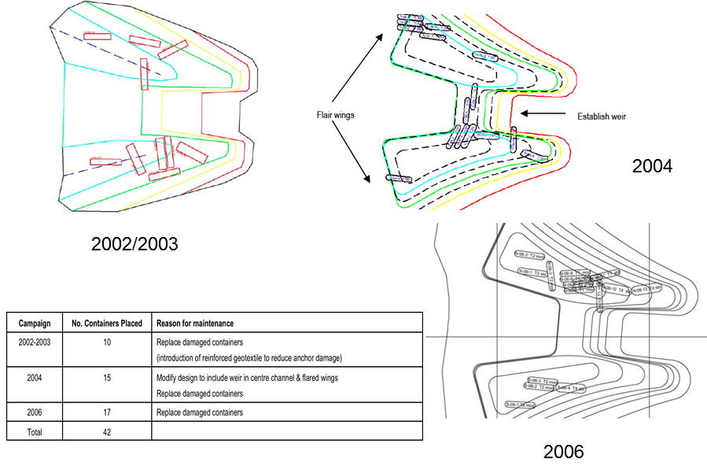

- **file**: `07_scale/shapes/narrowneck-gold-coast/src/gov/narrowneck-gold-coast_jackson2012_fig4_container_placement_plans_2002-2006_native.png`
- **kind**: plan_figure
- **shows**: Three design-contour plans with the container placements of the 2002/03, 2004 (flared wings + weir) and 2006 campaigns, with the campaign table (10 + 15 + 17 = 42 containers).
- **structure visible**: True
- **state shown**: design + maintenance 2002-2006
- **image date**: 2002-2006
- **citation**: Jackson, A., Tomlinson, R., Corbett, B. and Strauss, D. (2012). Long term performance of a submerged coastal control structure: a case study of the Narrowneck multi-functional artificial reef. Coastal Engineering Proceedings 1(33), structures.54 (Proc. 33rd International Conference on Coastal Engineering, Santander), doi:10.9753/icce.v33.structures.54, p.4, Fig 4 (embedded raster, native resolution). https://icce-ojs-tamu.tdl.org/icce/article/view/6956. Accessed 2026-10-06.
- **image URL**: https://icce-ojs-tamu.tdl.org/icce/article/download/6956/pdf
- **source page**: https://icce-ojs-tamu.tdl.org/icce/article/view/6956
- **page / figure**: p.4, Fig 4 (embedded raster, native resolution)
- **credit**: Jackson et al. (2012) / ICCE. The paper credits no individual figure; monitoring data and surveys are Gold Coast City Council, ICM and Griffith Centre for Coastal Management.
- **licence**: ICCE OJS site carries a Creative Commons Attribution 4.0 (CC BY 4.0) badge; the 2012 record has no per-article rights statement - confirm before public release.
- **retrieved**: 2026-10-06
- **used for**: plan_trace; context
- **How used for the model**: Shows when the 2004 modification (weir and flared wings) entered the planform; the numbers (42 containers in three campaigns) are already in the Narrowneck METHOD.md. Goes to REPORT.md section 6.
- **3D check pending**: no - Planform: which design version (original vs 2004 with weir and flared wings) the traced outline represents (values: planform)
- **linked records**: 07_scale/bathymetry/gold_coast/SOURCES.md GC-N05; 07_scale/bathymetry/gold_coast/REPORT.md
- **size**: 0.19 MB, 899x597 px
- **sha256**: 9b044a8e1006a36973c8bd678fb81af815c50e3aaa015a295b516720fb33704d
- **rights**: Private research copy; reuse rights to be checked before any public release.
- **display in HTML**: True
- **added by**: gold_coast_gov_reports_bathymetry, 2026-10-06
- **3D / planform check result (2026-10-06)**: Planform checked 2026-10-06: Fig 4 shows maintenance on the ORIGINAL 1999-2000 layout (2002/03) and the 2004 modification (weir + flared wings) that became the 'final revised design'. The traced outline represents the June 2018 renewed state of that 2004 revised layout (two arms, channel, flared wings), not the 1998 split V. Planform check done.
- **How used (update 2026-10-06)**: Design-version decision (shape.json design_version).

## narrowneck-gold-coast-img-06 - Jackson et al. 2012 Fig 5a: Narrowneck reef bathymetry survey 9 June 2011

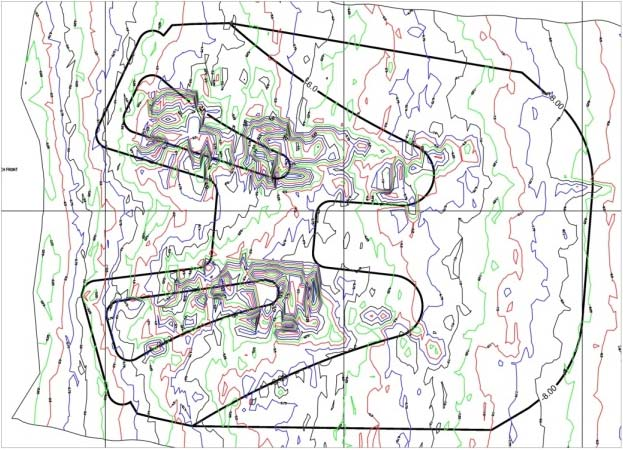

- **file**: `07_scale/shapes/narrowneck-gold-coast/src/gov/narrowneck-gold-coast_jackson2012_fig5a_reef_bathymetry_2011-06-09_native.jpeg`
- **kind**: survey_plot
- **shows**: Contour plot of the Gold Coast City Council hydrographic survey over the reef (coloured contour lines inside the revised design outline). No contour labels, scale or datum on the image.
- **structure visible**: True
- **state shown**: as-maintained (2011-06-09)
- **image date**: survey 2011-06-09
- **citation**: Jackson, A., Tomlinson, R., Corbett, B. and Strauss, D. (2012). Long term performance of a submerged coastal control structure: a case study of the Narrowneck multi-functional artificial reef. Coastal Engineering Proceedings 1(33), structures.54 (Proc. 33rd International Conference on Coastal Engineering, Santander), doi:10.9753/icce.v33.structures.54, p.4, Fig 5a (embedded raster). https://icce-ojs-tamu.tdl.org/icce/article/view/6956. Accessed 2026-10-06.
- **image URL**: https://icce-ojs-tamu.tdl.org/icce/article/download/6956/pdf
- **source page**: https://icce-ojs-tamu.tdl.org/icce/article/view/6956
- **page / figure**: p.4, Fig 5a (embedded raster)
- **credit**: Jackson et al. (2012) / ICCE. The paper credits no individual figure; monitoring data and surveys are Gold Coast City Council, ICM and Griffith Centre for Coastal Management.
- **licence**: ICCE OJS site carries a Creative Commons Attribution 4.0 (CC BY 4.0) badge; the 2012 record has no per-article rights statement - confirm before public release.
- **retrieved**: 2026-10-06
- **used for**: cross_check; context
- **How used for the model**: No depth value readable (contours unlabelled). Evidence that a 2011 GCCC reef survey exists and that its contours follow the revised-design outline. Goes to REPORT.md section 6.
- **3D check pending**: no - None (unlabelled); request the survey from GCCC if depths are needed (values: seabed)
- **linked records**: 07_scale/bathymetry/gold_coast/SOURCES.md GC-N06; 07_scale/bathymetry/gold_coast/REPORT.md
- **size**: 0.07 MB, 623x450 px
- **sha256**: cecfb194929517b086686e048933b834cef55e577f801a98fceb95f6f093cf71
- **rights**: Private research copy; reuse rights to be checked before any public release.
- **display in HTML**: True
- **added by**: gold_coast_gov_reports_bathymetry, 2026-10-06

## narrowneck-gold-coast-img-07 - Jackson et al. 2012 Fig 5b: isopach of changes to surveyed levels 2008-2011

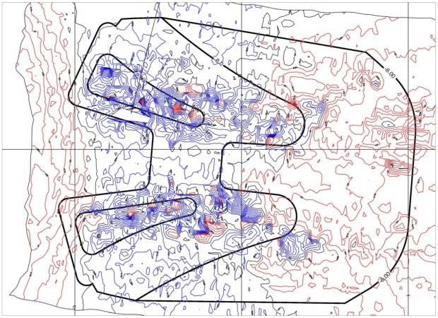

- **file**: `07_scale/shapes/narrowneck-gold-coast/src/gov/narrowneck-gold-coast_jackson2012_fig5b_isopach_2008-2011_native.jpeg`
- **kind**: survey_plot
- **shows**: Isopach (difference map) of reef levels 2008 vs 2011: blue/red contours for lowered/raised seabed, with the revised design outline.
- **structure visible**: True
- **state shown**: as-maintained (2008-2011)
- **image date**: 2008-2011
- **citation**: Jackson, A., Tomlinson, R., Corbett, B. and Strauss, D. (2012). Long term performance of a submerged coastal control structure: a case study of the Narrowneck multi-functional artificial reef. Coastal Engineering Proceedings 1(33), structures.54 (Proc. 33rd International Conference on Coastal Engineering, Santander), doi:10.9753/icce.v33.structures.54, p.4, Fig 5b (embedded raster). https://icce-ojs-tamu.tdl.org/icce/article/view/6956. Accessed 2026-10-06.
- **image URL**: https://icce-ojs-tamu.tdl.org/icce/article/download/6956/pdf
- **source page**: https://icce-ojs-tamu.tdl.org/icce/article/view/6956
- **page / figure**: p.4, Fig 5b (embedded raster)
- **credit**: Jackson et al. (2012) / ICCE. The paper credits no individual figure; monitoring data and surveys are Gold Coast City Council, ICM and Griffith Centre for Coastal Management.
- **licence**: ICCE OJS site carries a Creative Commons Attribution 4.0 (CC BY 4.0) badge; the 2012 record has no per-article rights statement - confirm before public release.
- **retrieved**: 2026-10-06
- **used for**: context
- **How used for the model**: Context only: shows burial of the seaward containers (raised seabed on the outer reef) and 10 compromised containers; no values readable.
- **3D check pending**: no - None
- **linked records**: 07_scale/bathymetry/gold_coast/SOURCES.md GC-N07; 07_scale/bathymetry/gold_coast/REPORT.md
- **size**: 0.08 MB, 620x450 px
- **sha256**: 43a1e7e736891242ede0b93a4fddfe5cd8b84f9f51663b4388ef34436f63ae16
- **rights**: Private research copy; reuse rights to be checked before any public release.
- **display in HTML**: True
- **added by**: gold_coast_gov_reports_bathymetry, 2026-10-06

## narrowneck-gold-coast-img-08 - Jackson et al. 2012 Fig 6 (left): aerial photograph of Narrowneck Reef, 2004

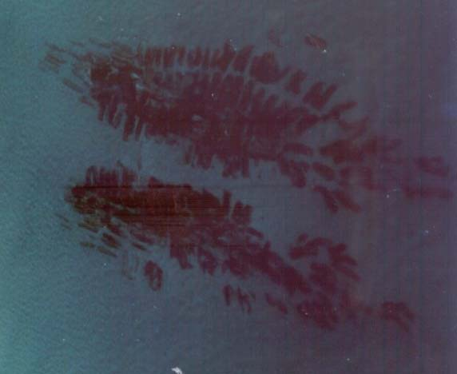

- **file**: `07_scale/shapes/narrowneck-gold-coast/src/gov/narrowneck-gold-coast_jackson2012_fig6a_aerial_2004_native.jpeg`
- **kind**: aerial
- **shows**: Vertical aerial of the two container arms (dark patches), scan with red cast; shore to the left.
- **structure visible**: True
- **state shown**: as-built/maintained (2004, after the weir modification)
- **image date**: 2004 (month not stated)
- **citation**: Jackson, A., Tomlinson, R., Corbett, B. and Strauss, D. (2012). Long term performance of a submerged coastal control structure: a case study of the Narrowneck multi-functional artificial reef. Coastal Engineering Proceedings 1(33), structures.54 (Proc. 33rd International Conference on Coastal Engineering, Santander), doi:10.9753/icce.v33.structures.54, p.5, Fig 6 left (embedded raster). https://icce-ojs-tamu.tdl.org/icce/article/view/6956. Accessed 2026-10-06.
- **image URL**: https://icce-ojs-tamu.tdl.org/icce/article/download/6956/pdf
- **source page**: https://icce-ojs-tamu.tdl.org/icce/article/view/6956
- **page / figure**: p.5, Fig 6 left (embedded raster)
- **credit**: Jackson et al. (2012) / ICCE. The paper credits no individual figure; monitoring data and surveys are Gold Coast City Council, ICM and Griffith Centre for Coastal Management.
- **licence**: ICCE OJS site carries a Creative Commons Attribution 4.0 (CC BY 4.0) badge; the 2012 record has no per-article rights statement - confirm before public release.
- **retrieved**: 2026-10-06
- **used for**: plan_trace; cross_check
- **How used for the model**: Second aerial for the 2004 planform; no scale bar; usable by control-point matching to Esri. Goes to REPORT.md section 6.
- **3D check pending**: no - Planform in 2004 vs shape.json (weir channel, flared wings) (values: planform)
- **linked records**: 07_scale/bathymetry/gold_coast/SOURCES.md GC-N08; 07_scale/bathymetry/gold_coast/REPORT.md
- **size**: 0.02 MB, 572x468 px
- **sha256**: b97d921c5457066df1fbae790b05cb278910d6193c94343d96455cc6bbd5e6ec
- **rights**: Private research copy; reuse rights to be checked before any public release.
- **display in HTML**: True
- **added by**: gold_coast_gov_reports_bathymetry, 2026-10-06
- **3D / planform check result (2026-10-06)**: Planform checked 2026-10-06: the 2004 aerial (no scale, no north arrow, red-toned film) shows the same two container fields with an open channel between; the fields are fan-shaped and scattered. Not georeferenced (no usable control); topology agrees with the trace. Planform check done.
- **How used (update 2026-10-06)**: Qualitative topology check only.

## narrowneck-gold-coast-img-09 - Jackson et al. 2012 Fig 6 (right): aerial photograph of Narrowneck Reef, July 2011

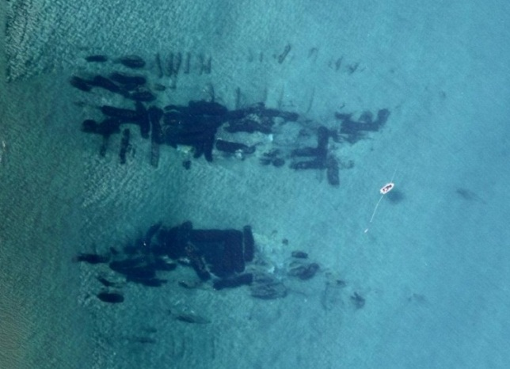

- **file**: `07_scale/shapes/narrowneck-gold-coast/src/gov/narrowneck-gold-coast_jackson2012_fig6b_aerial_2011-07_native.jpeg`
- **kind**: aerial
- **shows**: Clear vertical aerial of the two container arms in calm water, individual container patches visible; shore to the left, north up.
- **structure visible**: True
- **state shown**: as-maintained (July 2011; about 10 containers compromised since 2008)
- **image date**: 2011-07
- **citation**: Jackson, A., Tomlinson, R., Corbett, B. and Strauss, D. (2012). Long term performance of a submerged coastal control structure: a case study of the Narrowneck multi-functional artificial reef. Coastal Engineering Proceedings 1(33), structures.54 (Proc. 33rd International Conference on Coastal Engineering, Santander), doi:10.9753/icce.v33.structures.54, p.5, Fig 6 right (embedded raster). https://icce-ojs-tamu.tdl.org/icce/article/view/6956. Accessed 2026-10-06.
- **image URL**: https://icce-ojs-tamu.tdl.org/icce/article/download/6956/pdf
- **source page**: https://icce-ojs-tamu.tdl.org/icce/article/view/6956
- **page / figure**: p.5, Fig 6 right (embedded raster)
- **credit**: Jackson et al. (2012) / ICCE. The paper credits no individual figure; monitoring data and surveys are Gold Coast City Council, ICM and Griffith Centre for Coastal Management.
- **licence**: ICCE OJS site carries a Creative Commons Attribution 4.0 (CC BY 4.0) badge; the 2012 record has no per-article rights statement - confirm before public release.
- **retrieved**: 2026-10-06
- **used for**: plan_trace; cross_check
- **How used for the model**: Best pre-renewal aerial of the containers: tracer can trace the 2011 arm outlines by georeferencing to Esri (no scale bar). Goes to REPORT.md section 6.
- **3D check pending**: no - Planform in July 2011 vs shape.json and vs the June 2018 renewal (previous vs amended shape) (values: planform)
- **linked records**: 07_scale/bathymetry/gold_coast/SOURCES.md GC-N09; 07_scale/bathymetry/gold_coast/REPORT.md
- **size**: 0.08 MB, 644x466 px
- **sha256**: 937fc67575509acd9aeabd1e48c436f9b859509f0bb367cd9531f3eaa56f0ba9
- **rights**: Private research copy; reuse rights to be checked before any public release.
- **display in HTML**: True
- **added by**: gold_coast_gov_reports_bathymetry, 2026-10-06
- **3D / planform check result (2026-10-06)**: Planform checked 2026-10-06: georeferenced to Esri s3 (Fig 7/Fig 6b ratio 1.75; Fig 6b 0.3675 m/px +-10 %, dark-patch NCC corr 0.57; overlays). The 2020 trace laid on this 2011 photograph follows the 2011 dark container patches on both arms; the 2011 north-arm field already reached the same seaward limit as in 2020 (also seen in the 2016 Esri image s6), so the 2018 renewal added mostly dense infill and the amended shape differs from the 2011 footprint by less than the +-15 m registration tolerance. Planform check done.
- **How used (update 2026-10-06)**: Used with Fig 7 to place the design prior on the Esri imagery (METHOD.md Step 2d; design_registration.py).
- **annotated versions**: 07_scale/shapes/narrowneck-gold-coast/overlays/fig6b_2011_aerial_with_2020_trace.png

## narrowneck-gold-coast-img-10 - Jackson et al. 2012 Fig 7: July 2011 aerial overlaid with design contours and maintenance containers (ICM)

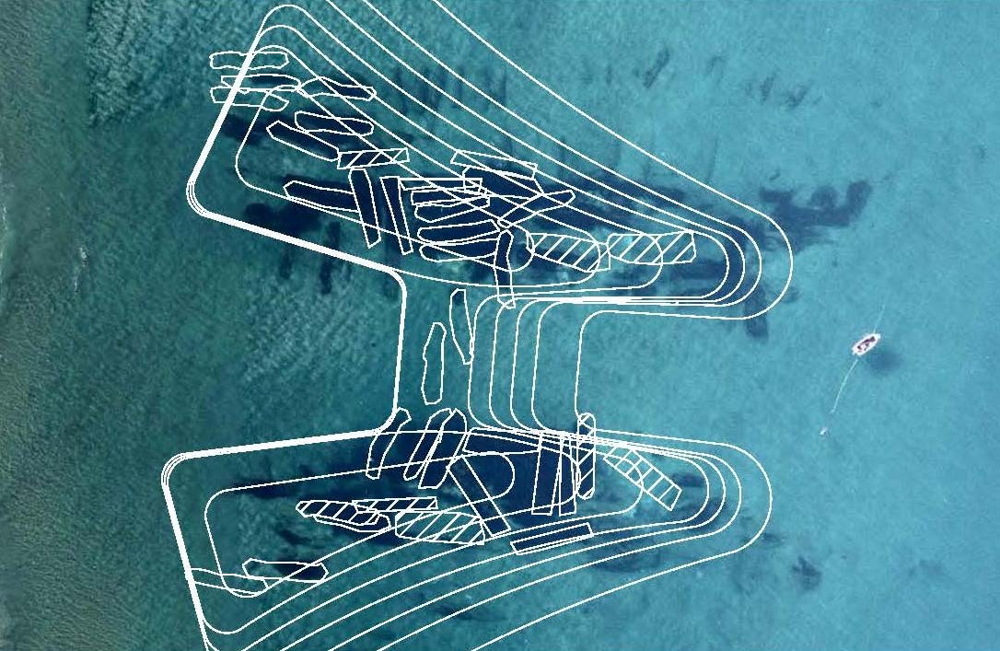

- **file**: `07_scale/shapes/narrowneck-gold-coast/src/gov/narrowneck-gold-coast_jackson2012_fig7_overlay_2011-07_aerial_with_design_contours_and_containers_native.jpeg`
- **kind**: aerial
- **shows**: The July 2011 aerial with the revised design contours (white) and the as-constructed maintenance containers drawn on top: shows how the design planform sits on the actual container patches.
- **structure visible**: True
- **state shown**: as-maintained (July 2011) with 2004 revised design overlay
- **image date**: 2011-07
- **citation**: Jackson, A., Tomlinson, R., Corbett, B. and Strauss, D. (2012). Long term performance of a submerged coastal control structure: a case study of the Narrowneck multi-functional artificial reef. Coastal Engineering Proceedings 1(33), structures.54 (Proc. 33rd International Conference on Coastal Engineering, Santander), doi:10.9753/icce.v33.structures.54, p.5, Fig 7 (embedded raster). https://icce-ojs-tamu.tdl.org/icce/article/view/6956. Accessed 2026-10-06.
- **image URL**: https://icce-ojs-tamu.tdl.org/icce/article/download/6956/pdf
- **source page**: https://icce-ojs-tamu.tdl.org/icce/article/view/6956
- **page / figure**: p.5, Fig 7 (embedded raster)
- **credit**: Jackson et al. (2012) / ICCE. The paper credits no individual figure; monitoring data and surveys are Gold Coast City Council, ICM and Griffith Centre for Coastal Management.
- **licence**: ICCE OJS site carries a Creative Commons Attribution 4.0 (CC BY 4.0) badge; the 2012 record has no per-article rights statement - confirm before public release.
- **retrieved**: 2026-10-06
- **used for**: plan_trace; cross_check
- **How used for the model**: Control for aligning the design outline with the real patches (arm ends, weir channel). Goes to REPORT.md section 6 as the primary Narrowneck design-vs-real figure.
- **3D check pending**: no - Planform: the traced outline should coincide with the white design contours of Fig 7 within the patch width (values: planform)
- **linked records**: 07_scale/bathymetry/gold_coast/SOURCES.md GC-N10; 07_scale/bathymetry/gold_coast/REPORT.md
- **size**: 0.14 MB, 1086x707 px
- **sha256**: be4464d633942c663a16005c52036a58d6ce79eba5a497c23142b1a2ef492ed8
- **rights**: Private research copy; reuse rights to be checked before any public release.
- **display in HTML**: True
- **added by**: gold_coast_gov_reports_bathymetry, 2026-10-06
- **3D / planform check result (2026-10-06)**: Planform checked 2026-10-06: Fig 7 georeferenced to Esri s3 (0.21 m/px +-10 %, ends +-15 m). The traced container field of 2020 lies within the white 2004 design contours on most of its length; its seaward end passes the outer contour by about 15 m (north arm) and stops 4 m inside it (south arm); its shoreward end lies ~22 m seaward of the thick design wall. Neither confirms nor excludes the unverified '20 m seaward' amended shape. Planform check done.
- **How used (update 2026-10-06)**: DESIGN PRIOR registered to Esri s3 (shape.json design_prior, sources s8).
- **annotated versions**: 07_scale/shapes/narrowneck-gold-coast/overlays/fig7_2011_aerial_design_contours_with_2020_trace.png, 07_scale/shapes/narrowneck-gold-coast/overlays/design_prior_fig7_contours_on_s3.png

## narrowneck-gold-coast-img-11 - Jackson et al. 2012 Fig 1 (left): exposed boulder wall at Narrowneck after the 1996 storms

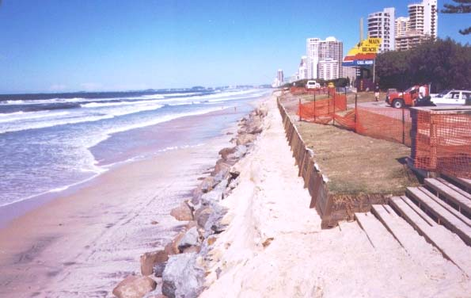

- **file**: `07_scale/shapes/narrowneck-gold-coast/src/gov/narrowneck-gold-coast_jackson2012_fig1_left_exposed_boulder_wall_1996_native.jpeg`
- **kind**: photo
- **shows**: Narrowneck beach looking south after storm erosion in 1996: boulder wall exposed, no beach. The reef does not exist yet.
- **structure visible**: False
- **state shown**: pre-construction (1996)
- **image date**: 1996
- **citation**: Jackson, A., Tomlinson, R., Corbett, B. and Strauss, D. (2012). Long term performance of a submerged coastal control structure: a case study of the Narrowneck multi-functional artificial reef. Coastal Engineering Proceedings 1(33), structures.54 (Proc. 33rd International Conference on Coastal Engineering, Santander), doi:10.9753/icce.v33.structures.54, p.2, Fig 1 left (embedded raster). https://icce-ojs-tamu.tdl.org/icce/article/view/6956. Accessed 2026-10-06.
- **image URL**: https://icce-ojs-tamu.tdl.org/icce/article/download/6956/pdf
- **source page**: https://icce-ojs-tamu.tdl.org/icce/article/view/6956
- **page / figure**: p.2, Fig 1 left (embedded raster)
- **credit**: Jackson et al. (2012) / ICCE. The paper credits no individual figure; monitoring data and surveys are Gold Coast City Council, ICM and Griffith Centre for Coastal Management.
- **licence**: ICCE OJS site carries a Creative Commons Attribution 4.0 (CC BY 4.0) badge; the 2012 record has no per-article rights statement - confirm before public release.
- **retrieved**: 2026-10-06
- **used for**: context
- **How used for the model**: Context for the reef's purpose; not used for geometry.
- **3D check pending**: no - None
- **linked records**: 07_scale/bathymetry/gold_coast/SOURCES.md GC-N11; 07_scale/bathymetry/gold_coast/REPORT.md
- **size**: 0.03 MB, 595x376 px
- **sha256**: 95d22e789a283124e358615726692804e2e915b5a9cd7959d22c17e106872ab8
- **rights**: Private research copy; reuse rights to be checked before any public release.
- **display in HTML**: True
- **added by**: gold_coast_gov_reports_bathymetry, 2026-10-06

## narrowneck-gold-coast-img-12 - Jackson et al. 2012 Fig 1 (right): Narrowneck beach looking south, 24 August 2011

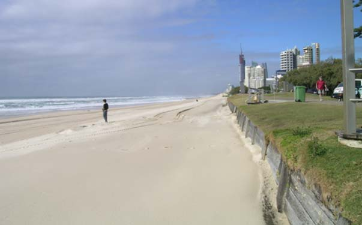

- **file**: `07_scale/shapes/narrowneck-gold-coast/src/gov/narrowneck-gold-coast_jackson2012_fig1_right_beach_looking_south_2011-08-24_native.jpeg`
- **kind**: photo
- **shows**: Widened Narrowneck beach 11 years after nourishment and reef construction; reef not visible.
- **structure visible**: False
- **state shown**: post-construction beach (2011)
- **image date**: 2011-08-24
- **citation**: Jackson, A., Tomlinson, R., Corbett, B. and Strauss, D. (2012). Long term performance of a submerged coastal control structure: a case study of the Narrowneck multi-functional artificial reef. Coastal Engineering Proceedings 1(33), structures.54 (Proc. 33rd International Conference on Coastal Engineering, Santander), doi:10.9753/icce.v33.structures.54, p.2, Fig 1 right (embedded raster). https://icce-ojs-tamu.tdl.org/icce/article/view/6956. Accessed 2026-10-06.
- **image URL**: https://icce-ojs-tamu.tdl.org/icce/article/download/6956/pdf
- **source page**: https://icce-ojs-tamu.tdl.org/icce/article/view/6956
- **page / figure**: p.2, Fig 1 right (embedded raster)
- **credit**: Jackson et al. (2012) / ICCE. The paper credits no individual figure; monitoring data and surveys are Gold Coast City Council, ICM and Griffith Centre for Coastal Management.
- **licence**: ICCE OJS site carries a Creative Commons Attribution 4.0 (CC BY 4.0) badge; the 2012 record has no per-article rights statement - confirm before public release.
- **retrieved**: 2026-10-06
- **used for**: context
- **How used for the model**: Context only (beach width); not used for geometry.
- **3D check pending**: no - None
- **linked records**: 07_scale/bathymetry/gold_coast/SOURCES.md GC-N12; 07_scale/bathymetry/gold_coast/REPORT.md
- **size**: 0.02 MB, 603x375 px
- **sha256**: 8f4a4808bfeacdcc84b11ae3f727e54eb4b8ce03478893d0d4d57a629615d5ff
- **rights**: Private research copy; reuse rights to be checked before any public release.
- **display in HTML**: True
- **added by**: gold_coast_gov_reports_bathymetry, 2026-10-06

## narrowneck-gold-coast-img-13 - Jackson et al. 2012 Fig 8: failed geotextile container with polyurethane coating (dive photo)

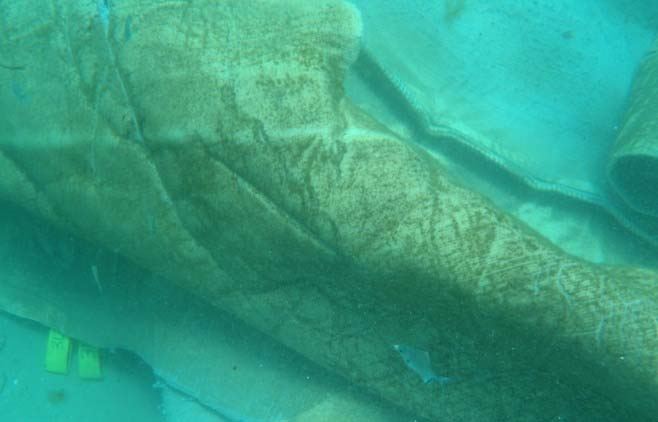

- **file**: `07_scale/shapes/narrowneck-gold-coast/src/gov/narrowneck-gold-coast_jackson2012_fig8_failed_container_polyurethane_coating_native.jpeg`
- **kind**: report_photo
- **shows**: Underwater photo of a failed (torn) polyurethane-coated geotextile sand container on the reef.
- **structure visible**: True
- **state shown**: damaged container (date not stated)
- **image date**: not stated (dive inspections 2000-2011)
- **citation**: Jackson, A., Tomlinson, R., Corbett, B. and Strauss, D. (2012). Long term performance of a submerged coastal control structure: a case study of the Narrowneck multi-functional artificial reef. Coastal Engineering Proceedings 1(33), structures.54 (Proc. 33rd International Conference on Coastal Engineering, Santander), doi:10.9753/icce.v33.structures.54, p.6, Fig 8 (embedded raster). https://icce-ojs-tamu.tdl.org/icce/article/view/6956. Accessed 2026-10-06.
- **image URL**: https://icce-ojs-tamu.tdl.org/icce/article/download/6956/pdf
- **source page**: https://icce-ojs-tamu.tdl.org/icce/article/view/6956
- **page / figure**: p.6, Fig 8 (embedded raster)
- **credit**: Jackson et al. (2012) / ICCE. The paper credits no individual figure; monitoring data and surveys are Gold Coast City Council, ICM and Griffith Centre for Coastal Management.
- **licence**: ICCE OJS site carries a Creative Commons Attribution 4.0 (CC BY 4.0) badge; the 2012 record has no per-article rights statement - confirm before public release.
- **retrieved**: 2026-10-06
- **used for**: context
- **How used for the model**: Context: container condition; not used for geometry.
- **3D check pending**: no - None
- **linked records**: 07_scale/bathymetry/gold_coast/SOURCES.md GC-N13; 07_scale/bathymetry/gold_coast/REPORT.md
- **size**: 0.02 MB, 658x422 px
- **sha256**: 1b82f32c705c79c1c6f5a1576a63fdaa60b3750feec447c2739d6b07197cf636
- **rights**: Private research copy; reuse rights to be checked before any public release.
- **display in HTML**: True
- **added by**: gold_coast_gov_reports_bathymetry, 2026-10-06

## narrowneck-gold-coast-img-14 - Jackson et al. 2012 Fig 9: conceptual sketch of slumping of stacked containers (T2 over T4)

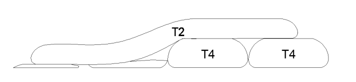

- **file**: `07_scale/shapes/narrowneck-gold-coast/src/gov/narrowneck-gold-coast_jackson2012_fig9_sketch_slumping_native.png`
- **kind**: diagram
- **shows**: Cross-section sketch of container layers: a T2 container on two T4 containers, used to explain slumping of the north reef when base containers fail. No scale or levels.
- **structure visible**: True
- **state shown**: diagram (not a survey)
- **image date**: 2012 (sketch)
- **citation**: Jackson, A., Tomlinson, R., Corbett, B. and Strauss, D. (2012). Long term performance of a submerged coastal control structure: a case study of the Narrowneck multi-functional artificial reef. Coastal Engineering Proceedings 1(33), structures.54 (Proc. 33rd International Conference on Coastal Engineering, Santander), doi:10.9753/icce.v33.structures.54, p.7, Fig 9 (embedded raster). https://icce-ojs-tamu.tdl.org/icce/article/view/6956. Accessed 2026-10-06.
- **image URL**: https://icce-ojs-tamu.tdl.org/icce/article/download/6956/pdf
- **source page**: https://icce-ojs-tamu.tdl.org/icce/article/view/6956
- **page / figure**: p.7, Fig 9 (embedded raster)
- **credit**: Jackson et al. (2012) / ICCE. The paper credits no individual figure; monitoring data and surveys are Gold Coast City Council, ICM and Griffith Centre for Coastal Management.
- **licence**: ICCE OJS site carries a Creative Commons Attribution 4.0 (CC BY 4.0) badge; the 2012 record has no per-article rights statement - confirm before public release.
- **retrieved**: 2026-10-06
- **used for**: context
- **How used for the model**: Shows the layered stacking (T2 on T4 containers) that the tracer should know about; no dimensions here (container sizes must come from another source).
- **3D check pending**: YES - Container layer stacking (T2 on 2 x T4) for the renewal's added layer: reef height above seabed (values: height)
- **linked records**: 07_scale/bathymetry/gold_coast/SOURCES.md GC-N14; 07_scale/bathymetry/gold_coast/REPORT.md
- **size**: 0.01 MB, 723x168 px
- **sha256**: dd9a005b8152656e8083e0045e63e2f2ffc094d260ac9c8e659486c4feea0f1c
- **rights**: Private research copy; reuse rights to be checked before any public release.
- **display in HTML**: True
- **added by**: gold_coast_gov_reports_bathymetry, 2026-10-06
- **3D / planform check result (2026-10-06)**: Checked 2026-10-06 (planform not applicable): the sketch shows a crest container (T2) resting on two base containers (T4): two layers at the crest, which supports a reef height of about 2-3 m above the seabed at the shoreward crest and 4-6 m at the toe (estimate, METHOD.md INPUTS FOR 3D). STILL PENDING for the 3D agent (height and slopes).
- **How used (update 2026-10-06)**: Stacking input for INPUTS FOR 3D.

## narrowneck-gold-coast-img-15 - Jackson et al. 2012 Fig 10: container with evidence of propeller damage (dive photo)

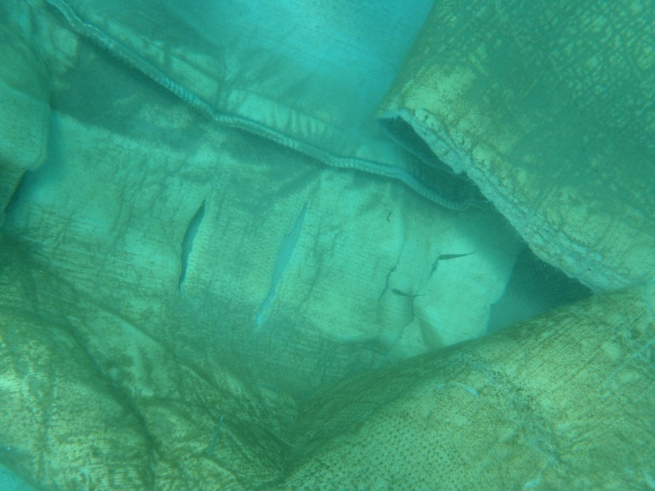

- **file**: `07_scale/shapes/narrowneck-gold-coast/src/gov/narrowneck-gold-coast_jackson2012_fig10_container_propeller_damage_native.jpeg`
- **kind**: report_photo
- **shows**: Underwater photo of a container cut by a propeller; evidence that boats pass over the crest.
- **structure visible**: True
- **state shown**: damaged container (date not stated)
- **image date**: not stated
- **citation**: Jackson, A., Tomlinson, R., Corbett, B. and Strauss, D. (2012). Long term performance of a submerged coastal control structure: a case study of the Narrowneck multi-functional artificial reef. Coastal Engineering Proceedings 1(33), structures.54 (Proc. 33rd International Conference on Coastal Engineering, Santander), doi:10.9753/icce.v33.structures.54, p.8, Fig 10 (embedded raster). https://icce-ojs-tamu.tdl.org/icce/article/view/6956. Accessed 2026-10-06.
- **image URL**: https://icce-ojs-tamu.tdl.org/icce/article/download/6956/pdf
- **source page**: https://icce-ojs-tamu.tdl.org/icce/article/view/6956
- **page / figure**: p.8, Fig 10 (embedded raster)
- **credit**: Jackson et al. (2012) / ICCE. The paper credits no individual figure; monitoring data and surveys are Gold Coast City Council, ICM and Griffith Centre for Coastal Management.
- **licence**: ICCE OJS site carries a Creative Commons Attribution 4.0 (CC BY 4.0) badge; the 2012 record has no per-article rights statement - confirm before public release.
- **retrieved**: 2026-10-06
- **used for**: context
- **How used for the model**: Context only: shallow crest (boat strike), consistent with a crest only 1-1.5 m below low tide; no geometry.
- **3D check pending**: no - None
- **linked records**: 07_scale/bathymetry/gold_coast/SOURCES.md GC-N15; 07_scale/bathymetry/gold_coast/REPORT.md
- **size**: 0.14 MB, 826x619 px
- **sha256**: 792cefa5b212b3e4fe2822161da9e8eab05d9b508f7b00cdb5501a057e1c8c58
- **rights**: Private research copy; reuse rights to be checked before any public release.
- **display in HTML**: True
- **added by**: gold_coast_gov_reports_bathymetry, 2026-10-06

## narrowneck-gold-coast-img-16 - Jackson et al. 2012 Fig 11a: marine species on the reef - kelp (Ecklonia) on a container

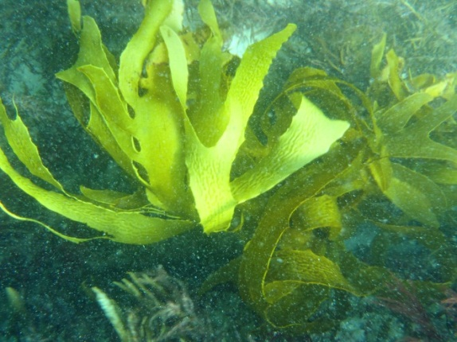

- **file**: `07_scale/shapes/narrowneck-gold-coast/src/gov/narrowneck-gold-coast_jackson2012_fig11a_marine_species_on_reef_native.jpeg`
- **kind**: report_photo
- **shows**: Underwater photo of marine growth on Narrowneck container surfaces (kelp (Ecklonia) on a container).
- **structure visible**: True
- **state shown**: as-built reef ecology (c. 2011)
- **image date**: not stated (2011 condition survey)
- **citation**: Jackson, A., Tomlinson, R., Corbett, B. and Strauss, D. (2012). Long term performance of a submerged coastal control structure: a case study of the Narrowneck multi-functional artificial reef. Coastal Engineering Proceedings 1(33), structures.54 (Proc. 33rd International Conference on Coastal Engineering, Santander), doi:10.9753/icce.v33.structures.54, p.9, Fig 11a (embedded raster). https://icce-ojs-tamu.tdl.org/icce/article/view/6956. Accessed 2026-10-06.
- **image URL**: https://icce-ojs-tamu.tdl.org/icce/article/download/6956/pdf
- **source page**: https://icce-ojs-tamu.tdl.org/icce/article/view/6956
- **page / figure**: p.9, Fig 11a (embedded raster)
- **credit**: Jackson et al. (2012) / ICCE. The paper credits no individual figure; monitoring data and surveys are Gold Coast City Council, ICM and Griffith Centre for Coastal Management.
- **licence**: ICCE OJS site carries a Creative Commons Attribution 4.0 (CC BY 4.0) badge; the 2012 record has no per-article rights statement - confirm before public release.
- **retrieved**: 2026-10-06
- **used for**: context
- **How used for the model**: Context only (ecology); no geometry.
- **3D check pending**: no - None
- **linked records**: 07_scale/bathymetry/gold_coast/SOURCES.md GC-N16; 07_scale/bathymetry/gold_coast/REPORT.md
- **size**: 0.10 MB, 574x430 px
- **sha256**: ac9539be599f1624d6ca85718d760fded7af23fa233dc97d8ae039c12bbe2673
- **rights**: Private research copy; reuse rights to be checked before any public release.
- **display in HTML**: True
- **added by**: gold_coast_gov_reports_bathymetry, 2026-10-06

## narrowneck-gold-coast-img-17 - Jackson et al. 2012 Fig 11b: marine species on the reef - red and brown algae on a container

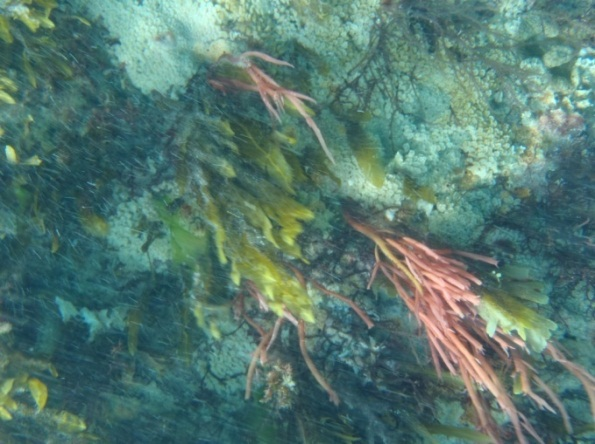

- **file**: `07_scale/shapes/narrowneck-gold-coast/src/gov/narrowneck-gold-coast_jackson2012_fig11b_marine_species_on_reef_native.jpeg`
- **kind**: report_photo
- **shows**: Underwater photo of marine growth on Narrowneck container surfaces (red and brown algae on a container).
- **structure visible**: True
- **state shown**: as-built reef ecology (c. 2011)
- **image date**: not stated (2011 condition survey)
- **citation**: Jackson, A., Tomlinson, R., Corbett, B. and Strauss, D. (2012). Long term performance of a submerged coastal control structure: a case study of the Narrowneck multi-functional artificial reef. Coastal Engineering Proceedings 1(33), structures.54 (Proc. 33rd International Conference on Coastal Engineering, Santander), doi:10.9753/icce.v33.structures.54, p.9, Fig 11b (embedded raster). https://icce-ojs-tamu.tdl.org/icce/article/view/6956. Accessed 2026-10-06.
- **image URL**: https://icce-ojs-tamu.tdl.org/icce/article/download/6956/pdf
- **source page**: https://icce-ojs-tamu.tdl.org/icce/article/view/6956
- **page / figure**: p.9, Fig 11b (embedded raster)
- **credit**: Jackson et al. (2012) / ICCE. The paper credits no individual figure; monitoring data and surveys are Gold Coast City Council, ICM and Griffith Centre for Coastal Management.
- **licence**: ICCE OJS site carries a Creative Commons Attribution 4.0 (CC BY 4.0) badge; the 2012 record has no per-article rights statement - confirm before public release.
- **retrieved**: 2026-10-06
- **used for**: context
- **How used for the model**: Context only (ecology); no geometry.
- **3D check pending**: no - None
- **linked records**: 07_scale/bathymetry/gold_coast/SOURCES.md GC-N17; 07_scale/bathymetry/gold_coast/REPORT.md
- **size**: 0.10 MB, 595x444 px
- **sha256**: bea814fcfdf524ebfc6f2b27d5766188e4e4451dbb5ef94138b47217eee1fd87
- **rights**: Private research copy; reuse rights to be checked before any public release.
- **display in HTML**: True
- **added by**: gold_coast_gov_reports_bathymetry, 2026-10-06

## narrowneck-gold-coast-img-18 - Jackson et al. 2012 Fig 11c: marine species on the reef - Sargassum-type algae canopy

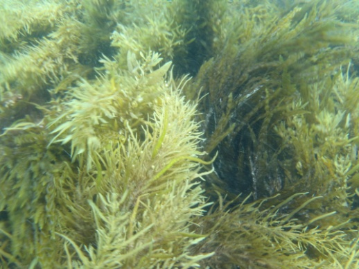

- **file**: `07_scale/shapes/narrowneck-gold-coast/src/gov/narrowneck-gold-coast_jackson2012_fig11c_marine_species_on_reef_native.jpeg`
- **kind**: report_photo
- **shows**: Underwater photo of marine growth on Narrowneck container surfaces (Sargassum-type algae canopy).
- **structure visible**: True
- **state shown**: as-built reef ecology (c. 2011)
- **image date**: not stated (2011 condition survey)
- **citation**: Jackson, A., Tomlinson, R., Corbett, B. and Strauss, D. (2012). Long term performance of a submerged coastal control structure: a case study of the Narrowneck multi-functional artificial reef. Coastal Engineering Proceedings 1(33), structures.54 (Proc. 33rd International Conference on Coastal Engineering, Santander), doi:10.9753/icce.v33.structures.54, p.9, Fig 11c (embedded raster). https://icce-ojs-tamu.tdl.org/icce/article/view/6956. Accessed 2026-10-06.
- **image URL**: https://icce-ojs-tamu.tdl.org/icce/article/download/6956/pdf
- **source page**: https://icce-ojs-tamu.tdl.org/icce/article/view/6956
- **page / figure**: p.9, Fig 11c (embedded raster)
- **credit**: Jackson et al. (2012) / ICCE. The paper credits no individual figure; monitoring data and surveys are Gold Coast City Council, ICM and Griffith Centre for Coastal Management.
- **licence**: ICCE OJS site carries a Creative Commons Attribution 4.0 (CC BY 4.0) badge; the 2012 record has no per-article rights statement - confirm before public release.
- **retrieved**: 2026-10-06
- **used for**: context
- **How used for the model**: Context only (ecology); no geometry.
- **3D check pending**: no - None
- **linked records**: 07_scale/bathymetry/gold_coast/SOURCES.md GC-N18; 07_scale/bathymetry/gold_coast/REPORT.md
- **size**: 0.09 MB, 518x388 px
- **sha256**: bcf6f14594d6946a164fba36974f84871dbf3c809d760d2897791045dd8d23ad
- **rights**: Private research copy; reuse rights to be checked before any public release.
- **display in HTML**: True
- **added by**: gold_coast_gov_reports_bathymetry, 2026-10-06

## narrowneck-gold-coast-img-19 - Jackson et al. 2012 Fig 11d: marine species on the reef - algae and fish on a container surface

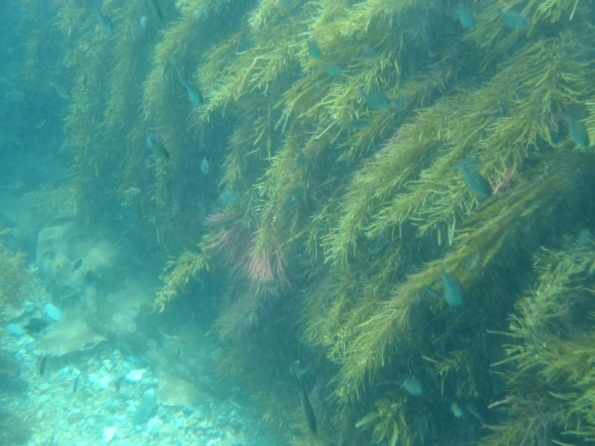

- **file**: `07_scale/shapes/narrowneck-gold-coast/src/gov/narrowneck-gold-coast_jackson2012_fig11d_marine_species_on_reef_native.jpeg`
- **kind**: report_photo
- **shows**: Underwater photo of marine growth on Narrowneck container surfaces (algae and fish on a container surface).
- **structure visible**: True
- **state shown**: as-built reef ecology (c. 2011)
- **image date**: not stated (2011 condition survey)
- **citation**: Jackson, A., Tomlinson, R., Corbett, B. and Strauss, D. (2012). Long term performance of a submerged coastal control structure: a case study of the Narrowneck multi-functional artificial reef. Coastal Engineering Proceedings 1(33), structures.54 (Proc. 33rd International Conference on Coastal Engineering, Santander), doi:10.9753/icce.v33.structures.54, p.9, Fig 11d (embedded raster). https://icce-ojs-tamu.tdl.org/icce/article/view/6956. Accessed 2026-10-06.
- **image URL**: https://icce-ojs-tamu.tdl.org/icce/article/download/6956/pdf
- **source page**: https://icce-ojs-tamu.tdl.org/icce/article/view/6956
- **page / figure**: p.9, Fig 11d (embedded raster)
- **credit**: Jackson et al. (2012) / ICCE. The paper credits no individual figure; monitoring data and surveys are Gold Coast City Council, ICM and Griffith Centre for Coastal Management.
- **licence**: ICCE OJS site carries a Creative Commons Attribution 4.0 (CC BY 4.0) badge; the 2012 record has no per-article rights statement - confirm before public release.
- **retrieved**: 2026-10-06
- **used for**: context
- **How used for the model**: Context only (ecology); no geometry.
- **3D check pending**: no - None
- **linked records**: 07_scale/bathymetry/gold_coast/SOURCES.md GC-N19; 07_scale/bathymetry/gold_coast/REPORT.md
- **size**: 0.08 MB, 595x446 px
- **sha256**: 5edfdf825394e3ac5b3f80f32e0207b003679697d754f30edeff40027302519e
- **rights**: Private research copy; reuse rights to be checked before any public release.
- **display in HTML**: True
- **added by**: gold_coast_gov_reports_bathymetry, 2026-10-06

## narrowneck-gold-coast-img-20 - Jackson et al. 2012 Fig 12: Narrowneck beach looking south, 2 June 2009 (after the 2009 storms)

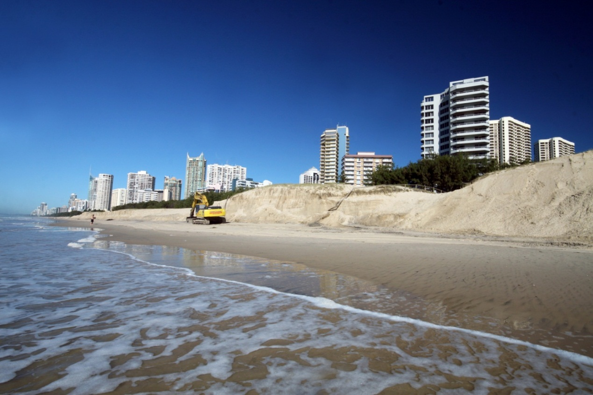

- **file**: `07_scale/shapes/narrowneck-gold-coast/src/gov/narrowneck-gold-coast_jackson2012_fig12_narrowneck_beach_looking_south_2009-06-02_native.jpeg`
- **kind**: photo
- **shows**: Eroded Narrowneck beach and scarped dune after the 2009 storm series, looking south; reef not visible.
- **structure visible**: False
- **state shown**: post-construction beach (2009)
- **image date**: 2009-06-02
- **citation**: Jackson, A., Tomlinson, R., Corbett, B. and Strauss, D. (2012). Long term performance of a submerged coastal control structure: a case study of the Narrowneck multi-functional artificial reef. Coastal Engineering Proceedings 1(33), structures.54 (Proc. 33rd International Conference on Coastal Engineering, Santander), doi:10.9753/icce.v33.structures.54, p.10, Fig 12 (embedded raster). https://icce-ojs-tamu.tdl.org/icce/article/view/6956. Accessed 2026-10-06.
- **image URL**: https://icce-ojs-tamu.tdl.org/icce/article/download/6956/pdf
- **source page**: https://icce-ojs-tamu.tdl.org/icce/article/view/6956
- **page / figure**: p.10, Fig 12 (embedded raster)
- **credit**: Jackson et al. (2012) / ICCE. The paper credits no individual figure; monitoring data and surveys are Gold Coast City Council, ICM and Griffith Centre for Coastal Management.
- **licence**: ICCE OJS site carries a Creative Commons Attribution 4.0 (CC BY 4.0) badge; the 2012 record has no per-article rights statement - confirm before public release.
- **retrieved**: 2026-10-06
- **used for**: context
- **How used for the model**: Context only (storm response of the beach); no geometry.
- **3D check pending**: no - None
- **linked records**: 07_scale/bathymetry/gold_coast/SOURCES.md GC-N20; 07_scale/bathymetry/gold_coast/REPORT.md
- **size**: 0.25 MB, 1269x846 px
- **sha256**: ec02bc60a22f65f8ef4ec638b6e9e7acd9caeb145bc543f79814044629105470
- **rights**: Private research copy; reuse rights to be checked before any public release.
- **display in HTML**: True
- **added by**: gold_coast_gov_reports_bathymetry, 2026-10-06

## narrowneck-gold-coast-img-21 - Jackson et al. 2012 Fig 16: salient in the lee of Narrowneck Reef, 20 May 2010 (two oblique camera views)

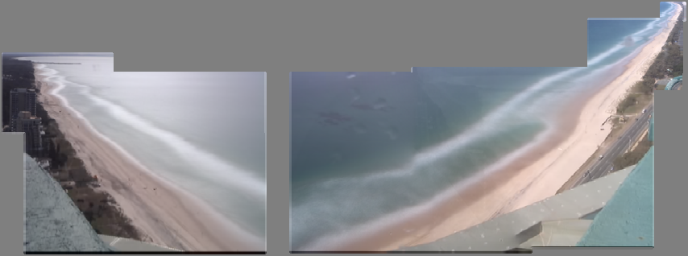

- **file**: `07_scale/shapes/narrowneck-gold-coast/src/gov/narrowneck-gold-coast_jackson2012_fig16_salient_in_lee_of_reef_2010-05-20_native.png`
- **kind**: photo
- **shows**: Two oblique shore-based camera views of the beach and the surf zone showing a salient/rip-bar pattern in the lee of the reef; the reef is a faint dark patch offshore.
- **structure visible**: True
- **state shown**: as-maintained (2010-05-20)
- **image date**: 2010-05-20
- **citation**: Jackson, A., Tomlinson, R., Corbett, B. and Strauss, D. (2012). Long term performance of a submerged coastal control structure: a case study of the Narrowneck multi-functional artificial reef. Coastal Engineering Proceedings 1(33), structures.54 (Proc. 33rd International Conference on Coastal Engineering, Santander), doi:10.9753/icce.v33.structures.54, p.13, Fig 16 (embedded raster). https://icce-ojs-tamu.tdl.org/icce/article/view/6956. Accessed 2026-10-06.
- **image URL**: https://icce-ojs-tamu.tdl.org/icce/article/download/6956/pdf
- **source page**: https://icce-ojs-tamu.tdl.org/icce/article/view/6956
- **page / figure**: p.13, Fig 16 (embedded raster)
- **credit**: Jackson et al. (2012) / ICCE. The paper credits no individual figure; monitoring data and surveys are Gold Coast City Council, ICM and Griffith Centre for Coastal Management.
- **licence**: ICCE OJS site carries a Creative Commons Attribution 4.0 (CC BY 4.0) badge; the 2012 record has no per-article rights statement - confirm before public release.
- **retrieved**: 2026-10-06
- **used for**: context; camera_match
- **How used for the model**: Context and possible camera-match target (Narrowneck webcam geometry unknown); no geometry read.
- **3D check pending**: no - None
- **linked records**: 07_scale/bathymetry/gold_coast/SOURCES.md GC-N21; 07_scale/bathymetry/gold_coast/REPORT.md
- **size**: 0.31 MB, 854x318 px
- **sha256**: d8d58315a286eb708ecae364268e7aca7962144d7faa6477c6e451c0d1624dc0
- **rights**: Private research copy; reuse rights to be checked before any public release.
- **display in HTML**: True
- **added by**: gold_coast_gov_reports_bathymetry, 2026-10-06

## narrowneck-gold-coast-img-22 - Q1 evidence: City of Gold Coast DTM (source-ID raster) coverage and 1 m contours over Esri imagery at Narrowneck Reef

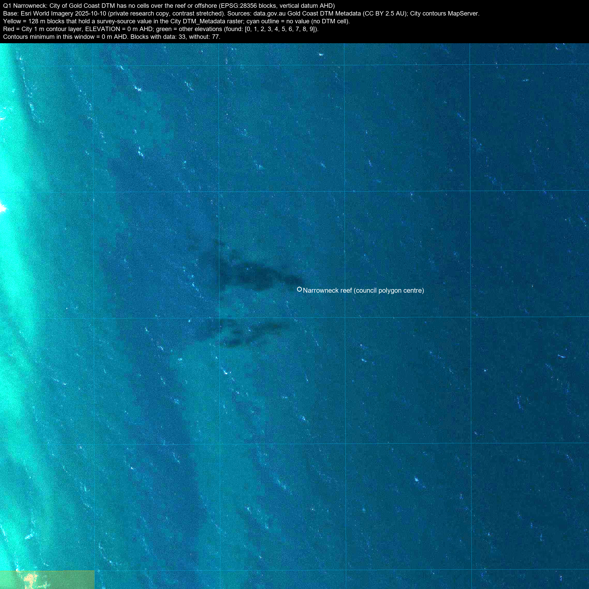

- **file**: `07_scale/bathymetry/gold_coast/annotated/q1_narrowneck_dtm_source_coverage_on_esri.png`
- **kind**: diagram
- **shows**: Narrowneck reef (dark arms) lies in a block of ocean where the City's DTM source raster has NO cell (cyan outlines); data blocks (yellow) stop at the beach; the City's 1 m contours there have minimum elevation 0 m AHD. Hence the DTM holds no depth at the reef.
- **structure visible**: True
- **state shown**: as-built, imagery 2025-10-10
- **image date**: imagery 2025-10-10; DTM metadata raster modified 2024-05-13; overlay made 2026-10-06
- **citation**: Gold Coast bathymetry search (2026). Overlay of (a) City of Gold Coast (2024) Gold Coast DTM Metadata raster (data.gov.au, CC BY 2.5 AU, zipped file geodatabase DTM_Metadata_Feb_2024_1m), (b) City of Gold Coast Contours MapServer, on (c) Esri World Imagery 2025-10-10 (private research copy). Accessed 2026-10-06. https://data.gov.au/data/dataset/digital-elevation-models-dem
- **image URL**: https://data.gov.au/data/dataset/3f1698d1-3789-4dc5-af9d-0fb08f800d77/resource/3c077953-539c-422a-b3ed-64e06978204c/download/dtm_metadata.zip
- **source page**: https://data.gov.au/data/dataset/digital-elevation-models-dem
- **page / figure**: annotated overlay generated by 07_scale/bathymetry/gold_coast/q1_dtm_evidence/q1_overlay.py
- **credit**: City of Gold Coast (DTM metadata, contours); Esri, Maxar, Earthstar Geographics (imagery); overlay by this project
- **licence**: DTM metadata CC BY 2.5 AU; Esri imagery under Esri terms (private research copy)
- **retrieved**: 2026-10-06
- **used for**: cross_check; context
- **How used for the model**: Answers Q1 (DTM has no nearshore ocean depths): block (row 265, col 210) at the reef centre is absent; contours min 0 m AHD around the reef. Goes to REPORT.md section 2.
- **3D check pending**: no - None: confirms no surveyed seabed in the City DTM at this reef (values: seabed)
- **linked records**: 07_scale/bathymetry/gold_coast/SOURCES.md GC-Q1N; 07_scale/bathymetry/gold_coast/REPORT.md
- **size**: 3.38 MB, 2275x2276 px
- **sha256**: 6ff815aaf2a76f9fc5121ac08fe9ab3990d42e22e5dfb1993900ba7646cbcfaa
- **rights**: Private research copy; reuse rights to be checked before any public release.
- **display in HTML**: True
- **added by**: gold_coast_gov_reports_bathymetry, 2026-10-06

## narrowneck-gold-coast-img-23 - Narrowneck Reef during the renewal works: split-hull dredger over the reef, oblique drone view (ICM 2023 article)

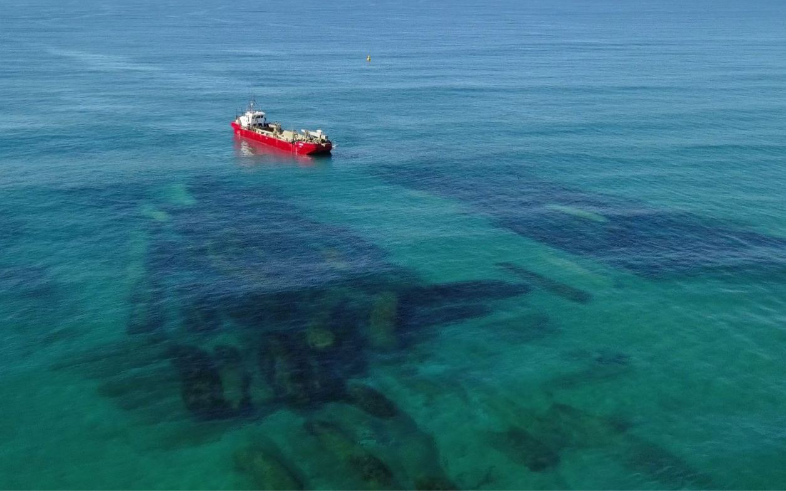

- **file**: `03_images/reefs/narrowneck-gold-coast/narrowneck-gold-coast_renewal_works_dredger_over_reef_icm_2017-18.png`
- **kind**: aerial
- **shows**: Oblique drone view of the Narrowneck reef in clear water with a red split-hull dredger beside it and a yellow navigation buoy in the background; the dark container arms, a wing and gaps are visible through the water.
- **structure visible**: True
- **state shown**: renewal works in progress (2017-18)
- **image date**: 2017-2018 (renewal works August 2017 - June 2018; exact date not stated)
- **citation**: International Coastal Management (2023). Artificial Reefs and Nearshore Nourishment on the Gold Coast: What the Monitoring Shows. ICM website article, published 2023-09-18, image wixstatic 97fa2b_629236... (1254 x 783 px png). https://www.coastalmanagement.com.au/artificial-reefs-and-nearshore-nourishment-on-the-gold-coast-real-world-results. Accessed 2026-10-06.
- **image URL**: https://static.wixstatic.com/media/97fa2b_629236265391409984d5135f7c0e7d33~mv2.png
- **source page**: https://www.coastalmanagement.com.au/artificial-reefs-and-nearshore-nourishment-on-the-gold-coast-real-world-results
- **page / figure**: article image (no figure number; shown with the Narrowneck section)
- **credit**: International Coastal Management (ICM) / City of Gold Coast (the page captions some images 'Source: Gold Coast City'; photographer not named)
- **licence**: not stated (ICM website image; copyright ICM / City of Gold Coast)
- **retrieved**: 2026-10-06
- **used for**: plan_trace; cross_check; context
- **How used for the model**: Shows the planform of the reef at the time the extra containers were being added (arm and wing outlines, gaps). Oblique, no scale: usable as a qualitative check of the 'previous vs amended shape' question, not for metric tracing. Goes to REPORT.md section 6.
- **3D check pending**: no - Narrowneck renewal planform (previous vs amended shape): compare arm/wing outline here with the traced shape; presence of the yellow buoy marks post-2017 (values: planform)
- **linked records**: 07_scale/bathymetry/gold_coast/SOURCES.md GC-N22; 07_scale/bathymetry/gold_coast/REPORT.md
- **size**: 1.20 MB, 1254x783 px
- **sha256**: 7ef4a417469f0942203d8805a4a8821a0f52c7f44bcdfcf0517cdc10acee777f
- **rights**: Private research copy; reuse rights to be checked before any public release.
- **display in HTML**: True
- **added by**: gold_coast_gov_reports_bathymetry, 2026-10-06
- **3D / planform check result (2026-10-06)**: Planform checked 2026-10-06: the oblique ICM photo (dredger over the reef) shows one container field (probably the north arm) as a wedge of dense dark containers narrowing away from the camera, individual containers visible; no scale. Consistent in character with the traced wedge (134 x 54 m); qualitative only, which arm is not stated. Planform check done.
- **How used (update 2026-10-06)**: Qualitative shape check of the traced north arm (METHOD.md Step 6).

## narrowneck-gold-coast-img-24 - Narrowneck Reef: drone view with surfers paddling over the reef and a yellow navigation buoy (ICM 2023 article)

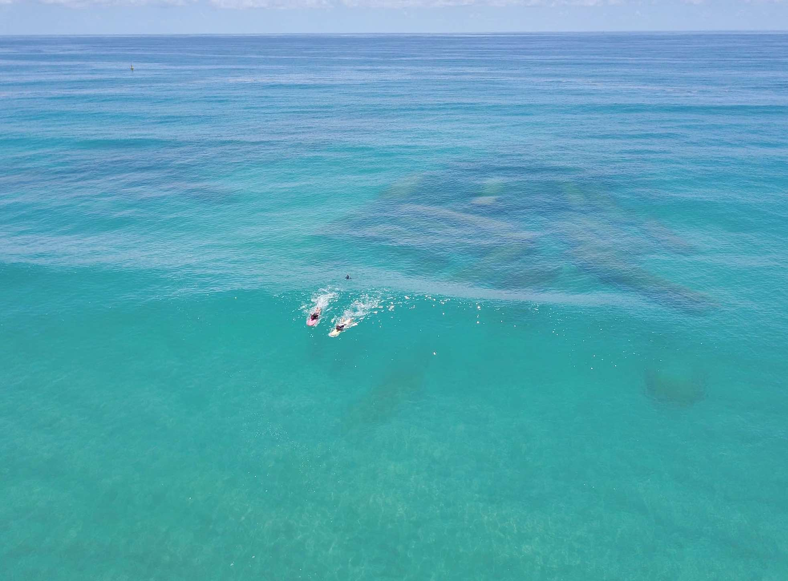

- **file**: `03_images/reefs/narrowneck-gold-coast/narrowneck-gold-coast_drone_view_reef_with_surfers_and_buoy_icm_post2018.jpeg`
- **kind**: aerial
- **shows**: Low oblique drone photo of two surfers paddling next to the submerged reef; the container arms and a wing show as dark patches in turquoise water, a yellow buoy near the horizon, a wave line passing over the reef crest.
- **structure visible**: True
- **state shown**: as renewed (post-2018)
- **image date**: not stated (after the 2018 renewal: the yellow buoy is installed; before 2023 publication)
- **citation**: International Coastal Management (2023). Artificial Reefs and Nearshore Nourishment on the Gold Coast: What the Monitoring Shows. ICM website article, published 2023-09-18, image wixstatic 97fa2b_f69ad0... (1965 x 1450 px jpeg). https://www.coastalmanagement.com.au/artificial-reefs-and-nearshore-nourishment-on-the-gold-coast-real-world-results. Accessed 2026-10-06.
- **image URL**: https://static.wixstatic.com/media/97fa2b_f69ad0ae528945e68229b95f44b86eb0~mv2.jpeg
- **source page**: https://www.coastalmanagement.com.au/artificial-reefs-and-nearshore-nourishment-on-the-gold-coast-real-world-results
- **page / figure**: article image (no figure number)
- **credit**: International Coastal Management (ICM) / City of Gold Coast (the page captions some images 'Source: Gold Coast City'; photographer not named)
- **licence**: not stated (ICM website image; copyright ICM / City of Gold Coast)
- **retrieved**: 2026-10-06
- **used for**: plan_trace; cross_check; context
- **How used for the model**: Qualitative view of the renewed reef planform and of wave breaking over the crest; no scale. Goes to REPORT.md section 6 (tracer: renewed state).
- **3D check pending**: YES - Planform of the renewed reef vs shape.json; crest depth consistency (waves break over the crest at low tide) (values: planform, crest_z)
- **linked records**: 07_scale/bathymetry/gold_coast/SOURCES.md GC-N23; 07_scale/bathymetry/gold_coast/REPORT.md
- **size**: 0.19 MB, 1965x1450 px
- **sha256**: 68b61cfe5a92fde2b6a422731908033f980c01dfc2c228d4f921901f0bb9d2d0
- **rights**: Private research copy; reuse rights to be checked before any public release.
- **display in HTML**: True
- **added by**: gold_coast_gov_reports_bathymetry, 2026-10-06
- **3D / planform check result (2026-10-06)**: Planform checked 2026-10-06: oblique drone view with two surfers and the buoy: the reef shows only as diffuse, low-contrast dark patches, the two arms cannot be separated; no scale. No planform contradiction; crest depth cannot be read from this photo. STILL PENDING for the 3D agent: crest-depth consistency only.
- **How used (update 2026-10-06)**: Qualitative planform check (METHOD.md Step 6).

## narrowneck-gold-coast-img-25 - Narrowneck and Surfers Paradise looking north: the narrow strip between the ocean and the Nerang River (ICM 2023 article)

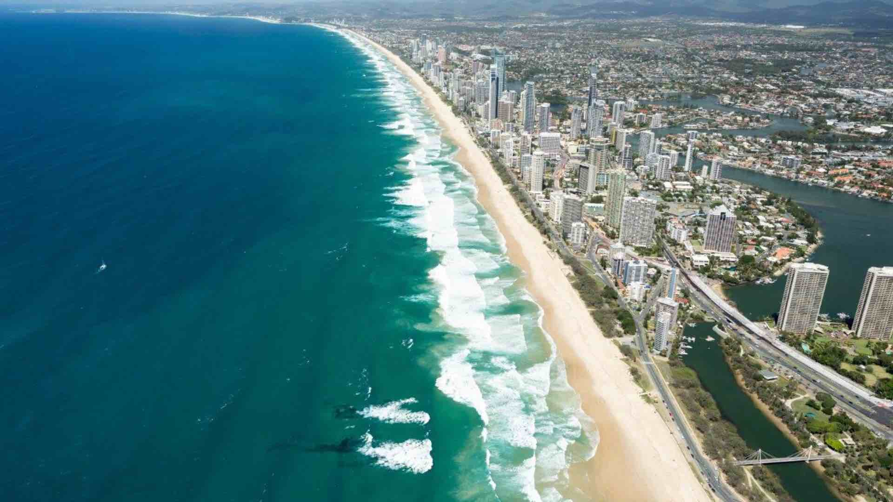

- **file**: `03_images/reefs/narrowneck-gold-coast/narrowneck-gold-coast_aerial_looking_north_narrowneck_surfers_paradise_icm_2023.jpg`
- **kind**: aerial
- **shows**: Oblique aerial of the northern Gold Coast beach from Surfers Paradise towards the Spit, with the Nerang River on the right; the reef is not clearly visible (surf zone white water at left).
- **structure visible**: False
- **state shown**: site context (undated, post-2000)
- **image date**: not stated
- **citation**: International Coastal Management (2023). Artificial Reefs and Nearshore Nourishment on the Gold Coast: What the Monitoring Shows. ICM website article, published 2023-09-18, image wixstatic 97fa2b_24e33c... (1920 x 1080 px jpeg). https://www.coastalmanagement.com.au/artificial-reefs-and-nearshore-nourishment-on-the-gold-coast-real-world-results. Accessed 2026-10-06.
- **image URL**: https://static.wixstatic.com/media/97fa2b_24e33cee570148cdab37452aef12253b~mv2.jpg
- **source page**: https://www.coastalmanagement.com.au/artificial-reefs-and-nearshore-nourishment-on-the-gold-coast-real-world-results
- **page / figure**: article image (captioned 'Source: Gold Coast City')
- **credit**: International Coastal Management (ICM) / City of Gold Coast (the page captions some images 'Source: Gold Coast City'; photographer not named)
- **licence**: not stated (ICM website image; copyright ICM / City of Gold Coast)
- **retrieved**: 2026-10-06
- **used for**: context
- **How used for the model**: Site context only (the narrow strip that the reef protects); not used for geometry.
- **3D check pending**: no - None
- **linked records**: 07_scale/bathymetry/gold_coast/SOURCES.md GC-N24; 07_scale/bathymetry/gold_coast/REPORT.md
- **size**: 0.11 MB, 1920x1080 px
- **sha256**: 0cb35511eeb344229d038195f85fa0fd8c95ee6dc0e37c7576d056d6a4360661
- **rights**: Private research copy; reuse rights to be checked before any public release.
- **display in HTML**: True
- **added by**: gold_coast_gov_reports_bathymetry, 2026-10-06

## narrowneck-gold-coast-img-26 - Jackson et al. 2007 Fig 2: Narrowneck reef design - plan view, elevation and cross-section A-A (ICM drawing)

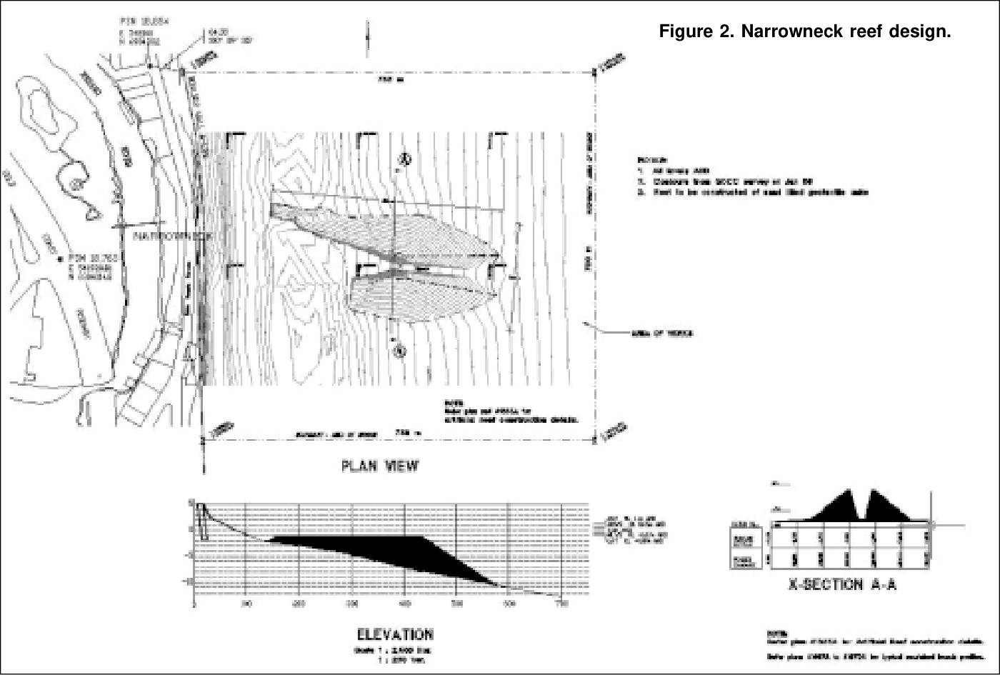

- **file**: `07_scale/shapes/narrowneck-gold-coast/src/gov/narrowneck-gold-coast_jackson2007_fig2_narrowneck_reef_design_plan_elevation_section_1998_200dpi_crop.png`
- **kind**: design_drawing
- **shows**: ICM construction-approval drawing of the original two-arm (split V) reef: plan view of the arms on the seabed contours inside a 750 m grid, an elevation profile along the reef axis (flat crest then slope to about -10 m at 580 m) and the double-peaked cross-section A-A. Text and levels are not legible at this resolution.
- **structure visible**: True
- **state shown**: design (original 1998-99, before the 2004 weir and flared wings)
- **image date**: 1998-1999 (original design drawing, survey of Jan 1999)
- **citation**: Jackson, L.A., Corbett, B., McGrath, J., Tomlinson, R. and Stuart, G. (2007). Narrowneck Reef: review of seven years of monitoring. Shore & Beach 75(4), 67-79 (Fall 2007), p.3 (PDF p.4), Fig 2 (low-resolution raster, rendered at 200 dpi). Griffith Research Online copy, http://hdl.handle.net/10072/17995. Accessed 2026-10-06.
- **image URL**: https://research-repository.griffith.edu.au/bitstreams/7e18bf60-76d6-5bdf-961d-6b572b099c70/download
- **source page**: http://hdl.handle.net/10072/17995
- **page / figure**: p.3 (PDF p.4), Fig 2 (low-resolution raster, rendered at 200 dpi)
- **credit**: Jackson et al. (2007) / ASBPA Shore & Beach; the paper does not credit individual figures (ICM, GCCC, Griffith)
- **licence**: (c) The Author(s) 2007, reproduced on Griffith Research Online in accordance with the publisher's copyright policy (ASBPA); reuse not cleared
- **retrieved**: 2026-10-06
- **used for**: plan_trace; 3d_height_slopes; cross_check
- **How used for the model**: Shows the original design topology (two separate tapered arms, no weir, no flared wings) and the profile shape along the arm; no numbers legible. The tracer must NOT use this planform for the renewed reef (see Jackson 2012 Fig 2 right). Goes to REPORT.md section 6.
- **3D check pending**: no - Which design version the traced outline matches: original split-V (this figure) vs 2004 revised (flared wings + weir) (values: planform)
- **linked records**: 07_scale/bathymetry/gold_coast/SOURCES.md GC-N25; 07_scale/bathymetry/gold_coast/REPORT.md
- **size**: 0.11 MB, 1400x945 px
- **sha256**: 9f8e4121ff21184eb9c6c0c9ef4202a584bbf968d92ff04453165499a7a25402
- **rights**: Private research copy; reuse rights to be checked before any public release.
- **display in HTML**: True
- **added by**: gold_coast_gov_reports_bathymetry, 2026-10-06
- **3D / planform check result (2026-10-06)**: Planform checked 2026-10-06: the 1998 design shows two separate tapered arms (split V) on a large plan frame, with no weir and no flared wings; the arms look much longer relative to the survey frame than the built ones (scale labels not legible, not measured), with a channel between; this is NOT the state drawn (2004 revised design, renewed 2018). History only. Planform check done.
- **How used (update 2026-10-06)**: Alternative design version rejected (shape.json design_version.alternatives_seen).

## narrowneck-gold-coast-img-27 - Jackson et al. 2007 Fig 13: plot of recorded surf tracks on the revised design contours, with a 0-100 m scale bar

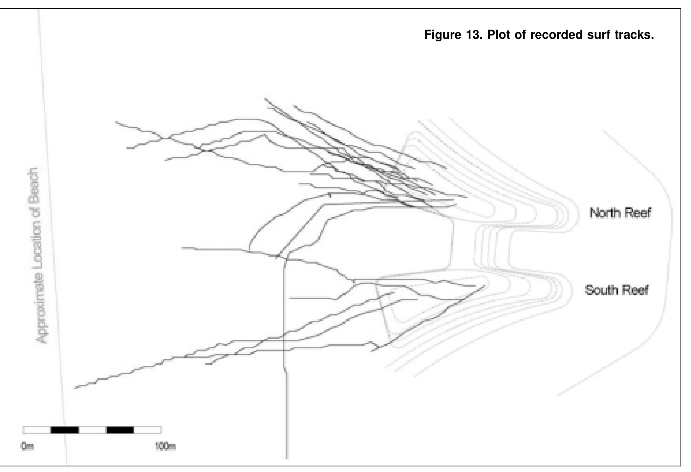

- **file**: `07_scale/shapes/narrowneck-gold-coast/src/gov/narrowneck-gold-coast_jackson2007_fig13_recorded_surf_tracks_on_revised_design_contours_scale_100m_300dpi_crop.png`
- **kind**: plan_figure
- **shows**: Plan of the revised Narrowneck design contours (North Reef and South Reef with flared wings and the weir channel between them), the approximate beach line and GPS surf tracks, with a 0-100 m scale bar. No contour labels.
- **structure visible**: True
- **state shown**: design contours (revised 2004) with surf tracks
- **image date**: surf tracks 2001-2006; contours of the revised (2004) design
- **citation**: Jackson, L.A., Corbett, B., McGrath, J., Tomlinson, R. and Stuart, G. (2007). Narrowneck Reef: review of seven years of monitoring. Shore & Beach 75(4), 67-79 (Fall 2007), p.11 (PDF p.12), Fig 13 (raster, rendered at 300 dpi). Griffith Research Online copy, http://hdl.handle.net/10072/17995. Accessed 2026-10-06.
- **image URL**: https://research-repository.griffith.edu.au/bitstreams/7e18bf60-76d6-5bdf-961d-6b572b099c70/download
- **source page**: http://hdl.handle.net/10072/17995
- **page / figure**: p.11 (PDF p.12), Fig 13 (raster, rendered at 300 dpi)
- **credit**: Jackson et al. (2007) / ASBPA Shore & Beach; the paper does not credit individual figures (ICM, GCCC, Griffith)
- **licence**: (c) The Author(s) 2007, reproduced on Griffith Research Online in accordance with the publisher's copyright policy (ASBPA); reuse not cleared
- **retrieved**: 2026-10-06
- **used for**: plan_trace; scale; cross_check
- **How used for the model**: The only metric scale found for the revised-design planform: scale bar calibrated at about 4.25 px/m (0.234 m/px) in the 300 dpi crop (annotated copy). Goes to REPORT.md section 6: scale Jackson 2012 Fig 2 right to this.
- **3D check pending**: no - Planform dimensions of the revised design (arm lengths, weir channel width) vs the traced shape, using the 100 m bar (values: planform)
- **annotated / overlay files**: `07_scale/bathymetry/gold_coast/annotated/narrowneck_jackson2007_fig13_scale_calibration_100m.png`
- **linked records**: 07_scale/bathymetry/gold_coast/SOURCES.md GC-N26; 07_scale/bathymetry/gold_coast/REPORT.md
- **size**: 0.12 MB, 2105x1438 px
- **sha256**: 4c18dc100d66c970196e0733b02e91bb006bac1491bcec7c81b6b040b3a7e7f5
- **rights**: Private research copy; reuse rights to be checked before any public release.
- **display in HTML**: True
- **added by**: gold_coast_gov_reports_bathymetry, 2026-10-06
- **3D / planform check result (2026-10-06)**: Planform checked 2026-10-06: scale bar calibrated again: black bar segments 154-241 and 325-407 px (20 m each), outline 68-496 px => 4.275 px/m (+-1 %); GPS rides reach 260 m, as in the text. Design north-arm crest loop about 62 m long, outer (-6 m) contour 121 m from the wing corner to the tip; channel wall about 33 m; tip-to-tip 55 m. Traced north arm 134 m long (+10 %), south arm 111 m, gap 20.7 m. Planform check done.
- **How used (update 2026-10-06)**: Scale of the design planform (shape.json dimensions_check, design_prior); METHOD.md Step 2d.

## narrowneck-gold-coast-img-28 - Jackson et al. 2007 Fig 14: photo of break with crest at -0.5 m LAT (two photos)

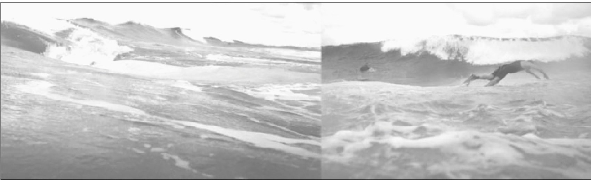

- **file**: `07_scale/shapes/narrowneck-gold-coast/src/gov/narrowneck-gold-coast_jackson2007_fig14_photo_of_break_with_crest_at_minus0.5m_LAT_200dpi_crop.png`
- **kind**: photo
- **shows**: Two photographs of a hollow breaking wave over the shallow reef crest (crest at -0.5 m LAT, i.e. RL -1.5 m AHD), the wave sucking dry at the break point.
- **structure visible**: True
- **state shown**: as-built crest -0.5 m LAT (c. 2000-01)
- **image date**: 2000-2001 (crest at -0.5 m LAT, before the top-up)
- **citation**: Jackson, L.A., Corbett, B., McGrath, J., Tomlinson, R. and Stuart, G. (2007). Narrowneck Reef: review of seven years of monitoring. Shore & Beach 75(4), 67-79 (Fall 2007), p.11 (PDF p.12), Fig 14 (raster, 200 dpi crop). Griffith Research Online copy, http://hdl.handle.net/10072/17995. Accessed 2026-10-06.
- **image URL**: https://research-repository.griffith.edu.au/bitstreams/7e18bf60-76d6-5bdf-961d-6b572b099c70/download
- **source page**: http://hdl.handle.net/10072/17995
- **page / figure**: p.11 (PDF p.12), Fig 14 (raster, 200 dpi crop)
- **credit**: Jackson et al. (2007) / ASBPA Shore & Beach; the paper does not credit individual figures (ICM, GCCC, Griffith)
- **licence**: (c) The Author(s) 2007, reproduced on Griffith Research Online in accordance with the publisher's copyright policy (ASBPA); reuse not cleared
- **retrieved**: 2026-10-06
- **used for**: context; 3d_crest
- **How used for the model**: Evidence for the as-built crest (-0.5 m LAT = RL -1.5 m AHD) and its hazardous break; the crest was later lowered. Context for REPORT.md section 6 (crest history).
- **3D check pending**: no - None (history of the crest level)
- **linked records**: 07_scale/bathymetry/gold_coast/SOURCES.md GC-N27; 07_scale/bathymetry/gold_coast/REPORT.md
- **size**: 0.13 MB, 1700x526 px
- **sha256**: f65750653ce3e12feac8fedf3da0df20404e5197cd578ec8bc77918caa86e111
- **rights**: Private research copy; reuse rights to be checked before any public release.
- **display in HTML**: True
- **added by**: gold_coast_gov_reports_bathymetry, 2026-10-06

## narrowneck-gold-coast-img-29 - Jackson et al. 2007 Fig 15: underwater photo of a person standing on the reef crest at -1.5 m LAT

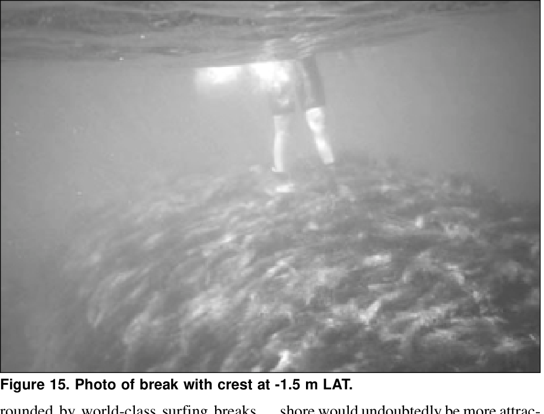

- **file**: `07_scale/shapes/narrowneck-gold-coast/src/gov/narrowneck-gold-coast_jackson2007_fig15_photo_of_break_with_crest_at_minus1.5m_LAT_200dpi_crop.png`
- **kind**: photo
- **shows**: Underwater photograph of a person standing on the algae-covered geotextile crest, head and torso above the surface, giving a water depth of about 1 m over a crest at -1.5 m LAT (text: about 1 m at -1.5 m LAT, about 0.3 m at -1 m LAT).
- **structure visible**: True
- **state shown**: as-maintained crest about -1.5 m LAT (c. 2002)
- **image date**: 2002 flume test / site observation (date not stated)
- **citation**: Jackson, L.A., Corbett, B., McGrath, J., Tomlinson, R. and Stuart, G. (2007). Narrowneck Reef: review of seven years of monitoring. Shore & Beach 75(4), 67-79 (Fall 2007), p.12 (PDF p.13), Fig 15 (raster, 200 dpi crop). Griffith Research Online copy, http://hdl.handle.net/10072/17995. Accessed 2026-10-06.
- **image URL**: https://research-repository.griffith.edu.au/bitstreams/7e18bf60-76d6-5bdf-961d-6b572b099c70/download
- **source page**: http://hdl.handle.net/10072/17995
- **page / figure**: p.12 (PDF p.13), Fig 15 (raster, 200 dpi crop)
- **credit**: Jackson et al. (2007) / ASBPA Shore & Beach; the paper does not credit individual figures (ICM, GCCC, Griffith)
- **licence**: (c) The Author(s) 2007, reproduced on Griffith Research Online in accordance with the publisher's copyright policy (ASBPA); reuse not cleared
- **retrieved**: 2026-10-06
- **used for**: context; 3d_crest
- **How used for the model**: The text gives about 1 m depth over the crest at the target crest of -1.5 m LAT (RL -2.5 m AHD); a person's height gives a rough check only. Goes to REPORT.md section 6.
- **3D check pending**: no - None (qualitative check of about 1 m depth over the lowered crest)
- **linked records**: 07_scale/bathymetry/gold_coast/SOURCES.md GC-N28; 07_scale/bathymetry/gold_coast/REPORT.md
- **size**: 0.10 MB, 928x706 px
- **sha256**: 7b4a25fe73bb7792a637c0e8054b1a1deb7ac9fda07dde15da273c20139c691a
- **rights**: Private research copy; reuse rights to be checked before any public release.
- **display in HTML**: True
- **added by**: gold_coast_gov_reports_bathymetry, 2026-10-06

## narrowneck-gold-coast-img-30 - Vieira da Silva et al. 2021 Fig 1: study area - Narrowneck aerial, wave model grids, ETA survey lines 50-79

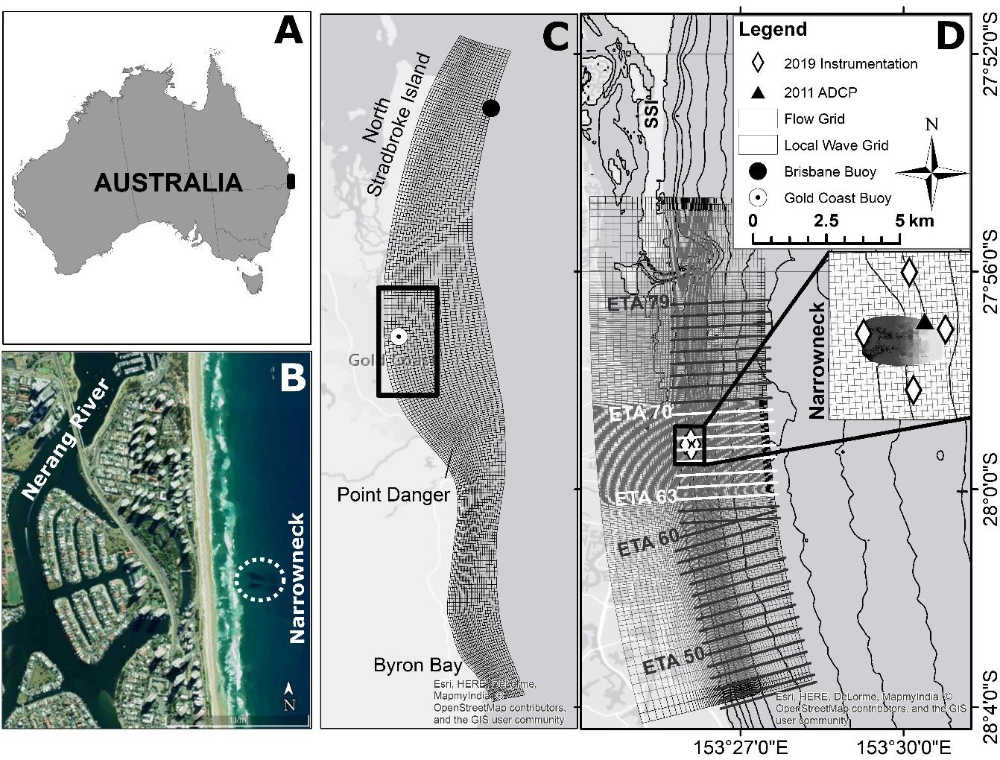

- **file**: `07_scale/shapes/narrowneck-gold-coast/src/gov/narrowneck-gold-coast_vieira_da_silva2021_fig1_study_area_eta_lines_and_reef_native.jpeg`
- **kind**: plan_figure
- **shows**: Four panels: Australia locator, Google Earth view of Narrowneck with the reef ringed, regional wave grid, and the local grid with the City's ETA survey lines (ETA 50 to ETA 79) and a zoom on the reef with instrument positions (2019 ADCPs/buoys, 2011 ADCP).
- **structure visible**: True
- **state shown**: site context; reef shown as an icon / ellipse
- **image date**: figure 2021; base imagery undated
- **citation**: Vieira da Silva, G., Hamilton, D., Strauss, D., Murray, T. and Tomlinson, R. (2021). Sediment pathways and morphodynamic response to a multi-purpose artificial reef - new insights. Coastal Engineering 171, 104027 (accepted manuscript), doi:10.1016/j.coastaleng.2021.104027, Fig 1 (embedded raster, native resolution). Griffith Research Online, http://hdl.handle.net/10072/409362. Accessed 2026-10-06.
- **image URL**: https://research-repository.griffith.edu.au/bitstreams/4627106e-ce70-46d1-aec3-c81b126fdd2c/download
- **source page**: http://hdl.handle.net/10072/409362
- **page / figure**: Fig 1 (embedded raster, native resolution)
- **credit**: Vieira da Silva et al. (2021) / Elsevier (accepted manuscript on Griffith Research Online); City of Gold Coast surveys; Google Earth / Esri base imagery
- **licence**: CC BY-NC-ND 4.0 (accepted manuscript, Griffith Research Online rights statement); base imagery under its provider's terms
- **retrieved**: 2026-10-06
- **used for**: context; scale
- **How used for the model**: Locates the ETA beach-profile lines (ETA 63-70 span the Narrowneck survey area; the reef sits between ETA 67 and ETA 68) and the Gold Coast buoy; no depths. Goes to REPORT.md section 4 (ETA lines).
- **3D check pending**: no - None
- **linked records**: 07_scale/bathymetry/gold_coast/SOURCES.md GC-N29; 07_scale/bathymetry/gold_coast/REPORT.md
- **size**: 0.29 MB, 1342x1020 px
- **sha256**: b09d5135567f8de94785697c29e18aa1facab926e05f3e701156e16095cfda07
- **rights**: Private research copy; reuse rights to be checked before any public release.
- **display in HTML**: True
- **added by**: gold_coast_gov_reports_bathymetry, 2026-10-06

## narrowneck-gold-coast-img-31 - Vieira da Silva et al. 2021 Fig 3: ten topo-bathymetric surveys of Narrowneck, 19 July 2018 - 23 April 2020 (ETA 63-70)

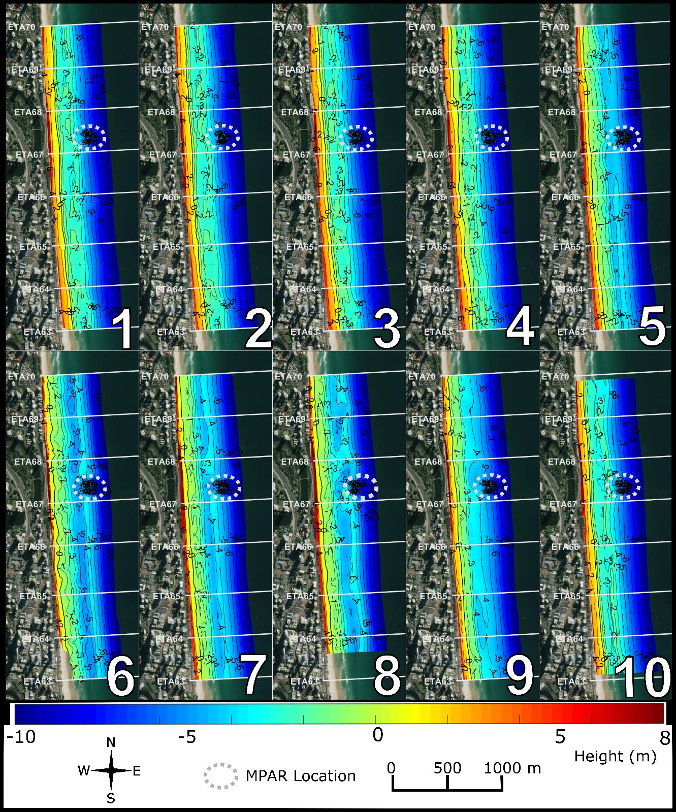

- **file**: `07_scale/shapes/narrowneck-gold-coast/src/gov/narrowneck-gold-coast_vieira_da_silva2021_fig3_ten_topo_bathymetric_surveys_2018-2020_native.jpeg`
- **kind**: survey_plot
- **shows**: Ten colour-ramp (-10 to +8 m) topo-bathymetric maps with labelled 1 m contours from the dune to the -10 m contour between ETA 63 and ETA 70 on aerial imagery, with the reef (dotted ellipse, dense contours from container clutter). Sub-tidal data from City of Gold Coast single-beam echo-sounder + RTK-GPS, 2x2 m grid.
- **structure visible**: True
- **state shown**: as renewed (surveys start one month after the June 2018 renewal)
- **image date**: surveys 2018-07-19, 2018-08-02, 2018-08-17, 2018-09-12, 2018-12-12, 2019-03-23, 2019-06-14, 2019-07-24, 2019-12-05, 2020-04-23
- **citation**: Vieira da Silva, G., Hamilton, D., Strauss, D., Murray, T. and Tomlinson, R. (2021). Sediment pathways and morphodynamic response to a multi-purpose artificial reef - new insights. Coastal Engineering 171, 104027 (accepted manuscript), doi:10.1016/j.coastaleng.2021.104027, Fig 3 (embedded raster, native resolution). Griffith Research Online, http://hdl.handle.net/10072/409362. Accessed 2026-10-06.
- **image URL**: https://research-repository.griffith.edu.au/bitstreams/4627106e-ce70-46d1-aec3-c81b126fdd2c/download
- **source page**: http://hdl.handle.net/10072/409362
- **page / figure**: Fig 3 (embedded raster, native resolution)
- **credit**: Vieira da Silva et al. (2021) / Elsevier (accepted manuscript on Griffith Research Online); City of Gold Coast surveys; Google Earth / Esri base imagery
- **licence**: CC BY-NC-ND 4.0 (accepted manuscript, Griffith Research Online rights statement); base imagery under its provider's terms
- **retrieved**: 2026-10-06
- **used for**: 3d_seabed; cross_check; scale
- **How used for the model**: Contour labels read for survey 1 (annotated copy): inshore trough -2/-3, reef inner edge -4/-5, reef body -6 to -8, seaward -9/-10 m (AHD per the text). The only published depth picture of the renewed reef's seabed; the survey is single-beam (not multibeam) and the reef is blurred.
- **3D check pending**: YES - Seabed around the reef and crest/toe depths: inner edge about -4/-5 m and reef body -6 to -8 m AHD (+-1 m, read by eye); compare with the tracer's/3D model's depth if one is built (values: seabed, crest_z)
- **annotated / overlay files**: `07_scale/bathymetry/gold_coast/annotated/narrowneck_vieira2021_fig3_survey1_2018-07-19_depth_labels_read.png`
- **linked records**: 07_scale/bathymetry/gold_coast/SOURCES.md GC-N30; 07_scale/bathymetry/gold_coast/REPORT.md
- **size**: 0.50 MB, 1331x1599 px
- **sha256**: a25327e6cc04165aa184fc0bbea5056014e49b22ed803a2ec95b70dc54c9d230
- **rights**: Private research copy; reuse rights to be checked before any public release.
- **display in HTML**: True
- **added by**: gold_coast_gov_reports_bathymetry, 2026-10-06
- **3D / planform check result (2026-10-06)**: Planform not applicable; depth read-out unchanged. Cross-check added 2026-10-06 with the Garmin Navionics SonarChart: 4.0-4.5 m over the arms, 5.5-6 m around, 7-10 m seaward (datum LAT assumed) = 5.3-6.8 m AHD around the arms with AHD = LAT + 0.76, consistent with the -4/-5, -6 to -8, -9/-10 m AHD read here (+-1 m). STILL PENDING for the 3D agent (seabed grid and crest).
- **How used (update 2026-10-06)**: Seabed values for INPUTS FOR 3D.

## narrowneck-gold-coast-img-32 - City of Gold Coast Narrowneck Reef Renewal page: split-hull dredger FAUCON over the reef, drone view (200 px thumbnail)

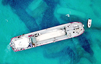

- **file**: `03_images/reefs/narrowneck-gold-coast/narrowneck-gold-coast_cogc_renewal_page_faucon_over_reef_drone_thumb_2018.jpg`
- **kind**: aerial
- **shows**: Vertical drone view of the red split-hull dredger Faucon above the reef; the dark container arms and a wing are visible beneath and beside it in turquoise water. Only the 200 x 127 px thumbnail is archived.
- **structure visible**: True
- **state shown**: renewal works in progress (2017-18)
- **image date**: 2017-2018 (renewal works)
- **citation**: City of Gold Coast (2020). Narrowneck Reef Renewal (project page; archived copy of 2020-08-04), image Faucon at Narrowneck Reef Renewal aerial - courtesy ICM; thumbnail of /_images/faucon-at-NRR-drone-photo.jpg. Original https://www.goldcoast.qld.gov.au/narrowneck-reef-renewal-39934.html ; archive http://web.archive.org/web/20200804025419/https://www.goldcoast.qld.gov.au/narrowneck-reef-renewal-39934.html. Accessed 2026-10-06.
- **image URL**: http://web.archive.org/web/20200804025419im_/https://www.goldcoast.qld.gov.au/_images/faucon-at-NRR-drone-photo-thu.jpg
- **source page**: http://web.archive.org/web/20200804025419/https://www.goldcoast.qld.gov.au/narrowneck-reef-renewal-39934.html
- **page / figure**: Faucon at Narrowneck Reef Renewal aerial - courtesy ICM; thumbnail of /_images/faucon-at-NRR-drone-photo.jpg
- **credit**: City of Gold Coast; photo/video courtesy International Coastal Management (ICM) where captioned
- **licence**: not stated (City of Gold Coast web content)
- **retrieved**: 2026-10-06
- **used for**: context; plan_trace
- **How used for the model**: Too small to trace; shows that the arms/wing outlines are visible from the air during the works. The full-size image is not archived: ask the City/ICM if needed.
- **3D check pending**: no - None (thumbnail only)
- **linked records**: 07_scale/bathymetry/gold_coast/SOURCES.md GC-N31; 07_scale/bathymetry/gold_coast/REPORT.md
- **size**: 0.01 MB, 200x127 px
- **sha256**: ea74db16f28419aa7112739f72d2f49b4d75397cabaac416dbd93bff86797a03
- **rights**: Private research copy; reuse rights to be checked before any public release.
- **display in HTML**: True
- **added by**: gold_coast_gov_reports_bathymetry, 2026-10-06

## narrowneck-gold-coast-img-33 - City of Gold Coast Narrowneck Reef Renewal page: yellow navigation buoy marking the Prohibited Anchorage Area (200 px thumbnail)

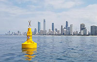

- **file**: `03_images/reefs/narrowneck-gold-coast/narrowneck-gold-coast_cogc_renewal_page_prohibited_anchorage_yellow_buoy_thumb_2018.jpg`
- **kind**: photo
- **shows**: Yellow navigation buoy with the Surfers Paradise skyline behind; two such buoys mark the extents of the Prohibited Anchorage Area over the reef.
- **structure visible**: False
- **state shown**: as renewed (post-2018)
- **image date**: 2018
- **citation**: City of Gold Coast (2020). Narrowneck Reef Renewal (project page; archived copy of 2020-08-04), image Navigation buoys mark the extents of a Prohibited Anchorage Area at Narrowneck artificial reef (thumbnail). Original https://www.goldcoast.qld.gov.au/narrowneck-reef-renewal-39934.html ; archive http://web.archive.org/web/20200804025419/https://www.goldcoast.qld.gov.au/narrowneck-reef-renewal-39934.html. Accessed 2026-10-06.
- **image URL**: http://web.archive.org/web/20200804025419im_/https://www.goldcoast.qld.gov.au/_images/narrowneck-reef-renewal-buoys-th.jpg
- **source page**: http://web.archive.org/web/20200804025419/https://www.goldcoast.qld.gov.au/narrowneck-reef-renewal-39934.html
- **page / figure**: Navigation buoys mark the extents of a Prohibited Anchorage Area at Narrowneck artificial reef (thumbnail)
- **credit**: City of Gold Coast; photo/video courtesy International Coastal Management (ICM) where captioned
- **licence**: not stated (City of Gold Coast web content)
- **retrieved**: 2026-10-06
- **used for**: context
- **How used for the model**: Context only: buoy positions mark the reef extent (positions not given). Evidence that the post-2018 reef carries two yellow buoys (check Esri/Google imagery for them).
- **3D check pending**: no - None
- **linked records**: 07_scale/bathymetry/gold_coast/SOURCES.md GC-N32; 07_scale/bathymetry/gold_coast/REPORT.md
- **size**: 0.01 MB, 200x127 px
- **sha256**: 25f52d0e41fbcde82f92d2511356501a25bc36503f6db3b389d56f597aa20756
- **rights**: Private research copy; reuse rights to be checked before any public release.
- **display in HTML**: True
- **added by**: gold_coast_gov_reports_bathymetry, 2026-10-06

## narrowneck-gold-coast-img-34 - City of Gold Coast Narrowneck Reef Renewal page: split-hull dredger FAUCON at the reef site with Narrowneck beach behind (thumbnail)

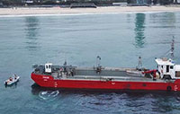

- **file**: `03_images/reefs/narrowneck-gold-coast/narrowneck-gold-coast_cogc_renewal_page_faucon_split_hull_dredger_thumb_2018.jpg`
- **kind**: photo
- **shows**: Side view of the red split-hull dredger Faucon on site, the beach and training works in the background.
- **structure visible**: False
- **state shown**: renewal works (2017-18)
- **image date**: 2017-2018
- **citation**: City of Gold Coast (2020). Narrowneck Reef Renewal (project page; archived copy of 2020-08-04), image The split hull dredger named 'FAUCON' at the reef site with Narrowneck beach in the background (thumbnail). Original https://www.goldcoast.qld.gov.au/narrowneck-reef-renewal-39934.html ; archive http://web.archive.org/web/20200804025419/https://www.goldcoast.qld.gov.au/narrowneck-reef-renewal-39934.html. Accessed 2026-10-06.
- **image URL**: http://web.archive.org/web/20200804025419im_/https://www.goldcoast.qld.gov.au/_images/narrowneck-reef-renewal-faucon-th.jpg
- **source page**: http://web.archive.org/web/20200804025419/https://www.goldcoast.qld.gov.au/narrowneck-reef-renewal-39934.html
- **page / figure**: The split hull dredger named 'FAUCON' at the reef site with Narrowneck beach in the background (thumbnail)
- **credit**: City of Gold Coast; photo/video courtesy International Coastal Management (ICM) where captioned
- **licence**: not stated (City of Gold Coast web content)
- **retrieved**: 2026-10-06
- **used for**: context
- **How used for the model**: Context: method (container placed from a split-hull barge); no geometry.
- **3D check pending**: no - None
- **linked records**: 07_scale/bathymetry/gold_coast/SOURCES.md GC-N33; 07_scale/bathymetry/gold_coast/REPORT.md
- **size**: 0.01 MB, 200x127 px
- **sha256**: 28a079ad89d981f52c9252b06f632a4cac91aca34801c87bed9f019ea63ab40c
- **rights**: Private research copy; reuse rights to be checked before any public release.
- **display in HTML**: True
- **added by**: gold_coast_gov_reports_bathymetry, 2026-10-06

## narrowneck-gold-coast-img-35 - City of Gold Coast Narrowneck Reef Renewal page: FAUCON placing a geotextile sand container on the reef (thumbnail)

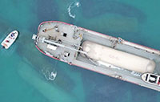

- **file**: `03_images/reefs/narrowneck-gold-coast/narrowneck-gold-coast_cogc_renewal_page_faucon_placing_container_over_reef_thumb_2018.jpg`
- **kind**: aerial
- **shows**: Vertical drone view of the dredger with a sand-filled container in its hull above the reef arms; the existing container patches show below.
- **structure visible**: True
- **state shown**: renewal works (2017-18)
- **image date**: 2017-2018
- **citation**: City of Gold Coast (2020). Narrowneck Reef Renewal (project page; archived copy of 2020-08-04), image FAUCON placing a Geotextile Sand Container to renew the Narrowneck artificial reef (thumbnail). Original https://www.goldcoast.qld.gov.au/narrowneck-reef-renewal-39934.html ; archive http://web.archive.org/web/20200804025419/https://www.goldcoast.qld.gov.au/narrowneck-reef-renewal-39934.html. Accessed 2026-10-06.
- **image URL**: http://web.archive.org/web/20200804025419im_/https://www.goldcoast.qld.gov.au/_images/narrowneck-reef-renewal-geotextile-sand-container-th.jpg
- **source page**: http://web.archive.org/web/20200804025419/https://www.goldcoast.qld.gov.au/narrowneck-reef-renewal-39934.html
- **page / figure**: FAUCON placing a Geotextile Sand Container to renew the Narrowneck artificial reef (thumbnail)
- **credit**: City of Gold Coast; photo/video courtesy International Coastal Management (ICM) where captioned
- **licence**: not stated (City of Gold Coast web content)
- **retrieved**: 2026-10-06
- **used for**: context; plan_trace
- **How used for the model**: Shows how containers are placed on the existing footprint (container length against the hull gives a scale of about 20 m); too small for tracing.
- **3D check pending**: no - None (thumbnail only)
- **linked records**: 07_scale/bathymetry/gold_coast/SOURCES.md GC-N34; 07_scale/bathymetry/gold_coast/REPORT.md
- **size**: 0.01 MB, 200x127 px
- **sha256**: 4c5e211ef42007d903319440a9f605ac97a444a559e81bbbb033dde9204b90d7
- **rights**: Private research copy; reuse rights to be checked before any public release.
- **display in HTML**: True
- **added by**: gold_coast_gov_reports_bathymetry, 2026-10-06

## narrowneck-gold-coast-img-36 - City of Gold Coast Narrowneck Reef Renewal page: physical modelling of the renewal design options at the Queensland Government Hydraulics Laboratory (thumbnail)

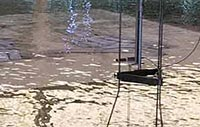

- **file**: `03_images/reefs/narrowneck-gold-coast/narrowneck-gold-coast_cogc_renewal_page_qghl_physical_model_renewal_options_thumb_2018.jpg`
- **kind**: photo
- **shows**: Close-up of the QGHL wave-basin model of the reef: sand-coloured bed with a wave probe frame and rigging; not enough resolution to see the reef plan.
- **structure visible**: False
- **state shown**: design options model (2017)
- **image date**: 2017 (design studies of two renewal options)
- **citation**: City of Gold Coast (2020). Narrowneck Reef Renewal (project page; archived copy of 2020-08-04), image Physical modelling of renewal design options at the Queensland Government Hydraulics Laboratory (thumbnail). Original https://www.goldcoast.qld.gov.au/narrowneck-reef-renewal-39934.html ; archive http://web.archive.org/web/20200804025419/https://www.goldcoast.qld.gov.au/narrowneck-reef-renewal-39934.html. Accessed 2026-10-06.
- **image URL**: http://web.archive.org/web/20200804025419im_/https://www.goldcoast.qld.gov.au/_images/narrowneck-reef-renewal-physical-modelling-th.jpg
- **source page**: http://web.archive.org/web/20200804025419/https://www.goldcoast.qld.gov.au/narrowneck-reef-renewal-39934.html
- **page / figure**: Physical modelling of renewal design options at the Queensland Government Hydraulics Laboratory (thumbnail)
- **credit**: City of Gold Coast; photo/video courtesy International Coastal Management (ICM) where captioned
- **licence**: not stated (City of Gold Coast web content)
- **retrieved**: 2026-10-06
- **used for**: context
- **How used for the model**: Evidence that the two renewal options (previous vs amended shape) were tested in a QGHL basin model in 2017; the page text says the new container locations were influenced by it, 'with some minor changes made to the shape of the renewed reef'. Goes to REPORT.md section 6.
- **3D check pending**: no - Which renewal option was built (previous vs amended shape): ask QGHL/City for the model plan or read the Corbett et al. (2023) figure of Options 1 and 2 (values: planform)
- **linked records**: 07_scale/bathymetry/gold_coast/SOURCES.md GC-N35; 07_scale/bathymetry/gold_coast/REPORT.md
- **size**: 0.01 MB, 200x127 px
- **sha256**: e2112f411c41ea465f26d12146d7698acc0780ca1d16068c7a493f1518717367
- **rights**: Private research copy; reuse rights to be checked before any public release.
- **display in HTML**: True
- **added by**: gold_coast_gov_reports_bathymetry, 2026-10-06
- **3D / planform check result (2026-10-06)**: Checked 2026-10-06: the 200 x 127 px thumbnail shows a basin instrument and a model beach, no reef plan, so it cannot say which renewal option was built. The question stays open (needs Corbett et al. 2023 figures; REPORT.md 8 request 1); the drawn state is simply the visible 2020 container field. Nothing further can be read from this image.
- **How used (update 2026-10-06)**: No planform information (METHOD.md Step 6).

## narrowneck-gold-coast-img-37 - North Narrowneck Beach lifeguard sign, Main Beach (Olszewski, 2026-07-25)

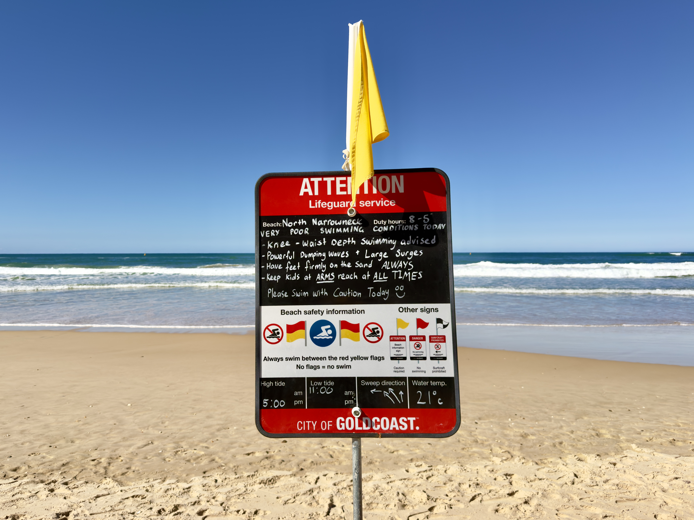

- **file**: `03_images/reefs/narrowneck-gold-coast/narrowneck-gold-coast_north-narrowneck-beach-sign_2026-07.jpg`
- **kind**: photo
- **shows**: A City of Gold Coast lifeguard sign 'Beach: North Narrowneck' (hazard board, tide times 5:00 / 11:00, water temp 21 C) on the open beach with surf behind it; no reef structure visible.
- **structure visible**: False
- **state shown**: not applicable (site context, 2026)
- **image date**: 2026-07-25 13:19
- **citation**: Olszewski, Chris (User:Kgbo) (2026-07-25). North Narrowneck Beach, Main Beach, Queensland, 2026. Wikimedia Commons, File:North_Narrowneck_Beach,_Main_Beach,_Queensland,_2026.jpg. https://commons.wikimedia.org/wiki/File:North_Narrowneck_Beach,_Main_Beach,_Queensland,_2026.jpg. Accessed 2026-10-06.
- **image URL**: https://upload.wikimedia.org/wikipedia/commons/8/85/North_Narrowneck_Beach%2C_Main_Beach%2C_Queensland%2C_2026.jpg
- **source page**: https://commons.wikimedia.org/wiki/File:North_Narrowneck_Beach,_Main_Beach,_Queensland,_2026.jpg
- **page / figure**: whole photo (7277 x 5458 px)
- **credit**: Chris Olszewski (User:Kgbo), own work, via Wikimedia Commons
- **licence**: CC BY-SA 4.0 (https://creativecommons.org/licenses/by-sa/4.0) - attribution required, share-alike
- **retrieved**: 2026-10-06
- **used for**: context
- **How used for the model**: Page illustration of the site (beach adjacent to the reef). The sign's tide times and water temperature are not used.
- **3D check pending**: no - none: site sign photo
- **linked records**: 02_research/reefs/narrowneck-gold-coast.json images[0]; 05_qa/reef/narrowneck-gold-coast_media_recheck.json images[0]
- **size**: 5.13 MB, 7277x5458 px
- **sha256**: d8c8c51b54a88157406d86a99df61425eb87c3278138ce8e6df5f9cb4a1e642f
- **rights**: Private research copy; reuse rights to be checked before any public release.
- **display in HTML**: True
- **added by**: image-registry backfill, 2026-10-06

## narrowneck-gold-coast-img-38 - ICM composite: pre-reef eroded 'Narrowneck Artificial Headland' aerial and the 'Northern Gold Coast Beach Protection Strategy' map

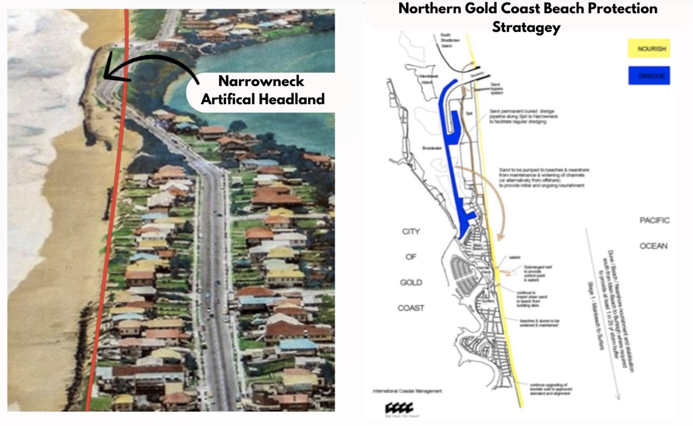

- **file**: `03_images/reefs/narrowneck-gold-coast/narrowneck-gold-coast_icm-eroded-headland-and-strategy-map.jpg`
- **kind**: diagram
- **shows**: Left: oblique aerial of the eroded Narrowneck headland with a red line and arrow labelled 'Narrowneck Artifical Headland'; right: sketch map 'Northern Gold Coast Beach Protection Stratagey' marking nourishment and dredging areas along the northern Gold Coast and a submerged reef as the control point.
- **structure visible**: False
- **state shown**: pre-construction (before the reef)
- **image date**: aerial: before the reef (1990s erosion period); strategy map: 1999 strategy
- **citation**: International Coastal Management (n.d.; page undated). Building Artificial Surf Reefs: Worldwide Lessons & Applications [web page]. International Coastal Management (ICM), https://www.coastalmanagement.com.au/artificial-surf-reefs. Image file https://static.wixstatic.com/media/97fa2b_f659d48522734f379fcf1a8bf0db6496~mv2.jpg (card used a resized variant of the same media id). Accessed 2026-10-06.
- **image URL**: https://static.wixstatic.com/media/97fa2b_f659d48522734f379fcf1a8bf0db6496~mv2.jpg
- **source page**: https://www.coastalmanagement.com.au/artificial-surf-reefs
- **page / figure**: page image (1858 x 1144 px)
- **credit**: International Coastal Management (ICM)
- **licence**: Copyright International Coastal Management (company website); link/research copy only - NOT cleared
- **retrieved**: 2026-10-06
- **used for**: context
- **How used for the model**: Page illustration of the reef's purpose (control point for the Northern Gold Coast Beach Protection Strategy). No dimension read.
- **3D check pending**: no - none: context aerial and schematic map
- **linked records**: 02_research/reefs/narrowneck-gold-coast.json images[1]; 05_qa/reef/narrowneck-gold-coast_media_recheck.json images[1]
- **size**: 0.16 MB, 1858x1144 px
- **sha256**: d345200d79bfb7a0a95ff4cfa2a8426067d98afa9453534b1aec07b30e4d0ec0
- **rights**: Private research copy; reuse rights to be checked before any public release.
- **display in HTML**: True
- **added by**: image-registry backfill, 2026-10-06

## narrowneck-gold-coast-img-39 - ICM before/after pair: eroded Narrowneck beach with sandbag revetment vs a wide vegetated dune beach 25 years on

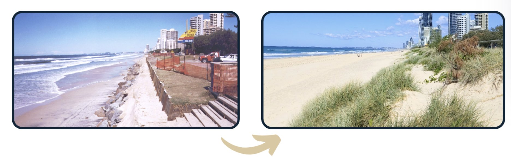

- **file**: `03_images/reefs/narrowneck-gold-coast/narrowneck-gold-coast_icm-before-after-beach.jpg`
- **kind**: photo
- **shows**: Two photos of the same Surfers Paradise skyline: an eroded beach with a sandbag revetment and stairs (before), and a wide beach with a vegetated dune system (after).
- **structure visible**: False
- **state shown**: before / after the Narrowneck project (reef not visible)
- **image date**: before: 1990s; after: about 25 years later (ICM caption)
- **citation**: International Coastal Management (n.d.; page undated). Building Artificial Surf Reefs: Worldwide Lessons & Applications [web page]. International Coastal Management (ICM), https://www.coastalmanagement.com.au/artificial-surf-reefs. Image file https://static.wixstatic.com/media/97fa2b_25f1b26178af4d1d9fadb7f07b437abf~mv2.jpg (card used a resized variant of the same media id). Accessed 2026-10-06.
- **image URL**: https://static.wixstatic.com/media/97fa2b_25f1b26178af4d1d9fadb7f07b437abf~mv2.jpg
- **source page**: https://www.coastalmanagement.com.au/artificial-surf-reefs
- **page / figure**: page image (1872 x 590 px)
- **credit**: International Coastal Management (ICM)
- **licence**: Copyright International Coastal Management (company website); link/research copy only - NOT cleared
- **retrieved**: 2026-10-06
- **used for**: context
- **How used for the model**: Page illustration of the beach-widening outcome (ICM attributes it to the beach-protection project including the reef). Not a reef measurement.
- **3D check pending**: no - none: beach before/after photos
- **linked records**: 02_research/reefs/narrowneck-gold-coast.json images[2]; 05_qa/reef/narrowneck-gold-coast_media_recheck.json images[2]
- **size**: 0.14 MB, 1872x590 px
- **sha256**: f98ea908b2739a706ba754d99e9619fd1aef34e2223cd4126c0a7f3b4aecdd7e
- **rights**: Private research copy; reuse rights to be checked before any public release.
- **display in HTML**: True
- **added by**: image-registry backfill, 2026-10-06

## narrowneck-gold-coast-img-40 - ICM: 'Marine life on Narrowneck Artificial Reef' - fish school over red-brown macroalgae

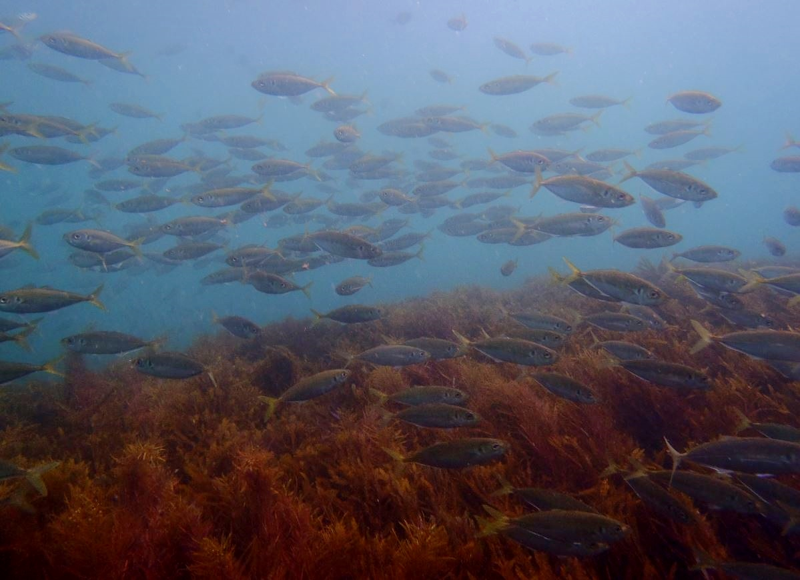

- **file**: `03_images/reefs/narrowneck-gold-coast/narrowneck-gold-coast_icm-marine-life-on-reef.jpg`
- **kind**: photo
- **shows**: Underwater photo of a dense school of small silver/yellow-finned fish above reddish-brown macroalgae growing on the reef substrate; the bag outline itself is not visible.
- **structure visible**: True
- **state shown**: as-built, colonised (date unknown)
- **image date**: unknown (before the page was written)
- **citation**: International Coastal Management (n.d.; page undated). Building Artificial Surf Reefs: Worldwide Lessons & Applications [web page]. International Coastal Management (ICM), https://www.coastalmanagement.com.au/artificial-surf-reefs. Image file https://static.wixstatic.com/media/164422_c1704d0a67bc488d8365e6fe2bd50708~mv2.jpg (card used a resized variant of the same media id). Accessed 2026-10-06.
- **image URL**: https://static.wixstatic.com/media/164422_c1704d0a67bc488d8365e6fe2bd50708~mv2.jpg
- **source page**: https://www.coastalmanagement.com.au/artificial-surf-reefs
- **page / figure**: page image (1199 x 870 px)
- **credit**: International Coastal Management (ICM)
- **licence**: Copyright International Coastal Management (company website); link/research copy only - NOT cleared
- **retrieved**: 2026-10-06
- **used for**: context
- **How used for the model**: Page illustration of the ecological co-benefit. No geometry read.
- **3D check pending**: no - none: marine-life photo
- **linked records**: 02_research/reefs/narrowneck-gold-coast.json images[3]; 05_qa/reef/narrowneck-gold-coast_media_recheck.json images[3]
- **size**: 0.25 MB, 1199x870 px
- **sha256**: 104a56ab08d9a6525046243108e3b1e6d430a610b58d326b555eae8008325ae9
- **rights**: Private research copy; reuse rights to be checked before any public release.
- **display in HTML**: True
- **added by**: image-registry backfill, 2026-10-06

## narrowneck-gold-coast-img-41 - ICM: construction - a large geotextile 'mega sandbag' lowered off the split-hull barge via ribbed hose

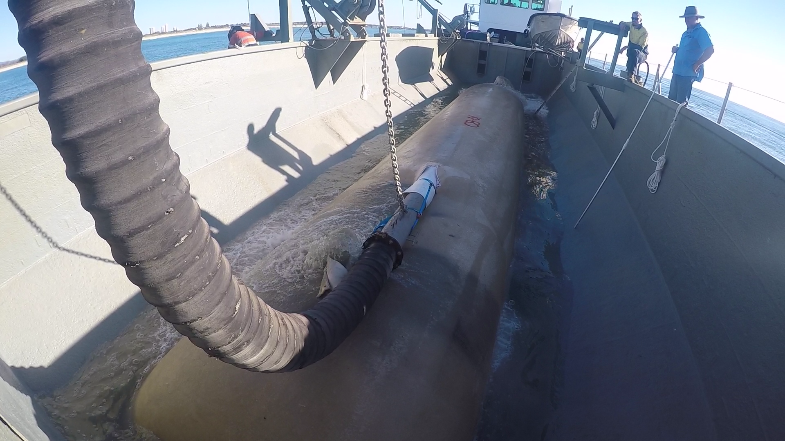

- **file**: `03_images/reefs/narrowneck-gold-coast/narrowneck-gold-coast_icm-sandbag-lowered-from-barge.png`
- **kind**: photo
- **shows**: Fisheye view from the barge deck of a large sand-filled geotextile container being lowered off the stern via a ribbed hose, two workers at the rail and the Gold Coast coastline in the background.
- **structure visible**: True
- **state shown**: under construction (container placement)
- **image date**: 1999-2006 (construction phases; exact day not stated)
- **citation**: International Coastal Management (n.d.; page undated). Building Artificial Surf Reefs: Worldwide Lessons & Applications [web page]. International Coastal Management (ICM), https://www.coastalmanagement.com.au/artificial-surf-reefs. Image file https://static.wixstatic.com/media/164422_8b3239d82ee84d159668f47acabd0dc2~mv2.png (card used a resized variant of the same media id). Accessed 2026-10-06.
- **image URL**: https://static.wixstatic.com/media/164422_8b3239d82ee84d159668f47acabd0dc2~mv2.png
- **source page**: https://www.coastalmanagement.com.au/artificial-surf-reefs
- **page / figure**: page image (1920 x 1080 px; recommended hero in the recheck)
- **credit**: International Coastal Management (ICM)
- **licence**: Copyright International Coastal Management (company website); link/research copy only - NOT cleared
- **retrieved**: 2026-10-06
- **used for**: context
- **How used for the model**: Page illustration of the construction method; no dimension read (fisheye, no scale).
- **3D check pending**: no - none: construction method photo
- **linked records**: 02_research/reefs/narrowneck-gold-coast.json images[4]; 05_qa/reef/narrowneck-gold-coast_media_recheck.json images[4]
- **size**: 2.95 MB, 1920x1080 px
- **sha256**: 1236d0248b982695f10598f162ca4bcad4cb90f03e5c8dfa4cdd4a49492ec0a8
- **rights**: Private research copy; reuse rights to be checked before any public release.
- **display in HTML**: True
- **added by**: image-registry backfill, 2026-10-06

## narrowneck-gold-coast-img-42 - Webinar screenshot 'The Gold Coast Example - Artificial Reef' (ICM / coastalmanagement.com.au): aerial of the multi-purpose reef, a surf wave, underwater marine life

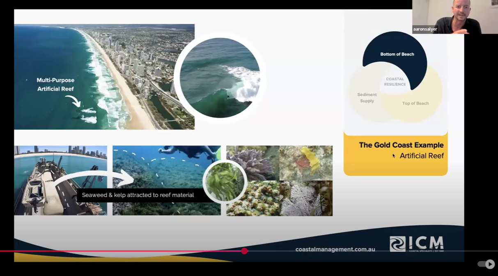

- **file**: `03_images/from_lior/goldcoast_pptx/image29.png`
- **kind**: video_frame
- **shows**: Left top: aerial of the Gold Coast / Surfers Paradise with an arrow 'Multi-Purpose Artificial Reef' to whitewater offshore and a circular inset of a wave breaking; bottom: barge deck with container, divers over kelp-covered reef ('Seaweed & kelp attracted to reef material') and marine-life close-ups; right: coastal-resilience diagram. Presenter webcam top right.
- **structure visible**: True
- **state shown**: as-built, in service (date unknown)
- **image date**: unknown (webinar date not stated)
- **citation**: International Coastal Management (ICM) (undated). Webinar slide 'The Gold Coast Example - Artificial Reef' presented by 'aaronsalyer' (Aaron Salyer, per the on-screen name tag) [recorded webinar, screenshot]. coastalmanagement.com.au (watermark). Screenshot supplied by Lior in his Gold Coast slide deck (slide 16), extracted 2026-09-24 to 03_images/from_lior/goldcoast_pptx/image29.png. Original video URL not recorded.
- **source page**: https://www.coastalmanagement.com.au/
- **page / figure**: slide 16 of Lior's deck; webinar frame
- **credit**: International Coastal Management (ICM); screenshot via Lior's deck
- **licence**: Copyright ICM webinar; third-party screenshot - NOT cleared; contains the presenter's webcam thumbnail (identifiable person: do not publish without checking)
- **retrieved**: 2026-09-24 (extracted)
- **used for**: context
- **How used for the model**: Context only (the page uses a copy under 04_build/assets/narrowneck-gold-coast/image29.png). The aerial shows the reef's surf break; no dimension was read (the slide has no scale).
- **3D check pending**: no - none: promotional webinar slide, no scale
- **linked records**: 03_images/from_lior/goldcoast_pptx/INDEX.md (image29); 01_source_notes/pptx_goldcoast_swells_people_photos.md; 02_research/reefs/narrowneck-gold-coast.json lior_images
- **size**: 0.59 MB, 1213x674 px
- **sha256**: e6c2bb829d72bbb5c1314d3b8200b5a229c45a799ba5378df0162d2df7453351
- **rights**: Private research copy; reuse rights to be checked before any public release.
- **display in HTML**: True
- **added by**: image-registry backfill, 2026-10-06
- **notes**: Registered where it sits (Lior's folder); contains an identifiable presenter thumbnail - privacy flag in INDEX.md. image26 (4-panel comparison) is deliberately NOT registered or embedded.

## narrowneck-gold-coast-img-43 - Screenshot supplied by Lior: YouTube 'NARROWNECK REEF' (Griffith Centre for Coastal Management) showing a computer render of the reef

- **file**: `Initial info from Lior/Screenshot 2026-10-04 193459.png`
- **kind**: video_frame
- **shows**: Blue-water computer render of two long container-bag reef arms laid out as a grid of white outlines on the seabed under a wavy surface, with the video title bar 'NARROWNECK REEF'.
- **structure visible**: True
- **state shown**: design / model render (not a photo)
- **image date**: video 2015-05-13; screenshot 2026-10-04
- **citation**: Griffith Centre for Coastal Management (2015-05-13). NARROWNECK REEF [video, 4:03]. YouTube, https://www.youtube.com/watch?v=oUfLGStUKPs (frame in a screenshot taken by Lior before 2026-10-04, file 'Screenshot 2026-10-04 193459.png').
- **source page**: https://www.youtube.com/watch?v=oUfLGStUKPs
- **page / figure**: screenshot of the video player (time not shown)
- **credit**: Griffith Centre for Coastal Management (video); screenshot by Lior
- **licence**: YouTube standard licence; screenshot kept as a private research copy - NOT cleared
- **retrieved**: 2026-10-04 (supplied)
- **used for**: context; cross_check
- **How used for the model**: Context so far: a 3D visualisation of the arms laid out as individual containers (two arms). Not measured; may help check the two-arm layout of the planform and the container pattern.
- **3D check pending**: no - Reef layout: two arms of side-by-side containers in the video render vs shape/3D planform and the container placement plans (Jackson 2012 Fig 4) (values: planform)
- **linked records**: 02_research/videos/narrowneck-gold-coast/videos.json (oUfLGStUKPs); Initial info from Lior (Lior's screenshot)
- **size**: 1.07 MB, 1326x952 px
- **sha256**: e09ee146989ef9b1c90caf50da254e107675e754fa0369a6259578c9cb618749
- **rights**: Private research copy; reuse rights to be checked before any public release.
- **display in HTML**: True
- **added by**: image-registry backfill, 2026-10-06
- **3D / planform check result (2026-10-06)**: Planform checked 2026-10-06: the YouTube render shows two separate leaf-shaped container fields side by side with a gap, each tilted down toward the sea like our arms (north arm longer), no flared wings. Topology agrees with the trace; the render is not to scale, so no metric check. Planform check done.
- **How used (update 2026-10-06)**: Qualitative topology check (METHOD.md Step 6).

## narrowneck-gold-coast-img-44 - Esri World Imagery z19 crop, centre -27.98665 / 153.43455, r=300 m (2275 x 2276 px, 0.2637 m/px), 2025-10-10

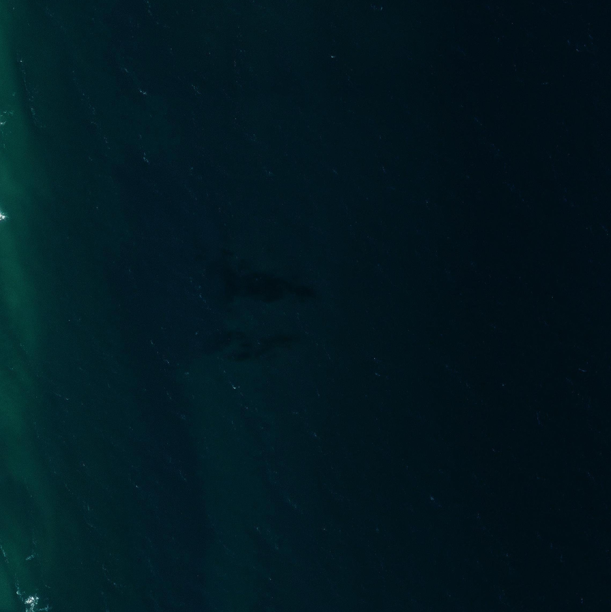

- **file**: `07_scale/shapes/narrowneck-gold-coast/src/nn_esri_z19_current.png`
- **kind**: satellite
- **shows**: Very dark water off Narrowneck: both reef arms are only a faint dark patch (north arm about px 700-1000 x 840-960 and south arm about 700-950 x 1040-1130 in a 1999 px display).
- **structure visible**: True
- **state shown**: as-built (renewed June 2018), current 2025
- **image date**: 2025-10-10
- **citation**: Esri, Maxar, Earthstar Geographics, and the GIS User Community (2025). World Imagery (current layer), image captured 2025-10-10. Esri World Imagery tile service, https://server.arcgisonline.com/ArcGIS/rest/services/World_Imagery/MapServer. Accessed 2026-10-05.
- **image URL**: https://server.arcgisonline.com/ArcGIS/rest/services/World_Imagery/MapServer/tile/{z}/{y}/{x}
- **source page**: Esri World Imagery (identify DATE field)
- **page / figure**: z19, sidecar nn_esri_z19_current.png.geo.json; sources.md s2
- **credit**: Esri, Maxar, Earthstar Geographics, and the GIS User Community
- **licence**: Esri/Maxar imagery terms (not an open licence); private research copy only
- **retrieved**: 2026-10-05
- **used for**: context
- **How used for the model**: Context (shape.json not yet written): the reef is barely distinguishable, so it was not traced; earlier Wayback frames and the Jackson 2012 aerials are the candidate trace sources (METHOD.md Step 1b).
- **3D check pending**: no - none: reef too faint to measure
- **linked records**: 07_scale/shapes/narrowneck-gold-coast/sources.md s2; 07_scale/shapes/narrowneck-gold-coast/METHOD.md Step 1b
- **size**: 2.70 MB, 2275x2276 px
- **sha256**: 181335e718db8dd53551c5af1a3d5abecb762c64c8d4482db3609b47bdb76d9a
- **rights**: Private research copy; reuse rights to be checked before any public release.
- **display in HTML**: True
- **added by**: image-registry backfill, 2026-10-06

## narrowneck-gold-coast-img-45 - Esri Wayback 2020-08-08 (release 9812), z19 crop of Narrowneck Reef, 0.2637 m/px (1517x1517 px)

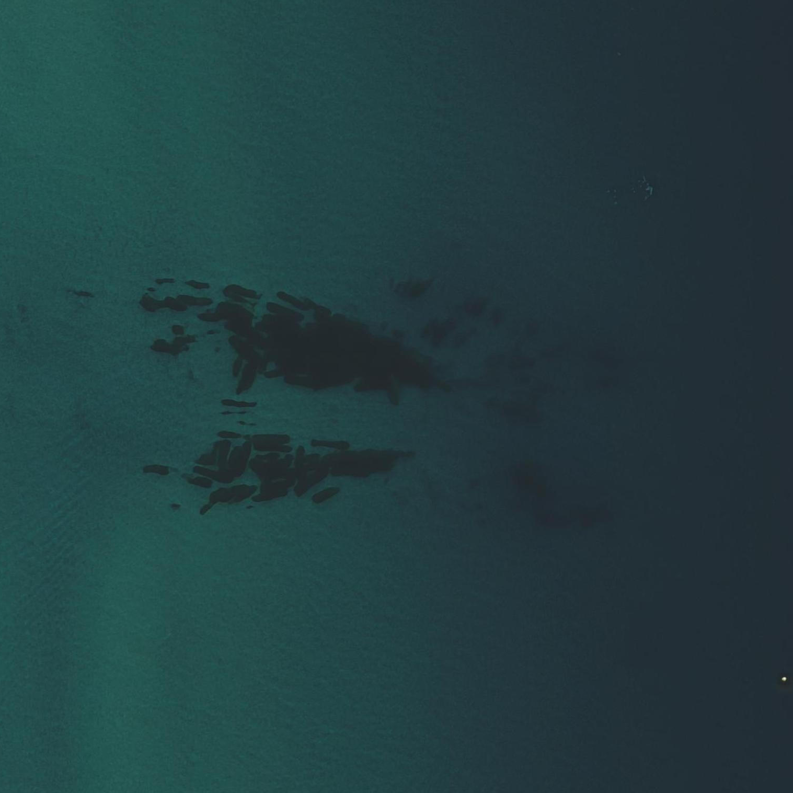

- **file**: `07_scale/shapes/narrowneck-gold-coast/src/wayback/nn_wayback_2020-08-08_r9812_z19.png`
- **kind**: satellite
- **shows**: Sharpest post-renewal view of Narrowneck Reef: both arms resolve into individual dark 20 m geotextile containers on pale cyan water; north arm a seaward-tapering wedge ~150 m cross-shore, south arm a similar but smaller wedge, a clear ~35 m wide light channel between them; shore to the left (west), north up.
- **structure visible**: True
- **state shown**: renewed (June 2018) + 2 years
- **image date**: 2020-08-08
- **citation**: Esri, Maxar, Earthstar Geographics, and the GIS User Community (2020). World Imagery Wayback, release 9812 (imagery date from the identify SRC_DATE2 field at the reef: 2020-08-08). Esri Wayback tile service, https://livingatlas.arcgis.com/wayback/. Accessed 2026-10-05 (fetched), 2026-10-06 (copied to src).
- **image URL**: https://wayback.maptiles.arcgis.com/arcgis/rest/services/World_Imagery/WMTS/1.0.0/default028mm/MapServer/tile/9812/{z}/{y}/{x}
- **source page**: Esri Wayback (release 9812)
- **page / figure**: z19, sidecar .png.geo.json; sources.md s3
- **credit**: Esri, Maxar, Earthstar Geographics, and the GIS User Community
- **licence**: Esri/Maxar imagery terms (not an open licence); private research copy only
- **retrieved**: 2026-10-06
- **used for**: plan_trace, scale, cross_check
- **How used for the model**: PRIMARY plan-view trace (shape.json source s3 / sources.md s3): outline of the visible container patches of each arm read off this georeferenced image (0.2637 m/px from Web-Mercator z19 at -27.9867 deg). Gives canonical polygons, area, bbox, arm angles and the lat/lon polygon.
- **3D check pending**: no - none (this is the traced primary)
- **linked records**: 07_scale/shapes/narrowneck-gold-coast/sources.md s3; 07_scale/shapes/narrowneck-gold-coast/METHOD.md Step 1d
- **size**: 703625 bytes, 1517x1517 px
- **sha256**: c1f427ee1572be9ff3dabc4548b5dddbb80a53a0ad65698f002ec465713a9da4
- **rights**: Private research copy; reuse rights to be checked before any public release.
- **display in HTML**: True
- **added by**: narrowneck-gold-coast plan-shape trace (resume), 2026-10-06
- **How used (update 2026-10-06)**: Traced: 7 polygons (north/south arm envelopes, two NW patches, three channel containers) -> shape.json canonical (METHOD.md Steps 2a-3).
- **annotated versions**: 07_scale/shapes/narrowneck-gold-coast/overlays/s3_primary_trace.png

## narrowneck-gold-coast-img-46 - Esri Wayback release 47963 (identify date 2022-11-06; tile set identical to releases 12428 and 20512), z19 crop of Narrowneck Reef, 0.2637 m/px (1517x1517 px)

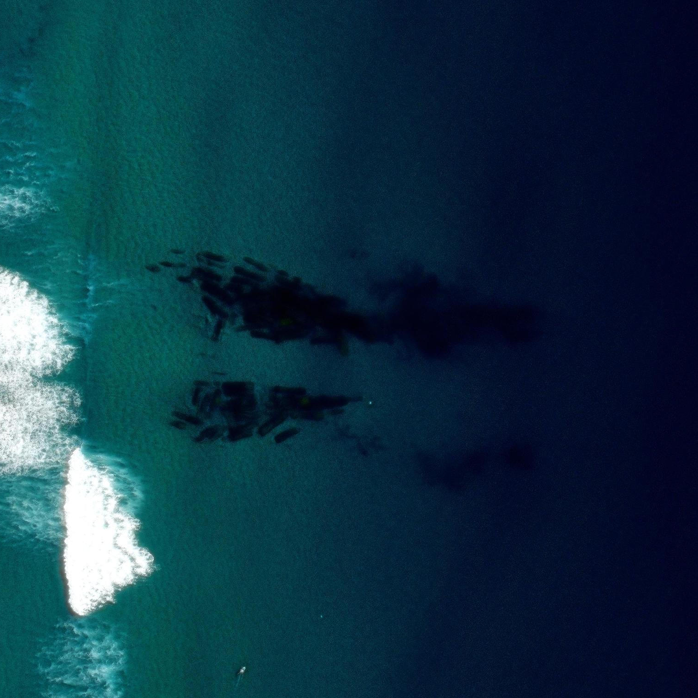

- **file**: `07_scale/shapes/narrowneck-gold-coast/src/wayback/nn_wayback_2022-11-06_r47963_z19.png`
- **kind**: satellite
- **shows**: Darker, higher-contrast image of the same two container arms; individual containers still resolved; used as an independent second image for the same footprint.
- **structure visible**: True
- **state shown**: renewed (June 2018) + 4 years or more
- **image date**: 2022-11-06 (earliest of three identical releases; imagery date >= 2022-11-06)
- **citation**: Esri, Maxar, Earthstar Geographics, and the GIS User Community (2022). World Imagery Wayback, release 47963 (imagery date from the identify SRC_DATE2 field at the reef: 2022-11-06). Esri Wayback tile service, https://livingatlas.arcgis.com/wayback/. Accessed 2026-10-05 (fetched), 2026-10-06 (copied to src).
- **image URL**: https://wayback.maptiles.arcgis.com/arcgis/rest/services/World_Imagery/WMTS/1.0.0/default028mm/MapServer/tile/47963/{z}/{y}/{x}
- **source page**: Esri Wayback (release 47963)
- **page / figure**: z19, sidecar .png.geo.json; sources.md s4
- **credit**: Esri, Maxar, Earthstar Geographics, and the GIS User Community
- **licence**: Esri/Maxar imagery terms (not an open licence); private research copy only
- **retrieved**: 2026-10-06
- **used for**: cross_check, plan_trace
- **How used for the model**: CROSS-CHECK of the primary trace (sources.md s4): the s3 outline was overlaid unchanged on this independent image to check position/extent of the patches; differences reported in METHOD.md.
- **3D check pending**: no - none (cross-check done in METHOD.md)
- **linked records**: 07_scale/shapes/narrowneck-gold-coast/sources.md s4; 07_scale/shapes/narrowneck-gold-coast/METHOD.md Step 1d
- **size**: 2358816 bytes, 1517x1517 px
- **sha256**: c26b767b7dde22f37df2468a233df7619986320af2f333b6a975ef3efce9165c
- **rights**: Private research copy; reuse rights to be checked before any public release.
- **display in HTML**: True
- **added by**: narrowneck-gold-coast plan-shape trace (resume), 2026-10-06
- **How used (update 2026-10-06)**: Cross-check overlay: s3 polygons on this image, phase-correlation shift 0.17 m E / 0.10 m N.
- **annotated versions**: 07_scale/shapes/narrowneck-gold-coast/overlays/s4_crosscheck_on_2022-11.png

## narrowneck-gold-coast-img-47 - Esri Wayback 2019-06-18 (release 21485), z19 crop of Narrowneck Reef, 0.2637 m/px (1517x1517 px)

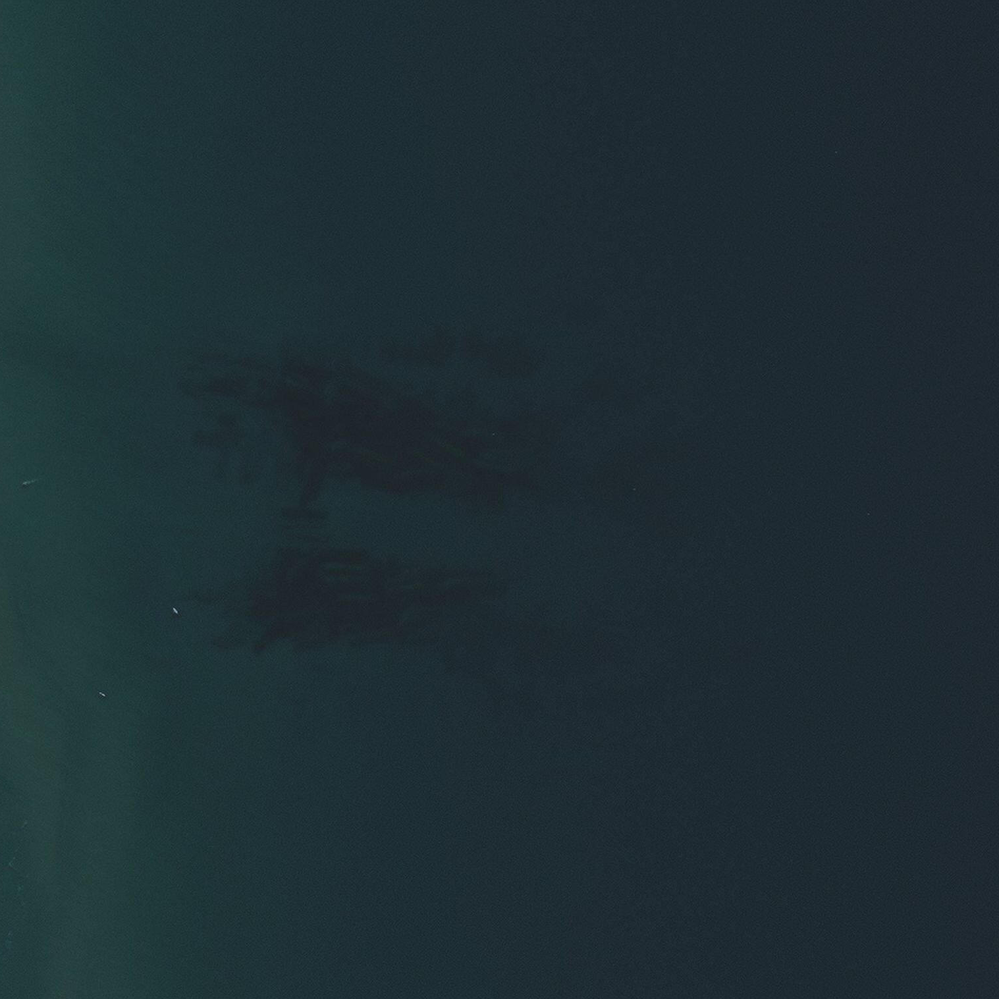

- **file**: `07_scale/shapes/narrowneck-gold-coast/src/wayback/nn_wayback_2019-06-18_r21485_z19.png`
- **kind**: satellite
- **shows**: First imagery after the June 2018 renewal: same two container arms, blurred and dark (lower apparent resolution than the 2020-08-08 image).
- **structure visible**: True
- **state shown**: renewed (June 2018) + 1 year
- **image date**: 2019-06-18
- **citation**: Esri, Maxar, Earthstar Geographics, and the GIS User Community (2019). World Imagery Wayback, release 21485 (imagery date from the identify SRC_DATE2 field at the reef: 2019-06-18). Esri Wayback tile service, https://livingatlas.arcgis.com/wayback/. Accessed 2026-10-05 (fetched), 2026-10-06 (copied to src).
- **image URL**: https://wayback.maptiles.arcgis.com/arcgis/rest/services/World_Imagery/WMTS/1.0.0/default028mm/MapServer/tile/21485/{z}/{y}/{x}
- **source page**: Esri Wayback (release 21485)
- **page / figure**: z19, sidecar .png.geo.json; sources.md s5
- **credit**: Esri, Maxar, Earthstar Geographics, and the GIS User Community
- **licence**: Esri/Maxar imagery terms (not an open licence); private research copy only
- **retrieved**: 2026-10-06
- **used for**: cross_check
- **How used for the model**: POSITION CHECK (sources.md s5): REPORT 6.5 named this as the first post-June-2018 image; the s3 outline overlaid on it agrees within a few metres (METHOD.md). Not traced separately because it is blurrier than s3.
- **3D check pending**: no - none
- **linked records**: 07_scale/shapes/narrowneck-gold-coast/sources.md s5; 07_scale/shapes/narrowneck-gold-coast/METHOD.md Step 1d
- **size**: 1196189 bytes, 1517x1517 px
- **sha256**: 5cd8c6885ac6a0e65e480b8de61d4fbf99ab15470b246753b30f3d6fb5c5568d
- **rights**: Private research copy; reuse rights to be checked before any public release.
- **display in HTML**: True
- **added by**: narrowneck-gold-coast plan-shape trace (resume), 2026-10-06
- **How used (update 2026-10-06)**: Position-check overlay of the s3 polygons.
- **annotated versions**: 07_scale/shapes/narrowneck-gold-coast/overlays/s5_check_on_2019-06.png

## narrowneck-gold-coast-img-48 - Esri Wayback 2016-07-01 (release 23264), z19 crop of Narrowneck Reef, 0.2637 m/px (1517x1517 px) - PRE-renewal

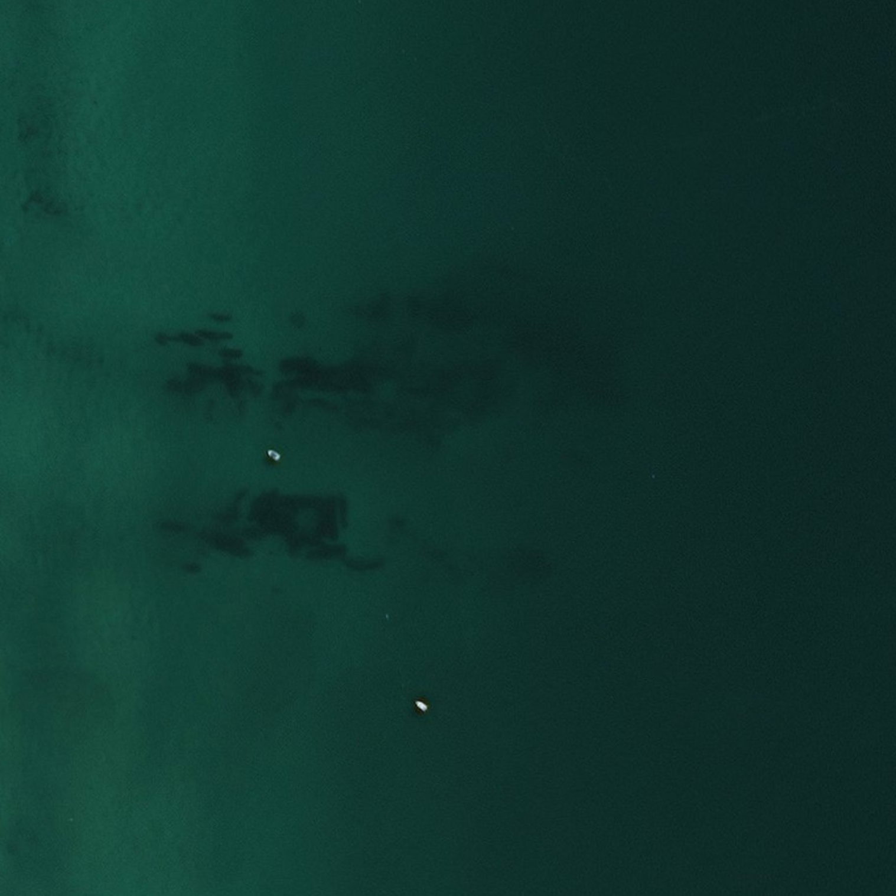

- **file**: `07_scale/shapes/narrowneck-gold-coast/src/wayback/nn_wayback_2016-07-01_r23264_z19.png`
- **kind**: satellite
- **shows**: The reef about 14 months before the 2017-18 renewal works: murky green water, both arms visible only as fainter, more scattered patches.
- **structure visible**: True
- **state shown**: as-maintained (pre-renewal, 2016)
- **image date**: 2016-07-01
- **citation**: Esri, Maxar, Earthstar Geographics, and the GIS User Community (2016). World Imagery Wayback, release 23264 (imagery date from the identify SRC_DATE2 field at the reef: 2016-07-01). Esri Wayback tile service, https://livingatlas.arcgis.com/wayback/. Accessed 2026-10-05 (fetched), 2026-10-06 (copied to src).
- **image URL**: https://wayback.maptiles.arcgis.com/arcgis/rest/services/World_Imagery/WMTS/1.0.0/default028mm/MapServer/tile/23264/{z}/{y}/{x}
- **source page**: Esri Wayback (release 23264)
- **page / figure**: z19, sidecar .png.geo.json; sources.md s6
- **credit**: Esri, Maxar, Earthstar Geographics, and the GIS User Community
- **licence**: Esri/Maxar imagery terms (not an open licence); private research copy only
- **retrieved**: 2026-10-06
- **used for**: context
- **How used for the model**: Context (sources.md s6): shows the pre-renewal footprint, to see by comparison with s3 where the 84 containers of 2018 changed the planform. Not traced.
- **3D check pending**: no - none
- **linked records**: 07_scale/shapes/narrowneck-gold-coast/sources.md s6; 07_scale/shapes/narrowneck-gold-coast/METHOD.md Step 1d
- **size**: 963009 bytes, 1517x1517 px
- **sha256**: f771e9c99b8b8e1e9c0763a7f3f4b2993b685ece4dd73ce3ead8ce190432ad19
- **rights**: Private research copy; reuse rights to be checked before any public release.
- **display in HTML**: True
- **added by**: narrowneck-gold-coast plan-shape trace (resume), 2026-10-06
- **How used (update 2026-10-06)**: Context overlay of the s3 polygons on the pre-renewal image.
- **annotated versions**: 07_scale/shapes/narrowneck-gold-coast/overlays/s6_pre_renewal_2016-07_with_s3_trace.png

## narrowneck-gold-coast-img-49 - Esri Wayback 2020-08-08 (release 9812), z17 crop, 3 km square around Narrowneck Reef (1.0547 m/px) - shoreline context

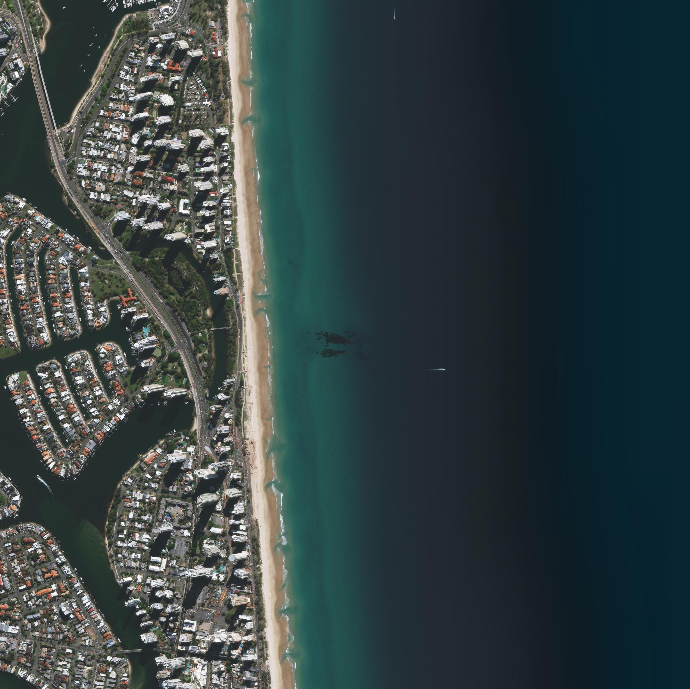

- **file**: `07_scale/shapes/narrowneck-gold-coast/src/wayback/nn_wayback_2020-08-08_r9812_z17_shoreline_context.png`
- **kind**: satellite
- **shows**: North-up 3 km square of the Main Beach / Narrowneck coast: straight beach running about 3.8 deg west of north, Gold Coast Highway and Broadwater to the west, the two reef arms as dark patches about 340 m offshore of the waterline, deep dark water further east.
- **structure visible**: True
- **state shown**: renewed (June 2018) + 2 years
- **image date**: 2020-08-08
- **citation**: Esri, Maxar, Earthstar Geographics, and the GIS User Community (2020). World Imagery Wayback, release 9812 (identify SRC_DATE2 2020-08-08). Esri Wayback tile service, https://livingatlas.arcgis.com/wayback/. Accessed 2026-10-06.
- **image URL**: https://wayback.maptiles.arcgis.com/arcgis/rest/services/World_Imagery/WMTS/1.0.0/default028mm/MapServer/tile/9812/{z}/{y}/{x}
- **source page**: Esri Wayback (release 9812)
- **page / figure**: z17, sidecar .png.geo.json; sources.md s7
- **credit**: Esri, Maxar, Earthstar Geographics, and the GIS User Community
- **licence**: Esri/Maxar imagery terms (not an open licence); private research copy only
- **retrieved**: 2026-10-06
- **used for**: scale, context
- **How used for the model**: Waterline (easternmost sand-coloured pixel on 285 rows) fitted by least squares to give the shoreline bearing 356.2 deg (shore normal 86.2 deg), the canonical-frame origin (waterline foot of the reef centroid) and the reef-to-waterline distance (288 m centroid, 213-369 m extent). METHOD.md Step 2b; shape.json canonical.
- **3D check pending**: no - none
- **linked records**: 07_scale/shapes/narrowneck-gold-coast/sources.md s7; 07_scale/shapes/narrowneck-gold-coast/METHOD.md Step 2b
- **size**: 5519878 bytes, 2845x2844 px
- **sha256**: 8d5f53ae45288e0701e7de30820f9f42c3c8023d89910c3d5f45779fd64e644c
- **rights**: Private research copy; reuse rights to be checked before any public release.
- **display in HTML**: True
- **added by**: narrowneck-gold-coast plan-shape trace (resume), 2026-10-06

## narrowneck-gold-coast-img-50 - Garmin Navionics SonarChart, Narrowneck Reef, zoom 18, shallow shading 0 m (series of 9 screenshots 0-8 m)

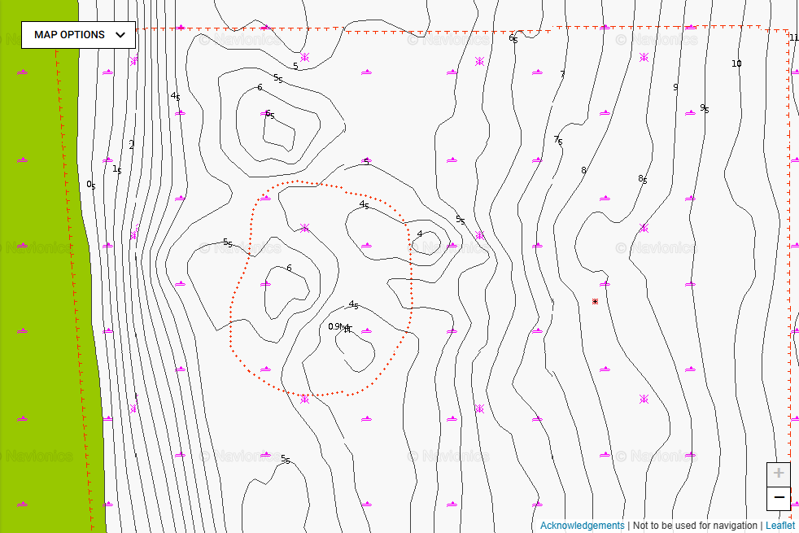

- **file**: `07_scale/shapes/narrowneck-gold-coast/src/navionics/sonar_z18_shade00.0.png`
- **kind**: chart_screenshot
- **shows**: SonarChart contours (0.5 m labels) around the reef: closed 4.0 and 4.5 m loops over the north arm, a closed 4.5 m loop with a '0.9' obstruction label over the south arm, a 6 m closed loop between the arms, 5.5-6 m around, 7-10 m seaward; red dotted restricted-area polygon (prohibited anchorage) around the arms; shading n m = water shallower than n m.
- **structure visible**: True
- **state shown**: renewed (chart data of unknown date)
- **image date**: chart state of 2026-10-06 (chart data date not shown)
- **citation**: Garmin Navionics (2026). Garmin Marine map (successor of the Navionics ChartViewer), SonarChart Maps layer, Meters, zoom 18. https://maps.garmin.com/en-US/marine. Accessed 2026-10-06 (captured with our own headless Chrome; 'Not to be used for navigation').
- **image URL**: https://maps.garmin.com/en-US/marine
- **source page**: Garmin Marine map
- **page / figure**: zoom 18; group sonar_z18_shade00.0 ... 08.0
- **credit**: Garmin Navionics (c) - chart data copyright Garmin; crowd-sourced SonarChart soundings
- **licence**: Garmin terms of use; not stated per image; private research copy only, NOT FOR NAVIGATION
- **retrieved**: 2026-10-06
- **used for**: 3d_seabed, 3d_crest, cross_check, scale
- **How used for the model**: Seabed and shoal read-out for the 3D stage and a position check of the trace: the s3 arms laid on the chart (map centre = reef centroid) fall on the 4.0/4.5 m shoal loops (METHOD.md Step 5; overlays navionics_sonar_*). Depth datum is not stated by the app (assumed LAT, supported by REPORT.md 5.2); the chart shows the arms only as 1.5-2 m shoals above 5.5-6 m seabed, not the crest.
- **3D check pending**: YES - 3D agent: use the contour values (4.0/4.5 over arms, 5.5-6 around, 7-10 seaward) as an extra seabed check against Vieira da Silva 2021 Fig 3 (-4/-5 inner, -6 to -8 reef body, -9/-10 seaward, AHD; convert LAT->AHD with +0.76)
- **linked records**: 07_scale/shapes/narrowneck-gold-coast/sources.md s12; 07_scale/shapes/narrowneck-gold-coast/METHOD.md Step 5
- **size**: 42478 bytes, 982x655 px
- **sha256**: 5e75721d394a102b8e472aa38c10031351d61d8d963ed31bedb7ac54ac58dc67
- **rights**: Private research copy; reuse rights to be checked before any public release.
- **display in HTML**: True
- **added by**: narrowneck-gold-coast plan-shape trace (resume), 2026-10-06

## narrowneck-gold-coast-img-51 - Garmin Navionics Nautical Chart, Narrowneck Reef, zoom 18, shallow shading 0 m (series of 9 screenshots 0-8 m)

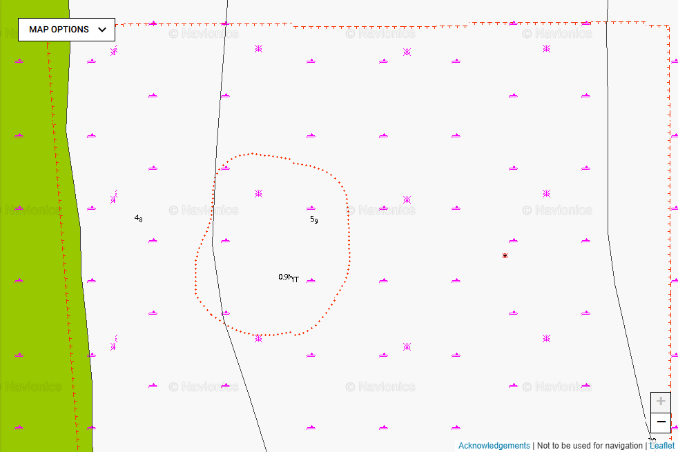

- **file**: `07_scale/shapes/narrowneck-gold-coast/src/navionics/naut_z18_shade00.0.png`
- **kind**: chart_screenshot
- **shows**: The official-chart layer shows almost nothing at the reef: one spot depth '0.9' (label suffix unclear) and a 5.9 m sounding inside the red dotted restricted-area polygon, one 5 m contour west of it; no reef outline.
- **structure visible**: True
- **state shown**: renewed (chart data of unknown date)
- **image date**: chart state of 2026-10-06 (chart data date not shown)
- **citation**: Garmin Navionics (2026). Garmin Marine map (successor of the Navionics ChartViewer), Nautical Charts layer, Meters, zoom 18. https://maps.garmin.com/en-US/marine. Accessed 2026-10-06 (captured with our own headless Chrome; 'Not to be used for navigation').
- **image URL**: https://maps.garmin.com/en-US/marine
- **source page**: Garmin Marine map
- **page / figure**: zoom 18; group naut_z18_shade00.0 ... 08.0
- **credit**: Garmin Navionics (c) - chart data copyright Garmin; crowd-sourced SonarChart soundings
- **licence**: Garmin terms of use; not stated per image; private research copy only, NOT FOR NAVIGATION
- **retrieved**: 2026-10-06
- **used for**: 3d_crest, cross_check
- **How used for the model**: Crest cross-check only: the single shallow spot depth 0.9 m (datum unstated, assumed LAT) is the shallowest value any chart shows at the reef; it is 0.5 m shallower than the post-2018 multibeam crest (-2.2 m AHD = 1.44 m below LAT by MSQ) and close to the 1.0 m below LAT of the 2007-2012 papers, so it probably carries an older state. METHOD.md Step 5.
- **3D check pending**: YES - 3D agent: decide whether the 0.9 m spot depth is used at all (older crest state); ask Lior to read the Navionics app label (obstruction symbol) at -27.9866, 153.4341
- **linked records**: 07_scale/shapes/narrowneck-gold-coast/sources.md s12; 07_scale/shapes/narrowneck-gold-coast/METHOD.md Step 5
- **size**: 26205 bytes, 982x655 px
- **sha256**: 543d7d1af6ec01fec67ea3d031ba552f9a5bc17e3c066b1dd73628a1402c4fe7
- **rights**: Private research copy; reuse rights to be checked before any public release.
- **display in HTML**: True
- **added by**: narrowneck-gold-coast plan-shape trace (resume), 2026-10-06

## narrowneck-gold-coast-img-52 - Garmin Navionics SonarChart, Narrowneck Reef, zoom 17 base view

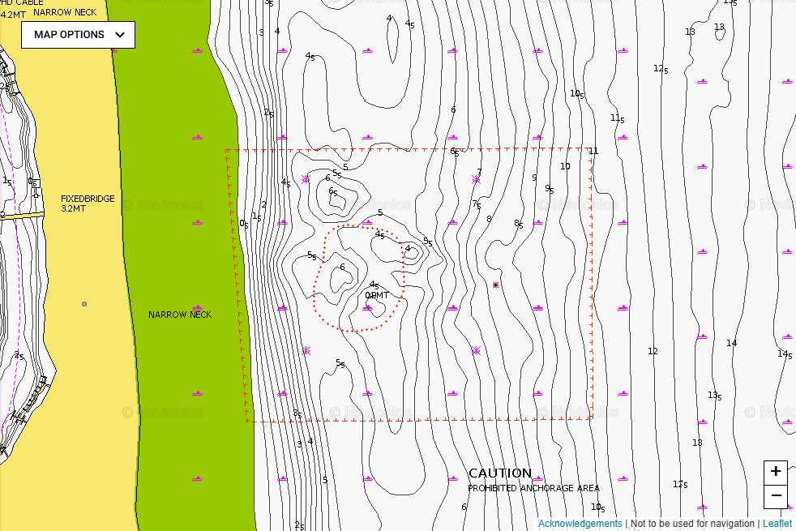

- **file**: `07_scale/shapes/narrowneck-gold-coast/src/navionics/sonar_z17_shade00.0.png`
- **kind**: chart_screenshot
- **shows**: Wider view (about 1 km) of the SonarChart around the reef: depth contours from the beach to 10 m and beyond and the restricted-area polygon around the arms.
- **structure visible**: True
- **state shown**: renewed (chart data of unknown date)
- **image date**: chart state of 2026-10-06
- **citation**: Garmin Navionics (2026). Garmin Marine map (successor of the Navionics ChartViewer), SonarChart Maps layer, Meters, zoom 17. https://maps.garmin.com/en-US/marine. Accessed 2026-10-06 (captured with our own headless Chrome; 'Not to be used for navigation').
- **image URL**: https://maps.garmin.com/en-US/marine
- **source page**: Garmin Marine map
- **page / figure**: zoom 17, shading 0
- **credit**: Garmin Navionics (c) - chart data copyright Garmin; crowd-sourced SonarChart soundings
- **licence**: Garmin terms of use; not stated per image; private research copy only, NOT FOR NAVIGATION
- **retrieved**: 2026-10-06
- **used for**: 3d_seabed, context
- **How used for the model**: Seabed context for the 3D stage (offshore profile); not measured further. METHOD.md Step 5.
- **3D check pending**: no - none (context view; the zoom-18 series carries the readings)
- **linked records**: 07_scale/shapes/narrowneck-gold-coast/sources.md s12
- **size**: 46311 bytes, 982x655 px
- **sha256**: 589306608174bf83bee99f11feaea6aa4e61f0ef62fd89a9339ac3c50c614d60
- **rights**: Private research copy; reuse rights to be checked before any public release.
- **display in HTML**: True
- **added by**: narrowneck-gold-coast plan-shape trace (resume), 2026-10-06

## narrowneck-gold-coast-img-53 - Garmin Navionics Nautical chart, Narrowneck Reef, zoom 17 base view

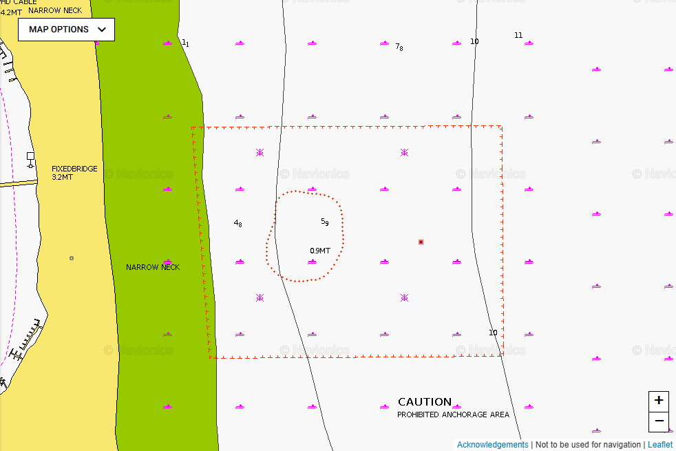

- **file**: `07_scale/shapes/narrowneck-gold-coast/src/navionics/naut_z17_shade00.0.png`
- **kind**: chart_screenshot
- **shows**: Wider view (about 1 km) of the Nautical chart around the reef: depth contours from the beach to 10 m and beyond and the restricted-area polygon around the arms.
- **structure visible**: True
- **state shown**: renewed (chart data of unknown date)
- **image date**: chart state of 2026-10-06
- **citation**: Garmin Navionics (2026). Garmin Marine map (successor of the Navionics ChartViewer), Nautical Charts layer, Meters, zoom 17. https://maps.garmin.com/en-US/marine. Accessed 2026-10-06 (captured with our own headless Chrome; 'Not to be used for navigation').
- **image URL**: https://maps.garmin.com/en-US/marine
- **source page**: Garmin Marine map
- **page / figure**: zoom 17, shading 0
- **credit**: Garmin Navionics (c) - chart data copyright Garmin; crowd-sourced SonarChart soundings
- **licence**: Garmin terms of use; not stated per image; private research copy only, NOT FOR NAVIGATION
- **retrieved**: 2026-10-06
- **used for**: 3d_seabed, context
- **How used for the model**: Seabed context for the 3D stage (offshore profile); not measured further. METHOD.md Step 5.
- **3D check pending**: no - none (context view; the zoom-18 series carries the readings)
- **linked records**: 07_scale/shapes/narrowneck-gold-coast/sources.md s12
- **size**: 28146 bytes, 982x655 px
- **sha256**: f62342f235a6b0b48bf6074bc4c4d568199f9c9e46e6032af92b63fe406ecdbd
- **rights**: Private research copy; reuse rights to be checked before any public release.
- **display in HTML**: True
- **added by**: narrowneck-gold-coast plan-shape trace (resume), 2026-10-06
