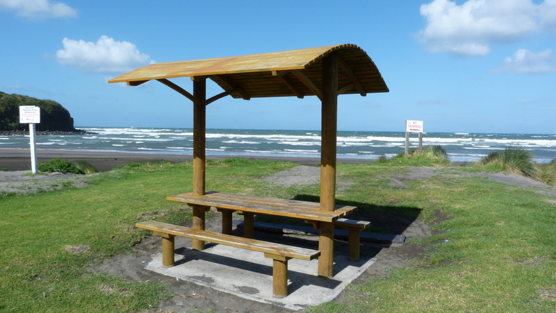
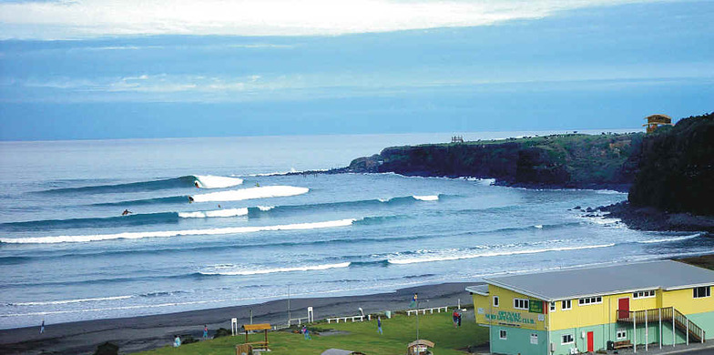
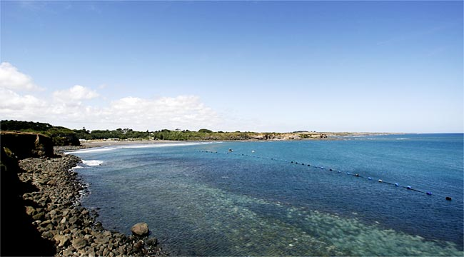
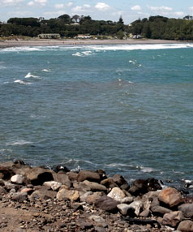
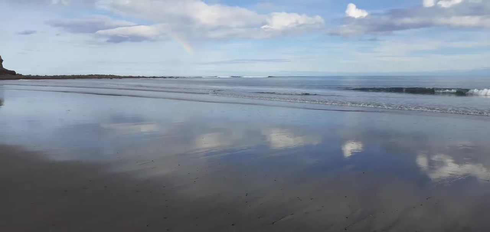
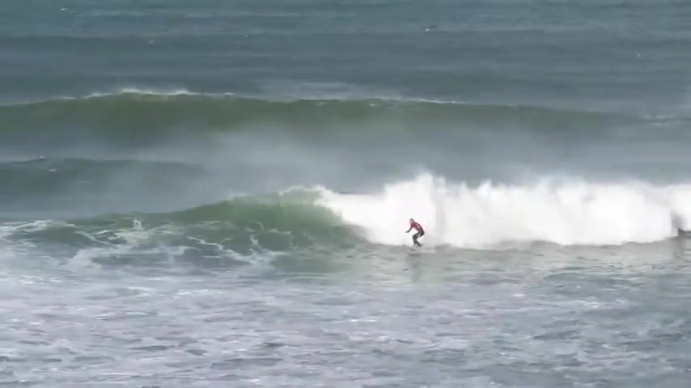
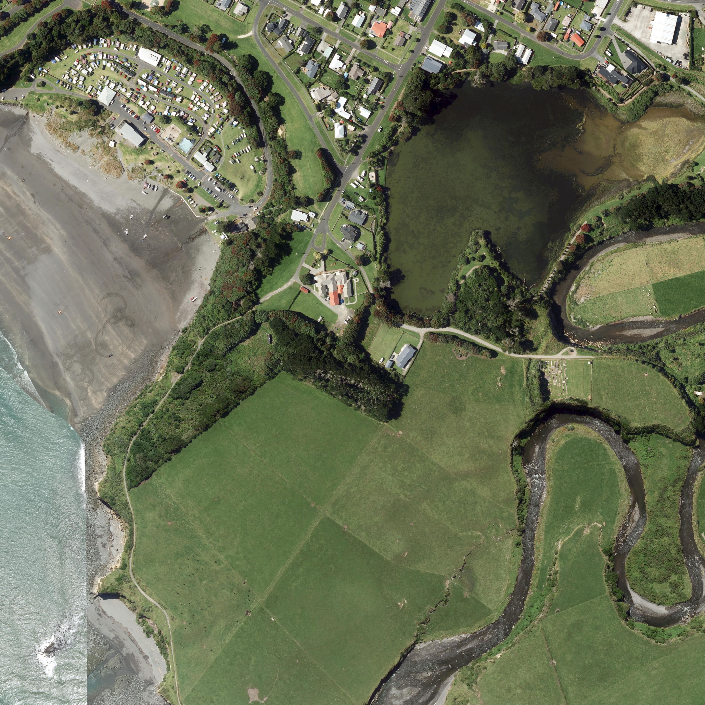
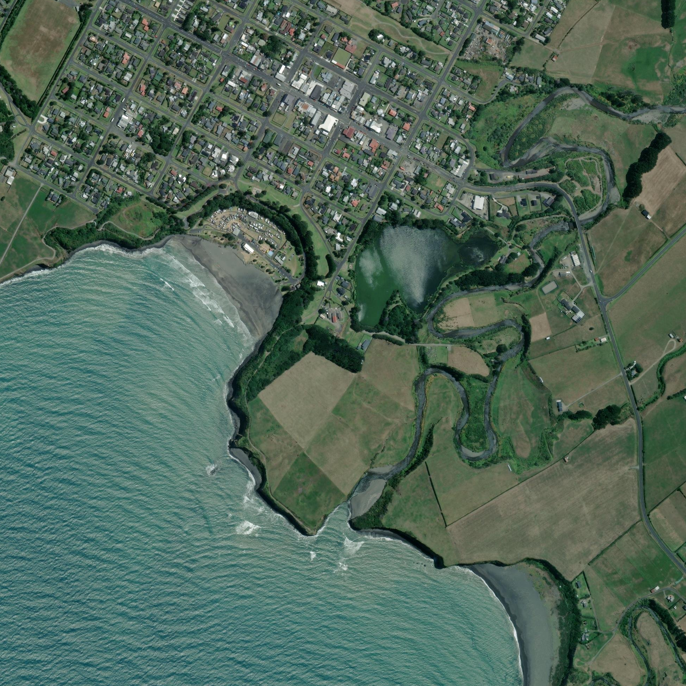

# Image registry - opunake-reef

Source of truth: `images.json` in this folder (convention: `_agent_briefs/image_registry.md`; overview: `03_images/reefs/README.md`). This file is generated from it.

10 images registered, 10 with a file, 0 used for the model (any use other than context/not_used).

## opunake-reef-img-01 - Opunake Beach: picnic shelter on the grassed foreshore (Gonzalobaeza, 2012)

- **file**: `03_images/reefs/opunake-reef/opunake-reef_picnic-shelter-foreshore_2012-02.jpg`
- **kind**: photo
- **shows**: A timber picnic shelter and table on the grassed foreshore with the beach and surf line behind; general site view, the submerged reef is not visible.
- **structure visible**: False
- **state shown**: not applicable (site context)
- **image date**: 2012-02-24
- **citation**: Gonzalobaeza (2012-02-24). Opunake Beach [photo]. Wikimedia Commons, File:Opunake_Beach.JPG. https://commons.wikimedia.org/wiki/File:Opunake_Beach.JPG. Accessed 2026-10-06.
- **image URL**: https://upload.wikimedia.org/wikipedia/commons/8/86/Opunake_Beach.JPG
- **source page**: https://commons.wikimedia.org/wiki/File:Opunake_Beach.JPG
- **page / figure**: whole photo (800 x 451 px)
- **credit**: Gonzalobaeza (own work), via Wikimedia Commons
- **licence**: CC BY-SA 3.0 (https://creativecommons.org/licenses/by-sa/3.0) - attribution required, share-alike
- **retrieved**: 2026-10-06
- **used for**: context
- **How used for the model**: Page illustration (site context only). Nothing measured.
- **3D check pending**: no - none: image already used as a model source or is context only
- **linked records**: 02_research/reefs/opunake-reef.json images[0]; 05_qa/reef/opunake-reef_media_recheck.json images[0] (that recheck could not view the file correctly - viewer artifact; re-viewed 2026-10-06: a normal picnic-shelter photo)
- **size**: 0.16 MB, 800x451 px
- **sha256**: f3c93ddbd22da50914f9635eeead0538af57bc2bac22c2fb523818009d7a5fa3
- **rights**: Private research copy; reuse rights to be checked before any public release.
- **display in HTML**: True
- **added by**: image-registry backfill, 2026-10-06

## opunake-reef-img-02 - Surfers riding a line of waves at Opunake with the surf club building and headland (RWR 'Artist Rendition')

- **file**: `03_images/reefs/opunake-reef/opunake-reef_rwr-artist-rendition_unknown-date.jpg`
- **kind**: photo
- **shows**: Photograph (despite the 'Artist Rendition' file name) of several lines of waves peeling along the beach with surfers, the yellow Opunake Surf Life Saving Club building and the headland.
- **structure visible**: False
- **state shown**: not applicable (site/surf context; reef not visible)
- **image date**: unknown (before 2019)
- **citation**: Raised Water Research (2019). Opunake [spot profile page]; image 'Opunake Artist Rendition'. https://raisedwaterresearch.com/spot/artificial-reef/new-zealand/north-island/opunake/. Image file https://raisedwaterresearch.com/wp-content/uploads/2019/11/Opunake-Artist-Rendition.jpg. Accessed 2026-10-06.
- **image URL**: https://raisedwaterresearch.com/wp-content/uploads/2019/11/Opunake-Artist-Rendition.jpg
- **source page**: https://raisedwaterresearch.com/spot/artificial-reef/new-zealand/north-island/opunake/
- **page / figure**: page gallery image 'Opunake-Artist-Rendition.jpg'
- **credit**: Raised Water Research (collectively credited to National Geographic / Stuff.co.nz / Bournemouth Echo; photographer not named)
- **licence**: not stated on the page; the page credits its Opunake images collectively to National Geographic / Stuff.co.nz / Bournemouth Echo - link/research copy only, NOT cleared
- **retrieved**: 2026-10-06
- **used for**: context
- **How used for the model**: Page illustration (site context). The 2026-09-25 media recheck classed it 'unrelated_or_wrong_site' (it described excavators at a revetment), but that recheck noted its viewer showed unreliable content; re-viewed 2026-10-06: an Opunake photo as the card described, reef not visible. Nothing measured.
- **3D check pending**: no - none: site context
- **linked records**: 02_research/reefs/opunake-reef.json images_rejected; 05_qa/reef/opunake-reef_media_recheck.json
- **size**: 0.10 MB, 784x390 px
- **sha256**: 19248ce8f68db60600bb689a84244cbc8d77819ae8d8e47aa29d585e265b689b
- **rights**: Private research copy; reuse rights to be checked before any public release.
- **display in HTML**: True
- **added by**: image-registry backfill, 2026-10-06
- **notes**: Card rejected it on 2026-09-25 (recheck 'unrelated_or_wrong_site'); contradicted by the 2026-10-06 re-view, so display is left true - Lior/QA to confirm.

## opunake-reef-img-03 - Rocky Opunake foreshore with a line of marker buoys strung into the water (RWR 'Location')

- **file**: `03_images/reefs/opunake-reef/opunake-reef_rwr-location_unknown-date.jpg`
- **kind**: photo
- **shows**: Rocky foreshore looking along the cove with clear shallow water and a line of marker buoys/floats running into the bay toward the reef area.
- **structure visible**: False
- **state shown**: not applicable (site/surf context; reef not visible)
- **image date**: unknown (before 2019)
- **citation**: Raised Water Research (2019). Opunake [spot profile page]; image 'Opunake Location'. https://raisedwaterresearch.com/spot/artificial-reef/new-zealand/north-island/opunake/. Image file https://raisedwaterresearch.com/wp-content/uploads/2019/11/Opunake-Location.jpg. Accessed 2026-10-06.
- **image URL**: https://raisedwaterresearch.com/wp-content/uploads/2019/11/Opunake-Location.jpg
- **source page**: https://raisedwaterresearch.com/spot/artificial-reef/new-zealand/north-island/opunake/
- **page / figure**: page gallery image 'Opunake-Location.jpg'
- **credit**: Raised Water Research (collectively credited to National Geographic / Stuff.co.nz / Bournemouth Echo; photographer not named)
- **licence**: not stated on the page; the page credits its Opunake images collectively to National Geographic / Stuff.co.nz / Bournemouth Echo - link/research copy only, NOT cleared
- **retrieved**: 2026-10-06
- **used for**: context
- **How used for the model**: Page illustration (site context). The 2026-09-25 media recheck classed it 'unrelated_or_wrong_site' (it described excavators at a revetment), but that recheck noted its viewer showed unreliable content; re-viewed 2026-10-06: an Opunake photo as the card described, reef not visible. Nothing measured.
- **3D check pending**: no - none: site context
- **linked records**: 02_research/reefs/opunake-reef.json images_rejected; 05_qa/reef/opunake-reef_media_recheck.json
- **size**: 0.04 MB, 650x360 px
- **sha256**: b33ac168a6607946a037385a25e0b8a5cb45cf08fc672ea259dac07a21d8cc96
- **rights**: Private research copy; reuse rights to be checked before any public release.
- **display in HTML**: True
- **added by**: image-registry backfill, 2026-10-06
- **notes**: Card rejected it on 2026-09-25 (recheck 'unrelated_or_wrong_site'); contradicted by the 2026-10-06 re-view, so display is left true - Lior/QA to confirm.

## opunake-reef-img-04 - View across Opunake bay from the rocky shoreline toward the surf break (RWR 'Reef Flat')

- **file**: `03_images/reefs/opunake-reef/opunake-reef_rwr-reef-flat_unknown-date.jpg`
- **kind**: photo
- **shows**: Small image over boulders in the foreground to the bay and breaking waves with the township behind; the submerged reef is not distinguishable.
- **structure visible**: False
- **state shown**: not applicable (site/surf context; reef not visible)
- **image date**: unknown (before 2019)
- **citation**: Raised Water Research (2019). Opunake [spot profile page]; image 'Opunake Reef Flat'. https://raisedwaterresearch.com/spot/artificial-reef/new-zealand/north-island/opunake/. Image file https://raisedwaterresearch.com/wp-content/uploads/2019/11/Opunake-Reef-Flat.jpg. Accessed 2026-10-06.
- **image URL**: https://raisedwaterresearch.com/wp-content/uploads/2019/11/Opunake-Reef-Flat.jpg
- **source page**: https://raisedwaterresearch.com/spot/artificial-reef/new-zealand/north-island/opunake/
- **page / figure**: page gallery image 'Opunake-Reef-Flat.jpg'
- **credit**: Raised Water Research (collectively credited to National Geographic / Stuff.co.nz / Bournemouth Echo; photographer not named)
- **licence**: not stated on the page; the page credits its Opunake images collectively to National Geographic / Stuff.co.nz / Bournemouth Echo - link/research copy only, NOT cleared
- **retrieved**: 2026-10-06
- **used for**: context
- **How used for the model**: Page illustration (site context). The 2026-09-25 media recheck classed it 'unrelated_or_wrong_site' (it described excavators at a revetment), but that recheck noted its viewer showed unreliable content; re-viewed 2026-10-06: an Opunake photo as the card described, reef not visible. Nothing measured.
- **3D check pending**: no - none: site context
- **linked records**: 02_research/reefs/opunake-reef.json images_rejected; 05_qa/reef/opunake-reef_media_recheck.json
- **size**: 0.03 MB, 238x286 px
- **sha256**: 91817f37709e9d10266e460495a7b857d57ed490bca0ca6652ca56682083ce73
- **rights**: Private research copy; reuse rights to be checked before any public release.
- **display in HTML**: True
- **added by**: image-registry backfill, 2026-10-06
- **notes**: Card rejected it on 2026-09-25 (recheck 'unrelated_or_wrong_site'); contradicted by the 2026-10-06 re-view, so display is left true - Lior/QA to confirm.

## opunake-reef-img-05 - Video frame: wet-sand foreshore at low tide with a rainbow and whitewater far offshore (David McCallum)

- **file**: `03_images/video_frames/opunake-reef/-xWlsZlffZY_0005.jpg`
- **kind**: video_frame
- **shows**: Wet-sand foreshore at low tide, a faint rainbow and small lines of whitewater breaking well offshore; no reef structure or marker visible.
- **structure visible**: False
- **state shown**: not applicable (site context)
- **image date**: 2020-07-20 (upload date)
- **citation**: David McCallum (2020-07-20). "Every Breaking Wave at OPUNAKE beach." [video]. YouTube, frame at 00:05. https://www.youtube.com/watch?v=-xWlsZlffZY. Accessed 2026-09-25.
- **image URL**: https://www.youtube.com/watch?v=-xWlsZlffZY
- **source page**: https://www.youtube.com/watch?v=-xWlsZlffZY
- **page / figure**: frame at 00:05 (video length 87 s)
- **credit**: David McCallum (YouTube channel)
- **licence**: YouTube standard licence (not an open licence); single frame kept as a private research copy
- **retrieved**: 2026-09-24
- **used for**: context
- **How used for the model**: Page illustration (site context); not used for the model.
- **3D check pending**: no - none: image already used as a model source or is context only
- **linked records**: 02_research/videos/opunake-reef/videos.json; 05_qa/reef/opunake-reef_media_recheck.json frames[0]
- **size**: 0.05 MB, 1280x606 px
- **sha256**: 95c55464f15df9dfda2d59755d3f109cf7193fdb8af2105eab8e4a6c3247cf4e
- **rights**: Private research copy; reuse rights to be checked before any public release.
- **display in HTML**: True
- **added by**: image-registry backfill, 2026-10-06
- **notes**: The page build removed this frame from the reef view (04_build/QA/removed_assets/opunake-reef) as site-context only; the registry keeps it as site context - Lior/QA to confirm display.

## opunake-reef-img-06 - Video frame: surfer dropping into a breaking wave, Opunake Classic 2015 (Opunake Surf)

- **file**: `03_images/video_frames/opunake-reef/cfiQvzgdGn0_0016.jpg`
- **kind**: video_frame
- **shows**: A surfer in a red top drops into a clean, well-formed breaking wave; a natural beach-break wave shape, no reef signature identified.
- **structure visible**: False
- **state shown**: not applicable (surf at the site; reef effect not shown)
- **image date**: 2015-03-08 (upload date; contest 2015)
- **citation**: Opunake Surf (2015-03-08). "Opunake Classic 2015" [video]. YouTube, frame at 00:16. https://www.youtube.com/watch?v=cfiQvzgdGn0. Accessed 2026-09-25.
- **image URL**: https://www.youtube.com/watch?v=cfiQvzgdGn0
- **source page**: https://www.youtube.com/watch?v=cfiQvzgdGn0
- **page / figure**: frame at 00:16 (video length 178 s)
- **credit**: Opunake Surf (YouTube channel)
- **licence**: YouTube standard licence (not an open licence); single frame kept as a private research copy
- **retrieved**: 2026-09-24
- **used for**: context
- **How used for the model**: Page illustration (surf at the site); not used for the model.
- **3D check pending**: no - none: image already used as a model source or is context only
- **linked records**: 02_research/videos/opunake-reef/videos.json; 05_qa/reef/opunake-reef_media_recheck.json frames[1]
- **size**: 0.03 MB, 854x480 px
- **sha256**: 38e72d22159678b29901f5d03eb7d71a7b0c336440b2c7373fb42c32d498dbfa
- **rights**: Private research copy; reuse rights to be checked before any public release.
- **display in HTML**: True
- **added by**: image-registry backfill, 2026-10-06
- **notes**: The page build removed this frame (04_build/QA/removed_assets/opunake-reef); registry keeps it as site context - Lior/QA to confirm display.

## opunake-reef-img-07 - Esri World Imagery, Opunake, centre -39.46, 173.86, z19, r=400 m, 3470 x 3470 px, 0.2305 m/px

- **file**: `07_scale/shapes/opunake-reef/src/opunake_sat_current.png`
- **kind**: satellite
- **shows**: Opunake beach, township, river and lagoon; the submerged reef lies offshore and is not visible in this imagery; the frame centre falls on farmland behind the beach, not on the water.
- **structure visible**: False
- **state shown**: as-built (offshore, submerged; not resolvable in imagery)
- **image date**: 2025-01-16
- **citation**: Esri, Maxar, Earthstar Geographics, and the GIS User Community (2025). World Imagery (current layer), image captured 2025-01-16. Esri World Imagery tile service, https://server.arcgisonline.com/ArcGIS/rest/services/World_Imagery/MapServer. Accessed 2026-10-04.
- **image URL**: https://server.arcgisonline.com/ArcGIS/rest/services/World_Imagery/MapServer/tile/{z}/{y}/{x}
- **source page**: Esri World Imagery (identify DATE field)
- **page / figure**: z19, r=400 m, 3470 x 3470 px, 0.2305 m/px; centre -39.46, 173.86; georeference sidecar opunake_sat_current.png.geo.json
- **credit**: Esri, Maxar, Earthstar Geographics, and the GIS User Community
- **licence**: Esri/Maxar imagery terms (not an open licence); private research copy only
- **retrieved**: 2026-10-04
- **used for**: context
- **How used for the model**: Fetched 2026-10-04 for the shape trace; the trace was not completed (no sources.md / shape.json for Opunake), so nothing was traced or measured from it. Original is 16.1 MB: a <=3000 px JPEG copy is registered as other_resolutions.
- **3D check pending**: no - none: no shape/3D model for Opunake yet; reef not visible in the frame
- **other resolutions**: `03_images/reefs/opunake-reef/opunake-reef_esri-sat_current_3000px.jpg`
- **linked records**: 07_scale/shapes/opunake-reef/src/opunake_sat_current.png.geo.json
- **size**: 16.12 MB, 3470x3470 px
- **sha256**: 2d033a2a542447d8c66a2d7526eb32599a7c32fe39a8dd665018b00c966fd22a
- **rights**: Private research copy; reuse rights to be checked before any public release.
- **display in HTML**: True
- **added by**: image-registry backfill, 2026-10-06

## opunake-reef-img-08 - Esri World Imagery, Opunake, centre -39.4595, 173.8565, z19, r=500 m, 4338 x 4338 px, 0.2305 m/px

- **file**: `07_scale/shapes/opunake-reef/src/opunake_sat_mid.png`
- **kind**: satellite
- **shows**: Opunake beach, township, river and lagoon; the submerged reef lies offshore and is not visible in this imagery.
- **structure visible**: False
- **state shown**: as-built (offshore, submerged; not resolvable in imagery)
- **image date**: 2025-01-16
- **citation**: Esri, Maxar, Earthstar Geographics, and the GIS User Community (2025). World Imagery (current layer), image captured 2025-01-16. Esri World Imagery tile service, https://server.arcgisonline.com/ArcGIS/rest/services/World_Imagery/MapServer. Accessed 2026-10-04.
- **image URL**: https://server.arcgisonline.com/ArcGIS/rest/services/World_Imagery/MapServer/tile/{z}/{y}/{x}
- **source page**: Esri World Imagery (identify DATE field)
- **page / figure**: z19, r=500 m, 4338 x 4338 px, 0.2305 m/px; centre -39.4595, 173.8565; georeference sidecar opunake_sat_mid.png.geo.json
- **credit**: Esri, Maxar, Earthstar Geographics, and the GIS User Community
- **licence**: Esri/Maxar imagery terms (not an open licence); private research copy only
- **retrieved**: 2026-10-04
- **used for**: context
- **How used for the model**: Fetched 2026-10-04 for the shape trace; the trace was not completed (no sources.md / shape.json for Opunake), so nothing was traced or measured from it. Original is 26.8 MB: a <=3000 px JPEG copy is registered as other_resolutions.
- **3D check pending**: no - none: no shape/3D model for Opunake yet; reef not visible in the frame
- **annotated / overlay files**: `07_scale/shapes/opunake-reef/overlays/mid_zoom_nw.png`
- **other resolutions**: `03_images/reefs/opunake-reef/opunake-reef_esri-sat_mid_3000px.jpg`
- **linked records**: 07_scale/shapes/opunake-reef/src/opunake_sat_mid.png.geo.json
- **size**: 26.79 MB, 4338x4338 px
- **sha256**: 8c4cda23f6a82c17aa0cc646a8335258963be81a3434c4b40be51b4b4d78d73e
- **rights**: Private research copy; reuse rights to be checked before any public release.
- **display in HTML**: True
- **added by**: image-registry backfill, 2026-10-06

## opunake-reef-img-09 - Esri World Imagery, Opunake, centre -39.46, 173.86, z17, r=900 m, 1953 x 1952 px, 0.922 m/px

- **file**: `07_scale/shapes/opunake-reef/src/opunake_sat_wide.png`
- **kind**: satellite
- **shows**: Opunake beach, township, river and lagoon; the submerged reef lies offshore and is not visible in this imagery; the frame centre falls on farmland behind the beach, not on the water.
- **structure visible**: False
- **state shown**: as-built (offshore, submerged; not resolvable in imagery)
- **image date**: 2025-01-16
- **citation**: Esri, Maxar, Earthstar Geographics, and the GIS User Community (2025). World Imagery (current layer), image captured 2025-01-16. Esri World Imagery tile service, https://server.arcgisonline.com/ArcGIS/rest/services/World_Imagery/MapServer. Accessed 2026-10-04.
- **image URL**: https://server.arcgisonline.com/ArcGIS/rest/services/World_Imagery/MapServer/tile/{z}/{y}/{x}
- **source page**: Esri World Imagery (identify DATE field)
- **page / figure**: z17, r=900 m, 1953 x 1952 px, 0.922 m/px; centre -39.46, 173.86; georeference sidecar opunake_sat_wide.png.geo.json
- **credit**: Esri, Maxar, Earthstar Geographics, and the GIS User Community
- **licence**: Esri/Maxar imagery terms (not an open licence); private research copy only
- **retrieved**: 2026-10-04
- **used for**: context
- **How used for the model**: Fetched 2026-10-04 for the shape trace; the trace was not completed (no sources.md / shape.json for Opunake), so nothing was traced or measured from it. 
- **3D check pending**: no - none: no shape/3D model for Opunake yet; reef not visible in the frame
- **annotated / overlay files**: `07_scale/shapes/opunake-reef/overlays/wide_zoom_beach.png`; `07_scale/shapes/opunake-reef/overlays/wide_zoom_pier.png`
- **linked records**: 07_scale/shapes/opunake-reef/src/opunake_sat_wide.png.geo.json
- **size**: 6.05 MB, 1953x1952 px
- **sha256**: 75e2b7fe917b7439cc043c36984312dab7897dba25dcfd3ef775ea2a9d53c42d
- **rights**: Private research copy; reuse rights to be checked before any public release.
- **display in HTML**: True
- **added by**: image-registry backfill, 2026-10-06

## opunake-reef-img-10 - Esri World Imagery, Opunake, centre -39.4577, 173.8545, z20, r=250 m, 4338 x 4338 px, 0.1153 m/px

- **file**: `07_scale/shapes/opunake-reef/src/opunake_sat_z20.png`
- **kind**: satellite
- **shows**: Opunake beach, township, river and lagoon; the submerged reef lies offshore and is not visible in this imagery.
- **structure visible**: False
- **state shown**: as-built (offshore, submerged; not resolvable in imagery)
- **image date**: 2025-01-16
- **citation**: Esri, Maxar, Earthstar Geographics, and the GIS User Community (2025). World Imagery (current layer), image captured 2025-01-16. Esri World Imagery tile service, https://server.arcgisonline.com/ArcGIS/rest/services/World_Imagery/MapServer. Accessed 2026-10-04.
- **image URL**: https://server.arcgisonline.com/ArcGIS/rest/services/World_Imagery/MapServer/tile/{z}/{y}/{x}
- **source page**: Esri World Imagery (identify DATE field)
- **page / figure**: z20, r=250 m, 4338 x 4338 px, 0.1153 m/px; centre -39.4577, 173.8545; georeference sidecar opunake_sat_z20.png.geo.json
- **credit**: Esri, Maxar, Earthstar Geographics, and the GIS User Community
- **licence**: Esri/Maxar imagery terms (not an open licence); private research copy only
- **retrieved**: 2026-10-04
- **used for**: context
- **How used for the model**: Fetched 2026-10-04 for the shape trace; the trace was not completed (no sources.md / shape.json for Opunake), so nothing was traced or measured from it. Original is 23.5 MB: a <=3000 px JPEG copy is registered as other_resolutions.
- **3D check pending**: no - none: no shape/3D model for Opunake yet; reef not visible in the frame
- **other resolutions**: `03_images/reefs/opunake-reef/opunake-reef_esri-sat_z20_3000px.jpg`
- **linked records**: 07_scale/shapes/opunake-reef/src/opunake_sat_z20.png.geo.json
- **size**: 23.48 MB, 4338x4338 px
- **sha256**: ce5de7684deb95ebc1fcf9ed2eaa9b92febe8d633942feeab49016cfb3953ffc
- **rights**: Private research copy; reuse rights to be checked before any public release.
- **display in HTML**: True
- **added by**: image-registry backfill, 2026-10-06
