# Image registry - prattes-reef-el-segundo

Source of truth: `images.json` in this folder (convention: `_agent_briefs/image_registry.md`; overview: `03_images/reefs/README.md`). This file is generated from it.

32 images registered, 32 with a file, 21 used for the model (any use other than context/not_used).

## prattes-reef-el-segundo-img-01 - Diving-Prattes-Reef.jpg: underwater view of a sand-filled geotextile bag on the seabed (RWR)

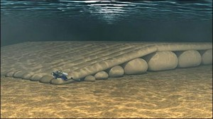

- **file**: `03_images/reefs/prattes-reef-el-segundo/prattes-reef-el-segundo_diving-bag-on-seabed_unknown-date.jpg`
- **kind**: photo
- **shows**: Underwater photo of a long ribbed/segmented sand-filled bag lying on a sandy seabed, sunlight from above, a diver's fin at the bottom left.
- **structure visible**: True
- **state shown**: as-built / in service (date unknown)
- **image date**: unknown (2000-2008, while the reef existed)
- **citation**: Raised Water Research (2019). Pratte's Reef [spot profile page]; image 'Diving Pratte's Reef'. https://raisedwaterresearch.com/spot/artificial-reef/us/california/prattes-reef/. Image file https://raisedwaterresearch.com/wp-content/uploads/2019/07/Diving-Prattes-Reef.jpg. Accessed 2026-10-06.
- **image URL**: https://raisedwaterresearch.com/wp-content/uploads/2019/07/Diving-Prattes-Reef.jpg
- **source page**: https://raisedwaterresearch.com/spot/artificial-reef/us/california/prattes-reef/
- **page / figure**: page gallery, 300 x 168 px
- **credit**: Raised Water Research (photographer not stated)
- **licence**: unknown / all rights reserved (no licence on the page); link/research copy only - NOT cleared
- **retrieved**: 2026-10-06
- **used for**: context
- **How used for the model**: Page illustration of a single bag. No dimension read (no scale).
- **3D check pending**: no - none: close-up of one bag, no scale
- **linked records**: 02_research/reefs/prattes-reef-el-segundo.json images[1]; 05_qa/reef/prattes-reef-el-segundo_media_recheck.json images[1]
- **size**: 0.02 MB, 300x168 px
- **sha256**: 5e2c51fa409df53ec715369e28096074668154f3cf0d63a2918ea06fa64ebf88
- **rights**: Private research copy; reuse rights to be checked before any public release.
- **display in HTML**: True
- **added by**: image-registry backfill, 2026-10-06

## prattes-reef-el-segundo-img-02 - Prattes-Removal.jpg: removal-day beach scene, workboat offshore, bulldozer on the sand (RWR)

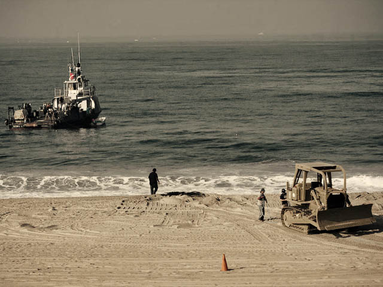

- **file**: `03_images/reefs/prattes-reef-el-segundo/prattes-reef-el-segundo_removal-beach-scene_2008-10.jpg`
- **kind**: photo
- **shows**: Sepia beach photo: a workboat/tug offshore, a bulldozer and two workers on the sand and a traffic cone; no bag or reef structure is visible.
- **structure visible**: False
- **state shown**: removal (Phase I, fall 2008)
- **image date**: 2008-10-10 (EXIF capture date per the card; inside the Phase I removal window)
- **citation**: Raised Water Research (2019). Pratte's Reef [spot profile page]; image 'Pratte's Removal'. https://raisedwaterresearch.com/spot/artificial-reef/us/california/prattes-reef/. Image file https://raisedwaterresearch.com/wp-content/uploads/2019/07/Prattes-Removal.jpg. Accessed 2026-10-06.
- **image URL**: https://raisedwaterresearch.com/wp-content/uploads/2019/07/Prattes-Removal.jpg
- **source page**: https://raisedwaterresearch.com/spot/artificial-reef/us/california/prattes-reef/
- **page / figure**: page gallery, 640 x 480 px
- **credit**: Raised Water Research (photographer not stated)
- **licence**: unknown / all rights reserved (no licence on the page); link/research copy only - NOT cleared
- **retrieved**: 2026-10-06
- **used for**: context
- **How used for the model**: Page illustration of the removal logistics. Not used for any value.
- **3D check pending**: no - none: removal-day logistics
- **linked records**: 02_research/reefs/prattes-reef-el-segundo.json images[3]; 05_qa/reef/prattes-reef-el-segundo_media_recheck.json images[3]
- **size**: 0.09 MB, 640x480 px
- **sha256**: e2f468c1103d944884ec4b15f10afa3328fa5b6196aa244b840fc7cea58a077b
- **rights**: Private research copy; reuse rights to be checked before any public release.
- **display in HTML**: True
- **added by**: image-registry backfill, 2026-10-06

## prattes-reef-el-segundo-img-03 - Pulling Bag Ashore: a deteriorated sand bag hauled up the beach during the 2008 removal (Coastal Frontiers)

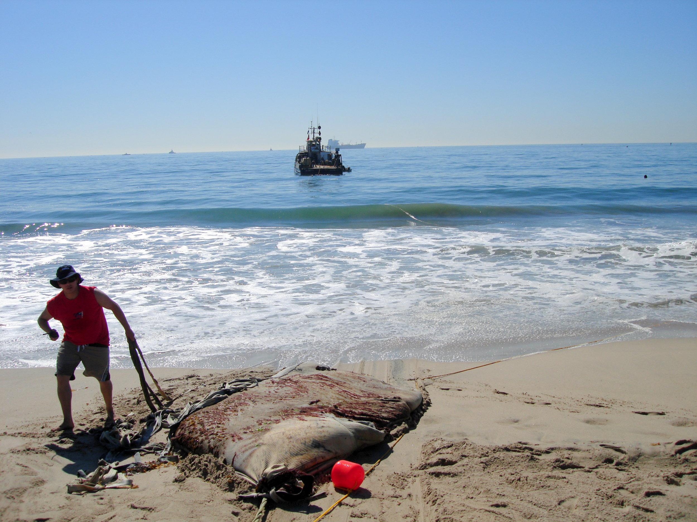

- **file**: `03_images/reefs/prattes-reef-el-segundo/prattes-reef-el-segundo_pulling-bag-ashore_2008.jpg`
- **kind**: photo
- **shows**: A worker in a red shirt pulls a flattened, stained fabric bag up the beach by ropes; tug/workboat offshore.
- **structure visible**: True
- **state shown**: removal (damaged, deteriorated bag, 2008)
- **image date**: 2008 (removal phase 1, fall 2008)
- **citation**: Coastal Frontiers Corporation (n.d.; photo 2008). Removal of Pratte's Reef [case-study page], photo captioned 'Pulling Bag Ashore'. https://www.coastalfrontiers.com/removal-of-prattes-reef. Image file https://images.squarespace-cdn.com/content/v1/5aa570aaf8370ab26ce4e06d/1551132211199-7XU6TJEQKRO74B6CZO38/Pulling+Bag+Ashore.JPG. Accessed 2026-10-06.
- **image URL**: https://images.squarespace-cdn.com/content/v1/5aa570aaf8370ab26ce4e06d/1551132211199-7XU6TJEQKRO74B6CZO38/Pulling+Bag+Ashore.JPG
- **source page**: https://www.coastalfrontiers.com/removal-of-prattes-reef
- **page / figure**: case-study page photo (2500 x 1875 px)
- **credit**: Coastal Frontiers Corporation
- **licence**: unknown / all rights reserved (no licence on the page); link/research copy only - NOT cleared
- **retrieved**: 2026-10-06
- **used for**: context
- **How used for the model**: Page illustration of the deteriorated bags at removal (supports the 'moved, sank, buried, falling apart' narrative). No dimension read.
- **3D check pending**: no - none: removal photo
- **linked records**: 02_research/reefs/prattes-reef-el-segundo.json images[4]; 05_qa/reef/prattes-reef-el-segundo_media_recheck.json images[4]
- **size**: 0.82 MB, 2500x1875 px
- **sha256**: dad27da18972b8256a3109b18a8af1a4ea486dd9011b61c6632607ad0ebc062d
- **rights**: Private research copy; reuse rights to be checked before any public release.
- **display in HTML**: True
- **added by**: image-registry backfill, 2026-10-06

## prattes-reef-el-segundo-img-04 - Skelly Engineering plan-view design drawing 'PRATTE'S REEF' (110 bags + 30 optional; wave direction, scale bar, -6' MSL call-outs)

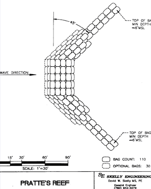

- **file**: `07_scale/shapes/prattes-reef-el-segundo/src/img1_skelly_diagram.png`
- **kind**: design_drawing
- **shows**: CAD plan of the V/chevron bag layout at 45 deg to 'WAVE DIRECTION', bag count 110, 30 optional (dashed) bags, scale bar 0-15-30-60-90 ft, engineer's stamp, 'TOP OF BAG MIN DEPTH -6' MSL' call-outs.
- **structure visible**: True
- **state shown**: design (Phase I layout; Phase II +90 bags not drawn)
- **image date**: undated (pre-construction, fall 2000)
- **citation**: Skelly Engineering (David W. Skelly, PE) (undated, pre-construction, 2000), via Raised Water Research (2019). Pratte's Reef [spot page], image 'Pratts-Reef-Diagram.png'. https://raisedwaterresearch.com/spot/artificial-reef/us/california/prattes-reef/. Image file https://raisedwaterresearch.com/wp-content/uploads/2019/07/Pratts-Reef-Diagram.png. Accessed 2026-10-05.
- **image URL**: https://raisedwaterresearch.com/wp-content/uploads/2019/07/Pratts-Reef-Diagram.png
- **source page**: https://raisedwaterresearch.com/spot/artificial-reef/us/california/prattes-reef/
- **page / figure**: single figure, 308 x 385 px
- **credit**: Skelly Engineering via Raised Water Research
- **licence**: unknown / all rights reserved (no licence on the page); link/research copy only - NOT cleared
- **retrieved**: 2026-10-05
- **used for**: plan_trace; scale; 3d_crest
- **How used for the model**: PRIMARY: solid-outline bags traced as the footprint (shape.json source img1; bar ticks fit to 0.5 px give the scale, bag grid 6.8-6.9 x 9.4-9.6 ft); the crest call-out -6 ft MSL = -1.829 m is crest state A in the 3D model (METHODS_3D, SOURCES_3D table A).
- **3D check pending**: no - none: image already used as a model source or is context only
- **annotated / overlay files**: `07_scale/shapes/prattes-reef-el-segundo/3d/annotated/A1_skelly_drawing_crest_labels_and_scale.png`; `07_scale/shapes/prattes-reef-el-segundo/overlays/img1_final.png`; `07_scale/shapes/prattes-reef-el-segundo/overlays/img1_correction_red_new_cyan_old.png`; `07_scale/shapes/prattes-reef-el-segundo/overlays/_pre_verification/img1_final.png`
- **linked records**: 07_scale/shapes/prattes-reef-el-segundo/sources.md img1; 07_scale/shapes/prattes-reef-el-segundo/shape.json sources[img1]; 07_scale/shapes/prattes-reef-el-segundo/3d/SOURCES_3D.md (crest states; annotated A1); 07_scale/shapes/prattes-reef-el-segundo/3d/model.js
- **size**: 0.03 MB, 308x385 px
- **sha256**: a4b2fac3e1cc2db8d497c02af7347492564f0604a26bc8e0c230d540cb5cbd45
- **rights**: Private research copy; reuse rights to be checked before any public release.
- **display in HTML**: True
- **added by**: image-registry backfill, 2026-10-06

## prattes-reef-el-segundo-img-05 - 'A Pratte's Reef bag' size-comparison diagram (3 m x 1.2 m beside a VW camper, a city bus and a Mount Reef bag)

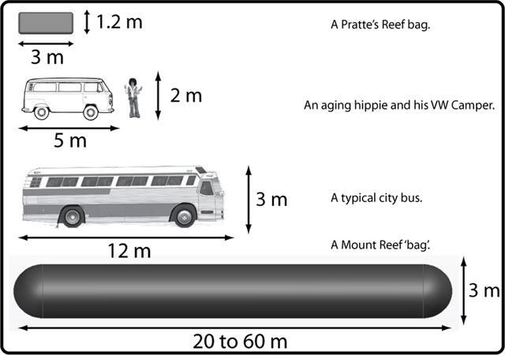

- **file**: `07_scale/shapes/prattes-reef-el-segundo/src/img2_bag_size.jpg`
- **kind**: diagram
- **shows**: Scale-comparison diagram: one Pratte's bag 3 m long x 1.2 m high drawn beside a VW camper, a city bus and a Mount Reef bag (20-60 m).
- **structure visible**: True
- **state shown**: design (bag size)
- **image date**: undated
- **citation**: Raised Water Research (2019). Pratte's Reef [spot profile page]; image 'Pratte's Reef Bag Size'. https://raisedwaterresearch.com/spot/artificial-reef/us/california/prattes-reef/. Image file https://raisedwaterresearch.com/wp-content/uploads/2019/07/Prattes-Reef-Bag-Size.jpg. Accessed 2026-10-05.
- **image URL**: https://raisedwaterresearch.com/wp-content/uploads/2019/07/Prattes-Reef-Bag-Size.jpg
- **source page**: https://raisedwaterresearch.com/spot/artificial-reef/us/california/prattes-reef/
- **page / figure**: single figure, 640 x 450 px (same graphic as ICCE-2010 Fig. 1)
- **credit**: Raised Water Research
- **licence**: unknown / all rights reserved (no licence on the page); link/research copy only - NOT cleared
- **retrieved**: 2026-10-05
- **used for**: cross_check; scale
- **How used for the model**: Cross-check of the bag dimension (printed 3 m x 1.2 m; 7.9 m3 max) against the drawing's bag grid (shape.json source img2; SOURCES_3D bag size).
- **3D check pending**: no - none: image already used as a model source or is context only
- **linked records**: 07_scale/shapes/prattes-reef-el-segundo/sources.md img2; 07_scale/shapes/prattes-reef-el-segundo/shape.json sources[img2]; 02_research/reefs/prattes-reef-el-segundo.json images[2]
- **size**: 0.03 MB, 640x450 px
- **sha256**: 3b966a52a6c356da7f8acde63872089124274495fc9a830da0326c24fb7f65cd
- **rights**: Private research copy; reuse rights to be checked before any public release.
- **display in HTML**: True
- **added by**: image-registry backfill, 2026-10-06

## prattes-reef-el-segundo-img-06 - Building-Prattes-Reef.jpg: crane on a barge hoisting a sand-filled bag, El Segundo stacks behind (RWR)

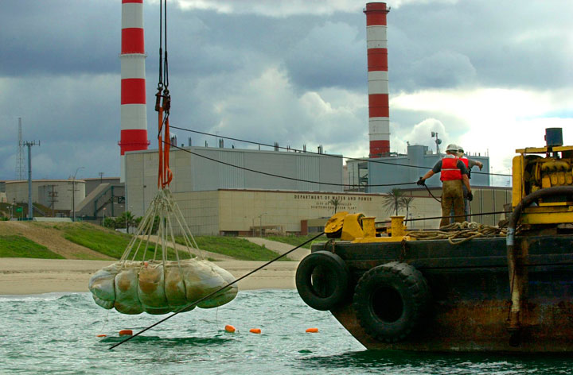

- **file**: `07_scale/shapes/prattes-reef-el-segundo/src/img3_building.jpg`
- **kind**: photo
- **shows**: Crane on a barge hoisting a large light-tan sand-filled geotextile bag mid-air out of the water; the El Segundo power-station stacks and DWP building onshore behind Dockweiler State Beach.
- **structure visible**: True
- **state shown**: under construction (fall 2000 / spring 2001)
- **image date**: fall 2000 / spring 2001 (construction)
- **citation**: Raised Water Research (2019). Pratte's Reef [spot profile page]; image 'Building Pratte's Reef'. https://raisedwaterresearch.com/spot/artificial-reef/us/california/prattes-reef/. Image file https://raisedwaterresearch.com/wp-content/uploads/2019/07/Building-Prattes-Reef.jpg. Accessed 2026-10-05.
- **image URL**: https://raisedwaterresearch.com/wp-content/uploads/2019/07/Building-Prattes-Reef.jpg
- **source page**: https://raisedwaterresearch.com/spot/artificial-reef/us/california/prattes-reef/
- **page / figure**: single figure, 720 x 472 px
- **credit**: Raised Water Research (photographer not stated)
- **licence**: unknown / all rights reserved (no licence on the page); link/research copy only - NOT cleared
- **retrieved**: 2026-10-05
- **used for**: context
- **How used for the model**: Context (oblique, no plan view; shape.json source img3). Recommended hero image in the 2026-09-25 recheck. The El Segundo stacks could give a position bearing but were not used.
- **3D check pending**: YES - Position: the El Segundo power-station stacks and the beach behind the barge fix a rough camera bearing; compare with the position hint 33.92058 N, -118.43335 (+-60 m) used for the 3D placement (values: position)
- **linked records**: 07_scale/shapes/prattes-reef-el-segundo/sources.md img3; 07_scale/shapes/prattes-reef-el-segundo/shape.json sources[img3]; 05_qa/reef/prattes-reef-el-segundo_media_recheck.json images[0]
- **size**: 0.08 MB, 720x472 px
- **sha256**: 50dbe4b9752e4f954d4cc31b0e463c0def495bdd178abf6499b3d9120fdc269a
- **rights**: Private research copy; reuse rights to be checked before any public release.
- **display in HTML**: True
- **added by**: image-registry backfill, 2026-10-06

## prattes-reef-el-segundo-img-07 - Esri World Imagery current, around the card coordinates (z18, 1614 x 1614 px)

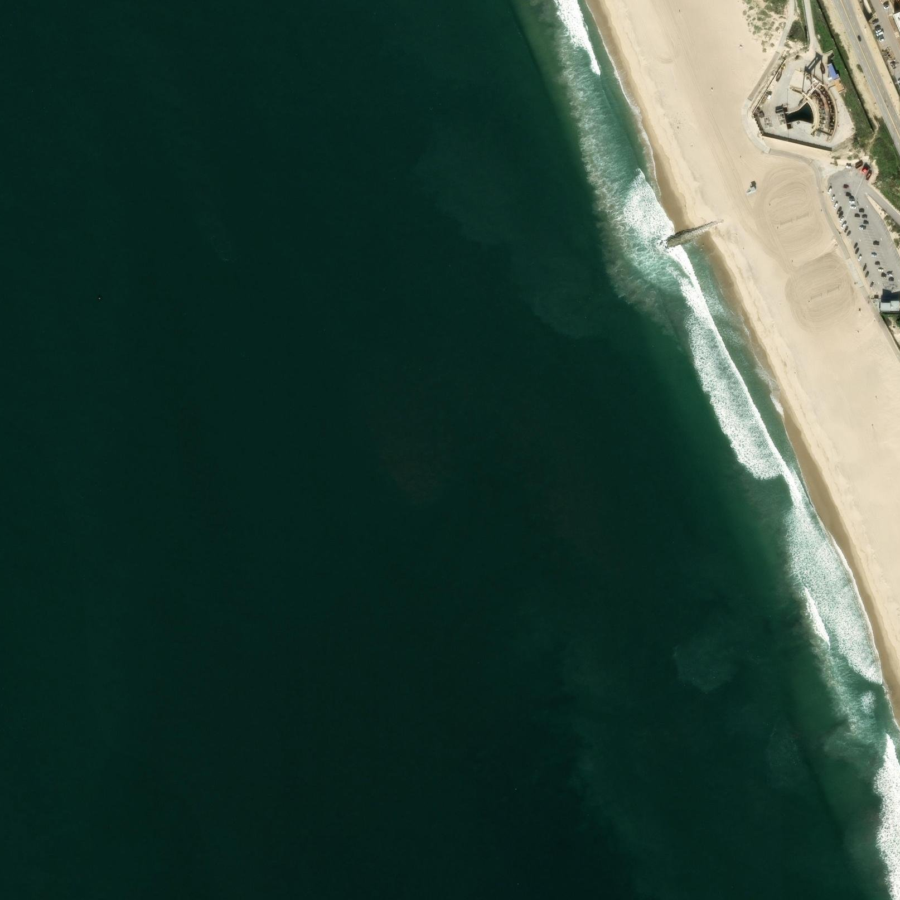

- **file**: `07_scale/shapes/prattes-reef-el-segundo/src/img4_satellite_current.png`
- **kind**: satellite
- **shows**: Dockweiler Beach and the offshore water around the card coordinates; no trace of the reef (removed 2008-2010).
- **structure visible**: False
- **state shown**: removed (2008-2010)
- **image date**: 2026-01-09 (Esri identify)
- **citation**: Esri, Maxar, Earthstar Geographics, and the GIS User Community (2026). World Imagery (current layer), image captured 2026-01-09. Esri World Imagery tile service, https://server.arcgisonline.com/ArcGIS/rest/services/World_Imagery/MapServer. Accessed 2026-10-04.
- **image URL**: https://server.arcgisonline.com/ArcGIS/rest/services/World_Imagery/MapServer/tile/{z}/{y}/{x}
- **source page**: Esri World Imagery (identify DATE field)
- **page / figure**: z18 fetch with satellite.py, + .geo.json
- **credit**: Esri, Maxar, Earthstar Geographics, and the GIS User Community
- **licence**: Esri/Maxar imagery terms (not an open licence); private research copy only
- **retrieved**: 2026-10-04
- **used for**: context
- **How used for the model**: Context: confirms nothing is visible at the card coordinates (shape.json source img4).
- **3D check pending**: no - none: image already used as a model source or is context only
- **linked records**: 07_scale/shapes/prattes-reef-el-segundo/sources.md img4; 07_scale/shapes/prattes-reef-el-segundo/shape.json sources[img4]
- **size**: 1.02 MB, 1614x1614 px
- **sha256**: 9a12d231de04b2598e4d811120fae7f74742c4782a6dc70c62ab89eaa870b618
- **rights**: Private research copy; reuse rights to be checked before any public release.
- **display in HTML**: True
- **added by**: image-registry backfill, 2026-10-06

## prattes-reef-el-segundo-img-08 - Henriquez (2005) Fig. 2.10 'Pratte's reef, California (Borrero & Nelson, 2003)': the Skelly V design redrawn (embedded raster)

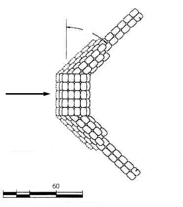

- **file**: `07_scale/shapes/prattes-reef-el-segundo/src/img5_henriquez_fig2-10_raster.png`
- **kind**: design_drawing
- **shows**: The same Skelly V design (110 bags) redrawn and cleaned at higher resolution, without labels.
- **structure visible**: True
- **state shown**: design (Phase I layout)
- **image date**: 2005 (thesis); original figure Borrero & Nelsen, April 2003
- **citation**: Henriquez, M. (2005). Artificial Surf Reefs. MSc thesis, Delft University of Technology, p.12 (PDF p.22), Fig. 2.10, sec. 2.5.3 (figure after Borrero & Nelsen 2003 / Skelly Engineering; embedded raster 371 x 420 px, no labels: the 'wave direction / 45 deg / ft scale' text is a separate overlay in the PDF). https://repository.tudelft.nl/record/uuid:75b15cd7-08a1-48e5-8fc9-337f184ae318. Accessed 2026-10-05.
- **image URL**: https://repository.tudelft.nl/file/File_79041f98-096e-4462-b710-f94cf8517494
- **source page**: https://repository.tudelft.nl/record/uuid:75b15cd7-08a1-48e5-8fc9-337f184ae318
- **page / figure**: thesis p.12 (PDF p.22), Fig. 2.10
- **credit**: Henriquez / TU Delft; figure after Borrero & Nelsen (2003) / Skelly Engineering
- **licence**: 'License info not available' on the repository record - treat as all rights reserved
- **retrieved**: 2026-10-05
- **used for**: cross_check; scale
- **How used for the model**: Second reproduction of the drawing used to check the outline and scale (two reproductions agree to ~1% in area; scale x 0.8763 vs 0.8783) (shape.json source img5; VERIFY.md).
- **3D check pending**: no - none: image already used as a model source or is context only
- **annotated / overlay files**: `07_scale/shapes/prattes-reef-el-segundo/overlays/img5_final.png`; `07_scale/shapes/prattes-reef-el-segundo/overlays/_pre_verification/img5_final.png`
- **linked records**: 07_scale/shapes/prattes-reef-el-segundo/sources.md img5; 07_scale/shapes/prattes-reef-el-segundo/shape.json sources[img5]
- **size**: 0.05 MB, 371x420 px
- **sha256**: 49c917c613c4405ab85d612031a422a699e9ba1fcb61f4d4dd8d3b026198fc59
- **rights**: Private research copy; reuse rights to be checked before any public release.
- **display in HTML**: True
- **added by**: image-registry backfill, 2026-10-06

## prattes-reef-el-segundo-img-09 - CCC staff report Exhibit 3 'REEF DESIGN PLAN VIEW': Skelly Engineering concept plan, July 1996 (~30 bags, V of two 150 ft arms)

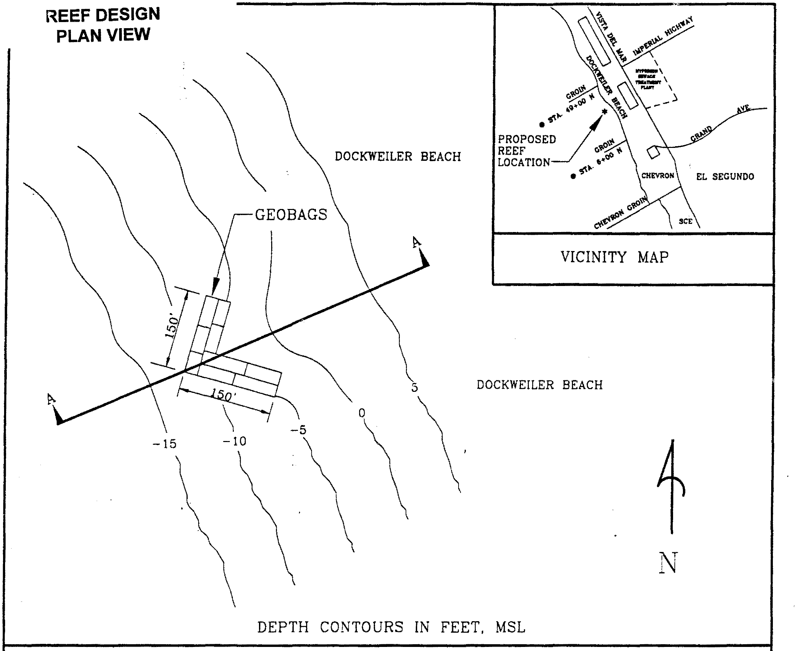

- **file**: `07_scale/shapes/prattes-reef-el-segundo/src/img6_ccc_exhibit3_concept_plan.png`
- **kind**: design_drawing
- **shows**: Plan view of the EARLIER 1996 concept (about 30 bags, a V of two 150 ft arms) with contours in ft MSL and a north arrow.
- **structure visible**: True
- **state shown**: design (1996 concept, not the built design)
- **image date**: drawing July 1996; report August 1998
- **citation**: California Coastal Commission (1998). Staff report W5a, CDP application E-98-15 (Surfrider Foundation - Pratte's Reef), hearing 13 Oct 1998, Exhibit 3 (PDF p.31 of 32), Skelly Engineering 'PRATTE'S REEF CONCEPTUAL PLAN AND GEOBAG CONFIGURATION', July 1996 (Fig. 3); cropped from the 2545 x 3288 native raster. Drawings by Skelly Engineering. https://documents.coastal.ca.gov/reports/1998/10/W5a-10-1998.pdf. Accessed 2026-10-05.
- **image URL**: https://documents.coastal.ca.gov/reports/1998/10/W5a-10-1998.pdf
- **source page**: https://documents.coastal.ca.gov/reports/1998/10/W5a-10-1998.pdf
- **page / figure**: Exhibit 3, PDF p.31
- **credit**: Skelly Engineering for Surfrider Foundation; California Coastal Commission public record
- **licence**: public agency record; reuse terms not stated - check before public release
- **retrieved**: 2026-10-05
- **used for**: cross_check; 3d_seabed
- **How used for the model**: Cross-check only: gives the north arrow / orientation and the arm length (shape.json source img6); the section A-A and five contour crossings are a qualitative seabed cross-check (annotated A3).
- **3D check pending**: no - none: image already used as a model source or is context only
- **annotated / overlay files**: `07_scale/shapes/prattes-reef-el-segundo/3d/annotated/A3_ccc_exhibit3_contours_section_AA.png`; `07_scale/shapes/prattes-reef-el-segundo/overlays/img6_final.png`; `07_scale/shapes/prattes-reef-el-segundo/overlays/_pre_verification/img6_final.png`
- **source PDF**: `07_scale/shapes/prattes-reef-el-segundo/3d/src/ccc_W5a-10-1998_staff_report.pdf`
- **linked records**: 07_scale/shapes/prattes-reef-el-segundo/sources.md img6; 07_scale/shapes/prattes-reef-el-segundo/shape.json sources[img6]; 07_scale/shapes/prattes-reef-el-segundo/3d/SOURCES_3D.md (annotated A3)
- **size**: 0.06 MB, 2354x1919 px
- **sha256**: 257baf0e13715368040aba35b17d21a34dd632fd026324b56cda355ee3964cc6
- **rights**: Private research copy; reuse rights to be checked before any public release.
- **display in HTML**: True
- **added by**: image-registry backfill, 2026-10-06

## prattes-reef-el-segundo-img-10 - Garmin Navionics viewer, Pratte's Reef site, current capture: Map Options panel

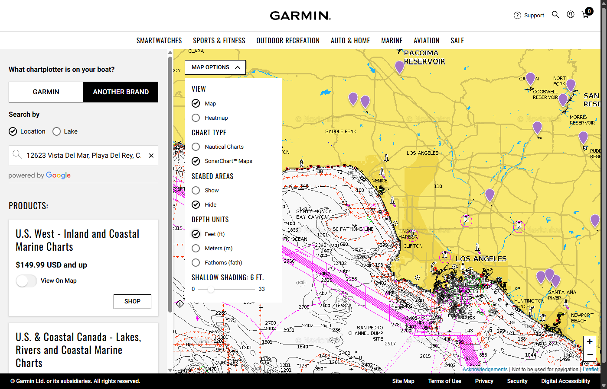

- **file**: `07_scale/shapes/prattes-reef-el-segundo/3d/src/navionics/app_options_sonarchart_feet.png`
- **kind**: chart_screenshot
- **shows**: Map Options panel: View = Map, Chart type SonarChart/Nautical, Seabed areas hidden, Depth units = Feet, shallow shading 6 ft.
- **structure visible**: False
- **state shown**: seabed only (reef removed 2008-2010; contours smooth at the site)
- **image date**: chart data dates not shown by the viewer; screenshot 2026-10-05
- **citation**: Garmin Ltd / Navionics (2026). Marine Maps viewer (Map Options panel), depths in feet, shallow shading 6 ft, centred on 33.92058 N, 118.43335 W (the Borrero & Nelsen Fig. 9 window centre; current position hint); page title 'Garmin | Marine Maps' ('Not to be used for navigation'). https://maps.garmin.com/en-US/marine/ (webapp.navionics.com redirects here). Screenshot taken 2026-10-05. Accessed 2026-10-05.
- **image URL**: https://maps.garmin.com/en-US/marine/
- **source page**: https://maps.garmin.com/en-US/marine/
- **page / figure**: Map Options panel; current capture
- **credit**: Garmin Navionics charts and SonarChart (c) Navionics / Garmin Ltd; screenshot by this project (own headless Chrome)
- **licence**: Garmin/Navionics terms ('Not to be used for navigation'); no open licence; private research copy, reuse NOT cleared
- **retrieved**: 2026-10-05
- **used for**: context
- **How used for the model**: Records the viewer settings used (feet, shading 6 ft); not a reef image.
- **3D check pending**: no - none: seabed cross-check already done
- **linked records**: 07_scale/shapes/prattes-reef-el-segundo/3d/SOURCES_3D.md (STEP 1d-bis); 07_scale/shapes/prattes-reef-el-segundo/3d/src/PROVENANCE_3D.md; 07_scale/shapes/prattes-reef-el-segundo/3d/model.js (seabed.navionics)
- **size**: 0.21 MB, 1400x900 px
- **sha256**: 4758bb0cb44f1a1d63be2bd31266e3a257e8040de18d74bd7a2b0fd3c48d6ecb
- **rights**: Private research copy; reuse rights to be checked before any public release.
- **display in HTML**: True
- **added by**: image-registry backfill, 2026-10-06

## prattes-reef-el-segundo-img-11 - Garmin Navionics viewer, Pratte's Reef site, current capture: SonarChart, zoom 17

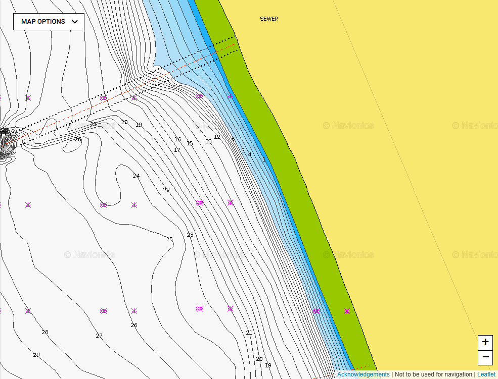

- **file**: `07_scale/shapes/prattes-reef-el-segundo/3d/src/navionics/sonar_ft_z17_map.png`
- **kind**: chart_screenshot
- **shows**: SonarChart contours at zoom 17 (0.99 m/px) with sparse labels (1, 3, 5, 6, 11, 15, 16, 17 ... ft).
- **structure visible**: False
- **state shown**: seabed only (reef removed 2008-2010; contours smooth at the site)
- **image date**: chart data dates not shown by the viewer; screenshot 2026-10-05
- **citation**: Garmin Ltd / Navionics (2026). Marine Maps viewer (SonarChart, zoom 17), depths in feet, shallow shading 6 ft, centred on 33.92058 N, 118.43335 W (the Borrero & Nelsen Fig. 9 window centre; current position hint); page title 'Garmin | Marine Maps' ('Not to be used for navigation'). https://maps.garmin.com/en-US/marine/ (webapp.navionics.com redirects here). Screenshot taken 2026-10-05. Accessed 2026-10-05.
- **image URL**: https://maps.garmin.com/en-US/marine/
- **source page**: https://maps.garmin.com/en-US/marine/
- **page / figure**: SonarChart, zoom 17; current capture
- **credit**: Garmin Navionics charts and SonarChart (c) Navionics / Garmin Ltd; screenshot by this project (own headless Chrome)
- **licence**: Garmin/Navionics terms ('Not to be used for navigation'); no open licence; private research copy, reuse NOT cleared
- **retrieved**: 2026-10-05
- **used for**: 3d_seabed
- **How used for the model**: Contour labels read to anchor the contour index (index = depth in ft, 1 ft interval).
- **3D check pending**: no - none: seabed cross-check already done
- **linked records**: 07_scale/shapes/prattes-reef-el-segundo/3d/SOURCES_3D.md (STEP 1d-bis); 07_scale/shapes/prattes-reef-el-segundo/3d/src/PROVENANCE_3D.md; 07_scale/shapes/prattes-reef-el-segundo/3d/model.js (seabed.navionics)
- **size**: 0.05 MB, 985x751 px
- **sha256**: 30a78298ba4001b81571d786ccae45430b525a3fc5dbe2fd66f9ea1e59902c05
- **rights**: Private research copy; reuse rights to be checked before any public release.
- **display in HTML**: True
- **added by**: image-registry backfill, 2026-10-06

## prattes-reef-el-segundo-img-12 - Garmin Navionics viewer, Pratte's Reef site, current capture: SonarChart, zoom 18

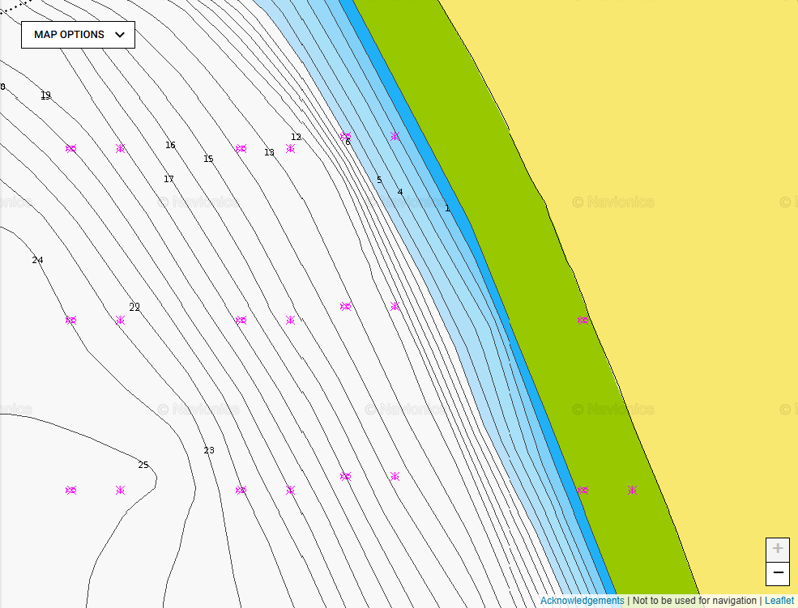

- **file**: `07_scale/shapes/prattes-reef-el-segundo/3d/src/navionics/sonar_ft_z18_map.png`
- **kind**: chart_screenshot
- **shows**: SonarChart contours at zoom 18 (985 x 751 px, 0.4955 m/px): seaward contour lines from the green drying band, no reef anomaly.
- **structure visible**: False
- **state shown**: seabed only (reef removed 2008-2010; contours smooth at the site)
- **image date**: chart data dates not shown by the viewer; screenshot 2026-10-05
- **citation**: Garmin Ltd / Navionics (2026). Marine Maps viewer (SonarChart, zoom 18), depths in feet, shallow shading 6 ft, centred on 33.92058 N, 118.43335 W (the Borrero & Nelsen Fig. 9 window centre; current position hint); page title 'Garmin | Marine Maps' ('Not to be used for navigation'). https://maps.garmin.com/en-US/marine/ (webapp.navionics.com redirects here). Screenshot taken 2026-10-05. Accessed 2026-10-05.
- **image URL**: https://maps.garmin.com/en-US/marine/
- **source page**: https://maps.garmin.com/en-US/marine/
- **page / figure**: SonarChart, zoom 18; current capture
- **credit**: Garmin Navionics charts and SonarChart (c) Navionics / Garmin Ltd; screenshot by this project (own headless Chrome)
- **licence**: Garmin/Navionics terms ('Not to be used for navigation'); no open licence; private research copy, reuse NOT cleared
- **retrieved**: 2026-10-05
- **used for**: 3d_seabed; 3d_tides; cross_check
- **How used for the model**: 25 contour lines counted along the shore-normal transect (bearing 245 deg) from the 0 ft line to s = 252 m (nav_transect.json); depth at the hint 10.15 ft = 3.09 m below chart datum; z_MSL = -(n x 0.3048) - 0.849 m. Used as the second seabed profile in the 3D model (model.js seabed.navionics).
- **3D check pending**: no - none: seabed cross-check already done
- **annotated / overlay files**: `07_scale/shapes/prattes-reef-el-segundo/3d/annotated/A9_navionics_sonarchart_contours_transect.png`
- **linked records**: 07_scale/shapes/prattes-reef-el-segundo/3d/SOURCES_3D.md (STEP 1d-bis); 07_scale/shapes/prattes-reef-el-segundo/3d/src/PROVENANCE_3D.md; 07_scale/shapes/prattes-reef-el-segundo/3d/model.js (seabed.navionics)
- **size**: 0.04 MB, 985x751 px
- **sha256**: e836c7dd9c0c6d48beeeb1f827942e584e8b8b94e58a567ec11591693aede224
- **rights**: Private research copy; reuse rights to be checked before any public release.
- **display in HTML**: True
- **added by**: image-registry backfill, 2026-10-06

## prattes-reef-el-segundo-img-13 - Garmin Navionics viewer, Pratte's Reef site, current capture: Nautical Chart, zoom 17

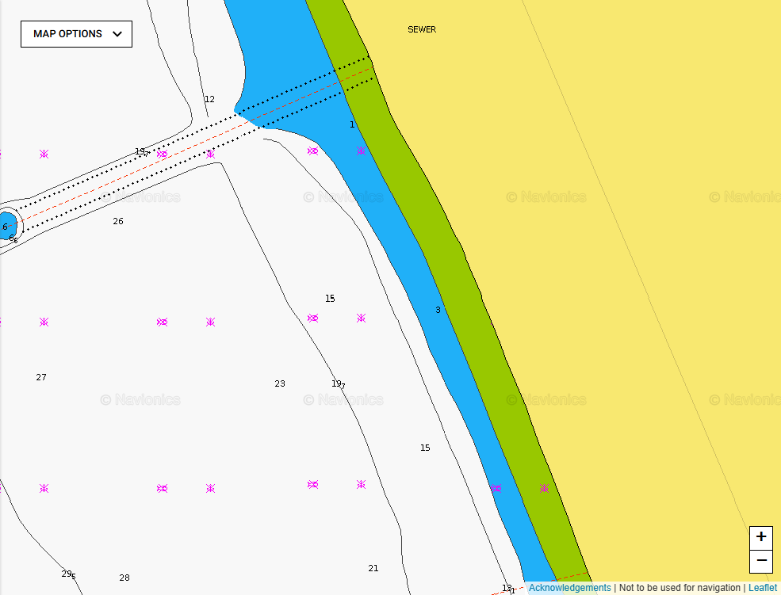

- **file**: `07_scale/shapes/prattes-reef-el-segundo/3d/src/navionics/nautical_ft_z17_map.png`
- **kind**: chart_screenshot
- **shows**: Nautical Chart soundings and coarse contours at zoom 17.
- **structure visible**: False
- **state shown**: seabed only (reef removed 2008-2010; contours smooth at the site)
- **image date**: chart data dates not shown by the viewer; screenshot 2026-10-05
- **citation**: Garmin Ltd / Navionics (2026). Marine Maps viewer (Nautical Chart, zoom 17), depths in feet, shallow shading 6 ft, centred on 33.92058 N, 118.43335 W (the Borrero & Nelsen Fig. 9 window centre; current position hint); page title 'Garmin | Marine Maps' ('Not to be used for navigation'). https://maps.garmin.com/en-US/marine/ (webapp.navionics.com redirects here). Screenshot taken 2026-10-05. Accessed 2026-10-05.
- **image URL**: https://maps.garmin.com/en-US/marine/
- **source page**: https://maps.garmin.com/en-US/marine/
- **page / figure**: Nautical Chart, zoom 17; current capture
- **credit**: Garmin Navionics charts and SonarChart (c) Navionics / Garmin Ltd; screenshot by this project (own headless Chrome)
- **licence**: Garmin/Navionics terms ('Not to be used for navigation'); no open licence; private research copy, reuse NOT cleared
- **retrieved**: 2026-10-05
- **used for**: 3d_seabed
- **How used for the model**: Spot soundings read (15, 21, 13.1 ft ...); the 15 ft sounding anchors the SonarChart contour index (3.6 m from the 15th line).
- **3D check pending**: no - none: seabed cross-check already done
- **linked records**: 07_scale/shapes/prattes-reef-el-segundo/3d/SOURCES_3D.md (STEP 1d-bis); 07_scale/shapes/prattes-reef-el-segundo/3d/src/PROVENANCE_3D.md; 07_scale/shapes/prattes-reef-el-segundo/3d/model.js (seabed.navionics)
- **size**: 0.03 MB, 985x751 px
- **sha256**: 2467918368c701f2765602dc2eaf66212ed538f694cc38232704e8c6869ed96f
- **rights**: Private research copy; reuse rights to be checked before any public release.
- **display in HTML**: True
- **added by**: image-registry backfill, 2026-10-06

## prattes-reef-el-segundo-img-14 - Garmin Navionics viewer, Pratte's Reef site, current capture: Nautical Chart, zoom 18

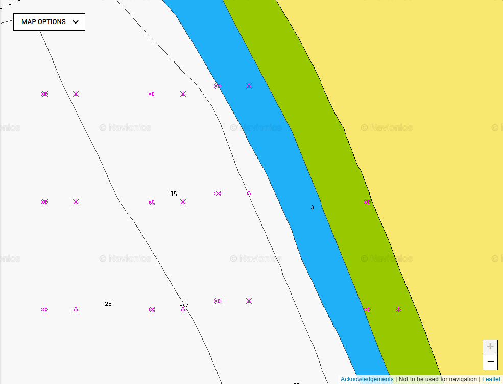

- **file**: `07_scale/shapes/prattes-reef-el-segundo/3d/src/navionics/nautical_ft_z18_map.png`
- **kind**: chart_screenshot
- **shows**: Nautical Chart soundings and coarse contours at zoom 18.
- **structure visible**: False
- **state shown**: seabed only (reef removed 2008-2010; contours smooth at the site)
- **image date**: chart data dates not shown by the viewer; screenshot 2026-10-05
- **citation**: Garmin Ltd / Navionics (2026). Marine Maps viewer (Nautical Chart, zoom 18), depths in feet, shallow shading 6 ft, centred on 33.92058 N, 118.43335 W (the Borrero & Nelsen Fig. 9 window centre; current position hint); page title 'Garmin | Marine Maps' ('Not to be used for navigation'). https://maps.garmin.com/en-US/marine/ (webapp.navionics.com redirects here). Screenshot taken 2026-10-05. Accessed 2026-10-05.
- **image URL**: https://maps.garmin.com/en-US/marine/
- **source page**: https://maps.garmin.com/en-US/marine/
- **page / figure**: Nautical Chart, zoom 18; current capture
- **credit**: Garmin Navionics charts and SonarChart (c) Navionics / Garmin Ltd; screenshot by this project (own headless Chrome)
- **licence**: Garmin/Navionics terms ('Not to be used for navigation'); no open licence; private research copy, reuse NOT cleared
- **retrieved**: 2026-10-05
- **used for**: 3d_seabed
- **How used for the model**: Spot-sounding anchor (15 ft) for the contour index and the chart coastline (green/yellow edge) distance used to place the hint.
- **3D check pending**: no - none: seabed cross-check already done
- **annotated / overlay files**: `07_scale/shapes/prattes-reef-el-segundo/3d/annotated/A10_navionics_nautical_chart_soundings.png`
- **linked records**: 07_scale/shapes/prattes-reef-el-segundo/3d/SOURCES_3D.md (STEP 1d-bis); 07_scale/shapes/prattes-reef-el-segundo/3d/src/PROVENANCE_3D.md; 07_scale/shapes/prattes-reef-el-segundo/3d/model.js (seabed.navionics)
- **size**: 0.03 MB, 985x751 px
- **sha256**: ef4c0b94c947aa92622ef24d327c1cef2961273c56e18b43b04d67050a1be3c2
- **rights**: Private research copy; reuse rights to be checked before any public release.
- **display in HTML**: True
- **added by**: image-registry backfill, 2026-10-06

## prattes-reef-el-segundo-img-15 - Garmin Navionics viewer, Pratte's Reef site, first capture (superseded centre): Map Options panel

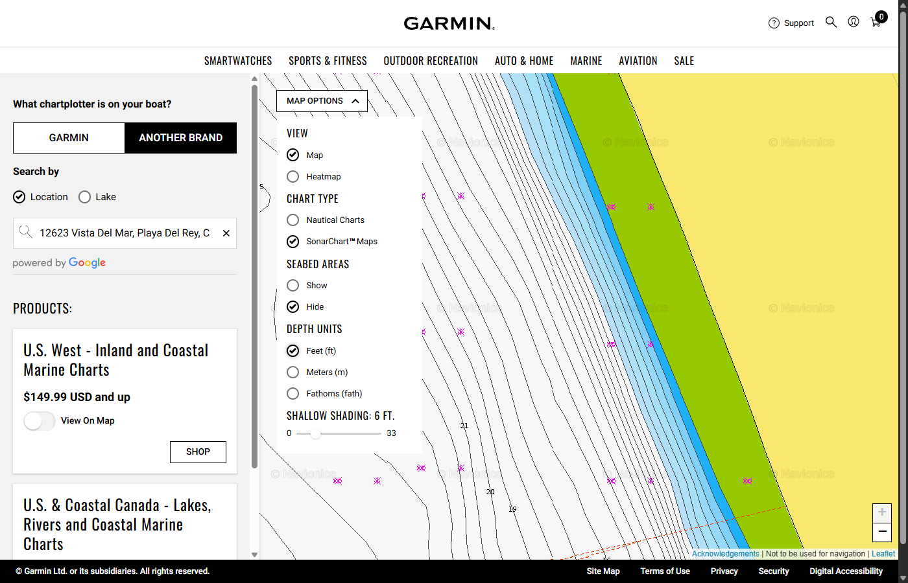

- **file**: `07_scale/shapes/prattes-reef-el-segundo/3d/src/navionics/hint1_33.9188_-118.4324/app_options_sonarchart_feet.png`
- **kind**: chart_screenshot
- **shows**: Map Options panel: View = Map, Chart type SonarChart/Nautical, Seabed areas hidden, Depth units = Feet, shallow shading 6 ft.
- **structure visible**: False
- **state shown**: seabed only (reef removed 2008-2010; contours smooth at the site)
- **image date**: chart data dates not shown by the viewer; screenshot 2026-10-05
- **citation**: Garmin Ltd / Navionics (2026). Marine Maps viewer (Map Options panel), depths in feet, shallow shading 6 ft, centred on 33.9188 N, 118.4324 W (superseded text-derived hint); page title 'Garmin | Marine Maps' ('Not to be used for navigation'). https://maps.garmin.com/en-US/marine/ (webapp.navionics.com redirects here). Screenshot taken 2026-10-05. Accessed 2026-10-05.
- **image URL**: https://maps.garmin.com/en-US/marine/
- **source page**: https://maps.garmin.com/en-US/marine/
- **page / figure**: Map Options panel; first capture (superseded centre)
- **credit**: Garmin Navionics charts and SonarChart (c) Navionics / Garmin Ltd; screenshot by this project (own headless Chrome)
- **licence**: Garmin/Navionics terms ('Not to be used for navigation'); no open licence; private research copy, reuse NOT cleared
- **retrieved**: 2026-10-05
- **used for**: context
- **How used for the model**: First capture, centred on the superseded 33.9188 N, -118.4324 W hint: used for the first datum test before the position moved 217 m NNW; kept for the record. 
- **3D check pending**: no - none: seabed cross-check already done
- **linked records**: 07_scale/shapes/prattes-reef-el-segundo/3d/SOURCES_3D.md (STEP 1d-bis); 07_scale/shapes/prattes-reef-el-segundo/3d/src/PROVENANCE_3D.md; 07_scale/shapes/prattes-reef-el-segundo/3d/model.js (seabed.navionics)
- **size**: 0.13 MB, 1400x900 px
- **sha256**: 8265512ade32b76dde308f67c3ff0f93445d60c4ccef444857e97c811fa7bb15
- **rights**: Private research copy; reuse rights to be checked before any public release.
- **display in HTML**: True
- **added by**: image-registry backfill, 2026-10-06

## prattes-reef-el-segundo-img-16 - Garmin Navionics viewer, Pratte's Reef site, first capture (superseded centre): SonarChart, zoom 17

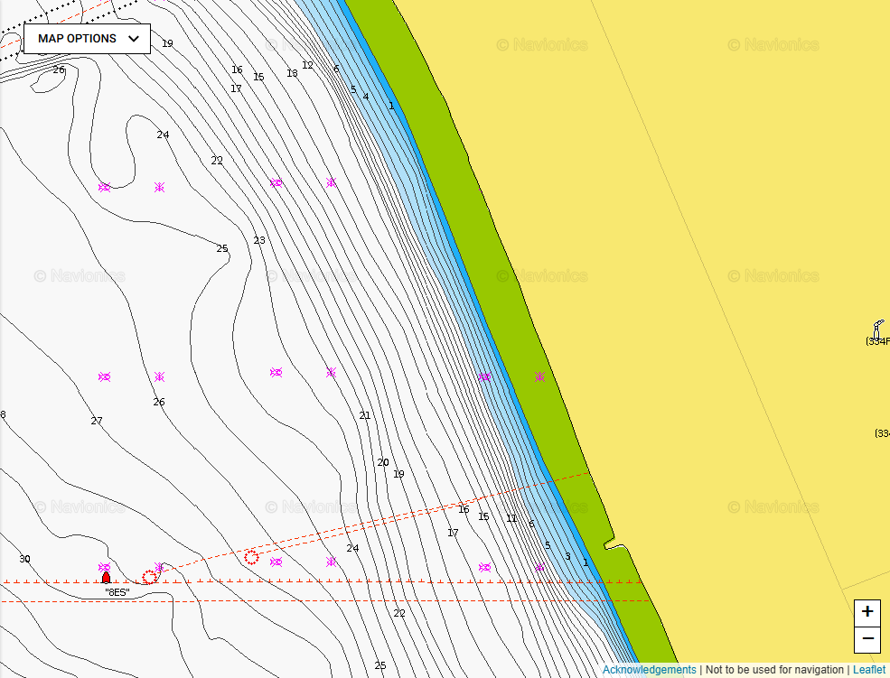

- **file**: `07_scale/shapes/prattes-reef-el-segundo/3d/src/navionics/hint1_33.9188_-118.4324/sonar_ft_z17_map.png`
- **kind**: chart_screenshot
- **shows**: SonarChart contours at zoom 17 (0.99 m/px) with sparse labels (1, 3, 5, 6, 11, 15, 16, 17 ... ft).
- **structure visible**: False
- **state shown**: seabed only (reef removed 2008-2010; contours smooth at the site)
- **image date**: chart data dates not shown by the viewer; screenshot 2026-10-05
- **citation**: Garmin Ltd / Navionics (2026). Marine Maps viewer (SonarChart, zoom 17), depths in feet, shallow shading 6 ft, centred on 33.9188 N, 118.4324 W (superseded text-derived hint); page title 'Garmin | Marine Maps' ('Not to be used for navigation'). https://maps.garmin.com/en-US/marine/ (webapp.navionics.com redirects here). Screenshot taken 2026-10-05. Accessed 2026-10-05.
- **image URL**: https://maps.garmin.com/en-US/marine/
- **source page**: https://maps.garmin.com/en-US/marine/
- **page / figure**: SonarChart, zoom 17; first capture (superseded centre)
- **credit**: Garmin Navionics charts and SonarChart (c) Navionics / Garmin Ltd; screenshot by this project (own headless Chrome)
- **licence**: Garmin/Navionics terms ('Not to be used for navigation'); no open licence; private research copy, reuse NOT cleared
- **retrieved**: 2026-10-05
- **used for**: context
- **How used for the model**: First capture, centred on the superseded 33.9188 N, -118.4324 W hint: used for the first datum test before the position moved 217 m NNW; kept for the record. (Reads: Contour labels read to anchor the contour index (index = depth in ft, 1 ft interval).)
- **3D check pending**: no - none: seabed cross-check already done
- **linked records**: 07_scale/shapes/prattes-reef-el-segundo/3d/SOURCES_3D.md (STEP 1d-bis); 07_scale/shapes/prattes-reef-el-segundo/3d/src/PROVENANCE_3D.md; 07_scale/shapes/prattes-reef-el-segundo/3d/model.js (seabed.navionics)
- **size**: 0.05 MB, 985x751 px
- **sha256**: fa001c9926ed99aa896ff65ad185591bdcdb6ef752befd15c12d10d498fc0eae
- **rights**: Private research copy; reuse rights to be checked before any public release.
- **display in HTML**: True
- **added by**: image-registry backfill, 2026-10-06

## prattes-reef-el-segundo-img-17 - Garmin Navionics viewer, Pratte's Reef site, first capture (superseded centre): SonarChart, zoom 18

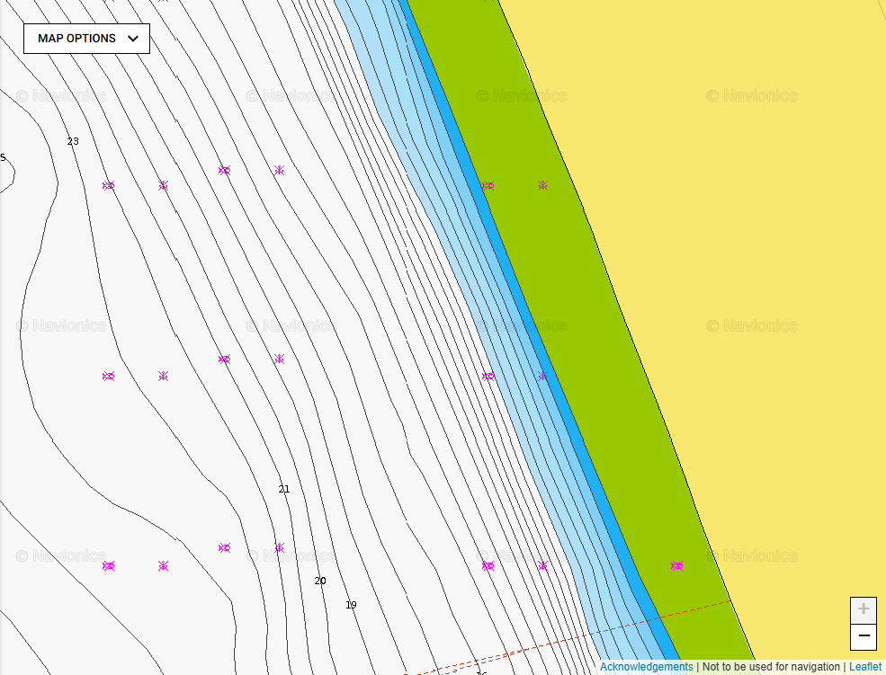

- **file**: `07_scale/shapes/prattes-reef-el-segundo/3d/src/navionics/hint1_33.9188_-118.4324/sonar_ft_z18_map.png`
- **kind**: chart_screenshot
- **shows**: SonarChart contours at zoom 18 (985 x 751 px, 0.4955 m/px): seaward contour lines from the green drying band, no reef anomaly.
- **structure visible**: False
- **state shown**: seabed only (reef removed 2008-2010; contours smooth at the site)
- **image date**: chart data dates not shown by the viewer; screenshot 2026-10-05
- **citation**: Garmin Ltd / Navionics (2026). Marine Maps viewer (SonarChart, zoom 18), depths in feet, shallow shading 6 ft, centred on 33.9188 N, 118.4324 W (superseded text-derived hint); page title 'Garmin | Marine Maps' ('Not to be used for navigation'). https://maps.garmin.com/en-US/marine/ (webapp.navionics.com redirects here). Screenshot taken 2026-10-05. Accessed 2026-10-05.
- **image URL**: https://maps.garmin.com/en-US/marine/
- **source page**: https://maps.garmin.com/en-US/marine/
- **page / figure**: SonarChart, zoom 18; first capture (superseded centre)
- **credit**: Garmin Navionics charts and SonarChart (c) Navionics / Garmin Ltd; screenshot by this project (own headless Chrome)
- **licence**: Garmin/Navionics terms ('Not to be used for navigation'); no open licence; private research copy, reuse NOT cleared
- **retrieved**: 2026-10-05
- **used for**: context
- **How used for the model**: First capture, centred on the superseded 33.9188 N, -118.4324 W hint: used for the first datum test before the position moved 217 m NNW; kept for the record. (Reads: 25 contour lines counted along the shore-normal transect (bearing 245 deg) from the 0 ft line to s = 252 m (nav_transect.json); depth at the hint 10.15 ft = 3.09 m below chart datum; z_MSL = -(n x 0.3048) - 0.849 m. Used as the second seabed profile in the 3D model (model.js seabed.navionics).)
- **3D check pending**: no - none: seabed cross-check already done
- **linked records**: 07_scale/shapes/prattes-reef-el-segundo/3d/SOURCES_3D.md (STEP 1d-bis); 07_scale/shapes/prattes-reef-el-segundo/3d/src/PROVENANCE_3D.md; 07_scale/shapes/prattes-reef-el-segundo/3d/model.js (seabed.navionics)
- **size**: 0.05 MB, 985x751 px
- **sha256**: 87a8ff96b0619af28a28443551aa1b20ce0a41327b1389f0c92e8a8af066f8b9
- **rights**: Private research copy; reuse rights to be checked before any public release.
- **display in HTML**: True
- **added by**: image-registry backfill, 2026-10-06

## prattes-reef-el-segundo-img-18 - Garmin Navionics viewer, Pratte's Reef site, first capture (superseded centre): Nautical Chart, zoom 17

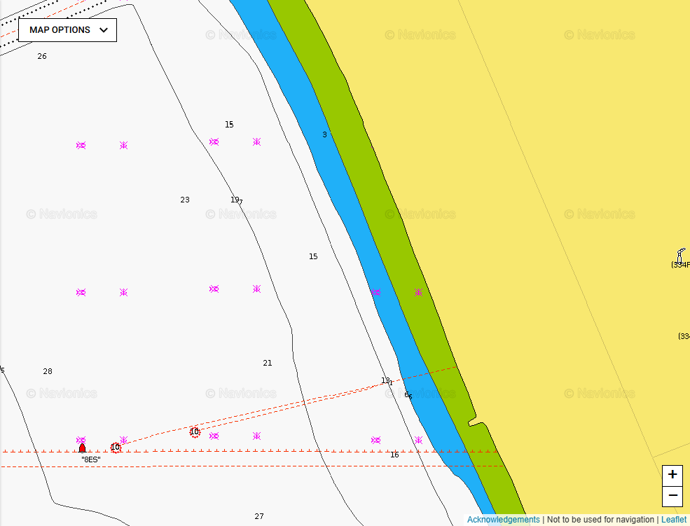

- **file**: `07_scale/shapes/prattes-reef-el-segundo/3d/src/navionics/hint1_33.9188_-118.4324/nautical_ft_z17_map.png`
- **kind**: chart_screenshot
- **shows**: Nautical Chart soundings and coarse contours at zoom 17.
- **structure visible**: False
- **state shown**: seabed only (reef removed 2008-2010; contours smooth at the site)
- **image date**: chart data dates not shown by the viewer; screenshot 2026-10-05
- **citation**: Garmin Ltd / Navionics (2026). Marine Maps viewer (Nautical Chart, zoom 17), depths in feet, shallow shading 6 ft, centred on 33.9188 N, 118.4324 W (superseded text-derived hint); page title 'Garmin | Marine Maps' ('Not to be used for navigation'). https://maps.garmin.com/en-US/marine/ (webapp.navionics.com redirects here). Screenshot taken 2026-10-05. Accessed 2026-10-05.
- **image URL**: https://maps.garmin.com/en-US/marine/
- **source page**: https://maps.garmin.com/en-US/marine/
- **page / figure**: Nautical Chart, zoom 17; first capture (superseded centre)
- **credit**: Garmin Navionics charts and SonarChart (c) Navionics / Garmin Ltd; screenshot by this project (own headless Chrome)
- **licence**: Garmin/Navionics terms ('Not to be used for navigation'); no open licence; private research copy, reuse NOT cleared
- **retrieved**: 2026-10-05
- **used for**: context
- **How used for the model**: First capture, centred on the superseded 33.9188 N, -118.4324 W hint: used for the first datum test before the position moved 217 m NNW; kept for the record. (Reads: Spot soundings read (15, 21, 13.1 ft ...); the 15 ft sounding anchors the SonarChart contour index (3.6 m from the 15th line).)
- **3D check pending**: no - none: seabed cross-check already done
- **linked records**: 07_scale/shapes/prattes-reef-el-segundo/3d/SOURCES_3D.md (STEP 1d-bis); 07_scale/shapes/prattes-reef-el-segundo/3d/src/PROVENANCE_3D.md; 07_scale/shapes/prattes-reef-el-segundo/3d/model.js (seabed.navionics)
- **size**: 0.04 MB, 985x751 px
- **sha256**: 8837e66430073a7d880e6af003d7f31c44c5c0965e6fc8795e7d976e2f38bacb
- **rights**: Private research copy; reuse rights to be checked before any public release.
- **display in HTML**: True
- **added by**: image-registry backfill, 2026-10-06

## prattes-reef-el-segundo-img-19 - Garmin Navionics viewer, Pratte's Reef site, first capture (superseded centre): Nautical Chart, zoom 18

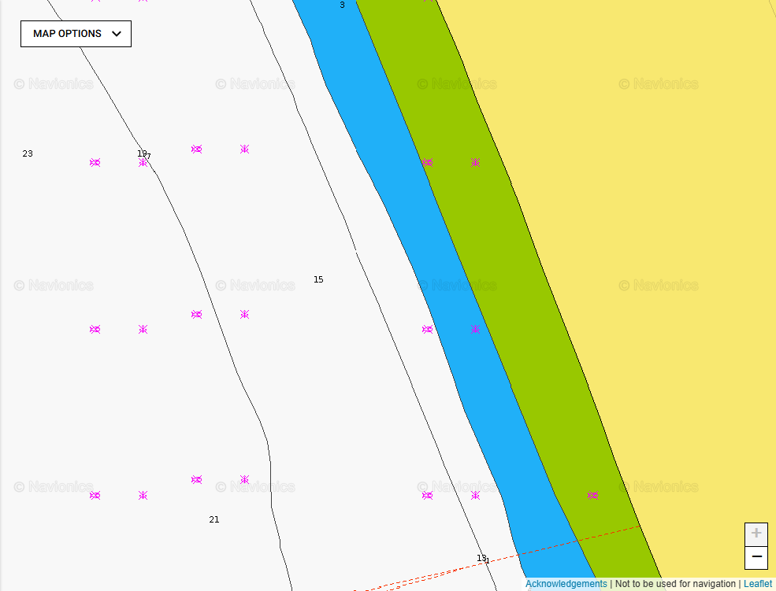

- **file**: `07_scale/shapes/prattes-reef-el-segundo/3d/src/navionics/hint1_33.9188_-118.4324/nautical_ft_z18_map.png`
- **kind**: chart_screenshot
- **shows**: Nautical Chart soundings and coarse contours at zoom 18.
- **structure visible**: False
- **state shown**: seabed only (reef removed 2008-2010; contours smooth at the site)
- **image date**: chart data dates not shown by the viewer; screenshot 2026-10-05
- **citation**: Garmin Ltd / Navionics (2026). Marine Maps viewer (Nautical Chart, zoom 18), depths in feet, shallow shading 6 ft, centred on 33.9188 N, 118.4324 W (superseded text-derived hint); page title 'Garmin | Marine Maps' ('Not to be used for navigation'). https://maps.garmin.com/en-US/marine/ (webapp.navionics.com redirects here). Screenshot taken 2026-10-05. Accessed 2026-10-05.
- **image URL**: https://maps.garmin.com/en-US/marine/
- **source page**: https://maps.garmin.com/en-US/marine/
- **page / figure**: Nautical Chart, zoom 18; first capture (superseded centre)
- **credit**: Garmin Navionics charts and SonarChart (c) Navionics / Garmin Ltd; screenshot by this project (own headless Chrome)
- **licence**: Garmin/Navionics terms ('Not to be used for navigation'); no open licence; private research copy, reuse NOT cleared
- **retrieved**: 2026-10-05
- **used for**: context
- **How used for the model**: First capture, centred on the superseded 33.9188 N, -118.4324 W hint: used for the first datum test before the position moved 217 m NNW; kept for the record. (Reads: Spot-sounding anchor (15 ft) for the contour index and the chart coastline (green/yellow edge) distance used to place the hint.)
- **3D check pending**: no - none: seabed cross-check already done
- **linked records**: 07_scale/shapes/prattes-reef-el-segundo/3d/SOURCES_3D.md (STEP 1d-bis); 07_scale/shapes/prattes-reef-el-segundo/3d/src/PROVENANCE_3D.md; 07_scale/shapes/prattes-reef-el-segundo/3d/model.js (seabed.navionics)
- **size**: 0.03 MB, 985x751 px
- **sha256**: c7f148ec3a152c28f7ad3f7fe1afa8da475fa36e511a1abfd58e168459163b15
- **rights**: Private research copy; reuse rights to be checked before any public release.
- **display in HTML**: True
- **added by**: image-registry backfill, 2026-10-06

## prattes-reef-el-segundo-img-20 - CCC Exhibit 2 (Skelly, June 1997 concept section) with MHHW +2.6 ft, MSL, MLLW -2.8 ft, TOP OF REEF -7 MSL and the 12 x 3 ft bag boxed

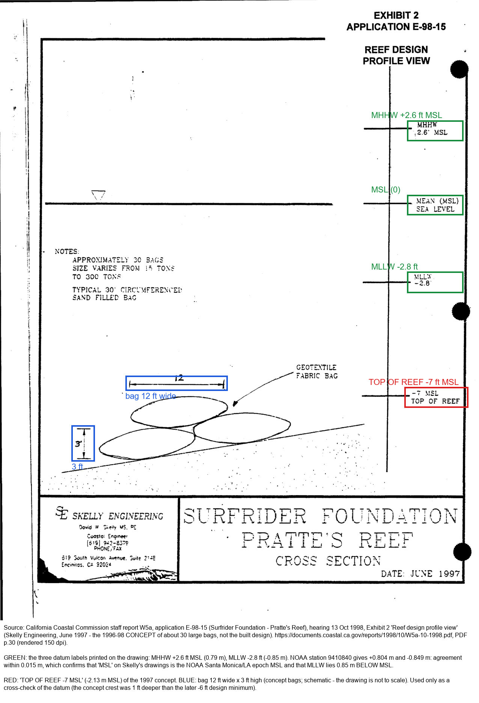

- **file**: `07_scale/shapes/prattes-reef-el-segundo/3d/annotated/A2_ccc_exhibit2_profile_datums.png`
- **kind**: cross_section
- **shows**: Concept cross-section of the reef with tidal datum labels (MHHW +2.6 ft, MSL, MLLW -2.8 ft), 'TOP OF REEF -7 MSL' and a 12 x 3 ft bag; annotated by this project.
- **structure visible**: True
- **state shown**: design (1997 concept)
- **image date**: drawing June 1997; report August 1998
- **citation**: California Coastal Commission (1998). Staff report W5a, CDP application E-98-15 (Surfrider Foundation - Pratte's Reef), hearing 13 Oct 1998, Exhibit 2 (PDF p.30), Skelly Engineering concept cross-section, June 1997. Drawings by Skelly Engineering. https://documents.coastal.ca.gov/reports/1998/10/W5a-10-1998.pdf. Accessed 2026-10-05.
- **image URL**: https://documents.coastal.ca.gov/reports/1998/10/W5a-10-1998.pdf
- **source page**: https://documents.coastal.ca.gov/reports/1998/10/W5a-10-1998.pdf
- **page / figure**: Exhibit 2, PDF p.30; annotated crop
- **credit**: Skelly Engineering; California Coastal Commission public record
- **licence**: public agency record; reuse terms not stated - check before public release
- **retrieved**: 2026-10-05
- **used for**: 3d_tides; 3d_crest
- **How used for the model**: Datum labels agree with the NOAA tidal datums within 0.015 m; supports the MSL/MLLW conversion used for crest states (SOURCES_3D annotated A2; model.js tides).
- **3D check pending**: no - none: already used
- **source PDF**: `07_scale/shapes/prattes-reef-el-segundo/3d/src/ccc_W5a-10-1998_staff_report.pdf`
- **linked records**: 07_scale/shapes/prattes-reef-el-segundo/3d/SOURCES_3D.md (annotated A2)
- **size**: 0.35 MB, 1276x1870 px
- **sha256**: 46282ebbd843c8a401ebefb034e0593c462b42b9a5aa97d4d6b300adf1d88d0f
- **rights**: Private research copy; reuse rights to be checked before any public release.
- **display in HTML**: True
- **added by**: image-registry backfill, 2026-10-06

## prattes-reef-el-segundo-img-21 - ICCE 2010 p.7 with the Pratte's crest-depth, bag-volume, fill-ratio and Phase II sentences highlighted

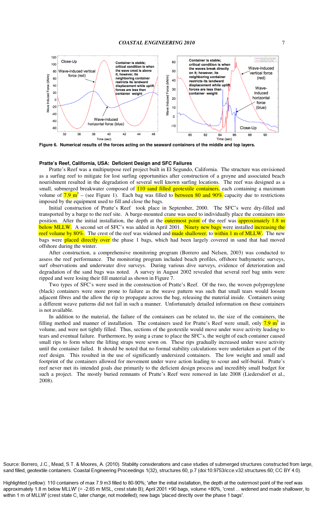

- **file**: `07_scale/shapes/prattes-reef-el-segundo/3d/annotated/A4_icce2010_p7_pratte_text_highlighted.png`
- **kind**: diagram
- **shows**: Page 7 of the paper with 'depth at the outermost point ... approximately 1.8 m below MLLW', 'maximum volume of 7.9 m3', '80 and 90% capacity' and the April 2001 Phase II sentences highlighted.
- **structure visible**: False
- **state shown**: not applicable (text evidence)
- **image date**: 2010
- **citation**: Borrero, J.C., Mead, S.T. & Moores, A. (2010). Stability considerations and case studies of submerged structures constructed from large, sand filled, geotextile containers. Coastal Engineering Proceedings 1(32), structures.60, doi:10.9753/icce.v32.structures.60, p.7 (Pratte's Reef text). https://icce-ojs-tamu.tdl.org/icce/article/view/1172 (PDF https://pdfs.semanticscholar.org/8672/e1bb2043e0a227ce0e2ef6e01dd01bc8729e.pdf). Accessed 2026-10-05.
- **image URL**: https://icce-ojs-tamu.tdl.org/icce/article/view/1172
- **source page**: https://icce-ojs-tamu.tdl.org/icce/article/view/1172
- **page / figure**: PDF p.7 (page crop, highlighted)
- **credit**: Borrero, Mead & Moores (ICCE 2010)
- **licence**: CC BY 4.0 per the ICCE-OJS record (cite the authors)
- **retrieved**: 2026-10-05
- **used for**: 3d_crest; 3d_tides; scale
- **How used for the model**: Crest state B (-1.8 m MLLW = -2.649 m MSL as installed), bag volume 7.9 m3, Phase II (+90 bags, crest shallower to ~1 m MLLW) (SOURCES_3D table; annotated A4).
- **3D check pending**: no - none: text evidence already used
- **source PDF**: `07_scale/shapes/prattes-reef-el-segundo/3d/src/icce2010_borrero_mead_moores_SFC.pdf`
- **linked records**: 07_scale/shapes/prattes-reef-el-segundo/3d/SOURCES_3D.md (annotated A4)
- **size**: 0.41 MB, 992x1556 px
- **sha256**: c36398da012450a1d53d4311c0d37372dc859bb09e9dec1c837ef37c748dd273
- **rights**: Private research copy; reuse rights to be checked before any public release.
- **display in HTML**: True
- **added by**: image-registry backfill, 2026-10-06

## prattes-reef-el-segundo-img-22 - ICCE 2010 Fig. 1: 'A Pratte's Reef bag' size comparison, the 3 m x 1.2 m bag boxed

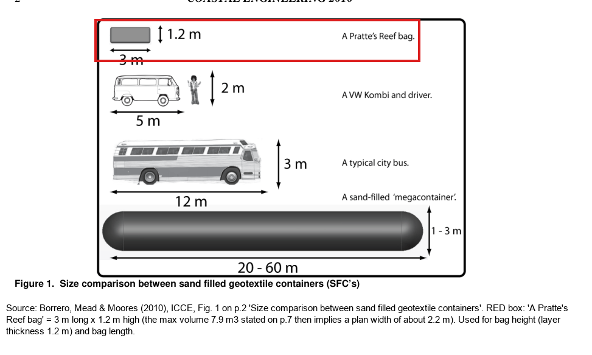

- **file**: `07_scale/shapes/prattes-reef-el-segundo/3d/annotated/A5_icce2010_fig1_pratte_bag_size.png`
- **kind**: diagram
- **shows**: The size-comparison graphic (bag beside a VW camper, city bus and a Mount Reef bag) with the Pratte's bag dimensions boxed.
- **structure visible**: True
- **state shown**: design (bag size)
- **image date**: 2010
- **citation**: Borrero, J.C., Mead, S.T. & Moores, A. (2010). Stability considerations and case studies of submerged structures constructed from large, sand filled, geotextile containers. Coastal Engineering Proceedings 1(32), structures.60, doi:10.9753/icce.v32.structures.60, p.2, Figure 1 ('A Pratte's Reef bag' 3 m x 1.2 m). https://icce-ojs-tamu.tdl.org/icce/article/view/1172 (PDF https://pdfs.semanticscholar.org/8672/e1bb2043e0a227ce0e2ef6e01dd01bc8729e.pdf). Accessed 2026-10-05.
- **image URL**: https://icce-ojs-tamu.tdl.org/icce/article/view/1172
- **source page**: https://icce-ojs-tamu.tdl.org/icce/article/view/1172
- **page / figure**: PDF p.2, Figure 1 (annotated crop)
- **credit**: Borrero, Mead & Moores (ICCE 2010); annotated by this project
- **licence**: CC BY 4.0 per the ICCE-OJS record (cite the authors)
- **retrieved**: 2026-10-05
- **used for**: scale; 3d_height_slopes
- **How used for the model**: Primary printed bag size 3 m long x 1.2 m high, used for the bag dimensions and the stack-height reasoning (SOURCES_3D 'Bag size'; annotated A5).
- **3D check pending**: no - none: already used
- **source PDF**: `07_scale/shapes/prattes-reef-el-segundo/3d/src/icce2010_borrero_mead_moores_SFC.pdf`
- **linked records**: 07_scale/shapes/prattes-reef-el-segundo/3d/SOURCES_3D.md (annotated A5)
- **size**: 0.09 MB, 973x583 px
- **sha256**: 144ccd891da9c7bdfd470dea78f067f0644d2a681823198f1559f5632cd94980
- **rights**: Private research copy; reuse rights to be checked before any public release.
- **display in HTML**: True
- **added by**: image-registry backfill, 2026-10-06

## prattes-reef-el-segundo-img-23 - CCC staff report p.11: '300 yards north of the Grand Avenue jetty and 100 yards offshore', '15 feet of water (MSL)' highlighted

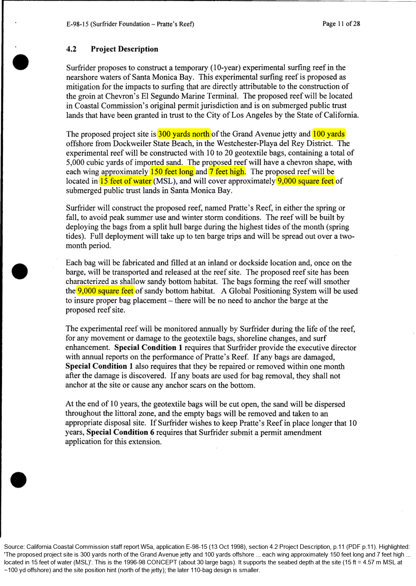

- **file**: `07_scale/shapes/prattes-reef-el-segundo/3d/annotated/A6_ccc_p11_project_description_highlighted.png`
- **kind**: diagram
- **shows**: Page 11 of the staff report with the position and depth sentences highlighted.
- **structure visible**: False
- **state shown**: not applicable (text evidence)
- **image date**: August 1998
- **citation**: California Coastal Commission (1998). Staff report W5a, CDP application E-98-15 (Surfrider Foundation - Pratte's Reef), hearing 13 Oct 1998, p.11 (project description). Drawings by Skelly Engineering. https://documents.coastal.ca.gov/reports/1998/10/W5a-10-1998.pdf. Accessed 2026-10-05.
- **image URL**: https://documents.coastal.ca.gov/reports/1998/10/W5a-10-1998.pdf
- **source page**: https://documents.coastal.ca.gov/reports/1998/10/W5a-10-1998.pdf
- **page / figure**: PDF p.11 (page crop, highlighted)
- **credit**: California Coastal Commission
- **licence**: public agency record; reuse terms not stated - check before public release
- **retrieved**: 2026-10-05
- **used for**: 3d_seabed; 3d_tides
- **How used for the model**: Superseded position hint (300 yd N of the Grand Avenue jetty, 100 yd offshore) and '15 feet of water (MSL)' as a depth cross-check (annotated A6).
- **3D check pending**: no - none: text evidence already used
- **source PDF**: `07_scale/shapes/prattes-reef-el-segundo/3d/src/ccc_W5a-10-1998_staff_report.pdf`
- **linked records**: 07_scale/shapes/prattes-reef-el-segundo/3d/SOURCES_3D.md (annotated A6)
- **size**: 0.58 MB, 1020x1435 px
- **sha256**: d34ba35321991b6c70da1edbb8f31c9945b391e6ad26e8246a61ed953f296370
- **rights**: Private research copy; reuse rights to be checked before any public release.
- **display in HTML**: True
- **added by**: image-registry backfill, 2026-10-06

## prattes-reef-el-segundo-img-24 - NOAA 1/3 arc-second DEM map (1 m contours, MSL waterline, sampled band, position hint, reef outline) and cross-shore seabed profile with crest states

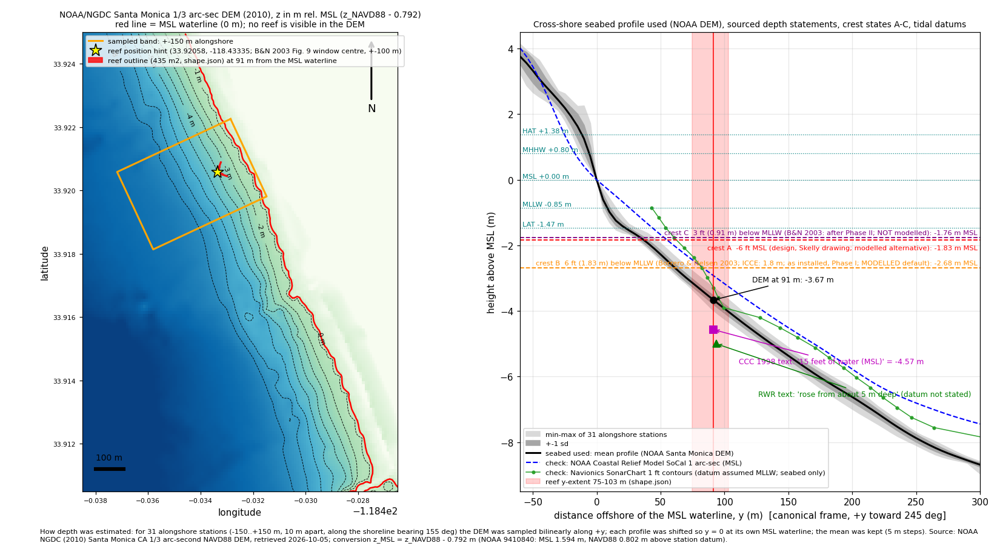

- **file**: `07_scale/shapes/prattes-reef-el-segundo/3d/annotated/A7_noaa_dem_map_and_seabed_profile.png`
- **kind**: survey_plot
- **shows**: DEM map with contours every 1 m, the MSL waterline in red, the sampled band, the position hint and the reef outline, plus the cross-shore profile with the reef extent, the two text depth statements, crest states A-C and tidal datums.
- **structure visible**: False
- **state shown**: seabed (DEM; reef removed)
- **image date**: DEM compiled 2010-03-12 (source surveys 1932-2009); figure 2026-10-05
- **citation**: This project (2026-10-05), figure from: NOAA National Geophysical Data Center / NCEI (2010). Santa Monica, California 1/3 arc-second NAVD 88 Coastal Digital Elevation Model (NGDC 2010-03-12; sources 1932-2009: NOS soundings, NGDC multibeam 1992-2006, CSUMB multibeam 2001-2008, USACE SHOALS lidar 2002-2007), ImageServer exportImage https://gis.ngdc.noaa.gov/arcgis/rest/services/DEM_mosaics/DEM_all/ImageServer (raster 3d/src/noaa_santa_monica_13as_navd88_export.tif). Accessed 2026-10-05.
- **image URL**: https://gis.ngdc.noaa.gov/arcgis/rest/services/DEM_mosaics/DEM_all/ImageServer
- **source page**: https://gis.ngdc.noaa.gov/arcgis/rest/services/DEM_mosaics/DEM_all/ImageServer
- **page / figure**: make_annotations.py output
- **credit**: NOAA NGDC / NCEI (data, public domain); figure by this project
- **licence**: public domain (US government data); figure is a project product
- **retrieved**: 2026-10-05
- **used for**: 3d_seabed; 3d_tides
- **How used for the model**: Primary seabed: mean of 31 alongshore profiles, z(y = 91.4 m) = -3.75 m MSL (alongshore sd 0.18 m), slope ~1:30 over the reef; MSL waterline at y = 0 (SOURCES_3D annotated A7; model.js seabed).
- **3D check pending**: no - none: already used
- **linked records**: 07_scale/shapes/prattes-reef-el-segundo/3d/SOURCES_3D.md (annotated A7); 07_scale/shapes/prattes-reef-el-segundo/3d/model.js
- **size**: 0.33 MB, 1650x901 px
- **sha256**: 73c500ad83b3bdcab5a9867665c1f6aa65f95d166ebb212085072a2d7d6e669c
- **rights**: Private research copy; reuse rights to be checked before any public release.
- **display in HTML**: True
- **added by**: image-registry backfill, 2026-10-06

## prattes-reef-el-segundo-img-25 - Datum ladder (NOAA 9410840, m and ft relative to MSL) with the CCC datum labels and the three crest states

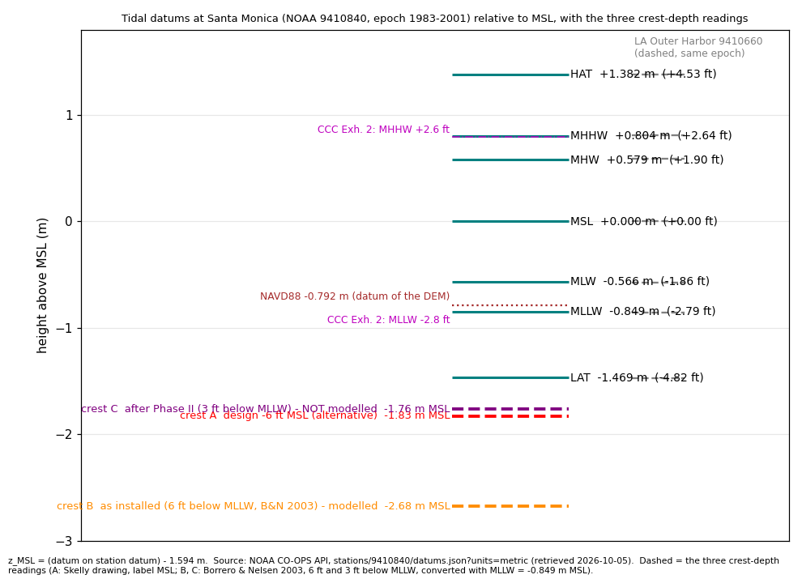

- **file**: `07_scale/shapes/prattes-reef-el-segundo/3d/annotated/A8_noaa_tidal_datums_and_crest_states.png`
- **kind**: diagram
- **shows**: Datum ladder (HAT .. MLLW .. LAT) with the Skelly/CCC labels and crest states A (-6 ft MSL), B (-6 ft MLLW) and C.
- **structure visible**: False
- **state shown**: not applicable (analysis chart)
- **image date**: datums epoch 1983-2001; chart 2026-10-05
- **citation**: This project (2026-10-05), chart from: NOAA CO-OPS (2026). Tidal datums, Santa Monica station 9410840 (epoch 1983-2001), https://api.tidesandcurrents.noaa.gov/mdapi/prod/webapi/stations/9410840/datums.json?units=metric; cross-check station Los Angeles 9410660. Accessed 2026-10-05.
- **image URL**: https://api.tidesandcurrents.noaa.gov/mdapi/prod/webapi/stations/9410840/datums.json?units=metric
- **source page**: https://api.tidesandcurrents.noaa.gov/mdapi/prod/webapi/stations/9410840/datums.json
- **page / figure**: make_annotations.py output
- **credit**: NOAA CO-OPS (data, public domain); chart by this project
- **licence**: public domain (US government data); chart is a project product
- **retrieved**: 2026-10-05
- **used for**: 3d_tides; 3d_crest
- **How used for the model**: Shows MSL - MLLW = 0.849 m and why the same '6 ft' number gives crest states A (-1.829 m MSL) and B (-2.678 m MSL) (SOURCES_3D annotated A8; model.js tides).
- **3D check pending**: no - none: already used
- **linked records**: 07_scale/shapes/prattes-reef-el-segundo/3d/SOURCES_3D.md (annotated A8); 07_scale/shapes/prattes-reef-el-segundo/3d/model.js
- **size**: 0.07 MB, 990x715 px
- **sha256**: 9874920948a42a48dc78a3dfdb3ab05fa2dcb619867577f4842b9b8c066d0583
- **rights**: Private research copy; reuse rights to be checked before any public release.
- **display in HTML**: True
- **added by**: image-registry backfill, 2026-10-06

## prattes-reef-el-segundo-img-26 - Navionics-vs-NOAA DEM seabed profile comparison and datum test (MLLW / NAVD88 / LAT / MSL)

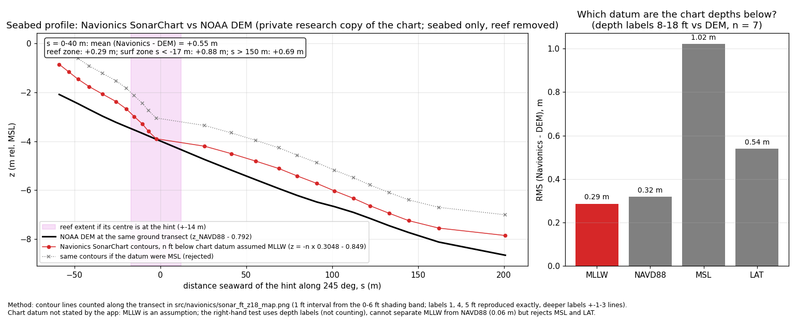

- **file**: `07_scale/shapes/prattes-reef-el-segundo/3d/annotated/A11_navionics_vs_noaa_dem_profile.png`
- **kind**: diagram
- **shows**: Profile comparison of the Navionics-implied depths and the DEM, with the RMS datum test (MLLW 0.045 m, NAVD88 0.089, LAT 0.598, MSL 0.873).
- **structure visible**: False
- **state shown**: not applicable (analysis chart)
- **image date**: 2026-10-05
- **citation**: This project (2026-10-05), chart made from Garmin Navionics SonarChart screenshots (https://maps.garmin.com/en-US/marine/, accessed 2026-10-05) and the NOAA 1/3 arc-second DEM (NGDC 2010).
- **image URL**: https://maps.garmin.com/en-US/marine/
- **source page**: https://maps.garmin.com/en-US/marine/
- **page / figure**: nav_annotate.py output
- **credit**: Chart by this project; data Garmin Navionics and NOAA NGDC
- **licence**: project chart; underlying data as above
- **retrieved**: 2026-10-05
- **used for**: 3d_seabed; 3d_tides
- **How used for the model**: Result: at the hint z_MSL = -3.94 m (Navionics) vs -4.13 m (DEM); chart datum read as MLLW/NAVD88; MSL and LAT rejected; second seabed profile in the model (SOURCES_3D 1d-bis; model.js seabed.navionics).
- **3D check pending**: no - none: already used
- **linked records**: 07_scale/shapes/prattes-reef-el-segundo/3d/SOURCES_3D.md (STEP 1d-bis; annotated A11)
- **size**: 0.13 MB, 1540x616 px
- **sha256**: 827926a24a62ab6ebe126ea463852a49f58e3e1e80d98fc2f06febfcc310562c
- **rights**: Private research copy; reuse rights to be checked before any public release.
- **display in HTML**: True
- **added by**: image-registry backfill, 2026-10-06

## prattes-reef-el-segundo-img-27 - Borrero & Nelsen (2003) pp.1-3 with the design, bag-size, crest-depth and Phase II sentences highlighted

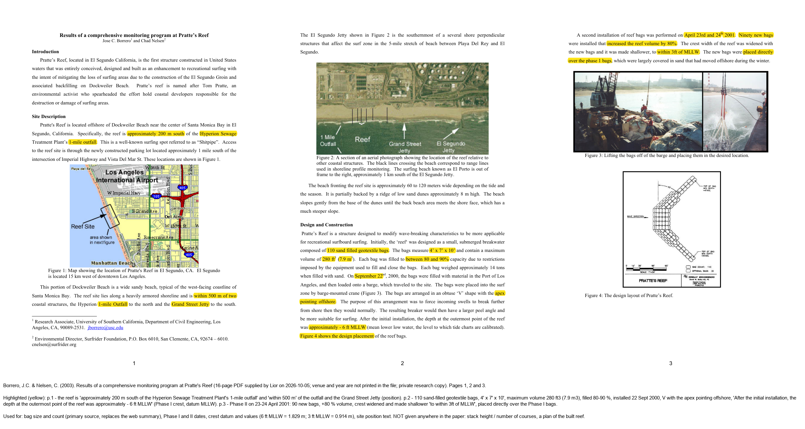

- **file**: `07_scale/shapes/prattes-reef-el-segundo/3d/annotated/A12_bn2003_p1-3_text_highlighted.png`
- **kind**: diagram
- **shows**: Pages 1-3 of the paper with the 110 bags, 4 x 7 x 10 ft / 7.9 m3 bag, 22 Sept 2000 install, '-6 ft MLLW' outermost depth and Phase II (+90 bags, 'within 3 ft of MLLW') sentences highlighted.
- **structure visible**: False
- **state shown**: not applicable (text evidence)
- **image date**: 2003 (monitoring to Oct 2002)
- **citation**: Borrero, J.C. & Nelsen, C. (2003). Results of a comprehensive monitoring program at Pratte's Reef. Proc. 3rd International Surfing Reef Symposium, Raglan, New Zealand (venue/year per the project's earlier citation R23; the supplied 16-page PDF prints neither), pp.1-3. PDF supplied by Lior (his Downloads\Pratte_results.pdf; original URL unknown; also on ResearchGate, publication 293137985). Accessed 2026-10-05.
- **image URL**: https://www.researchgate.net/publication/293137985
- **source page**: https://www.researchgate.net/publication/293137985
- **page / figure**: PDF pp.1-3 (page crops, highlighted)
- **credit**: J.C. Borrero (USC), C. Nelsen (Surfrider Foundation)
- **licence**: copyright holder; private research copy, reuse not cleared
- **retrieved**: 2026-10-05
- **used for**: 3d_crest; scale; 3d_tides
- **How used for the model**: Confirms the design version (Phase I), the bag size, and that the Phase I crest depth is stated in MLLW (crest state B updated to -2.678 m MSL) (SOURCES_3D Run 3; model.js provenance).
- **3D check pending**: no - none: text evidence already used
- **source PDF**: `07_scale/shapes/prattes-reef-el-segundo/src/borrero_nelsen_2003_prattes_monitoring_results.pdf`
- **linked records**: 07_scale/shapes/prattes-reef-el-segundo/3d/SOURCES_3D.md (RUN 3; annotated A12)
- **size**: 1.11 MB, 2481x1323 px
- **sha256**: 783723f843536dce51a6c7f08bab76041efb043ef550b8edea82f4fdbb29c379
- **rights**: Private research copy; reuse rights to be checked before any public release.
- **display in HTML**: True
- **added by**: image-registry backfill, 2026-10-06

## prattes-reef-el-segundo-img-28 - Borrero & Nelsen (2003) Fig. 4 (design layout) compared with the Skelly drawing img1

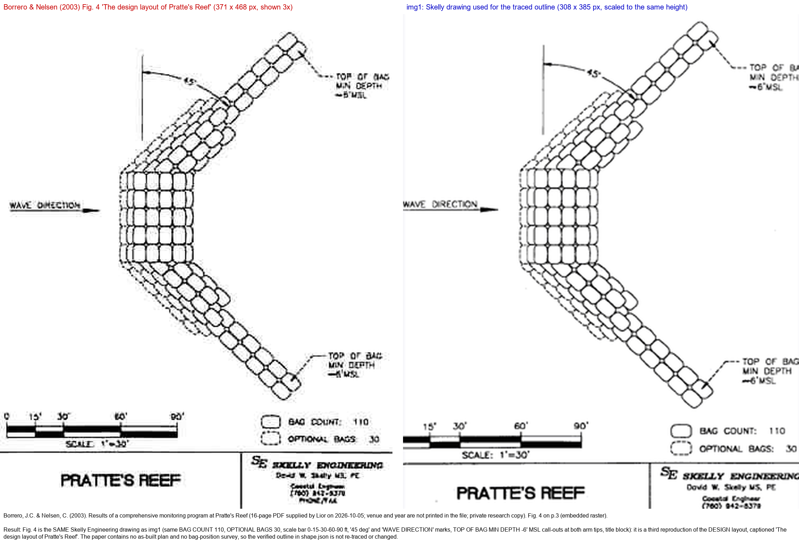

- **file**: `07_scale/shapes/prattes-reef-el-segundo/3d/annotated/A13_bn2003_fig4_vs_skelly_img1.png`
- **kind**: design_drawing
- **shows**: The paper's Fig. 4 beside img1: same legend, call-outs and title block (it is the design layout again, not an as-built plan).
- **structure visible**: True
- **state shown**: design (Phase I layout)
- **image date**: 2003 (drawing 2000)
- **citation**: Borrero, J.C. & Nelsen, C. (2003). Results of a comprehensive monitoring program at Pratte's Reef. Proc. 3rd International Surfing Reef Symposium, Raglan, New Zealand (venue/year per the project's earlier citation R23; the supplied 16-page PDF prints neither), p.3, Figure 4 'The design layout of Pratte's Reef' (raster 371 x 468 px), shown against img1. PDF supplied by Lior (his Downloads\Pratte_results.pdf; original URL unknown; also on ResearchGate, publication 293137985). Accessed 2026-10-05.
- **image URL**: https://www.researchgate.net/publication/293137985
- **source page**: https://www.researchgate.net/publication/293137985
- **page / figure**: PDF p.3, Figure 4 (comparison figure)
- **credit**: J.C. Borrero & C. Nelsen; Fig. 4 by Skelly Engineering; comparison by this project
- **licence**: copyright holder; private research copy, reuse not cleared
- **retrieved**: 2026-10-05
- **used for**: cross_check
- **How used for the model**: Shows the paper has NO as-built plan, so confidence stays medium and the shape remains the design footprint (SOURCES_3D Run 3; shape.json img7).
- **3D check pending**: no - none: already used
- **source PDF**: `07_scale/shapes/prattes-reef-el-segundo/src/borrero_nelsen_2003_prattes_monitoring_results.pdf`
- **linked records**: 07_scale/shapes/prattes-reef-el-segundo/3d/SOURCES_3D.md (RUN 3; annotated A13); 07_scale/shapes/prattes-reef-el-segundo/sources.md img7
- **size**: 0.91 MB, 2266x1564 px
- **sha256**: 5e55753af94e29a86cf1bde2c35d7e9e556dba82a274f79d7c570ff67195950d
- **rights**: Private research copy; reuse rights to be checked before any public release.
- **display in HTML**: True
- **added by**: image-registry backfill, 2026-10-06

## prattes-reef-el-segundo-img-29 - Borrero & Nelsen (2003) Fig. 2: aerial photograph showing the reef position relative to the outfall and jetties (annotated)

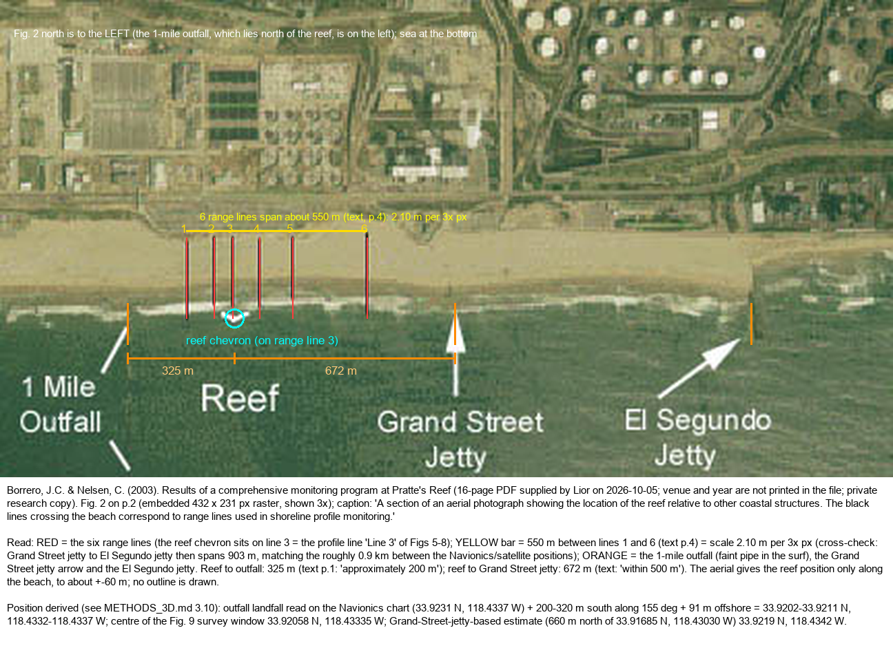

- **file**: `07_scale/shapes/prattes-reef-el-segundo/3d/annotated/A14_bn2003_fig2_aerial_position.png`
- **kind**: aerial
- **shows**: Small aerial with the text label 'Reef', a tiny chevron on range line 3, the 1-mile outfall, the Grand Street jetty and the El Segundo jetty; no reef outline.
- **structure visible**: True
- **state shown**: as-built (in service, 2000-2003)
- **image date**: 2003 or earlier (aerial photo date not stated)
- **citation**: Borrero, J.C. & Nelsen, C. (2003). Results of a comprehensive monitoring program at Pratte's Reef. Proc. 3rd International Surfing Reef Symposium, Raglan, New Zealand (venue/year per the project's earlier citation R23; the supplied 16-page PDF prints neither), p.2, Figure 2 (aerial photograph, 432 x 231 px, labels '1 Mile Outfall - Reef - Grand Street Jetty - El Segundo Jetty'). PDF supplied by Lior (his Downloads\Pratte_results.pdf; original URL unknown; also on ResearchGate, publication 293137985). Accessed 2026-10-05.
- **image URL**: https://www.researchgate.net/publication/293137985
- **source page**: https://www.researchgate.net/publication/293137985
- **page / figure**: PDF p.2, Figure 2 (annotated crop)
- **credit**: J.C. Borrero & C. Nelsen; annotated by this project
- **licence**: copyright holder; private research copy, reuse not cleared
- **retrieved**: 2026-10-05
- **used for**: cross_check
- **How used for the model**: Position check: reef ~320 m (Fig. 2 scale) / 200 m (text) south of the outfall; with the outfall landfall read on the Navionics chart gives the new position hint 33.92058 N, -118.43335 (+-60 m) (SOURCES_3D Run 3; shape.json geo hint).
- **3D check pending**: YES - Position: re-measure the reef-to-outfall and reef-to-jetty distances on this aerial against the 3D model position hint (+-60 m) and the shape.json offshore distance (values: position)
- **source PDF**: `07_scale/shapes/prattes-reef-el-segundo/src/borrero_nelsen_2003_prattes_monitoring_results.pdf`
- **linked records**: 07_scale/shapes/prattes-reef-el-segundo/3d/SOURCES_3D.md (RUN 3; annotated A14)
- **size**: 1.02 MB, 1296x941 px
- **sha256**: b92f2861bf57c93662df5b3d7be8581c0329ec23e5d1225c21dd32d029f167c5
- **rights**: Private research copy; reuse rights to be checked before any public release.
- **display in HTML**: True
- **added by**: image-registry backfill, 2026-10-06

## prattes-reef-el-segundo-img-30 - Borrero & Nelsen (2003) Figs 5-8: centreline profiles through the reef Nov 2000 - Sept 2002, digitised

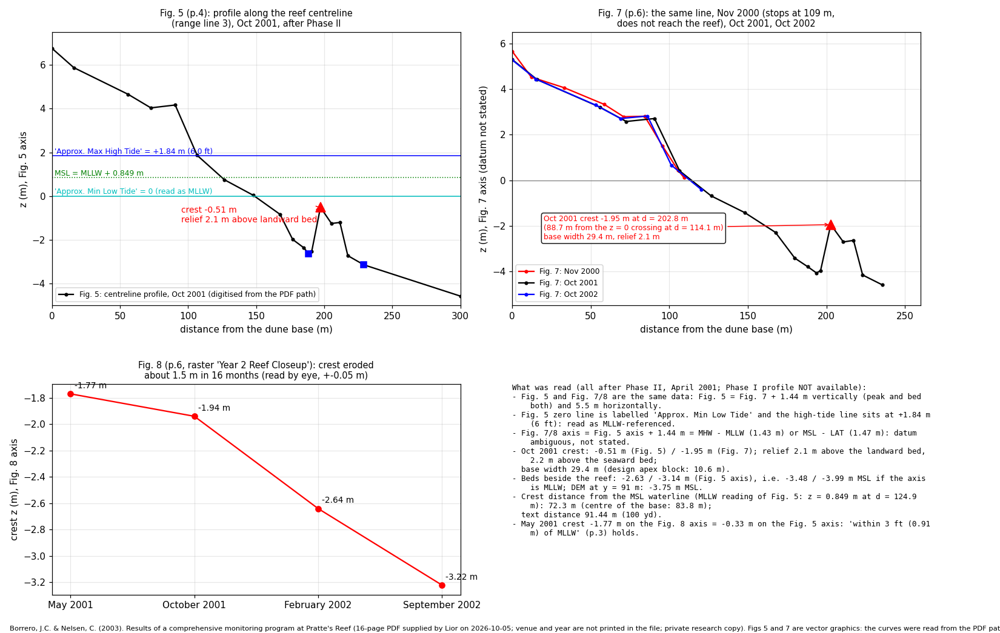

- **file**: `07_scale/shapes/prattes-reef-el-segundo/3d/annotated/A15_bn2003_fig5-8_reef_profiles_digitised.png`
- **kind**: cross_section
- **shows**: Cross-shore profiles along the reef centreline after Phase II: a ~30 m wide bump, Oct 2001 crest -1.95 m (Fig. 7 axis), relief 2.1-2.2 m, base width 29.4 m; the crest history May 2001 -1.77 m to Sept 2002 -3.22 m.
- **structure visible**: True
- **state shown**: as-built after Phase II, eroding (2001-2002)
- **image date**: surveys Nov 2000 - Sept 2002
- **citation**: Borrero, J.C. & Nelsen, C. (2003). Results of a comprehensive monitoring program at Pratte's Reef. Proc. 3rd International Surfing Reef Symposium, Raglan, New Zealand (venue/year per the project's earlier citation R23; the supplied 16-page PDF prints neither), pp.4-6, Figures 5-8 (centreline profiles, vector graphics digitised). PDF supplied by Lior (his Downloads\Pratte_results.pdf; original URL unknown; also on ResearchGate, publication 293137985). Accessed 2026-10-05.
- **image URL**: https://www.researchgate.net/publication/293137985
- **source page**: https://www.researchgate.net/publication/293137985
- **page / figure**: PDF pp.4-7, Figures 5-8 (digitised by bn_digitise.py)
- **credit**: J.C. Borrero & C. Nelsen; digitised by this project
- **licence**: copyright holder; private research copy, reuse not cleared
- **retrieved**: 2026-10-05
- **used for**: 3d_crest; 3d_height_slopes
- **How used for the model**: Digitised numbers (bn2003_digitised.json): relief 2.12-2.21 m above the bed, base 29.4 m, crest erosion ~1.5 m in 16 months; crest state C and the stack-height reasoning; axis datum ambiguous (MLLW vs MSL) so used as relief, not absolute depth (SOURCES_3D Run 3).
- **3D check pending**: no - none: already used
- **source PDF**: `07_scale/shapes/prattes-reef-el-segundo/src/borrero_nelsen_2003_prattes_monitoring_results.pdf`
- **linked records**: 07_scale/shapes/prattes-reef-el-segundo/3d/SOURCES_3D.md (RUN 3; annotated A15); 07_scale/shapes/prattes-reef-el-segundo/3d/src/bn2003_digitised.json
- **size**: 0.20 MB, 1650x1045 px
- **sha256**: 06f3d883472b04dbabedb717c5acbc0591263d6f35cc5f3d0e972d869c9490c4
- **rights**: Private research copy; reuse rights to be checked before any public release.
- **display in HTML**: True
- **added by**: image-registry backfill, 2026-10-06

## prattes-reef-el-segundo-img-31 - Borrero & Nelsen (2003) Fig. 9: georeferenced bathymetric contours around the reef (Oct 2000, Mar 2001) vs the NOAA DEM

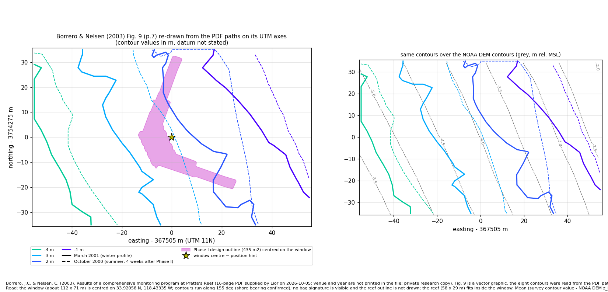

- **file**: `07_scale/shapes/prattes-reef-el-segundo/3d/annotated/A16_bn2003_fig9_bathymetry_utm.png`
- **kind**: survey_plot
- **shows**: UTM 11N window (E 367,449-367,561 m, N 3,754,239-3,754,311 m) with -1 .. -4 m contours; the reef is not drawn and no contour shows a bag signature; contours run along 155 deg.
- **structure visible**: False
- **state shown**: seabed around the reef (2000-2001)
- **image date**: surveys Oct 2000 (4 weeks after Phase I) and March 2001
- **citation**: Borrero, J.C. & Nelsen, C. (2003). Results of a comprehensive monitoring program at Pratte's Reef. Proc. 3rd International Surfing Reef Symposium, Raglan, New Zealand (venue/year per the project's earlier citation R23; the supplied 16-page PDF prints neither), p.7, Figure 9 (georeferenced bathymetric contours, UTM 11N), compared with the NOAA DEM. PDF supplied by Lior (his Downloads\Pratte_results.pdf; original URL unknown; also on ResearchGate, publication 293137985). Accessed 2026-10-05.
- **image URL**: https://www.researchgate.net/publication/293137985
- **source page**: https://www.researchgate.net/publication/293137985
- **page / figure**: PDF p.7, Figure 9 (vector contours digitised)
- **credit**: J.C. Borrero & C. Nelsen; digitised/annotated by this project
- **licence**: copyright holder; private research copy, reuse not cleared
- **retrieved**: 2026-10-05
- **used for**: 3d_seabed; scale
- **How used for the model**: Window centre 33.92058 N, 118.43335 W = new position hint; contour bearing 155 deg (+-2) supports the shore bearing; contour values +1.0..+2.0 m vs the NOAA DEM (datum not stated) (SOURCES_3D Run 3; bn2003_fig9_contours.json).
- **3D check pending**: no - none: already used
- **source PDF**: `07_scale/shapes/prattes-reef-el-segundo/src/borrero_nelsen_2003_prattes_monitoring_results.pdf`
- **linked records**: 07_scale/shapes/prattes-reef-el-segundo/3d/SOURCES_3D.md (RUN 3; annotated A16); 07_scale/shapes/prattes-reef-el-segundo/3d/src/bn2003_fig9_contours.json
- **size**: 0.21 MB, 1650x792 px
- **sha256**: 7243f4b716d0eacd4b280c306d94e0c09637817141f2a211b394252d9b762b5d
- **rights**: Private research copy; reuse rights to be checked before any public release.
- **display in HTML**: True
- **added by**: image-registry backfill, 2026-10-06

## prattes-reef-el-segundo-img-32 - Borrero & Nelsen (2003) pp.14 and 16 with the 30 m cross-shore extent and 1600 m3 / 200 bags sentences highlighted

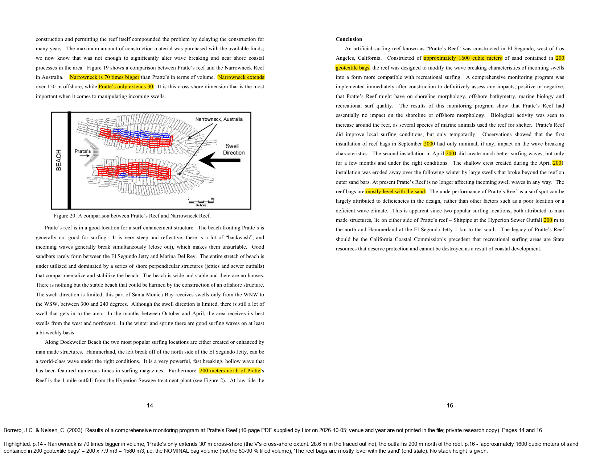

- **file**: `07_scale/shapes/prattes-reef-el-segundo/3d/annotated/A17_bn2003_p14_p16_text_highlighted.png`
- **kind**: diagram
- **shows**: Pages 14 and 16 with 'extends 30 m' (cross-shore), the Narrowneck comparison and 'approximately 1600 cubic meters of sand contained in 200 geotextile bags' highlighted.
- **structure visible**: False
- **state shown**: not applicable (text evidence)
- **image date**: 2003
- **citation**: Borrero, J.C. & Nelsen, C. (2003). Results of a comprehensive monitoring program at Pratte's Reef. Proc. 3rd International Surfing Reef Symposium, Raglan, New Zealand (venue/year per the project's earlier citation R23; the supplied 16-page PDF prints neither), pp.14 and 16. PDF supplied by Lior (his Downloads\Pratte_results.pdf; original URL unknown; also on ResearchGate, publication 293137985). Accessed 2026-10-05.
- **image URL**: https://www.researchgate.net/publication/293137985
- **source page**: https://www.researchgate.net/publication/293137985
- **page / figure**: PDF pp.14 and 16 (page crops, highlighted)
- **credit**: J.C. Borrero & C. Nelsen
- **licence**: copyright holder; private research copy, reuse not cleared
- **retrieved**: 2026-10-05
- **used for**: scale; 3d_height_slopes
- **How used for the model**: 30 m cross-shore extent checked against the 28.6 m traced outline (-4.7%); 1600 m3 = 200 x 7.9 nominal (unresolved volume gap 443 vs 695-782 m3) (SOURCES_3D Run 3; shape.json).
- **3D check pending**: no - none: text evidence already used
- **source PDF**: `07_scale/shapes/prattes-reef-el-segundo/src/borrero_nelsen_2003_prattes_monitoring_results.pdf`
- **linked records**: 07_scale/shapes/prattes-reef-el-segundo/3d/SOURCES_3D.md (RUN 3; annotated A17)
- **size**: 0.48 MB, 1654x1285 px
- **sha256**: 940a672db64488f1d747342702150305eb7d4c626301fc8d0c7c5d5d6777c2ab
- **rights**: Private research copy; reuse rights to be checked before any public release.
- **display in HTML**: True
- **added by**: image-registry backfill, 2026-10-06
