# Image registry - southern-ocean-surf-reef-albany

Source of truth: `images.json` in this folder (convention: `_agent_briefs/image_registry.md`; overview: `03_images/reefs/README.md`). This file is generated from it.

13 images registered, 13 with a file, 2 used for the model (any use other than context/not_used).

## southern-ocean-surf-reef-albany-img-01 - Albany surf reef already 'gaining a formidable reputation': a wave breaking in King George Sound with a bulk carrier at anchor (ABC)

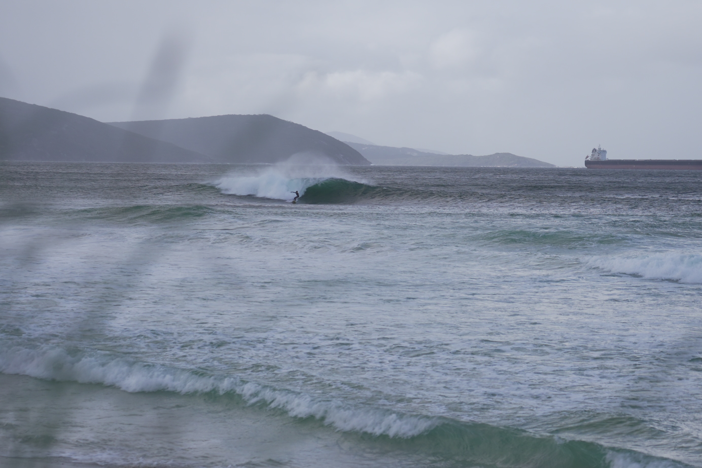

- **file**: `03_images/reefs/southern-ocean-surf-reef-albany/southern-ocean-surf-reef-albany_abc-wide-wave-ship_2025.jpg`
- **kind**: photo
- **shows**: Wide coastal shot: hills framing King George Sound, a surfer riding a peeling wave, an anchored bulk carrier offshore. The reef is fully submerged (crest -1.0 m AHD) so no structure is visible.
- **structure visible**: False
- **state shown**: as-built, in service (2025)
- **image date**: 2025 (article 2025-07-16; surf photos after the 2025 opening; construction photo before it)
- **citation**: ABC News: Daniel Mercer (2025-07-16). Photo in: Artificial reef at Middleton Beach transforms Albany's surf scene (article by Daniel Mercer; caption 'The Albany surf reef is already gaining a formidable reputation. (ABC News: Daniel Mercer)'). ABC News, https://www.abc.net.au/news/2025-07-16/southern-ocean-surf-reef-transforms-albany-wa/105530202. Image file https://live-production.wcms.abc-cdn.net.au/1acef1f70b0ceb5b17916201362c656d (card used a cropped/resized variant of the same file). Accessed 2026-10-06.
- **image URL**: https://live-production.wcms.abc-cdn.net.au/1acef1f70b0ceb5b17916201362c656d
- **source page**: https://www.abc.net.au/news/2025-07-16/southern-ocean-surf-reef-transforms-albany-wa/105530202
- **page / figure**: article photo 1 (caption: The Albany surf reef is already gaining a formidable reputation. (ABC News: Daniel Mercer))
- **credit**: ABC News: Daniel Mercer
- **licence**: ABC News copyright (all rights reserved; news editorial); link/research copy only - NOT cleared
- **retrieved**: 2026-10-06
- **used for**: context
- **How used for the model**: Page illustration of the reef working (hero candidate). No dimension read; no scale.
- **3D check pending**: YES - Break position and wave direction: where the wave peels relative to the headland, the ship and the beach could be compared with the design crest orientation 270-305 deg N and 140 m cross-shore position; weak (no scale) (values: planform, position)
- **linked records**: 02_research/reefs/southern-ocean-surf-reef-albany.json images[0]; 05_qa/reef/southern-ocean-surf-reef-albany_media_recheck.json images[0]
- **size**: 0.62 MB, 2768x1848 px
- **sha256**: 9e4074cc6ea3189589eb8ec97864055cfff635bd0d706b35e2cd9edf1c8bf3a8
- **rights**: Private research copy; reuse rights to be checked before any public release.
- **display in HTML**: True
- **added by**: image-registry backfill, 2026-10-06

## southern-ocean-surf-reef-albany-img-02 - A clean wave breaks on the Albany surf reef, seen through dune grass (ABC)

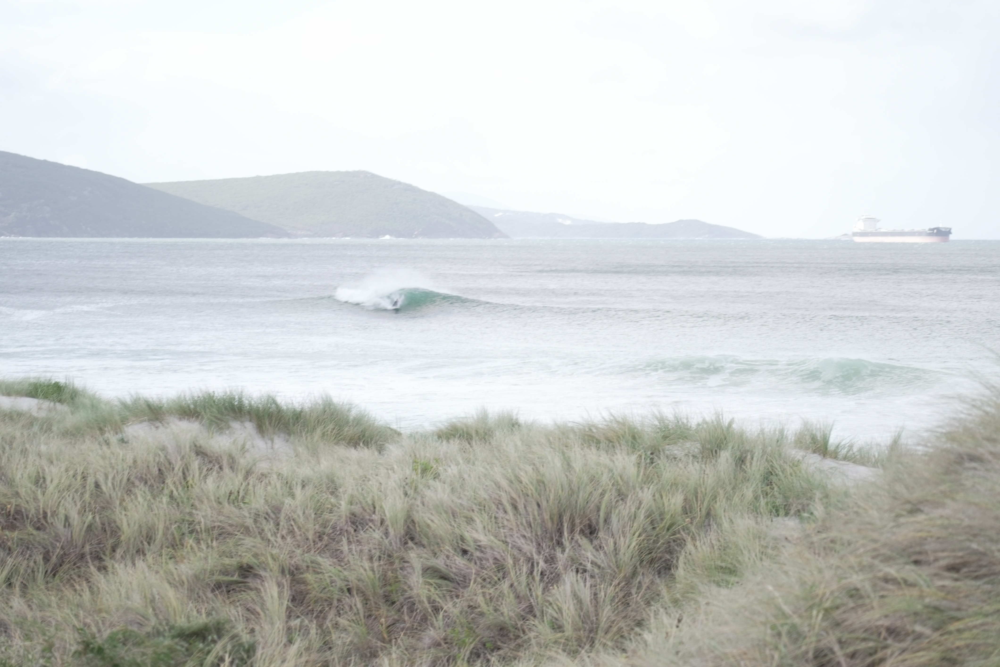

- **file**: `03_images/reefs/southern-ocean-surf-reef-albany/southern-ocean-surf-reef-albany_abc-clean-wave-dunes_2025.jpg`
- **kind**: photo
- **shows**: Beach-level shot through dune grass of a clean left-breaking wave peeling with a surfer visible; same hills and ship in the background.
- **structure visible**: False
- **state shown**: as-built, in service (2025)
- **image date**: 2025 (article 2025-07-16; surf photos after the 2025 opening; construction photo before it)
- **citation**: ABC News: Daniel Mercer (2025-07-16). Photo in: Artificial reef at Middleton Beach transforms Albany's surf scene (article by Daniel Mercer; caption 'A clean wave breaks on the Albany surf reef. (ABC News: Daniel Mercer)'). ABC News, https://www.abc.net.au/news/2025-07-16/southern-ocean-surf-reef-transforms-albany-wa/105530202. Image file https://live-production.wcms.abc-cdn.net.au/1927a3b21137e3775326b744d308276e (card used a cropped/resized variant of the same file). Accessed 2026-10-06.
- **image URL**: https://live-production.wcms.abc-cdn.net.au/1927a3b21137e3775326b744d308276e
- **source page**: https://www.abc.net.au/news/2025-07-16/southern-ocean-surf-reef-transforms-albany-wa/105530202
- **page / figure**: article photo 2 (caption: A clean wave breaks on the Albany surf reef. (ABC News: Daniel Mercer))
- **credit**: ABC News: Daniel Mercer
- **licence**: ABC News copyright (all rights reserved; news editorial); link/research copy only - NOT cleared
- **retrieved**: 2026-10-06
- **used for**: context
- **How used for the model**: Page illustration of the reef working (recommended hero image in the 2026-09-25 recheck). No dimension read.
- **3D check pending**: no - none: surf photo without scale
- **linked records**: 02_research/reefs/southern-ocean-surf-reef-albany.json images[1]; 05_qa/reef/southern-ocean-surf-reef-albany_media_recheck.json images[1]
- **size**: 1.08 MB, 4240x2832 px
- **sha256**: da01594327ef22f84221f4a7543feba7f31b4708df6ceb3f8fc43d82a00a2e0c
- **rights**: Private research copy; reuse rights to be checked before any public release.
- **display in HTML**: True
- **added by**: image-registry backfill, 2026-10-06

## southern-ocean-surf-reef-albany-img-03 - Specialised vessels building the Albany surf reef: a barge working over the submerged rock berm (ABC, supplied)

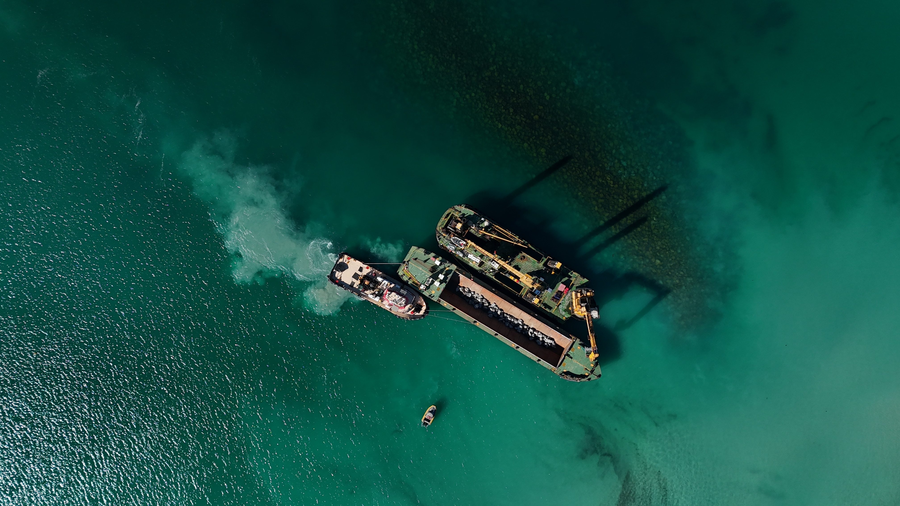

- **file**: `03_images/reefs/southern-ocean-surf-reef-albany/southern-ocean-surf-reef-albany_abc-vessels-building-reef_2025.jpg`
- **kind**: aerial
- **shows**: Aerial/drone shot of a dredge/crane barge and a tug working directly over a submerged elongated dark rock berm in turquoise water.
- **structure visible**: True
- **state shown**: under construction (about April-May 2025)
- **image date**: 2025 (article 2025-07-16; surf photos after the 2025 opening; construction photo before it)
- **citation**: 'Supplied' (photographer not named by ABC) (2025-07-16). Photo in: Artificial reef at Middleton Beach transforms Albany's surf scene (article by Daniel Mercer; caption 'Specialised vessels came from around the world to build the Albany surf reef. (Supplied)'). ABC News, https://www.abc.net.au/news/2025-07-16/southern-ocean-surf-reef-transforms-albany-wa/105530202. Image file https://live-production.wcms.abc-cdn.net.au/8ffae200f1ff9606775f71f627b5dc7e (card used a cropped/resized variant of the same file). Accessed 2026-10-06.
- **image URL**: https://live-production.wcms.abc-cdn.net.au/8ffae200f1ff9606775f71f627b5dc7e
- **source page**: https://www.abc.net.au/news/2025-07-16/southern-ocean-surf-reef-transforms-albany-wa/105530202
- **page / figure**: article photo 3 (caption: Specialised vessels came from around the world to build the Albany surf reef. (Supplied))
- **credit**: 'Supplied' (photographer not named by ABC)
- **licence**: ABC News copyright (all rights reserved; news editorial); link/research copy only - NOT cleared
- **retrieved**: 2026-10-06
- **used for**: context
- **How used for the model**: Page illustration of the construction state. No scale in the file, so not traced; the berm shape is consistent with the ~165 m footprint.
- **3D check pending**: YES - Planform and length: if the barge size is known (jack-up barge, tug) the berm outline could be scaled and compared with the design crest length 110 m @ -2 m AHD and the ~165 m footprint; also the berm's curvature (values: planform, volume)
- **linked records**: 02_research/reefs/southern-ocean-surf-reef-albany.json images[2]; 05_qa/reef/southern-ocean-surf-reef-albany_media_recheck.json images[2]
- **size**: 1.44 MB, 4032x2268 px
- **sha256**: 05c42e7327578a34d18227f9280ff3ffb5e34be7c4a460bcc3fc19c2e3b5f68c
- **rights**: Private research copy; reuse rights to be checked before any public release.
- **display in HTML**: True
- **added by**: image-registry backfill, 2026-10-06

## southern-ocean-surf-reef-albany-img-04 - Surfer bottom-turning on a breaking wave at the Albany reef (RWR)

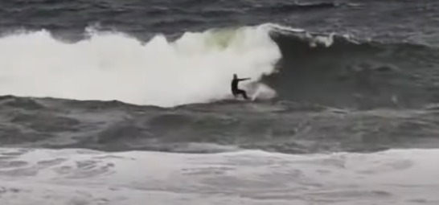

- **file**: `03_images/reefs/southern-ocean-surf-reef-albany/southern-ocean-surf-reef-albany_rwr-surfing-wave_2025.png`
- **kind**: photo
- **shows**: Surfer bottom-turning on a breaking wave with whitewater peeling left; reef submerged, not visible.
- **structure visible**: False
- **state shown**: as-built, in service (2025)
- **image date**: 2025 (upload path 2025/05)
- **citation**: Raised Water Research (2025). Midds Reef [spot profile page for the Albany / Southern Ocean Surf Reef]; image 'Southern Ocean Surf Reef Surfing Waves Artificial Reef'. https://raisedwaterresearch.com/spot/artificial-reef/australia/western-australia/albany-artificial-surf-reef/. Image file https://raisedwaterresearch.com/wp-content/uploads/2025/05/Southern-Ocean-Surf-Reef-Surfing-Waves-Artificial-Reef.png. Accessed 2026-10-06.
- **image URL**: https://raisedwaterresearch.com/wp-content/uploads/2025/05/Southern-Ocean-Surf-Reef-Surfing-Waves-Artificial-Reef.png
- **source page**: https://raisedwaterresearch.com/spot/artificial-reef/australia/western-australia/albany-artificial-surf-reef/
- **page / figure**: page gallery image 'Southern-Ocean-Surf-Reef-Surfing-Waves-Artificial-Reef.png'
- **credit**: Raised Water Research
- **licence**: Copyright Raised Water Research per the card (no licence on the page); link/research copy only - NOT cleared
- **retrieved**: 2026-10-06
- **used for**: context
- **How used for the model**: Page illustration of the surf effect. No dimension read.
- **3D check pending**: no - none: surf photo without scale
- **linked records**: 02_research/reefs/southern-ocean-surf-reef-albany.json images (card image); 05_qa/reef/southern-ocean-surf-reef-albany_media_recheck.json
- **size**: 0.15 MB, 546x255 px
- **sha256**: 97ffe155677ce636068626c22ac6c50220da084812b298f82d104d318ace7214
- **rights**: Private research copy; reuse rights to be checked before any public release.
- **display in HTML**: True
- **added by**: image-registry backfill, 2026-10-06

## southern-ocean-surf-reef-albany-img-05 - Aerial of the Albany artificial surf reef under construction, May 2025 (RWR)

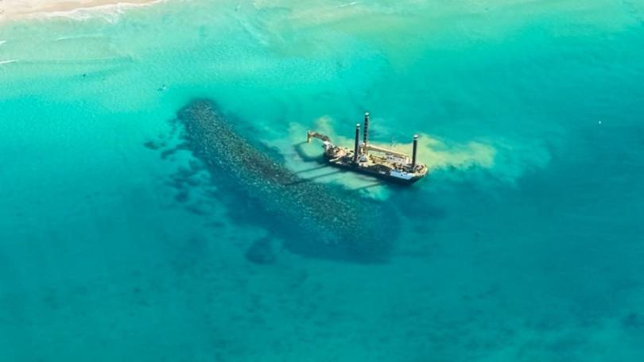

- **file**: `03_images/reefs/southern-ocean-surf-reef-albany/southern-ocean-surf-reef-albany_rwr-construction-overview_2025.jpg`
- **kind**: aerial
- **shows**: Aerial shot of the sandy beach and shallow turquoise water with a clear elongated dark submerged rock-berm shadow and a small dredge vessel alongside; embedded caption 'An aerial shot of the Great Southern's artificial surf reef under construction in May, 2025.'
- **structure visible**: True
- **state shown**: under construction (May 2025)
- **image date**: 2025-05 (embedded caption)
- **citation**: Raised Water Research (2025). Midds Reef [spot profile page for the Albany / Southern Ocean Surf Reef]; image 'Southern Ocean Surf Reef Albany artificial surf reef construction overview'. https://raisedwaterresearch.com/spot/artificial-reef/australia/western-australia/albany-artificial-surf-reef/. Image file https://raisedwaterresearch.com/wp-content/uploads/2025/05/Southern-Ocean-Surf-Reef-Albany-artificial-surf-reef-construction-overview.jpg. Accessed 2026-10-06.
- **image URL**: https://raisedwaterresearch.com/wp-content/uploads/2025/05/Southern-Ocean-Surf-Reef-Albany-artificial-surf-reef-construction-overview.jpg
- **source page**: https://raisedwaterresearch.com/spot/artificial-reef/australia/western-australia/albany-artificial-surf-reef/
- **page / figure**: page gallery image 'Southern-Ocean-Surf-Reef-Albany-artificial-surf-reef-construction-overview.jpg'
- **credit**: Raised Water Research (the file carries an embedded caption only; photographer not named)
- **licence**: Copyright Raised Water Research per the card (no licence on the page); link/research copy only - NOT cleared
- **retrieved**: 2026-10-06
- **used for**: context
- **How used for the model**: Page illustration of the construction state; oblique view with no scale, so not traced. The berm shadow is visible, so it could support a planform check.
- **3D check pending**: YES - Planform: the berm shadow outline vs the design crest length 110 m @ -2 m AHD and the ~165 m footprint, orientation 270-305 deg N, ~140 m offshore (values: planform, position)
- **linked records**: 02_research/reefs/southern-ocean-surf-reef-albany.json images (card image); 05_qa/reef/southern-ocean-surf-reef-albany_media_recheck.json
- **size**: 0.03 MB, 810x456 px
- **sha256**: df3460ac80d21764f04f4a7b044ed70a73644fd52c62c835cae03f8fa7b80b76
- **rights**: Private research copy; reuse rights to be checked before any public release.
- **display in HTML**: True
- **added by**: image-registry backfill, 2026-10-06

## southern-ocean-surf-reef-albany-img-06 - Excavator on a jack-up barge deploying rock for the Albany reef (RWR)

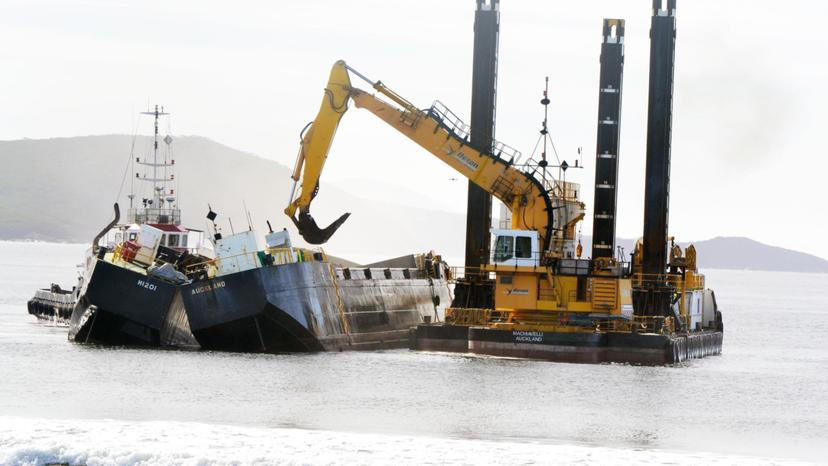

- **file**: `03_images/reefs/southern-ocean-surf-reef-albany/southern-ocean-surf-reef-albany_rwr-barge-deploy_2025.jpg`
- **kind**: photo
- **shows**: A tracked excavator on a jack-up work barge with spud legs, beside a tug, placing rock offshore; hills of the sound behind.
- **structure visible**: False
- **state shown**: under construction (2025)
- **image date**: 2025 (upload path 2025/05)
- **citation**: Raised Water Research (2025). Midds Reef [spot profile page for the Albany / Southern Ocean Surf Reef]; image 'Southern Ocean Surf Reef Barge Deploy'. https://raisedwaterresearch.com/spot/artificial-reef/australia/western-australia/albany-artificial-surf-reef/. Image file https://raisedwaterresearch.com/wp-content/uploads/2025/05/Southern-Ocean-Surf-Reef-Barge-Deploy.jpg. Accessed 2026-10-06.
- **image URL**: https://raisedwaterresearch.com/wp-content/uploads/2025/05/Southern-Ocean-Surf-Reef-Barge-Deploy.jpg
- **source page**: https://raisedwaterresearch.com/spot/artificial-reef/australia/western-australia/albany-artificial-surf-reef/
- **page / figure**: page gallery image 'Southern-Ocean-Surf-Reef-Barge-Deploy.jpg'
- **credit**: Raised Water Research (photographer not named)
- **licence**: Copyright Raised Water Research per the card (no licence on the page); link/research copy only - NOT cleared
- **retrieved**: 2026-10-06
- **used for**: context
- **How used for the model**: Page illustration of the construction method (rock placed from a jack-up barge). No dimension read.
- **3D check pending**: no - none: construction method photo
- **linked records**: 02_research/reefs/southern-ocean-surf-reef-albany.json images (not on the card; found on the RWR page 2026-10-06); 05_qa/reef/southern-ocean-surf-reef-albany_media_recheck.json
- **size**: 0.05 MB, 828x466 px
- **sha256**: e626ef011c6a39b98650e0e97b350032924495d4904e63bb86cda73648dbce67
- **rights**: Private research copy; reuse rights to be checked before any public release.
- **display in HTML**: True
- **added by**: image-registry backfill, 2026-10-06

## southern-ocean-surf-reef-albany-img-07 - Jack-up barge offshore of Middleton Beach with small waves breaking, at dusk (RWR)

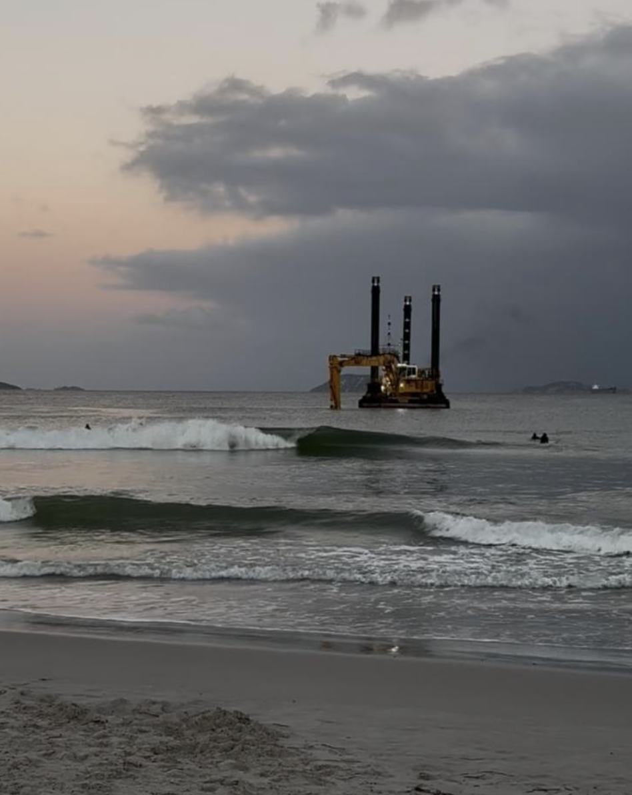

- **file**: `03_images/reefs/southern-ocean-surf-reef-albany/southern-ocean-surf-reef-albany_rwr-construction-2_2025.png`
- **kind**: photo
- **shows**: Dusk view from the beach of a jack-up barge with excavator working offshore, small waves breaking on the sandbar and two surfers in the water.
- **structure visible**: False
- **state shown**: under construction (2025)
- **image date**: 2025 (upload path 2025/05)
- **citation**: Raised Water Research (2025). Midds Reef [spot profile page for the Albany / Southern Ocean Surf Reef]; image 'Southern Ocean Surf Reef Albany Middleton Beach Construction 2'. https://raisedwaterresearch.com/spot/artificial-reef/australia/western-australia/albany-artificial-surf-reef/. Image file https://raisedwaterresearch.com/wp-content/uploads/2025/05/Southern-Ocean-Surf-Reef-Albany-Middleton-Beach-Construction-2.png. Accessed 2026-10-06.
- **image URL**: https://raisedwaterresearch.com/wp-content/uploads/2025/05/Southern-Ocean-Surf-Reef-Albany-Middleton-Beach-Construction-2.png
- **source page**: https://raisedwaterresearch.com/spot/artificial-reef/australia/western-australia/albany-artificial-surf-reef/
- **page / figure**: page gallery image 'Southern-Ocean-Surf-Reef-Albany-Middleton-Beach-Construction-2.png'
- **credit**: Raised Water Research (photographer not named)
- **licence**: Copyright Raised Water Research per the card (no licence on the page); link/research copy only - NOT cleared
- **retrieved**: 2026-10-06
- **used for**: context
- **How used for the model**: Page illustration of the construction site from the beach. No dimension read.
- **3D check pending**: YES - Barge distance offshore and break position from the beach could check the 140 m cross-shore design position (need camera position) (values: position)
- **linked records**: 02_research/reefs/southern-ocean-surf-reef-albany.json images (not on the card; found on the RWR page 2026-10-06); 05_qa/reef/southern-ocean-surf-reef-albany_media_recheck.json
- **size**: 0.94 MB, 948x1192 px
- **sha256**: 6c6cef623a17285d75835a6d24f2bd5ea52266d75d8b7fba4d3666ddd6587828
- **rights**: Private research copy; reuse rights to be checked before any public release.
- **display in HTML**: True
- **added by**: image-registry backfill, 2026-10-06

## southern-ocean-surf-reef-albany-img-08 - Granite boulder stockpiles at the quarry supplying the Albany reef (RWR)

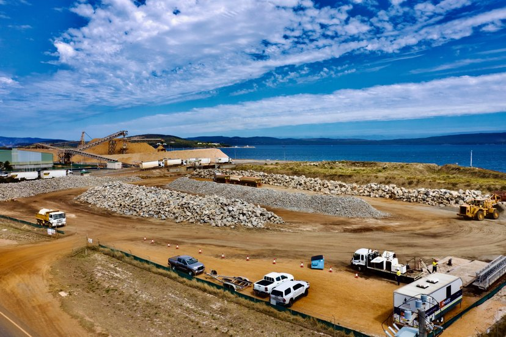

- **file**: `03_images/reefs/southern-ocean-surf-reef-albany/southern-ocean-surf-reef-albany_rwr-granite-quarry_2025.jpg`
- **kind**: photo
- **shows**: Quarry/port stockpiles of granite boulders and trucks beside the sound: the rock source, not the reef.
- **structure visible**: False
- **state shown**: not applicable (material supply)
- **image date**: 2025 (upload path 2025/05)
- **citation**: Raised Water Research (2025). Midds Reef [spot profile page for the Albany / Southern Ocean Surf Reef]; image 'Southern Ocean Surf Reef Granite Boulder Source'. https://raisedwaterresearch.com/spot/artificial-reef/australia/western-australia/albany-artificial-surf-reef/. Image file https://raisedwaterresearch.com/wp-content/uploads/2025/05/Southern-Ocean-Surf-Reef-Granite-Boulder-Source.jpg. Accessed 2026-10-06.
- **image URL**: https://raisedwaterresearch.com/wp-content/uploads/2025/05/Southern-Ocean-Surf-Reef-Granite-Boulder-Source.jpg
- **source page**: https://raisedwaterresearch.com/spot/artificial-reef/australia/western-australia/albany-artificial-surf-reef/
- **page / figure**: page gallery image 'Southern-Ocean-Surf-Reef-Granite-Boulder-Source.jpg'
- **credit**: Raised Water Research (photographer not named)
- **licence**: Copyright Raised Water Research per the card (no licence on the page); link/research copy only - NOT cleared
- **retrieved**: 2026-10-06
- **used for**: not_used
- **How used for the model**: Not used: shows the rock supply, not the reef, its site or its surf.
- **3D check pending**: no - none: not a reef image
- **linked records**: 02_research/reefs/southern-ocean-surf-reef-albany.json images (not on the card; found on the RWR page 2026-10-06); 05_qa/reef/southern-ocean-surf-reef-albany_media_recheck.json
- **size**: 0.12 MB, 828x552 px
- **sha256**: 5c5af46a3e795caa80441e1f21367444e653fa1db9c7e1abf76f836917f28aa8
- **rights**: Private research copy; reuse rights to be checked before any public release.
- **display in HTML**: False
- **added by**: image-registry backfill, 2026-10-06

## southern-ocean-surf-reef-albany-img-09 - Vessel track map between the quarry (Port of Albany) and Middleton Beach (RWR)

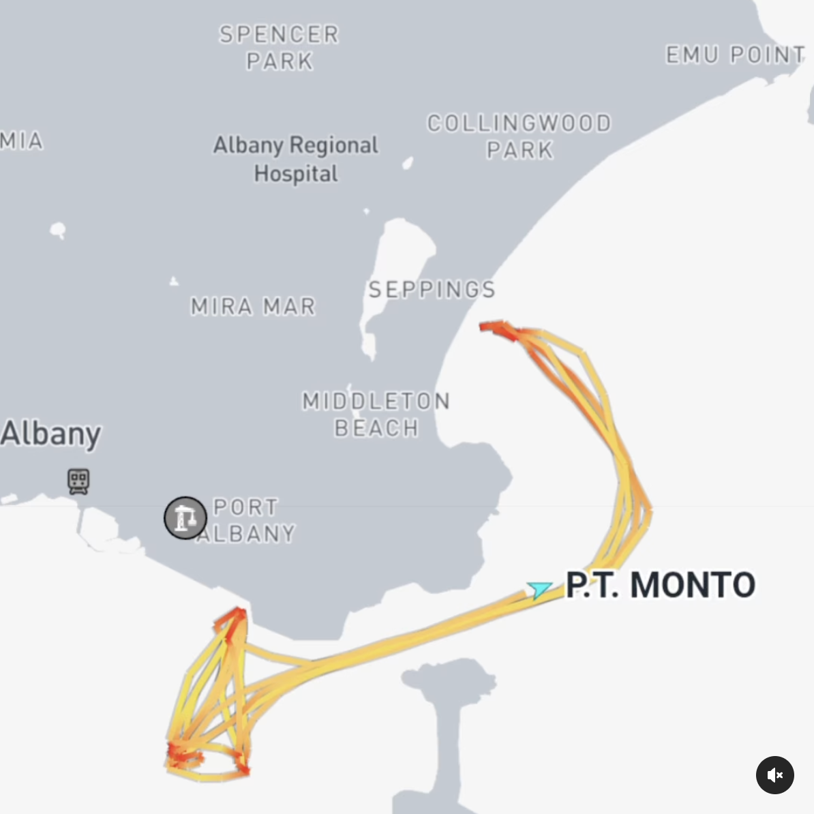

- **file**: `03_images/reefs/southern-ocean-surf-reef-albany/southern-ocean-surf-reef-albany_rwr-vessel-track-map_2025.png`
- **kind**: diagram
- **shows**: Map screenshot of AIS-style vessel tracks (vessel 'P.T. MONTO') running between the Port Albany area and the Middleton Beach site: the rock-carrying route.
- **structure visible**: False
- **state shown**: not applicable (logistics)
- **image date**: 2025 (upload path 2025/05)
- **citation**: Raised Water Research (2025). Midds Reef [spot profile page for the Albany / Southern Ocean Surf Reef]; image 'Southern Ocean Surf Reef Albany Middleton Beach Sourcing'. https://raisedwaterresearch.com/spot/artificial-reef/australia/western-australia/albany-artificial-surf-reef/. Image file https://raisedwaterresearch.com/wp-content/uploads/2025/05/Southern-Ocean-Surf-Reef-Albany-Middleton-Beach-Sourcing.png. Accessed 2026-10-06.
- **image URL**: https://raisedwaterresearch.com/wp-content/uploads/2025/05/Southern-Ocean-Surf-Reef-Albany-Middleton-Beach-Sourcing.png
- **source page**: https://raisedwaterresearch.com/spot/artificial-reef/australia/western-australia/albany-artificial-surf-reef/
- **page / figure**: page gallery image 'Southern-Ocean-Surf-Reef-Albany-Middleton-Beach-Sourcing.png'
- **credit**: Raised Water Research (map screenshot of a vessel-tracking service; provider not named)
- **licence**: Copyright Raised Water Research per the card (no licence on the page); link/research copy only - NOT cleared
- **retrieved**: 2026-10-06
- **used for**: not_used
- **How used for the model**: Not used: shows vessel tracks, not the reef or seabed.
- **3D check pending**: no - none: not a reef image
- **linked records**: 02_research/reefs/southern-ocean-surf-reef-albany.json images (not on the card; found on the RWR page 2026-10-06); 05_qa/reef/southern-ocean-surf-reef-albany_media_recheck.json
- **size**: 0.50 MB, 1194x1194 px
- **sha256**: dc43078f544039ab96e56cc32d11d766ba25c615158542de0ff5e20ecd0e9c74
- **rights**: Private research copy; reuse rights to be checked before any public release.
- **display in HTML**: False
- **added by**: image-registry backfill, 2026-10-06

## southern-ocean-surf-reef-albany-img-10 - City of Albany / Bluecoast design table and plan diagram: crest 110 m @ -2 m AHD, 140 m offshore, left-hander, 41% surfability

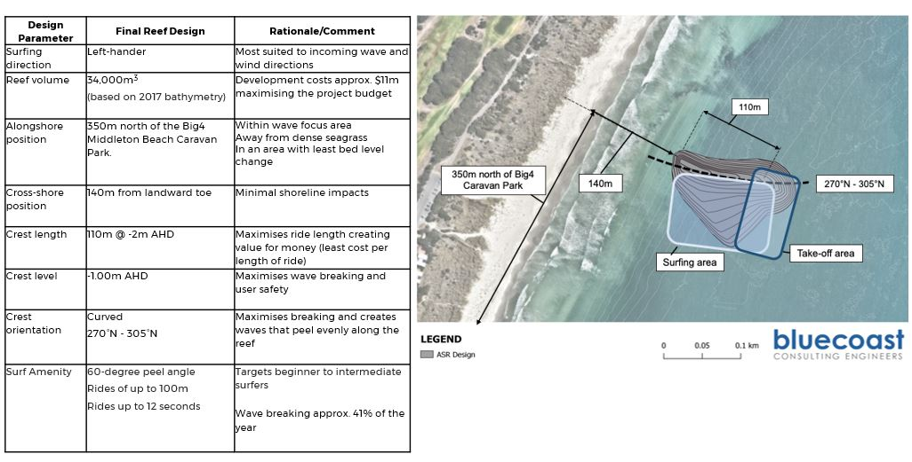

- **file**: `07_scale/shapes/southern-ocean-surf-reef-albany/src/design.jpg`
- **kind**: design_drawing
- **shows**: Left: Bluecoast design table (surfing direction left-hander, volume 54,000 m3 (2017 bathymetry), alongshore position 350 m north of the Big4 Middleton Beach Caravan Park, cross-shore 140 m from the landward toe, crest length 110 m @ -2 m AHD, crest level -1.00 m AHD, crest orientation curved 270-305 deg N, 60-degree peel angle, rides up to 100 m / 12 s, surfable ~41% of the year). Right: plan diagram of the ASR design over an aerial with the 110 m crest, 140 m offshore and 350 m alongshore labels, surfing and take-off areas.
- **structure visible**: True
- **state shown**: design (Bluecoast final design, before construction)
- **image date**: design stage (before 2025 construction; design volume based on 2017 bathymetry)
- **citation**: City of Albany / Bluecoast Consulting Engineers (n.d.; design based on 2017 bathymetry). Southern Ocean Surf Reef (SOSR) - Final Reef Design table and plan diagram. City of Albany, completed-projects page, https://www.albany.wa.gov.au/council/projects/completed-projects/southern-ocean-surf-reef-sosr.aspx. Image file https://www.albany.wa.gov.au/Profiles/albany/Assets/ClientData/Surf_Reef/design.jpg. Accessed 2026-10-04 (identical copy re-fetched 2026-10-06).
- **image URL**: https://www.albany.wa.gov.au/Profiles/albany/Assets/ClientData/Surf_Reef/design.jpg
- **source page**: https://www.albany.wa.gov.au/council/projects/completed-projects/southern-ocean-surf-reef-sosr.aspx
- **page / figure**: design table + plan diagram (1026 x 521 px)
- **credit**: City of Albany / Bluecoast Consulting Engineers
- **licence**: City of Albany (local government); no licence stated - link/research copy only, NOT cleared
- **retrieved**: 2026-10-04
- **used for**: cross_check; scale
- **How used for the model**: Source of the design parameters in the card (crest length 110 m, offshore 140 m, crest -1.0 m AHD, orientation 270-305 deg N, 54,000 m3). The plan diagram carries a 0.05/0.1 km scale bar but the shape was not traced (no sources.md / shape.json for Albany yet); the as-built outline must be traced on esri_current_2026-01-20_z18.png.
- **3D check pending**: YES - Crest -1.0 m AHD vs the as-built crest; 110 m crest length and 140 m offshore vs the dark berm outline on the 2026-01-20 Esri image; volume 54,000 m3 (values: crest_z, planform, volume, position)
- **linked records**: 02_research/reefs/southern-ocean-surf-reef-albany.json images[5]; 05_qa/reef/southern-ocean-surf-reef-albany_media_recheck.json images[5]
- **size**: 0.10 MB, 1026x521 px
- **sha256**: e546ed448473eb3bf1a3d7f49bf9b56f5f645875a853322343f96f646832d65f
- **rights**: Private research copy; reuse rights to be checked before any public release.
- **display in HTML**: True
- **added by**: image-registry backfill, 2026-10-06

## southern-ocean-surf-reef-albany-img-11 - Southern-Ocean-Surf-Reef-Design-by-Bluecoast.png: Bluecoast plan diagram (RWR copy; scale bar 0.05 / 0.1 km)

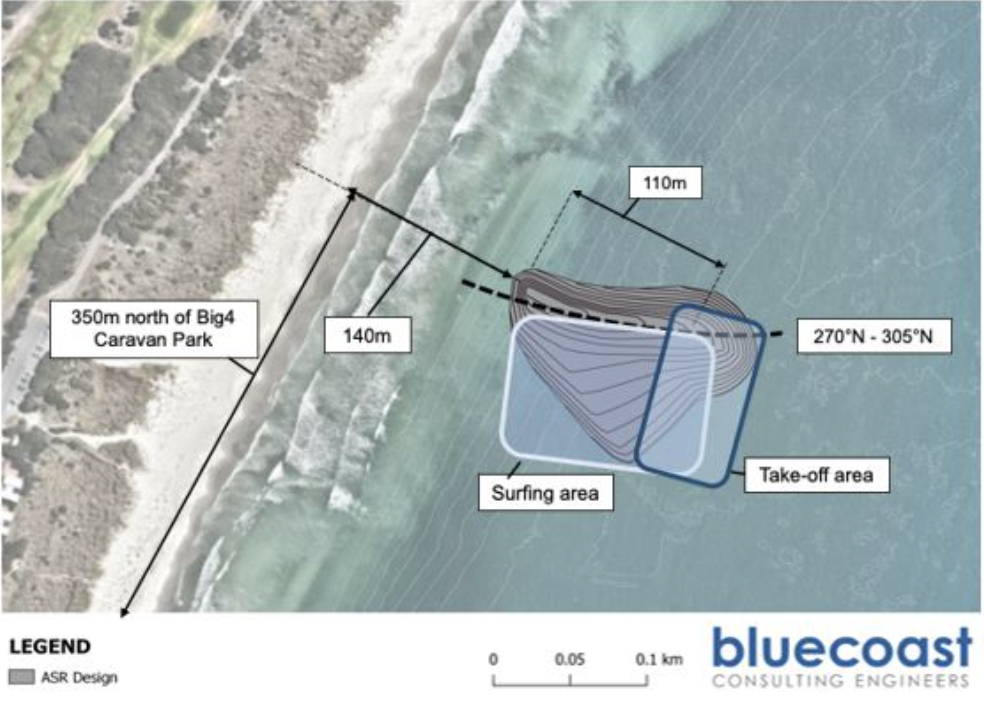

- **file**: `07_scale/shapes/southern-ocean-surf-reef-albany/src/rwr_bluecoast_design_diagram.png`
- **kind**: design_drawing
- **shows**: Plan diagram of the ASR design over an aerial: 110 m crest, 140 m offshore, 350 m north of Big4 Caravan Park, 270-305 deg N crest orientation, surfing and take-off areas, bathymetric contours, scale bar 0-0.05-0.1 km.
- **structure visible**: True
- **state shown**: design (Bluecoast final design)
- **image date**: design stage (before 2025 construction)
- **citation**: Bluecoast Consulting Engineers (n.d.), via Raised Water Research (2025). Southern Ocean Surf Reef Design by Bluecoast [plan diagram] on: Midds Reef [spot page]. https://raisedwaterresearch.com/spot/artificial-reef/australia/western-australia/albany-artificial-surf-reef/. Image file https://raisedwaterresearch.com/wp-content/uploads/2019/12/Souther-Ocean-Surf-Reef-Design-by-Bluecoast.png (file name misspelled 'Souther'). Accessed 2026-10-04 (sha256 re-verified 2026-10-06).
- **image URL**: https://raisedwaterresearch.com/wp-content/uploads/2019/12/Souther-Ocean-Surf-Reef-Design-by-Bluecoast.png
- **source page**: https://raisedwaterresearch.com/spot/artificial-reef/australia/western-australia/albany-artificial-surf-reef/
- **page / figure**: page gallery image (984 x 702 px)
- **credit**: Bluecoast Consulting Engineers via Raised Water Research
- **licence**: not stated - NOT cleared
- **retrieved**: 2026-10-04
- **used for**: cross_check; scale
- **How used for the model**: Higher-resolution version of the plan diagram in design.jpg: a candidate for tracing the design planform with its scale bar; not traced yet (no shape.json for Albany).
- **3D check pending**: YES - Trace the design planform and contours using the scale bar and compare with the as-built dark berm on the 2026-01-20 Esri image and with crest -1.0 m AHD (values: planform, crest_z, seabed)
- **linked records**: 07_scale/shapes/southern-ocean-surf-reef-albany/src/design.jpg
- **size**: 0.95 MB, 984x702 px
- **sha256**: 7cc2069f3e075e06928eec152a9619718468d084dd9c7807a8081990b5b99706
- **rights**: Private research copy; reuse rights to be checked before any public release.
- **display in HTML**: True
- **added by**: image-registry backfill, 2026-10-06

## southern-ocean-surf-reef-albany-img-12 - Esri Wayback release 13192, Middleton Beach, z18, r=250 m (2025-01-16, before construction)

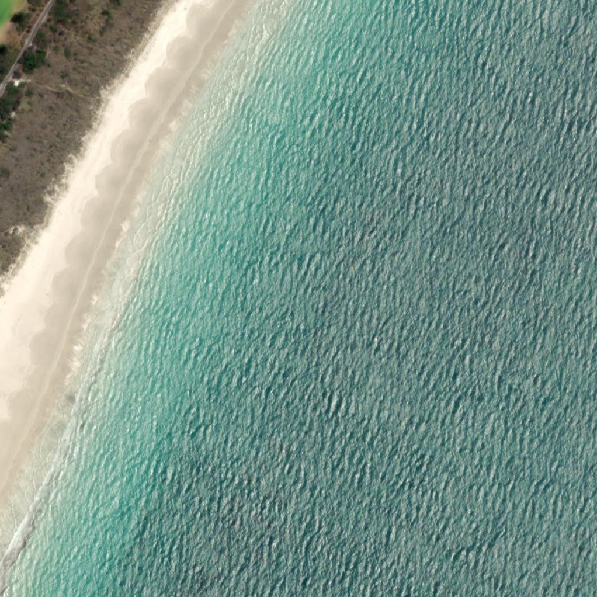

- **file**: `07_scale/shapes/southern-ocean-surf-reef-albany/src/esri_wayback13192_2025-01-16_z18.png`
- **kind**: satellite
- **shows**: Beach and nearshore water with ripple texture; no structure (before the reef was built in 2025).
- **structure visible**: False
- **state shown**: pre-construction (2025-01-16)
- **image date**: 2025-01-16
- **citation**: Esri, Maxar, Earthstar Geographics, and the GIS User Community (2025). World Imagery Wayback release 13192, image captured 2025-01-16. Esri World Imagery tile service, https://server.arcgisonline.com/ArcGIS/rest/services/World_Imagery/MapServer, via Esri Wayback https://livingatlas.arcgis.com/wayback/. Accessed 2026-10-04.
- **image URL**: https://wayback.maptiles.arcgis.com/arcgis/rest/services/World_Imagery/WMTS/1.0.0/default028mm/MapServer/tile/13192/{z}/{y}/{x}
- **source page**: Esri World Imagery Wayback
- **page / figure**: centre -35.018, 117.9207, r=250 m, z18, 1022 x 1022 px, 0.489 m/px; sidecar esri_wayback13192_2025-01-16_z18.png.geo.json
- **credit**: Esri, Maxar, Earthstar Geographics, and the GIS User Community
- **licence**: Esri/Maxar imagery terms (not an open licence); private research copy only
- **retrieved**: 2026-10-04
- **used for**: context
- **How used for the model**: Pre-construction baseline of the site (no reef): comparison with the 2026 frame isolates the reef. Not traced.
- **3D check pending**: YES - Seabed/sand-bar pattern before construction vs the design bathymetry (2017) and the berm position (values: seabed)
- **linked records**: 07_scale/shapes/southern-ocean-surf-reef-albany/src/esri_wayback13192_2025-01-16_z18.png.geo.json
- **size**: 1.54 MB, 1022x1022 px
- **sha256**: 1296953655b9d5f218694b4afdf60467774b4f69ffcdf7558b8dcb0701e1e6c2
- **rights**: Private research copy; reuse rights to be checked before any public release.
- **display in HTML**: True
- **added by**: image-registry backfill, 2026-10-06

## southern-ocean-surf-reef-albany-img-13 - Esri World Imagery current, Middleton Beach, z18, r=250 m (2026-01-20)

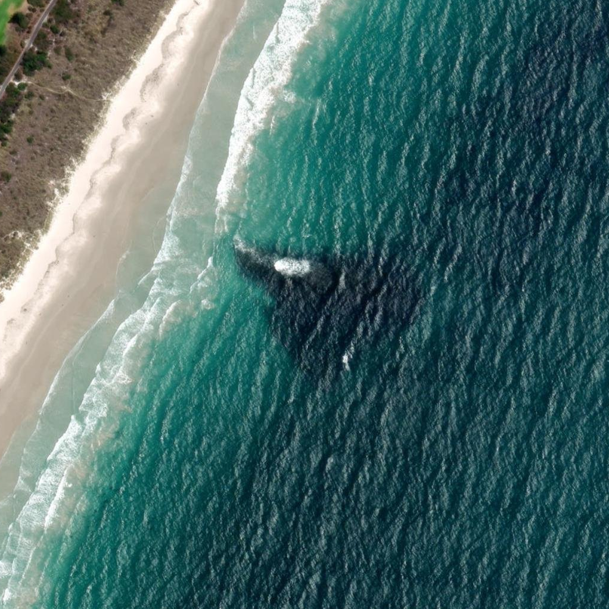

- **file**: `07_scale/shapes/southern-ocean-surf-reef-albany/src/esri_current_2026-01-20_z18.png`
- **kind**: satellite
- **shows**: The completed reef visible as a dark triangular/wedge-shaped patch offshore with a wave breaking at its shoreward apex; beach, dunes and surf zone around it.
- **structure visible**: True
- **state shown**: as-built, in service (2026-01-20)
- **image date**: 2026-01-20
- **citation**: Esri, Maxar, Earthstar Geographics, and the GIS User Community (2026). World Imagery (current layer), image captured 2026-01-20. Esri World Imagery tile service, https://server.arcgisonline.com/ArcGIS/rest/services/World_Imagery/MapServer. Accessed 2026-10-04.
- **image URL**: https://server.arcgisonline.com/ArcGIS/rest/services/World_Imagery/MapServer/tile/{z}/{y}/{x}
- **source page**: Esri World Imagery (identify DATE field)
- **page / figure**: centre -35.018, 117.9207, r=250 m, z18, 1022 x 1022 px, 0.489 m/px; sidecar esri_current_2026-01-20_z18.png.geo.json
- **credit**: Esri, Maxar, Earthstar Geographics, and the GIS User Community
- **licence**: Esri/Maxar imagery terms (not an open licence); private research copy only
- **retrieved**: 2026-10-04
- **used for**: context
- **How used for the model**: Best satellite view of the as-built reef (visible dark berm + breaking wave). The planform has not been traced yet (no shape.json); this is the primary candidate image for the trace and for the crest length / 140 m offshore check.
- **3D check pending**: YES - Trace the dark berm (length vs 110 m crest @ -2 m AHD, 165 m footprint; distance offshore vs 140 m; orientation vs 270-305 deg N) and set shape.json/3D from it (values: planform, position, volume)
- **linked records**: 07_scale/shapes/southern-ocean-surf-reef-albany/src/esri_current_2026-01-20_z18.png.geo.json
- **size**: 1.49 MB, 1022x1022 px
- **sha256**: ce13860296c89262a48e7f69cf359d4aa61e26b0aeceaaf115bcae3d496aa4db
- **rights**: Private research copy; reuse rights to be checked before any public release.
- **display in HTML**: True
- **added by**: image-registry backfill, 2026-10-06
